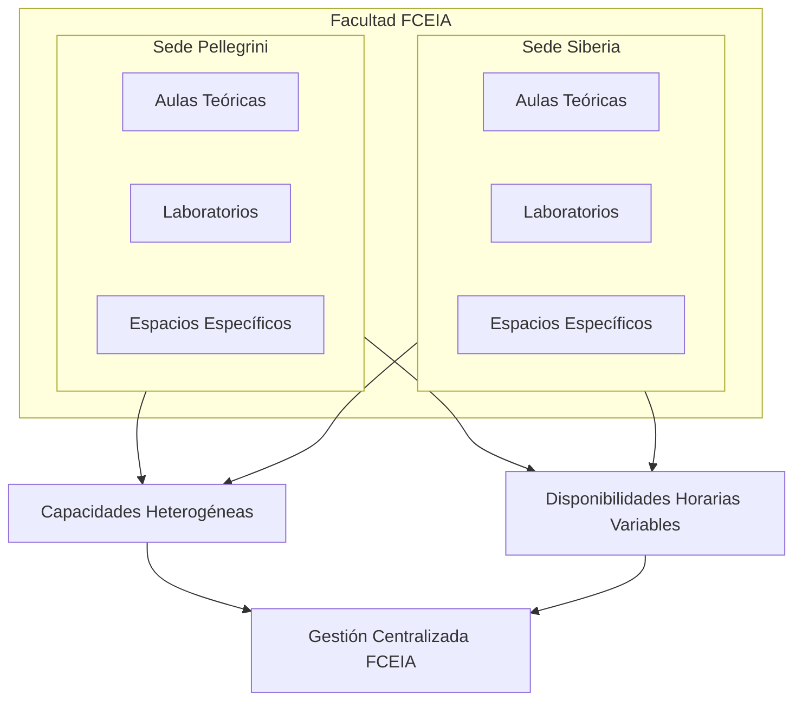
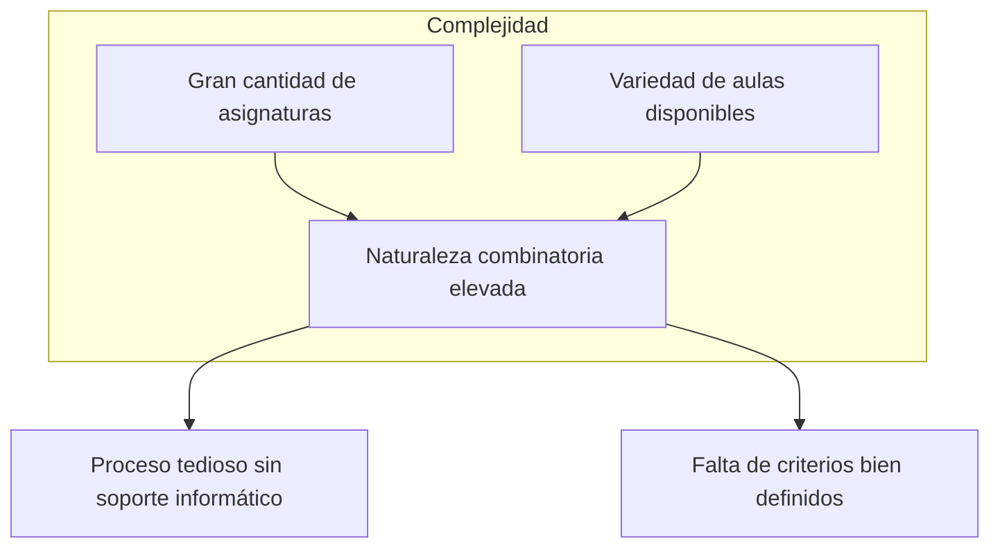
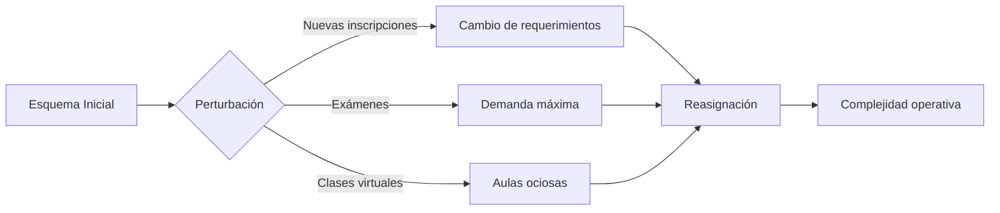
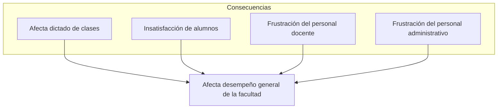

# Diseño de un Sistema de Información para la Asignación de Aulas

> **Empresa:** Facultad de Ciencias Exactas, Ingeniería y Agrimensura - UNR

---

## Objetivo General

Optimizar la asignación de aulas para mejorar el uso de la capacidad instalada y reducir problemas operativos relacionados a la gestión inadecuada para el dictado de asignaturas.

---

## Objetivos Específicos

1. Modelizar la problemática, sus variables y restricciones.
2. Definir distintas reglas y restricciones de asignación.
3. Proponer distintos modelos y técnicas de optimización basado en las reglas y restricciones definidas.
4. Desarrollar el soporte informático necesario para el registro de los datos relevantes y la implementación de las técnicas o heurísticas definidas.
5. Generar distintos esquemas de asignación de aulas en función de los modelos propuestos y compararlas.

---

## Descripción del Entorno del Problema

La **Facultad de Ciencias Exactas, Ingeniería y Agrimensura (FCEIA)** de la Universidad Nacional de Rosario dicta múltiples carreras de grado, posgrado y tecnicaturas. 

El proyecto abarcará **todas las carreras de la FCEIA**, las cuales se dictan en dos sedes:
- **Sede Pellegrini**: donde coexisten cursos y actividades académicas de distintas carreras.
- **Sede Siberia**: donde se dictan algunas materias de las carreras de la facultad.

### Características de las Aulas

Ambas sedes cuentan con aulas de diversas tipologías (teóricas, laboratorios y espacios con equipamiento específico), con capacidades y disponibilidades horarias heterogéneas. Todas las aulas contempladas en el sistema son de **uso exclusivo de la FCEIA** y su gestión se administra centralmente para cubrir el dictado de clases presenciales.

> **Alcance:** En el presente proyecto se abarcarán solo las clases "comunes", excluyendo del análisis laboratorios y clases prácticas con requerimientos especiales.

---

## Fundamentos de la Elección

### Situación Actual

Hoy en día el proceso de asignación de aulas para el dictado de las asignaturas se realiza:
- A principio de cada cuatrimestre
- De forma **manual**
- Basado en las asignaciones anteriores
- **Antes** de conocida la cantidad de inscriptos en cada asignatura

### Naturaleza del Problema

Más allá de estas limitaciones de información, el problema es de **naturaleza combinatoria elevada** dada la gran cantidad de asignaturas que se dictan en la facultad y la cantidad y variedad de aulas disponibles.

### Escenarios Dinámicos Post-Inicio de Clases

Una vez iniciado el dictado de clases se pueden presentar distintos escenarios que pueden requerir cambios puntuales (permanentes o transitorios) en el esquema inicial:

| Escenario | Descripción | Impacto |
|-----------|-------------|---------|
| **Nuevas inscripciones** | Las inscripciones continúan abiertas durante un periodo luego de comenzadas las clases | Los requerimientos de capacidad pueden cambiar sensiblemente |
| **Exámenes** | En fechas de examen la asistencia tiende a ser máxima | Se requieren aulas de mayor capacidad, generando conflictos con asignaciones existentes |
| **Clases virtuales** | A menudo no queda registrado el dictado virtual | Aulas desocupadas pero reservadas |

> **Nota:** Hay eventos como paros y clima que también afectan la asistencia, pero solo se abarcarán aquellos que están bajo la órbita y control del personal docente y administrativo de la facultad.

---

## Problemas Operativos Identificados

Durante el ciclo lectivo se producen diversos problemas puntuales:

- 🚫 **Alumnos que pierden clases** por no entrar físicamente en el aula
- 📦 **Alta densidad de alumnos y bancos**, entorpeciendo el paso y generando condiciones ergonómicas pobres
- 🚶 **Grandes movimientos en los pasillos** de alumnos llevando bancos de aulas donde sobran a donde faltan
- ⏰ **Demoras en el inicio** de una clase o examen por falta de previsibilidad

---

## Oportunidad

Se presenta la oportunidad de:

1. **Formalizar y parametrizar** reglas operativas
2. **Aplicar modelos de optimización** para obtener distintos esquemas de asignación
3. **Ajustar** los esquemas a distintos criterios institucionales
4. **Implementar** el adecuado soporte tecnológico para gestionar el proceso

---

## Competencias del Ingeniero Industrial Vinculadas al Proyecto

> *Diseñar, proyectar, calcular, modelar y planificar las operaciones y procesos de producción, distribución y comercialización de productos (bienes y servicios).*
