# Modelo de Entidad-Relación del Sistema de Asignación de Aulas

> **⚠️ Nota sobre vigencia**: Este documento representa el **modelo conceptual original (v1)** del
> sistema, elaborado durante la etapa de planteo inicial. Incluye entidades conceptuales como
> `Inscripción`, `Asistencia` y `AsignacionAula` que forman parte del modelo teórico completo
> pero **aún no están implementadas** (fueron diferidas para etapas futuras).
>
> El modelo **efectivamente implementado** se encuentra en:
> - **`1. Diseño/diagrama-entidades.md`** — Diagrama UML de clases con políticas de borrado
> - **`1. Diseño/modelo-planificacion-cursada.md`** — Modelo detallado del flujo Schedule → Plan → Clases
>
> Las diferencias principales entre este modelo conceptual y la implementación son:
> - `AsignacionAulaDB` fue eliminada; la asignación de aula es ahora un campo directo en `ClaseDB.aula_id`
> - `Inscripción`, `Asistencia`, `Alumno` y `Profesor` están fuera de alcance actual
> - Se agregaron `ScheduleDB`, `ScheduleEntryDB`, `PlanificacionCursadaDB` como entidades de gestión
> - El versionado de planes de estudio (`PlanCarreraVersionDB`, `CicloPlanVersionDB`) reemplaza la relación simple Materia↔Carrera

Este documento presenta el modelo conceptual completo del Sistema de Información para la Asignación de Aulas de la Facultad de Ciencias Exactas, Ingeniería y Agrimensura (FCEIA) de la Universidad Nacional de Rosario. El diseño sigue un enfoque de modelado en capas que permite derivar entidades abstractas a partir de las entidades del dominio real.

---

## 1. Introducción al Modelado del Dominio

### 1.1 Enfoque Metodológico

El modelado del sistema se estructura en tres capas conceptuales:

1. **Dominio del Problema (Completo)**: Todas las entidades de existencia real y sus relaciones en el contexto universitario
2. **Dominio del Problema (Delimitado)**: Subconjunto de entidades directamente relevantes para el problema de asignación
3. **Dominio de la Solución**: Entidades abstractas derivadas para gestionar las relaciones complejas

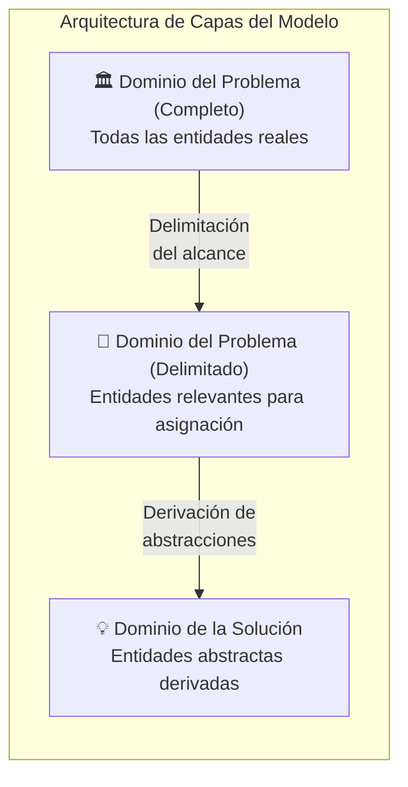

### 1.2 Problemática Central

La problemática que motiva este sistema es la **ineficiente asignación de aulas** que se produce debido a:

- La **naturaleza combinatoria elevada** del problema, dada la gran cantidad de asignaturas y aulas disponibles
- La **falta de información** para tomar decisiones informadas previo al inicio de clases
- La **complejidad de las relaciones** entre las entidades del dominio, particularmente la prevalencia de relaciones muchos-a-muchos (M:M)

### 1.3 Objetivos del Sistema

- Optimizar el uso de las aulas disponibles
- Minimizar problemas de falta de capacidad para el dictado de clases
- Maximizar el uso de la capacidad instalada en todo momento
- Permitir ajustes dinámicos durante el ciclo lectivo

---

## 2. Dominio del Problema (Completo)

El primer paso del modelado consiste en identificar todas las entidades de existencia real que intervienen en el contexto universitario. Estas son entidades concretas, no abstracciones de software, y de cuya relación e interacción se desprende la problemática a resolver.

### 2.1 Entidades del Problema Completo

| Entidad | Descripción | Atributos Principales |
|---------|-------------|----------------------|
| **Alumno** | Estudiante inscripto en la facultad | legajo, email, nombre, dni |
| **Materia** | Asignatura académica del plan de estudios | codigo, nombre, cupo, horas_semanales |
| **Comisión** | División de una materia para distribuir alumnos | id, materia_codigo, nombre, numero, cupo |
| **Clase** | Instancia de dictado en un horario específico | id, comision_id, horario_id, dia |
| **Aula** | Espacio físico donde se dictan las clases | codigo, capacidad, tipo |
| **Horario_Cronograma** | Franja horaria del cronograma académico | id, dia_semana, hora_inicio, hora_fin |
| **Profesor** | Docente de la facultad | id, nombre, email, dni |
| **Carrera** | Programa académico de grado | codigo, nombre, titulo_otorgado |
| **Facultad** | Unidad académica | nombre, direccion, telefono |

### 2.2 Diagrama ER del Problema Completo

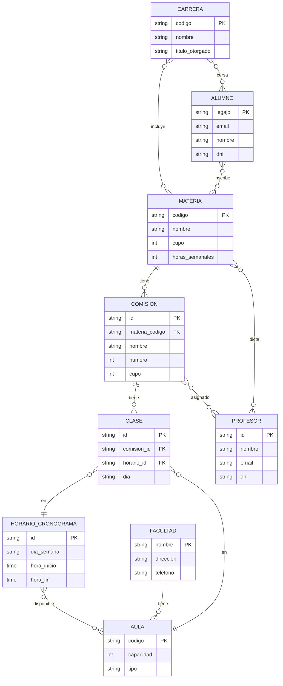

### 2.3 Análisis de Relaciones M:M

La complejidad del problema radica en la abundancia de relaciones muchos-a-muchos entre las entidades:

| Relación | Descripción | Implicancia |
|----------|-------------|-------------|
| **Alumno ↔ Materia** | Un alumno cursa muchas materias; una materia tiene muchos alumnos | Requiere gestión de inscripciones |
| **Profesor ↔ Materia** | Un profesor dicta muchas materias; una materia puede tener varios profesores | Asignación de docentes |
| **Materia ↔ Aula** | Una materia puede darse en distintas aulas; un aula aloja muchas materias | Relación indirecta via Clase |
| **Materia ↔ Horario** | Una materia tiene varios horarios; en un horario se dictan muchas materias | Cronograma complejo |
| **Horario ↔ Aula** | Toda aula está disponible en todos los horarios (a priori) | Espacio de búsqueda amplio |
| **Carrera ↔ Materia** | Una carrera tiene muchas materias; una materia puede pertenecer a varias carreras | Plan de estudios compartido |
| **Carrera ↔ Alumno** | Un alumno puede cursar varias carreras; una carrera tiene muchos alumnos | Múltiples inscripciones |

Estas relaciones M:M dificultan:
- La gestión directa de asignaciones
- El seguimiento de inscripciones y asistencia
- La optimización de recursos

---

## 3. Dominio del Problema (Delimitado)

### 3.1 Justificación de la Delimitación

No todas las entidades del dominio completo son relevantes para el diseño de la solución de asignación de aulas. La delimitación se basa en identificar las entidades que son **causa directa** de la problemática.

#### Entidades Excluidas y Justificación

| Entidad | Razón de Exclusión |
|---------|-------------------|
| **Profesor** | No afecta la capacidad ni disponibilidad de aulas. Tendrá un rol de gestión en el sistema, pero no interviene en el algoritmo de asignación. |
| **Carrera** | La asignación es por Clase, no por Carrera. No introduce complejidad adicional al problema de asignación según los parámetros definidos. |
| **Facultad** | Se asume una única sede (Pellegrini) para el alcance del proyecto. Las aulas son de uso exclusivo de la FCEIA. |
| **Relación Materia↔Aula** | Redundante: la asignación real es Clase↔Aula, no Materia↔Aula. Las materias no tienen aulas fijas. |

#### Entidades Reincorporadas al Modelo

Sin embargo, para efectos de validación y gestión académica, se reincorporan al modelo:

| Entidad | Razón de Inclusión |
|---------|-------------------|
| **Carrera** | Permite validar que los horarios de materias del mismo año/cuatrimestre no se superpongan (factibilidad para alumnos) |
| **Profesor** | Permite asignar docentes a comisiones y clases para gestión académica |
| **Ciclo** | Período lectivo que contextualiza las asignaciones temporalmente |
| **Dictado** | Instancia de una materia en un ciclo específico, permite manejar materias anuales vs cuatrimestrales |

### 3.2 Entidades del Problema Delimitado

| Entidad | Atributos | Descripción |
|---------|-----------|-------------|
| **Alumno** | legajo, email, nombre, dni | Estudiante inscripto en la facultad |
| **Materia** | codigo, nombre, cupo, horas_semanales, periodo, anio_carrera, cuatrimestre_carrera | Asignatura académica con ubicación en el plan de estudios |
| **Comisión** | id, materia_codigo, dictado_id, nombre, numero, cupo | División de una materia para un dictado específico |
| **Carrera** | codigo, nombre, titulo_otorgado, duracion_anios | Carrera universitaria |
| **Profesor** | id, nombre, email, dni | Docente de la facultad |
| **Ciclo** | id, anio, numero, fecha_inicio, fecha_fin | Período lectivo (cuatrimestre) |
| **Dictado** | id, materia_codigo, ciclo_id, tipo, activo | Instancia de materia en un ciclo |
| **Aula** | id, sede, nombre, capacidad, tipo, descripcion | Espacio físico |
| **Horario_Cronograma** | id, dia_semana, hora_inicio, hora_fin | Franja horaria |
| **Clase** | id, comision_id, horario_id, profesor_id, dia | Dictado de una comisión en un horario |

### 3.3 Diagrama ER del Problema Delimitado

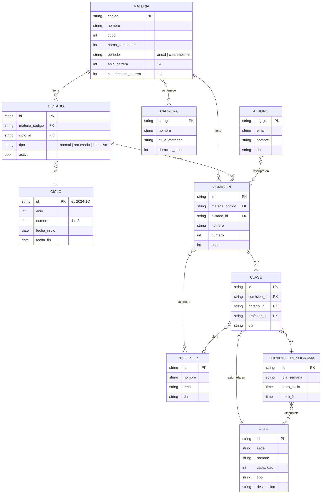

### 3.4 Ejes Principales del Problema

La delimitación se justifica en función de los tres ejes principales del problema de asignación:

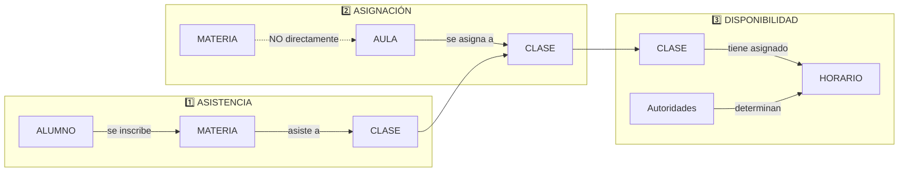

1. **En función de la ASISTENCIA**: Un alumno se inscribe a una materia y luego se espera que asista a sus clases. Esta es la principal variable estocástica del problema de optimización.

2. **En función de la ASIGNACIÓN**: Las aulas se asignan a **clases**, no a materias. La clase emerge como el elemento central de organización y gestión de aulas.

3. **En función de la DISPONIBILIDAD**: Las clases tienen asignado un horario del cronograma. Esto viene determinado por las autoridades de la facultad y es un dato de entrada, no una variable de decisión.

---

## 4. Dominio de la Solución

### 4.1 Derivación de Entidades Abstractas

Las entidades del dominio de la solución son **abstracciones** que permiten gestionar las relaciones M:M del dominio del problema de manera efectiva. Estas entidades no tienen existencia física real, sino que son constructos del sistema de información.

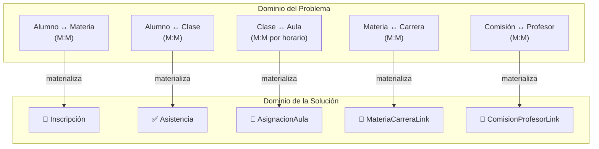

### 4.2 Entidades de Solución

| Entidad | Atributos | Relación M:M que Resuelve | Propósito |
|---------|-----------|---------------------------|-----------|
| **Inscripción** | id, alumno_legajo, comision_id, fecha_inscripcion, activa | Alumno ↔ Materia/Comisión | Gestionar inscripciones, calcular demanda esperada |
| **Asistencia** | id, alumno_legajo, clase_id, fecha, presente | Alumno ↔ Clase | Registrar asistencia real, alimentar predicciones |
| **AsignacionAula** | id, clase_id, aula_id, ciclo_id, fecha_asignacion, vigente | Clase ↔ Aula (por Ciclo) | Gestionar asignaciones, detectar conflictos |

### 4.3 Tablas de Enlace (Link Tables)

Para las relaciones M:M que no requieren atributos adicionales significativos, se utilizan tablas de enlace:

| Tabla de Enlace | Atributos | Relación que Resuelve |
|-----------------|-----------|----------------------|
| **PlanEstudio** | id (UUID PK), plan_version_id FK, materia_codigo FK, carrera_codigo FK, anio_plan, cuatrimestre_plan, correlativas | Materia ↔ Carrera (versionada via PlanCarreraVersion) |
| **CicloPlanVersion** | ciclo_id FK+PK, plan_version_id FK+PK | Ciclo ↔ PlanCarreraVersion |
| **ComisionProfesorLink** | comision_id, profesor_id, es_titular | Comisión ↔ Profesor |

> **Nota**: La relacion Materia-Carrera se resuelve mediante `PlanEstudio`, que pertenece
> a una `PlanCarreraVersion` especifica. Esto permite versionar los planes de estudio
> por carrera y asignar versiones a ciclos para determinar que materias se ofrecen.

### 4.4 Justificación de las Entidades de Solución

#### Inscripción
Materializa la relación entre Alumno y Comisión (y por transitividad, Materia). Permite:
- Contar inscriptos por comisión para estimar demanda de capacidad
- Trackear cambios en inscripciones post-inicio de clases
- Calcular la asistencia esperada como input para el algoritmo de asignación

#### Asistencia
Materializa la relación entre Alumno y Clase. Permite:
- Registrar asistencia efectiva (variable estocástica principal del problema)
- Calcular tasas de asistencia históricas por materia, comisión y horario
- Alimentar modelos predictivos de ocupación para optimización futura

#### AsignacionAula
Materializa la relación entre Clase y Aula **dentro del contexto de un Ciclo**. Es el **objetivo central** del sistema:
- Asignar aulas a clases respetando restricciones de capacidad
- Detectar y resolver conflictos de horario dentro del mismo período lectivo
- Permitir reasignaciones dinámicas durante el ciclo lectivo
- El campo `ciclo_id` permite validar que no haya conflictos de aula dentro del mismo período

### 4.5 Diagrama ER Completo de la Solución

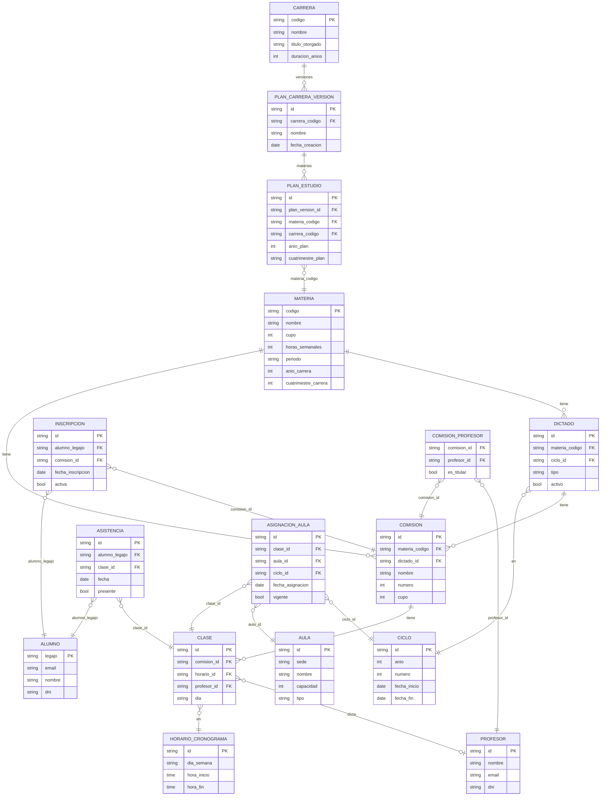

---

## 5. Restricciones y Validaciones

### 5.1 Restricciones de Asignación

Las siguientes restricciones deben cumplirse para toda asignación válida:

| # | Restricción | Descripción Formal |
|---|-------------|-------------------|
| R1 | **Unicidad de Clase** | ∀ clase, horario: |AsignacionAula(clase, horario)| ≤ 1 |
| R2 | **Unicidad de Aula** | ∀ aula, horario: |Clase(aula, horario)| ≤ 1 |
| R3 | **Capacidad** | ∀ asignacion: aula.capacidad ≥ clase.asistencia_esperada |
| R4 | **Sin Conflictos** | ∀ asig1, asig2: asig1.aula = asig2.aula ∧ superponen(asig1.horario, asig2.horario) → asig1 = asig2 |

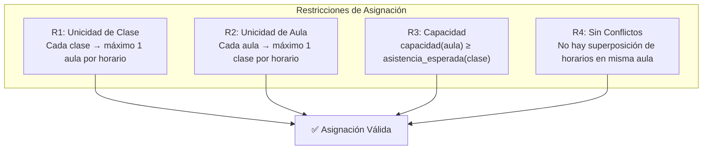

### 5.2 Validaciones Implementadas

El sistema implementa las siguientes validaciones en el módulo `src/services/validations.py`:

#### Validación 1: Materias con Carrera Asignada

Verifica que todas las materias estén asociadas a al menos una carrera, garantizando la integridad del plan de estudios.

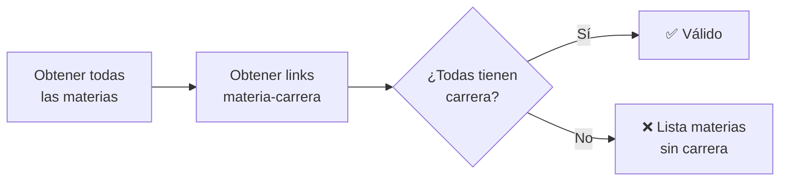

#### Validación 2: Factibilidad de Horarios por Carrera

Verifica que los horarios de las materias del mismo año y cuatrimestre de una carrera no se superpongan, permitiendo que un alumno pueda asistir a todas sus clases.

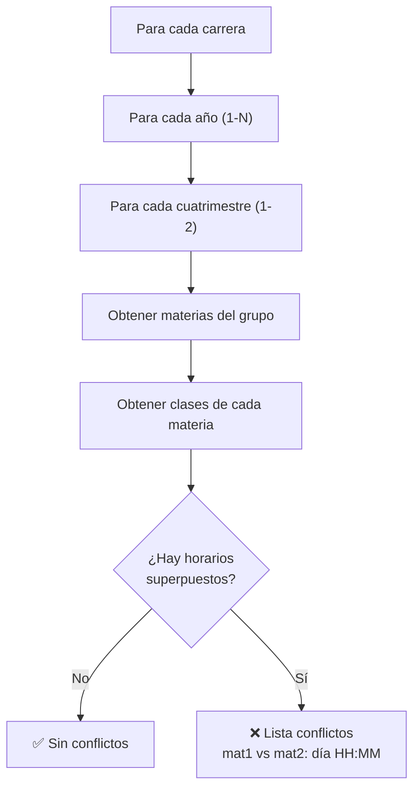

#### Validación 3: Conflictos de Aula por Ciclo

Verifica que no haya dos clases asignadas a la misma aula en el mismo horario dentro de un ciclo lectivo.

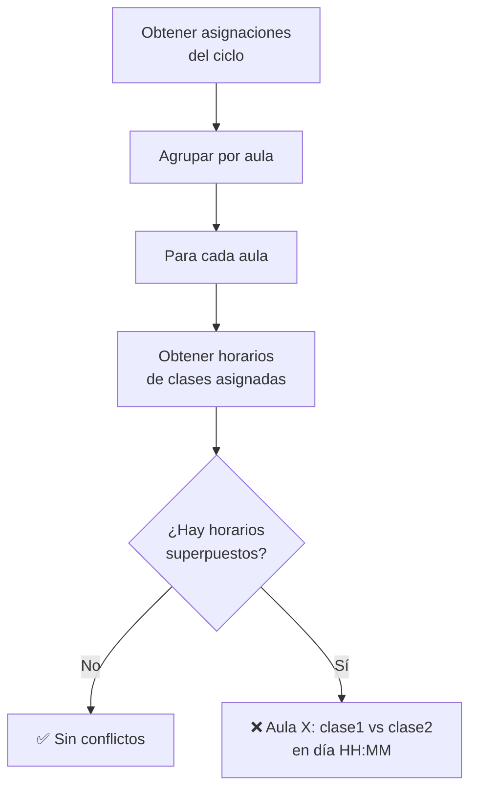

### 5.3 Reglas de Negocio

| Regla | Descripción |
|-------|-------------|
| RN1 | Toda materia debe pertenecer a al menos una carrera |
| RN2 | Al crear una materia, se genera automáticamente una "Comisión Única" |
| RN3 | Las materias anuales generan 2 dictados (uno por cuatrimestre) |
| RN4 | Las asignaciones de aula son válidas dentro del contexto de un ciclo específico |
| RN5 | Los horarios se definen con granularidad configurable (por defecto 15 minutos) |

---

## 6. Modelo de Implementación

### 6.1 Arquitectura de Datos

El sistema utiliza una arquitectura de dos capas de modelos para desacoplar la experimentación de la persistencia:

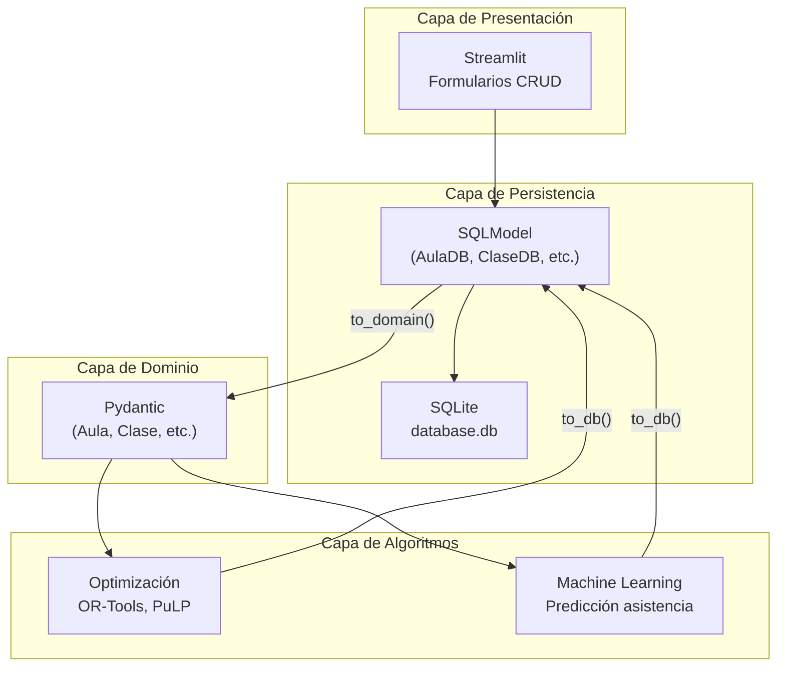

**Beneficios de esta arquitectura:**

| Aspecto | Con separación | Sin separación |
|---------|----------------|----------------|
| Experimentación ML | Objetos livianos, sin I/O | Cada operación toca la DB |
| Testing | Genera entidades puras | Necesita DB de test |
| Serialización | JSON/pickle directo | Hay que extraer de DB |
| Inmutabilidad | `frozen=True` garantizado | SQLModel es mutable |
| Comparación de soluciones | En memoria, rápido | Queries a DB |

### 6.2 Diagrama de Clases SQLModel

El modelo de base de datos está implementado en `src/database/models.py` utilizando SQLModel, que combina Pydantic (validación) con SQLAlchemy (ORM).

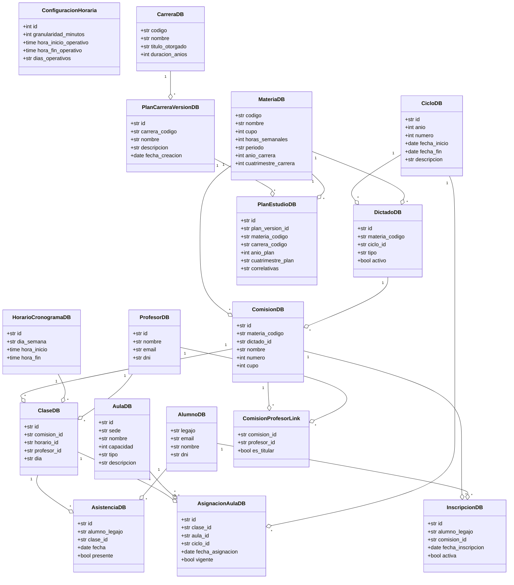

---

## 7. Definiciones y Glosario

### Ciclo
Período lectivo (cuatrimestre) con fechas de inicio y fin. El identificador sigue el formato `AAAA-NC` donde AAAA es el año y N es el número de cuatrimestre.
- Ejemplo: `2024-1C` (primer cuatrimestre 2024), `2024-2C` (segundo cuatrimestre 2024)

### Dictado
Instancia de una materia en un ciclo específico. Permite manejar diferentes modalidades de cursado:
- **normal**: Dictado regular de la materia según el plan de estudios
- **recursado**: Para alumnos que deben recursar la materia
- **intensivo**: Dictado intensivo, típicamente en período de verano

Una materia con `periodo = "anual"` tendrá 2 dictados (uno por cuatrimestre), mientras que una materia `cuatrimestral` tendrá 1 dictado por ciclo.

### Comisión
División de una materia para distribuir alumnos y facilitar el dictado. Cada comisión está asociada a un dictado específico y tiene su propio cupo.
- Las materias sin múltiples comisiones se consideran compuestas por una única comisión ("Comisión Única") que se crea automáticamente al registrar la materia.

### Clase
Instancia de dictado de una comisión en un horario y día específico. Es la **unidad fundamental de asignación** del sistema.
- Una comisión puede tener múltiples clases (ej: Lunes 8-10, Miércoles 14-16)
- Cada clase puede tener un profesor asignado

### Horario_Cronograma
Franja horaria del cronograma académico en la que la facultad está operativa. Se define por día de semana, hora de inicio y hora de fin.
- La granularidad de los horarios es configurable (por defecto 15 minutos)
- Los horarios operativos por defecto son de 7:00 a 23:00

### Inscripción
Relación entre un alumno y una comisión que indica su intención de cursar. Permite:
- Calcular la demanda esperada de capacidad
- Trackear cambios post-inicio de clases

### Asistencia
Registro de la presencia efectiva de un alumno en una clase específica. Es la **variable estocástica principal** del problema de optimización.

### AsignacionAula
Relación que vincula una clase con un aula específica dentro de un ciclo. El campo `ciclo_id` es fundamental para:
- Contextualizar temporalmente las asignaciones
- Validar conflictos dentro del mismo período lectivo
- Permitir diferentes asignaciones para la misma clase en diferentes ciclos

### Materia
Asignatura académica del plan de estudios. Incluye información sobre su ubicación curricular:
- `periodo`: "anual" o "cuatrimestral"
- `anio_carrera`: Año sugerido en el plan de estudios (1-6)
- `cuatrimestre_carrera`: Cuatrimestre sugerido (1 o 2)

Estos campos permiten validar la factibilidad de horarios para los alumnos.

---

## 8. Referencias

- **Documentación del Proyecto**: `project/ante_proyecto.md`
- **Stack Tecnológico**: `project/tech_stack.md`
- **Arquitectura ORM**: `project/orm.md`
- **Especificación de Requerimientos**: `.kiro/specs/classroom-assignment-system/requirements.md`
- **Documento de Diseño**: `.kiro/specs/classroom-assignment-system/design.md`
- **Modelo de Base de Datos**: `src/database/models.py`
- **Validaciones**: `src/services/validations.py`
