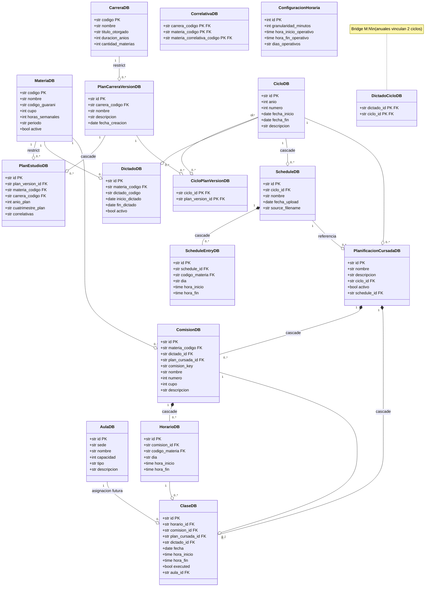

# Diagrama de Entidades y Politicas de Borrado

**Ultima actualizacion**: 2026-03-10

Este documento refleja el estado actual de las entidades implementadas en `src/database/models.py`,
sus relaciones y las politicas de borrado aplicadas en la capa de servicios.

---

## Diagrama de Clases UML



---

## Politicas de Borrado

### Notacion

| Simbolo | Relacion | Significado |
|---------|----------|-------------|
| `*--` | Composicion | El hijo no existe sin el padre. Borrado en cascada. |
| `--o` | Agregacion / Referencia | El hijo puede existir independientemente. |
| `restrict` | | No se puede borrar el padre si tiene hijos. |
| `cascade` | | Borrar el padre borra todos los hijos. |
| `referencia` | | FK opcional, no se borra en cascada. |

### Detalle por entidad

#### Entidades independientes (raiz)
| Entidad | Se puede borrar si... |
|---------|----------------------|
| `CarreraDB` | No tiene `PlanCarreraVersionDB` (restrict) |
| `MateriaDB` | Cascadea comisiones + horarios via relationship_definitions |
| `AulaDB` | Libre (solo referenciada opcionalmente por ClaseDB.aula_id) |
| `CicloDB` | Libre actualmente (deberia restringirse si tiene planes/schedules) |

#### Arbol de Plan de Estudio
```
CarreraDB ──restrict──> PlanCarreraVersionDB ──cascade──> PlanEstudioDB
```
- No se puede borrar una carrera que tiene versiones de plan.
- Borrar una version borra sus entradas de plan de estudio.

#### Arbol de Cronograma
```
ScheduleDB ──cascade──> ScheduleEntryDB
```
- Borrar un cronograma borra todas sus entradas.
- Implementado inline en la UI (Planes > tab Cronogramas).

#### Arbol de Plan de Cursada (composition)
```
PlanificacionCursadaDB ──cascade──> ClaseDB
                       ──cascade──> ComisionDB ──cascade──> HorarioDB
```
- Borrar un plan borra: clases, horarios (via comision), comisiones.
- Orden de borrado en la UI: ClaseDB → HorarioDB → ComisionDB → PlanificacionCursadaDB.
- Las comisiones y horarios son **componentes** del plan (composition, no existen fuera de uno).

#### Notas
- `PlanificacionCursadaDB.schedule_id` es una referencia (FK opcional). Borrar un schedule NO borra los planes generados desde el (los planes ya tienen sus propias comisiones/horarios copiados).
- `ClaseDB.aula_id` es FK opcional para la futura asignacion de aulas.
- `DictadoCicloDB` es bridge M:N porque materias anuales vinculan un dictado a 2 ciclos.
