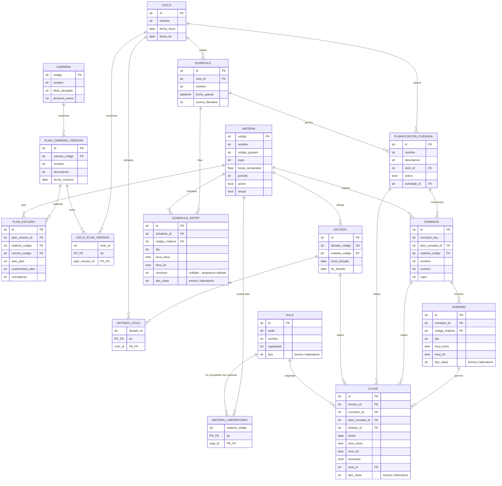

# Modelo de Planificacion de Cursada

Este documento describe el modelo de datos para la gestion de ciclos academicos, planificacion de cursada y generacion de clases. Complementa el modelo ER original (`proyecto/0. Planteo/modelo-er.md`) con las entidades necesarias para gestionar el ciclo de vida completo de las clases.

> **Estado**: Implementado (Tareas 1-11 completadas + versionado de planes + validación por comisión + prevalidación de comisiones + tipo_clase y laboratorios + dictados como fuente de verdad de "esperadas").
> **Fecha diseño**: 2026-03-09
> **Fecha implementacion**: 2026-03-09
> **Ultima actualizacion**: 2026-05-26 (dictados activos como fuente de verdad para prevalidacion, override `dicta_recursado` por materia, eliminacion del estado "sin dictado")

---

## 1. Contexto y Motivaciones

### 1.1 Cambios respecto al modelo original

El modelo original (v1) incluia entidades que quedaron fuera de alcance y usaba una estructura de dos niveles (HorarioCronograma + Clase) para representar horarios. Los cambios principales:

| Cambio | Antes (v1) | Despues (v2) |
|--------|-----------|-------------|
| Entidades deprecadas | Alumno, Profesor, Inscripcion, Asistencia | Eliminadas. Se reincorporan cuando sea necesario |
| Horarios | HorarioCronograma (catalogo) + Clase (link) | Horario (patron semanal bajo Comision) + Clase (instancia con fecha) |
| Comisiones | Creadas manualmente o auto-generadas | Derivadas de la carga de horarios, pertenecen a un plan |
| Materia-Carrera | MateriaCarreraLink simple | PlanEstudio con anio_plan, cuatrimestre_plan, correlativas |
| **Plan de estudio** | **PlanEstudio sin versionar (composite PK)** | **PlanCarreraVersion + PlanEstudio versionado (UUID PK + plan_version_id FK)** |
| **Dictados** | **Derivados de Materia.active** | **Derivados de versiones de plan asignadas al ciclo (CicloPlanVersion)** |
| Ciclos y ofertas | Ciclo y Dictado definidos pero sin uso | Ciclo + Dictado + PlanificacionCursada: gestion completa del ciclo de vida |

### 1.2 Objetivo del modelo

Permitir:

1. **Registrar** que materias se ofrecen en cada ciclo via `Dictado` (siempre creado para toda materia del plan; el flag `activo` decide la oferta efectiva)
2. **Cargar** horarios desde archivos Excel/CSV (Schedule + ScheduleEntry)
3. **Prevalidar** un cronograma contra los **dictados activos** del ciclo (cobertura, faltantes, no-esperadas)
4. **Generar** planes de cursada con comisiones y horarios (PlanificacionCursada)
5. **Generar** clases individuales con fecha para un ciclo (Clase)
6. **Comparar** diferentes planes (distintas configuraciones de comisiones, horarios, asignaciones de aula)
7. **Gestionar** cambios durante el ciclo (reasignar aulas, modificar horarios, regenerar clases futuras)

> **Cambio importante (2026-05)**: las "materias esperadas" en la prevalidacion
> de cronograma ya **no** se derivan directamente del `PlanEstudio`, sino de
> `DictadoDB.activo == True`. Esto permite excluir materias del set esperado
> sin tocar el plan, simplemente desactivando su dictado. Ver § 6 (RN15).

---

## 2. Modelo de Entidades

### 2.1 Diagrama de entidades

```
Carrera (programa academico)
  |
  +-- PlanCarreraVersion (version de un plan de estudios)
       |-- nombre: "Plan Original", "Plan 2025"
       |-- fecha_creacion
       |
       +-- PlanEstudio (materia en la version del plan)
            |-- materia_codigo, carrera_codigo (denormalizado)
            |-- anio_plan, cuatrimestre_plan, correlativas

Materia (catalogo estatico, persiste entre ciclos)
  |
  |-- active: bool (informativo, NO controla creacion de dictados)
  |
  +-- Dictado (oferta de la materia en un periodo)
  |    |-- DictadoCiclo (bridge) --> Ciclo
  |    |    cuatrimestral: 1 ciclo, anual: 2 ciclos
  |    |
  |    +-- inicio_dictado, fin_dictado (fechas reales)
  |
  +-- PlanEstudio --> PlanCarreraVersion --> Carrera

Ciclo (periodo academico: "2025-2C")
  |
  +-- CicloPlanVersion (bridge) --> PlanCarreraVersion
  |    (que versiones de plan aplican a este ciclo)
  |
  +-- Schedule (carga validada de horarios)
  |    +-- ScheduleEntry (filas individuales normalizadas)
  |
  +-- PlanificacionCursada (escenario de planificacion, abarca TODAS las materias del ciclo)
       |-- activo: bool (solo 1 activo por ciclo)
       |-- schedule_id: FK al Schedule que lo genero
       |
       +-- Comision (grupo de estudiantes, especifico del plan)
       |    |-- comision_key (clave plan-agnostica para comparacion)
       |    |-- materia_codigo (denormalizado)
       |    +-- Horario (patron semanal: dia + hora, copiado de ScheduleEntry)
       |
       +-- Clase (instancia individual con fecha)
            |-- horario_id, comision_id, plan_cursada_id, dictado_id (FKs)
            |-- fecha, hora_inicio, hora_fin (copiados del horario)
            |-- executed: bool (marca permanente)
            +-- aula_id: FK nullable (asignado por algoritmo de optimizacion)
```

### 2.2 Entidades existentes (implementadas)

#### Materia

Catalogo estatico de asignaturas. Persiste entre ciclos.

| Campo | Tipo | Notas |
|-------|------|-------|
| codigo | str PK | Codigo del plan de estudio (e.g. "MAT101") |
| nombre | str | |
| codigo_guarani | str nullable | Codigo en SIU Guarani (puede diferir del codigo) |
| cupo | int nullable | Capacidad maxima (nullable para actividades sin cupo) |
| horas_semanales | **float** nullable | Horas semanales de catedra. Float para permitir valores como 1.5 o 2.5. Nullable para actividades asincronas |
| horas_teoria | float nullable | Horas semanales de teoria (subset de `horas_semanales`) |
| horas_laboratorio | float nullable | Horas semanales de laboratorio (subset de `horas_semanales`) |
| periodo | str | "anual" o "cuatrimestral" |
| **active** | **bool** | **Campo informativo. NO controla creacion de dictados (ver PlanCarreraVersion)** |
| virtual | bool | Default para `Dictado.virtual`. Las virtuales no requieren aula |
| optativa | bool | Si la materia es optativa/electiva |
| **dicta_recursado** | **bool nullable** | **Override del flag de recursado de la carrera. `None` = usar el de la carrera. `True`/`False` fuerza el comportamiento para esta materia ignorando lo que diga la carrera. Ver RN16** |

> `active` es ahora un campo puramente informativo. La creacion de dictados se controla
> mediante las versiones de plan asignadas al ciclo (CicloPlanVersion -> PlanCarreraVersion -> PlanEstudio).
> Solo las materias presentes en las versiones de plan asignadas al ciclo obtienen Dictado.

#### Sede (nueva, 2026-06)

Sede física donde se ubican las aulas. Modelada como entidad propia
(antes era un string libre dentro de `Aula.sede`) para permitir
referenciarla desde futuras restricciones del LP del tipo "esta materia
sólo se puede cursar en estas sedes".

| Campo | Tipo | Notas |
|-------|------|-------|
| id | str PK | UUID auto-generado |
| nombre | str unique | Único globalmente (ej. "Pellegrini") |

#### Aula

Espacio físico para clases. Refactor 2026-06: `id` opaco autogenerado +
nuevo campo `codigo_aula` editable como display.

| Campo | Tipo | Notas |
|-------|------|-------|
| id | str PK | UUID auto-generado, no ingresable manualmente |
| sede_id | str FK → Sede | Reemplaza el string `sede` legacy |
| codigo_aula | str unique | Código display editable. Si se omite al crear, se autoderiva como `{Sede.nombre}-{Aula.nombre}` con espacios reemplazados por guiones (ej. "Pellegrini-AULA-01") |
| nombre | str | |
| capacidad | int | |
| tipo | str | `"teorica"` (default), `"practica"`, `"laboratorio"` o `"anfiteatro"`. Determina a qué clases puede asignarse |
| descripcion | str | |

> **Migración (2026-06)**: para DBs existentes, la migración extrae cada
> `DISTINCT aulas.sede` (string legacy) en una `SedeDB`, asigna
> `aulas.sede_id` por nombre, llena `codigo_aula` con el `id` viejo
> (preserva el display) y reasigna IDs no-UUID a UUID, propagando el
> remap a `clases.aula_id`, `materia_laboratorio.aula_id` y al JSON de
> `lp_runs.details_json`. Idempotente.

#### MateriaLaboratorio (nueva)

Tabla link M:N entre materias y aulas de tipo laboratorio. Define que laboratorios
son compatibles con cada materia para dictar clases de lab.

| Campo | Tipo | Notas |
|-------|------|-------|
| materia_codigo | str PK, FK -> Materia | |
| aula_id | str PK, FK -> Aula (tipo=laboratorio) | |

> Sin orden de preferencia. Una materia puede tener 0, 1 o mas labs compatibles.
> A la hora de asignar aulas a clases de laboratorio, el algoritmo debe elegir un
> lab de la lista compatible con la materia.

#### Carrera

Programa academico.

| Campo | Tipo | Notas |
|-------|------|-------|
| codigo | str PK | |
| nombre | str | |
| titulo_otorgado | str | |
| duracion_anios | int | |
| cantidad_materias | int nullable | |
| **dicta_recursado** | **bool** | **Si la carrera ofrece materias del cuatrimestre opuesto al ciclo (recursado). Default `True`. Editable on-the-fly desde **Ciclos → Dictados** (cambio global, no por ciclo). Puede ser overrideado por `MateriaDB.dicta_recursado`. Ver RN16** |

#### PlanCarreraVersion (nuevo)

Version de un plan de estudios para una carrera. Permite mantener multiples versiones
(ej: "Plan Original", "Plan 2025") y asignar versiones especificas a ciclos.

| Campo | Tipo | Notas |
|-------|------|-------|
| id | str PK | UUID auto-generado |
| carrera_codigo | str FK | -> carreras |
| nombre | str | e.g. "Plan Original", "Plan 2025" |
| descripcion | str | |
| fecha_creacion | date | |

#### CicloPlanVersion (nuevo, bridge)

Vincula versiones de plan con ciclos. Define que materias se ofrecen en cada ciclo.

| Campo | Tipo | Notas |
|-------|------|-------|
| ciclo_id | str FK+PK | -> ciclos |
| plan_version_id | str FK+PK | -> plan_carrera_version |

#### PlanEstudio (tabla de enlace Materia <-> Carrera, versionada)

Reemplazo de MateriaCarreraLink con atributos adicionales y versionado.
Cada entrada pertenece a una version de plan especifica.

| Campo | Tipo | Notas |
|-------|------|-------|
| id | str PK | UUID auto-generado (reemplaza composite PK) |
| plan_version_id | str FK | -> plan_carrera_version |
| materia_codigo | str FK | -> materias (index) |
| carrera_codigo | str FK | -> carreras (index, denormalizado desde version) |
| anio_plan | int nullable | Anio sugerido (1-6) |
| cuatrimestre_plan | str nullable | "1C", "2C", "Anual", o null |
| correlativas | str | Texto crudo con correlativas |

> `carrera_codigo` se mantiene denormalizado para facilitar queries directas sin join a la version.

#### Ciclo

Periodo academico (cuatrimestre).

| Campo | Tipo | Notas |
|-------|------|-------|
| id | str PK | e.g. "2025-2C" |
| nombre | str | e.g. "Segundo Cuatrimestre 2025" |
| fecha_inicio | date | |
| fecha_fin | date | |
| descripcion | str | |

### 2.3 Entidades nuevas (a implementar)

#### Dictado

Oferta de una materia en un periodo. **Existe para TODA materia del plan asignado al
ciclo**, tenga o no horarios cargados. El flag `activo` decide si la materia
participa de la prevalidacion como "esperada".

| Campo | Tipo | Notas |
|-------|------|-------|
| id | str PK | UUID auto-generado |
| dictado_codigo | str unique | Display key: "MAT101-2025-2C" (cuatrimestral) o "MAT101-2025" (anual) |
| materia_codigo | str FK | -> materias |
| inicio_dictado | date | Heredado de la fecha_inicio del primer ciclo vinculado |
| fin_dictado | date nullable | Null para anuales en 1C, se llena cuando se crea el ciclo 2C |
| **activo** | **bool** | **Si el dictado se ofrece efectivamente este ciclo. Default `True` salvo que la regla de `dicta_recursado` lo dicte inactivo. Las "materias esperadas" en la prevalidacion son los `Dictado.activo == True`** |
| **activo_override_manual** | **Optional[bool]** | **Marca de edición a mano del flag `activo`. `None` = el dictado se alinea a la regla en cada `recompute_activo_for_ciclo`; `True/False` = el usuario lo editó manualmente, y la recalculación default lo respeta (RN17)** |
| **virtual** | **bool** | **Default heredado de `MateriaDB.virtual`. Las virtuales no requieren aula y se excluyen del LP de asignacion. Editable por dictado** |

> **Dictados para materias anuales**: Se crean en 1C con fin_dictado = null.
> Cuando se crea el ciclo 2C, los dictados anuales del mismo anio se vinculan al 2C
> y su fin_dictado se actualiza con la fecha_fin del ciclo 2C.
>
> **No existe el estado "sin dictado"**: en el modelo actual, toda materia del
> plan asignado al ciclo tiene un `Dictado` linkeado al ciclo. Lo que cambia
> es `activo`: si una materia no se va a dictar este cuatrimestre, queda
> registrada como `activo=False` y no aparece como esperada en la
> prevalidacion. Esto permite alternar la oferta sin tocar el plan de estudio.
>
> **Recompute on-the-fly**: el servicio expone `recompute_activo_for_ciclo`
> que recalcula `activo` para todos los dictados del ciclo segun las reglas
> vigentes (flags de carrera + materia override). El usuario lo dispara
> desde **Ciclos → Dictados → 🔄 Recalcular según reglas** despues de
> cambiar configuracion. Por default respeta los overrides manuales
> (`activo_override_manual is not None`); con el toggle "Pisar también
> las ediciones manuales" activado, las descarta y aplica la regla a
> todos. Ver RN17.

#### DictadoCiclo (bridge)

Vincula dictados con ciclos. Cuatrimestral = 1 fila, Anual = 2 filas.

| Campo | Tipo | Notas |
|-------|------|-------|
| dictado_id | str FK+PK | -> dictados |
| ciclo_id | str FK+PK | -> ciclos |

#### Schedule

Carga validada y normalizada de horarios desde un archivo. Almacena los datos de entrada de forma persistente.

| Campo | Tipo | Notas |
|-------|------|-------|
| id | str PK | UUID auto-generado |
| ciclo_id | str FK | -> ciclos |
| nombre | str | e.g. "Horarios 2C 2025 v1" |
| fecha_upload | datetime | Timestamp de la carga |
| source_filename | str | Nombre del archivo original |

#### ScheduleEntry

Filas individuales del schedule, normalizadas y validadas.

| Campo | Tipo | Notas |
|-------|------|-------|
| id | str PK | UUID auto-generado |
| schedule_id | str FK | -> schedules |
| codigo_materia | str FK | -> materias (ya resuelto: codigo_plan, no guarani) |
| dia | str | Dia de la semana validado |
| hora_inicio | time | |
| hora_fin | time | |
| **comision** | **int nullable** | **Numero de comision asignada (1, 2, ...). Nullable = sin asignar. Se edita desde la prevalidacion (Phase 2) y se persiste al schedule** |
| **tipo_clase** | **str** | **`"teorica"` (default) o `"laboratorio"`. Marcado desde la prevalidacion. Se propaga a HorarioDB y luego a ClaseDB** |

> Al persistir, los codigos guarani ya estan resueltos a codigo_plan.
> Las filas con codigos no resueltos no se persisten (se reportan como errores).
> El campo `comision` permite persistir la asignacion de comisiones editada por el
> usuario durante la prevalidacion, de modo que al re-prevalidar o generar un plan,
> la asignacion se preserve.
> El campo `tipo_clase` distingue clases teoricas de laboratorio, determinando
> que tipo de aula requieren al asignar (ver seccion 6 de `plan-de-cursada.md`).

#### PlanificacionCursada

Escenario de planificacion para un ciclo completo. Contiene todas las comisiones y clases propuestas para TODAS las materias del ciclo.

| Campo | Tipo | Notas |
|-------|------|-------|
| id | str PK | UUID auto-generado |
| nombre | str | e.g. "Plan inicial", "Optimizacion v2" |
| descripcion | str | |
| ciclo_id | str FK | -> ciclos |
| activo | bool | Solo 1 activo por ciclo (regla de negocio) |
| schedule_id | str FK | -> schedules (input que genero este plan) |

> **Regla**: Maximo 1 PlanificacionCursada por ciclo con `activo = True`.
> Enforcement en la capa de servicios, no como constraint de DB.

#### Comision (modificada)

Grupo de estudiantes. Ahora pertenece a un plan especifico, con ID auto-generado.

| Campo | Tipo | Notas |
|-------|------|-------|
| id | str PK | UUID auto-generado |
| comision_key | str | Clave plan-agnostica: "{dictado_codigo}-{numero:03d}" |
| plan_cursada_id | str FK | -> planificacion_cursada |
| materia_codigo | str FK | -> materias (denormalizado para queries) |
| nombre | str | e.g. "Comision 1" |
| numero | int | Numero secuencial dentro de la materia |
| cupo | int | |

> `comision_key` permite comparar "la misma comision" entre distintos planes.
> Ejemplo: Plan A y Plan B ambos tienen "MAT101-2025-2C-001" pero con diferentes horarios.

#### Horario (modificado)

Patron semanal de clases. Pertenece a una comision (y por transitividad a un plan).

| Campo | Tipo | Notas |
|-------|------|-------|
| id | str PK | |
| comision_id | str FK | -> comisiones |
| codigo_materia | str FK | -> materias (denormalizado) |
| dia | str | Dia de la semana |
| hora_inicio | time | |
| hora_fin | time | |
| **tipo_clase** | **str** | **`"teorica"` (default) o `"laboratorio"`. Propagado desde ScheduleEntry al generar el plan. Se propaga a ClaseDB al expandir fechas** |

> Al crear un plan desde un schedule, los Horarios se copian de ScheduleEntries
> y se vinculan a las comisiones correspondientes. El `tipo_clase` se copia
> directamente del entry.

#### Clase (nueva)

Instancia individual de una clase con fecha concreta. Generada a partir de un Horario.

| Campo | Tipo | Notas |
|-------|------|-------|
| id | str PK | UUID auto-generado |
| horario_id | str FK | Patron semanal que genero esta clase |
| comision_id | str FK | Denormalizado desde horario |
| plan_cursada_id | str FK | Denormalizado desde comision |
| dictado_id | str FK | Para queries cross-plan por materia/ciclo |
| fecha | date | Fecha concreta de la clase |
| hora_inicio | time | Copiado del horario al momento de generacion |
| hora_fin | time | Copiado del horario al momento de generacion |
| executed | bool | Marca permanente: True cuando la clase ocurrio |
| aula_id | str FK nullable | -> aulas (asignado por algoritmo de optimizacion) |
| **tipo_clase** | **str** | **`"teorica"` (default) o `"laboratorio"`. Propagado desde el horario al generar. Puede modificarse individualmente en la etapa de implementacion (ej: reserva puntual de laboratorio)** |

---

## 3. Estados derivados de Clase

La unica columna de estado almacenada en Clase es `executed` (bool, default False).
Los demas estados se **derivan** en tiempo de consulta:

### 3.1 Definiciones

| Estado | Condicion | Significado |
|--------|-----------|-------------|
| **Ejecutada** | `executed = True` | La clase ocurrio. Marca permanente, no se revierte. |
| **Planificada** | `executed = False` AND plan.activo AND fecha >= hoy | Clase futura del plan activo. VA a ocurrir. |
| **Borrador** | `executed = False` AND NOT plan.activo | Clase de un plan inactivo. Propuesta/simulacion. |

### 3.2 Consultas tipo

```sql
-- Clases ejecutadas de un ciclo (lo que realmente paso)
SELECT c.* FROM clase c
JOIN planificacion_cursada p ON c.plan_cursada_id = p.id
WHERE c.executed = True AND p.ciclo_id = ?

-- Clases planificadas (futuras del plan activo)
SELECT c.* FROM clase c
JOIN planificacion_cursada p ON c.plan_cursada_id = p.id
WHERE c.executed = False AND p.activo = True AND c.fecha >= date('now')

-- Estado actual completo del ciclo (ejecutadas + planificadas)
SELECT c.* FROM clase c
JOIN planificacion_cursada p ON c.plan_cursada_id = p.id
WHERE p.ciclo_id = ?
  AND (c.executed = True OR (p.activo = True AND c.fecha >= date('now')))

-- Clases borrador de un plan especifico (para comparacion)
SELECT c.* FROM clase c
WHERE c.plan_cursada_id = ? AND c.executed = False

-- Todas las clases de una materia en un ciclo (independiente del plan)
SELECT c.* FROM clase c
JOIN planificacion_cursada p ON c.plan_cursada_id = p.id
WHERE c.dictado_id = ? AND p.ciclo_id = ?
```

### 3.3 Transicion de estados

```
                    plan se activa
    [Borrador] -----------------------> [Planificada]
        ^                                    |
        |           plan se desactiva        |
        +------------------------------------+
                                             |
                         fecha < now()       |
                         (automatico)        v
                                        [Ejecutada]
                                        (permanente)
```

- **Borrador -> Planificada**: Cuando el plan que contiene la clase se marca como `activo = True`
- **Planificada -> Borrador**: Cuando el plan se desactiva (se activa otro plan)
- **Planificada -> Ejecutada**: Automatico. Cuando `clase.hora_fin < now()` y la clase pertenece al plan activo, se marca `executed = True`. Esta marca es **permanente**: una vez ejecutada, no vuelve a borrador aunque el plan se desactive.
- **Borrador -> Ejecutada**: No ocurre. Solo clases del plan activo se marcan como ejecutadas.

### 3.4 Notas de implementacion

- `executed` se actualiza via job periodico o al acceder a los datos del ciclo (lazy marking).
- Al cambiar de plan activo: NO se modifican las clases. Los estados se recalculan via queries.
  Unica excepcion: las clases ya marcadas `executed = True` conservan esa marca.
- Para comparar planes: consultar las clases de cada plan (son estaticas, no se modifican entre planes).
  La comparacion es sobre los datos generados (horarios, aulas), no sobre el estado.

---

## 4. Flujo de trabajo por ciclo

### 4.1 Inicio de ciclo

```
1. Crear Ciclo "2026-1C" (fecha_inicio, fecha_fin)
   |   - Seleccionar versiones de plan a asignar (CicloPlanVersion)
   |   - Default: ultima version de cada carrera
       |
2. Crear Dictados para materias de las versiones de plan asignadas
   |   - Se obtienen materias unicas de CicloPlanVersion -> PlanEstudio
   |   - Cuatrimestrales: 1 Dictado -> DictadoCiclo con "2026-1C"
   |   - Anuales: 1 Dictado -> DictadoCiclo con "2026-1C"
   |     (inicio_dictado = ciclo.fecha_inicio, fin_dictado = null)
   |   - Error si el ciclo no tiene versiones de plan asignadas
       |
3. Cargar horarios (archivo Excel/CSV)
   |   - Se crea un Schedule con ScheduleEntries validados
   |   - Codigos guarani se resuelven a codigo_plan
   |   - Filas con codigos no resueltos se reportan como errores
       |
4. Generar PlanificacionCursada desde el Schedule
   |   - Derivar comisiones por materia (ceil de horas)
   |   - Crear Comisiones con comision_key
   |   - Crear Horarios bajo cada Comision (copiados de ScheduleEntries)
       |
5. (Opcional) Generar Clases para el plan
   |   - Para cada Horario, generar 1 Clase por fecha
   |     que coincida con el dia de la semana, dentro del rango del ciclo
   |   - Todas las clases inician como executed = False
       |
6. (Futuro) Ejecutar algoritmo de asignacion de aulas
       - Asigna aula_id a cada Clase
```

### 4.2 Inicio de ciclo 2C (para materias anuales)

```
1. Crear Ciclo "2026-2C"
       |
2. Dictados anuales de 2026:
   |   - Buscar dictados con periodo = "anual" vinculados a "2026-1C"
   |   - Crear DictadoCiclo vinculandolos tambien a "2026-2C"
   |   - Actualizar fin_dictado = ciclo_2c.fecha_fin
       |
3. Dictados cuatrimestrales:
       - Crear nuevos Dictados para materias cuatrimestrales activas
       - Vincular a "2026-2C" via DictadoCiclo

4. Continuar con pasos 3-6 del flujo normal
```

### 4.3 Modificacion de horarios durante el ciclo

```
1. Cargar nuevo Schedule para el ciclo
       |
2. Crear nueva PlanificacionCursada referenciando el nuevo Schedule
   |   - Nuevas Comisiones (pueden diferir en cantidad)
   |   - Nuevos Horarios
       |
3. Generar Clases para el nuevo plan
   |   - Para todo el rango del ciclo (no solo desde hoy)
   |   - Todas como executed = False (borrador)
       |
4. Comparar planes:
   |   - Viejo plan: clases ejecutadas + planificadas
   |   - Nuevo plan: clases borrador
   |   - Comparar por comision_key: que cambio?
       |
5. Activar el nuevo plan (si se aprueba):
   |   - nuevo_plan.activo = True
   |   - viejo_plan.activo = False
   |   - Las clases executed=True del viejo plan se conservan
   |   - Las clases del nuevo plan pasan de borrador a planificadas
       |
6. (Futuro) Re-ejecutar asignacion de aulas para clases planificadas
```

### 4.4 Comparacion de planes

Para comparar dos planes del mismo ciclo:

| Aspecto | Como comparar |
|---------|---------------|
| Comisiones | Agrupar por comision_key. Diferencias en cantidad = distinta configuracion |
| Horarios | Para misma comision_key: comparar patrones (dia, hora_inicio, hora_fin) |
| Clases | Para misma comision_key y fecha: comparar hora_inicio, hora_fin, aula_id |
| Aulas | Agrupar por aula: ver que materias/horarios tiene cada aula en cada plan |

---

## 5. Relaciones entre entidades

### 5.1 Diagrama ER



### 5.2 Campos denormalizados

Varios campos se denormalizan para evitar joins profundos en queries frecuentes:

| Entidad | Campo denormalizado | Derivable de | Justificacion |
|---------|--------------------|--------------|----|
| PlanEstudio | carrera_codigo | plan_version -> carrera | Query directa por carrera sin join a version |
| Comision | materia_codigo | plan -> dictado -> materia | Query "comisiones de MAT101" sin joins |
| Horario | codigo_materia | comision -> materia | Herencia del modelo actual |
| Clase | comision_id | horario -> comision | Query directa por comision |
| Clase | plan_cursada_id | comision -> plan | Query directa por plan |
| Clase | dictado_id | plan + materia -> dictado | Query cross-plan por materia/ciclo |
| Clase | hora_inicio, hora_fin | horario | Preservar tiempos reales post-cambio de horario |

---

## 6. Reglas de negocio

| # | Regla | Descripcion |
|---|-------|-------------|
| RN1 | Dictados desde versiones de plan | Al crear dictados para un ciclo, se obtienen las materias de las versiones de plan asignadas al ciclo (CicloPlanVersion -> PlanEstudio). Error si el ciclo no tiene versiones asignadas. `Materia.active` NO controla la creacion de dictados |
| RN2 | Dictados anuales | Materias anuales crean Dictado solo en ciclos 1C. El ciclo 2C se vincula al mismo Dictado |
| RN3 | Un plan activo por ciclo | Maximo 1 PlanificacionCursada con `activo = True` por ciclo |
| RN4 | Executed es permanente | Una vez `clase.executed = True`, no se revierte |
| RN5 | Schedule validado | ScheduleEntries solo contienen codigos de materia resueltos (codigo_plan). Codigos guarani se resuelven al momento de la carga |
| RN6 | Comision key | `comision_key = "{dictado_codigo}-{numero:03d}"`, plan-agnostica, para comparacion entre planes |
| RN7 | Herencia de fechas | Dictado hereda inicio_dictado del primer ciclo. fin_dictado se actualiza cuando se vincula un ciclo posterior (anual) |
| RN8 | Versionado de planes | Cada carrera puede tener multiples versiones de plan de estudio. Se pueden crear nuevas versiones copiando las materias de una version existente |
| RN9 | Asignacion de versiones a ciclos | Al crear un ciclo, se seleccionan las versiones de plan que aplican. Default: ultima version de cada carrera |
| RN10 | Proteccion de borrado Carrera | No se puede eliminar una Carrera si tiene PlanCarreraVersion asociadas. Se deben eliminar las versiones de plan primero |
| RN11 | Proteccion de borrado M:N | No se puede eliminar una Carrera si existen entradas en PlanEstudio vinculadas a ella (restrict via link table). Aplica tanto a `delete()` como a `delete_with_cascading()` |
| RN12 | Validación de conflictos por comisión | Al validar horarios de un plan, se verifica si existe al menos un par de comisiones compatible (una de cada materia) para cada par de materias del mismo grupo curricular. Si no existe ningún par compatible, es conflicto real. Esto reconoce que un alumno cursa una sola comisión por materia |
| RN13 | Clases paralelas → mínimo de comisiones | Si una materia tiene `max_clases_paralelas` entries en el mismo slot horario, se fuerza `n_comisiones >= max_clases_paralelas` independientemente de la regla de derivación (optativa, exclusiva, compartida). Flag: `"needs_more_comisiones"` |
| RN14 | Persistencia de ediciones de preview | Las ediciones que el usuario realiza en el preview de un plan se persisten al ScheduleEntryDB correspondiente, con opción de aplicar al cronograma original o crear una copia |
| RN15 | Esperadas via dictados activos | Las "materias esperadas" en la prevalidacion de un cronograma contra un ciclo son las que tienen `DictadoDB.activo = True` linkeado al ciclo. Si el ciclo no tiene dictados creados, la prevalidacion se aborta con un error explicito. La staleness del `ScheduleValidationDB` considera tambien el conteo de dictados activos (`dictado_count_at_validation`) |
| RN16 | Override de recursado por materia | `MateriaDB.dicta_recursado` (nullable) es un override que gana sobre `CarreraDB.dicta_recursado`. `None` = usar el flag de la carrera. `True` = la materia se ofrece (activo=True) siempre, sin importar carrera. `False` = la materia no se ofrece (activo=False) si su cuatrimestre del plan es opuesto al ciclo |
| RN17 | Edición manual del flag activo por dictado | `DictadoDB.activo_override_manual` (nullable) registra cualquier edición manual del toggle "Activo" en el panel de dictados. `None` = el dictado se alinea a la regla en cada recompute. `True/False` = el usuario lo editó a mano. La función `recompute_activo_for_ciclo` respeta las ediciones manuales por default (las lista en `overrides_respetados`). Con el flag `pisar_overrides=True` la recalculación las descarta y aplica la regla a todos los dictados. Esta granularidad permite registrar excepciones puntuales (materias comodín, recursados especiales) sin que el siguiente recompute las pise |

---

## 6b. Validación de Conflictos Horarios

### Algoritmo: Compatibilidad Pairwise por Comisión

La validación de conflictos horarios opera a nivel de **comisiones**, no de materias. El supuesto es que un alumno cursa exactamente **una comisión** por materia.

**Entrada**: Plan de cursada con comisiones y horarios asignados.

**Algoritmo**:

```
Para cada grupo curricular (carrera, año, cuatrimestre):
  Para cada par de materias (mat_A, mat_B) del grupo:
    comisiones_A = comisiones de mat_A con horarios
    comisiones_B = comisiones de mat_B con horarios

    compatible = False
    Para cada com_a en comisiones_A:
      Para cada com_b en comisiones_B:
        Si ningún horario de com_a solapa con ningún horario de com_b:
          compatible = True
          break

    Si NOT compatible:
      Reportar conflicto(mat_A, mat_B)
```

**Complejidad**: O(G × M² × C² × H²) donde G=grupos, M=materias/grupo, C=comisiones/materia, H=horarios/comisión. En la práctica M~5-8, C~1-3, H~2-3 por lo que es instantáneo.

**Limitación**: La verificación pairwise es condición necesaria pero no suficiente para conjuntos >2 materias. Puede existir un caso donde cada par es compatible individualmente pero no existe asignación global válida. Este edge case es raro en horarios universitarios reales dado que están diseñados para minimizar conflictos.

### Concepto: max_clases_paralelas

Cuando un cronograma (Schedule) contiene múltiples entries para la misma materia en el mismo slot horario `(día, hora_inicio, hora_fin)`, esto indica **clases paralelas** que deben asignarse a comisiones distintas. El campo `max_clases_paralelas` de `MateriaPreview` registra el máximo de entries coincidentes y actúa como **piso mínimo** para `n_comisiones`.

---

## 7. Entidades futuras (fuera de alcance actual)

| Entidad | Proposito | Cuando |
|---------|-----------|--------|
| Alumno | Estudiantes inscriptos | Cuando se implemente gestion de inscripciones |
| Profesor | Docentes | Cuando se implemente asignacion de docentes |
| Inscripcion | Alumno <-> Comision | Para estimar demanda de capacidad |
| Asistencia | Alumno <-> Clase | Variable estocastica para optimizacion |

> **Nota**: El versionado de planes de estudio (PlanCarreraVersion) ya fue implementado.
> El versionado de otras entidades (materias, aulas) queda fuera de alcance.

---

## 8. Relacion con el modelo actual (codigo)

### 8.1 Entidades que se mantienen sin cambios

- `AulaDB` (src/database/models.py)
- `CicloDB` (src/database/models.py)

### 8.2 Entidades que se modifican

- `MateriaDB`: campo `active: bool` (ahora informativo, no controla dictados)
- `CarreraDB`: agregar relationship `plan_versions`
- `CicloDB`: agregar relationship `plan_versions` via `CicloPlanVersionDB`
- `PlanEstudioDB`: quitar composite PK, agregar `id` UUID PK y `plan_version_id` FK
- `ComisionDB`: cambiar a id auto-generado, agregar `comision_key` y `plan_cursada_id`, eliminar `dictado_id`
- `HorarioDB`: sin cambios de schema, pero ahora pertenece a una Comision plan-especifica

### 8.3 Entidades nuevas a crear

- `PlanCarreraVersionDB` + `CicloPlanVersionDB` (versionado de planes)
- `DictadoDB` + `DictadoCicloDB`
- `ScheduleDB` + `ScheduleEntryDB`
- `PlanificacionCursadaDB`
- `ClaseDB`

### 8.4 Entidades a eliminar

- `AsignacionAulaDB`: reemplazada por `aula_id` directo en `ClaseDB`
- `DictadoDB` (la version vieja en models.py si existe): reemplazar con la nueva definicion

---

## 9. Decision de diseño: Programa Lineal único para asignacion

### 9.1 Resumen de la decision

La asignacion de **aulas teoricas a clases de teoria**, **laboratorios a clases de laboratorio** y la determinacion (cuando no este predeterminado) del **tipo de cada clase** se resuelven en un **unico programa lineal entero (ILP)**, no en dos LP independientes ni en un pipeline secuencial.

> Decisión tomada el 2026-05-19. Aplica a la etapa de generacion de plan inicial
> (no a la etapa de implementacion con ajustes puntuales).

### 9.2 Por que un solo LP — el acoplamiento es estructural

Las tres decisiones — **a que aula va cada clase**, **que tipo es cada clase no predeterminada** y **que clases concretas de cada comision son teoria vs laboratorio** — estan **acopladas** por las siguientes razones:

#### Acoplamiento 1: Tipo de clase ↔ pool de aulas elegibles

El tipo de aula que requiere una clase depende de su `tipo_clase`:

- `tipo_clase = "teorica"` → puede ir a cualquier aula con `tipo = "teorica"`.
- `tipo_clase = "laboratorio"` → solo puede ir a aulas `tipo = "laboratorio"` que ademas figuren en `MateriaLaboratorioDB` para la materia.

Si se separan los problemas, el LP de aulas necesita como entrada el `tipo_clase` ya resuelto, lo que obliga a un orden secuencial **tipo → aula**. Pero ese orden pierde optimalidad: una decision de tipo tomada sin conocer la disponibilidad de aulas puede ser infactible o subóptima.

**Ejemplo concreto.** Materia FB7 con `horas_laboratorio = 2` y dos clases en distintos slots: una el lunes de 18-20, otra el jueves de 16-18. En el slot del lunes, el unico lab compatible esta libre. En el jueves, ese lab esta tomado por otra materia, pero hay disponibilidad de aula teorica de sobra. Si fijamos arbitrariamente que la clase de lab es la del jueves, el LP de aulas no encuentra solucion. Si las decisiones se toman juntas, el LP elige naturalmente el lunes como la clase de laboratorio.

#### Acoplamiento 2: Compartencia de capacidad de aulas entre teoria y laboratorios

Las restricciones de capacidad sobre slots horarios `(dia, hora)` son **transversales al tipo**: una franja horaria saturada de aulas teoricas puede aliviarse moviendo clases de teoria a laboratorios libres (si la materia lo admite) o, al reves, declarando teorica una clase candidata a lab para liberar el lab. Estas decisiones cruzadas solo emergen si las variables conviven en el mismo modelo.

#### Acoplamiento 3: Optimalidad global vs. localmente factible

Un pipeline secuencial **tipo → aula** garantiza factibilidad local (cada paso es factible aisladamente) pero no garantiza optimalidad global. Un ILP unico encuentra el optimo del problema combinado o demuestra infactibilidad de manera definitiva.

### 9.3 Variables del LP

Sea `C` el conjunto de clases del plan, `A_t` las aulas teoricas, y para cada materia `m`, `A_lab(m)` los labs compatibles (`MateriaLaboratorioDB`). Las variables son:

| Variable | Tipo | Significado |
|----------|------|-------------|
| `x[c, a]` | binaria | 1 si la clase `c` se asigna al aula `a` |
| `t[c]` | binaria | 1 si la clase `c` es de laboratorio, 0 si es de teoria |

Si `tipo_clase` esta predeterminado (`= "teorica"` o `= "laboratorio"`), `t[c]` se **fija** a 0 o 1 respectivamente y deja de ser variable de decision: pasa a ser una **constante/restriccion del modelo**. Coexisten clases con tipo predeterminado y clases con tipo a decidir en el mismo LP.

### 9.4 Restricciones clave (resumen)

1. **Asignacion unica**: cada clase se asigna a exactamente un aula: `Σ_a x[c,a] = 1 ∀c`.
2. **Capacidad de slot**: dos clases en el mismo `(dia, hora)` no comparten aula.
3. **Tipo ↔ pool de aulas**:
   - `t[c] = 0 → x[c, a] = 0` para `a ∉ A_t`
   - `t[c] = 1 → x[c, a] = 0` para `a ∉ A_lab(materia(c))`
4. **Horas de teoria/laboratorio por comision**: para cada comision `k` de materia `m`,
   `Σ_{c ∈ k} duracion(c) · t[c] = horas_laboratorio(m)`
   `Σ_{c ∈ k} duracion(c) · (1 − t[c]) = horas_teoria(m)`
5. **Capacidad de alumnos**: `cupo(comision(c)) ≤ capacidad(a)` si `x[c,a] = 1`.

### 9.5 Que queda fuera del LP

- **Materias con `horas_laboratorio = 0`** que tienen labs compatibles: estos labs se reservan **post-asignacion** durante la cursada (reserva ad-hoc por la docente). El LP les asigna aula teorica como cualquier otra clase; el cambio puntual a lab es una operacion del flujo de implementacion, no del plan inicial.
- **Etapa de implementacion**: el LP corre una vez al generar el plan. Cambios durante la cursada (reasignacion puntual, reserva de lab para una fecha) no requieren re-correr el LP completo.

### 9.6 Consecuencia para la prevalidacion

Como el LP decide tipos cuando no estan predeterminados, la prevalidacion debe garantizar **factibilidad de la particion**: las clases de cada comision deben poder dividirse en subconjuntos cuyas duraciones sumen `horas_teoria` y `horas_laboratorio`. Si hay tipos predeterminados, ademas las sumas predeterminadas deben ser consistentes con esas horas. Sin esta prevalidacion, el LP es infactible y el usuario solo se entera al correrlo.

### 9.7 Alternativas descartadas

| Alternativa | Por que se descarta |
|-------------|---------------------|
| Dos LP independientes (teoria, lab) | Requiere fijar `tipo_clase` antes de correr; pierde el acoplamiento descripto en 9.2 |
| Pipeline secuencial tipo → aula | Idem: optimalidad local pero no global; puede arrojar infactibilidad evitable |
| Heuristica sin LP | Difcil garantizar factibilidad cuando hay restricciones cruzadas. Util como warm-start del LP, no como reemplazo |
