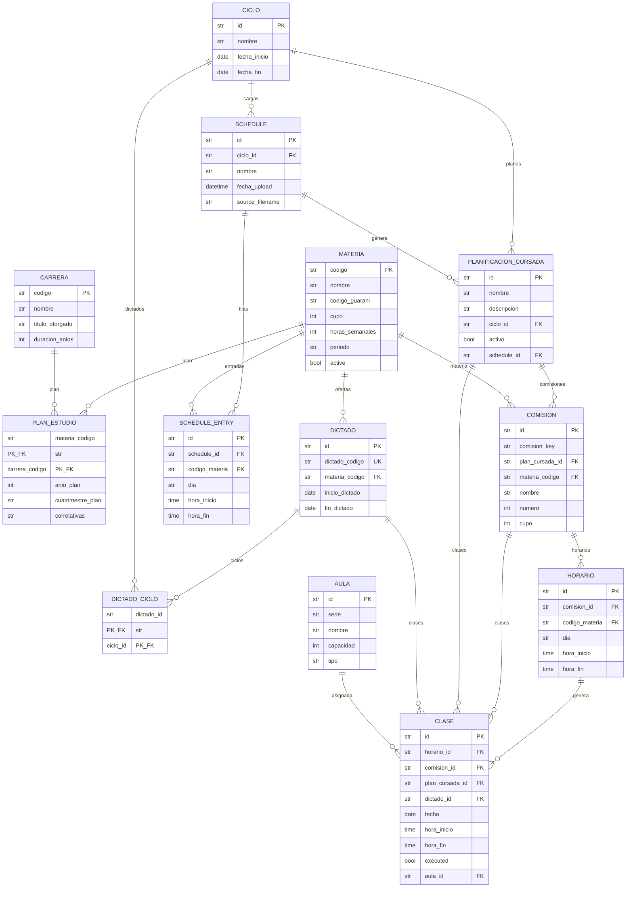

# Modelo de Planificacion de Cursada

Este documento describe el modelo de datos para la gestion de ciclos academicos, planificacion de cursada y generacion de clases. Complementa el modelo ER original (`proyecto/0. Planteo/modelo-er.md`) con las entidades necesarias para gestionar el ciclo de vida completo de las clases.

> **Estado**: Implementado (Tareas 1-11 completadas).
> **Fecha diseño**: 2026-03-09
> **Fecha implementacion**: 2026-03-09

---

## 1. Contexto y Motivaciones

### 1.1 Cambios respecto al modelo original

El modelo original (v1) incluia entidades que quedaron fuera de alcance y usaba una estructura de dos niveles (HorarioCronograma + Clase) para representar horarios. Los cambios principales:

| Cambio | Antes (v1) | Despues (v2) |
|--------|-----------|-------------|
| Entidades deprecadas | Alumno, Profesor, Inscripcion, Asistencia | Eliminadas. Se reincorporan cuando sea necesario |
| Horarios | HorarioCronograma (catalogo) + Clase (link) | Horario (patron semanal bajo Comision) + Clase (instancia con fecha) |
| Comisiones | Creadas manualmente o auto-generadas | Derivadas de la carga de horarios, pertenecen a un plan |
| Materia-Carrera | MateriaCarreraLink simple | PlanEstudio con anio_plan, cuatrimestre_plan, correlativas |
| Ciclos y ofertas | Ciclo y Dictado definidos pero sin uso | Ciclo + Dictado + PlanificacionCursada: gestion completa del ciclo de vida |

### 1.2 Objetivo del modelo

Permitir:

1. **Registrar** que materias se ofrecen en cada ciclo (Dictado)
2. **Cargar** horarios desde archivos Excel/CSV (Schedule + ScheduleEntry)
3. **Generar** planes de cursada con comisiones y horarios (PlanificacionCursada)
4. **Generar** clases individuales con fecha para un ciclo (Clase)
5. **Comparar** diferentes planes (distintas configuraciones de comisiones, horarios, asignaciones de aula)
6. **Gestionar** cambios durante el ciclo (reasignar aulas, modificar horarios, regenerar clases futuras)

---

## 2. Modelo de Entidades

### 2.1 Diagrama de entidades

```
Materia (catalogo estatico, persiste entre ciclos)
  |
  |-- active: bool (parte del plan de carrera vigente?)
  |
  +-- Dictado (oferta de la materia en un periodo)
  |    |-- DictadoCiclo (bridge) --> Ciclo
  |    |    cuatrimestral: 1 ciclo, anual: 2 ciclos
  |    |
  |    +-- inicio_dictado, fin_dictado (fechas reales)
  |
  +-- PlanEstudio --> Carrera
       (anio_plan, cuatrimestre_plan, correlativas)

Ciclo (periodo academico: "2025-2C")
  |
  +-- Schedule (carga validada de horarios)
  |    +-- ScheduleEntry (filas individuales normalizadas)
  |
  +-- PlanificacionCursada (escenario de planificacion, abarca TODAS las materias del ciclo)
       |-- activo: bool (solo 1 activo por ciclo)
       |-- schedule_id: FK al Schedule que lo genero
       |
       +-- Comision (grupo de estudiantes, especifico del plan)
       |    |-- comision_key (clave plan-agnostica para comparacion)
       |    |-- materia_codigo (denormalizado)
       |    +-- Horario (patron semanal: dia + hora, copiado de ScheduleEntry)
       |
       +-- Clase (instancia individual con fecha)
            |-- horario_id, comision_id, plan_cursada_id, dictado_id (FKs)
            |-- fecha, hora_inicio, hora_fin (copiados del horario)
            |-- executed: bool (marca permanente)
            +-- aula_id: FK nullable (asignado por algoritmo de optimizacion)
```

### 2.2 Entidades existentes (implementadas)

#### Materia

Catalogo estatico de asignaturas. Persiste entre ciclos.

| Campo | Tipo | Notas |
|-------|------|-------|
| codigo | str PK | Codigo del plan de estudio (e.g. "MAT101") |
| nombre | str | |
| codigo_guarani | str nullable | Codigo en SIU Guarani (puede diferir del codigo) |
| cupo | int nullable | Capacidad maxima (nullable para actividades sin cupo) |
| horas_semanales | int nullable | Horas semanales de catedra (nullable para actividades asincronas) |
| periodo | str | "anual" o "cuatrimestral" |
| **active** | **bool** | **NUEVO. Indica si la materia es parte del plan de carrera vigente** |

> `active = True` indica que la materia deberia tener un Dictado cuando se crea un nuevo ciclo.
> Materias sin horarios (actividades asincronas, no presenciales) igual obtienen Dictado.

#### Aula

Sin cambios. Espacio fisico para clases.

| Campo | Tipo | Notas |
|-------|------|-------|
| id | str PK | |
| sede | str | |
| nombre | str | |
| capacidad | int | |
| tipo | str | "aula", "laboratorio", "anfiteatro" |
| descripcion | str | |

#### Carrera

Sin cambios. Programa academico.

| Campo | Tipo | Notas |
|-------|------|-------|
| codigo | str PK | |
| nombre | str | |
| titulo_otorgado | str | |
| duracion_anios | int | |
| cantidad_materias | int nullable | |

#### PlanEstudio (tabla de enlace Materia <-> Carrera)

Reemplazo de MateriaCarreraLink con atributos adicionales.

| Campo | Tipo | Notas |
|-------|------|-------|
| materia_codigo | str FK+PK | -> materias |
| carrera_codigo | str FK+PK | -> carreras |
| anio_plan | int nullable | Anio sugerido (1-6) |
| cuatrimestre_plan | str nullable | "1C", "2C", "Anual", o null |
| correlativas | str | Texto crudo con correlativas |

#### Ciclo

Periodo academico (cuatrimestre).

| Campo | Tipo | Notas |
|-------|------|-------|
| id | str PK | e.g. "2025-2C" |
| nombre | str | e.g. "Segundo Cuatrimestre 2025" |
| fecha_inicio | date | |
| fecha_fin | date | |
| descripcion | str | |

### 2.3 Entidades nuevas (a implementar)

#### Dictado

Oferta de una materia en un periodo. Existe para TODA materia activa en un ciclo, tenga o no horarios.

| Campo | Tipo | Notas |
|-------|------|-------|
| id | str PK | UUID auto-generado |
| dictado_codigo | str unique | Display key: "MAT101-2025-2C" (cuatrimestral) o "MAT101-2025" (anual) |
| materia_codigo | str FK | -> materias |
| inicio_dictado | date | Heredado de la fecha_inicio del primer ciclo vinculado |
| fin_dictado | date nullable | Null para anuales en 1C, se llena cuando se crea el ciclo 2C |

> **Dictados para materias anuales**: Se crean en 1C con fin_dictado = null.
> Cuando se crea el ciclo 2C, los dictados anuales del mismo anio se vinculan al 2C
> y su fin_dictado se actualiza con la fecha_fin del ciclo 2C.

#### DictadoCiclo (bridge)

Vincula dictados con ciclos. Cuatrimestral = 1 fila, Anual = 2 filas.

| Campo | Tipo | Notas |
|-------|------|-------|
| dictado_id | str FK+PK | -> dictados |
| ciclo_id | str FK+PK | -> ciclos |

#### Schedule

Carga validada y normalizada de horarios desde un archivo. Almacena los datos de entrada de forma persistente.

| Campo | Tipo | Notas |
|-------|------|-------|
| id | str PK | UUID auto-generado |
| ciclo_id | str FK | -> ciclos |
| nombre | str | e.g. "Horarios 2C 2025 v1" |
| fecha_upload | datetime | Timestamp de la carga |
| source_filename | str | Nombre del archivo original |

#### ScheduleEntry

Filas individuales del schedule, normalizadas y validadas.

| Campo | Tipo | Notas |
|-------|------|-------|
| id | str PK | UUID auto-generado |
| schedule_id | str FK | -> schedules |
| codigo_materia | str FK | -> materias (ya resuelto: codigo_plan, no guarani) |
| dia | str | Dia de la semana validado |
| hora_inicio | time | |
| hora_fin | time | |

> Al persistir, los codigos guarani ya estan resueltos a codigo_plan.
> Las filas con codigos no resueltos no se persisten (se reportan como errores).

#### PlanificacionCursada

Escenario de planificacion para un ciclo completo. Contiene todas las comisiones y clases propuestas para TODAS las materias del ciclo.

| Campo | Tipo | Notas |
|-------|------|-------|
| id | str PK | UUID auto-generado |
| nombre | str | e.g. "Plan inicial", "Optimizacion v2" |
| descripcion | str | |
| ciclo_id | str FK | -> ciclos |
| activo | bool | Solo 1 activo por ciclo (regla de negocio) |
| schedule_id | str FK | -> schedules (input que genero este plan) |

> **Regla**: Maximo 1 PlanificacionCursada por ciclo con `activo = True`.
> Enforcement en la capa de servicios, no como constraint de DB.

#### Comision (modificada)

Grupo de estudiantes. Ahora pertenece a un plan especifico, con ID auto-generado.

| Campo | Tipo | Notas |
|-------|------|-------|
| id | str PK | UUID auto-generado |
| comision_key | str | Clave plan-agnostica: "{dictado_codigo}-{numero:03d}" |
| plan_cursada_id | str FK | -> planificacion_cursada |
| materia_codigo | str FK | -> materias (denormalizado para queries) |
| nombre | str | e.g. "Comision 1" |
| numero | int | Numero secuencial dentro de la materia |
| cupo | int | |

> `comision_key` permite comparar "la misma comision" entre distintos planes.
> Ejemplo: Plan A y Plan B ambos tienen "MAT101-2025-2C-001" pero con diferentes horarios.

#### Horario (modificado)

Patron semanal de clases. Pertenece a una comision (y por transitividad a un plan).

| Campo | Tipo | Notas |
|-------|------|-------|
| id | str PK | |
| comision_id | str FK | -> comisiones |
| codigo_materia | str FK | -> materias (denormalizado) |
| dia | str | Dia de la semana |
| hora_inicio | time | |
| hora_fin | time | |

> Al crear un plan desde un schedule, los Horarios se copian de ScheduleEntries
> y se vinculan a las comisiones correspondientes.

#### Clase (nueva)

Instancia individual de una clase con fecha concreta. Generada a partir de un Horario.

| Campo | Tipo | Notas |
|-------|------|-------|
| id | str PK | UUID auto-generado |
| horario_id | str FK | Patron semanal que genero esta clase |
| comision_id | str FK | Denormalizado desde horario |
| plan_cursada_id | str FK | Denormalizado desde comision |
| dictado_id | str FK | Para queries cross-plan por materia/ciclo |
| fecha | date | Fecha concreta de la clase |
| hora_inicio | time | Copiado del horario al momento de generacion |
| hora_fin | time | Copiado del horario al momento de generacion |
| executed | bool | Marca permanente: True cuando la clase ocurrio |
| aula_id | str FK nullable | -> aulas (asignado por algoritmo de optimizacion) |

---

## 3. Estados derivados de Clase

La unica columna de estado almacenada en Clase es `executed` (bool, default False).
Los demas estados se **derivan** en tiempo de consulta:

### 3.1 Definiciones

| Estado | Condicion | Significado |
|--------|-----------|-------------|
| **Ejecutada** | `executed = True` | La clase ocurrio. Marca permanente, no se revierte. |
| **Planificada** | `executed = False` AND plan.activo AND fecha >= hoy | Clase futura del plan activo. VA a ocurrir. |
| **Borrador** | `executed = False` AND NOT plan.activo | Clase de un plan inactivo. Propuesta/simulacion. |

### 3.2 Consultas tipo

```sql
-- Clases ejecutadas de un ciclo (lo que realmente paso)
SELECT c.* FROM clase c
JOIN planificacion_cursada p ON c.plan_cursada_id = p.id
WHERE c.executed = True AND p.ciclo_id = ?

-- Clases planificadas (futuras del plan activo)
SELECT c.* FROM clase c
JOIN planificacion_cursada p ON c.plan_cursada_id = p.id
WHERE c.executed = False AND p.activo = True AND c.fecha >= date('now')

-- Estado actual completo del ciclo (ejecutadas + planificadas)
SELECT c.* FROM clase c
JOIN planificacion_cursada p ON c.plan_cursada_id = p.id
WHERE p.ciclo_id = ?
  AND (c.executed = True OR (p.activo = True AND c.fecha >= date('now')))

-- Clases borrador de un plan especifico (para comparacion)
SELECT c.* FROM clase c
WHERE c.plan_cursada_id = ? AND c.executed = False

-- Todas las clases de una materia en un ciclo (independiente del plan)
SELECT c.* FROM clase c
JOIN planificacion_cursada p ON c.plan_cursada_id = p.id
WHERE c.dictado_id = ? AND p.ciclo_id = ?
```

### 3.3 Transicion de estados

```
                    plan se activa
    [Borrador] -----------------------> [Planificada]
        ^                                    |
        |           plan se desactiva        |
        +------------------------------------+
                                             |
                         fecha < now()       |
                         (automatico)        v
                                        [Ejecutada]
                                        (permanente)
```

- **Borrador -> Planificada**: Cuando el plan que contiene la clase se marca como `activo = True`
- **Planificada -> Borrador**: Cuando el plan se desactiva (se activa otro plan)
- **Planificada -> Ejecutada**: Automatico. Cuando `clase.hora_fin < now()` y la clase pertenece al plan activo, se marca `executed = True`. Esta marca es **permanente**: una vez ejecutada, no vuelve a borrador aunque el plan se desactive.
- **Borrador -> Ejecutada**: No ocurre. Solo clases del plan activo se marcan como ejecutadas.

### 3.4 Notas de implementacion

- `executed` se actualiza via job periodico o al acceder a los datos del ciclo (lazy marking).
- Al cambiar de plan activo: NO se modifican las clases. Los estados se recalculan via queries.
  Unica excepcion: las clases ya marcadas `executed = True` conservan esa marca.
- Para comparar planes: consultar las clases de cada plan (son estaticas, no se modifican entre planes).
  La comparacion es sobre los datos generados (horarios, aulas), no sobre el estado.

---

## 4. Flujo de trabajo por ciclo

### 4.1 Inicio de ciclo

```
1. Crear Ciclo "2026-1C" (fecha_inicio, fecha_fin)
       |
2. Crear Dictados para materias activas (materia.active = True)
   |   - Cuatrimestrales: 1 Dictado -> DictadoCiclo con "2026-1C"
   |   - Anuales: 1 Dictado -> DictadoCiclo con "2026-1C"
   |     (inicio_dictado = ciclo.fecha_inicio, fin_dictado = null)
       |
3. Cargar horarios (archivo Excel/CSV)
   |   - Se crea un Schedule con ScheduleEntries validados
   |   - Codigos guarani se resuelven a codigo_plan
   |   - Filas con codigos no resueltos se reportan como errores
       |
4. Generar PlanificacionCursada desde el Schedule
   |   - Derivar comisiones por materia (ceil de horas)
   |   - Crear Comisiones con comision_key
   |   - Crear Horarios bajo cada Comision (copiados de ScheduleEntries)
       |
5. (Opcional) Generar Clases para el plan
   |   - Para cada Horario, generar 1 Clase por fecha
   |     que coincida con el dia de la semana, dentro del rango del ciclo
   |   - Todas las clases inician como executed = False
       |
6. (Futuro) Ejecutar algoritmo de asignacion de aulas
       - Asigna aula_id a cada Clase
```

### 4.2 Inicio de ciclo 2C (para materias anuales)

```
1. Crear Ciclo "2026-2C"
       |
2. Dictados anuales de 2026:
   |   - Buscar dictados con periodo = "anual" vinculados a "2026-1C"
   |   - Crear DictadoCiclo vinculandolos tambien a "2026-2C"
   |   - Actualizar fin_dictado = ciclo_2c.fecha_fin
       |
3. Dictados cuatrimestrales:
       - Crear nuevos Dictados para materias cuatrimestrales activas
       - Vincular a "2026-2C" via DictadoCiclo

4. Continuar con pasos 3-6 del flujo normal
```

### 4.3 Modificacion de horarios durante el ciclo

```
1. Cargar nuevo Schedule para el ciclo
       |
2. Crear nueva PlanificacionCursada referenciando el nuevo Schedule
   |   - Nuevas Comisiones (pueden diferir en cantidad)
   |   - Nuevos Horarios
       |
3. Generar Clases para el nuevo plan
   |   - Para todo el rango del ciclo (no solo desde hoy)
   |   - Todas como executed = False (borrador)
       |
4. Comparar planes:
   |   - Viejo plan: clases ejecutadas + planificadas
   |   - Nuevo plan: clases borrador
   |   - Comparar por comision_key: que cambio?
       |
5. Activar el nuevo plan (si se aprueba):
   |   - nuevo_plan.activo = True
   |   - viejo_plan.activo = False
   |   - Las clases executed=True del viejo plan se conservan
   |   - Las clases del nuevo plan pasan de borrador a planificadas
       |
6. (Futuro) Re-ejecutar asignacion de aulas para clases planificadas
```

### 4.4 Comparacion de planes

Para comparar dos planes del mismo ciclo:

| Aspecto | Como comparar |
|---------|---------------|
| Comisiones | Agrupar por comision_key. Diferencias en cantidad = distinta configuracion |
| Horarios | Para misma comision_key: comparar patrones (dia, hora_inicio, hora_fin) |
| Clases | Para misma comision_key y fecha: comparar hora_inicio, hora_fin, aula_id |
| Aulas | Agrupar por aula: ver que materias/horarios tiene cada aula en cada plan |

---

## 5. Relaciones entre entidades

### 5.1 Diagrama ER



### 5.2 Campos denormalizados

Varios campos se denormalizan para evitar joins profundos en queries frecuentes:

| Entidad | Campo denormalizado | Derivable de | Justificacion |
|---------|--------------------|--------------|----|
| Comision | materia_codigo | plan -> dictado -> materia | Query "comisiones de MAT101" sin joins |
| Horario | codigo_materia | comision -> materia | Herencia del modelo actual |
| Clase | comision_id | horario -> comision | Query directa por comision |
| Clase | plan_cursada_id | comision -> plan | Query directa por plan |
| Clase | dictado_id | plan + materia -> dictado | Query cross-plan por materia/ciclo |
| Clase | hora_inicio, hora_fin | horario | Preservar tiempos reales post-cambio de horario |

---

## 6. Reglas de negocio

| # | Regla | Descripcion |
|---|-------|-------------|
| RN1 | Dictados automaticos | Al crear un ciclo, se crean Dictados para toda materia con `active = True` |
| RN2 | Dictados anuales | Materias anuales crean Dictado solo en ciclos 1C. El ciclo 2C se vincula al mismo Dictado |
| RN3 | Un plan activo por ciclo | Maximo 1 PlanificacionCursada con `activo = True` por ciclo |
| RN4 | Executed es permanente | Una vez `clase.executed = True`, no se revierte |
| RN5 | Schedule validado | ScheduleEntries solo contienen codigos de materia resueltos (codigo_plan). Codigos guarani se resuelven al momento de la carga |
| RN6 | Comision key | `comision_key = "{dictado_codigo}-{numero:03d}"`, plan-agnostica, para comparacion entre planes |
| RN7 | Herencia de fechas | Dictado hereda inicio_dictado del primer ciclo. fin_dictado se actualiza cuando se vincula un ciclo posterior (anual) |

---

## 7. Entidades futuras (fuera de alcance actual)

| Entidad | Proposito | Cuando |
|---------|-----------|--------|
| Alumno | Estudiantes inscriptos | Cuando se implemente gestion de inscripciones |
| Profesor | Docentes | Cuando se implemente asignacion de docentes |
| Inscripcion | Alumno <-> Comision | Para estimar demanda de capacidad |
| Asistencia | Alumno <-> Clase | Variable estocastica para optimizacion |
| Versionado de entidades | Tracking de cambios en materias, planes, etc. | Cuando se necesite historial de cambios |

---

## 8. Relacion con el modelo actual (codigo)

### 8.1 Entidades que se mantienen sin cambios

- `AulaDB` (src/database/models.py)
- `CarreraDB` (src/database/models.py)
- `PlanEstudioDB` (src/database/models.py)
- `CicloDB` (src/database/models.py)

### 8.2 Entidades que se modifican

- `MateriaDB`: agregar campo `active: bool`
- `ComisionDB`: cambiar a id auto-generado, agregar `comision_key` y `plan_cursada_id`, eliminar `dictado_id`
- `HorarioDB`: sin cambios de schema, pero ahora pertenece a una Comision plan-especifica

### 8.3 Entidades nuevas a crear

- `DictadoDB` + `DictadoCicloDB`
- `ScheduleDB` + `ScheduleEntryDB`
- `PlanificacionCursadaDB`
- `ClaseDB`

### 8.4 Entidades a eliminar

- `AsignacionAulaDB`: reemplazada por `aula_id` directo en `ClaseDB`
- `DictadoDB` (la version vieja en models.py si existe): reemplazar con la nueva definicion
