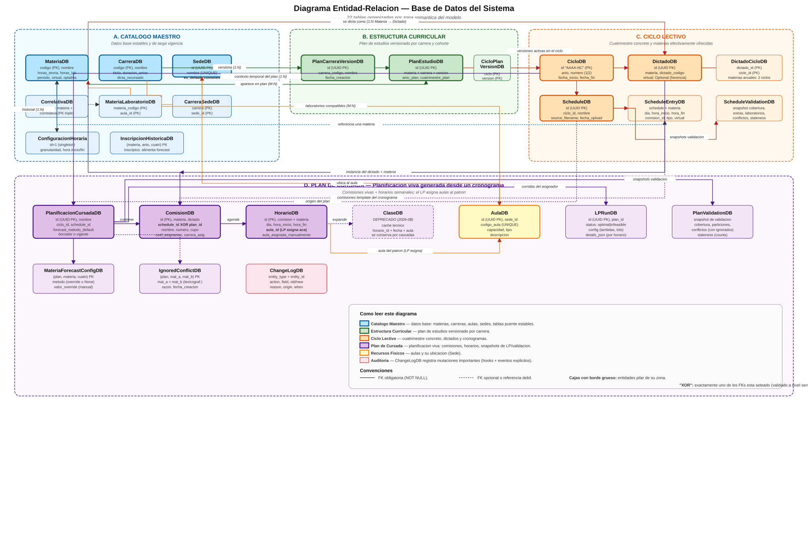

# Anexo — Documentacion Tecnica de la Base de Datos

> **Version del anexo**: 2026-09-03
> **Fuentes de verdad**: `src/database/models.py`, `src/database/connection.py`, `src/database/crud.py`, `src/services/*`
> **Formato**: Este anexo es un documento tecnico independiente. Puede leerse en forma secuencial o utilizarse como referencia consultando la seccion correspondiente.

## Indice

1. Introduccion y alcance
2. Arquitectura general de datos
3. Convenciones y nomenclatura
4. Diagrama entidad-relacion global
5. Catalogo de entidades (fichas por tabla)
6. Politicas de borrado y cascadas
7. Operaciones y logica de negocio por servicio
8. Reglas de integridad e invariantes
9. Migraciones y evolucion del schema
10. Modelo de auditoria (Change Log)
11. Snapshots historicos (Validaciones, LP Runs)
12. Glosario tecnico

---

## 1. Introduccion y alcance

Este anexo documenta la capa de persistencia del sistema Gestor de Aulas. Cubre las **veintidos tablas** que componen el esquema relacional, la **logica aplicada sobre cada operacion de base de datos** (creacion, actualizacion, borrado, consultas complejas), las **reglas de integridad** que garantizan la consistencia de los datos y las **migraciones idempotentes** que permiten evolucionar el esquema sin perdida de informacion.

El objetivo es doble: por un lado, servir como referencia tecnica detallada para el mantenimiento y evolucion del sistema; por otro, formalizar el modelo de datos como parte de la documentacion del proyecto para su presentacion academica.

### 1.1 Convenciones de este documento

- Los nombres de las tablas fisicas se muestran en minusculas con guion bajo (`plan_estudio`), tal como aparecen en SQLite.
- Los nombres de las clases del ORM se muestran con sufijo `DB` en CamelCase (`PlanEstudioDB`).
- Los tipos de datos usan la notacion de Python (`str`, `int`, `Optional[bool]`, `time`, `date`, `datetime`).
- Las citas de codigo referencian archivos con la ruta relativa al repositorio.
- Las **invariantes** se enuncian como propiedades logicas que el sistema garantiza en todo momento.

### 1.2 Fuera de alcance

Este anexo no cubre:

- La UI de Streamlit (documentada en el Manual de Usuario).
- La logica del LP de asignacion de aulas en profundidad matematica (documentada en `project/1. Diseño/asignacion-aulas-LP.md`). Aqui se describe unicamente su interfaz con la base de datos.
- Los algoritmos internos del forecast, salvo lo relativo a persistencia.

---

## 2. Arquitectura general de datos

### 2.1 Stack tecnologico

| Componente | Rol |
|------------|-----|
| **SQLite** | Motor de base de datos embebido. Archivo unico `data/database.db`. Sin servidor. |
| **SQLModel** | Capa ORM que combina Pydantic (validacion) con SQLAlchemy (mapeo relacional). Todas las tablas heredan de `SQLModel` con `table=True`. |
| **SQLAlchemy Core** | Se usa directamente para migraciones (`exec_driver_sql`), pool de conexiones (`NullPool`) y hooks de eventos (`event.listens_for`). |
| **PuLP** | Librería de programacion lineal utilizada por el asignador de aulas. Lee de la base y escribe resultados en `HorarioDB.aula_id` y `LPRunDB`. |

### 2.2 Separacion de capas

El proyecto adopta una separacion estricta entre el **modelo de dominio** (`src/domain/`) y el **modelo de persistencia** (`src/database/models.py`).

```
┌────────────────────────────────────────────┐
│  Capa de UI (Streamlit)                    │
│  src/ui/  + app/pages/                     │
├────────────────────────────────────────────┤
│  Capa de servicios (logica de negocio)     │
│  src/services/*                            │
├────────────────────────────────────────────┤
│  Capa de dominio (entidades puras)         │
│  src/domain/*   (Pydantic frozen)          │
├────────────────────────────────────────────┤
│  Capa de persistencia (SQLModel)           │
│  src/database/models.py                    │
│  src/database/crud.py                      │
│  src/database/converters.py                │
├────────────────────────────────────────────┤
│  Motor SQLite                              │
│  data/database.db                          │
└────────────────────────────────────────────┘
```

**Conversion entre capas**: los servicios operan sobre modelos de dominio (livianos, inmutables, aptos para experimentacion y test) y traducen a modelos de persistencia solo en el limite con la base. Las funciones `to_db()` y `to_domain()` en `src/database/converters.py` implementan ese mapping.

### 2.3 Motor de conexion

El motor SQLAlchemy se configura con parametros especificos para el entorno Streamlit + SQLite (`src/database/connection.py`):

```python
engine = create_engine(
    DATABASE_URL,                # sqlite:///data/database.db
    echo=False,
    poolclass=NullPool,          # una conexion nueva por sesion
    connect_args={"check_same_thread": False},
)
```

- **`NullPool`**: cada `Session()` abre una conexion nueva al archivo y la cierra al salir. Evita un bug observado en Streamlit donde el pool default mantiene transacciones de lectura abiertas que bloquean el flush a disco de commits hechos en otras sesiones, produciendo lecturas stale. Para SQLite + Streamlit el costo de abrir/cerrar conexion por request es despreciable.
- **`check_same_thread=False`**: SQLite prohibe compartir conexiones entre hilos por default; Streamlit puede reasignar handlers a hilos distintos, por lo que se deshabilita el chequeo.
- **`echo=False`**: en debugging se activa (`echo=True`) para volcar todo el SQL generado.

### 2.4 Ciclo de vida de la base

La inicializacion se orquesta en `init_db()`:

1. **Registro de hooks de auditoria**. Se importa `change_log_service` antes de crear tablas, para que los listeners SQLAlchemy queden registrados y `ChangeLogDB` aparezca en el metadata.
2. **`SQLModel.metadata.create_all(engine)`**. Crea las tablas que aun no existen. Este metodo **no altera** tablas existentes.
3. **`_run_migrations(engine)`**. Ejecuta migraciones idempotentes (ALTER TABLE, recreaciones para constraints nuevas, migraciones de datos). Cada migracion detecta si ya corrio y sale sin efecto en tal caso. Ver seccion 9.

### 2.5 Sesiones

`get_session()` es un generador de contexto que abre una `Session` de SQLModel:

```python
def get_session() -> Generator[Session, None, None]:
    with Session(engine) as session:
        yield session
```

Todas las funciones de servicio reciben la sesion como parametro; ninguna la abre por su cuenta. Esto permite componer operaciones en una misma transaccion cuando es necesario.

---

## 3. Convenciones y nomenclatura

### 3.1 Nombres de clases y tablas

| Convencion | Ejemplo | Uso |
|------------|---------|-----|
| `XxxDB` | `MateriaDB` | Clase SQLModel de tabla principal. |
| `XxxYyyDB` | `PlanEstudioDB` | Tabla asociativa nominal (con atributos propios). |
| `XxxYyyLink` | *(no usado actualmente)* | Convencion reservada para tablas puramente puente. |
| `xxx` (lowercase) | `materias` | Nombre de la tabla fisica en SQLite. |

### 3.2 Identificadores primarios

El sistema utiliza tres estrategias de identificador primario:

1. **Codigo natural**: `MateriaDB.codigo`, `CarreraDB.codigo`, `CicloDB.id` (formato `AAAA-NC`, ej. `2026-1C`). Estable, legible, propio del dominio.
2. **UUID v4**: la mayoria de las entidades (`ScheduleDB`, `PlanificacionCursadaDB`, `AulaDB`, `SedeDB`, `ClaseDB`, etc.) usan UUIDs generados con `str(uuid.uuid4())`. Opacos, no significan nada para el usuario final; se muestran mediante campos display (`codigo_aula`, `nombre`).
3. **PK compuesta**: tablas puente como `DictadoCicloDB`, `CicloPlanVersionDB`, `CarreraSedeDB`, `CorrelativaDB`, `MateriaLaboratorioDB` y `InscripcionHistoricaDB` usan claves compuestas por sus FKs. `IgnoredConflictDB` tambien: (`plan_cursada_id`, `materia_a`, `materia_b`).

### 3.3 Nullabilidad y semantica de `None`

En varios campos, `None` no significa "sin valor" sino **"heredar del padre"**. Esta convencion se aplica en toda la jerarquia y se documenta en cada ficha:

- `MateriaDB.dicta_recursado: Optional[bool]` → `None` = usar `CarreraDB.dicta_recursado`.
- `DictadoDB.virtual: Optional[bool]` → `None` = usar `MateriaDB.virtual`.
- `HorarioDB.virtual: Optional[bool]` → `None` = usar `DictadoDB.virtual` (que a su vez puede heredar).

Estas cadenas se resuelven en `src/services/resolucion_jerarquica.py` con la regla **"el nivel mas especifico manda"**.

### 3.4 Nomenclatura de constraints logicas

Las restricciones logicas del modelo de asignacion se numeran (R1..R10) siguiendo el documento `project/1. Diseño/asignacion-aulas-LP.md`. Las restricciones funcionales de UI se numeran RF-LP-N. Ambas familias se referencian desde el codigo.

---

## 4. Diagrama entidad-relacion global



*Version vectorial: [`project/diagrams/er_anexo_base_de_datos.svg`](../diagrams/er_anexo_base_de_datos.svg) · Version bitmap: [`project/diagrams/er_anexo_base_de_datos.png`](../diagrams/er_anexo_base_de_datos.png)*

El diagrama resalta la triple jerarquia del sistema:

- **Rama curricular**: `Carrera` → `PlanCarreraVersion` → `PlanEstudio` → `Materia`. Modela que se cursa en una carrera y en que orden.
- **Rama temporal**: `Ciclo` → `CicloPlanVersion` → `Dictado` → `Comision` → `Horario` → `Clase`. Modela como se dicta un cuatrimestre concreto.
- **Rama fisica**: `Sede` → `Aula`, con `CarreraSede` y `MateriaLaboratorio` como puentes que restringen que aulas son admisibles para que materias / carreras.

`Schedule` (cronograma) es la interfaz entre la rama temporal y la persistencia de datos crudos: representa el archivo Excel de la Facultad, y a partir de el se genera la `PlanificacionCursada` que contiene comisiones vivas.

---

## 5. Catalogo de entidades

Cada ficha incluye: proposito, schema fisico completo, invariantes, indices, relaciones y observaciones tecnicas.

---

### 5.1 Zona: Catalogo Maestro

Datos base estables y de larga vigencia.

#### 5.1.1 `MateriaDB` — tabla `materias`

**Proposito**: representa una asignatura del catalogo academico. Es la entidad raiz del dominio curricular; toda comision, horario, dictado y clase referencia a una materia.

**Schema**:

| Columna | Tipo | Constraint | Default | Descripcion |
|---------|------|------------|---------|-------------|
| `codigo` | `str` | PK, `min_length=1` | — | Codigo unico de la materia (ej. `MAT101`). |
| `nombre` | `str` | `min_length=1` | — | Nombre de la asignatura. |
| `codigo_guarani` | `Optional[str]` | — | `None` | Codigo alternativo usado en SIU Guarani. |
| `cupo` | `Optional[int]` | `gt=0` | `None` | Cupo default heredable a comisiones. |
| `horas_semanales` | `Optional[float]` | `gt=0` | `None` | Total de horas semanales. |
| `horas_teoria` | `Optional[float]` | `ge=0` | `None` | Horas teoricas semanales. |
| `horas_laboratorio` | `Optional[float]` | `ge=0` | `None` | Horas de laboratorio semanales. |
| `periodo` | `str` | — | `"cuatrimestral"` | `"anual"` o `"cuatrimestral"`. |
| `active` | `bool` | — | `True` | Materia activa en el catalogo. |
| `virtual` | `bool` | — | `False` | Modalidad virtual por default. |
| `optativa` | `bool` | — | `False` | Materia optativa (opcional en el plan). |
| `dicta_recursado` | `Optional[bool]` | — | `None` | Override de `CarreraDB.dicta_recursado`. `None` = usar el de la carrera. |

**Invariantes**:

- **INV-MAT-1**: `horas_teoria + horas_laboratorio ≤ horas_semanales` cuando ambos estan definidos. No hay CHECK a nivel schema; se valida en `validar_factibilidad_particion_horas`.
- **INV-MAT-2**: Si `periodo = "anual"`, el sistema generara **dos dictados por año academico** (uno por cuatri), linkeados al mismo `DictadoDB` via `DictadoCicloDB`.

**Relaciones**:

- 1:N con `ComisionDB`, `DictadoDB`, `HorarioDB`, `ClaseDB`, `ScheduleEntryDB`.
- N:M con `CarreraDB` via `PlanEstudioDB`.
- N:M con `AulaDB` via `MateriaLaboratorioDB` (laboratorios compatibles).
- N:M con `CarreraDB` via `CorrelativaDB` (correlativas).

**Auditoria**: mutaciones sobre `virtual`, `active`, `dicta_recursado`, `optativa`, `horas_teoria`, `horas_laboratorio` se auditan en `ChangeLogDB` via hook `change_log_service`.

---

#### 5.1.2 `CarreraDB` — tabla `carreras`

**Proposito**: programa de grado (Ingenieria Civil, en Sistemas, etc.). Agrupa materias segun el plan de estudios.

**Schema**:

| Columna | Tipo | Constraint | Default | Descripcion |
|---------|------|------------|---------|-------------|
| `codigo` | `str` | PK, `min_length=1` | — | Codigo unico (ej. `IC`, `IS`). |
| `nombre` | `str` | `min_length=1` | — | Nombre completo. |
| `titulo_otorgado` | `str` | — | `""` | Titulo (ej. "Ingeniero Civil"). |
| `duracion_anios` | `int` | `ge=1` | `5` | Cantidad de anios del plan. |
| `cantidad_materias` | `Optional[int]` | `ge=1` | `None` | Total esperado de materias del plan. |
| `dicta_recursado` | `bool` | — | `True` | Politica default: la carrera dicta recursado. Sobreescribible por materia. |

**Relaciones**:

- 1:N con `PlanCarreraVersionDB` (versiones del plan).
- N:M con `MateriaDB` via `PlanEstudioDB`.
- N:M con `SedeDB` via `CarreraSedeDB` (sedes admisibles para materias exclusivas).
- 1:N con `CorrelativaDB`.

**Auditoria**: mutaciones sobre `dicta_recursado` se auditan.

---

#### 5.1.3 `SedeDB` — tabla `sedes`

**Proposito**: sede fisica donde se ubican las aulas. Modelada como entidad propia (y no como string libre en `AulaDB.sede`) para permitir referenciarla desde otras tablas (`carrera_sede`, `es_default_comunes`).

**Schema**:

| Columna | Tipo | Constraint | Default | Descripcion |
|---------|------|------------|---------|-------------|
| `id` | `str` | PK, UUID | `uuid4()` | Identificador opaco. |
| `nombre` | `str` | `unique=True`, `index=True`, `min_length=1` | — | Nombre unico globalmente. |
| `es_default_comunes` | `bool` | `index=True` | `False` | `True` en **a lo sumo una** sede. Marca destino default para materias comunes. |

**Invariantes**:

- **INV-SEDE-1**: A lo sumo una fila tiene `es_default_comunes=True`. Garantizado por el servicio `set_sede_default_comunes` que primero desactiva el flag en las otras sedes.
- **INV-SEDE-2**: `nombre` es unico globalmente (constraint fisico).

**Relaciones**:

- 1:N con `AulaDB`.
- N:M con `CarreraDB` via `CarreraSedeDB`.

**Auditoria**: mutaciones sobre `es_default_comunes` se auditan.

**Seeding**: si la tabla `sedes` esta vacia al inicializar la base y la tabla `aulas` tambien lo esta, se inserta automaticamente una sede `Pellegrini` (`_seed_default_sede_if_empty`).

---

#### 5.1.4 `AulaDB` — tabla `aulas`

**Proposito**: espacio fisico donde se dictan las clases. Es el recurso escaso que el LP asigna a los horarios.

**Schema**:

| Columna | Tipo | Constraint | Default | Descripcion |
|---------|------|------------|---------|-------------|
| `id` | `str` | PK, UUID | `uuid4()` | ID opaco, autogenerado. |
| `sede_id` | `str` | FK `sedes.id`, `index=True` | — | Sede donde esta el aula. |
| `codigo_aula` | `str` | `unique=True`, `index=True`, `min_length=1` | — | Codigo display editable (unico globalmente). Autoderivable como `{sede}-{nombre}`. |
| `nombre` | `str` | `min_length=1` | — | Nombre del aula. |
| `capacidad` | `int` | `gt=0` | — | Capacidad nominal (numero de asientos). |
| `tipo` | `str` | — | `"teorica"` | Tipo: `"teorica"`, `"laboratorio"`, etc. |
| `descripcion` | `str` | — | `""` | Descripcion libre (equipamiento, etc.). |

**Invariantes**:

- **INV-AUL-1**: `codigo_aula` es unico globalmente (constraint UNIQUE).
- **INV-AUL-2**: Un aula pertenece a exactamente una sede (FK `sede_id` NOT NULL).

**Relaciones**:

- N:1 con `SedeDB`.
- N:M con `MateriaDB` via `MateriaLaboratorioDB` (laboratorios compatibles con dictado de laboratorio).
- Referenciada por `HorarioDB.aula_id` (aula del patron semanal) y `ClaseDB.aula_id` (override manual por fecha, deprecado).

**Observacion tecnica**: La columna legacy `sede` (string) fue eliminada en la migracion `_migrate_aulas_drop_legacy_sede`. Las bases nuevas ya se crean con el schema limpio.

---

#### 5.1.5 `CorrelativaDB` — tabla `correlativas`

**Proposito**: relacion de precedencia entre materias dentro de una carrera. Una materia solo puede cursarse si sus correlativas fueron aprobadas.

**Schema**:

| Columna | Tipo | Constraint | Descripcion |
|---------|------|------------|-------------|
| `carrera_codigo` | `str` | PK, FK `carreras.codigo` | Carrera donde aplica la correlativa. |
| `materia_codigo` | `str` | PK, FK `materias.codigo` | Materia que se quiere cursar. |
| `materia_correlativa_codigo` | `str` | PK, FK `materias.codigo` | Materia que debe estar aprobada antes. |

**Invariantes**:

- **INV-COR-1**: PK compuesta por los tres FKs → una correlativa se declara una unica vez por (carrera, materia, correlativa).
- **INV-COR-2**: `materia_codigo != materia_correlativa_codigo` (no hay autocorrelativas). No hay CHECK; se asume por convencion.

---

#### 5.1.6 `MateriaLaboratorioDB` — tabla `materia_laboratorio`

**Proposito**: tabla puente M:N entre materias y aulas de tipo laboratorio compatibles para el dictado de horas de laboratorio.

**Schema**:

| Columna | Tipo | Constraint |
|---------|------|------------|
| `materia_codigo` | `str` | PK, FK `materias.codigo` |
| `aula_id` | `str` | PK, FK `aulas.id` |

**Uso en el LP**: el asignador consulta esta tabla para armar el conjunto de aulas admisibles para horarios de tipo `"laboratorio"`. Los horarios teoricos ignoran la tabla y pueden asignarse a cualquier aula compatible por tipo/sede.

---

### 5.2 Zona: Estructura Curricular

Modela el plan de estudios y su versionado.

#### 5.2.1 `PlanCarreraVersionDB` — tabla `plan_carrera_version`

**Proposito**: version fechada del plan de estudios de una carrera. Permite mantener planes que evolucionan a lo largo del tiempo (Plan 2015, Plan 2023, etc.) sin perder la trazabilidad de cohortes anteriores.

**Schema**:

| Columna | Tipo | Constraint | Default |
|---------|------|------------|---------|
| `id` | `str` | PK, UUID | — |
| `carrera_codigo` | `str` | FK `carreras.codigo`, `index=True` | — |
| `nombre` | `str` | — | — |
| `descripcion` | `str` | — | `""` |
| `fecha_creacion` | `date` | — | — |

**Relaciones**:

- N:1 con `CarreraDB`.
- 1:N con `PlanEstudioDB` (las celdas del plan).
- N:M con `CicloDB` via `CicloPlanVersionDB` (que versiones se dictan en cada ciclo).

---

#### 5.2.2 `PlanEstudioDB` — tabla `plan_estudio`

**Proposito**: celda del plan de estudios. Vincula una materia con una carrera **en el contexto de una version de plan** y le asigna una ubicacion curricular (anio + cuatrimestre). Es la tabla puente M:N nominal mas importante del sistema.

**Schema**:

| Columna | Tipo | Constraint | Default |
|---------|------|------------|---------|
| `id` | `str` | PK, UUID | `uuid4()` |
| `plan_version_id` | `str` | FK `plan_carrera_version.id`, `index=True` | — |
| `materia_codigo` | `str` | FK `materias.codigo`, `index=True` | — |
| `carrera_codigo` | `str` | FK `carreras.codigo`, `index=True` | — |
| `anio_plan` | `Optional[int]` | `ge=1`, `le=6` | `None` |
| `cuatrimestre_plan` | `Optional[str]` | — | `None` (valores: `"1C"`, `"2C"`, `"Anual"`) |
| `correlativas` | `str` | — | `""` (string legacy) |
| `optativa` | `bool` | — | `False` |

**Invariantes**:

- **INV-PE-1**: Una materia puede aparecer en **multiples celdas** de una misma version de plan si es dictada por varias carreras (ej. Analisis I aparece en IC/IS/IE con la misma version).
- **INV-PE-2**: `anio_plan` y `cuatrimestre_plan` juntos determinan el "año/cuatri de la carrera" que se usa para validar solapamientos horarios (validacion 2).

**Rol en validaciones**:

- La validacion 2 (`validar_horarios_carrera`) agrupa por `(carrera_codigo, anio_plan, cuatrimestre_plan)` para detectar solapamientos entre materias que un alumno del mismo año cursa simultaneamente.
- El servicio `dictado_service` recorre `PlanEstudioDB` filtrado por `CicloPlanVersionDB.plan_version_id` para determinar que materias deberian dictarse en un ciclo.

---

### 5.3 Zona: Ciclo Lectivo

Modela el periodo lectivo (cuatrimestre) y las materias efectivamente ofrecidas.

#### 5.3.1 `CicloDB` — tabla `ciclos`

**Proposito**: periodo lectivo concreto (`2026-1C`, `2026-2C`). Todas las entidades operativas (schedules, planes, dictados) se contextualizan en un ciclo.

**Schema**:

| Columna | Tipo | Constraint | Descripcion |
|---------|------|------------|-------------|
| `id` | `str` | PK | Formato `AAAA-NC` (ej. `2026-1C`). No editable despues de crearse. |
| `anio` | `int` | `ge=2020`, `le=2100` | Año academico. |
| `numero` | `int` | `ge=1`, `le=2` | 1 = primer cuatri, 2 = segundo cuatri. |
| `fecha_inicio` | `date` | — | Fecha de inicio del ciclo. |
| `fecha_fin` | `date` | — | Fecha de fin del ciclo. |
| `descripcion` | `str` | — | Descripcion libre. |

**Invariantes**:

- **INV-CIC-1**: `id = f"{anio}-{numero}C"`. Generado en la UI antes de la insercion; no se valida en la base.
- **INV-CIC-2**: `fecha_inicio < fecha_fin`. No hay CHECK; se valida en la UI.

**Relaciones**:

- N:M con `DictadoDB` via `DictadoCicloDB`.
- N:M con `PlanCarreraVersionDB` via `CicloPlanVersionDB`.
- 1:N con `ScheduleDB`, `PlanificacionCursadaDB`.

---

#### 5.3.2 `CicloPlanVersionDB` — tabla `ciclo_plan_version`

**Proposito**: bridge que declara que versiones de plan aplican a un ciclo. Un ciclo puede tener varias versiones activas simultaneamente (ej. Plan 2015 para cohortes viejas + Plan 2023 para nuevas).

**Schema**:

| Columna | Tipo | Constraint |
|---------|------|------------|
| `ciclo_id` | `str` | PK, FK `ciclos.id` |
| `plan_version_id` | `str` | PK, FK `plan_carrera_version.id` |

**Rol**: fija el conjunto de materias que **potencialmente** se dictan en el ciclo. Se usa por `dictado_service` como fuente del bulk-create de dictados.

---

#### 5.3.3 `DictadoDB` — tabla `dictados`

**Proposito**: instancia de una materia ofrecida en uno o mas ciclos. Modela materias anuales (linkeadas a dos ciclos consecutivos) o cuatrimestrales (linkeadas a uno).

**Schema**:

| Columna | Tipo | Constraint | Default |
|---------|------|------------|---------|
| `id` | `str` | PK, UUID | — |
| `materia_codigo` | `str` | FK `materias.codigo`, `index=True` | — |
| `dictado_codigo` | `str` | `index=True` | `""` (display key ej. `MAT101-2025-2C` o `MAT101-2025`) |
| `inicio_dictado` | `Optional[date]` | — | `None` |
| `fin_dictado` | `Optional[date]` | — | `None` |
| `virtual` | `Optional[bool]` | — | `None` |

**Semantica del campo `virtual`**:

- `None` → hereda de `MateriaDB.virtual`.
- `True` → fuerza virtual, aunque la materia sea presencial.
- `False` → fuerza presencial, aunque la materia sea virtual.

Se resuelve con `resolve_virtual` (ver seccion 3.3).

**Relaciones**:

- N:1 con `MateriaDB`.
- N:M con `CicloDB` via `DictadoCicloDB`.
- 1:N con `ComisionDB` (via `dictado_id`).

**Semantica de "existencia"**: la columna `activo` fue eliminada en la migracion `_migrate_dictado_drop_activo`. Ahora **un dictado existe si y solo si se dicta**. No hay dictados "inactivos"; si un dictado no se debe dictar, se borra.

**Auditoria**: alta/baja completa se audita, ademas del campo `virtual`.

---

#### 5.3.4 `DictadoCicloDB` — tabla `dictado_ciclo`

**Proposito**: bridge M:N entre `DictadoDB` y `CicloDB`. Permite que una materia anual aparezca vinculada a dos ciclos consecutivos (1C y 2C del mismo año) sin duplicar el `DictadoDB`.

**Schema**:

| Columna | Tipo | Constraint |
|---------|------|------------|
| `dictado_id` | `str` | PK, FK `dictados.id` |
| `ciclo_id` | `str` | PK, FK `ciclos.id` |

**Uso**: al crear dictados para un ciclo con `create_dictados_for_ciclo`:

- Materia cuatrimestral → un `DictadoDB` linkeado a **1 ciclo**.
- Materia anual → un `DictadoDB` linkeado a **2 ciclos consecutivos** (si ya existe el dictado del 1C, se linkea al 2C via una nueva fila `DictadoCicloDB`).

**Auditoria**: alta/baja se audita (aparicion/desaparicion del dictado en un ciclo).

---

### 5.4 Zona: Cronogramas

Datos crudos de horarios como vienen del Excel de la Facultad.

#### 5.4.1 `ScheduleDB` — tabla `schedules`

**Proposito**: representa un archivo de horarios cargado en el sistema. Contiene metadata (nombre, fecha de subida, archivo origen) y agrupa las entries (filas) del archivo.

**Schema**:

| Columna | Tipo | Constraint | Default |
|---------|------|------------|---------|
| `id` | `str` | PK, UUID | — |
| `ciclo_id` | `Optional[str]` | FK `ciclos.id`, `index=True` | `None` |
| `nombre` | `str` | — | — |
| `fecha_upload` | `date` | — | — |
| `source_filename` | `str` | — | `""` |

**Observaciones**:

- `ciclo_id` puede ser `None` en cronogramas huerfanos (subidos antes de asignar ciclo). La migracion `_migrate_schedules_nullable_ciclo` recreo la tabla para hacerlo nullable.
- Un ciclo puede tener multiples cronogramas (v1, v2, etc.). La UI elige uno para generar el plan.

**Relaciones**:

- N:1 con `CicloDB`.
- 1:N con `ScheduleEntryDB`.
- 1:N con `ComisionDB` (comisiones "template" del cronograma).
- 1:N con `ScheduleValidationDB` (snapshots de validacion).

---

#### 5.4.2 `ScheduleEntryDB` — tabla `schedule_entries`

**Proposito**: una fila del archivo. Cada entry representa un bloque horario para una materia en un dia concreto.

**Schema**:

| Columna | Tipo | Constraint | Default |
|---------|------|------------|---------|
| `id` | `str` | PK, UUID | — |
| `schedule_id` | `str` | FK `schedules.id`, `index=True` | — |
| `codigo_materia` | `str` | FK `materias.codigo`, `index=True` | — |
| `dia` | `str` | — | — |
| `hora_inicio` | `time` | — | — |
| `hora_fin` | `time` | — | — |
| `comision_id` | `Optional[str]` | FK `comisiones.id`, `index=True` | `None` |
| `tipo_clase` | `Optional[str]` | — | `None` (valores: `"teorica"`, `"laboratorio"`) |
| `virtual` | `Optional[bool]` | — | `None` |

**Observaciones**:

- La FK `comision_id` reemplazo al viejo campo `comision: int` (identificador de facto por indice, no una entidad real). La migracion `_migrate_schedule_entries_a_comision_id` creo `ComisionDB` con `schedule_id` seteado por cada tupla distinta y remapeo las FKs.
- Un entry sin `comision_id` (`None`) es un huerfano: existe en la grilla pero no fue asignado a una comision concreta. La UI de "Editar cronograma" es donde el usuario los asocia.
- `tipo_clase` se propaga al `HorarioDB` correspondiente al generar el plan.

---

#### 5.4.3 `ScheduleValidationDB` — tabla `schedule_validations`

**Proposito**: snapshot historico de una validacion de cronograma contra un ciclo. Cada corrida de "Prevalidar cronograma" inserta una fila. Se conservan todas para auditoria; la UI muestra la mas reciente por (`schedule_id`, `ciclo_id`).

Ver seccion 11.1 para el schema completo y la logica de staleness.

---

### 5.5 Zona: Plan de Cursada

Planificacion trabajable generada a partir de un cronograma.

#### 5.5.1 `PlanificacionCursadaDB` — tabla `planificaciones_cursada`

**Proposito**: planificacion viva de un ciclo lectivo, generada desde un `ScheduleDB`. Contiene comisiones concretas con cupos, horarios asignados a esas comisiones, y el resultado de la asignacion de aulas.

**Schema**:

| Columna | Tipo | Constraint | Default |
|---------|------|------------|---------|
| `id` | `str` | PK, UUID | — |
| `nombre` | `str` | — | — |
| `descripcion` | `str` | — | `""` |
| `ciclo_id` | `str` | FK `ciclos.id`, `index=True` | — |
| `schedule_id` | `Optional[str]` | FK `schedules.id` | `None` |
| `forecast_metodo_default` | `str` | — | `"media_movil"` |

**Observaciones**:

- La columna `activo` fue eliminada (`_migrate_planificacion_cursada_drop_activo`). El concepto de "plan activo del ciclo" quedo obsoleto tras la deprecacion de las clases puntuales.
- `forecast_metodo_default` es el metodo aplicado por default a todas las materias del plan; puede overridearse por materia en `MateriaForecastConfigDB`.

**Relaciones**:

- N:1 con `CicloDB`.
- N:1 con `ScheduleDB` (opcional; puede haber planes creados sin cronograma).
- 1:N con `ComisionDB` (comisiones vivas del plan).
- 1:N con `ClaseDB` (deprecado).
- 1:N con `MateriaForecastConfigDB`, `LPRunDB`, `PlanValidationDB`, `IgnoredConflictDB`.

---

#### 5.5.2 `ComisionDB` — tabla `comisiones`

**Proposito**: division de una materia para distribuir alumnos. Es la entidad **dual**: puede pertenecer a un **cronograma** (comision template) o a un **plan de cursada** (comision viva), pero **no a ambos a la vez**.

**Schema**:

| Columna | Tipo | Constraint | Default |
|---------|------|------------|---------|
| `id` | `str` | PK | — |
| `materia_codigo` | `str` | FK `materias.codigo`, `index=True` | — |
| `dictado_id` | `Optional[str]` | FK `dictados.id`, `index=True` | `None` |
| `plan_cursada_id` | `Optional[str]` | FK `planificaciones_cursada.id`, `index=True` | `None` |
| `schedule_id` | `Optional[str]` | FK `schedules.id`, `index=True` | `None` |
| `comision_key` | `str` | — | `""` (formato `{dictado_codigo}-{numero:03d}`) |
| `nombre` | `str` | — | `"Comisión Única"` |
| `numero` | `int` | `ge=1` | `1` |
| `cupo` | `int` | `gt=0` | — |
| `descripcion` | `str` | — | `""` |
| `coef_asignacion` | `float` | `ge=0`, `le=1` | `1.0` |
| `carrera_asignada` | `Optional[str]` | FK `carreras.codigo`, `index=True` | `None` |

**Invariantes**:

- **INV-COM-XOR**: exactamente uno de `schedule_id` o `plan_cursada_id` esta seteado. Validado en `comision_service` (no hay constraint fisico porque SQLite no soporta CHECK con OR facilmente).
- **INV-COM-COEF**: la suma de `coef_asignacion` sobre las comisiones **de un mismo dictado** debe ser aproximadamente 1.0. Se valida a nivel servicio (no fisico). Sirve para distribuir la demanda esperada entre comisiones.
- **INV-COM-CARR**: si `carrera_asignada` esta seteado, el LP fuerza al asignador a usar aulas de las sedes de esa carrera (RF-LP-15), ignorando la regla de "materias comunes → sede default".

**Rol dual**:

- **Comision de cronograma** (`schedule_id` seteado): plantilla usada por los `ScheduleEntryDB` para agrupar bloques bajo un mismo "grupo" (C1, C2, etc.). Al generar el plan, estas comisiones se **clonan** con IDs nuevos, preservando atributos.
- **Comision de plan** (`plan_cursada_id` seteado): entidad viva. Los `HorarioDB` del plan apuntan aca. Es lo que el LP y las validaciones procesan.

**Relaciones**:

- N:1 con `MateriaDB`.
- N:1 con `DictadoDB`.
- N:1 con `PlanificacionCursadaDB` o `ScheduleDB` (XOR).
- 1:N con `HorarioDB`, `ClaseDB`.

**Semantica del `numero`**: es display-only, no un identificador. La identidad de una comision es su `id` (UUID). El usuario numera 1/2/3 a su criterio.

---

#### 5.5.3 `HorarioDB` — tabla `horarios`

**Proposito**: bloque horario semanal recurrente de una comision. Es la **entidad de trabajo del LP**: el asignador de aulas resuelve el mapping `horario → aula`.

**Schema**:

| Columna | Tipo | Constraint | Default |
|---------|------|------------|---------|
| `id` | `str` | PK | — |
| `comision_id` | `str` | FK `comisiones.id`, `index=True` | — |
| `codigo_materia` | `str` | FK `materias.codigo`, `index=True` | — |
| `dia` | `str` | `index=True` | — |
| `hora_inicio` | `time` | — | — |
| `hora_fin` | `time` | — | — |
| `tipo_clase` | `Optional[str]` | — | `None` (`"teorica"`, `"laboratorio"`) |
| `aula_id` | `Optional[str]` | FK `aulas.id`, `index=True` | `None` |
| `aula_asignada_manualmente` | `bool` | — | `False` |
| `virtual` | `Optional[bool]` | — | `None` |

**Semantica de `aula_id`**:

- Representa el **aula del patron**. El LP la asigna; las `ClaseDB` heredan por default este valor al generarse.
- `None` = el patron no tiene aula asignada (el LP no corrio o se edito el slot).
- `aula_asignada_manualmente=True` marca que la asignacion fue seteada por edicion manual. Por default el LP respeta estas asignaciones (toggle "Respetar ediciones manuales").

**Semantica del campo `virtual`**: sigue la cadena `HorarioDB.virtual → DictadoDB.virtual → MateriaDB.virtual` con la regla "nivel mas especifico manda". Permite mezclar modalidades dentro de una misma comision.

**Relaciones**:

- N:1 con `ComisionDB`, `MateriaDB`.
- N:1 con `AulaDB` (aula del patron).
- 1:N con `ClaseDB` (deprecado).

---

#### 5.5.4 `ClaseDB` — tabla `clases` (DEPRECADO)

**Proposito historico**: instancia puntual de una clase con fecha, expandida desde un `HorarioDB` (Lunes 12/03/2026 08:00-10:00).

**Estado actual (2026-08+)**: **DEPRECADO**. El modelo de dominio activo trabaja exclusivamente sobre el patron semanal (`HorarioDB`). `ClaseDB` quedo como cache tecnico unidireccional (`HorarioDB → ClaseDB`) que ninguna vista de la UI renderiza. Se conserva unicamente para:

- No romper cascadas de borrado.
- Sostener la validacion `validar_conflictos_aula_plan`.

**Schema** (documentado por referencia; no debe usarse en features nuevas):

| Columna | Tipo | Descripcion |
|---------|------|-------------|
| `id` | `str` | PK, UUID |
| `horario_id` | `str` | FK `horarios.id` |
| `comision_id` | `str` | FK `comisiones.id` |
| `plan_cursada_id` | `str` | FK `planificaciones_cursada.id` |
| `dictado_id` | `Optional[str]` | FK `dictados.id` |
| `fecha` | `date` | Fecha concreta. |
| `hora_inicio` | `time` | — |
| `hora_fin` | `time` | — |
| `executed` | `bool` | Si la clase ya se dicto. |
| `aula_id` | `Optional[str]` | Override manual por fecha. |
| `tipo_clase` | `Optional[str]` | — |
| `aula_asignada_manualmente` | `bool` | Deprecado; el flag activo esta en `HorarioDB`. |

**Retiro futuro**: el drop de la tabla y limpieza de servicios esta trackeada en `project/2. Desarrollo/DEPRECACION_CLASEDB.md`.

---

### 5.6 Zona: Configuracion y Auxiliares

#### 5.6.1 `ConfiguracionHoraria` — tabla `configuracion_horaria`

**Proposito**: parametros globales de la grilla horaria. Fila unica (`id=1`).

**Schema**:

| Columna | Tipo | Constraint | Default |
|---------|------|------------|---------|
| `id` | `int` | PK | `1` |
| `granularidad_minutos` | `int` | `ge=5`, `le=60` | `15` |
| `hora_inicio_operativo` | `time` | — | `07:00` |
| `hora_fin_operativo` | `time` | — | `23:00` |
| `dias_operativos` | `str` | — | `"Lunes,Martes,Miércoles,Jueves,Viernes,Sábado"` |

---

#### 5.6.2 `CarreraSedeDB` — tabla `carrera_sede`

**Proposito**: tabla puente M:N entre carreras y sedes habilitadas para sus materias exclusivas.

**Schema**:

| Columna | Tipo | Constraint |
|---------|------|------------|
| `carrera_codigo` | `str` | PK, FK `carreras.codigo` |
| `sede_id` | `str` | PK, FK `sedes.id` |

**Regla R10 del LP**:

- Materia **exclusiva** (aparece en 1 sola carrera): solo puede asignarse a aulas cuya sede este en `CarreraSedeDB` para esa carrera.
- Materia **comun** (aparece en ≥2 carreras): ignora esta tabla y se rige por `SedeDB.es_default_comunes`.
- Si una carrera no tiene fila en la tabla: fallback "todas las sedes admisibles".

Ver `src/services/carrera_sede_service.py` para el helper `sedes_admisibles_para_materia`.

---

#### 5.6.3 `InscripcionHistoricaDB` — tabla `inscripciones_historicas`

**Proposito**: registro historico de inscriptos por (`materia`, `anio`, `cuatrimestre`). Alimenta al forecast de demanda.

**Schema**:

| Columna | Tipo | Constraint |
|---------|------|------------|
| `materia_codigo` | `str` | PK, FK `materias.codigo` |
| `anio` | `int` | PK |
| `cuatrimestre` | `str` | PK (`"1C"`, `"2C"`, `"Anual"`) |
| `inscriptos` | `int` | `ge=0` |

**Uso**: `forecast_service` lee esta tabla para armar la serie temporal y aplicar el metodo elegido (media movil, drift, SES).

---

#### 5.6.4 `MateriaForecastConfigDB` — tabla `materia_forecast_config`

**Proposito**: override de configuracion de forecast a nivel (plan, materia, cuatrimestre).

**Schema**:

| Columna | Tipo | Constraint | Default |
|---------|------|------------|---------|
| `plan_cursada_id` | `str` | PK, FK `planificaciones_cursada.id` | — |
| `materia_codigo` | `str` | PK, FK `materias.codigo` | — |
| `cuatrimestre` | `str` | PK (`"1C"`, `"2C"`, `"Anual"`) | — |
| `metodo` | `Optional[str]` | — | `None` (`"media_movil"`, `"drift"`, `"ses"`, `None`) |
| `valor_override` | `Optional[float]` | `ge=0` | `None` |

**Semantica de overrides**:

- `metodo=None` → usar `PlanificacionCursadaDB.forecast_metodo_default`.
- `metodo="X"` → forzar metodo X.
- `valor_override=None` → calcular forecast con la serie historica.
- `valor_override=X` → forzar valor X (util cuando hay preinscripcion externa o falta serie historica).

**Persistencia**: el valor del forecast **NO se persiste**. Se recomputa on-demand. Solo la config vive en la base.

---

#### 5.6.5 `IgnoredConflictDB` — tabla `ignored_conflicts`

**Proposito**: par de materias cuyo conflicto de horarios el usuario decidio ignorar. Granularidad por par (no por slot horario): si una vez se ignoro, queda ignorado aunque cambien los horarios.

**Schema**:

| Columna | Tipo | Constraint |
|---------|------|------------|
| `plan_cursada_id` | `str` | PK, FK `planificaciones_cursada.id` |
| `materia_a` | `str` | PK (ordenado lexicograficamente `<`) |
| `materia_b` | `str` | PK (`> materia_a`) |
| `razon` | `str` | Default `""` |
| `fecha_creacion` | `datetime` | Default `utcnow()` |

**Invariante**: `materia_a < materia_b` lexicograficamente. Deduplica pares en cualquier orden de creacion.

---

### 5.7 Tabla resumen del catalogo

| Zona | Tabla fisica | Clase SQLModel | Rol |
|------|--------------|-----------------|-----|
| Configuracion | `configuracion_horaria` | `ConfiguracionHoraria` | Config global de grilla |
| Catalogo maestro | `materias` | `MateriaDB` | Asignatura |
| Catalogo maestro | `carreras` | `CarreraDB` | Programa de grado |
| Catalogo maestro | `sedes` | `SedeDB` | Sede fisica |
| Catalogo maestro | `aulas` | `AulaDB` | Espacio fisico |
| Catalogo maestro | `correlativas` | `CorrelativaDB` | Precedencia entre materias |
| Catalogo maestro | `materia_laboratorio` | `MateriaLaboratorioDB` | Compatibilidad materia↔lab |
| Catalogo maestro | `carrera_sede` | `CarreraSedeDB` | Sedes habilitadas por carrera |
| Estructura curricular | `plan_carrera_version` | `PlanCarreraVersionDB` | Version del plan |
| Estructura curricular | `plan_estudio` | `PlanEstudioDB` | Celda del plan |
| Ciclo lectivo | `ciclos` | `CicloDB` | Cuatrimestre concreto |
| Ciclo lectivo | `ciclo_plan_version` | `CicloPlanVersionDB` | Versiones activas en un ciclo |
| Ciclo lectivo | `dictados` | `DictadoDB` | Materia ofrecida |
| Ciclo lectivo | `dictado_ciclo` | `DictadoCicloDB` | Dictado ↔ ciclos |
| Cronogramas | `schedules` | `ScheduleDB` | Archivo de horarios |
| Cronogramas | `schedule_entries` | `ScheduleEntryDB` | Fila del archivo |
| Cronogramas | `schedule_validations` | `ScheduleValidationDB` | Snapshot de validacion |
| Plan de cursada | `planificaciones_cursada` | `PlanificacionCursadaDB` | Plan generado |
| Plan de cursada | `comisiones` | `ComisionDB` | Comision (template o viva) |
| Plan de cursada | `horarios` | `HorarioDB` | Bloque semanal (input del LP) |
| Plan de cursada | `clases` | `ClaseDB` | Instancia por fecha (deprecado) |
| Plan de cursada | `plan_validations` | `PlanValidationDB` | Snapshot de validacion |
| Plan de cursada | `ignored_conflicts` | `IgnoredConflictDB` | Conflictos silenciados |
| Plan de cursada | `materia_forecast_config` | `MateriaForecastConfigDB` | Override de forecast |
| Plan de cursada | `inscripciones_historicas` | `InscripcionHistoricaDB` | Historial para forecast |
| Plan de cursada | `lp_runs` | `LPRunDB` | Snapshot de corrida del LP |
| Auditoria | `change_log` | `ChangeLogDB` | Log de mutaciones |

**Total: 22 tablas.**

---

## 6. Politicas de borrado y cascadas

### 6.1 Registry de relaciones

El sistema mantiene un registro central en `src/services/relationship_registry.py` con metadatos de cada relacion, incluyendo su politica de borrado. `src/services/relationship_definitions.py` registra las relaciones al importarse.

Cada `RelationshipMetadata` incluye `delete_behavior: "cascade" | "restrict"`:

| Relacion padre → hijo | Delete behavior | Motivo |
|-----------------------|-----------------|--------|
| Carrera → Materia (via PlanEstudio) | `restrict` | No borrar carreras con materias asociadas. |
| Materia → Comision | `cascade` | Si se borra la materia, sus comisiones no tienen sentido. |
| Comision → Horario | `cascade` | Idem. |

Estas politicas se aplican **en la capa de servicios** (`CascadingOperations.delete_with_cascading`), no como constraints ON DELETE de SQLite. La razon: el borrado suele requerir logica adicional (auditoria, invalidacion de snapshots, actualizacion de flags derivados).

### 6.2 Cascada explicita en operaciones

Ademas del registry, varias operaciones ejecutan cascadas explicitas:

- **Borrar un `CicloDB`**: borra en cascada `PlanificacionCursadaDB`, `ScheduleDB`, `DictadoCicloDB` y `CicloPlanVersionDB` asociados. El servicio lo hace en orden inverso a las FKs para evitar violaciones temporales.
- **Borrar una `PlanificacionCursadaDB`**: borra `ComisionDB` con ese `plan_cursada_id`, sus `HorarioDB`, `ClaseDB`, `LPRunDB`, `PlanValidationDB`, `IgnoredConflictDB` y `MateriaForecastConfigDB`. No toca al `ScheduleDB` origen (puede haber otros planes generados desde el).
- **Borrar un `ScheduleDB`**: borra `ScheduleEntryDB` y `ScheduleValidationDB` asociados. **No** borra planes generados a partir de el (las comisiones del plan ya fueron clonadas y viven independientes).
- **Borrar un `DictadoDB`**: nulifica `dictado_id` en las `ClaseDB` que apuntan a el (via `SET NULL` implicito en la migracion `_migrate_dictado_drop_activo`). Borra las filas `DictadoCicloDB` correspondientes.
- **Borrar un `AulaDB`**: nulifica `aula_id` en los `HorarioDB` y `ClaseDB` que la referencian. Borra filas de `MateriaLaboratorioDB`.

### 6.3 Cascada de creacion

`CascadingOperations.create_with_cascading` permite crear entidades hijas automaticamente al crear el padre. Actualmente **no hay relaciones con `cascading_create=True` activas** (fue considerado para crear "Comision Unica" al crear una materia, pero la comision se crea en el momento de armar el cronograma/plan, no al alta de la materia). El mecanismo queda disponible para features futuras.

### 6.4 Restrict como salvaguarda

Algunas relaciones bloquean el borrado del padre si hay hijos:

- Carrera con materias asociadas via `PlanEstudioDB`: `restrict`. El usuario debe primero desasociar las materias.
- Materia usada en algun `ScheduleEntryDB` de un cronograma persistido: `restrict` a nivel servicio (no fisico). Se pide confirmacion o migracion previa.

---

## 7. Operaciones y logica de negocio por servicio

Esta seccion documenta las operaciones agrupadas por servicio, con foco en las **reglas aplicadas** en cada caso: validaciones, invariantes preservadas, efectos colaterales.

### 7.1 CRUD generico (`src/database/crud.py`)

Implementa el patron Repository via `CRUDBase[T]` generico. Provee `get`, `get_all(skip, limit)`, `create`, `update`, `delete`. Cada tabla tiene una instancia (`materia_crud`, `aula_crud`, etc.). No incluye logica de dominio; solo persistencia bruta.

Uso tipico: `materia_crud.create(session, MateriaDB(...))`.

### 7.2 Servicio de comisiones (`comision_service.py`)

**Rol dual**: gestiona comisiones template (de cronograma) y comisiones vivas (de plan).

**Operaciones principales**:

- `create_comision(session, materia_codigo, ..., schedule_id=None, plan_cursada_id=None)`:
  - Valida XOR: exactamente uno de `schedule_id` o `plan_cursada_id` debe estar seteado (INV-COM-XOR).
  - Resuelve `cupo` default desde `MateriaDB.cupo`, o `30` si la materia no tiene definido.
  - Calcula el proximo `numero` libre dentro del scope (cronograma o plan): `_next_numero_libre`.
  - Genera `comision_key` con el formato `{materia_codigo}-{numero:03d}` (o `{dictado_codigo}-{numero:03d}` si esta linkeado a dictado).

- `update_comision(session, id, **fields)`:
  - Preserva el XOR (rechaza actualizaciones que dejarian ambos FKs seteados o ambos en `None`).
  - Actualiza `coef_asignacion` solo dentro del rango `[0, 1]`.
  - Emite evento al `ChangeLogDB` si cambio `carrera_asignada`.

- `delete_comision(session, id)`:
  - Cascada: borra `HorarioDB` con `comision_id` = id.
  - Rechaza si hay `ScheduleEntryDB` apuntando a esta comision template (para no dejar entries huerfanos).

### 7.3 Servicio de dictados (`dictado_service.py`)

**Rol**: gestiona la vida de los `DictadoDB` para un ciclo. Incluye bulk-create desde el plan de estudios y logica de sincronizacion.

**Operaciones principales**:

- `create_dictados_for_ciclo(session, ciclo_id) -> DictadoCreationResult`:
  1. Obtiene las versiones de plan activas en el ciclo via `CicloPlanVersionDB`.
  2. Para cada `PlanEstudioDB` de esas versiones:
     - Aplica la **regla de recursado**: `resolve_dicta_recursado(materia, carrera)` combina `MateriaDB.dicta_recursado` (override) con `CarreraDB.dicta_recursado`. Si `False`, la materia se skipea con razon "recursado desactivado".
     - Determina si ya existe un `DictadoDB` para `(materia_codigo, ciclo)`. Si existe → skip (idempotencia).
     - Materia anual: si ya existe el dictado del 1C del mismo año, se **linkea** al 2C creando una nueva fila `DictadoCicloDB` (no se crea otro dictado). Devuelve `linked += 1`.
     - Materia cuatrimestral: crea `DictadoDB` nuevo + `DictadoCicloDB` linkeando al ciclo. `created += 1`.
  3. Devuelve `DictadoCreationResult` con contadores: `created`, `linked`, `skipped`, `skipped_recursado`, `errors`.

- `sync_dictados_para_ciclo(session, ciclo_id) -> SyncResult`:
  - Diagnostica divergencias en el set de dictados vs el plan + reglas vigentes (`DriftSummary`).
  - Propone acciones: `to_create` (materias del plan sin dictado), `to_delete` (dictados huerfanos cuya materia salio del plan), `rule_says_skip_but_exists` (dictados que el usuario creo a mano contra la regla).
  - Aplica los cambios en batch.

- `delete_dictado(session, dictado_id)`:
  - Nulifica `ClaseDB.dictado_id` para clases que apuntaban al dictado.
  - Borra `DictadoCicloDB`.
  - Borra el `DictadoDB`.
  - Emite `ChangeLogDB` con `action="deleted"`.

### 7.4 Servicio de cronogramas (`schedule_service.py`)

**Rol**: parseo y persistencia de archivos de horarios (Excel/CSV).

**Operaciones principales**:

- `create_schedule_from_file(session, ciclo_id, nombre, file) -> ScheduleCreationResult`:
  1. Delega el parseo a `parse_horarios_file` (`horario_file_parser.py`), que soporta Excel (`.xlsx`) y CSV.
  2. Por cada fila parseada:
     - Resuelve `codigo_materia` con `_resolve_materia_code` (`horario_loading_service.py`), que hace matching tolerante a variantes de nombre.
     - Si la materia no matchea: agrega a `errors` y skipea la fila.
     - Convierte hora_inicio/hora_fin a `time`, valida formato de dia.
  3. Crea `ScheduleDB` con `id=uuid4()`, `fecha_upload=date.today()`, `source_filename=file.name`.
  4. Crea `ScheduleEntryDB` por cada fila valida.
  5. **No** asocia comisiones automaticamente: la columna "comision" del Excel se ignora (bug conocido — ver Flujo 2 paso 4 del Manual de Usuario).
  6. Devuelve el `ScheduleDB` creado + contadores + lista de errores.

- `get_schedule_grid(session, schedule_id)`:
  - Devuelve una vista grilla del cronograma armada desde `ScheduleEntryDB`.
  - Cada bloque incluye info de la comision asignada (si la hay) via join con `ComisionDB`.

- `delete_schedule(session, schedule_id)`:
  - Cascada: borra `ScheduleEntryDB`, `ScheduleValidationDB` y `ComisionDB` con `schedule_id` = id (comisiones template).
  - Rechaza si hay `PlanificacionCursadaDB` con `schedule_id` = id (a menos que se pase `force=True`).

### 7.5 Servicio de validacion de cronogramas (`cronograma_validation_service.py`)

**Rol**: validar un `ScheduleDB` contra un `CicloDB` para determinar si es apto como insumo para generar un plan.

**Operacion principal**: `validar_cronograma(session, schedule_id, ciclo_id, excluir_optativas=False) -> CronogramaValidationSummary`.

**Chequeos realizados**:

1. **Cobertura**: cada materia con dictado activo en el ciclo debe tener al menos un `ScheduleEntryDB` en el cronograma.
   - Fuente de la lista de "materias esperadas": `get_materias_esperadas_from_dictados(session, ciclo_id)`.
   - Faltantes: agrupadas por carrera (via `PlanEstudioDB`) para diagnostico.

2. **Extras**: materias en el cronograma que no tienen dictado activo en el ciclo. Pueden ser materias legitimas que el usuario olvido crear como dictado, o errores. La UI ofrece un boton "Activar" bulk para crear los dictados faltantes.

3. **Particion teoria/laboratorio**: para materias con `horas_teoria > 0` y `horas_laboratorio > 0`, se valida que los entries del cronograma sumen las horas declaradas segun su `tipo_clase` (o al menos que sean factibles).

4. **Conflictos horarios**: solapamientos dentro del mismo grupo `(carrera, anio_plan, cuatrimestre_plan)`. Un alumno de ese grupo no podria cursar dos materias que se dictan al mismo tiempo.

5. **Laboratorios**: breakdown de horarios de laboratorio: cuantos tienen aula fija asignada, cuantos usan comodines de reserva, cuantos estan pendientes.

**Persistencia del snapshot**:

- `persist_validation(session, summary) -> ScheduleValidationDB`: inserta una fila con el resumen serializado en `details_json`.
- El snapshot incluye `entry_count_at_validation` y `dictado_count_at_validation` para detectar staleness posterior.

**Staleness**: `is_stale(latest_validation, current_entry_count, current_dictado_count)` compara con los snapshots persistidos. Si difieren → el badge del cronograma pasa a "🟡 Validado pero desactualizado".

### 7.6 Servicio de generacion de planes (`plan_generation_service.py`)

**Rol**: genera un `PlanificacionCursadaDB` a partir de un `ScheduleDB` validado. Es la operacion mas compleja del sistema junto con el LP.

**Operacion principal**: `generate_plan_from_schedule(session, ciclo_id, schedule_id, nombre, forecast_metodo_default) -> PlanGenerationResult`.

**Pasos**:

1. **Preview**: `preview_plan_from_schedule(session, schedule_id)` analiza los entries del cronograma y determina, por materia:
   - Cuantas comisiones se derivarian.
   - Cuantas clases paralelas maximas por franja.
   - Flag de calidad: `"exact"`, `"duplicates"`, `"uncertain"`, `"no_data"`, `"needs_more_comisiones"`.

2. **Creacion del `PlanificacionCursadaDB`** con `id=uuid4()`, `ciclo_id`, `schedule_id`, `nombre`, `forecast_metodo_default`.

3. **Clonacion de comisiones**:
   - Por cada `ComisionDB` con `schedule_id` = schedule_id, se crea una **nueva** `ComisionDB` con:
     - `id=uuid4()`.
     - `plan_cursada_id` seteado (y `schedule_id=None`).
     - Todos los demas atributos preservados: `nombre`, `numero`, `cupo`, `coef_asignacion`, `carrera_asignada`, `descripcion`.
     - `dictado_id` resuelto: se busca el `DictadoDB` activo para `(materia_codigo, ciclo_id)`.
   - Esto garantiza que el plan tenga su propio ciclo de vida independiente del cronograma origen.

4. **Creacion de `HorarioDB`**:
   - Por cada `ScheduleEntryDB` del cronograma, se crea un `HorarioDB` en el plan con:
     - `comision_id` remapeado a la nueva comision (via el mapping `old_comision_id → new_comision_id`).
     - `aula_id=None` (el LP asignara despues).
     - `tipo_clase` y `virtual` propagados del entry.

5. **Deteccion de flags**: se agregan warnings a `comision_flags` para materias con problemas detectados en el preview.

**Invariante final**: todas las comisiones del plan tienen `plan_cursada_id` seteado y `schedule_id=None`; los horarios apuntan solo a comisiones del plan.

### 7.7 Servicio de validacion de planes (`plan_validation_service.py`)

**Rol**: espejo de `cronograma_validation_service` pero sobre `PlanificacionCursadaDB`. Diferencias:

- Opera sobre `ComisionDB` con `plan_cursada_id` (comisiones vivas), no sobre entries del cronograma.
- Aplica `IgnoredConflictDB`: pares de materias silenciados por el usuario no cuentan como conflicto.
- Persiste snapshot en `PlanValidationDB` (analogo a `ScheduleValidationDB`).

**Chequeos adicionales**: verifica que todas las comisiones tengan al menos un `HorarioDB`.

### 7.8 Servicio de acciones sobre el plan (`plan_actions_service.py`)

**Rol**: acciones operativas (no editoriales) sobre un plan. Se exponen desde el panel "🔧 Acciones del plan".

**Operaciones**:

- `preview_auto_completar_tipos(session, plan_id) -> AutoCompletarPreview`: lista los horarios con `tipo_clase=None` que pueden auto-tipificarse:
  - Materia con `horas_laboratorio=0` y `horas_teoria>0` → tipo `"teorica"`.
  - Al reves → tipo `"laboratorio"`.
  - Materias con ambas > 0: no se tocan (decision del LP).

- `aplicar_auto_completar_tipos(session, plan_id) -> AutoCompletarResult`: aplica los cambios y devuelve el detalle.

### 7.9 Servicio del asignador de aulas (`asignacion_aulas_service.py`)

**Rol**: resuelve el LP de asignacion aula → horario usando PuLP. Es el nucleo algoritmico del sistema.

**Interfaz con la base**:

- **Inputs**: lee `HorarioDB` (todos los del plan), `AulaDB` (todas las activas), `ComisionDB`, `MateriaLaboratorioDB`, `CarreraSedeDB`, `SedeDB`, `PlanEstudioDB`, `DictadoDB`, `MateriaDB`. Todo en memoria via un `LPInputs`.
- **Config**: se pasa como `LPConfig` (dataclass), no lee ninguna tabla de configuracion runtime.
- **Outputs si `apply=True`**:
  - Actualiza `HorarioDB.aula_id` para los horarios asignados por el LP.
  - Respeta `HorarioDB.aula_asignada_manualmente=True` si `config.respetar_ediciones_manuales=True` (los agrega como restricciones `x[h,a]=1` en vez de sobreescribirlos).
  - Inserta una fila `LPRunDB` con el snapshot completo de la corrida.
- **Outputs si `apply=False`** (dry-run): devuelve el resultado sin tocar la base. Util para test y CLI.

**Restricciones del modelo** (formalizacion completa en `project/1. Diseño/asignacion-aulas-LP.md`):

- **R1**: cada horario se asigna a **exactamente una** aula.
- **R3**: capacidad + tolerancias. `aula.capacidad ≥ insc[h] * (1 - tol_under)` y `aula.capacidad ≤ insc[h] * (1 + tol_over)` con penalidades lineales fuera del rango.
- **R4**: no solapamiento por aula: dentro de un grupo de simultaneidad (horarios que comparten dia y overlap horario), a lo sumo un horario por aula.
- **R5/R6**: reserva de aulas segun tipo: si horario es `"laboratorio"`, solo se elige entre aulas compatibles del `MateriaLaboratorioDB`.
- **R10**: sede admisible: la carrera de la materia (o `carrera_asignada` de la comision) determina las sedes admisibles.

**Diagnostico de infactibilidad**: si el LP devuelve `infeasible`, `diagnose_infeasibility` intenta identificar la causa relajando restricciones una a una. Cinco secciones:

1. Horarios sin aula compatible (R5/R10).
2. Franjas con faltante de aulas de un tipo especifico (R4 + R5).
3. Cuellos de botella (grupos de horarios compitiendo por pocas aulas).
4. Franjas saturadas globalmente (R4 sin distinguir tipo).
5. Diagnostico cruzado (relajar de a una).

**Persistencia del snapshot** (`LPRunDB`):

- Guarda config aplicada (pesos, tolerancias, timeout).
- Guarda status: `"optimal"`, `"infeasible"`, `"timeout"`, `"error"`.
- Guarda contadores agregados: `n_horarios_asignados`, `n_horarios_reasignados`, `n_clases_sobreocupadas`, etc.
- Guarda detalle por horario serializado en `details_json` (aula_id, insc, cap, delta, estado).

### 7.10 Servicio de forecast (`forecast_service.py`)

**Rol**: predice inscriptos esperados por comision para alimentar al LP (variable `insc[h]`).

**Operaciones principales**:

- `get_forecast_for_materia(session, plan_id, materia_codigo, cuatrimestre) -> ForecastResult`:
  1. Consulta `MateriaForecastConfigDB` para el trio (plan, materia, cuatri).
  2. Si hay `valor_override` → devuelve ese valor directamente.
  3. Si hay `metodo` override → usa ese; sino usa `PlanificacionCursadaDB.forecast_metodo_default`.
  4. Consulta `InscripcionHistoricaDB` para armar la serie temporal.
  5. Aplica el metodo elegido: media movil, drift o SES.

- `get_inscriptos_esperados_por_comision(session, plan_id) -> dict[comision_id, float]`:
  - Para cada comision del plan, resuelve el forecast de la materia.
  - Distribuye el forecast entre comisiones del mismo dictado usando `coef_asignacion`.
  - Devuelve `{comision_id: inscriptos_esperados}` que el LP usa como `insc[h]`.

**Persistencia**: el valor calculado NO se persiste. Solo la config (`MateriaForecastConfigDB`) vive en la base. Si la serie cambia, el forecast queda actualizado automaticamente sin invalidacion manual.

### 7.11 Servicio de sedes (`carrera_sede_service.py`)

**Rol**: gestiona la restriccion R10 del LP (sedes admisibles por carrera).

**Operaciones**:

- `set_sedes_de_carrera(session, carrera_codigo, sede_ids)`: reemplaza (no acumula) el set de sedes habilitadas. Borra las filas previas e inserta las nuevas.
- `set_sede_default_comunes(session, sede_id)`: desactiva `es_default_comunes` en todas las sedes y lo activa en la sede indicada. Preserva INV-SEDE-1.
- `materia_es_comun(session, materia_codigo) -> bool`: True si la materia aparece en ≥2 carreras en cualquier plan activo.
- `sedes_admisibles_para_materia(session, materia_codigo, carrera_asignada=None) -> set[str]`:
  - Si hay override via `carrera_asignada` → usa esa carrera.
  - Si la materia es comun → devuelve la sede con `es_default_comunes=True`.
  - Sino → devuelve las sedes de `CarreraSedeDB` para la carrera de la materia. Fallback: todas las sedes.

### 7.12 Servicio de validaciones cruzadas (`validations.py`)

**Rol**: chequeos de integridad que abarcan multiples entidades.

**Validaciones principales**:

- `validar_materias_tienen_carrera(session) -> ValidationResult`:
  - Verifica que cada `MateriaDB` aparezca en al menos un `PlanEstudioDB`.
  - Materias sin carrera son un problema porque no pueden asignarse a un plan de estudios.

- `validar_horarios_carrera(session, ciclo_id) -> ValidationResult`:
  - Para cada `(carrera, anio_plan, cuatrimestre_plan)` en las versiones activas del ciclo:
    - Obtiene las materias del grupo.
    - Compara horarios de todas las clases del grupo.
    - Reporta pares con solapamiento (dia + interseccion de rangos horarios).

- `validar_factibilidad_particion_horas(materia, entries_o_horarios) -> ValidationResult`:
  - Para materias con `horas_teoria > 0` y `horas_laboratorio > 0`, verifica que la suma de horas por tipo cierre.

- `validar_conflictos_horarios_plan(session, plan_id, ignored_pairs=None) -> list[ConflictoHorario]`:
  - Espejo de `validar_horarios_carrera` sobre un plan concreto.
  - Filtra los pares en `ignored_pairs` (leidos de `IgnoredConflictDB`).

### 7.13 Servicio de resolucion jerarquica (`resolucion_jerarquica.py`)

**Rol**: funciones puras que resuelven atributos heredables aplicando la regla "nivel mas especifico manda".

- `resolve_virtual(horario_v, dictado_v, materia_v) -> bool`:
  - Camina `horario_v → dictado_v → materia_v` devolviendo el primer valor no-`None`.
- `resolve_dicta_recursado(materia_dr, carrera_dr) -> bool`:
  - Idem: `materia_dr → carrera_dr`.

Se separaron en un modulo propio para poder testearlos sin acoplar a la base.

### 7.14 Servicio de audit log (`change_log_service.py`)

**Rol**: instrumenta las entidades trackeadas con hooks SQLAlchemy `after_insert/update/delete` que insertan filas en `ChangeLogDB`.

**Entidades trackeadas** (whitelist en `TRACKED_ENTITIES`):

| Entidad | Campos auditados |
|---------|------------------|
| `MateriaDB` | `virtual`, `active`, `dicta_recursado`, `optativa`, `horas_teoria`, `horas_laboratorio` |
| `CarreraDB` | `dicta_recursado` |
| `DictadoDB` | `virtual`; alta/baja completa |
| `DictadoCicloDB` | alta/baja (aparicion/desaparicion) |
| `SedeDB` | `es_default_comunes` |

`HorarioDB`, `ComisionDB`, `ClaseDB` **no** se auditan (demasiado ruido, son datos de operacion).

**Eventos explicitos**: los servicios pueden emitir eventos con contexto adicional:

```python
emit_event(
    session,
    entity_type="MateriaDB", entity_id="MAT101",
    entity_label="MAT101 - Calculo I",
    action="updated",
    field="dicta_recursado",
    old_value=None, new_value=True,
    reason="Promovido desde el panel de divergencias del ciclo 2026-1C",
    origin="ui:ciclos",
)
```

Los eventos explicitos incluyen `reason` (para no perder el contexto del cambio) y `origin` (para trazabilidad: `"ui:pagina"`, `"script:nombre"`, `"auto"`).

---

## 8. Reglas de integridad e invariantes

### 8.1 Constraints a nivel schema

Las constraints garantizadas por SQLite:

- **PRIMARY KEY**: todas las tablas tienen PK explicita (simple o compuesta).
- **FOREIGN KEY**: todas las FKs declaradas en el modelo se materializan como `FOREIGN KEY ... REFERENCES ...` en SQL. **Nota**: SQLite no las hace cumplir por default sin `PRAGMA foreign_keys=ON`; el sistema actualmente no las activa. La integridad referencial se garantiza a nivel aplicacion.
- **UNIQUE**: `SedeDB.nombre`, `AulaDB.codigo_aula`.
- **CHECK implicitos** via Pydantic:
  - `ge`, `le`, `gt`, `lt` en `int` y `float` (ej. `capacidad > 0`, `coef_asignacion` en `[0, 1]`).
  - `min_length` en strings clave (`codigo`, `nombre`).
- **NOT NULL** (default en SQLModel salvo `Optional[...]`).

### 8.2 Invariantes a nivel aplicacion

Restricciones que **no** existen fisicamente pero se garantizan en la capa de servicios:

| ID | Invariante | Donde se valida |
|----|-----------|-----------------|
| INV-COM-XOR | `ComisionDB`: exactamente uno de `schedule_id` o `plan_cursada_id` esta seteado. | `comision_service.create_comision`, `update_comision` |
| INV-COM-COEF | Suma de `coef_asignacion` sobre comisiones del mismo dictado ≈ 1.0. | `comision_service` (warning) |
| INV-SEDE-1 | A lo sumo una `SedeDB` con `es_default_comunes=True`. | `carrera_sede_service.set_sede_default_comunes` |
| INV-CIC-1 | `CicloDB.id = f"{anio}-{numero}C"`. | UI antes de insercion |
| INV-MAT-1 | `horas_teoria + horas_laboratorio ≤ horas_semanales`. | `validar_factibilidad_particion_horas` |
| INV-COR-2 | `materia_codigo != materia_correlativa_codigo`. | Convencion, no validado |
| INV-ICF-1 | `IgnoredConflictDB`: `materia_a < materia_b` lexicograficamente. | Servicio antes de insertar |
| INV-HOR-CLA | Si `HorarioDB.aula_asignada_manualmente=True`, el LP respeta esa asignacion salvo config explicita. | `asignacion_aulas_service.build_inputs` |

### 8.3 Restricciones del LP (R1..R10)

Formalizacion resumida (detalle completo en `project/1. Diseño/asignacion-aulas-LP.md`):

- **R1**: `∀ h: Σ_a x[h, a] = 1`.
- **R3**: capacidad con penalidad lineal asimetrica (sobreocupacion penalizada mas que subutilizacion).
- **R4**: `∀ grupo_simultaneidad G, ∀ aula a: Σ_{h ∈ G} x[h, a] ≤ 1`.
- **R5/R6**: si `horario.tipo_clase = "laboratorio"`, `x[h, a] = 0` para toda `a ∉ MateriaLaboratorioDB[materia]`.
- **R10**: `x[h, a] = 0` para toda `a` cuya sede no este en `sedes_admisibles(materia, carrera_asignada)`.

---

## 9. Migraciones y evolucion del schema

### 9.1 Estrategia

SQLite tiene limitaciones importantes para evolucionar schemas:

- Soporta `ALTER TABLE ADD COLUMN`.
- **No soporta**: `DROP COLUMN`, `ALTER COLUMN`, `ADD UNIQUE`, `RENAME COLUMN` (parcialmente).

Cuando una migracion requiere una operacion no soportada, se sigue el patron **crear-nueva-copiar-drop-rename**:

```sql
CREATE TABLE <tabla>_tmp (...schema nuevo...);
INSERT INTO <tabla>_tmp SELECT ... FROM <tabla>;
DROP TABLE <tabla>;
ALTER TABLE <tabla>_tmp RENAME TO <tabla>;
CREATE INDEX IF NOT EXISTS ... ON <tabla> (...);
```

### 9.2 Idempotencia

Todas las migraciones son idempotentes: al correrse por segunda vez detectan que ya se ejecutaron y salen sin efecto. Los mecanismos de deteccion son:

- **`ALTER TABLE ADD COLUMN`**: falla si la columna ya existe. Se envuelve en `try/except` que hace rollback silencioso.
- **Migraciones estructurales**: revisan `PRAGMA table_info(<tabla>)` antes de actuar. Si la columna a agregar/eliminar ya no esta / esta segun corresponda, salen.
- **Migraciones de datos**: se ejecutan como `UPDATE ... WHERE <condicion>` que naturalmente no afecta filas ya migradas.

Esto permite que `init_db()` se llame en cada arranque de Streamlit sin acumular efectos.

### 9.3 Catalogo de migraciones actuales

Ordenadas cronologicamente (extracto de `_run_migrations` y helpers en `src/database/connection.py`):

| # | Migracion | Descripcion |
|---|-----------|-------------|
| 1 | `carreras.dicta_recursado` | Agrega flag de politica de recursado por carrera. Default `True`. |
| 2 | `materias.virtual`, `dictados.virtual` | Agrega flag de modalidad virtual. |
| 3 | `schedule_entries.tipo_clase`, `horarios.tipo_clase`, `clases.tipo_clase` | Agrega tipo teorica/laboratorio en horarios. |
| 4 | `materias.horas_teoria`, `horas_laboratorio` | Split de horas semanales. Data migration: poblar desde `horas_semanales` (`horas_teoria = horas_semanales, horas_laboratorio = 0`). |
| 5 | `schedule_validations` (varias columnas) | Snapshots de validacion con staleness. |
| 6 | `materias.dicta_recursado` | Override de la carrera a nivel materia. |
| 7 | `comisiones.coef_asignacion` | Coeficiente de distribucion de demanda entre comisiones. |
| 8 | `planificaciones_cursada.forecast_metodo_default` | Metodo de forecast por default del plan. |
| 9 | `DROP TABLE inscripcion_forecasts` | Elimina tabla legacy. |
| 10 | `materia_forecast_config.valor_override` | Override manual del forecast. |
| 11 | `clases.aula_asignada_manualmente` | Flag deprecado; sucedido por `horarios.aula_asignada_manualmente`. |
| 12 | `dictados.activo_override_manual` | Override manual del flag `activo`. Posteriormente eliminado. |
| 13 | `aulas.sede_id`, `codigo_aula` + `_migrate_aulas_sede_y_uuid` | Extraccion de `SedeDB` como entidad + migracion de IDs a UUID. |
| 14 | `horarios.aula_id` | LP asigna al patron (no a cada clase). |
| 15 | `horarios.aula_asignada_manualmente` | Sucesor del flag equivalente en `ClaseDB`. |
| 16 | `lp_runs.n_horarios_reasignados` | Reemplazo de `n_clases_actualizadas`. |
| 17 | `sedes.es_default_comunes` + indice + `carrera_sede` | R10 del LP. |
| 18 | `horarios.virtual`, `schedule_entries.virtual` | Override de virtualidad. |
| 19 | `comisiones.carrera_asignada` + indice | RF-LP-15. |
| 20 | `comisiones.schedule_id` + indice | Comisiones template. |
| 21 | `schedule_entries.comision_id` + indice + `_migrate_schedule_entries_a_comision_id` | Reemplaza campo `comision:int` por FK real. |
| 22 | `_migrate_dictado_virtual_a_nullable` | `DictadoDB.virtual` pasa a `Optional[bool]` con "None = heredar". |
| 23 | `_migrate_dictado_drop_activo` | Elimina `activo` y `activo_override_manual`. Nueva semantica: "existe = se dicta". |
| 24 | `_migrate_schedules_nullable_ciclo` | `ScheduleDB.ciclo_id` pasa a `Optional`. |
| 25 | `_migrate_forecast_config_metodo_nullable` | `metodo` pasa a `Optional` (permite filas con solo `valor_override`). |
| 26 | `_migrate_aulas_drop_legacy_sede` | Elimina columna legacy `sede` (string). |
| 27 | `_migrate_horario_entries_drop_carrera_asignada` | Elimina columnas legacy de un intento previo del refactor R10. |
| 28 | `_migrate_planificacion_cursada_drop_activo` | Elimina `activo` del plan (concepto obsoleto). |

### 9.4 Data migrations relevantes

- **`_migrate_dictado_virtual_a_nullable`** (paso 22): pasa a `NULL` los dictados cuyo `virtual` coincide con `MateriaDB.virtual` (heredan del padre). Los que difieren se conservan (override real del usuario).

- **`_migrate_aulas_sede_y_uuid`** (paso 13): extrae `SedeDB` desde el string legacy `aulas.sede`, remapea IDs de aulas a UUID cuando no lo son, y actualiza todas las FKs (`clases.aula_id`, `materia_laboratorio.aula_id`, `lp_runs.details_json`).

- **`_migrate_schedule_entries_a_comision_id`** (paso 21): por cada tupla `(schedule_id, codigo_materia, comision:int)` distinta crea una `ComisionDB` con `schedule_id` seteado y remapea las FKs de los entries.

### 9.5 Rollback

Las migraciones son **irreversibles** por diseno: no hay un mecanismo de `downgrade` como en Alembic. La razon es pragmatica: el sistema es de un solo tenant, la base es local, y siempre existe la opcion de reinicializar con `python -m scripts.load_initial_data --reset` que borra la base y recarga desde los Excel de entrada.

Para revertir un cambio de schema, el flujo es:

1. Escribir una migracion nueva que haga la operacion inversa (agregar columna, drop columna, etc.).
2. Correr en desarrollo.
3. Distribuir la nueva version del codigo.

### 9.6 Seeding

- Al inicializar una base desde cero, `_seed_default_sede_if_empty` inserta una sede `Pellegrini` si `sedes` esta vacia y `aulas` tambien.
- El script `scripts/load_initial_data.py --reset` reinicializa toda la base desde los Excel de `data/input/`. Ver `project/2. Desarrollo/CARGA_DATOS_INICIALES.md` para el detalle.

---

## 10. Modelo de auditoria (Change Log)

### 10.1 Rol

`ChangeLogDB` centraliza el registro de mutaciones importantes del catalogo y la configuracion. Se consulta desde dos vistas:

- **Pestaña "Historial"** en la pagina de cada entidad (filtro por `entity_type + entity_id`).
- **Feed global** en el dashboard (ultimos N dias, todas las entidades).

### 10.2 Schema

| Columna | Tipo | Constraint | Descripcion |
|---------|------|------------|-------------|
| `id` | `str` | PK, UUID | — |
| `entity_type` | `str` | `index=True` | Nombre de la clase (`"MateriaDB"`, `"CarreraDB"`). |
| `entity_id` | `str` | `index=True` | PK de la entidad. |
| `entity_label` | `str` | — | Etiqueta humana para preservar contexto si la entidad se borra. |
| `action` | `str` | — | `"created"`, `"updated"`, `"deleted"`. |
| `field` | `Optional[str]` | — | Campo modificado (solo para `updated`). |
| `old_value` | `Optional[str]` | — | Valor previo serializado como JSON. |
| `new_value` | `Optional[str]` | — | Valor nuevo serializado como JSON. |
| `reason` | `str` | — | Razon libre proporcionada por el servicio emisor. |
| `when` | `datetime` | `index=True`, default `utcnow()` | Timestamp del cambio. |
| `origin` | `str` | `index=True`, default `"auto"` | `"ui:pagina"`, `"script:nombre"`, `"auto"` (hook sin contexto). |

### 10.3 Fuentes de eventos

Hay dos fuentes de eventos que insertan filas en `ChangeLogDB`:

1. **Hooks SQLAlchemy automaticos**: `event.listens_for(clase, "after_insert" | "after_update" | "after_delete")` registrados en `change_log_service.py` para las entidades en `TRACKED_ENTITIES`. Detectan cambios en los campos configurados y emiten con `origin="auto"` y `reason=""`.

2. **Eventos explicitos**: servicios de dominio invocan `emit_event(session, ...)` con `reason` y `origin` concretos. Estos son mas ricos en contexto (ej. "aceptado desde cronograma X").

### 10.4 Diseno de la serializacion

`old_value` y `new_value` se guardan como JSON serializado (`json.dumps(...)`) para preservar tipos. La UI hace `json.loads` para mostrarlos. Esto permite valores complejos (listas, dicts) sin perder informacion.

### 10.5 Coste

El overhead de los hooks es despreciable en la practica: `ChangeLogDB` recibe pocas escrituras por dia (mutaciones del catalogo, no operaciones de rutina como generar planes o correr LP).

---

## 11. Snapshots historicos

Tres entidades funcionan como **cache de resultados de operaciones caras** para reconstruir la UI sin recomputar:

### 11.1 `ScheduleValidationDB` — tabla `schedule_validations`

**Rol**: snapshot de una validacion de cronograma vs ciclo.

**Schema clave**:

| Columna | Tipo | Descripcion |
|---------|------|-------------|
| `id` | `str` | PK, UUID |
| `schedule_id` | `str` | FK `schedules.id`, `index=True` |
| `ciclo_id` | `str` | FK `ciclos.id`, `index=True` |
| `validated_at` | `datetime` | Timestamp |
| `entry_count_at_validation` | `int` | Snapshot para staleness |
| `dictado_count_at_validation` | `int` | Snapshot para staleness |
| `n_materias`, `n_clases`, `total_horas` | `int/float` | Resumen general |
| `n_esperadas`, `n_cubiertas`, `n_faltantes`, `n_extra` | `int` | Cobertura vs ciclo |
| `n_con_lab_asignado`, `n_lab_fijo`, `n_lab_reserva`, `n_lab_pendiente` | `int` | Breakdown de labs |
| `particion_valid`, `particion_n_infactibles` | `bool/int` | Particion teoria/lab |
| `n_conflictos_horarios` | `int` | Conflictos detectados |
| `excluir_optativas`, `excluir_virtuales_optativas` | `bool` | Config aplicada |
| `details_json` | `str` | Snapshot completo serializado como JSON |

**Staleness**: comparando `entry_count_at_validation` y `dictado_count_at_validation` con los counts actuales, el sistema detecta si la validacion sigue vigente (badge 🟢) o desactualizada (🟡).

### 11.2 `PlanValidationDB` — tabla `plan_validations`

Espejo de `ScheduleValidationDB` pero sobre `PlanificacionCursadaDB`. Diferencias:

- No incluye breakdown de laboratorios (los labs viven a nivel cronograma).
- Incluye `n_conflictos_ignorados`: cuantos pares del `IgnoredConflictDB` estan silenciados.

### 11.3 `LPRunDB` — tabla `lp_runs`

Snapshot de una corrida del LP. Ver seccion 7.9 para el detalle del contenido.

**Convivencia con `n_clases_actualizadas` (legacy)**: la columna se conserva por compatibilidad con snapshots historicos, pero el campo user-facing "cuantas asignaciones cambiaron" ahora se lee de `n_horarios_reasignados`. La razon: `n_clases_actualizadas` contaba filas de `ClaseDB` (cache tecnico deprecado) y podia dar 0 aunque el patron `HorarioDB` hubiera cambiado.

### 11.4 Politica de retencion

Actualmente **no se limpia** ningun snapshot: se conservan todos para auditoria. Como los snapshots son pequeños (bytes por fila salvo `details_json`, que ronda unos KB) y las mutaciones no son frecuentes, la base crece linealmente pero de forma controlada.

Futura mejora: politica de retencion (conservar los ultimos N por par o los ultimos D dias).

---

## 12. Glosario tecnico

**Cascada de borrado**: mecanismo por el cual borrar una entidad padre borra automaticamente todas sus hijas. Se implementa en la capa de servicios (`CascadingOperations`), no en la DB.

**Ciclo lectivo**: cuatrimestre concreto identificado por año + numero (1 o 2). Formato `AAAA-NC`.

**Comision template**: `ComisionDB` con `schedule_id` seteado. No es una comision viva; sirve como plantilla para las entries de un cronograma. Se clona al generar el plan.

**Comision viva**: `ComisionDB` con `plan_cursada_id` seteado. Referenciada por `HorarioDB`; participa del LP y las validaciones.

**Compat**: matriz `compat[h, a]` que indica si un horario `h` puede asignarse a un aula `a`. Se computa en `asignacion_aulas_service.build_inputs` combinando R3, R5/R6 y R10.

**Cronograma**: archivo de horarios cargado en el sistema, modelado como `ScheduleDB` + `ScheduleEntryDB`.

**Dictado**: instancia de una materia ofrecida en uno o mas ciclos. Semantica actual: "existe = se dicta".

**Divergencia** (dictados): situacion en que el set de `DictadoDB` de un ciclo no coincide con las materias esperadas segun el plan + reglas. Diagnosticado por `sync_dictados_para_ciclo`.

**Forecast**: estimacion de inscriptos esperados por comision. Alimenta al LP como `insc[h]`. Se recomputa on-demand (no se persiste).

**Grupo de simultaneidad**: conjunto de horarios que comparten dia y tienen interseccion horaria. Al no soportarse simultaneamente en una misma aula, restringen `x[h, a] ≤ 1` en R4.

**Idempotencia**: propiedad de una operacion que puede ejecutarse multiples veces sin cambiar el resultado despues de la primera. Todas las migraciones son idempotentes.

**LP**: programacion lineal (Linear Programming). El asignador de aulas usa PuLP con backend CBC.

**Materia comun**: materia que aparece en 2 o mas carreras. Se rige por `SedeDB.es_default_comunes`.

**Materia exclusiva**: materia que aparece en una sola carrera. Se rige por `CarreraSedeDB`.

**Nivel mas especifico manda**: regla para resolver atributos heredables (virtualidad, recursado). El primer nivel con valor no-`None` gana.

**Patron semanal**: la grilla `HorarioDB` con recurrencia semanal. El LP asigna aulas al patron; las `ClaseDB` heredan.

**Plan de cursada** (`PlanificacionCursadaDB`): planificacion viva de un ciclo, generada desde un cronograma validado.

**Plan de estudios** (`PlanEstudioDB`): celda del plan curricular. Ubica una materia en un año/cuatri de una carrera dentro de una version.

**Snapshot**: fila persistida que captura el estado de un computo en un momento dado. Usado en `ScheduleValidationDB`, `PlanValidationDB`, `LPRunDB` para reconstruir la UI sin recomputar.

**Staleness**: propiedad de un snapshot cuya validez expiro porque cambio la entrada. Se detecta comparando counts al momento de la validacion vs counts actuales.

**Version de plan**: `PlanCarreraVersionDB`. Snapshot fechado del plan de estudios de una carrera. Permite convivencia de cohortes con planes distintos.

---

## Referencias

- **Modelo ER completo (conceptual v1)**: `project/0. Planteo/modelo-er.md`
- **Diagrama de entidades con politicas de borrado (implementacion)**: `project/1. Diseño/diagrama-entidades.md`
- **Modelo de planificacion Schedule → Plan → Clases**: `project/1. Diseño/modelo-planificacion-cursada.md`
- **LP de asignacion de aulas**: `project/1. Diseño/asignacion-aulas-LP.md`
- **Arquitectura ORM**: `project/1. Diseño/orm.md`
- **Manual de usuario (flujos)**: `project/3. Manual de Usuario/flujos/`
- **Codigo fuente**:
  - Modelos: `src/database/models.py`
  - Conexion y migraciones: `src/database/connection.py`
  - CRUD generico: `src/database/crud.py`
  - Servicios: `src/services/`
