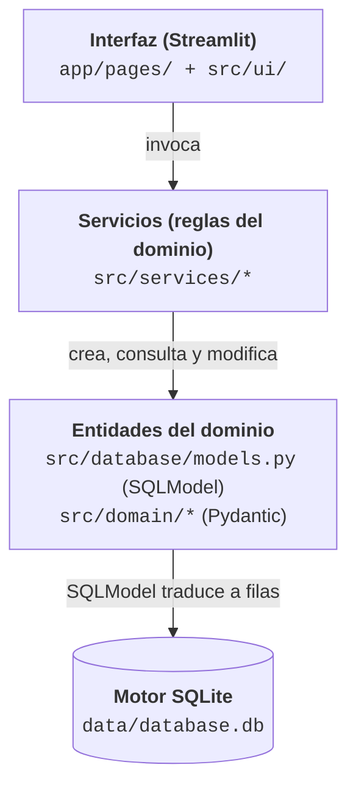

# Anexo A: Documentación técnica de la base de datos

> **Versión del anexo**: 2026-09-11
> **Fuentes de verdad**: `src/database/models.py`, `src/database/connection.py`, `src/database/crud.py`, `src/services/*`
> **Formato**: este anexo es un documento técnico independiente. Puede leerse en forma secuencial o utilizarse como referencia consultando la sección correspondiente.

## Índice

1. Introducción y alcance
2. Arquitectura general de datos
3. Convenciones y nomenclatura
4. Diagrama entidad-relación global
5. Catálogo de entidades (fichas por tabla)
6. Políticas de borrado y cascadas
7. Operaciones y lógica de negocio por servicio
8. Reglas de integridad e invariantes
9. Migraciones del esquema
10. Modelo de auditoría (registro de cambios)
11. Instantáneas históricas (validaciones y corridas del LP)
12. Glosario técnico

---

## 1. Introducción y alcance

Este anexo documenta la capa de persistencia del sistema Gestor de Aulas. Cubre las tablas que componen el esquema relacional, la **lógica aplicada sobre cada operación de base de datos** (creación, actualización, borrado, consultas complejas), las **reglas de integridad** que garantizan la consistencia de los datos y las **migraciones idempotentes** que permiten ajustar el esquema sin pérdida de información.

El objetivo es doble: por un lado, servir como referencia técnica detallada para el mantenimiento y la extensión del sistema; por otro, formalizar el modelo de datos como parte de la documentación del proyecto para su presentación académica.

### 1.1 Convenciones de este documento

- Los nombres de las tablas físicas se muestran en minúsculas con guion bajo (`plan_estudio`), tal como aparecen en SQLite.
- Los nombres de las clases del mapeo objeto-relacional (ORM) se muestran con sufijo `DB` en CamelCase (`PlanEstudioDB`).
- Los tipos de datos usan la notación de Python (`str`, `int`, `Optional[bool]`, `time`, `date`, `datetime`).
- Las citas de código referencian archivos con la ruta relativa al repositorio.
- Las **invariantes** se enuncian como propiedades lógicas que el sistema garantiza en todo momento.

### 1.2 Fuera de alcance

Este anexo no cubre:

- La interfaz de usuario de Streamlit (documentada en el Manual de Usuario).
- La lógica del programa lineal (LP) de asignación de aulas en profundidad matemática (documentada en `project/1. Diseño/asignacion-aulas-LP.md`). Aquí se describe únicamente su interfaz con la base de datos.
- Los algoritmos internos del pronóstico de demanda, salvo lo relativo a persistencia.

---

## 2. Arquitectura general de datos

### 2.1 Stack tecnológico

| Componente | Rol |
|------------|-----|
| **SQLite** | Motor de base de datos embebido. Archivo único `data/database.db`. Sin servidor. |
| **SQLModel** | Capa ORM que combina Pydantic (validación) con SQLAlchemy (mapeo relacional). Todas las tablas heredan de `SQLModel` con `table=True`. |
| **SQLAlchemy Core** | Se usa directamente para migraciones (`exec_driver_sql`), el manejo de conexiones (`NullPool`) y los enganches de eventos (`event.listens_for`). |
| **PuLP** | Biblioteca de programación lineal utilizada por el asignador de aulas. Lee de la base y escribe resultados en `HorarioDB.aula_id` y `LPRunDB`. |

### 2.2 Separación de capas

El sistema se organiza en tres capas de software sobre el motor
SQLite. Los servicios nunca escriben SQL: trabajan con las entidades
del dominio, que son clases de Python declaradas con Pydantic y
SQLModel, y es SQLModel quien las traduce a filas.



**Dos formas de las entidades**: las clases de `src/database/models.py`
son a la vez modelos de Pydantic (validan sus campos) y el mapeo de
cada tabla; la mayoría de los servicios las consulta y modifica
directamente mediante la sesión de SQLModel. Las clases de
`src/domain/` son versiones inmutables de las entidades principales
(materia, aula, sede, carrera, comisión, horario), con validadores de
invariantes; las usan los servicios genéricos de altas, bajas y
modificaciones (`src/services/crud_services.py`), que las convierten a
y desde las clases de tabla con `to_db()` y `to_domain()`
(`src/database/converters.py`) y se apoyan en el CRUD genérico de
`src/database/crud.py`.

### 2.3 Motor de conexión

El motor SQLAlchemy se configura con parámetros específicos para el entorno Streamlit + SQLite (`src/database/connection.py`):

```python
engine = create_engine(
    DATABASE_URL,                # sqlite:///data/database.db
    echo=False,
    poolclass=NullPool,          # una conexion nueva por sesion
    connect_args={"check_same_thread": False},
)
```

- **`NullPool`**: cada `Session()` abre una conexión nueva al archivo y la cierra al salir. Evita un defecto observado en Streamlit, donde el conjunto de conexiones por defecto mantiene transacciones de lectura abiertas que bloquean el volcado a disco de las confirmaciones hechas en otras sesiones y producen lecturas desactualizadas. Para SQLite + Streamlit el costo de abrir y cerrar una conexión por solicitud es despreciable.
- **`check_same_thread=False`**: SQLite prohíbe por defecto compartir conexiones entre hilos; Streamlit puede reasignar los manejadores a hilos distintos, por lo que se deshabilita esa verificación.
- **`echo=False`**: para depurar se activa (`echo=True`) y se vuelca todo el SQL generado.

### 2.4 Ciclo de vida de la base

La inicialización se orquesta en `init_db()`:

1. **Registro de los enganches de auditoría**. Se importa `change_log_service` antes de crear las tablas, para que los receptores de eventos de SQLAlchemy queden registrados y `ChangeLogDB` aparezca en los metadatos.
2. **`SQLModel.metadata.create_all(engine)`**. Crea las tablas que aún no existen. Este método **no altera** tablas existentes.
3. **`_run_migrations(engine)`**. Ejecuta migraciones idempotentes (`ALTER TABLE`, recreaciones para restricciones nuevas, migraciones de datos). Cada migración detecta si ya corrió y, en tal caso, termina sin efecto. Ver sección 9.

### 2.5 Sesiones

`get_session()` es un generador de contexto que abre una `Session` de SQLModel:

```python
def get_session() -> Generator[Session, None, None]:
    with Session(engine) as session:
        yield session
```

Todas las funciones de servicio reciben la sesión como parámetro; ninguna la abre por su cuenta. Esto permite componer operaciones en una misma transacción cuando es necesario.

---

## 3. Convenciones y nomenclatura

### 3.1 Nombres de clases y tablas

| Convención | Ejemplo | Uso |
|------------|---------|-----|
| `XxxDB` | `MateriaDB` | Clase SQLModel de tabla principal. |
| `XxxYyyDB` | `PlanEstudioDB` | Tabla asociativa nominal (con atributos propios). |
| `XxxYyyLink` | *(no usado actualmente)* | Convención reservada para tablas puramente puente. |
| `xxx` (minúsculas) | `materias` | Nombre de la tabla física en SQLite. |

### 3.2 Identificadores primarios

El sistema utiliza tres estrategias de identificador primario:

1. **Código natural**: `MateriaDB.codigo`, `CarreraDB.codigo`, `CicloDB.id` (formato `AAAA-NC`, ej. `2026-1C`). Estable, legible, propio del dominio.
2. **UUID v4**: la mayoría de las entidades (`ScheduleDB`, `PlanificacionCursadaDB`, `AulaDB`, `SedeDB`, etc.) usan UUID generados con `str(uuid.uuid4())`. Son opacos y no significan nada para el usuario final; se muestran mediante campos de visualización (`codigo_aula`, `nombre`).
3. **PK compuesta**: tablas puente como `DictadoCicloDB`, `CicloPlanVersionDB`, `CorrelativaDB`, `MateriaLaboratorioDB` e `InscripcionHistoricaDB` usan claves compuestas por sus claves foráneas (FK). `IgnoredConflictDB` también: (`plan_cursada_id`, `materia_a`, `materia_b`), y `ScheduleIgnoredConflictDB`: (`schedule_id`, `materia_a`, `materia_b`).

### 3.3 Nulabilidad y semántica de `None`

En varios campos, `None` no significa "sin valor" sino **"heredar del padre"**. Esta convención se aplica en toda la jerarquía y se documenta en cada ficha:

- `MateriaDB.dicta_recursado: Optional[bool]` → `None` = usar `CarreraDB.dicta_recursado`.
- `DictadoDB.virtual: Optional[bool]` → `None` = usar `MateriaDB.virtual`.
- `HorarioDB.virtual: Optional[bool]` → `None` = usar `DictadoDB.virtual` (que a su vez puede heredar).

Estas cadenas se resuelven en `src/services/resolucion_jerarquica.py` con la regla **"el nivel más específico manda"**.

### 3.4 Nomenclatura de restricciones lógicas

Las restricciones lógicas del modelo de asignación se numeran (R1..R12) siguiendo el documento `project/1. Diseño/asignacion-aulas-LP.md`. Las restricciones funcionales de la interfaz se numeran RF-LP-N. Ambas familias se referencian desde el código.

---

## 4. Diagrama entidad-relación global

Las relaciones entre tablas se presentan en tres diagramas por zonas: catálogo y estructura curricular, ciclos y cronogramas, y plan de cursada. Las cajas muestran sólo la clave primaria; los esquemas completos están en la sección 5. La tabla `change_log` no aparece porque no tiene claves foráneas (sección 10).







*Versiones vectoriales y de mapa de bits en `project/diagrams/er_anexo_base_de_datos_{catalogo,cronogramas,plan}.{svg,png}`; el código fuente de cada uno está en el `.mmd` homónimo.*

Los diagramas resaltan la triple jerarquía del sistema:

- **Rama curricular**: `Carrera` → `PlanCarreraVersion` → `PlanEstudio` → `Materia`. Modela qué se cursa en una carrera y en qué orden.
- **Rama temporal**: `Ciclo` → `CicloPlanVersion` → `Dictado` → `Comision` → `Horario`. Modela cómo se dicta un cuatrimestre concreto.
- **Rama física**: `Sede` → `Aula`, con `GrupoMateriaSede` y `MateriaLaboratorio` como puentes que restringen qué aulas son admisibles para qué materias.

`Schedule` (cronograma) es la interfaz entre la rama temporal y la persistencia de datos crudos: representa el archivo Excel de la Facultad, y a partir de él se genera la `PlanificacionCursada`, que contiene las comisiones vigentes.

---

## 5. Catálogo de entidades

Cada ficha incluye: propósito, esquema físico completo, invariantes, índices, relaciones y observaciones técnicas.

---

### 5.1 Zona: Catálogo Maestro

Datos base estables y de larga vigencia.

#### 5.1.1 `MateriaDB`: tabla `materias`

**Propósito**: representa una asignatura del catálogo académico. Es la entidad raíz del dominio curricular; toda comisión, horario y dictado referencia a una materia.

**Esquema**:

| Columna | Tipo | Restricción | Valor por defecto | Descripción |
|---------|------|-------------|-------------------|-------------|
| `codigo` | `str` | PK, `min_length=1` | un guion largo | Código único de la materia (ej. `MAT101`). |
| `nombre` | `str` | `min_length=1` | un guion largo | Nombre de la asignatura. |
| `codigo_guarani` | `Optional[str]` | un guion largo | `None` | Código alternativo usado en SIU Guaraní. |
| `cupo` | `Optional[int]` | `gt=0` | `None` | Cupo por defecto, heredable a las comisiones. |
| `horas_semanales` | `Optional[float]` | `gt=0` | `None` | Total de horas semanales. |
| `horas_teoria` | `Optional[float]` | `ge=0` | `None` | Horas teóricas semanales. |
| `horas_laboratorio` | `Optional[float]` | `ge=0` | `None` | Horas de laboratorio semanales. |
| `periodo` | `str` | un guion largo | `"cuatrimestral"` | `"anual"` o `"cuatrimestral"`. |
| `active` | `bool` | un guion largo | `True` | Materia activa en el catálogo. |
| `virtual` | `bool` | un guion largo | `False` | Modalidad virtual por defecto. |
| `optativa` | `bool` | un guion largo | `False` | Materia optativa (opcional en el plan). |
| `dicta_recursado` | `Optional[bool]` | un guion largo | `None` | Sobrescritura de `CarreraDB.dicta_recursado`. `None` = usar el de la carrera. |
| `grupo_id` | `str` | FK `grupo_materia.id`, `NOT NULL` | un guion largo | **Grupo de Materias al que pertenece**. Partición estricta: cada materia pertenece a exactamente un grupo. Alimenta R8/R10 del LP mediante `resolver_sedes_admisibles_por_materia`. |

**Invariantes**:

- **INV-MAT-1**: `horas_teoria + horas_laboratorio ≤ horas_semanales` cuando ambos están definidos. No hay `CHECK` a nivel del esquema; se valida en `validar_factibilidad_particion_horas`.
- **INV-MAT-2**: si `periodo = "anual"`, el sistema generará **dos dictados por año académico** (uno por cuatrimestre), vinculados al mismo `DictadoDB` mediante `DictadoCicloDB`.
- **INV-MAT-3**: `grupo_id NOT NULL`. Cada materia pertenece a **exactamente un** `GrupoMateriaDB`. Lo garantizan el esquema y la capa de servicios.

**Relaciones**:

- N:1 con `GrupoMateriaDB` (partición estricta).
- 1:N con `ComisionDB`, `DictadoDB`, `HorarioDB`, `ScheduleEntryDB`.
- N:M con `CarreraDB` mediante `PlanEstudioDB`.
- N:M con `AulaDB` mediante `MateriaLaboratorioDB` (laboratorios compatibles).
- N:M con `CarreraDB` mediante `CorrelativaDB` (correlativas).

**Auditoría**: las mutaciones sobre `virtual`, `active`, `dicta_recursado`, `optativa`, `horas_teoria` y `horas_laboratorio` se auditan en `ChangeLogDB` mediante el enganche de `change_log_service`.

---

#### 5.1.2 `CarreraDB`: tabla `carreras`

**Propósito**: programa de grado (Ingeniería Civil, en Sistemas, etc.). Agrupa materias según el plan de estudios.

**Esquema**:

| Columna | Tipo | Restricción | Valor por defecto | Descripción |
|---------|------|-------------|-------------------|-------------|
| `codigo` | `str` | PK, `min_length=1` | un guion largo | Código único (ej. `IC`, `IS`). |
| `nombre` | `str` | `min_length=1` | un guion largo | Nombre completo. |
| `titulo_otorgado` | `str` | un guion largo | `""` | Título (ej. "Ingeniero Civil"). |
| `duracion_anios` | `int` | `ge=1` | `5` | Cantidad de años del plan. |
| `cantidad_materias` | `Optional[int]` | `ge=1` | `None` | Total esperado de materias del plan. |
| `dicta_recursado` | `bool` | un guion largo | `True` | Política por defecto: la carrera dicta recursado. Sobrescribible por materia. |

**Relaciones**:

- 1:N con `PlanCarreraVersionDB` (versiones del plan).
- N:M con `MateriaDB` mediante `PlanEstudioDB`.
- N:M con `GrupoMateriaDB` mediante `GrupoMateriaCarreraDB` (sólo para la verificación de consistencia por grupo).
- 1:N con `CorrelativaDB`.

**Auditoría**: las mutaciones sobre `dicta_recursado` se auditan.

---

#### 5.1.3 `SedeDB`: tabla `sedes`

**Propósito**: sede física donde se ubican las aulas. Se modela como entidad propia (y no como cadena libre en `AulaDB`) para poder referenciarla desde las restricciones del LP.

**Esquema**:

| Columna | Tipo | Restricción | Valor por defecto | Descripción |
|---------|------|-------------|-------------------|-------------|
| `id` | `str` | PK, UUID | `uuid4()` | Identificador opaco. |
| `nombre` | `str` | `unique=True`, `index=True`, `min_length=1` | un guion largo | Nombre único globalmente. |

**Invariantes**:

- **INV-SEDE-1**: `nombre` es único globalmente (restricción física).

**Relaciones**:

- 1:N con `AulaDB`.
- N:M con `GrupoMateriaDB` mediante `GrupoMateriaSedeDB` (con tipo DURO/BLANDO y orden).

**Carga inicial**: si la tabla `sedes` está vacía al inicializar la base y la tabla `aulas` también lo está, se inserta automáticamente una sede `Pellegrini` (`_seed_default_sede_if_empty`).

---

#### 5.1.4 `AulaDB`: tabla `aulas`

**Propósito**: espacio físico donde se dictan las clases. Es el recurso escaso que el LP asigna a los horarios.

**Esquema**:

| Columna | Tipo | Restricción | Valor por defecto | Descripción |
|---------|------|-------------|-------------------|-------------|
| `id` | `str` | PK, UUID | `uuid4()` | ID opaco, autogenerado. |
| `sede_id` | `str` | FK `sedes.id`, `index=True` | un guion largo | Sede donde está el aula. |
| `codigo_aula` | `str` | `unique=True`, `index=True`, `min_length=1` | un guion largo | Código de visualización editable (único globalmente). Autoderivable como `{sede}-{nombre}`. |
| `nombre` | `str` | `min_length=1` | un guion largo | Nombre del aula. |
| `capacidad` | `int` | `gt=0` | un guion largo | Capacidad nominal (número de asientos). |
| `tipo` | `str` | un guion largo | `"teorica"` | Tipo: `"teorica"`, `"laboratorio"`, etc. |
| `descripcion` | `str` | un guion largo | `""` | Descripción libre (equipamiento, etc.). |
| `activa` | `bool` | `index=True` | `True` | Si es `False`, el aula está desactivada: el asignador no la usa ni se ofrece en la reasignación manual, pero se conserva para los planes que ya la tienen asignada. |

**Invariantes**:

- **INV-AUL-1**: `codigo_aula` es único globalmente (restricción `UNIQUE`).
- **INV-AUL-2**: un aula pertenece a exactamente una sede (FK `sede_id` `NOT NULL`).

**Relaciones**:

- N:1 con `SedeDB`.
- N:M con `MateriaDB` mediante `MateriaLaboratorioDB` (laboratorios compatibles con el dictado de laboratorio).
- Referenciada por `HorarioDB.aula_id` (aula del patrón semanal).

---

#### 5.1.5 `CorrelativaDB`: tabla `correlativas`

**Propósito**: relación de precedencia entre materias dentro de una carrera. Una materia sólo puede cursarse si sus correlativas fueron aprobadas.

**Esquema**:

| Columna | Tipo | Restricción | Descripción |
|---------|------|-------------|-------------|
| `carrera_codigo` | `str` | PK, FK `carreras.codigo` | Carrera donde aplica la correlativa. |
| `materia_codigo` | `str` | PK, FK `materias.codigo` | Materia que se quiere cursar. |
| `materia_correlativa_codigo` | `str` | PK, FK `materias.codigo` | Materia que debe estar aprobada antes. |

**Invariantes**:

- **INV-COR-1**: PK compuesta por las tres FK → una correlativa se declara una única vez por (carrera, materia, correlativa).
- **INV-COR-2**: `materia_codigo != materia_correlativa_codigo` (no hay autocorrelativas). No hay `CHECK`; se asume por convención.

---

#### 5.1.6 `MateriaLaboratorioDB`: tabla `materia_laboratorio`

**Propósito**: tabla puente M:N entre materias y aulas de tipo laboratorio compatibles para el dictado de horas de laboratorio.

**Esquema**:

| Columna | Tipo | Restricción |
|---------|------|-------------|
| `materia_codigo` | `str` | PK, FK `materias.codigo` |
| `aula_id` | `str` | PK, FK `aulas.id` |

**Uso en el LP**: el asignador consulta esta tabla para armar el conjunto de aulas admisibles para horarios de tipo `"laboratorio"`. Los horarios teóricos ignoran la tabla y pueden asignarse a cualquier aula compatible por tipo y sede. Habilita además la **excepción de laboratorio compatible** de R8: un aula listada en `MateriaLaboratorioDB` para una materia se acepta aunque su sede no pertenezca al conjunto duro del grupo, porque la compatibilidad física del laboratorio prevalece sobre la preferencia curricular.

---

#### 5.1.7 `GrupoMateriaDB`: tabla `grupo_materia`

**Propósito**: agrupar materias que comparten el mismo criterio de sedes admisibles. Es la fuente de verdad para la resolución de R8/R10 del LP. Cada `MateriaDB` pertenece a **exactamente un** grupo (partición estricta).

**Esquema**:

| Columna | Tipo | Restricción | Valor por defecto | Descripción |
|---------|------|-------------|-------------------|-------------|
| `id` | `str` | PK, UUID | `uuid4()` | Identificador opaco. |
| `nombre` | `str` | `unique=True`, `index=True` | un guion largo | Ej. `FB`, `F`, `FI`, `CE`, `Específicas de Ing. Electrónica`, `Sin clasificar`. |
| `descripcion` | `str` | un guion largo | `""` | Descripción libre. |
| `es_sin_clasificar` | `bool` | `index=True` | `False` | Marca el grupo de respaldo. Sólo uno con `True` a la vez. |
| `chequear_pertenencia_asociadas` | `bool` | un guion largo | `True` | Indicador de la verificación de consistencia por grupo. |
| `chequear_exclusividad_no_asociadas` | `bool` | un guion largo | `True` | Ídem. |
| `chequear_completitud` | `bool` | un guion largo | `True` | Ídem. |

**Invariantes**:

- **INV-GRUPO-1**: `nombre` único globalmente (restricción física).
- **INV-GRUPO-2**: a lo sumo una fila con `es_sin_clasificar=True` (invariante en la capa de servicios).
- **INV-GRUPO-3**: toda materia tiene grupo (`MateriaDB.grupo_id NOT NULL`), garantizado por el esquema. Las materias sin clasificar caen en el grupo de respaldo.
- **INV-GRUPO-4**: no se puede borrar un grupo con materias asignadas (verificado por `grupo_materia_service.delete_grupo`).

**Semántica**: cada grupo declara **dos configuraciones simultáneas** de sedes, persistidas en `GrupoMateriaSedeDB`:

- **Conjunto duro** (`tipo=DURO`): sedes admisibles cuando el grupo corre en modo DURO. R8 del LP filtra la matriz `compat` a esas sedes.
- **Lista blanda ordenada** (`tipo=BLANDO`): sedes preferidas cuando el grupo corre en modo BLANDO. La primera (`orden=0`) es la preferida; el resto son alternativas con costo `λ_sede_pref`.

El modo con el que corre cada grupo en una corrida específica se elige desde `LPConfig.modos_por_grupo` en el panel del asignador. Los grupos declaran ambas configuraciones; el LP elige cuál usar en cada corrida.

**Relaciones**:

- 1:N con `MateriaDB` (partición estricta).
- 1:N con `GrupoMateriaSedeDB` (en cascada).
- 1:N con `GrupoMateriaCarreraDB` (en cascada).

---

#### 5.1.8 `GrupoMateriaSedeDB`: tabla `grupo_materia_sede`

**Propósito**: tabla M:N ordenada entre `GrupoMateriaDB` y `SedeDB`, con `tipo` (DURO/BLANDO) como parte de la PK compuesta.

**Esquema**:

| Columna | Tipo | Restricción | Descripción |
|---------|------|-------------|-------------|
| `grupo_id` | `str` | PK, FK `grupo_materia.id` | |
| `sede_id` | `str` | PK, FK `sedes.id` | |
| `tipo` | `str` | PK | `"DURO"` o `"BLANDO"`. Permite que una misma sede aparezca en ambos conjuntos del mismo grupo. |
| `orden` | `int` | `ge=0` | Por defecto 0. Semántico sólo en BLANDO (0 = preferida). En DURO sirve sólo para mantener un orden visual estable. |

**Uso en el LP**: `resolver_sedes_admisibles_por_materia(session, materia_codigo)` en `grupo_materia_service.py` devuelve `(sedes_ordenadas, modo)` a partir de la configuración del grupo. Con modo DURO se aplica R8 (filtro); con modo BLANDO se aplica R10 (preferencia blanda en el objetivo).

---

#### 5.1.9 `GrupoMateriaCarreraDB`: tabla `grupo_materia_carrera`

**Propósito**: relación M:N entre grupo y carrera, utilizada exclusivamente para la verificación de consistencia por grupo. No afecta al LP.

**Esquema**:

| Columna | Tipo | Restricción |
|---------|------|-------------|
| `grupo_id` | `str` | PK, FK `grupo_materia.id` |
| `carrera_codigo` | `str` | PK, FK `carreras.codigo` |

**Semántica**: el servicio `chequear_consistencia_grupo` compara las materias del grupo contra las materias del plan vigente de las carreras asociadas, aplicando los tres indicadores de `GrupoMateriaDB` (pertenencia, exclusividad, completitud) para reportar `faltantes` y `ajenas`. Se usa para la curación asistida de la partición, no para bloquear al LP.

---

### 5.2 Zona: Estructura Curricular

Modela el plan de estudios y su versionado.

#### 5.2.1 `PlanCarreraVersionDB`: tabla `plan_carrera_version`

**Propósito**: versión fechada del plan de estudios de una carrera. Permite mantener planes que evolucionan a lo largo del tiempo (Plan 2015, Plan 2023, etc.) sin perder la trazabilidad de las cohortes anteriores.

**Esquema**:

| Columna | Tipo | Restricción | Valor por defecto |
|---------|------|------------|---------|
| `id` | `str` | PK, UUID | Ninguno |
| `carrera_codigo` | `str` | FK `carreras.codigo`, `index=True` | Ninguno |
| `nombre` | `str` | Ninguna | Ninguno |
| `descripcion` | `str` | Ninguna | `""` |
| `fecha_creacion` | `date` | Ninguna | Ninguno |

**Relaciones**:

- N:1 con `CarreraDB`.
- 1:N con `PlanEstudioDB` (las celdas del plan).
- N:M con `CicloDB` vía `CicloPlanVersionDB` (qué versiones se dictan en cada ciclo).

---

#### 5.2.2 `PlanEstudioDB`: tabla `plan_estudio`

**Propósito**: celda del plan de estudios. Vincula una materia con una carrera **en el contexto de una versión de plan** y le asigna una ubicación curricular (año + cuatrimestre). Es la tabla puente M:N nominal más importante del sistema.

**Esquema**:

| Columna | Tipo | Restricción | Valor por defecto |
|---------|------|------------|---------|
| `id` | `str` | PK, UUID | `uuid4()` |
| `plan_version_id` | `str` | FK `plan_carrera_version.id`, `index=True` | Ninguno |
| `materia_codigo` | `str` | FK `materias.codigo`, `index=True` | Ninguno |
| `carrera_codigo` | `str` | FK `carreras.codigo`, `index=True` | Ninguno |
| `anio_plan` | `Optional[int]` | `ge=1`, `le=6` | `None` |
| `cuatrimestre_plan` | `Optional[str]` | Ninguna | `None` (valores: `"1C"`, `"2C"`, `"Anual"`) |
| `correlativas` | `str` | Ninguna | `""` (texto libre con las correlativas) |
| `optativa` | `bool` | Ninguna | `False` |

**Invariantes**:

- **INV-PE-1**: una materia puede aparecer en **múltiples celdas** de una misma versión de plan si es dictada por varias carreras (por ejemplo, Análisis I aparece en IC/IS/IE con la misma versión).
- **INV-PE-2**: `anio_plan` y `cuatrimestre_plan` juntos determinan el "año/cuatrimestre de la carrera" que se usa para validar solapamientos horarios (validación 2).

**Rol en las validaciones**:

- La validación 2 (`validar_horarios_carrera`) agrupa por `(carrera_codigo, anio_plan, cuatrimestre_plan)` para detectar solapamientos entre materias que un alumno del mismo año cursa simultáneamente.
- El servicio `dictado_service` recorre `PlanEstudioDB` filtrado por `CicloPlanVersionDB.plan_version_id` para determinar qué materias deberían dictarse en un ciclo.

---

### 5.3 Zona: Ciclo Lectivo

Modela el período lectivo (cuatrimestre) y las materias efectivamente ofrecidas.

#### 5.3.1 `CicloDB`: tabla `ciclos`

**Propósito**: período lectivo concreto (`2026-1C`, `2026-2C`). Todas las entidades operativas (cronogramas, planes, dictados) se contextualizan en un ciclo.

**Esquema**:

| Columna | Tipo | Restricción | Descripción |
|---------|------|------------|-------------|
| `id` | `str` | PK | Formato `AAAA-NC` (por ejemplo, `2026-1C`). No es editable después de crearse. |
| `anio` | `int` | `ge=2020`, `le=2100` | Año académico. |
| `numero` | `int` | `ge=1`, `le=2` | 1 = primer cuatrimestre, 2 = segundo cuatrimestre. |
| `fecha_inicio` | `date` | Ninguna | Fecha de inicio del ciclo. |
| `fecha_fin` | `date` | Ninguna | Fecha de fin del ciclo. |
| `descripcion` | `str` | Ninguna | Descripción libre. |

**Invariantes**:

- **INV-CIC-1**: `id = f"{anio}-{numero}C"`. Se genera en la interfaz antes de la inserción; no se valida en la base.
- **INV-CIC-2**: `fecha_inicio < fecha_fin`. No hay restricción CHECK; se valida en la interfaz.

**Relaciones**:

- N:M con `DictadoDB` vía `DictadoCicloDB`.
- N:M con `PlanCarreraVersionDB` vía `CicloPlanVersionDB`.
- 1:N con `ScheduleDB`, `PlanificacionCursadaDB`.

---

#### 5.3.2 `CicloPlanVersionDB`: tabla `ciclo_plan_version`

**Propósito**: tabla puente que declara qué versiones de plan aplican a un ciclo. Un ciclo puede tener varias versiones activas simultáneamente (por ejemplo, Plan 2015 para las cohortes más viejas y Plan 2023 para las nuevas).

**Esquema**:

| Columna | Tipo | Restricción |
|---------|------|------------|
| `ciclo_id` | `str` | PK, FK `ciclos.id` |
| `plan_version_id` | `str` | PK, FK `plan_carrera_version.id` |

**Rol**: fija el conjunto de materias que **potencialmente** se dictan en el ciclo. `dictado_service` lo usa como fuente de la creación masiva de dictados.

---

#### 5.3.3 `DictadoDB`: tabla `dictados`

**Propósito**: instancia de una materia ofrecida en uno o más ciclos. Modela materias anuales (vinculadas a dos ciclos consecutivos) o cuatrimestrales (vinculadas a uno).

**Esquema**:

| Columna | Tipo | Restricción | Valor por defecto |
|---------|------|------------|---------|
| `id` | `str` | PK, UUID | Ninguno |
| `materia_codigo` | `str` | FK `materias.codigo`, `index=True` | Ninguno |
| `dictado_codigo` | `str` | `index=True` | `""` (clave de visualización, por ejemplo `MAT101-2025-2C` o `MAT101-2025`) |
| `inicio_dictado` | `Optional[date]` | Ninguna | `None` |
| `fin_dictado` | `Optional[date]` | Ninguna | `None` |
| `virtual` | `Optional[bool]` | Ninguna | `None` |

**Semántica del campo `virtual`**:

- `None` → hereda de `MateriaDB.virtual`.
- `True` → fuerza la modalidad virtual, aunque la materia sea presencial.
- `False` → fuerza la modalidad presencial, aunque la materia sea virtual.

Se resuelve con `resolve_virtual` (ver sección 3.3).

**Relaciones**:

- N:1 con `MateriaDB`.
- N:M con `CicloDB` vía `DictadoCicloDB`.
- 1:N con `ComisionDB` (vía `dictado_id`).

**Semántica de "existencia"**: un dictado existe si y solo si se dicta. No hay dictados "inactivos"; si un dictado no debe dictarse, se borra.

**Auditoría**: el alta y la baja completas se auditan, además del campo `virtual`.

---

#### 5.3.4 `DictadoCicloDB`: tabla `dictado_ciclo`

**Propósito**: tabla puente M:N entre `DictadoDB` y `CicloDB`. Permite que una materia anual aparezca vinculada a dos ciclos consecutivos (1C y 2C del mismo año) sin duplicar el `DictadoDB`.

**Esquema**:

| Columna | Tipo | Restricción |
|---------|------|------------|
| `dictado_id` | `str` | PK, FK `dictados.id` |
| `ciclo_id` | `str` | PK, FK `ciclos.id` |

**Uso**: al crear dictados para un ciclo con `create_dictados_for_ciclo`:

- Materia cuatrimestral → un `DictadoDB` vinculado a **1 ciclo**.
- Materia anual → un `DictadoDB` vinculado a **2 ciclos consecutivos** (si ya existe el dictado del 1C, se vincula al 2C mediante una nueva fila `DictadoCicloDB`).

**Auditoría**: el alta y la baja se auditan (aparición y desaparición del dictado en un ciclo).

---

### 5.4 Zona: Cronogramas

Datos crudos de horarios tal como vienen del Excel de la Facultad.

#### 5.4.1 `ScheduleDB`: tabla `schedules`

**Propósito**: representa un archivo de horarios cargado en el sistema. Contiene metadatos (nombre, fecha de carga, archivo de origen) y agrupa las entradas (filas) del archivo.

**Esquema**:

| Columna | Tipo | Restricción | Valor por defecto |
|---------|------|------------|---------|
| `id` | `str` | PK, UUID | Ninguno |
| `ciclo_id` | `Optional[str]` | FK `ciclos.id`, `index=True` | `None` |
| `nombre` | `str` | Ninguna | Ninguno |
| `fecha_upload` | `date` | Ninguna | Ninguno |
| `source_filename` | `str` | Ninguna | `""` |

**Observaciones**:

- `ciclo_id` admite `None` en cronogramas huérfanos (cargados antes de asignarles un ciclo).
- Un ciclo puede tener múltiples cronogramas (v1, v2, etc.). La interfaz elige uno para generar el plan.

**Relaciones**:

- N:1 con `CicloDB`.
- 1:N con `ScheduleEntryDB`.
- 1:N con `ComisionDB` (comisiones "plantilla" del cronograma).
- 1:N con `ScheduleValidationDB` (instantáneas de validación) y con `ScheduleIgnoredConflictDB` (conflictos ignorados).

---

#### 5.4.2 `ScheduleEntryDB`: tabla `schedule_entries`

**Propósito**: una fila del archivo. Cada entrada representa un bloque horario para una materia en un día concreto.

**Esquema**:

| Columna | Tipo | Restricción | Valor por defecto |
|---------|------|------------|---------|
| `id` | `str` | PK, UUID | Ninguno |
| `schedule_id` | `str` | FK `schedules.id`, `index=True` | Ninguno |
| `codigo_materia` | `str` | FK `materias.codigo`, `index=True` | Ninguno |
| `dia` | `str` | Ninguna | Ninguno |
| `hora_inicio` | `time` | Ninguna | Ninguno |
| `hora_fin` | `time` | Ninguna | Ninguno |
| `comision_id` | `Optional[str]` | FK `comisiones.id`, `index=True` | `None` |
| `tipo_clase` | `Optional[str]` | Ninguna | `None` (valores: `"teorica"`, `"laboratorio"`) |
| `virtual` | `Optional[bool]` | Ninguna | `None` |

**Observaciones**:

- La FK `comision_id` vincula cada entrada con una comisión real (`ComisionDB` con `schedule_id` definido), que es la entidad que agrupa los bloques de un mismo grupo.
- Una entrada sin `comision_id` (`None`) es huérfana: existe en la grilla pero no fue asignada a una comisión concreta. La pantalla "Editar cronograma" es donde el usuario las asocia.
- `tipo_clase` se propaga al `HorarioDB` correspondiente al generar el plan.

---

#### 5.4.3 `ScheduleValidationDB`: tabla `schedule_validations`

**Propósito**: instantánea histórica de una validación de cronograma contra un ciclo. Cada corrida de "Prevalidar cronograma" inserta una fila. Se conservan todas para auditoría; la interfaz muestra la más reciente por (`schedule_id`, `ciclo_id`).

Ver sección 11.1 para el esquema completo y la lógica de obsolescencia.

---

#### 5.4.4 `ScheduleIgnoredConflictDB`: tabla `schedule_ignored_conflicts`

**Propósito**: par de materias cuyo conflicto de horarios el usuario decidió ignorar a nivel de cronograma. Es el espejo de `IgnoredConflictDB` (sección 5.6.4) para la etapa previa a la generación del plan, con la misma semántica: la granularidad es por par, no por franja horaria.

**Esquema**:

| Columna | Tipo | Restricción | Valor por defecto | Descripción |
|---------|------|------------|---------|-------------|
| `schedule_id` | `str` | PK, FK `schedules.id` | Ninguno | Cronograma al que pertenece la excepción. |
| `materia_a` | `str` | PK | Ninguno | Primera materia del par (código; `materia_a < materia_b`). |
| `materia_b` | `str` | PK | Ninguno | Segunda materia del par. |
| `razon` | `str` | Ninguna | `""` | Motivo registrado por el usuario. |
| `fecha_creacion` | `datetime` | Ninguna | `utcnow()` | Momento en que se marcó la excepción. |

**Relaciones**:

- N:1 con `ScheduleDB` (FK `schedule_id`). Los códigos de materia no son FK: son texto y se controlan en la capa de servicios.

**Unicidad**: la clave primaria compuesta (`schedule_id`, `materia_a`, `materia_b`) impide repetir un par en el mismo cronograma. El servicio ordena el par lexicográficamente antes de insertar, de modo que (A, B) y (B, A) se tratan como el mismo.

**Quién escribe**:

- `cronograma_validation_service` (`add_ignored_pair_cronograma`, `remove_ignored_pair_cronograma`, `cleanup_stale_ignored_pairs_cronograma`), a partir de la pestaña Validar. El alta es idempotente y actualiza la razón si el par ya existía. La limpieza elimina las excepciones cuyas materias ya no conviven en ningún grupo curricular del ciclo.
- `schedule_service`: al clonar un cronograma copia las excepciones; al crear un cronograma a partir de un plan las trae de `IgnoredConflictDB`; al borrar el cronograma las elimina.
- `cronograma_import_service`: los pares marcados durante la vista previa de una importación se trasladan al cronograma destino.

**Quién lee**: `cronograma_validation_service` (`get_ignored_pairs_cronograma`, `list_ignored_conflicts_cronograma`), para omitir esos pares al verificar solapamientos, y `plan_generation_service`, que al generar un plan de cursada desde el cronograma copia los pares a `IgnoredConflictDB` del plan nuevo; desde ese momento cada nivel gestiona sus excepciones por separado.

---

### 5.5 Zona: Plan de Cursada

Planificación trabajable generada a partir de un cronograma.

#### 5.5.1 `PlanificacionCursadaDB`: tabla `planificaciones_cursada`

**Propósito**: planificación viva de un ciclo lectivo, generada desde un `ScheduleDB`. Contiene comisiones concretas con cupos, los horarios asignados a esas comisiones y el resultado de la asignación de aulas.

**Esquema**:

| Columna | Tipo | Restricción | Valor por defecto |
|---------|------|------------|---------|
| `id` | `str` | PK, UUID | Ninguno |
| `nombre` | `str` | Ninguna | Ninguno |
| `descripcion` | `str` | Ninguna | `""` |
| `ciclo_id` | `str` | FK `ciclos.id`, `index=True` | Ninguno |
| `schedule_id` | `Optional[str]` | FK `schedules.id` | `None` |
| `forecast_metodo_default` | `str` | Ninguna | `"media_movil"` |

**Observaciones**:

- `forecast_metodo_default` es el método de pronóstico de demanda que se aplica por defecto a todas las materias del plan; puede sobrescribirse por materia en `MateriaForecastConfigDB`.

**Relaciones**:

- N:1 con `CicloDB`.
- N:1 con `ScheduleDB` (opcional; puede haber planes creados sin cronograma).
- 1:N con `ComisionDB` (comisiones vivas del plan).
- 1:N con `MateriaForecastConfigDB`, `LPRunDB`, `PlanValidationDB`, `IgnoredConflictDB`.

---

#### 5.5.2 `ComisionDB`: tabla `comisiones`

**Propósito**: división de una materia para distribuir alumnos. Es la entidad **dual**: puede pertenecer a un **cronograma** (comisión plantilla) o a un **plan de cursada** (comisión viva), pero **no a ambos a la vez**.

**Esquema**:

| Columna | Tipo | Restricción | Valor por defecto |
|---------|------|------------|---------|
| `id` | `str` | PK | Ninguno |
| `materia_codigo` | `str` | FK `materias.codigo`, `index=True` | Ninguno |
| `dictado_id` | `Optional[str]` | FK `dictados.id`, `index=True` | `None` |
| `plan_cursada_id` | `Optional[str]` | FK `planificaciones_cursada.id`, `index=True` | `None` |
| `schedule_id` | `Optional[str]` | FK `schedules.id`, `index=True` | `None` |
| `comision_key` | `str` | Ninguna | `""` (formato `{dictado_codigo}-{numero:03d}`) |
| `nombre` | `str` | Ninguna | `"Comisión Única"` |
| `numero` | `int` | `ge=1` | `1` |
| `cupo` | `int` | `gt=0` | Ninguno |
| `descripcion` | `str` | Ninguna | `""` |
| `coef_asignacion` | `float` | `ge=0`, `le=1` | `1.0` |
| `carrera_asignada` | `Optional[str]` | FK `carreras.codigo`, `index=True` | `None` |

**Invariantes**:

- **INV-COM-XOR**: exactamente uno de `schedule_id` o `plan_cursada_id` está definido. Se valida en `comision_service` (no hay restricción física porque SQLite no soporta cómodamente un CHECK con OR).
- **INV-COM-COEF**: la suma de `coef_asignacion` sobre las comisiones **de un mismo dictado** debe ser aproximadamente 1.0. Se valida a nivel de servicio (no físico). Sirve para distribuir la demanda esperada entre comisiones.
- **INV-COM-CARR**: si `carrera_asignada` está definido, el programa lineal fuerza al asignador a usar aulas de las sedes de esa carrera (RF-LP-15), ignorando la regla de "materias comunes → sede por defecto".

**Rol dual**:

- **Comisión de cronograma** (`schedule_id` definido): plantilla usada por los `ScheduleEntryDB` para agrupar bloques bajo un mismo "grupo" (C1, C2, etc.). Al generar el plan, estas comisiones se **clonan** con identificadores nuevos, preservando sus atributos.
- **Comisión de plan** (`plan_cursada_id` definido): entidad viva. Los `HorarioDB` del plan apuntan a ella. Es lo que procesan el programa lineal y las validaciones.

**Relaciones**:

- N:1 con `MateriaDB`.
- N:1 con `DictadoDB`.
- N:1 con `PlanificacionCursadaDB` o `ScheduleDB` (XOR).
- 1:N con `HorarioDB`.

**Semántica de `numero`**: es solo de visualización, no un identificador. La identidad de una comisión es su `id` (UUID). El usuario numera 1/2/3 a su criterio.

---

#### 5.5.3 `HorarioDB`: tabla `horarios`

**Propósito**: bloque horario semanal recurrente de una comisión. Es la **entidad de trabajo del programa lineal**: el asignador de aulas resuelve la correspondencia `horario → aula`.

**Esquema**:

| Columna | Tipo | Restricción | Valor por defecto |
|---------|------|------------|---------|
| `id` | `str` | PK | Ninguno |
| `comision_id` | `str` | FK `comisiones.id`, `index=True` | Ninguno |
| `codigo_materia` | `str` | FK `materias.codigo`, `index=True` | Ninguno |
| `dia` | `str` | `index=True` | Ninguno |
| `hora_inicio` | `time` | Ninguna | Ninguno |
| `hora_fin` | `time` | Ninguna | Ninguno |
| `tipo_clase` | `Optional[str]` | Ninguna | `None` (`"teorica"`, `"laboratorio"`) |
| `aula_id` | `Optional[str]` | FK `aulas.id`, `index=True` | `None` |
| `aula_asignada_manualmente` | `bool` | Ninguna | `False` |
| `virtual` | `Optional[bool]` | Ninguna | `None` |

**Semántica de `aula_id`**:

- Representa el aula asignada al bloque semanal. La asigna el programa lineal.
- `None` = el bloque no tiene aula asignada (el programa lineal no corrió o se editó la franja).
- `aula_asignada_manualmente=True` marca que la asignación fue definida por edición manual. Por defecto el programa lineal respeta estas asignaciones (opción "Respetar ediciones manuales").

**Semántica del campo `virtual`**: sigue la cadena `HorarioDB.virtual → DictadoDB.virtual → MateriaDB.virtual` con la regla "manda el nivel más específico". Permite mezclar modalidades dentro de una misma comisión.

**Relaciones**:

- N:1 con `ComisionDB`, `MateriaDB`.
- N:1 con `AulaDB` (aula asignada al bloque).

---

### 5.6 Zona: Configuración y Auxiliares

#### 5.6.1 `ConfiguracionHoraria`: tabla `configuracion_horaria`

**Propósito**: parámetros globales de la grilla horaria. Fila única (`id=1`).

**Esquema**:

| Columna | Tipo | Restricción | Valor por defecto |
|---------|------|------------|---------|
| `id` | `int` | PK | `1` |
| `granularidad_minutos` | `int` | `ge=5`, `le=60` | `15` |
| `hora_inicio_operativo` | `time` | Ninguna | `07:00` |
| `hora_fin_operativo` | `time` | Ninguna | `23:00` |
| `dias_operativos` | `str` | Ninguna | `"Lunes,Martes,Miércoles,Jueves,Viernes,Sábado"` |

---

#### 5.6.2 `InscripcionHistoricaDB`: tabla `inscripciones_historicas`

**Propósito**: registro histórico de inscriptos por (`materia`, `anio`, `cuatrimestre`). Alimenta el pronóstico de demanda.

**Esquema**:

| Columna | Tipo | Restricción |
|---------|------|------------|
| `materia_codigo` | `str` | PK, FK `materias.codigo` |
| `anio` | `int` | PK |
| `cuatrimestre` | `str` | PK (`"1C"`, `"2C"`, `"Anual"`) |
| `inscriptos` | `int` | `ge=0` |
| `updated_at` | `Optional[datetime]` | Nulable; marca de la última modificación (UTC) |
| `origen` | `Optional[str]` | Nulable, con índice; canal de carga (`"manual"`, `"importado"`, `"override"`) |

**Uso**: `forecast_service` lee esta tabla para armar la serie temporal y aplicar el método elegido (media móvil, deriva, suavizado exponencial simple).

---

#### 5.6.3 `MateriaForecastConfigDB`: tabla `materia_forecast_config`

**Propósito**: sobrescritura de la configuración del pronóstico de demanda a nivel (plan, materia, cuatrimestre).

**Esquema**:

| Columna | Tipo | Restricción | Valor por defecto |
|---------|------|------------|---------|
| `plan_cursada_id` | `str` | PK, FK `planificaciones_cursada.id` | Ninguno |
| `materia_codigo` | `str` | PK, FK `materias.codigo` | Ninguno |
| `cuatrimestre` | `str` | PK (`"1C"`, `"2C"`, `"Anual"`) | Ninguno |
| `metodo` | `Optional[str]` | Ninguna | `None` (`"media_movil"`, `"drift"`, `"ses"`, `None`) |
| `valor_override` | `Optional[float]` | `ge=0` | `None` |

**Semántica de las sobrescrituras**:

- `metodo=None` → usar `PlanificacionCursadaDB.forecast_metodo_default`.
- `metodo="X"` → forzar el método X.
- `valor_override=None` → calcular el pronóstico con la serie histórica.
- `valor_override=X` → forzar el valor X (útil cuando hay preinscripción externa o falta la serie histórica).

**Persistencia**: el valor del pronóstico **no se persiste**. Se recalcula bajo demanda. Solo la configuración vive en la base.

---

#### 5.6.4 `IgnoredConflictDB`: tabla `ignored_conflicts`

**Propósito**: par de materias cuyo conflicto de horarios el usuario decidió ignorar. La granularidad es por par (no por franja horaria): si una vez se ignoró, queda ignorado aunque cambien los horarios.

**Esquema**:

| Columna | Tipo | Restricción |
|---------|------|------------|
| `plan_cursada_id` | `str` | PK, FK `planificaciones_cursada.id` |
| `materia_a` | `str` | PK (ordenado lexicográficamente `<`) |
| `materia_b` | `str` | PK (`> materia_a`) |
| `razon` | `str` | Por defecto `""` |
| `fecha_creacion` | `datetime` | Por defecto `utcnow()` |

**Invariante**: `materia_a < materia_b` lexicográficamente. Deduplica pares en cualquier orden de creación.

**Alcance**: la excepción aplica a la verificación de **solapamiento horario** (`validar_conflictos_horarios_plan`). **No aplica** a la verificación de **intersede** (R11, R11-camino): el traslado físico es independiente de qué alumnos cursen qué materia.

**Limpieza automática**: `plan_validation_service.cleanup_stale_ignored_pairs` elimina las excepciones huérfanas cuando las materias del par ya no coexisten en ningún grupo curricular `(carrera, año, cuatri)` del plan. Se ejecuta automáticamente en cada `validate_plan` y se informa al usuario en el resumen (`excepciones_stale_removidas`).

---

#### 5.6.5 `CodigoAliasDB`: tabla `codigo_alias`

**Propósito**: alias persistente de un código externo hacia una materia del catálogo. Cuando la importación de inscriptos encuentra un código que no coincide ni con `codigo` ni con `codigo_guarani`, el usuario puede asociarlo a mano a una materia desde la sección "Sin matchear". La asociación se guarda para que, en la siguiente importación, el mismo código se resuelva solo. Cubre códigos de sistemas anteriores, errores de tipeo frecuentes en las planillas y materias con códigos distintos entre carreras.

**Esquema**:

| Columna | Tipo | Restricción | Valor por defecto | Descripción |
|---------|------|------------|---------|-------------|
| `codigo_externo` | `str` | PK, índice | Ninguno | Código tal como aparece en la planilla de origen. |
| `materia_codigo` | `str` | FK `materias.codigo`, índice | Ninguno | Materia del catálogo a la que apunta el alias. |
| `updated_at` | `Optional[datetime]` | Ninguna | `utcnow()` | Momento de la última modificación (UTC). |
| `origen` | `str` | Ninguna | `"manual"` | Canal de alta: `"manual"` o `"importado"`. |
| `nota` | `str` | Ninguna | `""` | Comentario libre del usuario (opcional). |

**Relaciones**:

- N:1 con `MateriaDB` (FK `materia_codigo`). Una materia puede tener varios alias.

**Unicidad**: la clave primaria es `codigo_externo` solo: cada código externo apunta a exactamente una materia. Reasignar un alias actualiza la fila existente (alta o modificación en una sola operación).

**Quién escribe**: `inscripcion_import_service` (`registrar_alias`, `delete_alias`), desde la sección "Sin matchear" de la pantalla de inscriptos y, de forma automática, cuando el importador resuelve un código por `codigo_guarani` y conviene volver persistente la equivalencia.

**Quién lee**: `inscripcion_import_service`, que carga todos los alias al armar el índice de resolución de códigos (`list_aliases`) y los consulta de a uno (`buscar_alias`) antes de ofrecerle al usuario que asocie el código.

---

### 5.7 Tabla resumen del catálogo

| Zona | Tabla física | Clase SQLModel | Rol |
|------|--------------|-----------------|-----|
| Configuración | `configuracion_horaria` | `ConfiguracionHoraria` | Configuración global de la grilla |
| Catálogo maestro | `materias` | `MateriaDB` | Asignatura |
| Catálogo maestro | `carreras` | `CarreraDB` | Programa de grado |
| Catálogo maestro | `sedes` | `SedeDB` | Sede física |
| Catálogo maestro | `aulas` | `AulaDB` | Espacio físico |
| Catálogo maestro | `correlativas` | `CorrelativaDB` | Precedencia entre materias |
| Catálogo maestro | `materia_laboratorio` | `MateriaLaboratorioDB` | Compatibilidad materia↔laboratorio |
| Catálogo maestro | `grupo_materia` | `GrupoMateriaDB` | Grupo de materias (R8/R10) |
| Catálogo maestro | `grupo_materia_sede` | `GrupoMateriaSedeDB` | Sedes DURO/BLANDO por grupo |
| Catálogo maestro | `grupo_materia_carrera` | `GrupoMateriaCarreraDB` | Carreras asociadas al grupo (verificación de consistencia) |
| Estructura curricular | `plan_carrera_version` | `PlanCarreraVersionDB` | Versión del plan |
| Estructura curricular | `plan_estudio` | `PlanEstudioDB` | Celda del plan |
| Ciclo lectivo | `ciclos` | `CicloDB` | Cuatrimestre concreto |
| Ciclo lectivo | `ciclo_plan_version` | `CicloPlanVersionDB` | Versiones activas en un ciclo |
| Ciclo lectivo | `dictados` | `DictadoDB` | Materia ofrecida |
| Ciclo lectivo | `dictado_ciclo` | `DictadoCicloDB` | Dictado ↔ ciclos |
| Cronogramas | `schedules` | `ScheduleDB` | Archivo de horarios |
| Cronogramas | `schedule_entries` | `ScheduleEntryDB` | Fila del archivo |
| Cronogramas | `schedule_validations` | `ScheduleValidationDB` | Instantánea de validación |
| Cronogramas | `schedule_ignored_conflicts` | `ScheduleIgnoredConflictDB` | Conflictos silenciados en el cronograma |
| Plan de cursada | `planificaciones_cursada` | `PlanificacionCursadaDB` | Plan generado |
| Plan de cursada | `comisiones` | `ComisionDB` | Comisión (plantilla o viva) |
| Plan de cursada | `horarios` | `HorarioDB` | Bloque semanal (entrada del programa lineal) |
| Plan de cursada | `plan_validations` | `PlanValidationDB` | Instantánea de validación |
| Plan de cursada | `ignored_conflicts` | `IgnoredConflictDB` | Conflictos silenciados |
| Plan de cursada | `materia_forecast_config` | `MateriaForecastConfigDB` | Sobrescritura del pronóstico |
| Plan de cursada | `inscripciones_historicas` | `InscripcionHistoricaDB` | Historial para el pronóstico |
| Catálogo maestro | `codigo_alias` | `CodigoAliasDB` | Alias de códigos externos de materias |
| Plan de cursada | `lp_runs` | `LPRunDB` | Instantánea de corrida del programa lineal |
| Auditoría | `change_log` | `ChangeLogDB` | Registro de modificaciones |

**Total: 30 tablas.**

---

## 6. Políticas de borrado y cascadas

### 6.1 Registro de relaciones

El sistema mantiene un registro central en `src/services/relationship_registry.py` con metadatos de cada relación, incluida su política de borrado. `src/services/relationship_definitions.py` registra las relaciones al importarse.

Cada `RelationshipMetadata` incluye `delete_behavior: "cascade" | "restrict"`:

| Relación padre → hijo | Comportamiento de borrado | Motivo |
|-----------------------|-----------------|--------|
| Carrera → Materia (vía PlanEstudio) | `restrict` | No se borran carreras con materias asociadas. |
| Materia → Comisión | `cascade` | Si se borra la materia, sus comisiones no tienen sentido. |
| Comisión → Horario | `cascade` | Ídem. |

Estas políticas se aplican **en la capa de servicios** (`CascadingOperations.delete_with_cascading`), no como restricciones ON DELETE de SQLite. La razón es que el borrado suele requerir lógica adicional (auditoría, invalidación de instantáneas, actualización de indicadores derivados).

### 6.2 Cascada explícita en operaciones

Además del registro, varias operaciones ejecutan cascadas explícitas:

- **Borrar un `CicloDB`**: borra en cascada `PlanificacionCursadaDB`, `ScheduleDB`, `DictadoCicloDB` y `CicloPlanVersionDB` asociados. El servicio lo hace en orden inverso a las FKs para evitar violaciones temporales.
- **Borrar una `PlanificacionCursadaDB`**: borra `ComisionDB` con ese `plan_cursada_id`, sus `HorarioDB`, `LPRunDB`, `PlanValidationDB`, `IgnoredConflictDB` y `MateriaForecastConfigDB`. No toca al `ScheduleDB` de origen (puede haber otros planes generados desde él).
- **Borrar un `ScheduleDB`**: borra `ScheduleEntryDB`, `ScheduleValidationDB` y `ScheduleIgnoredConflictDB` asociados. **No** borra los planes generados a partir de él (las comisiones del plan ya fueron clonadas y viven de forma independiente).
- **Borrar un `DictadoDB`**: borra las filas `DictadoCicloDB` correspondientes.
- **Borrar un `AulaDB`**: deja en `None` el `aula_id` de los `HorarioDB` que la referencian. Borra las filas de `MateriaLaboratorioDB`.

### 6.3 Cascada de creación

`CascadingOperations.create_with_cascading` permite crear entidades hijas automáticamente al crear el padre. Actualmente **no hay relaciones con `cascading_create=True` activas**: la comisión se crea en el momento de armar el cronograma o el plan, no al dar de alta la materia. El mecanismo queda disponible para funciones futuras.

### 6.4 Restrict como salvaguarda

Algunas relaciones bloquean el borrado del padre si hay hijos:

- Carrera con materias asociadas vía `PlanEstudioDB`: `restrict`. El usuario debe primero desasociar las materias.
- Materia usada en algún `ScheduleEntryDB` de un cronograma persistido: `restrict` a nivel de servicio (no físico). Se pide confirmación o una migración previa.

---

## 7. Operaciones y lógica de negocio por servicio

Esta sección documenta las operaciones agrupadas por servicio, con foco en las **reglas aplicadas** en cada caso: validaciones, invariantes preservadas y efectos colaterales.

### 7.1 CRUD genérico (`src/database/crud.py`)

Implementa el patrón Repositorio (*Repository*) mediante `CRUDBase[T]` genérico. Provee `get`, `get_all(skip, limit)`, `create`, `update`, `delete`. Cada tabla tiene una instancia (`materia_crud`, `aula_crud`, etc.). No incluye lógica de dominio: sólo persistencia bruta.

Uso típico: `materia_crud.create(session, MateriaDB(...))`.

### 7.2 Servicio de comisiones (`comision_service.py`)

**Rol dual**: gestiona comisiones plantilla (de cronograma) y comisiones vivas (de plan).

**Operaciones principales**:

- `create_comision(session, materia_codigo, ..., schedule_id=None, plan_cursada_id=None)`:
  - Valida la exclusión mutua (XOR): exactamente uno de `schedule_id` o `plan_cursada_id` debe estar seteado (INV-COM-XOR).
  - Resuelve `cupo` por defecto desde `MateriaDB.cupo`, o `30` si la materia no tiene definido.
  - Calcula el próximo `numero` libre dentro del ámbito (cronograma o plan): `_next_numero_libre`.
  - Genera `comision_key` con el formato `{materia_codigo}-{numero:03d}` (o `{dictado_codigo}-{numero:03d}` si está vinculado a un dictado).

- `update_comision(session, id, **fields)`:
  - Preserva el XOR (rechaza actualizaciones que dejarían ambas claves foráneas seteadas o ambas en `None`).
  - Actualiza `coef_asignacion` sólo dentro del rango `[0, 1]`.
  - Emite un evento al `ChangeLogDB` si cambió `carrera_asignada`.

- `delete_comision(session, id)`:
  - Cascada: borra los `HorarioDB` con `comision_id` = id.
  - Rechaza si hay `ScheduleEntryDB` apuntando a esta comisión plantilla (para no dejar entradas huérfanas).

### 7.3 Servicio de dictados (`dictado_service.py`)

**Rol**: gestiona la vida de los `DictadoDB` de un ciclo. Incluye la creación masiva desde el plan de estudios y la lógica de sincronización.

**Operaciones principales**:

- `create_dictados_for_ciclo(session, ciclo_id) -> DictadoCreationResult`:
  1. Obtiene las versiones de plan activas en el ciclo a través de `CicloPlanVersionDB`.
  2. Para cada `PlanEstudioDB` de esas versiones:
     - Aplica la **regla de recursado**: `resolve_dicta_recursado(materia, carrera)` combina `MateriaDB.dicta_recursado` (sobreescritura) con `CarreraDB.dicta_recursado`. Si es `False`, la materia se saltea con la razón "recursado desactivado".
     - Determina si ya existe un `DictadoDB` para `(materia_codigo, ciclo)`. Si existe, se saltea (idempotencia).
     - Materia anual: si ya existe el dictado del 1C del mismo año, se **vincula** al 2C creando una nueva fila `DictadoCicloDB` (no se crea otro dictado). Devuelve `linked += 1`.
     - Materia cuatrimestral: crea un `DictadoDB` nuevo y un `DictadoCicloDB` que lo vincula al ciclo. `created += 1`.
  3. Devuelve `DictadoCreationResult` con los contadores `created`, `linked`, `skipped`, `skipped_recursado` y `errors`.

- `sync_dictados_para_ciclo(session, ciclo_id) -> SyncResult`:
  - Diagnostica divergencias entre el conjunto de dictados y el plan más las reglas vigentes (`DriftSummary`).
  - Propone acciones: `to_create` (materias del plan sin dictado), `to_delete` (dictados huérfanos cuya materia salió del plan), `rule_says_skip_but_exists` (dictados que el usuario creó a mano contra la regla).
  - Aplica los cambios por lotes.

- `delete_dictado(session, dictado_id)`:
  - Borra `DictadoCicloDB`.
  - Borra el `DictadoDB`.
  - Emite `ChangeLogDB` con `action="deleted"`.

### 7.4 Servicio de cronogramas (`schedule_service.py`)

**Rol**: análisis sintáctico (*parseo*) y persistencia de archivos de horarios (Excel/CSV).

**Operaciones principales**:

- `create_schedule_from_file(session, ciclo_id, nombre, file) -> ScheduleCreationResult`:
  1. Delega el análisis del archivo a `parse_horarios_file` (`horario_file_parser.py`), que soporta Excel (`.xlsx`) y CSV.
  2. Por cada fila analizada:
     - Resuelve `codigo_materia` con `_resolve_materia_code` (`horario_loading_service.py`), que hace una correspondencia tolerante a variantes de nombre.
     - Si la materia no se corresponde con ninguna: agrega la fila a `errors` y la saltea.
     - Convierte hora_inicio/hora_fin a `time` y valida el formato del día.
  3. Crea `ScheduleDB` con `id=uuid4()`, `fecha_upload=date.today()`, `source_filename=file.name`.
  4. Crea un `ScheduleEntryDB` por cada fila válida.
  5. **No** asocia comisiones automáticamente: la columna "comision" del Excel se ignora (error conocido; ver Flujo 2, paso 4, del Manual de Usuario).
  6. Devuelve el `ScheduleDB` creado, los contadores y la lista de errores.

- `get_schedule_grid(session, schedule_id)`:
  - Devuelve una vista de grilla del cronograma armada desde `ScheduleEntryDB`.
  - Cada bloque incluye la información de la comisión asignada (si la hay) mediante un `JOIN` con `ComisionDB`.

- `delete_schedule(session, schedule_id)`:
  - Cascada: borra `ScheduleEntryDB`, `ScheduleValidationDB` y las `ComisionDB` con `schedule_id` = id (comisiones plantilla).
  - Rechaza si hay `PlanificacionCursadaDB` con `schedule_id` = id (a menos que se pase `force=True`).

### 7.5 Servicio de validación de cronogramas (`cronograma_validation_service.py`)

**Rol**: validar un `ScheduleDB` contra un `CicloDB` para determinar si es apto como insumo para generar un plan.

**Operación principal**: `validar_cronograma(session, schedule_id, ciclo_id, excluir_optativas=False) -> CronogramaValidationSummary`.

**Verificaciones realizadas**:

1. **Cobertura**: cada materia con dictado activo en el ciclo debe tener al menos un `ScheduleEntryDB` en el cronograma.
   - Fuente de la lista de "materias esperadas": `get_materias_esperadas_from_dictados(session, ciclo_id)`.
   - Las faltantes se agrupan por carrera (vía `PlanEstudioDB`) para facilitar el diagnóstico.

2. **Extras**: materias en el cronograma que no tienen dictado activo en el ciclo. Pueden ser materias legítimas cuyo dictado el usuario olvidó crear, o errores. La interfaz ofrece un botón "Activar" masivo para crear los dictados faltantes.

3. **Partición teoría/laboratorio**: para materias con `horas_teoria > 0` y `horas_laboratorio > 0`, se valida que las entradas del cronograma sumen las horas declaradas según su `tipo_clase` (o al menos que sean factibles).

4. **Conflictos horarios**: solapamientos dentro del mismo grupo `(carrera, anio_plan, cuatrimestre_plan)`. Un alumno de ese grupo no podría cursar dos materias que se dictan al mismo tiempo.

5. **Laboratorios**: desglose de los horarios de laboratorio: cuántos tienen aula fija asignada, cuántos usan comodines de reserva y cuántos están pendientes.

**Persistencia de la instantánea**:

- `persist_validation(session, summary) -> ScheduleValidationDB`: inserta una fila con el resumen serializado en `details_json`.
- La instantánea incluye `entry_count_at_validation` y `dictado_count_at_validation` para detectar desactualización posterior.

**Desactualización** (*staleness*): `is_stale(latest_validation, current_entry_count, current_dictado_count)` compara con las instantáneas persistidas. Si difieren, la insignia del cronograma pasa a "🟡 Validado pero desactualizado".

### 7.6 Servicio de generación de planes (`plan_generation_service.py`)

**Rol**: genera un `PlanificacionCursadaDB` a partir de un `ScheduleDB` validado. Es la operación más compleja del sistema junto con el LP.

**Operación principal**: `generate_plan_from_schedule(session, ciclo_id, schedule_id, nombre, forecast_metodo_default) -> PlanGenerationResult`.

**Pasos**:

1. **Vista previa**: `preview_plan_from_schedule(session, schedule_id)` analiza las entradas del cronograma y determina, por materia:
   - Cuántas comisiones se derivarían.
   - Cuántas clases paralelas máximas por franja.
   - Indicador de calidad: `"exact"`, `"duplicates"`, `"uncertain"`, `"no_data"`, `"needs_more_comisiones"`.

2. **Creación del `PlanificacionCursadaDB`** con `id=uuid4()`, `ciclo_id`, `schedule_id`, `nombre`, `forecast_metodo_default`.

3. **Clonación de comisiones**:
   - Por cada `ComisionDB` con `schedule_id` = schedule_id, se crea una **nueva** `ComisionDB` con:
     - `id=uuid4()`.
     - `plan_cursada_id` seteado (y `schedule_id=None`).
     - Todos los demás atributos preservados: `nombre`, `numero`, `cupo`, `coef_asignacion`, `carrera_asignada`, `descripcion`.
     - `dictado_id` resuelto: se busca el `DictadoDB` activo para `(materia_codigo, ciclo_id)`.
   - Esto garantiza que el plan tenga su propio ciclo de vida, independiente del cronograma de origen.

4. **Creación de `HorarioDB`**:
   - Por cada `ScheduleEntryDB` del cronograma, se crea un `HorarioDB` en el plan con:
     - `comision_id` remapeado a la nueva comisión (mediante la correspondencia `old_comision_id → new_comision_id`).
     - `aula_id=None` (el LP la asignará después).
     - `tipo_clase` y `virtual` propagados desde la entrada.

5. **Detección de indicadores**: se agregan advertencias a `comision_flags` para las materias con problemas detectados en la vista previa.

**Invariante final**: todas las comisiones del plan tienen `plan_cursada_id` seteado y `schedule_id=None`; los horarios apuntan sólo a comisiones del plan.

### 7.7 Servicio de validación de planes (`plan_validation_service.py`)

**Rol**: espejo de `cronograma_validation_service`, pero sobre `PlanificacionCursadaDB`. Diferencias:

- Opera sobre `ComisionDB` con `plan_cursada_id` (comisiones vivas), no sobre entradas del cronograma.
- Aplica `IgnoredConflictDB`: los pares de materias silenciados por el usuario no cuentan como conflicto.
- Persiste la instantánea en `PlanValidationDB` (análoga a `ScheduleValidationDB`).

**Verificaciones adicionales**: comprueba que todas las comisiones tengan al menos un `HorarioDB`.

### 7.8 Servicio de acciones sobre el plan (`plan_actions_service.py`)

**Rol**: acciones operativas (no editoriales) sobre un plan. Se exponen desde el panel "🔧 Acciones del plan".

**Operaciones**:

- `preview_auto_completar_tipos(session, plan_id) -> AutoCompletarPreview`: lista los horarios con `tipo_clase=None` que pueden tipificarse automáticamente:
  - Materia con `horas_laboratorio=0` y `horas_teoria>0` → tipo `"teorica"`.
  - Al revés → tipo `"laboratorio"`.
  - Materias con ambas > 0: no se tocan (lo decide el LP).

- `aplicar_auto_completar_tipos(session, plan_id) -> AutoCompletarResult`: aplica los cambios y devuelve el detalle.

### 7.9 Servicio del asignador de aulas (`asignacion_aulas_service.py`)

**Rol**: resuelve el LP de asignación aula → horario usando PuLP. Es el núcleo algorítmico del sistema.

**Interfaz con la base**:

- **Entradas**: lee `HorarioDB` (todos los del plan), `AulaDB` (todas las activas), `ComisionDB`, `MateriaLaboratorioDB`, `GrupoMateriaDB` + `GrupoMateriaSedeDB` (vía `grupo_materia_service`), `SedeDB`, `PlanEstudioDB`, `DictadoDB`, `MateriaDB`. Todo en memoria, mediante un `LPInputs`.
- **Configuración**: se pasa como `LPConfig` (clase de datos) que incluye `modos_por_grupo: dict[grupo_id, "DURO"|"BLANDO"]`. No lee ninguna tabla de configuración en tiempo de ejecución.
- **Verificación previa**: antes de instanciar el modelo, `check_factibilidad_estructural` (de `factibilidad_service.py`) corre las siete familias de bloqueos y, si detecta al menos uno, saltea el solucionador (*solver*) y devuelve el estado `infeasible_estructural`.
- **Salidas si `apply=True`**:
  - Actualiza `HorarioDB.aula_id` para los horarios asignados por el LP.
  - Respeta `HorarioDB.aula_asignada_manualmente=True` si `config.respetar_ediciones_manuales=True` (los agrega como restricción dura `x[h,a]=1` de R9 en lugar de sobreescribirlos).
  - Sanea los horarios virtuales desactualizados: si un horario pasó a virtual entre corridas, se libera su `aula_id` para preservar la invariante "horario virtual ⇒ sin aula".
  - Inserta una fila `LPRunDB` con la instantánea completa de la corrida.
- **Salidas si `apply=False`** (ejecución de prueba): devuelve el resultado sin tocar la base. Útil para pruebas y para la línea de comandos.

**Restricciones del modelo** (formalización completa en `project/1. Diseño/asignacion-aulas-LP.md` § 4):

- **R1**: cada horario se asigna a exactamente una aula.
- **R2**: compatibilidad por tipo (teóricas ↔ aulas teóricas/anfiteatros; laboratorios ↔ laboratorios compatibles con la materia).
- **R3**: no solapamiento por aula, formulado por grupos de simultaneidad maximales.
- **R4**: partición teoría/laboratorio por comisión; con `strict_r5=True` cierra además la ecuación de teoría.
- **R5**: consistencia tipo↔conjunto de aulas cuando el horario tiene `tipo_clase=None`.
- **R6**: definición lineal de sobreocupación y subocupación.
- **R7**: redistribución `α[k]` de coeficientes entre comisiones del mismo dictado (opcional).
- **R8**: sede admisible vía grupo de la materia en modo DURO. Excepción de laboratorio compatible.
- **R9**: asignaciones fijadas a mano.
- **R10**: preferencia blanda de sede vía grupo de la materia en modo BLANDO.
- **R11**: continuidad de sede en pares en riesgo (docente y alumno).
- **R12**: forzar la misma sede por comisión (opcional).

**Verificación estructural previa** (`factibilidad_service.py`) y **diagnóstico posterior a la resolución por relajación selectiva** (`_run_iis_relajacion`): documentados en detalle en `2. Desarrollo/asignador_implementacion.md` § 4.

**Persistencia de la instantánea** (`LPRunDB`):

- Guarda la configuración aplicada (pesos, tolerancias, tiempo límite, `modos_por_grupo`, `strict_r5`, `forzar_misma_sede_por_comision`).
- Guarda el estado: `"optimal"`, `"infeasible"`, `"infeasible_estructural"`, `"timeout"`, `"error"`.
- Guarda contadores agregados: `n_horarios_asignados`, `n_horarios_reasignados`, `n_clases_sobreocupadas`, etc.
- Guarda `details_json` con: detalle por horario (aula_id, insc, cap, delta, estado), mapa de calor por sede en cuatro vistas, veredicto legible para personas (`status`, `resumen`, `causa_infactibilidad`, `bloqueos_diagnosticados`, `horarios_sin_asignar`, `restricciones_activas`), y el diagnóstico estructural y el IIS si corrieron.

### 7.10 Servicio de pronóstico (`forecast_service.py`)

**Rol**: predice los inscriptos esperados por comisión para alimentar al LP (variable `insc[h]`).

**Operaciones principales**:

- `get_forecast_for_materia(session, plan_id, materia_codigo, cuatrimestre) -> ForecastResult`:
  1. Consulta `MateriaForecastConfigDB` para la terna (plan, materia, cuatrimestre).
  2. Si hay `valor_override`, devuelve ese valor directamente.
  3. Si hay un `metodo` sobreescrito, usa ese; si no, usa `PlanificacionCursadaDB.forecast_metodo_default`.
  4. Consulta `InscripcionHistoricaDB` para armar la serie temporal.
  5. Aplica el método elegido: media móvil, deriva (*drift*) o suavizado exponencial simple (SES).

- `get_inscriptos_esperados_por_comision(session, plan_id) -> dict[comision_id, float]`:
  - Para cada comisión del plan, resuelve el pronóstico de la materia.
  - Distribuye el pronóstico entre las comisiones del mismo dictado usando `coef_asignacion`.
  - Devuelve `{comision_id: inscriptos_esperados}`, que el LP usa como `insc[h]`.

**Persistencia**: el valor calculado NO se persiste. Sólo la configuración (`MateriaForecastConfigDB`) vive en la base. Si la serie cambia, el pronóstico queda actualizado automáticamente, sin invalidación manual.

### 7.11 Servicio de Grupos de Materias (`grupo_materia_service.py`)

**Rol**: gestiona la partición estricta materia ↔ grupo y la resolución de sedes admisibles y preferidas que alimenta R8 y R10 del LP.

**Operaciones principales**:

- `list_grupos(session) -> list[GrupoMateriaDB]`, `get_grupo(session, id)`, `get_grupo_sin_clasificar(session)`.
- `create_grupo(session, nombre, sedes_duro, sedes_blando_ordenadas, ...) -> GrupoMateriaDB`: crea el grupo con sus filas en `GrupoMateriaSedeDB` (ambos conjuntos).
- `update_grupo(session, id, ...)`: reemplaza ambos conjuntos de sedes de forma atómica.
- `delete_grupo(session, id)`: rechaza si el grupo tiene materias asignadas (invariante de partición estricta).
- `asignar_materia_a_grupo(session, materia_codigo, grupo_id)`: reasigna una materia. Emite un evento al `ChangeLogDB`.
- `resolver_sedes_admisibles_por_materia(session, materia_codigo) -> tuple[list[sede_id], "DURO"|"BLANDO"]`:
  - Consulta el grupo de la materia y devuelve `(sedes_ordenadas, modo)` según `LPConfig.modos_por_grupo` de la corrida.
  - Modo DURO con lista vacía: recurso permisivo (todas las sedes son admisibles).
  - Modo BLANDO: todas admisibles; el orden define la preferencia (R10).
- `chequear_consistencia_grupo(session, grupo_id) -> InconsistenciasGrupo`: aplica los tres indicadores configurables (pertenencia, exclusividad, completitud) y devuelve `faltantes` y `ajenas`. Es una herramienta de depuración de datos; no afecta al LP.

**Carga inicial** (`_migrate_grupos_materia` en `connection.py`): idempotente. Crea el grupo `Sin clasificar` y los grupos transversales (`FB`, `F`, `FI`, `CE`), más un `Específicas de <Carrera>` por cada carrera. Asigna las materias por prefijo de código o por "exclusiva de una carrera".

### 7.11b Servicio de factibilidad estructural (`factibilidad_service.py`)

**Rol**: consolidar la verificación previa del LP. Detecta bloqueos que garantizan la infactibilidad sin encender el solucionador.

**Operaciones principales**:

- `check_factibilidad_estructural(session, plan_id, config) -> ReporteFactibilidad`: corre todas las familias de bloqueo (R1 sin aula compatible, R2+R3 saturación por tipo, R4 partición, R9 fijación incompatible, R11 pares intersede, R11-camino, compat-pigeonhole, compat-hall) y devuelve la lista de `Bloqueo`s por restricción.
- `check_camino_cursada(session, plan_id, margen_min)`: verifica que para cada terna `(carrera, año, cuatrimestre)` exista al menos una combinación de comisiones viable que respete el solapamiento y el margen intersede. Consulta `IgnoredConflictDB` para saltar las excepciones de solapamiento (no las de intersede). Tope `MAX_COMBINACIONES_CAMINO = 10 000`.
- `_add_bloqueos_camino_cursada(...)`: función auxiliar interna que integra esta verificación con el reporte global.

**Consumidores**: `run_lp` corre esto antes de instanciar el modelo LP; el panel del asignador expone un botón "Chequear factibilidad" que la dispara de forma aislada.

### 7.12 Servicio de validaciones cruzadas (`validations.py`)

**Rol**: verificaciones de integridad que abarcan múltiples entidades.

**Validaciones principales**:

- `validar_materias_tienen_carrera(session) -> ValidationResult`:
  - Verifica que cada `MateriaDB` aparezca en al menos un `PlanEstudioDB`.
  - Las materias sin carrera son un problema porque no pueden asignarse a un plan de estudios.

- `validar_horarios_carrera(session, ciclo_id) -> ValidationResult`:
  - Para cada `(carrera, anio_plan, cuatrimestre_plan)` en las versiones activas del ciclo:
    - Obtiene las materias del grupo.
    - Compara los horarios de todas las clases del grupo.
    - Reporta los pares con solapamiento (día más intersección de rangos horarios).

- `validar_factibilidad_particion_horas(materia, entries_o_horarios) -> ValidationResult`:
  - Para materias con `horas_teoria > 0` y `horas_laboratorio > 0`, verifica que la suma de horas por tipo cierre.

- `validar_conflictos_horarios_plan(session, plan_id, ignored_pairs=None) -> list[ConflictoHorario]`:
  - Espejo de `validar_horarios_carrera` sobre un plan concreto.
  - Filtra los pares en `ignored_pairs` (leídos de `IgnoredConflictDB`).

### 7.13 Servicio de resolución jerárquica (`resolucion_jerarquica.py`)

**Rol**: funciones puras que resuelven atributos heredables aplicando la regla "el nivel más específico manda".

- `resolve_virtual(horario_v, dictado_v, materia_v) -> bool`:
  - Recorre `horario_v → dictado_v → materia_v` y devuelve el primer valor no-`None`.
- `resolve_dicta_recursado(materia_dr, carrera_dr) -> bool`:
  - Ídem: `materia_dr → carrera_dr`.

Están separadas en un módulo propio para poder probarlas sin acoplarlas a la base.

### 7.14 Servicio de registro de auditoría (`change_log_service.py`)

**Rol**: instrumenta las entidades rastreadas con disparadores (*hooks*) de SQLAlchemy `after_insert/update/delete` que insertan filas en `ChangeLogDB`.

**Entidades rastreadas** (lista blanca en `TRACKED_ENTITIES`):

| Entidad | Campos auditados |
|---------|------------------|
| `MateriaDB` | `virtual`, `active`, `dicta_recursado`, `optativa`, `horas_teoria`, `horas_laboratorio`, `grupo_id` |
| `CarreraDB` | `dicta_recursado` |
| `DictadoDB` | `virtual`; alta/baja completa |
| `DictadoCicloDB` | alta/baja (aparición/desaparición) |
| `GrupoMateriaDB` | alta/baja + cambios de indicadores de consistencia |
| `GrupoMateriaSedeDB` | alta/baja de sedes por grupo (DURO y BLANDO) |

`HorarioDB` y `ComisionDB` **no** se auditan (demasiado ruido: son datos de operación).

**Eventos explícitos**: los servicios pueden emitir eventos con contexto adicional:

```python
emit_event(
    session,
    entity_type="MateriaDB", entity_id="MAT101",
    entity_label="MAT101 - Calculo I",
    action="updated",
    field="dicta_recursado",
    old_value=None, new_value=True,
    reason="Promovido desde el panel de divergencias del ciclo 2026-1C",
    origin="ui:ciclos",
)
```

Los eventos explícitos incluyen `reason` (para no perder el contexto del cambio) y `origin` (para la trazabilidad: `"ui:pagina"`, `"script:nombre"`, `"auto"`).

---

## 8. Reglas de integridad e invariantes

### 8.1 Restricciones a nivel esquema

Las restricciones garantizadas por SQLite son:

- **PRIMARY KEY**: todas las tablas tienen clave primaria explícita (simple o compuesta).
- **FOREIGN KEY**: todas las claves foráneas declaradas en el modelo se materializan como `FOREIGN KEY ... REFERENCES ...` en SQL. **Nota**: SQLite no las hace cumplir por defecto sin `PRAGMA foreign_keys=ON`; el sistema no las activa. La integridad referencial se garantiza a nivel aplicación.
- **UNIQUE**: `SedeDB.nombre`, `AulaDB.codigo_aula`.
- **CHECK implícitos** vía Pydantic:
  - `ge`, `le`, `gt`, `lt` en `int` y `float` (por ejemplo, `capacidad > 0`, `coef_asignacion` en `[0, 1]`).
  - `min_length` en cadenas clave (`codigo`, `nombre`).
- **NOT NULL** (por defecto en SQLModel, salvo `Optional[...]`).

### 8.2 Invariantes a nivel aplicación

Restricciones que **no** existen físicamente pero se garantizan en la capa de servicios:

| ID | Invariante | Dónde se valida |
|----|-----------|-----------------|
| INV-COM-XOR | `ComisionDB`: exactamente uno de `schedule_id` o `plan_cursada_id` está seteado. | `comision_service.create_comision`, `update_comision` |
| INV-COM-COEF | Suma de `coef_asignacion` sobre comisiones del mismo dictado ≈ 1.0. | `comision_service` (advertencia) |
| INV-CIC-1 | `CicloDB.id = f"{anio}-{numero}C"`. | Interfaz, antes de la inserción |
| INV-MAT-1 | `horas_teoria + horas_laboratorio ≤ horas_semanales`. | `validar_factibilidad_particion_horas` |
| INV-MAT-3 | `MateriaDB.grupo_id NOT NULL`. Cada materia pertenece a exactamente un `GrupoMateriaDB` (partición estricta). | Esquema + `grupo_materia_service.asignar_materia_a_grupo` |
| INV-COR-2 | `materia_codigo != materia_correlativa_codigo`. | Convención, no se valida |
| INV-ICF-1 | `IgnoredConflictDB` y `ScheduleIgnoredConflictDB`: `materia_a < materia_b` lexicográficamente. | Servicio, antes de insertar |
| INV-ICF-2 | Autolimpieza: se eliminan los pares que ya no coexisten en ningún grupo curricular. | `plan_validation_service.cleanup_stale_ignored_pairs` |
| INV-HOR-CLA | Si `HorarioDB.aula_asignada_manualmente=True`, el LP respeta esa asignación salvo configuración explícita. | `asignacion_aulas_service.build_inputs` |
| INV-HOR-VIRT | Un horario virtual (resuelto vía `resolve_virtual`) **no** tiene aula asignada. | `apply_solution` sanea mediante `no_ocupa_aula_ids` |
| INV-GRUPO-1..4 | Nombre único globalmente; a lo sumo un `es_sin_clasificar=True`; toda materia tiene grupo; no se borra un grupo con materias. | `grupo_materia_service` |

### 8.3 Restricciones del LP (R1..R12)

Formalización resumida (detalle completo en `project/1. Diseño/asignacion-aulas-LP.md`):

- **R1**: `∀ h: Σ_a x[h, a] = 1`.
- **R2**: compatibilidad por tipo (filtrado previo de variables).
- **R3**: `∀ grupo_simultaneidad G, ∀ aula a: Σ_{h ∈ G} x[h, a] ≤ 1`.
- **R4**: partición teoría/laboratorio por comisión (con `strict_r5=True` cierra ambas ecuaciones).
- **R5**: consistencia tipo↔conjunto de aulas para horarios con `tipo_clase=None`.
- **R6**: definición lineal de sobreocupación y subocupación con penalidad asimétrica.
- **R7**: redistribución `α[k]` entre comisiones del mismo dictado (opcional).
- **R8**: `x[h, a] = 0` para toda `a` cuya sede no esté en `S_D(grupo(materia(h)))` cuando el grupo corre en modo DURO (con excepción de laboratorio compatible).
- **R9**: asignaciones fijadas a mano (`x[h, aula_pin] = 1`).
- **R10**: preferencia blanda de sede vía costo `λ_sede_pref` cuando el grupo corre en modo BLANDO.
- **R11**: continuidad de sede en pares en riesgo (docente + alumno).
- **R12**: forzar la misma sede por comisión (opcional, con variables auxiliares `y[c, s]`).

Verificación previa **R11-camino**: fuera del modelo LP. Verifica que exista al menos una combinación de comisiones viable por grupo curricular `(carrera, año, cuatrimestre)`.

---

## 9. Migraciones del esquema

### 9.1 Estrategia

SQLite tiene limitaciones importantes para modificar esquemas:

- Soporta `ALTER TABLE ADD COLUMN`.
- **No soporta**: `DROP COLUMN`, `ALTER COLUMN`, `ADD UNIQUE`, `RENAME COLUMN` (parcialmente).

Cuando una migración requiere una operación no soportada, se sigue el patrón **crear-nueva-copiar-borrar-renombrar**:

```sql
CREATE TABLE <tabla>_tmp (...schema nuevo...);
INSERT INTO <tabla>_tmp SELECT ... FROM <tabla>;
DROP TABLE <tabla>;
ALTER TABLE <tabla>_tmp RENAME TO <tabla>;
CREATE INDEX IF NOT EXISTS ... ON <tabla> (...);
```

### 9.2 Idempotencia

Todas las migraciones son idempotentes: al correrse por segunda vez detectan que ya se ejecutaron y salen sin efecto. Los mecanismos de detección son:

- **`ALTER TABLE ADD COLUMN`**: falla si la columna ya existe. Se envuelve en `try/except` que hace una marcha atrás silenciosa.
- **Migraciones estructurales**: revisan `PRAGMA table_info(<tabla>)` antes de actuar. Si el estado de la columna ya es el buscado, salen.
- **Migraciones de datos**: se ejecutan como `UPDATE ... WHERE <condicion>`, que naturalmente no afecta a las filas ya migradas.

Esto permite que `init_db()` se llame en cada arranque de Streamlit sin acumular efectos.

### 9.3 Catálogo de migraciones

Extracto de `_run_migrations` y sus funciones auxiliares en `src/database/connection.py`, agrupado por área:

| # | Migración | Descripción |
|---|-----------|-------------|
| 1 | `carreras.dicta_recursado` | Agrega el indicador de política de recursado por carrera. Por defecto `True`. |
| 2 | `materias.virtual`, `dictados.virtual` | Agrega el indicador de modalidad virtual. |
| 3 | `schedule_entries.tipo_clase`, `horarios.tipo_clase` | Agrega el tipo teórica/laboratorio en entradas y horarios. |
| 4 | `materias.horas_teoria`, `horas_laboratorio` | Divide las horas semanales entre teoría y laboratorio. Migración de datos: se pobla desde `horas_semanales` (`horas_teoria = horas_semanales, horas_laboratorio = 0`). |
| 5 | `schedule_validations` (varias columnas) | Instantáneas de validación con detección de desactualización. |
| 6 | `materias.dicta_recursado` | Sobreescritura de la carrera a nivel materia. |
| 7 | `comisiones.coef_asignacion` | Coeficiente de distribución de la demanda entre comisiones. |
| 8 | `planificaciones_cursada.forecast_metodo_default` | Método de pronóstico por defecto del plan. |
| 9 | `materia_forecast_config.valor_override` | Sobreescritura manual del pronóstico. |
| 10 | `aulas.sede_id`, `codigo_aula` + `_migrate_aulas_sede_y_uuid` | Modela `SedeDB` como entidad y usa UUID como identificador de las aulas. |
| 11 | `horarios.aula_id` | El LP asigna al patrón semanal. |
| 12 | `horarios.aula_asignada_manualmente` | Marca de asignación manual del aula. |
| 13 | `lp_runs.n_horarios_reasignados` | Cantidad de asignaciones que cambiaron en la corrida. |
| 14 | `horarios.virtual`, `schedule_entries.virtual` | Sobreescritura de la virtualidad. |
| 15 | `comisiones.carrera_asignada` + índice | RF-LP-15. |
| 16 | `comisiones.schedule_id` + índice | Comisiones plantilla. |
| 17 | `schedule_entries.comision_id` + índice + `_migrate_schedule_entries_a_comision_id` | Clave foránea real hacia la comisión plantilla. |
| 18 | `_migrate_dictado_virtual_a_nullable` | `DictadoDB.virtual` es `Optional[bool]` con "None = heredar". |
| 19 | `_migrate_schedules_nullable_ciclo` | `ScheduleDB.ciclo_id` es `Optional`. |
| 20 | `_migrate_forecast_config_metodo_nullable` | `metodo` es `Optional` (permite filas con sólo `valor_override`). |
| 21 | `_migrate_grupos_materia` | Crea `grupo_materia`, `grupo_materia_sede` y `grupo_materia_carrera`. Carga los grupos `Sin clasificar`, `FB`, `F`, `FI`, `CE` y `Específicas de <Carrera>` por cada carrera, asignando materias por prefijo o exclusividad. Marca `MateriaDB.grupo_id` como NOT NULL. |
| 22 | `_migrate_ignored_conflicts` | Crea `ignored_conflicts` con clave primaria compuesta y autolimpieza al validar el plan. |

La semántica vigente de los dictados es "existe = se dicta": `DictadoDB` no tiene indicador de activación.

### 9.4 Migraciones de datos relevantes

- **`_migrate_dictado_virtual_a_nullable`** (paso 18): pasa a `NULL` los dictados cuyo `virtual` coincide con `MateriaDB.virtual` (heredan del padre). Los que difieren se conservan (sobreescritura real del usuario).

- **`_migrate_aulas_sede_y_uuid`** (paso 10): extrae `SedeDB` desde la columna de texto de sede de las aulas, asigna a las aulas un identificador UUID cuando no lo tienen y actualiza todas las claves foráneas que las referencian (`materia_laboratorio.aula_id`, `horarios.aula_id`, `lp_runs.details_json`).

- **`_migrate_schedule_entries_a_comision_id`** (paso 17): por cada tupla `(schedule_id, codigo_materia, comision:int)` distinta crea una `ComisionDB` con `schedule_id` seteado y remapea las claves foráneas de las entradas.

### 9.5 Marcha atrás

Las migraciones son **irreversibles** por diseño: no hay un mecanismo de `downgrade` como en Alembic. La razón es pragmática: el sistema es de un solo inquilino (*tenant*), la base es local, y siempre existe la opción de reinicializar con `python -m scripts.load_initial_data --reset`, que borra la base y la recarga desde los Excel de entrada.

Para revertir un cambio de esquema, el flujo es:

1. Escribir una migración nueva que haga la operación inversa (agregar columna, borrar columna, etc.).
2. Correrla en desarrollo.
3. Distribuir la nueva versión del código.

### 9.6 Carga inicial

- Al inicializar una base desde cero, `_seed_default_sede_if_empty` inserta una sede `Pellegrini` si `sedes` está vacía y `aulas` también.
- El script `scripts/load_initial_data.py --reset` reinicializa toda la base desde los Excel de `data/input/`. Ver `project/2. Desarrollo/CARGA_DATOS_INICIALES.md` para el detalle.

---

## 10. Modelo de auditoría (registro de cambios)

### 10.1 Rol

`ChangeLogDB` centraliza el registro de las mutaciones importantes del catálogo y la configuración. Se consulta desde dos vistas:

- **Pestaña "Historial"** en la página de cada entidad (filtro por `entity_type + entity_id`).
- **Feed global** en el tablero principal (últimos N días, todas las entidades).

### 10.2 Esquema

| Columna | Tipo | Restricción | Descripción |
|---------|------|------------|-------------|
| `id` | `str` | PK, UUID | Identificador único. |
| `entity_type` | `str` | `index=True` | Nombre de la clase (`"MateriaDB"`, `"CarreraDB"`). |
| `entity_id` | `str` | `index=True` | PK de la entidad. |
| `entity_label` | `str` | Sin restricción | Etiqueta legible para preservar el contexto si la entidad se borra. |
| `action` | `str` | Sin restricción | `"created"`, `"updated"`, `"deleted"`. |
| `field` | `Optional[str]` | Sin restricción | Campo modificado (sólo para `updated`). |
| `old_value` | `Optional[str]` | Sin restricción | Valor previo serializado como JSON. |
| `new_value` | `Optional[str]` | Sin restricción | Valor nuevo serializado como JSON. |
| `reason` | `str` | Sin restricción | Razón libre proporcionada por el servicio emisor. |
| `when` | `datetime` | `index=True`, default `utcnow()` | Marca de tiempo del cambio. |
| `origin` | `str` | `index=True`, default `"auto"` | `"ui:pagina"`, `"script:nombre"`, `"auto"` (disparador sin contexto). |

### 10.3 Fuentes de eventos

Hay dos fuentes de eventos que insertan filas en `ChangeLogDB`:

1. **Disparadores (*hooks*) automáticos de SQLAlchemy**: `event.listens_for(clase, "after_insert" | "after_update" | "after_delete")`, registrados en `change_log_service.py` para las entidades en `TRACKED_ENTITIES`. Detectan cambios en los campos configurados y emiten con `origin="auto"` y `reason=""`.

2. **Eventos explícitos**: los servicios de dominio invocan `emit_event(session, ...)` con `reason` y `origin` concretos. Son más ricos en contexto (por ejemplo, "aceptado desde el cronograma X").

### 10.4 Diseño de la serialización

`old_value` y `new_value` se guardan como JSON serializado (`json.dumps(...)`) para preservar los tipos. La interfaz hace `json.loads` para mostrarlos. Esto permite valores complejos (listas, diccionarios) sin perder información.

### 10.5 Costo

La sobrecarga de los disparadores es despreciable en la práctica: `ChangeLogDB` recibe pocas escrituras por día (mutaciones del catálogo, no operaciones de rutina como generar planes o correr el LP).

---

## 11. Instantáneas históricas

Tres entidades funcionan como **caché de resultados de operaciones costosas** para reconstruir la interfaz sin recalcular:

### 11.1 `ScheduleValidationDB`: tabla `schedule_validations`

**Rol**: instantánea de una validación de cronograma contra un ciclo.

**Esquema clave**:

| Columna | Tipo | Descripción |
|---------|------|-------------|
| `id` | `str` | PK, UUID |
| `schedule_id` | `str` | FK `schedules.id`, `index=True` |
| `ciclo_id` | `str` | FK `ciclos.id`, `index=True` |
| `validated_at` | `datetime` | Marca de tiempo |
| `entry_count_at_validation` | `int` | Instantánea para detectar desactualización |
| `dictado_count_at_validation` | `int` | Instantánea para detectar desactualización |
| `n_materias`, `n_clases`, `total_horas` | `int/float` | Resumen general |
| `n_esperadas`, `n_cubiertas`, `n_faltantes`, `n_extra` | `int` | Cobertura respecto del ciclo |
| `n_con_lab_asignado`, `n_lab_fijo`, `n_lab_reserva`, `n_lab_pendiente` | `int` | Desglose de laboratorios |
| `particion_valid`, `particion_n_infactibles` | `bool/int` | Partición teoría/laboratorio |
| `n_conflictos_horarios` | `int` | Conflictos detectados |
| `excluir_optativas`, `excluir_virtuales_optativas` | `bool` | Configuración aplicada |
| `details_json` | `str` | Instantánea completa serializada como JSON |

**Desactualización**: al comparar `entry_count_at_validation` y `dictado_count_at_validation` con los conteos actuales, el sistema detecta si la validación sigue vigente (insignia 🟢) o quedó desactualizada (🟡).

### 11.2 `PlanValidationDB`: tabla `plan_validations`

Espejo de `ScheduleValidationDB`, pero sobre `PlanificacionCursadaDB`. Diferencias:

- No incluye el desglose de laboratorios (los laboratorios viven a nivel cronograma).
- Incluye `n_conflictos_ignorados`: cuántos pares del `IgnoredConflictDB` están silenciados.

### 11.3 `LPRunDB`: tabla `lp_runs`

Instantánea de una corrida del LP. Ver la sección 7.9 para el detalle del contenido. El campo "cuántas asignaciones cambiaron" se lee de `n_horarios_reasignados`, que cuenta los cambios sobre el patrón semanal `HorarioDB`.

### 11.4 Política de retención

**No se limpia** ninguna instantánea: se conservan todas para auditoría. Como las instantáneas son pequeñas (bytes por fila, salvo `details_json`, que ronda unos KB) y las mutaciones no son frecuentes, la base crece linealmente pero de forma controlada.

Posible mejora: una política de retención (conservar las últimas N por par o los últimos D días).

---

## 12. Glosario técnico

**Cascada de borrado**: mecanismo por el cual borrar una entidad padre borra automáticamente todas sus hijas. Se implementa en la capa de servicios (`CascadingOperations`), no en la base de datos.

**Ciclo lectivo**: cuatrimestre concreto identificado por año + número (1 o 2). Formato `AAAA-NC`.

**Comisión plantilla**: `ComisionDB` con `schedule_id` seteado. No es una comisión viva; sirve como plantilla para las entradas de un cronograma. Se clona al generar el plan.

**Comisión viva**: `ComisionDB` con `plan_cursada_id` seteado. Referenciada por `HorarioDB`; participa del LP y de las validaciones.

**Compat**: matriz `compat[h, a]` que indica si un horario `h` puede asignarse a un aula `a`. Se calcula en `asignacion_aulas_service.build_inputs` combinando R2, R4/R5 y R8.

**Cronograma**: archivo de horarios cargado en el sistema, modelado como `ScheduleDB` + `ScheduleEntryDB`.

**Dictado**: instancia de una materia ofrecida en uno o más ciclos. Semántica: "existe = se dicta".

**Divergencia** (de dictados): situación en que el conjunto de `DictadoDB` de un ciclo no coincide con las materias esperadas según el plan y las reglas. La diagnostica `sync_dictados_para_ciclo`.

**Pronóstico** (*forecast*): estimación de inscriptos esperados por comisión. Alimenta al LP como `insc[h]`. Se recalcula a demanda (no se persiste).

**Grupo de materias**: conjunto de materias al que pertenece cada materia por partición estricta (`GrupoMateriaDB`). Define las sedes admisibles (modo DURO) o preferidas (modo BLANDO) para el LP.

**Grupo de simultaneidad**: conjunto de horarios que comparten día y tienen intersección horaria. Como no pueden darse a la vez en una misma aula, restringen `x[h, a] ≤ 1` en R3.

**Idempotencia**: propiedad de una operación que puede ejecutarse múltiples veces sin cambiar el resultado después de la primera. Todas las migraciones son idempotentes.

**LP**: programación lineal (*Linear Programming*). El asignador de aulas usa PuLP con el resolvedor CBC.

**Nivel más específico manda**: regla para resolver atributos heredables (virtualidad, recursado). Gana el primer nivel con valor no-`None`.

**Patrón semanal**: la grilla `HorarioDB` con recurrencia semanal. El LP asigna aulas al patrón.

**Plan de cursada** (`PlanificacionCursadaDB`): planificación viva de un ciclo, generada desde un cronograma validado.

**Plan de estudios** (`PlanEstudioDB`): celda del plan curricular. Ubica una materia en un año y cuatrimestre de una carrera dentro de una versión.

**Instantánea**: fila persistida que captura el estado de un cómputo en un momento dado. Se usa en `ScheduleValidationDB`, `PlanValidationDB` y `LPRunDB` para reconstruir la interfaz sin recalcular.

**Desactualización** (*staleness*): propiedad de una instantánea cuya validez expiró porque cambió la entrada. Se detecta comparando los conteos al momento de la validación con los conteos actuales.

**Versión de plan**: `PlanCarreraVersionDB`. Instantánea fechada del plan de estudios de una carrera. Permite la convivencia de cohortes con planes distintos.

---

## Referencias

- **Modelo ER completo (conceptual)**: `project/0. Planteo/modelo-er.md`
- **Diagrama de entidades con políticas de borrado (implementación)**: `project/1. Diseño/diagrama-entidades.md`
- **Modelo de planificación Cronograma → Plan**: `project/1. Diseño/modelo-planificacion-cursada.md`
- **LP de asignación de aulas**: `project/1. Diseño/asignacion-aulas-LP.md`
- **Arquitectura ORM**: `project/1. Diseño/orm.md`
- **Manual de usuario (flujos)**: `project/Informe/anexos/Anexo_Manual_de_Usuario/flujos/`
- **Código fuente**:
  - Modelos: `src/database/models.py`
  - Conexión y migraciones: `src/database/connection.py`
  - CRUD genérico: `src/database/crud.py`
  - Servicios: `src/services/`
