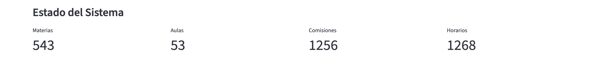
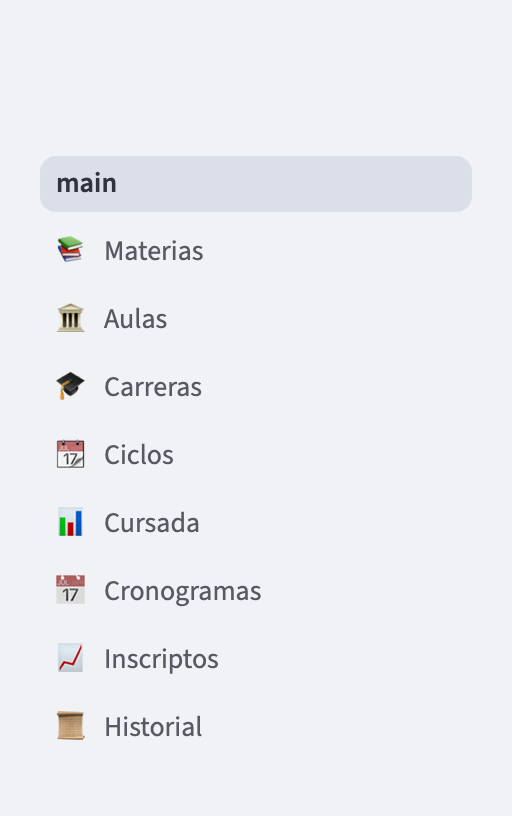
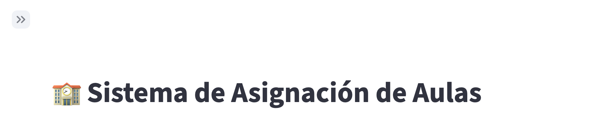

# Primeros pasos

Este documento te lleva desde "instalé la aplicación" hasta "veo la
página de inicio con los datos cargados" en unos pocos minutos.

## Antes de arrancar

Asumimos que:

- La aplicación ya está instalada en tu computadora (el equipo técnico
  se ocupó del setup).
- Tenés el ícono o la carpeta con el archivo `start.bat` (Windows) o
  `start.command` (Mac).

Si algo de esto no está listo, hablá con el equipo técnico antes de
seguir. El documento
`project/2. Desarrollo/DISTRIBUCION.md` cubre el proceso de
instalación.

## Arrancar la aplicación

1. Ubicá la carpeta donde está instalado el sistema (típicamente en
   Escritorio o Documentos).
2. Hacé doble click en:
   - **Windows**: `start.bat`
   - **Mac**: `start.command`
3. Se va a abrir una **ventana negra** (una terminal) con texto que
   dice "Preparando la aplicación...". No la cierres: mientras esté
   abierta, el sistema está funcionando.
   - La primera vez que la corras, tarda **1 o 2 minutos** porque
     baja los componentes que necesita. Requiere internet **sólo la
     primera vez**.
   - Las siguientes veces arranca en segundos y no necesita internet.
4. Después de unos segundos, se abre automáticamente el navegador
   (Chrome, Edge o Safari) con la aplicación cargada.

Si el navegador no se abre solo, entrá manualmente a la dirección:

```
http://localhost:8501
```

## La página de inicio

Al abrirse, ves la página principal (Home). Tiene el título:

> **🏫 Sistema de Asignación de Aulas**
> **FCEIA - Universidad Nacional de Rosario**


Debajo, un texto de bienvenida con la lista de módulos disponibles y
**cuatro cifras** que muestran el estado actual de la base:

- **Materias**: total de asignaturas en el catálogo.
- **Aulas**: total de espacios físicos.
- **Comisiones**: total de comisiones activas en todos los planes.
- **Horarios**: total de horarios semanales cargados en todos los
  planes.



Las cuatro cifras aparecen al pie de la página de inicio, bajo el
título "Estado del Sistema".

> **Para verificar:** el texto de bienvenida de la página de inicio
> todavía nombra el módulo de cursada como "Planes" y no menciona
> "Inscriptos"; en el menú lateral, en cambio, figuran "Cursada" e
> "Inscriptos". Es un texto de la propia aplicación; el manual usa los
> nombres del menú lateral.

Si es la primera vez y todavía no cargaste datos, vas a ver ceros o
números bajos. Si la carga inicial ya se hizo, deberías ver algo así:

- Materias: cientos (la captura muestra 543).
- Aulas: decenas (53 en la captura).
- Comisiones y Horarios: pueden estar en cero hasta que se genere el
  primer plan de cursada del ciclo.

## Navegar entre módulos

A la izquierda tenés el **menú lateral** con las 8 páginas del
sistema (el primer renglón, "main", vuelve a la página de inicio):

- 📚 Materias
- 🏛️ Aulas
- 🎓 Carreras
- 📆 Ciclos
- 📊 Cursada
- 📅 Cronogramas
- 📈 Inscriptos
- 📜 Historial

Click en cualquiera te lleva a esa página. Cada una tiene sus propias
solapas.



Si el menú lateral no se ve, buscá el botón con dos flechas `>>` en la
esquina superior izquierda y hacé click para desplegarlo.



En la captura, el botón para volver a desplegar el menú está arriba a
la izquierda, sobre el título de la página.

## Cerrar la aplicación

Cuando termines de trabajar:

1. Cerrá la pestaña del navegador donde está abierta la aplicación
   (opcional).
2. Cerrá la ventana negra (la terminal) que se abrió al arrancar.
   Con eso apagás el sistema.

**Importante**: los datos que cargaste NO se pierden al cerrar. Todo
queda guardado en un archivo local. La próxima vez que arranques, vas
a ver todo tal como lo dejaste.

## Verificar que la carga inicial esté hecha

Antes de empezar a trabajar en serio, conviene verificar que el
catálogo base esté cargado. Andá una por una a estas páginas y fijate
que haya datos:

### 📚 Materias

En la solapa **📋 Lista de materias**, tenés que ver cientos de
materias listadas (de a 20 por página).


Arriba de la lista, la leyenda "N de M materia(s) coinciden" indica
cuántas materias cumplen los filtros (N) sobre el total cargado (M). En
la captura hay un filtro por nombre, por eso dice "7 de 543"; sin
filtros, las dos cifras coinciden.

- Si está vacía o hay pocas materias, la carga inicial no se hizo.
  Hablá con el equipo técnico.

### 🏛️ Aulas

En la solapa **📋 Listado**, tenés que ver decenas de aulas.


En la solapa **📍 Sedes**, tenés que ver por lo menos la sede
"Pellegrini" (default de FCEIA).


- Si no hay aulas, la carga inicial no se hizo.
- Si querés agregar sedes o aulas nuevas (por ejemplo Zeballos,
  Beltrán, Siberia), podés hacerlo desde estas mismas solapas.

### 🎓 Carreras

En la solapa **📋 Lista de carreras**, tenés que ver todas las carreras que dicta
FCEIA. Fijate que cada una tenga **nombre real** (no que aparezca
"IE - IE" con nombre igual al código). Si aparece así, la carga
inicial se hizo parcialmente y hay que completar los nombres desde
esta misma solapa.


Además, verificá que cada carrera tenga:

- **Cantidad de Materias** cargada (para que el panel "Estado de las
  carreras (materias faltantes)" de la página 📚 Materias pueda
  decir si la carrera está completa; las carreras sin este dato se
  cuentan como "Sin Cantidad Definida").
- Al menos **una versión de plan de estudios** con materias asociadas
  (fijate en la solapa **📚 Plan de estudio**).

## Ver el historial

Andá a **📜 Historial** → solapa **🌐 Feed global**. Si el sistema
lleva un tiempo en uso, deberías ver una lista con los últimos
cambios registrados (creación de materias, cambios de recursado,
etc.).

Si la lista está vacía, es normal: todavía no hubo cambios trackeados.

## ¿Qué hacer si algo no funciona?

- **La página no carga en el navegador**: esperá 30 segundos más y
  refrescá (F5). La primera vez tarda más.
- **La ventana negra se cierra sola inmediatamente**: probablemente
  falló el arranque. Volvé a abrir `start.bat` (o `.command`)
  teniendo internet la primera vez.
- **La aplicación se ve rota o con textos raros**: refrescá con
  Ctrl+F5 (o Cmd+Shift+R en Mac).
- **Sale un error grande en rojo**: sacale foto o copiá el texto y
  mostráselo al equipo técnico. La aplicación suele mostrar
  errores bastante autoexplicativos.

## Próximo paso

Una vez que verificaste que la aplicación arranca y el catálogo
está cargado, seguí con:

- Si es tu primera vez y tenés que hacer todo desde cero, andá a
  **[Flujo 1: Setup inicial](flujos/01_Setup_inicial.md)**.
- Si el catálogo ya está listo y querés armar un cuatrimestre nuevo,
  andá a
  **[Flujo 2: Armar un cuatrimestre nuevo](flujos/02_Armar_un_ciclo_lectivo.md)**.
- Si tenés una tarea puntual, andá directo al módulo correspondiente
  (ver el **[README](README.md)**).
