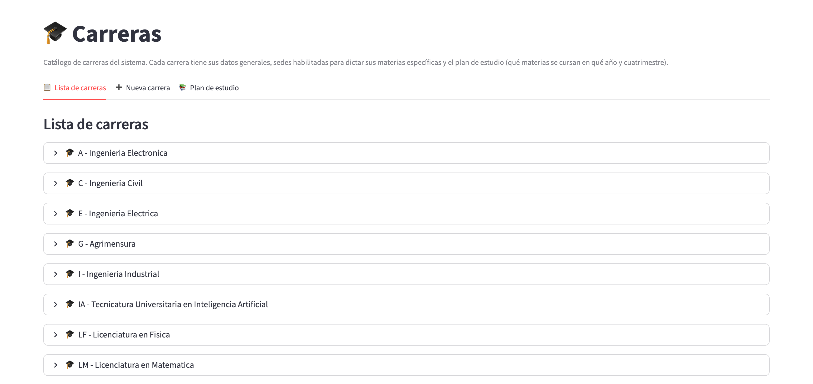
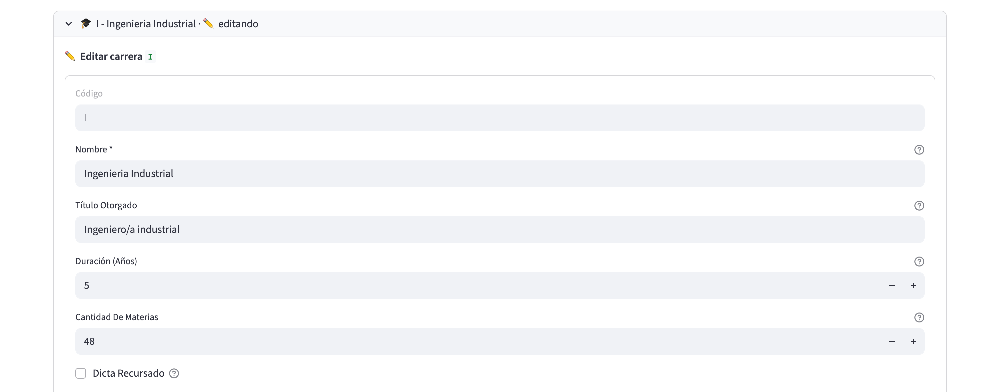
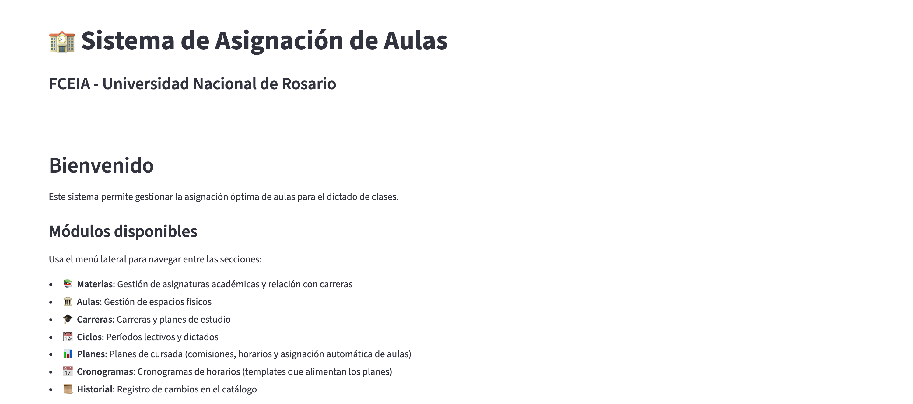

# Flujo 1: Setup inicial de la base

## ¿Cuándo usar este flujo?

- **Primera instalación** del sistema en una máquina nueva.
- Después de un **cambio grande de plan de estudios** (nueva versión
  maestra que reemplaza todo el catálogo).
- Cuando la base de datos **quedó irrecuperable** y hay que
  reconstruir todo.

Este flujo es **destructivo**: reescribe el catálogo entero. No lo
hagas si sólo querés agregar una materia o corregir un dato. Para
eso usá los módulos individuales.

## Estado esperado antes de arrancar

- La aplicación instalada en tu computadora.
- Los archivos Excel maestros disponibles en la carpeta `data/input/`:
  - `aulas/aulas.xlsx`: el listado de aulas físicas de la facultad.
  - `Carreras/Maestro materias.xlsx`: el catálogo completo de
    materias.
  - `Carreras/Maestro planes.xlsx`: la relación materia-carrera con
    año y cuatrimestre para cada plan.
  - `Carreras/carreras_metadata.json` (opcional pero recomendado):
    nombres reales de las carreras, títulos otorgados, duración,
    etc. Sin este archivo, las carreras aparecen con nombre igual al
    código y hay que corregirlas a mano.
- `inscriptos/final_df.xlsx` (opcional): serie histórica de
  inscriptos para la estimación de demanda.

Si no tenés alguno de estos archivos, hablá con el equipo técnico
antes de seguir.

## Pasos

### 1. Cerrá la aplicación si está abierta

Cerrá la ventana negra (terminal) que ejecuta el sistema. La carga
inicial se hace desde fuera de la aplicación.

### 2. Ejecutá la carga inicial

Este paso requiere una **línea de comando**. Si no te sentís cómodo,
pedile al equipo técnico que la haga por vos.

Desde la carpeta del proyecto, correr:

```
python -m scripts.load_initial_data --reset
```

El flag `--reset` **borra la base de datos entera** antes de
recargar. Después:

- Recrea el esquema de tablas.
- Carga aulas, materias, carreras y planes de estudio desde los
  Excel.
- Aplica `carreras_metadata.json` si está presente para completar
  nombres, títulos, duración y cantidad de materias esperadas de
  cada carrera.

El proceso puede tardar entre 30 segundos y 2 minutos según la
cantidad de datos. Al terminar, vas a ver un mensaje de éxito con
totales cargados.

> **Cuidado**: `--reset` **destruye toda la información operativa**
> de la base, no sólo el catálogo. Ciclos, cronogramas, planes,
> comisiones, historial: todo se borra. Sólo se conservan los
> archivos Excel de origen. Después del reset hay que
> **recrear desde cero** los ciclos, dictados, cronogramas, planes y
> asignaciones. Este flujo es para arrancar desde cero, no para
> corregir datos.

### 3. (Opcional) Cargá la serie histórica de inscriptos

Si querés que la estimación de inscriptos alimente al asignador de
aulas, cargá los inscriptos históricos:

```
python -m scripts.load_inscriptos
```

Sin `--reset`, este comando hace un "upsert": si un registro ya
existe (materia, año, cuatri) lo actualiza; si no, lo inserta.

Después de correrlo, andá a la página **📈 Inscriptos** de la
aplicación para revisar. Vas a ver:

- **📊 Materias con datos**: las que se asociaron automáticamente a
  una serie histórica.
- **📭 Materias sin datos de inscriptos**: las que no tienen serie
  histórica.
- Los códigos del Excel que no se pudieron asociar a ninguna materia
  del catálogo no aparecen en estas listas: se resuelven al importar
  el mismo archivo desde la página, en el bloque **🔗 Asociar códigos
  sin match** de la vista previa.


### 4. Arrancá la aplicación

Doble click en `start.bat` (Windows) o `start.command` (Mac). El
sistema levanta y aplica migraciones automáticas si hace falta.

### 5. Verificá que el catálogo se haya cargado

Andá a cada una de estas páginas y confirmá:

- **📚 Materias** → solapa **📋 Lista de materias**: cientos de
  materias listadas.
- **🏛️ Aulas** → solapa **📋 Listado**: decenas de aulas.
- **🏛️ Aulas** → solapa **📍 Sedes**: al menos la sede
  "Pellegrini".
- **🎓 Carreras** → solapa **📋 Lista de carreras**: todas las
  carreras con nombre real (no el código repetido).


### 6. Ajustes manuales de catálogo desde la interfaz

Los Excel maestros no traen algunos datos. Antes de crear el primer
ciclo, ajustá:

#### En 📚 Materias

- **Horas de teoría y laboratorio**: los Excel sólo traen el total
  semanal (`Hs/Sem`). Si querés que el asignador diferencie clases
  teóricas de laboratorios, tenés que cargar el desglose (**Hs
  Teoría** y **Hs Laboratorio**) a mano en cada materia, desde el
  modo edición → **Datos Basicos**.
- **Laboratorios compatibles**: por cada materia con carga de
  laboratorio, asociá qué aulas de tipo laboratorio son compatibles
  (desde el modo edición de la materia, sub-solapa **Laboratorios**).

  

- **Materias virtuales del catálogo**: si hay materias que siempre
  se dictan por Zoom (por convenio institucional), tildá la casilla
  **Virtual** en su edición.
- **Recursado como excepción**: si una materia puntual tiene una
  política distinta al default de su carrera respecto de
  recursarse en el cuatri opuesto, elegilo en el selector
  **Recursado**.
- **Grupos de materias**: cada materia pertenece a un grupo que
  define en qué sedes puede dictarse. Al principio todas están en
  **⚠️ Sin clasificar**; clasificalas desde la solapa
  **📦 Grupos de materias** (ver más abajo, en la configuración de
  sedes).

#### En 🏛️ Aulas

- **Sedes adicionales**: si tu facultad tiene aulas en Zeballos,
  Beltrán, Siberia u otros edificios además de Pellegrini, dalas de
  alta como sedes desde la solapa **📍 Sedes** → desplegable
  **"➕ Crear sede"**.

  

- **Aulas de otras sedes**: el Excel maestro sólo trae aulas de
  Pellegrini. Las de otras sedes hay que darlas de alta a mano
  desde la solapa **➕ Crear**.
- **Tipos de aula**: revisá que cada aula tenga el tipo correcto
  (`teorica`, `practica`, `laboratorio`, `anfiteatro`). Las que
  vinieron del Excel están todas como `teorica` por default. Se
  corrige desde la solapa **👁️ Ver detalle**.

> **Para verificar:** la página Aulas no ofrece una "sede por defecto
> para materias comunes": las sedes de las materias comunes las define
> su grupo de materias.

#### En 📦 Grupos de materias (página Materias)

- **Sedes admisibles**: en la solapa **📦 Grupos de materias** de
  📚 Materias, configurá cada grupo con su modo (**DURO**: sedes
  admisibles; **BLANDO**: lista ordenada de sedes preferidas) y
  asociale las carreras y materias que correspondan. Si no la completás, las materias quedan en **Sin
  clasificar** y el asignador no tiene criterio de sede para ellas.

#### En 🎓 Carreras

- **Nombres reales**: si `carreras_metadata.json` no estaba, las
  carreras tienen nombre igual al código. Editalas una por una
  desde la solapa **📋 Lista de carreras** → **✏️ Editar** para
  poner el nombre correcto.
- **Cantidad de materias esperadas**: para que la barra de
  completitud funcione, cargá el número esperado de materias
  obligatorias de cada carrera (campo **Cantidad de Materias**).
- **Recursado**: tildá o no **Dicta recursado** por carrera (después
  podés hacer excepciones por materia).
- **Plan de estudio activo**: en la misma edición, elegí la **Versión
  activa** de cada carrera.





> **Cuidado con las carreras dadas de alta desde la interfaz**: si en algún
> momento del setup creaste una carrera nueva desde la solapa
> **➕ Nueva carrera** de 🎓 Carreras (fuera del script de carga
> inicial), la carrera queda sin **versión de plan de estudios**
> asociada y no vas a poder cargarle materias. Las carreras que
> vinieron del script tienen su versión "Plan Original" creada
> automáticamente.
>
> **Para verificar:** cómo se crea la primera versión de una carrera
> nueva, porque la solapa **📚 Plan de estudio** muestra el botón
> **➕ Nueva versión** sólo cuando ya existe al menos una versión.

## Verificación final

Volvé al Home (la página de inicio) y revisá los cuatro contadores:

- **Materias**: cientos.
- **Aulas**: decenas.
- **Comisiones**: 0 (todavía no se generó ningún plan).
- **Horarios**: 0 (ídem).

Los ceros en Comisiones y Horarios son **correctos**: se van a
llenar cuando armes tu primer cuatrimestre (siguiente flujo).



## Cómo volver atrás

Este flujo no se puede "deshacer" propiamente. Si algo salió mal:

- Podés volver a correr `python -m scripts.load_initial_data --reset`
  con los Excel corregidos.
- Si borraste algo importante después del reset, hablá con el equipo
  técnico: si hay un backup reciente en `data/database_backup_*.db`,
  se puede restaurar.

## Puntos de dificultad típicos

- **Falta `carreras_metadata.json`**: las carreras quedan con
  nombres = códigos. Renombralas a mano. Es tedioso pero se hace
  una sola vez.
- **Aulas de otras sedes**: son las que más trabajo dan porque no
  vienen del Excel. Presupuestá tiempo para cargarlas a mano si tu
  facultad tiene varios edificios.
- **Grupos de materias sin configurar**: es un paso fácil de
  olvidar. Si el asignador después da resultados raros (aulas
  asignadas en sedes que no corresponden), lo más probable es que
  las materias sigan en **Sin clasificar** o que el grupo no tenga
  bien cargadas sus sedes.
- **Códigos de inscriptos sin asociar**: revisá el bloque
  **🔗 Asociar códigos sin match** al importar y asociá a mano. Si
  dejás códigos sin asociar, la estimación no los va a tener en
  cuenta.

## Próximo paso

Ya tenés el catálogo listo. Ahora podés armar tu primer cuatrimestre:

- **[Flujo 2: Armar un cuatrimestre nuevo](02_Armar_un_ciclo_lectivo.md)**
