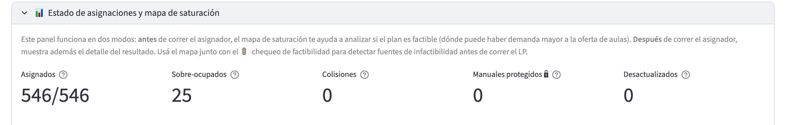
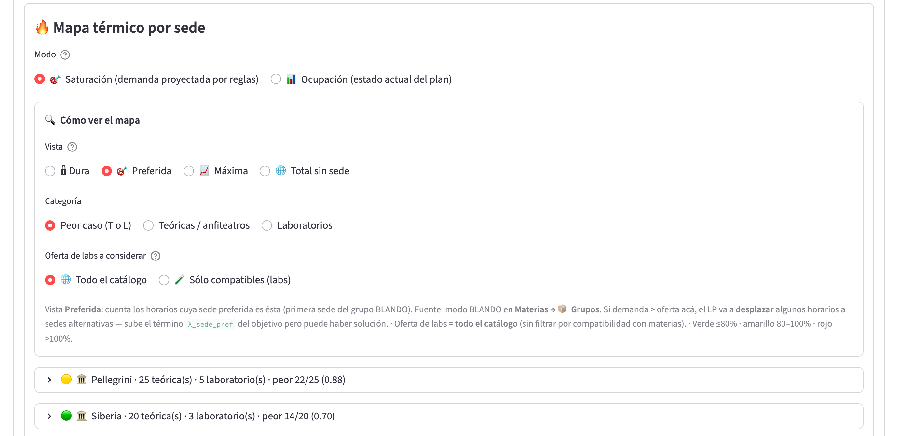

# Flujo 3: Reasignar aulas tras cambios

## ¿Cuándo usar este flujo?

Cuando ya corriste el asignador y tenés aulas asignadas, pero después
apareció algún cambio que hace que la asignación quede desactualizada:

- **Se abre una comisión nueva** (más inscriptos de lo previsto).
- **Se cierra una comisión** (cambios administrativos).
- **Se agrega o quita un aula** al inventario de la facultad.
- **Se mueve un horario** (día u hora distintos a los originales).
- **Se cambia la modalidad** de una materia (pasa de presencial a
  virtual, o al revés).
- **Se cambia la carrera asignada** de una comisión (por superposición
  entre carreras).
- **Se ajustan las sedes de un grupo de materias** (modo DURO o
  BLANDO).
- **Se cambian los cupos o pesos** de las comisiones.

En cualquiera de estos casos, la asignación anterior no
necesariamente es la mejor (ni siquiera válida). Este flujo te
guía para reflejar los cambios sin romper el trabajo previo.

## Estado esperado antes de arrancar

- Un plan de cursada con al menos una corrida del asignador previa,
  seleccionado como **Plan activo** en la barra lateral de
  📊 Cursada.
- Sabés qué cambio hay que reflejar.

## Pasos

### Paso 1: Aplicar los cambios estructurales

Dependiendo de qué cambió, andá a la página correspondiente:

- **Comisión nueva o cerrada, o cambio de cupo/peso/carrera
  asignada**: 📊 Cursada → **📋 Horarios** → modo **Por materia** →
  tabla **Comisiones del plan para esta materia**.
- **Horario movido o agregado**: 📊 Cursada → **📋 Horarios** →
  arrastrar, hacer click o seleccionar un rango en el calendario
  (o usar **✏️ Editar día/hora** desde el inspector de franja de la
  solapa 🏛️ Aulas).
- **Modalidad virtual de una materia en el ciclo**: 📆 Ciclos →
  📚 Dictados → selector **Virtual** → **💾 Aplicar N cambio(s)**.
- **Modalidad virtual de un horario específico**: 📊 Cursada →
  📋 Horarios → editar horario → cambiar **Virtual**.
- **Aula nueva o baja de aula**: 🏛️ Aulas (solapas **➕ Crear** y
  **👁️ Ver detalle**).
- **Sedes admisibles**: 📚 Materias → 📦 Grupos de materias → editar
  el grupo (sedes del modo DURO o lista del modo BLANDO). El modo de
  cada grupo se elige al correr el asignador.
- **Laboratorios compatibles**: 📚 Materias → editar materia →
  sub-solapa **Laboratorios**.

Verificá siempre que el cambio se haya persistido (buscá el mensaje
de confirmación).

> **Cuidado**: si moviste un horario a otro día u hora, el aula que
> tenía asignada queda pegada al horario. Esa aula puede quedar en
> conflicto con otras clases del nuevo horario y el panel de aulas lo
> marca como colisión. Hay dos formas de reconciliarlo: liberar el
> aula del horario (botón **🧹 Liberar aula de …** en la sección de
> colisiones de **🛠️ Gestión de asignaciones**) o volver a correr el
> asignador, que reevalúa todo.

### Paso 2: Volver a validar (si el cambio fue estructural)

Si el cambio afectó al cronograma origen (por ejemplo, se corrigió un
horario que ya estaba en el cronograma), volvé a 📅 Cronogramas →
**✅ Validar** y corré la validación de nuevo. Para que el cambio
llegue al plan tenés que generar un plan nuevo a partir del cronograma
(flujo 2, paso 7): el plan existente no se actualiza solo.

Si el cambio fue sólo en el plan (no en el cronograma), no hace falta
revalidar el cronograma. En ese caso, podés revisar el panel de
validaciones del plan (📊 Cursada → **🔍 Detalle del Plan** →
**Validar plan**).

### Paso 3: Correr el asignador de nuevo

**Página**: 📊 Cursada, solapa **🏛️ Aulas**.

1. Abrí **🏛️ Asignador de aulas** → **🚀 Correr la asignación**.
   El formulario se precarga con los parámetros de la última corrida;
   fijate especialmente en:
   - **Respetar ediciones manuales** (activado por defecto): el
     asignador no toca las aulas que fijaste a mano con la casilla
     **🔒 Marcar como manual**. Si querés que las vuelva a decidir,
     desactivalo o liberalas desde **🔒 Asignaciones manuales
     protegidas**.
   - **Aplicar desde la fecha**.
2. Si querés, probá antes **▶️ Chequear factibilidad**: es una
   verificación previa que detecta bloqueos sin correr el asignador.
3. Apretá **🚀 Asignar aulas**.

El sistema corre otra vez y guarda una nueva corrida en el historial
de corridas del plan. La última es la que se muestra por defecto.

### Paso 4: Revisar diferencias

En el mismo panel:

- Mirá el veredicto y la métrica **Horarios reasignados**: cuántos
  horarios cambiaron de aula respecto de la corrida anterior.
- Mirá el **mapa térmico por sede**: ¿mejoró respecto al problema
  que te llevó a volver a correr?
- Mirá la **tabla por horario**: ¿los horarios afectados quedaron
  con las aulas esperadas?
- Mirá las métricas de **Colisiones** (debería ser 0) y
  **Desactualizados**.

### Paso 5: (Opcional) Redistribución de pesos

Si activaste el interruptor **Redistribuir pesos entre comisiones
(experimental)**, el asignador puede haber propuesto una
redistribución de los pesos que mejora la asignación. Vas a ver la
tabla **🔄 Pesos propuestos para redistribuir capacidad** (pesos
actuales vs. propuestos) y dos botones:

- **Aplicar nuevos pesos**: guarda la propuesta como el nuevo peso de
  cada comisión.
- **Descartar propuesta**: deja los pesos como estaban.

Ojo: si descartás, las aulas que asignó el asignador quedan pero los
pesos NO reflejan la asignación efectiva. Es recomendable **aplicar**
si aceptás la propuesta.

## Sobre «Aplicar desde la fecha»

> **Para verificar:** el efecto exacto de **Aplicar desde la fecha**
> en la versión actual. La ayuda del campo dice que las clases
> anteriores a esa fecha quedan intactas, pero el entregable de la
> aplicación es el patrón semanal con sus aulas, no clases fechadas.
> Hasta confirmarlo, dejá el valor por defecto.

## Verificación final

Después de la reasignación:

- La corrida más reciente está en **✅ resuelta**.
- Las métricas de sobre-ocupados y sub-utilizados están dentro de lo
  tolerable.
- El cambio que motivó la reasignación se ve reflejado en la **tabla
  por horario**.
- No hay colisiones de aula.

## Cómo volver atrás

Cada corrida queda guardada en el historial de corridas del plan, pero
no hay un botón "revertir a la corrida anterior". Si querés volver
atrás:

- Opción A: correr el asignador con la configuración anterior (los
  parámetros de cada corrida se ven en **⚙️ Parámetros usados en esta
  corrida**).
- Opción B: editar a mano las aulas de los horarios afectados desde
  **🛠️ Gestión de asignaciones**.

## Puntos de dificultad típicos

- **Moviste horarios y aparecen colisiones de aula**: es porque el
  horario conserva el aula vieja. Liberá el aula o corré el asignador
  de nuevo y se resuelve.
- **La corrida da infactible después de un cambio que "no debería"
  romper nada**: revisá si al cambio le agregaste alguna
  restricción sin querer (por ejemplo, asignar una carrera a una
  comisión o pasar un grupo a modo DURO con pocas sedes).
- **Cambiaste las sedes de un grupo y no se reflejó**: las sedes se
  leen de nuevo en cada corrida del asignador. Corré de nuevo y va a
  tomarlas.
- **Editaste un aula a mano y el asignador la cambió**: verificá que
  **Respetar ediciones manuales** esté activado y que la aula haya
  quedado marcada como manual (🔒) al confirmar el cambio.

## Próximo paso

- Para cambiar a mano el aula de un horario puntual (incluido el flujo de
  cambios en cascada), seguí con el
  **[Flujo 5: Reasignar un aula manualmente](05_Reasignar_un_aula_manualmente.md)**.
- Si el cambio fue justo antes del arranque del cuatri, seguí con la
  **[Verificación pre-inicio](04_Verificacion_pre_inicio.md)**.
