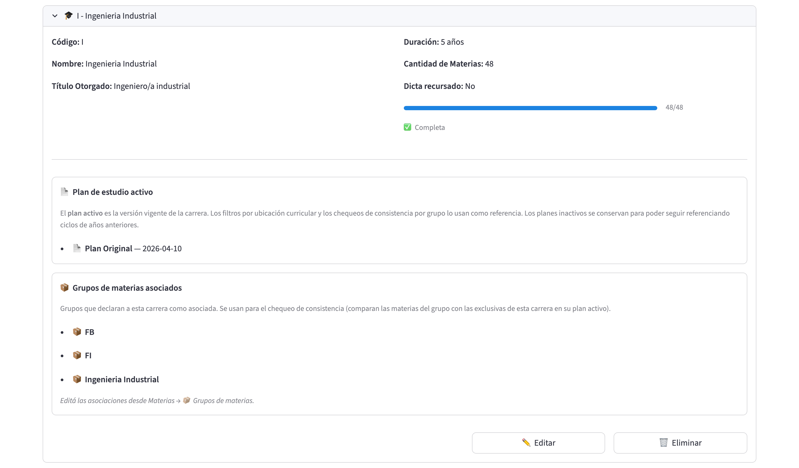

# Flujo 4: Verificación pre-inicio de cuatrimestre

## ¿Cuándo usar este flujo?

**Días antes del inicio del cuatrimestre**, cuando vas a dar por
cerrado el plan y comunicar la asignación oficial. Es un **checklist
consolidado** que recorre varias páginas para asegurarte que todo
esté en orden.

Se recomienda hacerlo:
- **48 a 72 horas antes** del primer día de clases.
- **Después de cualquier reasignación tardía**.
- Como **rutina periódica** durante el cuatrimestre (una vez por
  mes) para detectar desvíos.

## Estado esperado antes de arrancar

- Un plan de cursada del ciclo, seleccionado como **Plan activo** en
  la barra lateral de 📊 Cursada, con al menos una corrida del
  asignador resuelta.

## Cómo usar esta guía

Recorré cada sección en orden. En cada punto, hacé la verificación
que se indica y marcá el checkbox mentalmente (o imprimí este
documento y usá los `[ ]` como checklist real).

Si algún punto **no cumple**, el flujo te dice qué hacer para
corregirlo (típicamente, volver a alguna página y usar el
**[Flujo 3: Reasignación](03_Reasignacion_de_aulas.md)**).

---

## 1. Ciclos y dictados

**Página**: 📆 Ciclos, solapa **📚 Dictados**.

- [ ] Seleccionaste el ciclo actual.
- [ ] El **panel de divergencias** está vacío (cartel verde "✅ No
      hay divergencias") o las divergencias que quedan tienen
      justificación clara.
- [ ] Los selectores **Virtual** reflejan la modalidad real de cada
      materia este cuatrimestre.
- [ ] La regla de recursado está bien: no hay materias marcadas como
      "excepción" a menos que corresponda.
- [ ] No hay **cambios pendientes sin aplicar** al pie de la página
      (el bloque "⏳ Cambios pendientes" no aparece).

- [ ] Para materias anuales: si es 2C, verificaste que el dictado
      esté vinculado al del 1C (el aviso de creación los cuenta como
      "vinculados (anuales)").

### Si algo falla acá

- Divergencias pendientes → resolver desde el panel de divergencias.
- Virtualidad mal marcada → ajustar el selector y aplicar cambios.
- Cambios pendientes → aplicar (**💾 Aplicar**) o descartar
  (**🚫 Descartar cambios**) antes de continuar.

---

## 2. Cronograma

**Página**: 📅 Cronogramas.

- [ ] Sabés cuál es el **cronograma "vigente"** del ciclo (el que se
      usó para generar el plan activo).
- [ ] Ese cronograma tiene badge **🟢 validado**.
- [ ] No hay cronogramas "de trabajo" antiguos que puedan confundir;
      renombralos o borralos si ya no aplican.
- [ ] Si hubo cambios recientes en el cronograma, revalidaste (badge
      🟡 significa que hay que volver a correr Validar).

### Si algo falla acá

- Badge 🟡 → ir a la solapa **✅ Validar** y volver a validar.
- Badge 🔴 → hay issues, resolverlos antes de seguir.
- Múltiples cronogramas confusos → usar la solapa **📋 Lista** para
  renombrar o borrar los que no aplican.

---

## 3. Plan de cursada

**Página**: 📊 Cursada, solapas **📋 Planes del ciclo** y
**🔍 Detalle del Plan**.

- [ ] En la barra lateral, el **Ciclo activo** y el **Plan activo**
      son los que corresponden (recordá que "activo" sólo significa
      "el plan seleccionado": no es un estado guardado en el plan).
- [ ] En **📋 Planes del ciclo**, la tarjeta marcada **✅ Activo** es
      el plan correcto (no un borrador viejo). Si quedan planes de
      prueba que ya no sirven, eliminalos.
- [ ] Todas las materias esperadas tienen al menos una comisión.
- [ ] Todas las comisiones tienen al menos un horario.
- [ ] Los cupos y pesos de las comisiones son coherentes con los
      inscriptos esperados de la materia.
- [ ] El panel de **Validaciones** (en **🔍 Detalle del Plan**), tras
      apretar **Validar plan**, no muestra faltantes ni conflictos sin
      resolver (o los que quedan están justificados o ignorados).

### Si algo falla acá

- Plan equivocado seleccionado → elegir el correcto con el botón
  **Seleccionar** de su tarjeta o con el selector de la barra
  lateral.
- Faltan comisiones u horarios → corregirlos en la pestaña
  **📋 Horarios** (o volver al cronograma y generar un plan nuevo).
- Conflictos en validación → resolverlos siguiendo las
  recomendaciones del propio panel.
- Resultado de validación desactualizado → volver a apretar
  **Validar plan**.

---

## 4. Asignación de aulas

**Página**: 📊 Cursada, solapa **🏛️ Aulas**.

- [ ] La corrida más reciente del asignador está en **✅ resuelta**.
- [ ] La fecha de la corrida es **reciente** (no es una del mes
      pasado sin haber vuelto a correr tras cambios).
- [ ] No hay **colisiones** de aula ni horarios **desactualizados**
      en las métricas del panel **📊 Estado de asignaciones y mapa de
      saturación**.
- [ ] En el **mapa térmico por sede** no hay celdas 🔴
      (>100%). Las 🟡 (80-100%) son tolerables pero conviene
      revisarlas.
- [ ] La **tabla por horario** (interruptor **📋 Ver detalle por
      horario**) muestra mayoría de horarios en 🟢.
      Los 🔴 (sobre-ocupados) tienen justificación (por ejemplo, un
      curso muy chico en un aula grande no es problema; un curso
      grande en un aula chica sí).
- [ ] En **🛠️ Gestión de asignaciones** no aparece el aviso de
      colisiones: no hay dos comisiones distintas en la misma aula,
      mismo día y misma franja (con **Mostrar cronograma** podés ver
      el calendario de los horarios filtrados por aula).
- [ ] Todos los horarios no virtuales tienen aula asignada. Los
      virtuales están correctamente sin aula.
- [ ] Los tipos de aula coinciden con lo que la materia pide (aulas
      teóricas para clases teóricas, laboratorios compatibles para
      clases de lab).

### Si algo falla acá

- Corrida no óptima → seguir el flujo de diagnóstico (ver Flujo 2
  paso 9 y el módulo Cursada).
- Corrida vieja → correr de nuevo con
  **[Flujo 3](03_Reasignacion_de_aulas.md)**.
- Saturación 🔴 → identificar la franja con el inspector de franja,
  redistribuir o marcar virtual.
- Colisión de aulas → liberar el aula o correr el asignador de nuevo
  (probablemente un horario se movió después de la última corrida).
- Aulas incorrectas para el tipo → revisar los laboratorios
  compatibles de la materia (📚 Materias → editar → **Laboratorios**)
  o el tipo del aula.

---

## 5. Aulas y sedes

**Página**: 🏛️ Aulas.

- [ ] Todas las aulas del edificio están cargadas (solapa
      **📋 Listado**).
- [ ] Ninguna aula que esté fuera de servicio (por reforma, corte de
      luz, etc.) aparece como disponible. Si hay que dar de baja
      alguna, eliminala desde **👁️ Ver detalle** y volvé a correr el
      asignador.
- [ ] Cada aula tiene el **tipo correcto** (teórica, práctica,
      laboratorio, anfiteatro).
- [ ] Las capacidades reflejan la realidad (no hay aulas con
      capacidad 30, el valor inicial del formulario, sin haber
      puesto el número real).
- [ ] Las **sedes** de la solapa **📍 Sedes** son las esperadas y
      cada una tiene sus aulas.

---

## 6. Carreras y grupos de materias

**Páginas**: 🎓 Carreras y 📚 Materias → 📦 Grupos de materias.

- [ ] Cada carrera tiene su **plan de estudio activo** y la
      **cantidad de materias** esperada cargada; las barras de
      completitud muestran ≥ el número esperado.
- [ ] La política de **recursado** (**Dicta recursado**) de cada
      carrera es la deseada.
- [ ] En **📦 Grupos de materias** no quedan materias en **⚠️ Sin
      clasificar** (o están justificadas) y cada grupo tiene sus
      sedes admisibles (modo DURO) y su lista de sedes preferidas
      (modo BLANDO) bien cargadas.
- [ ] El botón **🔍 Chequear consistencia** de cada grupo no lista
      materias faltantes ni ajenas sin explicación.

---

## 7. Inscriptos (si se usa la estimación de demanda)

**Página**: 📈 Inscriptos.

- [ ] La serie histórica está cargada al día (año actual y anteriores
      completos).
- [ ] No hay muchas materias en la sección **📭 Materias sin datos
      de inscriptos** (idealmente cero, o justificadas).
- [ ] Los huecos de la **cobertura por período** son los esperados.
- [ ] Los códigos de archivo que no coincidían con ninguna materia
      quedaron asociados (bloque **🔗 Asociar códigos sin match** de
      la vista previa de importación).
- [ ] Si alguna materia tiene **override manual** ("Total esperado
      manual"), ese valor es correcto para el cuatrimestre actual
      (revisar desde 📊 Cursada → 🔍 Detalle del Plan → editor por
      materia).

> **Cuidado**: las ediciones sobre esta página no dejan rastro en el
> historial. Es importante que todos los cambios en Inscriptos estén
> hechos por una única persona o coordinados por email para evitar
> pisadas silenciosas.

---

## 8. Historial

**Página**: 📜 Historial.

- [ ] Andá a la pestaña **🌐 Feed global** y revisá los cambios de las
      últimas **48 horas** (poné **Días hacia atrás** en 2).
- [ ] No hay **cambios inesperados** de otros usuarios (dictados que
      se borraron, materias que cambiaron modalidad, etc.).
- [ ] Si hubo cambios, entendés por qué se hicieron.

Si estás compartiendo la máquina con otros usuarios, esta verificación
es especialmente importante.

---

## 9. Cierre y comunicación

Una vez que todos los puntos anteriores están OK:

- [ ] **Guardá un backup manual** de la base de datos. El equipo
      técnico puede ayudarte con esto; típicamente es copiar el
      archivo `data/database.db` a `data/database_backup_YYYY-MM-DD.db`.
- [ ] Sacá **capturas de pantalla** del veredicto de la corrida, del
      mapa térmico y de la tabla por horario para el registro oficial.
- [ ] **Comunicá** la asignación por los canales habituales de la
      facultad. El sistema no comunica automáticamente ni a alumnos
      ni a docentes.
- [ ] Anotá la **fecha de cierre** del plan por si aparecen cambios
      posteriores que haya que seguir.

---

## Cómo volver atrás

Si en la verificación descubrís que algo grave está mal (por ejemplo,
un plan con muchas materias sin aula), tenés varias opciones:

- **Corrección puntual**: aplicar los cambios necesarios y volver a
  correr el asignador con el
  **[Flujo 3](03_Reasignacion_de_aulas.md)**.
- **Trabajar con otro plan del mismo ciclo**: si ya hay otro plan
  válido, seleccionalo con el botón **Seleccionar** de su tarjeta.
- **Empezar de cero**: si el problema es sistémico, borrá el plan y
  volvé a generarlo desde el cronograma (Flujo 2 desde el paso 7).

---

## ¿Qué NO verificar acá?

- **Datos de alumnos** (nombres, DNIs, inscripciones nominales): no
  los maneja este sistema.
- **Docentes asignados**: idem.
- **Calendario académico** (feriados, ventanas de examen): idem.

Estos aspectos se manejan por fuera del sistema en las plataformas
habituales de la facultad.

---

## Cerrado con éxito

Si todos los checks están OK, el plan está listo para el arranque
del cuatrimestre. ¡Buen cuatri! 🎓
