# Flujo 5: Reasignar un aula manualmente

## ¿Cuándo usar este flujo?

Cuando querés decidir vos el aula de un horario puntual, en lugar de
dejar que la decida el asignador:

- **Después de correr el asignador**, porque el resultado te sirve en
  general pero querés cambiar el aula de uno o varios horarios (por
  ejemplo, pasar una materia a un aula más cercana a su cátedra).
- **Sin haber corrido el asignador**: los horarios figuran como «Sin
  asignar» y podés ir fijando aulas a mano.
- **Para corregir una colisión** o una asignación desactualizada que
  aparece en el panel de aulas (ver el [Flujo 3](03_Reasignacion_de_aulas.md)).
- **Para proteger una decisión**: querés que el asignador respete esa
  aula en las corridas siguientes.

Si el aula que querés ya está ocupada por otro horario en esa franja,
el sistema no te lo impide: te lleva a un **flujo de cambios en
cascada**, donde decidís qué pasa con cada horario desplazado. Las
secciones «Pasos» y «Cómo funciona la cascada» lo explican en detalle.

## Estado esperado antes de arrancar

- Un plan de cursada seleccionado como **Plan activo** en la barra
  lateral de 📊 Cursada. Los ejemplos de este flujo usan el ciclo
  2026-1C y el «Plan v0».
- El plan tiene horarios cargados. No hace falta que haya una corrida
  del asignador: sin corrida, los horarios aparecen como «Sin
  asignar».
- Los horarios a cambiar son **presenciales**. Los virtuales no toman
  aula.
- Sabés qué horario querés mover y, si es posible, a qué aula.

## Pasos

### Paso 1: Encontrar el horario

**Página**: 📊 Cursada, solapa **🏛️ Aulas**.

1. Abrí el desplegable **🛠️ Gestión de asignaciones**. Adentro está la
   sección **📅 Aulas asignadas por horario**.
2. Usá el desplegable **🎛️ Filtros** para acotar la lista: por sede y
   aula, carrera, año y cuatrimestre del plan, tipo de clase, día, o
   con el buscador **Buscar materia (código o nombre)**. Apretá
   **✅ Aplicar filtros**.
3. Abrí el horario que te interesa. Cada horario es un desplegable con
   el título «Día HH:MM–HH:MM · Materia · Código · Comisión · Sede ·
   Aula». Si el aula fue fijada a mano, el título termina con
   **🔒 aula manual**.

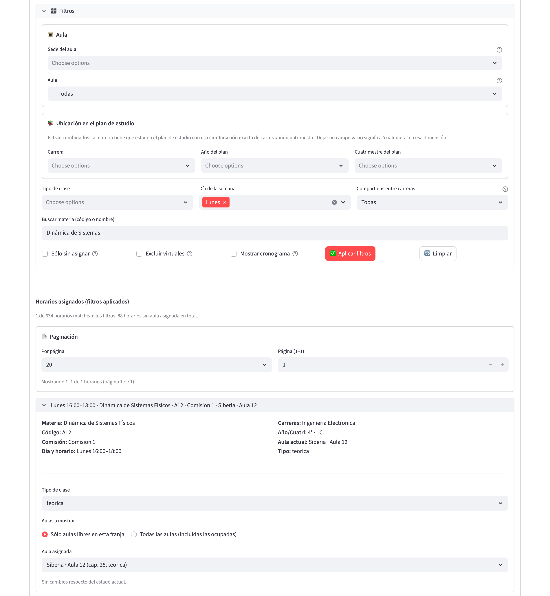

Dentro del horario ves sus datos (materia, comisión, carreras,
año y cuatrimestre, aula actual, tipo) y los controles de edición:
**Tipo de clase**, **Aulas a mostrar** y el selector de aula.

> **Cuidado**: si el aula actual del horario no es una de las que
> ofrece el selector (porque pasó a ser inadmisible, por ejemplo por un
> cambio de sede del grupo de materias), el selector arranca en **Sin
> asignar**. Como eso difiere del estado actual, el botón **Ver
> cambio propuesto** aparece de inmediato. Si lo confirmás sin tocar
> nada más, el horario queda sin aula. Mirá bien el selector antes de
> seguir.

### Paso 2: Elegir el aula nueva

El selector **Aulas a mostrar** tiene dos opciones.

**Sólo aulas libres en esta franja** (opción por defecto). El selector
**Aula asignada** lista las aulas que cumplen todo lo siguiente:

- son compatibles con el tipo de clase del horario: una clase teórica
  admite aulas teóricas y anfiteatros, y una de laboratorio solo admite
  los laboratorios declarados como compatibles con la materia (se
  configuran en 📚 Materias, sub-solapa **Laboratorios**);
- están en una sede admisible para la materia (si su grupo de materias
  está en modo DURO con sedes definidas; los laboratorios compatibles
  siempre pasan);
- no están usadas por otro horario del plan en una franja que se
  solape con la de este horario.

Las aulas aparecen ordenadas por capacidad, de menor a mayor, con la
capacidad y el tipo a la vista. El sistema **no compara la capacidad
con los inscriptos esperados** al cambiar un aula a mano: esa decisión
queda en tu criterio. También podés elegir **Sin asignar**.

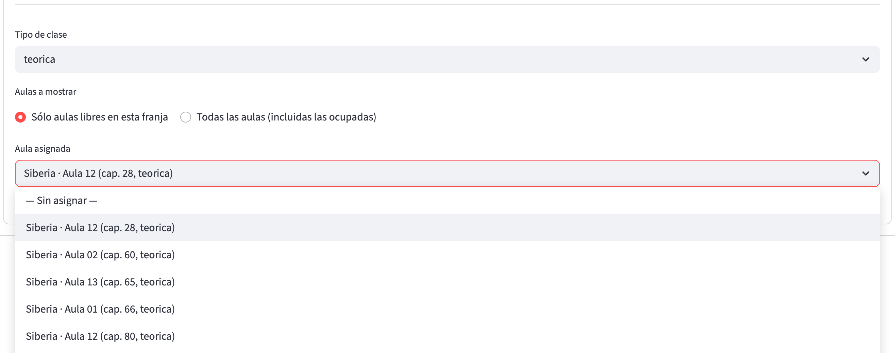

Si no hay ninguna compatible y libre, el sistema avisa: «No hay aulas
compatibles libres en esta franja. Cambiá a 'Todas las aulas' para
elegir una ocupada y resolver el conflicto».

**Todas las aulas (incluidas las ocupadas)**. Además de las libres,
el selector incluye las aulas ocupadas, con una etiqueta que te dice
cuánto conflicto implican:

- `[LIBRE]`: nadie la usa en esa franja.
- `[1 horario afectado]`, `[2 horarios afectados]`, etc.: cuántos
  horarios del plan la usan en una franja que se solapa, seguido de
  los códigos de materia de los dos primeros (y «+N» si hay más).

Las aulas ocupadas respetan los mismos filtros de tipo y sede que las
libres. Elegir una de ellas abre el flujo de cascada (ver más abajo).

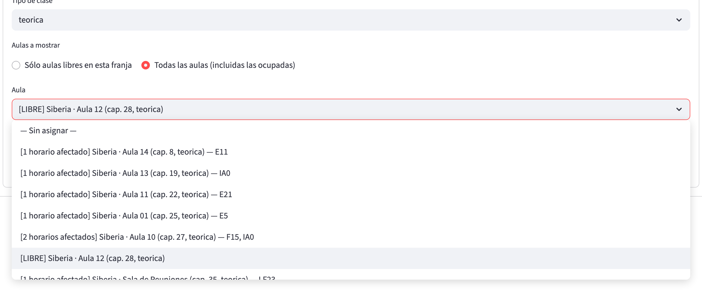

Si además querés **cambiar el tipo de clase** (teórica o laboratorio),
hacelo en el selector **Tipo de clase** antes de elegir el aula. Las
aulas candidatas se recalculan con el tipo nuevo.

### Paso 3: Ver el cambio propuesto

Cuando lo elegido difiere del estado actual aparece el botón **Ver
cambio propuesto**. Si no, el sistema muestra «Sin cambios respecto
del estado actual». Al apretarlo se abre el diálogo **Confirmar cambio
de aula**.

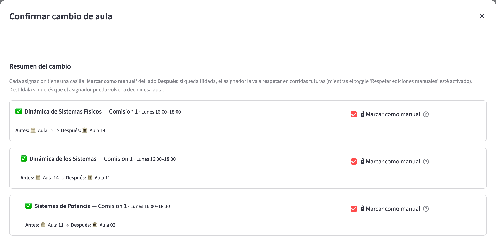

El diálogo tiene tres partes:

1. **Resumen del cambio**: una tarjeta por cada horario que cambia de
   aula, en este orden: primero el que editaste y después los
   desplazados, con sangría creciente según el nivel. Cada tarjeta
   muestra el aula **Antes** y la **Después** y un ícono de estado:
   - ✅ todo en orden;
   - ⚠️ hay avisos que no bloquean;
   - ❌ hay un problema que bloquea el cambio.
2. **Vista antes / después por aula**: un desplegable por cada aula
   involucrada, con dos calendarios semanales (Antes y Después). Las
   materias tocadas por el cambio se resaltan a color y el resto queda
   en gris; una estrella marca los horarios tocados por la cascada.
3. Los botones **Confirmar** y **Cancelar**.

> **Para verificar:** el calendario de cada aula abre mostrando las
> primeras horas de la mañana (desde las 07:00). Para ver clases de la
> tarde o la noche hay que desplazarse dentro del calendario.

### Paso 4: Decidir si el aula queda protegida

Cada tarjeta con aula asignada trae la casilla **🔒 Marcar como
manual**, **tildada por defecto**. Qué significa:

- **Tildada**: el horario queda registrado como asignado a mano. Con
  **Respetar ediciones manuales** activo, el asignador no lo toca en
  las corridas siguientes (ver «Qué pasa en la corrida siguiente del
  asignador»).
- **Destildada**: el aula queda cargada pero el asignador puede volver
  a decidirla.

La casilla es independiente para cada horario de la cascada. Un
horario que queda sin aula no muestra la casilla: su marca de manual
se baja.

### Paso 5: Qué valida el sistema

Antes de habilitar **Confirmar**, el sistema verifica cada horario
involucrado:

| Verificación | Resultado si falla |
|---|---|
| Tipo de aula compatible con el tipo de clase (teórica o anfiteatro para teoría; laboratorio compatible con la materia para laboratorio) | ❌ «El aula 'X' es de tipo 'Y' y no admite clase teórica» o «no es laboratorio compatible con la materia Z» |
| Sede admisible para la materia (grupo en modo DURO) | ❌ «El aula 'X' está en una sede no admisible para la materia/carrera» |
| Choques entre horarios que quedarían en la misma aula con franjas solapadas, considerando el estado final de todo el plan | ❌ «El aula X quedaría usada al mismo tiempo por A y B. Sus horarios se pisan de HH:MM a HH:MM...» |
| Ciclos en la cadena de desplazamientos | Error global: «Ciclo detectado en la cascada...» |
| Solapamiento parcial con el horario que lo desplaza | ℹ️ aviso en el bloque del desplazado (no bloquea) |

Mientras haya un ❌, **Confirmar** queda deshabilitado con la ayuda
«Hay incompatibilidades, corregí antes de confirmar». Con solo ⚠️
podés confirmar: el sistema respeta tu criterio.

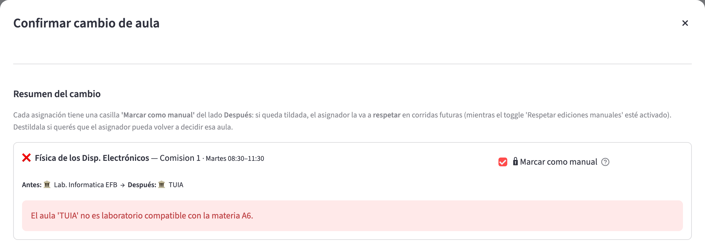

> **Para verificar:** en este ejemplo se cambió el tipo de un horario
> de laboratorio a teórico y se eligió un aula teórica en el mismo
> movimiento. El sistema rechazó el aula diciendo que no es un
> laboratorio compatible, es decir que valida el aula contra el tipo
> *actual* del horario y no contra el elegido. Si te pasa, probá
> primero cambiar solo el tipo (dejando el aula actual si sigue siendo
> válida) y, en una segunda operación, cambiar el aula.

### Paso 6: Confirmar o cancelar

- **Confirmar** aplica todos los cambios en una **única transacción**.
  Si algo falla a mitad de camino, se restauran las aulas originales
  de todos los horarios involucrados. Al terminar, el sistema muestra
  «Se aplicaron los cambios en N horario(s)» y actualiza la lista.
- **Cancelar** (o cerrar el diálogo con la ✕) descarta el cambio. No
  se guarda nada.

Qué queda guardado: para cada horario tocado, su aula y, según la
casilla, la marca de asignación manual. Las clases ya generadas de ese
horario y aún no ejecutadas heredan el aula nueva.

Al confirmar, los horarios con aula fijada a mano muestran **🔒 aula
manual** en su título.

## Cómo funciona la cascada

La cascada aparece cuando, con la opción **Todas las aulas**, elegís
un aula que **otro horario del plan ya usa en una franja que se solapa**
con la tuya. El sistema no decide por vos qué hacer con ese otro
horario (el *desplazado*): te pide que elijas.

### Paso a paso

1. **Elegís el aula ocupada** para el horario que estás editando (el
   *horario raíz*). Debajo del selector aparece un aviso amarillo:
   «Este cambio afecta N horario(s) del plan que están usando el aula X
   en franjas que se solapan con [día y hora]. Decidí qué hacer con
   cada uno».
2. **Aparece un bloque por cada desplazado**, con su materia,
   comisión, día y hora. Si su franja coincide exactamente con la del
   raíz dice «misma franja». Si solo se solapan en parte dice «solapa
   en HH:MM–HH:MM» y agrega la advertencia de que, en el tramo que no
   coincide, el aula quedaría con dos materias al mismo tiempo si le
   asignás la misma aula.
3. **Cada bloque tiene su propio selector de aula**, que arranca en
   **Sin asignar**. Podés elegir:
   - un aula `[LIBRE]`: la cadena termina ahí para ese horario;
   - otra aula ocupada: la cadena se profundiza, y aparecen los
     bloques de los horarios que esa aula desplazaría, con más sangría;
   - **Sin asignar**: el desplazado queda sin aula y la cadena
     termina ahí.
4. **Repetís** hasta que ningún bloque quede apuntando a un aula
   ocupada sin resolver. Después apretás **Ver cambio propuesto**.

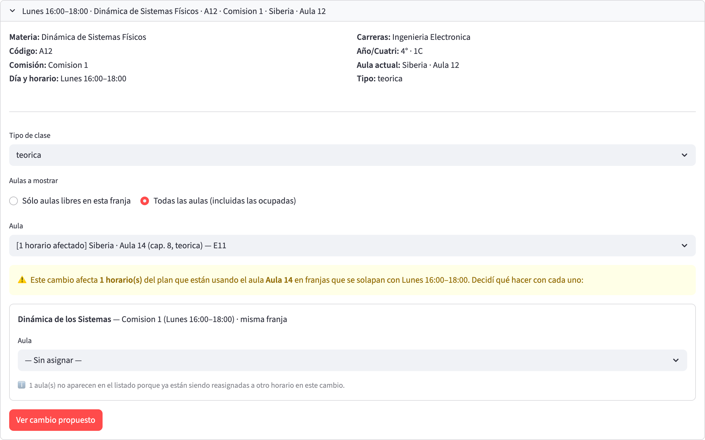

### Ejemplo con tres horarios encadenados

Plan v0, lunes de 16:00 a 18:00 en la sede Siberia:

- **A**: *Dinámica de Sistemas Físicos*, comisión 1 (lunes
  16:00–18:00), hoy en Aula 12.
- **B**: *Dinámica de los Sistemas*, comisión 1 (lunes 16:00–18:00),
  hoy en Aula 14.
- **C**: *Sistemas de Potencia*, comisión 1 (lunes 16:00–18:30), hoy en
  Aula 11.

1. Editás A y elegís **Aula 14**. Está ocupada por B en la misma
   franja: aparece el bloque de B.
2. Para B elegís **Aula 11**. Está ocupada por C, cuya franja se
   solapa en parte (16:00–18:00): aparece el bloque de C, con la
   advertencia de solapamiento parcial.
3. Para C elegís **Aula 02**, que figura como `[LIBRE]`: la cadena
   termina.

Resultado que muestra el diálogo: A pasa de Aula 12 a Aula 14, B de
Aula 14 a Aula 11, y C de Aula 11 a Aula 02. Los tres horarios quedan
con ✅ y con la casilla **Marcar como manual** tildada.

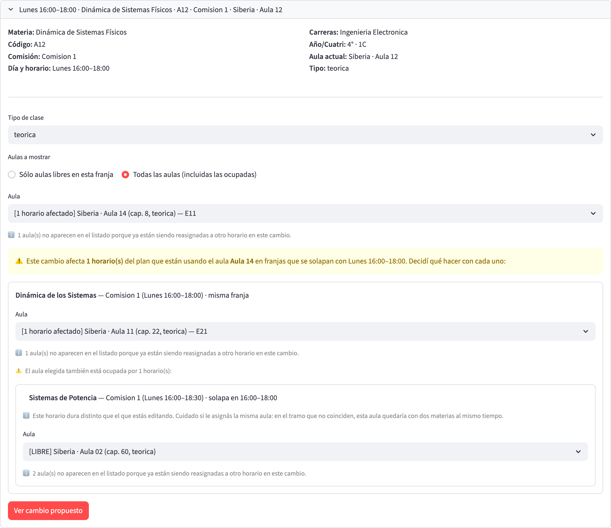

### Cuándo se detiene la cadena

La cadena termina en cada rama cuando el horario de esa rama queda:

- en un aula **libre** en su franja (`[LIBRE]`), o
- en **Sin asignar**.

Si en el ejemplo C hubiera elegido otra aula ocupada (por ejemplo,
Aula 02 ocupada por un cuarto horario), aparecería un cuarto bloque y
la cadena seguiría. No hay un límite fijo de niveles.

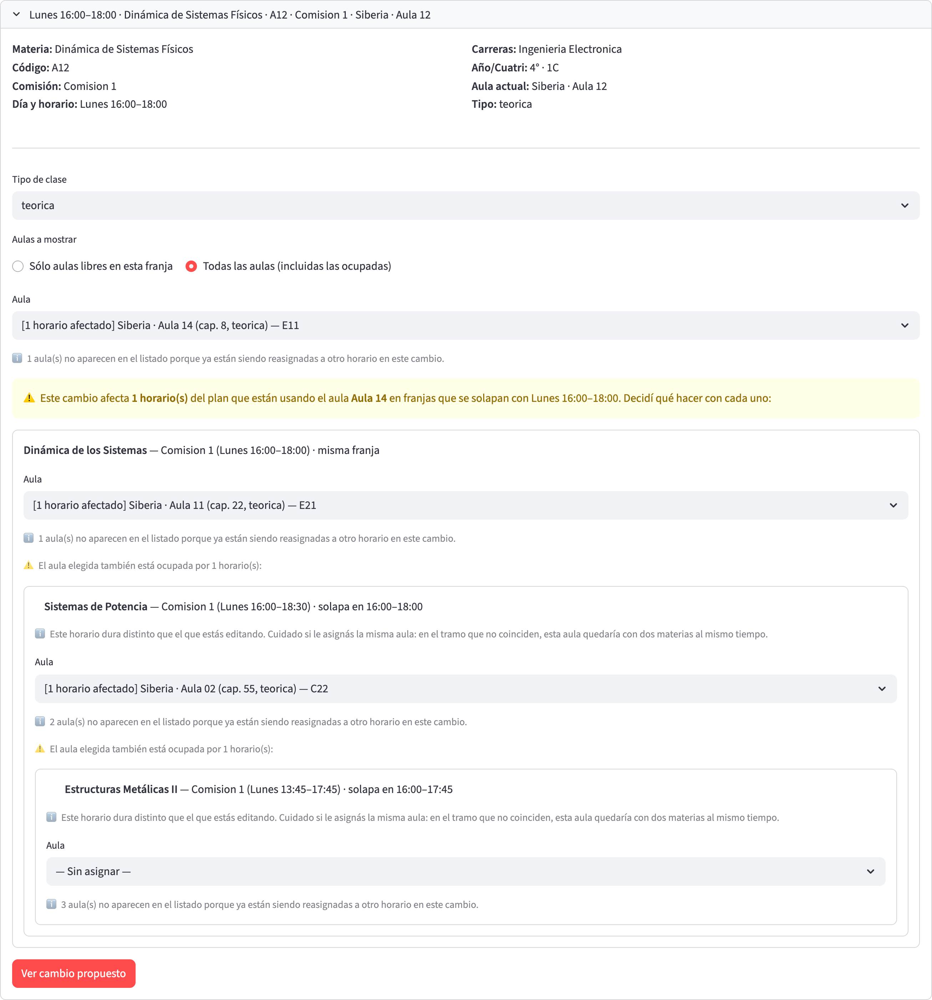

### Reglas que simplifican las decisiones

- **Un aula ya elegida en la cascada no se ofrece de nuevo** a otro
  horario cuya franja se solape con el de quien la eligió. Un pie de
  nota lo avisa: «N aula(s) no aparecen en el listado porque ya están
  siendo reasignadas a otro horario en este cambio». Así no podés armar
  dos horarios en la misma aula a la misma hora.
- **Si cambiás una decisión de arriba, el sistema poda lo que no
  corresponde**: si cambiás el aula del raíz, los bloques de
  desplazados que la aula nueva no afecta desaparecen; si elegís
  «Sin asignar» para un horario, desaparecen sus sub-bloques.
- **Intercambio de aulas**: no hay un botón «intercambiar». Para
  intercambiar A y B, elegí para A el aula de B y, en el bloque de B,
  el aula original de A. El sistema lo trata como una reasignación
  más.
- **Ciclos**: si una cadena volviera a un horario que ya figura más
  arriba, el sistema lo detecta y muestra un error con la cadena
  problemática. Cambiá alguna decisión para cortarlo.

### Qué pasa si no hay solución

- **Ningún aula compatible para el raíz**: el sistema avisa «No hay
  aulas compatibles con este horario (considerá cambiar el tipo)» y no
  ofrece cascada.
- **Un desplazado sin aulas compatibles libres**: su selector solo
  ofrece **Sin asignar** y las ocupadas que admita. Si dejás «Sin
  asignar», el desplazado pierde su aula y queda pendiente para una
  corrida del asignador o una asignación manual posterior.
- **Un ❌ en el resumen** (tipo incompatible, sede no admisible o
  choque que la cadena no resolvió): **Confirmar** queda deshabilitado
  hasta que corrijas las elecciones. No se guarda nada mientras tanto.

### Cómo se cancela

- Antes de abrir el diálogo, el estado de la cascada vive solo en
  pantalla: si cambiás el selector de vuelta al aula actual, o si
  cambiás **Aulas a mostrar**, el cambio desaparece.
- Dentro del diálogo, **Cancelar** o la ✕ descartan todo. No se
  modifica ningún horario.

### En qué orden se aplica

Al confirmar, el sistema libera primero el aula de todos los
desplazados, luego asigna el aula nueva al raíz y por último asigna a
cada desplazado su aula elegida. Así nunca hay dos horarios en la misma
aula en un paso intermedio. Si un paso falla, se restauran las aulas
originales de los horarios involucrados.

## Qué pasa en la corrida siguiente del asignador

Los horarios con **🔒 Marcar como manual** tildada se tratan como
**aulas fijas** (pins) cuando corrés el asignador:

- Con **Respetar ediciones manuales** activo (opción por defecto en
  el bloque **📅 Alcance temporal y ediciones manuales** del
  formulario de la corrida), el asignador deja el aula de esos
  horarios tal cual está y organiza los demás alrededor. La corrida
  informa cuántas respetó en la métrica **Manuales respetadas**.
- Con la opción desactivada, el asignador decide todas las aulas desde
  cero y baja las marcas de manual.

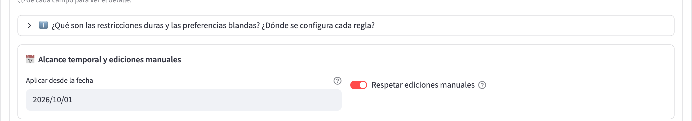

Mientras la opción esté activa, en **🚀 Correr la asignación** aparece
el panel **🔒 Asignaciones manuales protegidas (N)**, con una fila por
horario fijado: materia, comisión, día y franja, y aula. El botón
**🔓 Liberar** de cada fila baja la marca (el aula queda cargada,
pero la próxima corrida puede reasignarla).

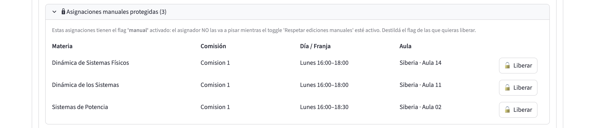

### Si un aula fijada pasa a ser incompatible

Si después de fijar un aula cambia algo que la vuelve inadmisible (el
tipo de clase, la sede admisible del grupo de materias, los
laboratorios compatibles), el asignador **no la mueve**. La situación
se detecta en dos lugares:

- La **verificación de factibilidad** («▶️ Chequear factibilidad»)
  informa un bloqueo **R9**, «Pin manual incompatible», y pide
  desmarcar el pin o elegir otra aula.
- Si corrés igual, la corrida puede terminar como **infactible**,
  porque el aula fijada no es una opción válida para ese horario.

En ambos casos, la salida es liberar la marca desde **🔒 Asignaciones
manuales protegidas** o reasignar el horario a mano con este flujo.

Además, el panel de estado muestra un aviso ⚠️ cuando hay horarios cuya
aula no es admisible según las reglas vigentes
(**Desactualizados**), con el detalle de cuáles son.

## Otras vías para liberar o mover

- **Colisiones de aula**: si hay dos horarios en la misma aula con
  franjas que se pisan, al tope de la sección **📅 Aulas asignadas por
  horario** aparece «🚨 N colisión(es) de aula». Cada colisión se
  despliega con los dos horarios involucrados y un botón **🧹 Liberar
  aula de …** por cada uno. Liberar deja el horario sin aula y baja su
  marca de manual.

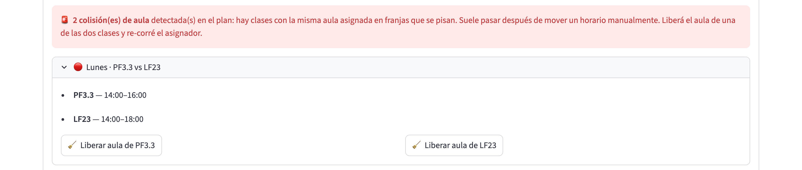

- **Mover un horario de día u hora**: botón **✏️ Editar día/hora** en el
  inspector de franja (solapa 🏛️ Aulas), o la solapa 📋 Horarios. El
  horario conserva su aula, por lo que puede generar una colisión.
  Después, resolvela con este flujo o con **🧹 Liberar aula**.

## Verificación final

- Los horarios cambiados muestran el aula esperada y, si corresponde,
  **🔒 aula manual** en el título.
- No aparece el aviso **🚨 colisión(es) de aula**.
- En **🔒 Asignaciones manuales protegidas** figuran exactamente los
  horarios que querías proteger.
- El panel de estado no muestra horarios **Desactualizados** nuevos.
- Si usás verificación de factibilidad, no aparece el bloqueo R9.

## Cómo volver atrás

No hay un botón «deshacer». Para volver al estado anterior:

- Reasigná a mano los horarios afectados con este mismo flujo, eligiendo
  sus aulas originales (en una cascada, el orden inverso).
- Si solo querés que el asignador vuelva a decidir, usá **🔓 Liberar**
  en el panel de asignaciones manuales protegidas, o **🧹 Liberar aula**
  en una colisión, y corré el asignador.
- El [historial de cambios](../modulos/08_Historial.md) registra las
  modificaciones de los horarios. Puede ayudarte a recordar qué aula
  tenía cada uno.

> **Para verificar:** qué campos del historial registran los cambios de
> aula hechos desde este diálogo.

## Puntos de dificultad típicos

- **El selector arranca en «Sin asignar» y aparece «Ver cambio
  propuesto» sin que hayas tocado nada**: el aula actual no está entre
  las opciones (suele ser inadmisible por sede o tipo). Elegí un aula
  antes de confirmar.
- **Pasé a «Todas las aulas» y la lista es más corta de lo que
  esperaba**: el filtro de tipo y de sede sigue vigente. Si el horario
  es de laboratorio solo verás los laboratorios compatibles con la
  materia; si es teórico, solo aulas teóricas y anfiteatros.
- **Confirmar está deshabilitado**: hay algún ❌ en el resumen. Leé el
  mensaje de esa tarjeta (tipo, sede o choque) y corregí la elección
  de ese horario.
- **Un aula que quiero no aparece en el bloque de un desplazado**:
  otro horario de la cascada ya la eligió en una franja solapada.
- **El asignador cambió un aula que yo había fijado**: verificá que
  **Respetar ediciones manuales** estuviera activado y que la casilla
  **🔒 Marcar como manual** estuviera tildada al confirmar (el título
  del horario debería mostrar **🔒 aula manual**).
- **Elegí un aula demasiado chica para la cantidad de inscriptos**: el
  cambio manual no compara capacidad. Revisá la capacidad que muestra
  la etiqueta del aula antes de confirmar.

## Próximo paso

- Para reflejar un cambio estructural (horarios movidos, comisiones
  nuevas, aulas dadas de baja), volvé al
  **[Flujo 3: Reasignar aulas tras cambios](03_Reasignacion_de_aulas.md)**.
- Para cerrar el plan antes del arranque del cuatrimestre, seguí con la
  **[Verificación pre-inicio](04_Verificacion_pre_inicio.md)**.
