# Materias

## ¿Para qué sirve?

La página **📚 Materias** es el catálogo maestro de asignaturas del sistema.
Es donde se cargan las materias con su código, nombre, carga horaria y
período (anual o cuatrimestral), se las asocia a los planes de estudio de
las carreras correspondientes, se define qué laboratorios son
compatibles con cada una y se las clasifica en grupos de materias (que
determinan las sedes admisibles).

Todo lo que después se ofrece en un ciclo (dictados), aparece en un
cronograma o se planifica en una comisión, arranca desde acá.

## ¿Cuándo vas a usar este módulo?

- **Setup inicial**: después de la primera carga masiva desde los Excel
  maestros, para revisar horas de teoría y laboratorio (los Excel sólo
  traen el total semanal), clasificar las materias en grupos, marcar materias virtuales del catálogo y
  asociar laboratorios compatibles.
- **Cambio de plan de estudios**: cuando una carrera incorpora una
  materia nueva o reemplaza una vieja.
- **Al abrir una carrera nueva**: darle de alta al catálogo las materias
  que la componen (si no venían del Excel maestro).
- **Cuatrimestre nuevo con materias extra**: agregar asignaturas
  optativas o especiales que este ciclo se van a dictar por primera vez.
- **Corrección de datos**: ajustar horas semanales, cupos, período o
  cambiar la marca de virtual/optativa de una materia existente.
- **Mantenimiento**: archivar o eliminar materias que ya no se dictan,
  mover una materia de año/cuatrimestre en un plan puntual.
- **Clasificación**: ubicar cada materia en su grupo de materias (por
  ejemplo, después de la carga inicial, cuando todas están en "Sin
  clasificar").

## Cómo se relaciona con el resto

- **Depende de Carreras**: una materia siempre pertenece a al menos una
  carrera, dentro de una versión de plan de estudios. Sin carreras
  cargadas no se pueden dar de alta materias nuevas.
- **Depende de Aulas y Sedes**: para asociar laboratorios compatibles a
  una materia, tienen que existir aulas de tipo laboratorio.
- **Alimenta Ciclos**: cuando un ciclo se pone en marcha, las materias
  del plan asignado se convierten en dictados (una fila por materia).
- **Alimenta Cronogramas**: las filas del cronograma referencian
  materias por su código.
- **Alimenta Planes**: las comisiones y los patrones semanales del plan
  de cursada se arman a partir de materias.
- **Alimenta el asignador de aulas**: los laboratorios compatibles, la
  marca "Virtual" y el grupo de materias (que fija las sedes
  admisibles) pesan al momento de asignar aulas.

## Recorrido rápido de la página

Arriba de todo, un panel plegable **📊 Estado de las carreras (materias
faltantes)** muestra cuántas carreras están completas y cuáles todavía
tienen materias pendientes de asignar. Está ahí porque justamente cargar
materias es lo que "completa" una carrera.

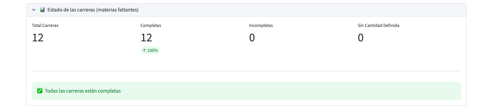

Al desplegarlo se ven cuatro cifras: **Total Carreras**, **Completas**,
**Incompletas** y **Sin Cantidad Definida** (carreras a las que todavía
no se les cargó la cantidad de materias esperada, dato que se completa
en la página 🎓 Carreras). Si hay carreras con pendientes, debajo
aparecen las advertencias con el detalle; si no, el mensaje "Todas las
carreras están completas".

Después vienen tres solapas:

- **📋 Lista de materias**: es la vista principal. Se ven todas las
  materias, de a 20 por página, y se pueden filtrar con el panel
  **🔎 Filtros**. Desde acá se entra al modo de edición o a la
  eliminación de una materia puntual.
- **➕ Nueva materia**: formulario para dar de alta una materia nueva
  desde cero, con la asignación de carreras incluida en el mismo paso.
- **📦 Grupos de materias**: administración de los grupos que definen
  las sedes admisibles de cada materia (ver "Trabajar con grupos de
  materias").

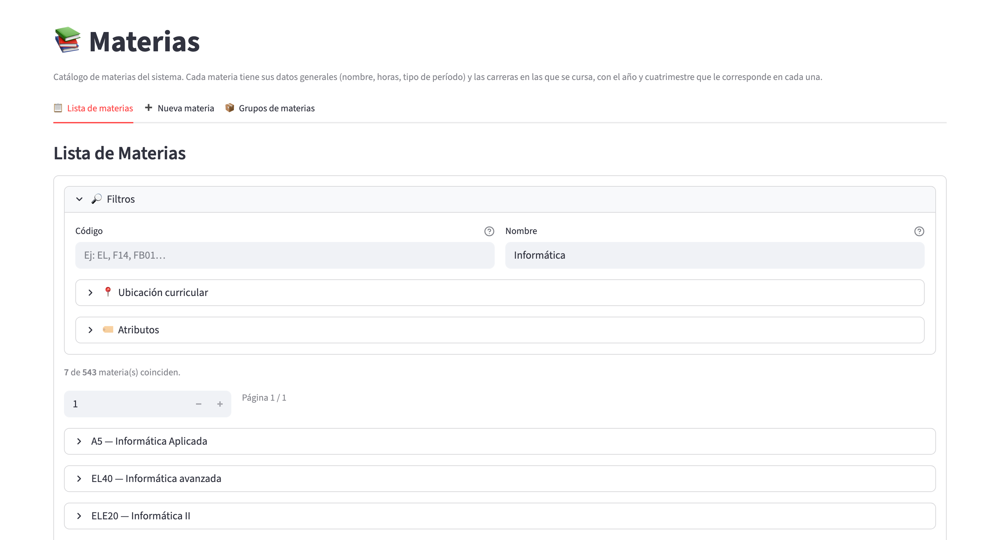

El panel **🔎 Filtros** tiene dos cuadros de búsqueda, **Código** y
**Nombre** (ignoran mayúsculas y acentos), y dos sub-paneles plegables:

- **📍 Ubicación curricular**: filtra por **Carrera(s)**, **Año(s)** y
  **Cuatri** (1C, 2C o Anual), según dónde figura la materia en el plan
  vigente de cada carrera.
- **🏷️ Atributos**: filtra por **Grupo** (incluye el atajo "Sólo Sin
  clasificar"), **Optativa**, **Virtual**, **Vigencia** (todas, sólo
  activas o sólo archivadas) y **Período**.

Debajo del panel, la leyenda "N de M materia(s) coinciden" indica
cuántas materias cumplen los filtros sobre el total, y un selector de
página permite recorrer los resultados. Cada materia es un renglón
desplegable con el formato "CÓDIGO - Nombre".

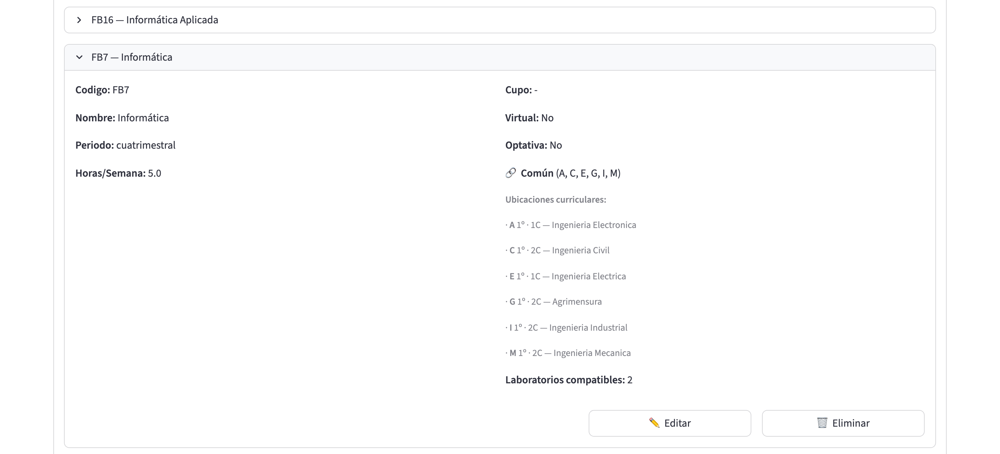

Al desplegar una materia se ven, a la izquierda, su código, nombre,
período, horas por semana y (si están cargadas) las horas de
teoría/laboratorio; a la derecha, cupo, si es virtual u optativa, una
etiqueta **🔗 Común** (figura en dos o más carreras, con la lista de
códigos de carrera) o **🎯 Específica** (figura en una sola), las
**ubicaciones curriculares** (carrera, año y cuatrimestre) y la cantidad
de laboratorios compatibles, si tiene. Abajo a la derecha están los
botones **✏️ Editar** y **🗑️ Eliminar**.

> **Para verificar:** el detalle de la materia no muestra el grupo de
> materias ni si está archivada; esos datos se ven desde el editor, la
> solapa de grupos o el filtro de Vigencia.

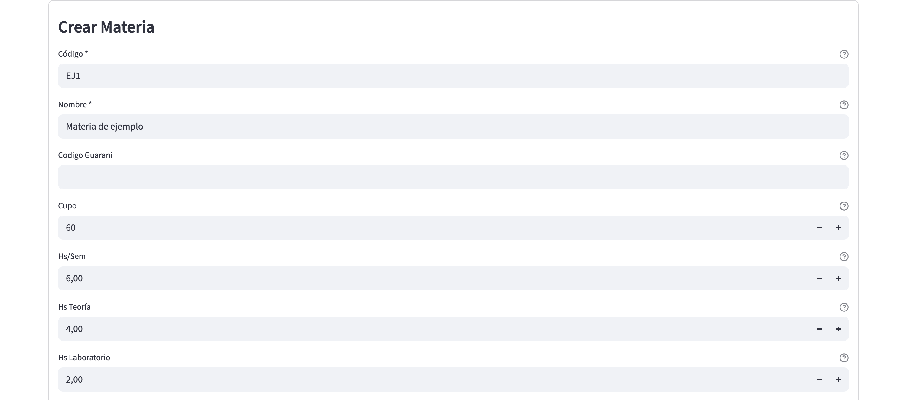

## Tareas comunes

### Cargar una materia nueva

1. Abrí la solapa **➕ Nueva materia**.
2. En el formulario **Crear Materia** completá los datos básicos (los
   campos con asterisco son obligatorios):
   - **Código\***: identificador único de la materia. No puede repetirse
     con otra materia existente y no se puede cambiar después.
   - **Nombre\***: nombre completo de la materia como se muestra en la
     documentación académica.
   - **Codigo Guarani**: opcional. Código de la materia en el sistema
     Guaraní (SIU), sólo si es distinto del código del plan.
   - **Cupo**: opcional. Cantidad máxima de alumnos por comisión.
   - **Hs/Sem**: cantidad total de horas semanales de la materia.
   - **Hs Teoría** y **Hs Laboratorio**: desglose de las horas
     semanales. Cuando **Hs/Sem** está cargado, la suma de Teoría +
     Laboratorio tiene que dar igual a Hs/Sem; si no, el sistema no deja
     crear la materia (ver "Errores frecuentes").
   - **Período**: elegí "cuatrimestral" o "anual". Si es anual, en la
     asignación de carreras el cuatrimestre queda fijo en "Anual".
   - **Active**: viene tildada. Destildarla equivale a archivar la
     materia (deja de aparecer en filtros y reportes activos); al dar
     de alta se deja tildada.
   - **Virtual**: marcalo si la materia es siempre virtual por
     definición (no se dicta presencialmente en ningún ciclo).
   - **Optativa**: marcalo si es una materia electiva (no obligatoria
     dentro del plan).
   - **Dicta Recursado**: casilla de la excepción de recursado de la
     materia (ver "Marcar una materia como recursado excepcional").
     En el editor esta excepción se maneja con un selector de tres
     opciones, más claro que esta casilla.
   - **Grupo de materias**: viene en "⚠️ Sin clasificar". Se puede
     elegir otro grupo ahora o reasignarla después desde la solapa
     **📦 Grupos de materias**.
3. Bajá a la sección **Asignación de Carreras** y agregá al menos una
   fila a la tabla editable. Es obligatorio: una materia sin ninguna
   carrera asociada no se puede crear.
   - Por cada fila elegí la **Carrera**, el **Año** (1 a 6), el
     **Cuatrimestre** (1C o 2C, o "Anual" si la materia es anual) y el
     **Plan** (la versión del plan de estudios; por defecto viene el
     plan más reciente).
   - Podés asociar la misma materia a varias carreras en un solo paso
     agregando más filas.

   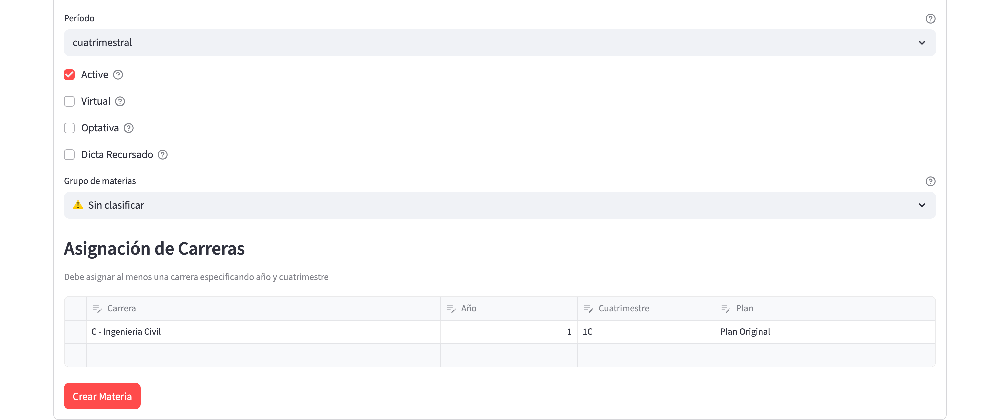

   En la captura se ven el período, las casillas **Active**,
   **Virtual**, **Optativa** y **Dicta Recursado**, el **Grupo de
   materias** y la tabla **Asignación de Carreras** con una fila
   cargada; debajo está el botón **Crear Materia**.

4. Apretá **Crear Materia**.
5. Verificación: aparece el mensaje "✅ Materia creada exitosamente" y la
   materia figura en la solapa **📋 Lista de materias** con las carreras
   que le asociaste. El panel de estado de las carreras de arriba también
   refleja el cambio para las carreras afectadas.

> **Para verificar:** en el alta, la casilla **Dicta Recursado** sólo
> tiene dos estados (marcada / sin marcar); no está confirmado si "sin
> marcar" se guarda como "Según Carrera" o como "No (forzar)". Para
> asegurarse, después del alta revisá el selector **Recursado** en el
> editor.

> **Para verificar:** el formulario de alta ofrece como **Plan** los
> nombres de todas las versiones de plan existentes, no sólo las de la
> carrera elegida. Si se combina una carrera con un plan que no le
> corresponde, no está confirmado qué mensaje muestra el sistema.

Si se aprieta **Crear Materia** sin ninguna fila en la tabla, el
sistema muestra el error debajo del botón:

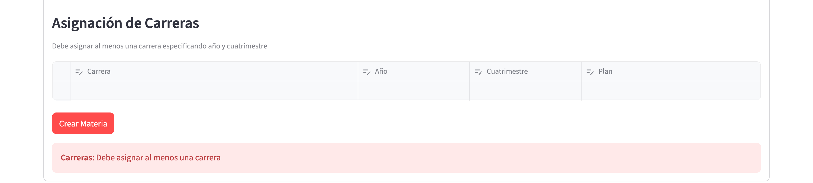

### Editar una materia existente

1. En la solapa **📋 Lista de materias**, filtrá por código o nombre si
   hace falta.
2. Desplegá la materia que querés editar y apretá **✏️ Editar**.
3. La lista es reemplazada por el editor "Editar Materia: CÓDIGO", con
   tres sub-solapas: **Datos Basicos**, **Carreras** y **Laboratorios**.

   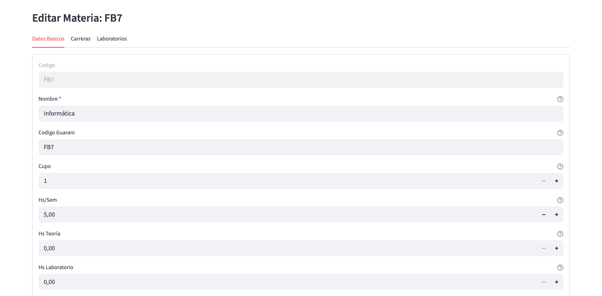

4. En **Datos Basicos** modificá los campos que necesites (Nombre,
   Codigo Guarani, Cupo, horas, Período, **Active**, **Virtual**,
   **Optativa**, **Recursado** y **Grupo de materias**). El código no
   se puede cambiar (queda deshabilitado). Guardá con **Guardar**;
   **Cancelar** descarta los cambios y vuelve a la lista.
5. Verificación: aparece "Materia actualizada" y se vuelve a la lista,
   donde los cambios aparecen reflejados al desplegar la materia. Con
   **Volver a la lista** (al pie del editor) también se sale sin
   guardar.

**Ojo**: editar una materia afecta a **todas las carreras** que la
comparten. Si querés cambiar sólo el año o cuatrimestre en una carrera
puntual, hacelo desde la sub-solapa **Carreras** (ver más abajo).

### Asociar una materia a otra carrera

1. Entrá en modo edición de la materia (ver "Editar una materia
   existente").
2. Andá a la sub-solapa **Carreras**.
3. En la sección **Asociar Nueva Carrera** elegí la carrera, el
   año y el cuatrimestre. El selector sólo ofrece las carreras a las que
   la materia todavía no está asociada. La versión de plan que se usa es
   la más reciente de esa carrera.

   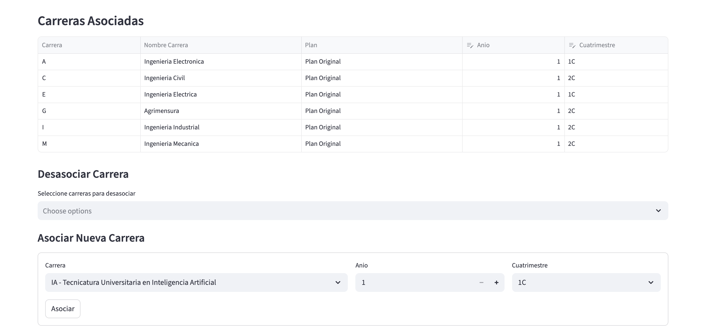

   En la captura, arriba está la tabla **Carreras Asociadas** (carrera,
   nombre, plan, año y cuatrimestre), en el medio la sección
   **Desasociar Carrera** y abajo el formulario para asociar una carrera
   nueva con su botón **Asociar**.

4. Apretá **Asociar**. La nueva asociación aparece en la tabla de arriba.
5. Verificación: aparece "Carrera X asociada" y, al volver a la lista,
   la carrera nueva figura entre las ubicaciones curriculares de la
   materia.

### Cambiar el año o cuatrimestre en una carrera puntual

1. Entrá en modo edición de la materia y andá a la sub-solapa
   **Carreras**.
2. En la tabla **Carreras Asociadas**, modificá directamente el **Anio**
   o el **Cuatrimestre** en la fila correspondiente (el resto de las
   columnas es de sólo lectura).
3. Al detectar cambios aparece el botón **Guardar Cambios**; apretalo.
4. Verificación: aparece "Cambios guardados" y la tabla se refresca con
   el nuevo año/cuatrimestre.

**Nota**: si la materia es anual, el cuatrimestre queda bloqueado
en "Anual" y no se puede editar.

### Desasociar una materia de una carrera

1. Entrá en modo edición y andá a la sub-solapa **Carreras**.
2. En la sección **Desasociar Carrera**, el selector "Seleccione
   carreras para desasociar" permite elegir una o varias asociaciones
   (se muestran como "código - nombre (plan)").
3. Apretá **Desasociar Seleccionadas**. No hay pantalla de confirmación:
   la acción se aplica de inmediato.
4. Verificación: aparece "N carrera(s) desasociada(s)" y la asociación
   desaparece de la tabla de arriba.

**Precaución**: si esa asociación estaba siendo referenciada por
dictados, cronogramas o comisiones activas de un ciclo en curso,
desasociarla puede dejar información inconsistente. Antes de
desasociar, verificá que no haya un plan de cursada activo que dependa
de esa combinación materia-carrera.

### Marcar una materia como virtual del catálogo

Existen tres niveles de "materia virtual" en el sistema, y es importante
entender la diferencia:

- **Virtual de catálogo** (`Virtual` en esta página): la materia es
  virtual siempre, por definición. Ejemplo: una materia que se dicta
  100% por Zoom en todas las carreras y todos los ciclos.
- **Virtual del ciclo** (se marca en la página de Ciclos → Dictados):
  la materia es virtual solamente para este ciclo puntual. Ejemplo: se
  vuelve virtual excepcionalmente por un cuatrimestre.
- **Virtual del horario**: aún más granular, se aplica a un patrón
  semanal específico dentro de una comisión.

El sistema aplica el orden jerárquico: **manda el nivel más específico**
(horario, luego dictado, luego materia). Si en ese nivel la materia
queda como virtual, el asignador de aulas no le pide aula; si el nivel
más específico dice "heredar", se consulta el siguiente.

**Pasos para marcar virtual de catálogo**:

1. Entrá en modo edición de la materia (**Datos Basicos**).
2. Tildá la casilla **Virtual**.

   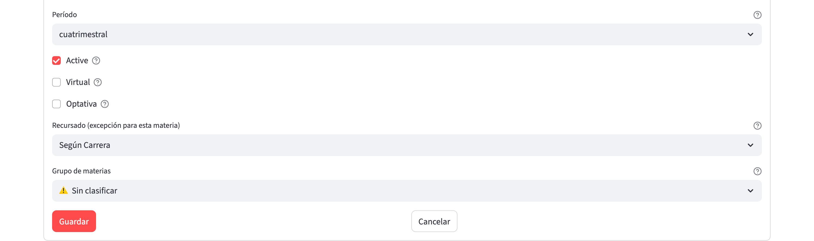

3. Guardá los cambios.
4. Verificación: en la lista, al desplegar la materia, el dato
   "Virtual" muestra "Si". En cualquier ciclo futuro, esa materia va a
   arrancar como virtual por defecto.

### Marcar una materia como recursado excepcional

Por default, cada carrera define si dicta o no en el cuatrimestre
opuesto las materias que ya se dictaron (marca "Dicta recursado" en la
carrera). A veces hace falta una excepción para una materia puntual.

1. Entrá en modo edición → **Datos Basicos**.
2. En el selector **"Recursado (excepción para esta materia)"** elegí:
   - **Según Carrera**: lo default. La materia sigue la regla de la
     carrera.
   - **Sí (forzar)**: esta materia siempre se dicta como recursado, sin
     importar la carrera.
   - **No (forzar)**: esta materia nunca se dicta como recursado, sin
     importar la carrera.

   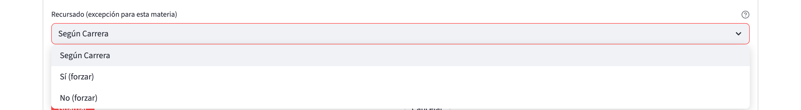

3. Guardá.
4. Verificación: la próxima vez que crees dictados en un ciclo, esa
   materia aparece (o no) según lo que forzaste.

**Nota**: este override no se muestra en la vista de lista. Hay que
entrar a Editar la materia para verlo.

### Cargar laboratorios compatibles con una materia

1. Entrá en modo edición → sub-solapa **Laboratorios**.
2. Vas a ver la sección **Laboratorios compatibles** con un selector
   múltiple que lista todas las aulas de tipo laboratorio cargadas en el
   sistema.

   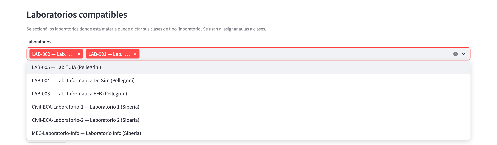

   Los laboratorios ya asociados aparecen como etiquetas dentro del
   selector; al abrirlo se listan los demás laboratorios disponibles,
   con su código, nombre y sede, por ejemplo "LAB-005 - Lab TUIA
   (Pellegrini)".

3. Elegí los laboratorios que son compatibles con esta materia (y
   sacá con la "x" los que ya no lo son).
4. El sistema te muestra cuántos vas a agregar y cuántos vas a sacar
   respecto del estado actual ("N para agregar, M para quitar").
5. Apretá **Guardar** (el botón aparece sólo cuando hay cambios).
6. Verificación: aparece el aviso "Laboratorios actualizados: N
   agregados, M quitados." y, al volver a la lista, el detalle de la
   materia muestra "Laboratorios compatibles" con la cantidad
   actualizada (el dato no se muestra si la materia no tiene ninguno).

**Si no hay laboratorios cargados** el sistema te avisa con un mensaje
y no te deja seleccionar nada. Andá a la página **🏛️ Aulas** y creá al
menos un aula con tipo "laboratorio" antes de volver.

**Uso**: esta lista es la que el asignador de aulas consulta cuando
tiene que asignarle aula a un patrón semanal cuyo tipo de clase es
"laboratorio".

### Archivar una materia

Si una materia dejó de dictarse pero querés conservar su historial,
conviene **archivarla** en lugar de eliminarla:

1. Entrá en modo edición → **Datos Basicos**.
2. Destildá la casilla **Active** y guardá. (También se puede archivar
   desde el diálogo de eliminación, con el botón **📦 Archivar en su
   lugar**.)
3. Verificación: la materia deja de aparecer en filtros y reportes
   activos; en la lista se la encuentra con el filtro **Vigencia** →
   "Sólo archivadas". Para reactivarla, volvé a tildar **Active**.

### Eliminar una materia

1. En la solapa **📋 Lista de materias**, desplegá la materia y apretá
   **🗑️ Eliminar**.
2. Se abre una ventana emergente "Eliminar materia" que resume el
   impacto del borrado.
3. Apretá **🗑️ Confirmar eliminación** para borrar, o **Cancelar** para
   volver.

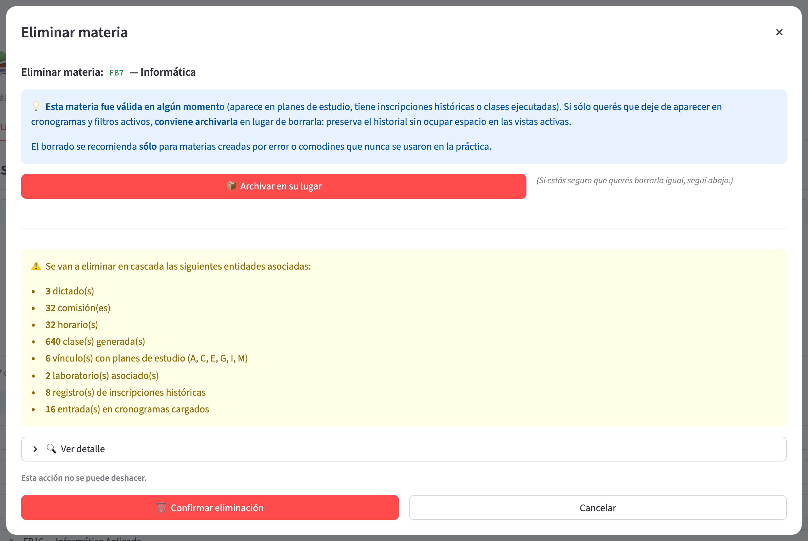

La ventana funciona así:

- Si la materia está activa y "fue válida en algún momento" (figura en
  planes de estudio, tiene inscripciones históricas o clases ejecutadas),
  arriba sugiere **archivarla** y ofrece el botón **📦 Archivar en su
  lugar**. El borrado se recomienda sólo para materias creadas por error
  o comodines que nunca se usaron.
- Un cuadro amarillo lista **todo lo que se va a eliminar en cascada**:
  dictados, comisiones, horarios, clases generadas (indicando cuántas ya
  se ejecutaron), vínculos con planes de estudio, laboratorios asociados,
  correlativas, inscripciones históricas, configuraciones de proyección y
  entradas de cronogramas cargados. El desplegable **🔍 Ver detalle**
  enumera los dictados y comisiones afectados.
- Si hay clases ya ejecutadas, un aviso en rojo advierte que su
  historial también se borra.
- Al pie se lee "Esta acción no se puede deshacer."

**Advertencia crítica**: el borrado es **en cascada**. Si la materia está
en planes de estudio, dictados, comisiones o cronogramas, todo eso se
elimina junto con ella, sin posibilidad de recuperarlo. Antes de
confirmar, leé con atención la lista del cuadro amarillo y, si lo que
querés es que la materia simplemente deje de usarse, archivala.

### Trabajar con grupos de materias

Un **grupo de materias** reúne materias que comparten el mismo criterio
de sedes admisibles; cada materia pertenece a exactamente un grupo. Las
materias sin clasificar están en el grupo **⚠️ Sin clasificar**, que no
se puede renombrar ni borrar. Si quedan materias en él, la solapa
**📦 Grupos de materias** muestra una advertencia con la cantidad.

En la solapa se elige el **Grupo activo** en un selector (que indica
cuántas materias tiene cada grupo) y con **➕ Nuevo** se crea uno
(nombre, descripción opcional y sedes). El editor del grupo seleccionado
tiene:

- **Nombre** y **Descripción** (texto libre que documenta el criterio).
- **Asociaciones y chequeos**: las **Carreras asociadas** y tres
  interruptores (pertenencia a las asociadas, exclusividad frente a no
  asociadas y completitud) que definen qué inconsistencias detecta el
  verificación.
- **Sedes admisibles (modo DURO)**: las sedes en las que se admiten
  aulas cuando el asignador corre el grupo en modo duro.
- **Sedes preferidas (modo BLANDO)**: lista ordenada (↑ / ↓ / ✕); la
  primera es la preferida y las siguientes son alternativas.
- Botones **💾 Guardar cambios**, **↺ Descartar** y **🗑️ Borrar** (este
  último deshabilitado si el grupo tiene materias).
- **🔍 Chequear consistencia**: compara las materias del grupo con los
  planes vigentes de las carreras asociadas y lista las **faltantes**
  (botón ➕ para agregarlas) y las **ajenas** (botón ➡️ para moverlas al
  grupo sugerido).

Más abajo, el bloque **Reasignar materias** permite filtrar materias
(mismos filtros que la lista, más laboratorio) y moverlas a otro grupo,
todas juntas con **🚀 Reasignar N materia(s)** (pide una segunda
confirmación) o de a una con **🔀 Reasignar**.

> **Para verificar:** cómo elige el asignador entre modo duro y blando
> para cada grupo se configura en el panel del asignador (página
> Cursada), que documenta otro capítulo del manual.

## Errores frecuentes y qué hacer

| Mensaje | ¿Qué significa? | Cómo lo resolvés |
|---|---|---|
| "Carreras: Debe asignar al menos una carrera" | Al crear una materia dejaste vacía la tabla de asignación de carreras | Agregá al menos una fila con carrera + año + cuatrimestre + plan antes de crear |
| "Hs Teoría (X) + Hs Lab (Y) = Z ≠ Hs/Sem (W). Corregí antes de guardar." | El desglose de horas de teoría + laboratorio no coincide con el total (también salta si Hs/Sem está cargado y teoría y laboratorio están en 0) | Ajustá los tres campos para que la suma cuadre |
| "No se encontro plan de estudios para la carrera 'X'" | Al asociar desde la sub-solapa Carreras, la carrera elegida no tiene una versión de plan creada | Andá a Carreras → solapa Plan de estudio y creá una versión del plan antes de volver |
| "No hay carreras disponibles. Cree una carrera primero." | El catálogo de carreras está vacío | Andá a la página Carreras y creá al menos una |
| "Todas las carreras ya estan asociadas a esta materia." | La materia ya figura en todas las carreras cargadas | No hace falta hacer nada; para cambiar año o cuatrimestre usá la tabla de arriba |
| "No hay aulas de tipo 'laboratorio' cargadas en la base de datos." | Querés asociar laboratorios pero no hay aulas de tipo laboratorio | Andá a Aulas → Crear, con tipo "laboratorio" |
| "Materia 'X' no encontrada" | La materia que estabas editando ya no existe (por ejemplo, la borró otra sesión) | Volvé a la lista y refrescá |
| "La materia 'X' ya no existe." | Lo mismo, pero detectado al abrir el diálogo de eliminación | Cerrá la ventana y refrescá la lista |
| "No se pudo actualizar" | El guardado no se completó | Reintentá; si persiste, avisale al equipo técnico |
| "Ninguna materia coincide con los filtros." | Los filtros aplicados no dejan ninguna materia | Limpiá o relajá los filtros |

## Preguntas frecuentes

**¿Puedo tener dos materias con el mismo código?**
No. El código es único a nivel sistema. Si intentás crear una con un
código existente, el alta falla.

**¿Puedo tener dos materias con el mismo nombre?**
Sí. El sistema no valida duplicidad de nombres, solamente del código.
En la práctica conviene evitarlo para no confundir al equipo.

**¿Qué pasa si borro una materia que ya está en un plan activo?**
Se borra junto con todo lo que depende de ella (dictados, comisiones,
horarios, clases, vínculos con planes de estudio, etc.). La ventana de
confirmación lista esas dependencias antes de borrar, pero una vez
confirmado no se puede deshacer. Si sólo querés que deje de usarse,
archivala.

**¿Dónde veo el histórico de cambios de esta materia?**
En la página **📜 Historial**. Se auditan altas y bajas, y cambios en
las marcas Active (archivada), Virtual y Optativa, en el Recursado
(excepción) y en las horas de teoría y laboratorio. Otros campos (nombre, cupo, horas semanales) no
quedan registrados en el histórico.

**¿La misma materia puede aparecer en dos carreras con distinto año o
cuatrimestre?**
Sí, y es lo esperado. Una materia común (por ejemplo, "Análisis
Matemático I") puede estar en el primer año de una carrera y en el
segundo de otra. Se maneja desde la sub-solapa Carreras del editor.

**¿Qué diferencia hay entre "materia común" y "materia exclusiva"?**
Es una distinción implícita: una materia se considera común si aparece
en dos o más carreras distintas. No hay una casilla para marcarla, se
calcula automáticamente y la lista la muestra con las etiquetas
"🔗 Común" y "🎯 Específica". Las sedes admisibles de cada materia, en
cambio, las define su grupo de materias.

**¿Puedo poner una materia como optativa y obligatoria en distintas
carreras?**
Hoy la marca "Optativa" es a nivel del catálogo maestro (afecta a todas
las carreras que la comparten). No se puede tener "optativa en la
carrera A y obligatoria en la carrera B" desde esta página.

**¿Qué pasa si cambio las horas semanales de una materia que ya está
dictándose?**
La materia queda con las horas nuevas. Los cronogramas ya cargados no
se ajustan automáticamente. Si el cambio afecta el patrón semanal
esperado, tenés que revisar los cronogramas del ciclo en curso.

**¿Puedo darle "cupo" a una materia y que el sistema lo respete?**
El cupo se usa como referencia para el forecast y para las validaciones
de cobertura, pero no bloquea nada de por sí. Los cupos "duros" se
manejan a nivel de comisión, no de materia.

**¿Puedo dejar el cupo o las horas vacías?**
Sí. El cupo, las horas de teoría y las de laboratorio son opcionales
(quedan en "-" en la lista). La verificación "Hs Teoría + Hs Lab = Hs/Sem"
aplica cuando **Hs/Sem** está cargado; en ese caso la suma de teoría y
laboratorio tiene que coincidir, y dejar ambas en 0 no alcanza.

**¿Qué pasó con la búsqueda por código o nombre?**
Está integrada en el panel **🔎 Filtros** de la solapa Lista de materias
(cuadros Código y Nombre), junto con los filtros por ubicación curricular
y atributos.

## Términos importantes de este módulo

- **Materia (o asignatura)**: entrada del catálogo maestro con código,
  nombre, horas semanales, período y marcas. La misma materia puede
  aparecer en múltiples carreras.
- **Período**: si la materia es "cuatrimestral" (dura un semestre) o
  "anual" (dura todo el año).
- **Materia común**: aquella que aparece en dos o más carreras
  distintas. Se calcula automáticamente.
- **Materia exclusiva**: aquella que aparece en una sola carrera.
- **Materia optativa (electiva)**: no es obligatoria para completar
  la carrera. Afecta el conteo de completitud y algunas validaciones.
- **Materia virtual de catálogo**: se dicta virtualmente en todo momento
  y en todas las carreras. El asignador no le pide aula.
- **Recursado**: dictado de una materia en el cuatrimestre opuesto al
  que le tocaría según el plan, para permitir a los alumnos recuperarla.
  La carrera define si dicta recursado; la materia puede forzar una
  excepción.
- **Laboratorio compatible**: aula de tipo "laboratorio" en la que se
  puede dictar la parte práctica de esta materia. El asignador solo
  considera estas aulas para las clases de tipo laboratorio.
- **Grupo de materias**: conjunto de materias que comparten sedes
  admisibles. Toda materia pertenece a uno; el grupo inicial es "Sin
  clasificar".
- **Archivada**: materia con la casilla Active destildada; se conserva
  su historial pero deja de aparecer en filtros y reportes activos.
- **Versión de plan de estudios**: agrupación de asociaciones
  materia-carrera con un nombre y una fecha. Una carrera puede tener
  varias versiones históricas de su plan; la vigente es la más reciente.
- **Asignación materia-carrera**: entrada que dice "esta materia está en
  el plan X de la carrera Y, en tal año y tal cuatrimestre". Es lo que
  se ve en la tabla de la sub-solapa "Carreras" del editor.
