# Aulas y Sedes

## ¿Para qué sirve?

La página **🏛️ Aulas y Sedes** es el catálogo de recursos físicos del
sistema. Es donde se dan de alta las aulas (con su capacidad, tipo y
sede) y las sedes de la facultad. Las aulas son lo que el asignador
distribuye entre los patrones semanales de cada plan de cursada, así
que su catálogo condiciona directamente qué asignaciones son posibles.

## ¿Cuándo vas a usar este módulo?

- **Setup inicial**: después de la carga masiva, para completar aulas
  fuera de la sede por defecto, y crear sedes adicionales (Zeballos,
  Beltrán, Siberia, etc.).
- **Alta de una sede nueva**: cuando la facultad habilita un edificio
  o anexo que antes no se usaba.
- **Alta de un aula nueva**: cuando se acondiciona un espacio nuevo o
  se reasigna un aula existente.
- **Baja o remodelación**: cuando un aula deja de estar disponible
  temporalmente o para siempre.
- **Cambio de capacidad**: cuando se reacondiciona un aula y cambia el
  cupo (por ejemplo, se le sacan bancos).
- **Reconfiguración de laboratorios**: cambiar el tipo de un aula
  general a laboratorio o viceversa.
- **Consolidación**: fusionar dos sedes cuando alguien creó una con el
  nombre mal escrito y hay que unificar.
- **Antes de correr el asignador de aulas por primera vez**: revisar
  que las sedes existan y que las sedes admisibles de cada grupo de
  materias (Materias → 📦 Grupos de materias) estén bien configuradas.

## Cómo se relaciona con el resto

- **Depende del catálogo de sedes**: no se puede crear un aula si no
  existe al menos una sede. La carga inicial crea la sede "Pellegrini"
  por default, pero otras sedes hay que crearlas a mano.
- **Alimenta Materias**: las aulas de tipo laboratorio son las que se
  pueden asociar como "laboratorios compatibles" de una materia.
- **Alimenta Grupos de materias**: las sedes admisibles de cada grupo
  (modo DURO o BLANDO) se eligen entre las sedes que se dan de alta acá.
- **Alimenta el asignador de aulas**: las aulas son el recurso que el
  asignador distribuye. Su capacidad, tipo y sede determinan qué
  asignaciones son factibles.
- **Depende de Planes**: para borrar un aula, no puede tener clases
  asignadas en ningún plan activo.

## Recorrido rápido de la página

Cuatro solapas:

- **📋 Listado**: vista tabular de todas las aulas, con filtro por
  sede. Es solo lectura.
- **➕ Crear**: formulario para dar de alta un aula nueva.
- **👁️ Ver detalle**: seleccionás un aula y accedés a la edición
  inline, más la opción de borrarla y (si es laboratorio) la
  asociación con materias.
- **📍 Sedes**: catálogo de sedes de la facultad, con opciones para
  crear, renombrar, borrar y fusionar sedes.

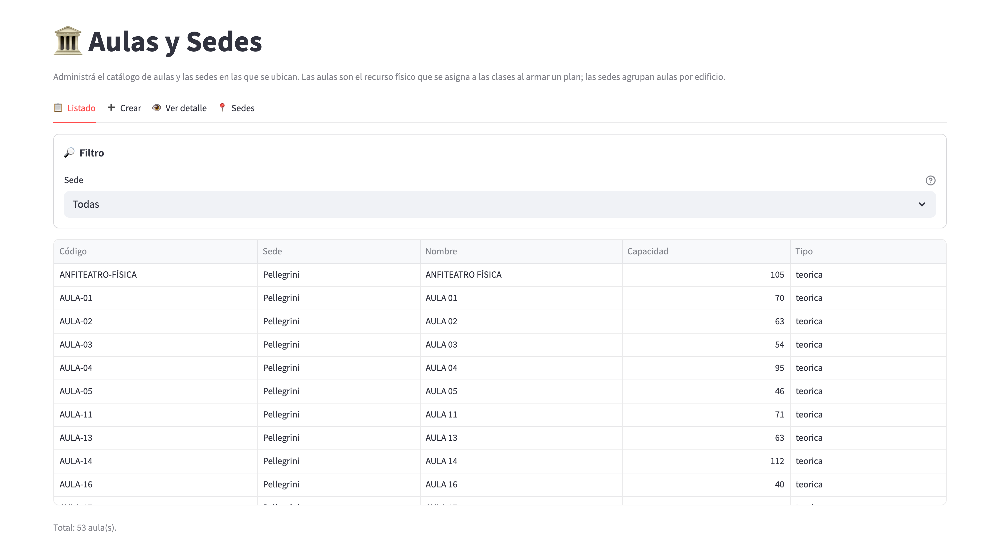

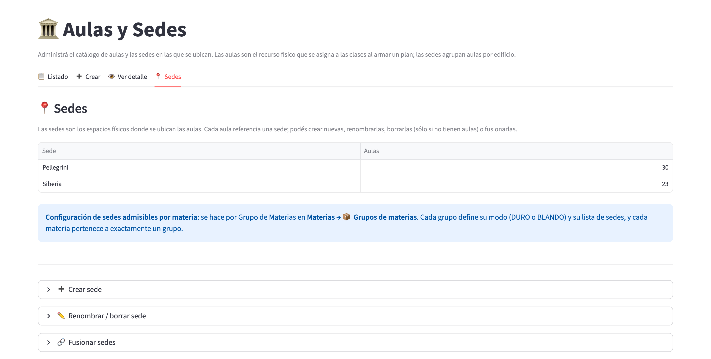

En la solapa de sedes, la tabla muestra cada sede con su cantidad de
aulas. Debajo hay un aviso que remite a **Materias → 📦 Grupos de
materias**, que es donde se configuran las sedes admisibles de cada
materia, y después los desplegables para crear, renombrar o borrar y
fusionar sedes.

## Tareas comunes

### Crear una sede

1. Andá a la solapa **📍 Sedes**.
2. Desplegá el expander **"➕ Crear sede"**.
3. Escribí un **Nombre** único para la sede (por ejemplo, "Zeballos" o
   "Siberia"). El nombre no puede repetirse con otra sede existente.

   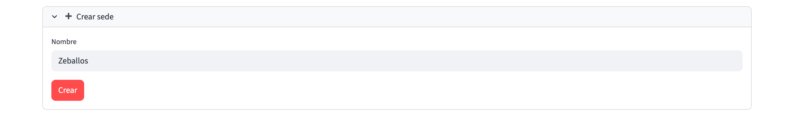

4. Apretá **Crear** (el botón está deshabilitado mientras el nombre
   esté vacío).
5. Verificación: la sede aparece en la tabla superior de la solapa con
   conteo de aulas en cero.

**Cuándo**: hacelo antes de dar de alta las aulas de esa sede. Si
intentás crear un aula sin haber creado la sede, el sistema te lo va
a avisar.

### Renombrar una sede

1. En la solapa **📍 Sedes**, desplegá el expander **"✏️ Renombrar /
   borrar sede"**.
2. Elegí la sede en el selector **Sede**.
3. Escribí el nombre nuevo en **Nuevo nombre**.
4. Apretá **Renombrar** (queda deshabilitado mientras el nombre no
   cambie).

   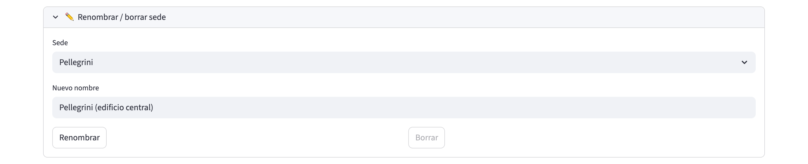

5. Verificación: la tabla de sedes muestra el nombre nuevo. Todas las
   aulas asociadas siguen apuntando a la misma sede (con nombre
   actualizado).

Si el nombre nuevo ya lo usa otra sede, el sistema muestra un error
debajo de los botones:

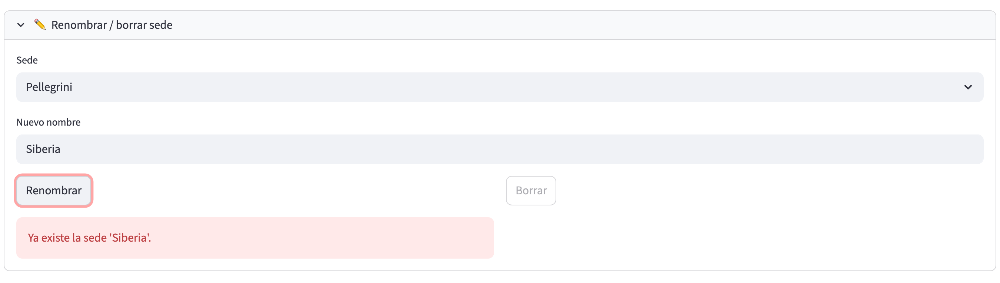

**Ojo con el código autogenerado**: si algún aula tiene el nombre viejo
de la sede embebido en su código (porque se creó dejando el campo
Código vacío y se autogeneró), ese código se queda con el nombre viejo
pegado. Renombrar la sede no reescribe los códigos autogenerados de sus
aulas: hay que editarlas una por una si molesta.

### Borrar una sede

1. Desplegá el expander **"✏️ Renombrar / borrar sede"** y elegí la
   sede.
2. Apretá **Borrar**. No pide confirmación adicional: la sede se borra
   en el acto.
3. Verificación: la sede desaparece de la tabla.

**Restricción importante**: no se puede borrar una sede que tenga aulas
asociadas. El botón queda deshabilitado y, al pasar el cursor, muestra el motivo
("No se puede borrar: tiene N aula(s) asociada(s)."). Si
necesitás borrarla igual, la forma correcta es **fusionarla** con otra
sede (ver más abajo), que reasigna las aulas al destino y borra la
origen.

### Definir en qué sedes puede ir cada materia

Las sedes admisibles de cada materia se definen por **grupo de materias**, en **Materias → 📦
Grupos de materias**: cada grupo tiene su modo (DURO o BLANDO) y su lista
de sedes, y cada materia pertenece a exactamente un grupo. Lo único que
tenés que hacer en esta página es que las sedes existan antes de armar esas listas.

### Configurar el horario de una sede

Por defecto todas las sedes usan el horario general. Si una sede abre
más tarde o cierra más temprano, se le puede cargar un horario propio.

1. En la solapa **📍 Sedes**, abrí **"🕒 Horario de la sede"**.
2. Elegí la sede, tildá **Horario propio** y cargá la **Apertura** y el
   **Cierre**.
3. Apretá **Guardar horario**. La apertura tiene que ser anterior al
   cierre.
4. Verificación: en la tabla de sedes, la columna **Horario** muestra
   la franja cargada ("General" si usa el horario general).

Con horario propio, el asignador no pone en las aulas de esa sede
ningún horario que empiece antes de la apertura o termine después del
cierre, y esas aulas tampoco se ofrecen al cambiar un aula a mano para
esos horarios. Para volver al horario general, destildá **Horario
propio** y guardá.

### Fusionar dos sedes

Sirve para consolidar cuando alguien creó una sede con el nombre mal
escrito ("Pelegrini" vs "Pellegrini") y hay que unificar.

1. En la solapa **📍 Sedes**, desplegá el expander **"🔗 Fusionar
   sedes"**.
2. Elegí la **Sede origen (se borra)** y la **Sede destino (recibe las
   aulas)**; cada opción muestra entre paréntesis cuántas aulas tiene.

   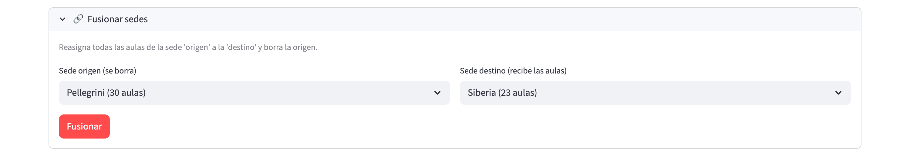

3. Apretá **Fusionar**. El sistema informa cuántas aulas se reasignaron.
4. Verificación: todas las aulas de la sede origen ahora aparecen bajo
   la sede destino. La sede origen desaparece de la tabla.

**Precauciones**:

- Necesitás al menos dos sedes creadas.
- La operación no se puede deshacer. Verificá bien cuál es cuál antes
  de confirmar.
- Los códigos autogenerados de las aulas reasignadas siguen pegados al
  nombre viejo (ver "Renombrar una sede").

### Crear un aula nueva

1. Andá a la solapa **➕ Crear**.
2. Completá los campos:
   - **Nombre del aula** (obligatorio): por ejemplo, "AULA 101" o
     "Laboratorio 3".
   - **Sede** (obligatorio): elegí la sede a la que pertenece. Si no
     hay sedes, primero creá una desde la solapa 📍 Sedes.
   - **Código para mostrar** (opcional): identificador visible del aula. Si lo
     dejás vacío, se autogenera como
     `{nombre de la sede}-{nombre del aula}` con guiones en lugar de
     espacios. Ejemplo: sede "Pellegrini" + aula "AULA 01" da como
     código `Pellegrini-AULA-01`. Un placeholder te muestra en tiempo
     real cómo va a quedar.
   - **Capacidad (cantidad de alumnos)**: mínimo 1, valor inicial 30. Cantidad máxima de personas
     que entran en el aula.
   - **Tipo de aula**: elegí entre teorica, practica, laboratorio o anfiteatro.
     El valor inicial es teorica. Este campo condiciona qué materias
     pueden usar el aula (por ejemplo, las clases de tipo laboratorio
     solo van a aulas laboratorio).
   - **Descripción** (opcional): notas libres sobre el aula.

   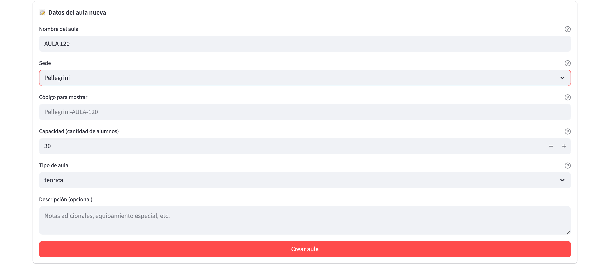

   En la captura, el campo **Código para mostrar** quedó vacío y
   muestra en gris el código que se va a autogenerar.

3. Apretá **Crear aula** (hasta que no completes nombre y sede, la
   página muestra "Completá nombre y sede para poder crear el aula.").
4. Verificación: el aula aparece en el listado (solapa 📋 Listado) con
   los datos que le cargaste.

**Gotcha**: el código del aula tiene que ser único a nivel sistema, no
solo dentro de la sede. Si el autogenerado choca con uno existente,
vas a ver el aviso "Ya existe un aula con código '{codigo}'. Cambiá el
nombre o el código y volvé a intentar.", en cuyo caso cambiá el nombre
o escribí un código manualmente.

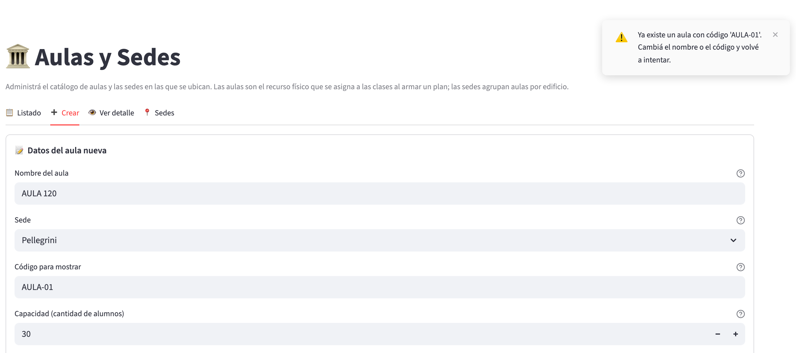

El aviso es un mensaje flotante que aparece arriba a la derecha de la
pantalla y se cierra solo al cabo de unos segundos. Cuando el alta sale
bien, otro mensaje flotante confirma "Aula '{codigo}' creada." y el
formulario se limpia (la sede y el tipo quedan elegidos, para cargar
varias aulas seguidas).

### Editar un aula existente

1. Andá a la solapa **👁️ Ver detalle**.
2. En el selector, elegí el aula que querés editar (formato: `código - nombre (sede)`).
3. Modificá los campos que necesites: Nombre, Sede, Código para mostrar,
   Capacidad (cantidad de alumnos), Tipo de aula o Descripción.
4. Apretá **Guardar cambios**.

   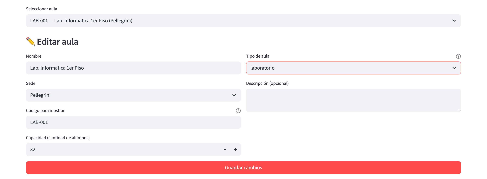

   El botón **Guardar cambios** aparece recién cuando se modificó algún
   campo; en la captura se cambió la capacidad.

5. Verificación: el aula se refresca con los nuevos datos.

Si no hiciste ningún cambio, el sistema muestra "Sin cambios." y no
aparece el botón de guardar. Al guardar, un mensaje flotante confirma
"Aula '{codigo}' actualizada."; si el código nuevo lo usa otra aula, se
muestra "Ya existe otra aula con código '{codigo}'.".

**Cambio de sede**: si cambiás la sede de un aula, se mueve al nuevo
edificio en el sistema. Los códigos autogenerados no se actualizan
solos.

**Cambio de tipo a/desde laboratorio**: al guardar el cambio no se
muestra ningún aviso, y las asociaciones con materias que tenían al aula
como laboratorio compatible **no** se borran. Solamente el texto de
ayuda del campo **Tipo de aula** (el ícono de interrogación) recuerda
que esa lista se conserva. Si el aula deja de ser laboratorio, la
sección de materias desaparece de la pantalla, pero las relaciones
quedan guardadas; conviene revisarlas si el cambio es definitivo.

### Cargar materias que usan un laboratorio

Cuando el aula es tipo laboratorio, en la solapa **👁️ Ver detalle**
aparece una sección adicional debajo del formulario, llamada
**"Materias que usan este laboratorio"**.

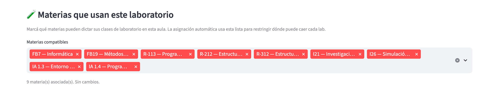

1. En esa sección hay un selector múltiple, **Materias compatibles**,
   con todas las materias activas del catálogo (formato `código - nombre`).
2. Elegí las materias que se pueden dictar en este laboratorio. Mientras
   no cambies nada, la sección indica cuántas materias hay asociadas
   ("N materia(s) asociada(s). Sin cambios.").
3. Cuando hay cambios, un aviso informa cuántas materias se agregan y
   cuántas se quitan; apretá **Guardar** para aplicarlos.
4. Verificación: al volver a la página de Materias y ver la sub-solapa
   Laboratorios de esas materias, el aula que acabás de configurar
   aparece asociada.

Esta lista es la que el asignador consulta cuando tiene que asignar
aula a un patrón semanal de tipo laboratorio.

### Desactivar un aula (sin borrarla)

Si un aula deja de estar disponible (obras, cambio de destino) pero
algún plan ya la tiene asignada, conviene desactivarla en lugar de
borrarla.

1. Andá a **👁️ Ver detalle**, elegí el aula.
2. En el formulario de edición, destildá **Activa** y apretá
   **Guardar cambios**.
3. Verificación: en **📋 Listado** la columna **Activa** dice "No
   (desactivada)".

Un aula desactivada no la usa el asignador ni se ofrece al cambiar un
aula a mano. Los planes que ya la tienen asignada la conservan hasta
que se vuelva a correr el asignador, que reubica esos horarios. Si un
horario estaba fijado a mano en esa aula, la verificación de
factibilidad lo avisa como una fijación que ya no es válida: liberala
desde el panel de asignaciones manuales protegidas. Para volver a
usarla, tildá de nuevo **Activa**.

### Eliminar un aula

1. Andá a **👁️ Ver detalle**, elegí el aula.
2. Bajá al expander **"🗑️ Borrar aula"**, que advierte que la acción
   es irreversible.

   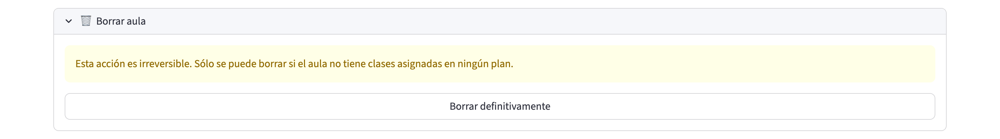

3. Apretá **Borrar definitivamente**.
4. Verificación: el aula desaparece del listado.

**Restricción**: no se puede borrar un aula que tenga clases asignadas
en algún plan. El sistema muestra el error "No se puede borrar: el
aula tiene clases asignadas en algún plan. Reasignalas primero.". En ese caso, hay
que primero reasignar esas clases a otras aulas (desde el panel de
asignación del plan) o eliminar el plan que las contiene.

**Nota**: los cambios en aulas **no quedan registrados en el
Historial**. Si necesitás llevar rastro de "quién cambió la capacidad de
tal aula", tenés que anotarlo en otro lado.

## Errores frecuentes y qué hacer

| Mensaje | ¿Qué significa? | Cómo lo resolvés |
|---|---|---|
| "No hay sedes cargadas. Creá al menos una sede en la pestaña '📍 Sedes' antes de crear un aula." | Estás intentando crear un aula pero el catálogo de sedes está vacío | Andá a la solapa Sedes y creá al menos una |
| "Ya existe un aula con código '{codigo}'. Cambiá el nombre o el código y volvé a intentar." (mensaje flotante) | El código, autogenerado o escrito, choca con uno existente | Cambiá el nombre o escribí otro código en el campo Código para mostrar |
| "Ya existe otra aula con código '{codigo}'." | Al editar cambiaste el código a uno que ya usa otra aula | Elegí un código distinto |
| "No se puede borrar: el aula tiene clases asignadas en algún plan. Reasignalas primero." | El aula está siendo usada por un plan activo | Reasigná esas clases desde el panel de asignación del plan, o desactivá el plan |
| "Ya existe la sede '{nombre}'." | Estás intentando crear o renombrar una sede con un nombre ya en uso | Elegí otro nombre |
| "No se puede borrar la sede '...': tiene aulas asociadas. Reasignalas primero o usá 'fusionar' para moverlas a otra sede." | Estás intentando borrar una sede que aún tiene aulas | Fusionala con otra sede, o cambiale la sede a cada aula manualmente |
| "La sede origen y la destino son la misma." | Al fusionar elegiste la misma sede en ambos campos | Elegí sedes distintas |

## Preguntas frecuentes

**¿Puedo tener dos aulas con el mismo nombre en distintas sedes?**
Sí, siempre que el código sea distinto. El código se autogenera con el
nombre de la sede, así que "AULA 01" en Pellegrini y "AULA 01" en
Zeballos generan códigos distintos (`Pellegrini-AULA-01` y
`Zeballos-AULA-01`) y no chocan.

**¿Puedo tener dos aulas con el mismo código?**
No. El código es único a nivel sistema (no por sede).

**¿Qué pasa si cambio el tipo de un aula de "laboratorio" a "teórica"?**
Se guarda sin ningún aviso. La sección "Materias que usan este
laboratorio" deja de mostrarse para esa aula, pero las asociaciones
existentes **no se borran automáticamente**. Si querés limpiarlas, antes
de cambiar el tipo quitá las materias desde esa sección.
> **Para verificar:** cómo trata el asignador las asociaciones que quedan
> guardadas en un aula que ya no es laboratorio.

**¿Qué diferencia hay entre las cuatro categorías de tipo (teorica,
practica, laboratorio, anfiteatro)?**
- **Teorica**: aula estándar para clases magistrales.
- **Practica**: aula para clases prácticas (menos frontal, más
  interacción).
- **Laboratorio**: aula equipada para prácticas experimentales.
  Requiere que la materia haya asociado el aula como compatible.
- **Anfiteatro**: aula grande, tipo auditorio, para clases con
  mucha asistencia.

El asignador respeta la compatibilidad de tipo entre aula y clase.

**¿Dónde se configuran las sedes en las que puede ir una materia?**
En **Materias → 📦 Grupos de materias**. Cada grupo define su modo (DURO
o BLANDO) y su lista de sedes admisibles, y cada materia pertenece a
exactamente un grupo. Esta página sólo administra el catálogo de sedes y
aulas.

**¿Puedo tener un aula sin sede?**
No. La sede es obligatoria. Hay que crear al menos una sede antes de
crear la primera aula.

**¿Los cambios en un aula quedan registrados en el Historial?**
No. Aulas y sedes no se auditan.
> **Para verificar:** que el Historial no registre ningún cambio de aulas
> o sedes.

**¿Puedo fusionar tres sedes en una?**
Sí, pero de a dos por vez. Fusionás sede A → sede C, después sede B →
sede C.

**¿Cómo se decide el default "30" en el campo Capacidad?**
Es un valor arbitrario para arrancar. Cambialo al valor real del aula.
El sistema valida que sea mayor o igual a 1.

**¿La capacidad afecta el asignador?**
Sí. El asignador prefiere colocar cada comisión en un aula con
capacidad cercana a los inscriptos esperados. Aulas muy grandes para
comisiones chicas o aulas chicas para comisiones grandes generan un
"gap" que el asignador intenta minimizar.

## Términos importantes de este módulo

- **Aula**: espacio físico donde se dictan clases. Tiene un código, un
  nombre, una sede, una capacidad y un tipo.
- **Sede**: edificio o predio de la facultad donde hay aulas. Ejemplos
  típicos: Pellegrini, Zeballos, Siberia, Beltrán.
- **Tipo de aula**: categoría que dice qué clase de actividad se puede
  hacer ahí. Cuatro opciones: teorica, practica, laboratorio,
  anfiteatro.
- **Capacidad**: cantidad máxima de personas que entran en el aula.
- **Código del aula**: identificador único a nivel sistema, generalmente
  autogenerado con el formato `{sede}-{nombre}` si no se completa a
  mano.
- **Sedes admisibles**: sedes donde puede ir una materia. Se definen por
  grupo de materias (Materias → 📦 Grupos de materias), con modo DURO o
  BLANDO.
- **Laboratorio compatible**: relación entre un aula tipo laboratorio y
  una materia que puede usarlo para su parte práctica.
- **Fusión de sedes**: operación que reasigna todas las aulas de una
  sede a otra y borra la sede origen. Útil para consolidar duplicados.
