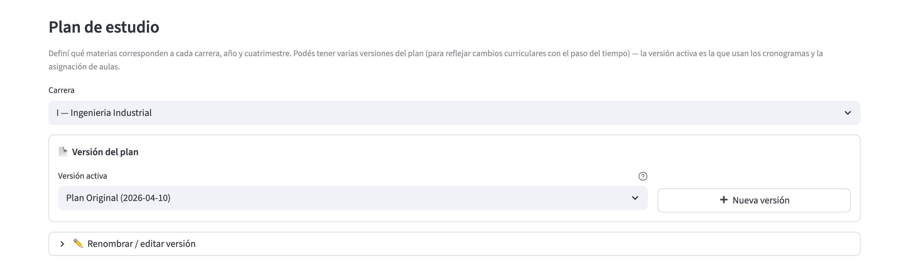
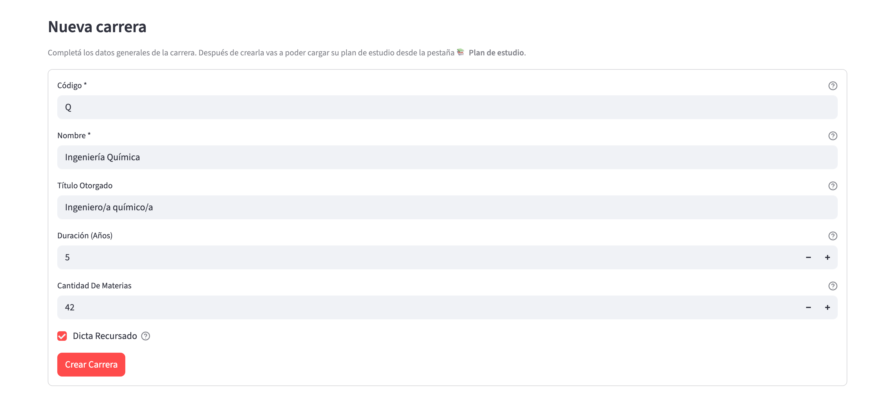
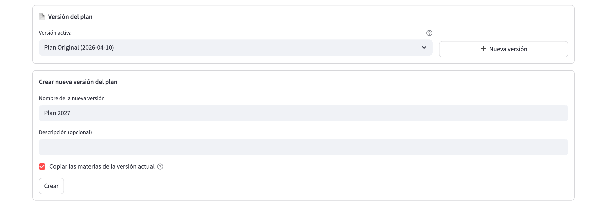
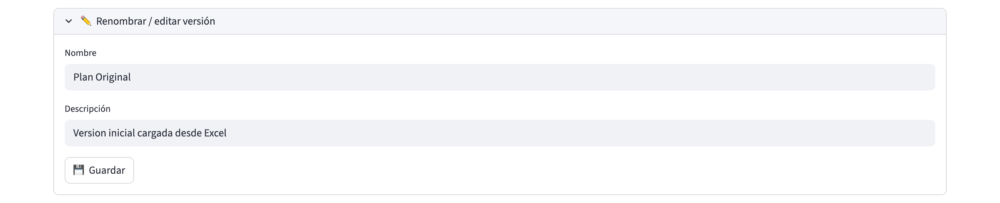
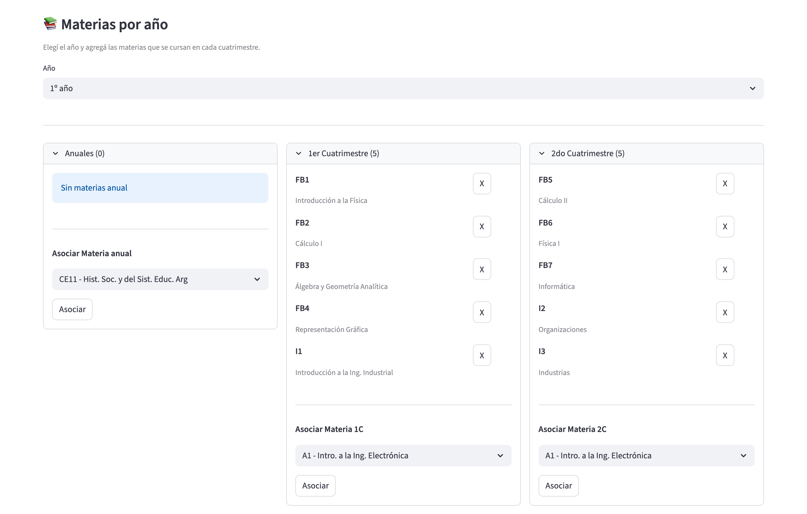
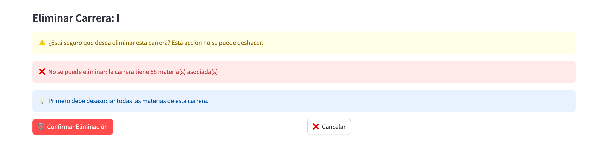

# Carreras

## ¿Para qué sirve?

La página **🎓 Carreras** es el catálogo maestro de carreras
universitarias del sistema. Es donde se dan de alta las carreras (con
su código, nombre, título otorgado y duración), se gestionan las
versiones de su plan de estudio (qué materias componen la carrera en
qué año y cuatrimestre) y se elige cuál es el plan de estudio activo.

Es una de las tres entradas del catálogo maestro, junto con Materias y
Aulas.

## ¿Cuándo vas a usar este módulo?

- **Setup inicial**: después de la carga masiva, para completar los
  nombres reales de las carreras (los Excel maestros dejan el código
  como placeholder si el archivo de metadata no está actualizado),
  ajustar duración y cantidad de materias esperadas, y marcar el plan de
  estudio activo de cada una.
- **Apertura de una carrera nueva**: cuando la facultad lanza una
  carrera que no existía y hay que darla de alta.
- **Actualización de un plan de estudios**: cuando cambia oficialmente
  el plan (por ejemplo, se aprueba un plan 2027 que reemplaza al 2020),
  se crea una versión nueva del plan y se le asocian las materias.
- **Cambio de regla de recursado**: cuando una carrera pasa a dictar
  o dejar de dictar materias como recursado.
- **Baja de una carrera**: cuando la facultad cierra un plan y hay que
  archivarlo.

## Cómo se relaciona con el resto

- **Alimenta Materias**: las materias del catálogo se asocian a una o
  varias carreras dentro de una versión de plan de estudios. Sin
  carreras cargadas no se pueden dar de alta materias nuevas desde la
  otra página.
- **Alimenta Ciclos**: cada ciclo asocia una versión de plan de cada
  carrera para saber qué materias ofrecer.
- **Alimenta Planes de cursada**: los planes se arman a partir de las
  materias que la versión de plan asociada al ciclo tenga.
- **Interactúa con Grupos de materias**: la ficha de cada carrera lista
  los grupos de materias que la tienen asociada (Materias → 📦 Grupos de
  materias). Las sedes admisibles se configuran por grupo, no por carrera.

## Recorrido rápido de la página

Tres solapas:

- **📋 Lista de carreras**: vista principal, con todas las carreras
  cargadas, cada una en un desplegable. Se puede editar y eliminar. Cada
  ficha muestra la barra de completitud (materias cargadas sobre
  materias esperadas), el plan de estudio activo y los grupos de
  materias asociados.
- **➕ Nueva carrera**: formulario para dar de alta una carrera nueva.
- **📚 Plan de estudio**: el editor del plan. Se elige carrera + versión
  + año, y se puede asociar / desasociar materias en las columnas de
  Anuales, 1er Cuatrimestre y 2do Cuatrimestre. También se crean nuevas
  versiones del plan y se renombran las existentes.

Al desplegar una carrera se ven sus datos, la barra de completitud, el
bloque **Plan de estudio activo**, el bloque **Grupos de materias
asociados** (sólo lectura: las asociaciones se editan desde Materias →
📦 Grupos de materias) y, abajo a la derecha, los botones **✏️ Editar**
y **🗑️ Eliminar**.

## Tareas comunes

### Crear una carrera nueva

1. Andá a la solapa **➕ Nueva carrera**.
2. Completá los datos:
   - **Código**: identificador único de la carrera (por ejemplo, "IE",
     "LCC", "IM"). No puede repetirse y no se puede cambiar después.
   - **Nombre**: nombre completo de la carrera (por ejemplo,
     "Ingeniería Electrónica").
   - **Título Otorgado**: título académico que se obtiene al completar
     la carrera.
   - **Duración (años)**: mínimo 1. Cantidad de años teóricos que dura
     el plan.
   - **Cantidad de Materias** (opcional): cantidad total esperada de
     materias obligatorias. Sirve para calcular la barra de
     completitud. Si lo dejás vacío, la carrera va a mostrar
     "Cantidad no definida" hasta que lo completes.
   - **Dicta recursado**: tildá si la carrera dicta las materias como
     recursado en el cuatrimestre opuesto. Se puede sobrescribir a
     nivel materia con una excepción puntual.

   

3. Apretá **Crear Carrera**. Aparece "Carrera creada exitosamente".
4. Verificación: la carrera aparece en la solapa **📋 Lista de carreras** con los
   datos que le cargaste.

**Paso siguiente crítico** (no se hace automáticamente): antes de
poder asociar materias a esta carrera, tenés que tener una **versión del
plan de estudio**. Una carrera recién creada no tiene ninguna, y la
solapa **📚 Plan de estudio** muestra la advertencia "Esta carrera
todavía no tiene ninguna versión de plan de estudio. Creá una para
empezar a asociarle materias.".
> **Para verificar:** cómo se crea la primera versión de una carrera
> nueva, porque en esa situación la solapa no muestra el botón **➕ Nueva
> versión** (sólo aparece cuando ya existe al menos una versión).

### Editar los datos de una carrera

1. En la solapa **📋 Lista de carreras**, desplegá la carrera y apretá
   **✏️ Editar**.
2. Modificá los campos que necesites: Nombre, Título Otorgado, Duración
   (años), Cantidad de Materias o Dicta recursado. El código queda
   deshabilitado y no se puede cambiar. En el mismo formulario, el
   bloque **Plan de estudio activo** pasa a ser un selector (**Versión
   activa**) donde podés elegir qué versión es la vigente, o
   "(Ninguna)".

   

   Al entrar en modo edición, el título del desplegable muestra la
   leyenda "editando" y el código aparece en gris. Los botones
   **💾 Guardar cambios** y **✕ Cancelar** están al pie del desplegable.

3. Apretá **💾 Guardar cambios**. Los datos y el plan activo se aplican
   juntos.
4. Verificación: aparece "Carrera actualizada." y, al volver a la lista,
   los datos se refrescan.

**Nota**: solo el cambio del flag "Dicta recursado" queda registrado
en el Historial. Cambios en nombre, título o duración no se auditan.

### Ver y cambiar el plan de estudio activo

El **plan activo** es la versión vigente de la carrera. Los filtros por
ubicación curricular y las verificaciones de consistencia por grupo lo
usan como referencia; los planes inactivos se conservan para poder seguir
referenciando ciclos de años anteriores.

1. En la solapa **📋 Lista de carreras**, desplegá la carrera: el bloque
   **Plan de estudio activo** muestra el nombre y la fecha de la versión
   activa. Si ninguna está marcada, lo indica y aclara que los filtros
   usan el plan más reciente.
2. Para cambiarlo, apretá **✏️ Editar**, elegí la versión en **Versión
   activa** y apretá **💾 Guardar cambios**.

### Grupos de materias asociados

Debajo del plan activo, el bloque **Grupos de materias asociados** lista
los grupos que declaran a la carrera como asociada (con la marca "Sin
clasificar" cuando corresponde). Es sólo lectura: las asociaciones y las
sedes admisibles se editan desde **Materias → 📦 Grupos de materias**.

### Crear una nueva versión del plan de estudios

Sirve para preservar el plan viejo mientras armás uno nuevo, o para
tener plan histórico + plan vigente conviviendo.

1. Andá a la solapa **📚 Plan de estudio** y elegí la carrera en el
   selector **Carrera**.
2. En el bloque **Versión del plan**, apretá **➕ Nueva versión**.
3. Se abre el formulario **Crear nueva versión del plan**:
   - **Nombre de la nueva versión**: por ejemplo, "Plan 2027".
   - **Descripción (opcional)**: notas sobre el plan.
   - **Copiar las materias de la versión actual**: por defecto tildado. Si
     lo dejás así, la versión nueva arranca con las mismas materias
     asociadas que la versión actual (mismos año, cuatrimestre y flag
     de optativa). Es útil para partir de una base y modificar.

   

4. Apretá **Crear**.
5. Verificación: aparece "Versión '...' creada" y la versión nueva está en el selector, con las
   materias copiadas si tildaste la opción.

**Efecto colateral**: el selector del bloque **Versión del plan** (rotulado
**Versión activa**, con formato `nombre (fecha)`) sólo define sobre qué
versión trabajás en esta solapa; no cambia el plan activo de la carrera
(eso se hace al editarla desde la lista). Cuando cambiás de versión, todas
las asociaciones que edites (agregar/desasociar materias) se hacen
sobre esa versión. Los ciclos que estén apuntando a otra versión no
se ven afectados.

### Editar el nombre o descripción de una versión existente

1. En la solapa **📚 Plan de estudio**, elegí la carrera y la versión.
2. Desplegá el expander **"✏️ Renombrar / editar versión"**.
3. Modificá **Nombre** o **Descripción**.

   

4. Apretá **💾 Guardar**. Aparece "Versión actualizada.".

**Limitación**: solo se puede editar el nombre y la descripción. Hoy
no hay una opción en la interfaz para borrar una versión completa;
eso se hace desde el equipo técnico si hace falta.

### Asociar una materia a un plan de estudios

1. En la solapa **📚 Plan de estudio**, elegí la carrera y la versión
   del plan. Debajo verás el **Estado del plan** (barra de completitud).
2. En la sección **Materias por año**, elegí el **Año** (1º a 6º año) al
   que la querés asociar.
3. Vas a ver tres columnas: **Anuales**, **1er Cuatrimestre** y **2do
   Cuatrimestre**.

   

   En la captura, cada columna es un desplegable con la cantidad de
   materias entre paréntesis ("Anuales (0)", "1er Cuatrimestre (5)"),
   lista las materias ya asociadas con una "X" al costado para
   desasociarlas, y al pie tiene el selector y el botón **Asociar**.
   Las materias optativas aparecen aparte, en un desplegable
   "Optativas (N)" dentro de la columna.

4. Al pie de cada columna hay una sección **"Asociar Materia anual"**,
   **"Asociar Materia 1C"** o **"Asociar Materia 2C"** con un selector.
   Elegí la materia (formato `código - nombre`) y apretá **Asociar**.
5. Verificación: la materia aparece en la columna correspondiente del
   año elegido.

**Nota**: el selector solo muestra las materias que coinciden con el
período de la columna (una materia cuatrimestral no aparece en la
columna Anuales, y viceversa). Además, se excluyen las materias que
ya están asociadas a la carrera en esa versión del plan (en cualquier
año), para que no las dupliques. Si no queda ninguna, la columna dice
"No hay materias disponibles".

### Desasociar una materia de un plan

1. En la solapa **📚 Plan de estudio**, elegí la carrera, la versión y el
   año.
2. Buscá la materia en la columna correspondiente (Anuales, 1er C o
   2do C).
3. Apretá la "X" al lado del código.
4. Verificación: la materia desaparece de la columna.

**Precaución**: si esa asociación ya está en uso por un ciclo activo
(hay dictados, comisiones o cronogramas que la referencian), desasociarla
puede dejar información inconsistente. Ideal es hacerlo antes de crear
dictados o después de haber cerrado el ciclo.

### Eliminar una carrera

1. En la solapa **📋 Lista de carreras**, desplegá la carrera y apretá
   **🗑️ Eliminar**.
2. Debajo de la lista aparece la sección **Eliminar Carrera: {código}**,
   con la advertencia "¿Está seguro que desea eliminar esta carrera? Esta
   acción no se puede deshacer.".

   

   Si la carrera todavía tiene materias asociadas, la pantalla lo
   indica con un mensaje en rojo ("No se puede eliminar: la carrera
   tiene N materia(s) asociada(s)") y una sugerencia ("Primero debe
   desasociar todas las materias de esta carrera."). Con todo, el botón
   de confirmación sigue visible.

3. Apretá **🗑️ Confirmar Eliminación** (o **❌ Cancelar** para
   desistir).
4. Verificación: la carrera desaparece de la lista.

**Restricciones**:

- Si la carrera tiene materias asociadas, el sistema muestra el error
  "No se puede eliminar: la carrera tiene N materia(s) asociada(s)." y
  la sugerencia de desasociarlas primero. Tenés
  que ir a la solapa **📚 Plan de estudio**, quitar todas las
  asociaciones año por año, y volver a intentar.
- Aún después de desasociar todas las materias, si la carrera tiene
  versiones de plan de estudios creadas, la eliminación puede fallar
  con un error del sistema. Hoy la interfaz no ofrece una opción para
  borrar versiones de plan; eso lo hace el equipo técnico manualmente.

**Nota**: la ausencia de una herramienta para desasociar en bulk todas
las materias de una carrera hace que borrarla sea un proceso tedioso.
Si necesitás archivarla en la práctica pero no borrarla, considerá
simplemente no asociarla a ciclos nuevos.

## Errores frecuentes y qué hacer

| Mensaje | ¿Qué significa? | Cómo lo resolvés |
|---|---|---|
| "No se puede eliminar: la carrera tiene N materia(s) asociada(s)." (más "Primero debe desasociar todas las materias de esta carrera.") | La carrera tiene materias en su plan de estudios | Andá a Plan de estudio y desasociá todas las materias, año por año |
| Error "N plan version(s) exist. Delete plan versions first." | La carrera no tiene materias pero sí versiones de plan de estudios | Contactá al equipo técnico para borrar las versiones (no hay opción en la interfaz) |
| "Esta carrera todavía no tiene ninguna versión de plan de estudio. Creá una para empezar a asociarle materias." | Elegiste una carrera en Plan de estudio pero nunca se creó una versión | Ver "Para verificar" en "Crear una carrera nueva" |
| "El nombre no puede estar vacío." | Al crear una versión nueva de plan dejaste el campo Nombre vacío | Escribí un nombre |
| "No se encontró plan de estudios para la carrera 'X'" | Al asociar una materia a esta carrera desde otra página, la carrera no tiene versión de plan | Andá a Plan de estudio y creá una versión con "Nueva versión" |
| "Carrera con código '{codigo}' no encontrada" | La carrera que estabas editando fue borrada por otra sesión | Volvé a la lista y refrescá |
| "No se pudo actualizar la carrera" (precedido de ❌) | El guardado falló silenciosamente | Reintentá; si persiste, avisale al equipo |

## Preguntas frecuentes

**¿Puedo tener dos carreras con el mismo código?**
No. El código es único a nivel sistema.

**¿Puedo cambiar el código de una carrera?**
No. Una vez creada, el código queda fijo. Si te equivocaste, hay que
crear una nueva con el código correcto y (eventualmente) mover las
materias asociadas.

**¿Qué es "Cantidad de Materias" y por qué es opcional?**
Es la cantidad total esperada de materias obligatorias de la carrera
(no cuenta optativas). Sirve para mostrar la barra de progreso en la
lista y en el panel de completitud de la página de Materias. Si lo
dejás vacío, no se muestra progreso pero la carrera funciona igual.

**¿Puedo tener dos versiones de plan de estudios activas al mismo
tiempo?**
Sí. La carrera puede tener cuantas versiones históricas quieras. La
"vigente" para el asignador de aulas es la que le asignes a cada ciclo
puntual: un ciclo puede usar la versión 2020 y otro puede usar la
2027 simultáneamente.

**¿Qué pasa con las materias si borro una versión de plan?**
Las asociaciones de materia-carrera de esa versión desaparecen. Las
materias en sí (a nivel catálogo) siguen existiendo. Hoy no hay opción
en la interfaz para borrar versiones; se hace desde el equipo técnico.

**¿Qué diferencia hay entre "Dicta recursado" a nivel carrera y a nivel
materia?**
La carrera define la regla general: si tildado, todas sus materias
exclusivas se ofrecen también como recursado en el cuatrimestre opuesto
al que les toca según el plan. La materia puede sobrescribir esa regla
con su propio flag (desde la página de Materias, campo "Recursado" en
la edición). Es un mecanismo jerárquico: primero materia, después
carrera, para decidir si generar el dictado.

**¿Por qué las carreras aparecen con el nombre igual al código (por
ejemplo, "IE - IE")?**
Porque los nombres reales se cargan aparte del archivo de metadata
inicial. Si ese archivo no está actualizado o falta, el sistema deja
el código como placeholder. Podés editar cada carrera y ponerle el
nombre real desde la solapa **📋 Lista de carreras → ✏️ Editar**.

**¿Puedo asociar una materia sin haber creado un plan de estudios?**
No. La asociación materia-carrera vive dentro de una versión de plan.
Si la carrera no tiene ninguna versión, no hay dónde poner la
asociación. Tener al menos una versión en **📚 Plan de estudio** es un
paso obligatorio después de crear la carrera.
> **Para verificar:** desde qué pantalla se crea esa primera versión.

**¿Dónde se configuran las sedes en las que se dicta una carrera?**
Las sedes admisibles se definen por
grupo de materias, en **Materias → 📦 Grupos de materias**. La ficha de
la carrera sólo muestra, en modo lectura, los grupos que la tienen
asociada.

**¿Dónde veo el histórico de cambios de una carrera?**
En la página **📜 Historial**. Solo se auditan altas, bajas y cambios
en el flag "Dicta recursado". Nombre, título y duración no quedan en
el histórico.

## Términos importantes de este módulo

- **Carrera**: entrada del catálogo maestro con código, nombre, título
  otorgado, duración y cantidad de materias esperadas.
- **Plan de estudios (versión)**: agrupación con nombre y descripción
  de asociaciones materia-carrera. Una carrera puede tener varias
  versiones históricas.
- **Asociación materia-carrera**: una entrada que dice "esta materia
  está en el plan X de la carrera Y, en tal año y tal cuatrimestre".
- **Dicta recursado**: flag de la carrera que indica si se ofrecen sus
  materias exclusivas también como recursado en el cuatrimestre
  opuesto. Se puede sobrescribir a nivel materia.
- **Plan de estudio activo**: la versión del plan que se toma como
  vigente para la carrera; se cambia al editarla.
- **Grupo de materias asociado**: grupo (Materias → 📦 Grupos de
  materias) que declara a la carrera como asociada; define, entre otras
  cosas, las sedes admisibles de sus materias.
- **Barra de completitud**: indicador visual que compara cuántas
  materias obligatorias tiene asociadas la última versión del plan
  contra la cantidad esperada. Solo aparece si "Cantidad de Materias"
  está definida.
- **Placeholder de nombre**: cuando el nombre de una carrera es igual
  al código (por ejemplo, "IE - IE"), significa que la metadata inicial
  no completó el nombre real y hay que editarlo a mano.
