# Ciclos

## ¿Para qué sirve?

El módulo de **Ciclos** es donde declarás cada cuatrimestre lectivo
que la facultad va a manejar en el sistema. Un ciclo es una unidad
temporal (por ejemplo, `2026-1C` o `2026-2C`): tiene fecha de inicio,
fecha de fin y, sobre todo, define qué materias efectivamente se
dictan en ese período.

Adentro del módulo trabajás con dos cosas distintas pero
complementarias:

1. **El ciclo en sí**: un contenedor con fechas, cuatrimestre y las
   versiones de los planes de estudio que aplican.
2. **Los dictados**: la lista concreta de materias que se ofrecen en
   ese ciclo, con sus atributos (modalidad presencial o virtual, si
   se dicta como recursado, etc.).

Todo lo que después vas a hacer en Cronogramas, Planes y Asignación
de Aulas se apoya en los dictados que declares acá. Por eso este
módulo es la puerta de entrada de cada cuatrimestre.

## ¿Cuándo vas a usar este módulo?

- **Al inicio de cada cuatrimestre**: creás el ciclo nuevo, le
  asignás las versiones de plan de cada carrera y generás los
  dictados iniciales.
- **Cuando cambian las condiciones del ciclo**: aparece una materia
  nueva a último momento, otra deja de dictarse, o una modalidad se
  pasa a virtual por Zoom.
- **Después de importar un cronograma o validarlo**: si aparecen
  materias en el cronograma que no tenían dictado, volvés acá para
  crearlos.
- **Al cerrar un cuatrimestre**: si querés borrar todo (por ejemplo,
  para dejar limpia la base antes de arrancar el año siguiente),
  este es el único lugar donde se borran ciclos.

## Cómo se relaciona con el resto

El orden lógico de trabajo es:

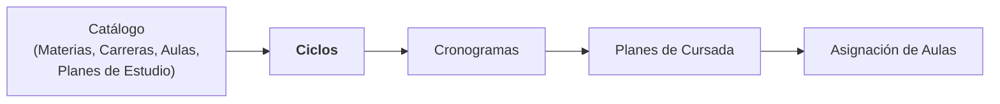

- **Antes de Ciclos** tenés que tener el catálogo cargado: materias,
  carreras, aulas y las versiones de plan de estudio de cada
  carrera. Sin plan de estudio no podés declarar qué materias dictar.
- **Ciclos precede a Cronogramas**: no vas a poder validar un
  cronograma contra los dictados si el ciclo todavía no tiene
  dictados creados.
- **Ciclos precede a Planes de Cursada**: un plan de cursada nace
  siempre "adentro" de un ciclo y sus materias tienen que estar
  declaradas como dictados.

Además, cada ciclo se apoya en la **regla de recursado** de cada
materia y carrera (definidos en el catálogo). Si querés que este año
Análisis I no se dicte como recursado, ese ajuste vive en el módulo
de Materias o de Carreras, no acá.

## Modelo mental

Antes de meterte en las pantallas, conviene tener claros tres
conceptos que se usan todo el tiempo en este módulo.

### El ciclo es un contenedor temporal con versiones de plan colgadas

Un ciclo (por ejemplo `2026-1C`) no es sólo una fecha: también
"apunta" a qué versión del plan de estudio de cada carrera aplica en
ese cuatrimestre. Esto es importante porque una misma carrera puede
tener varias versiones de su plan de estudios (Plan Original, Plan
2023, Plan Reforma 2025) y no siempre está claro cuál rige en un
cuatrimestre dado.

Por eso, al crear un ciclo nuevo, el sistema te obliga a **elegir
como mínimo una versión de plan**. Por defecto preselecciona la
versión marcada como *activa* de cada carrera (si una carrera no
tiene ninguna activa, toma la más reciente), pero podés cambiar la
selección. Como hoy cada carrera tiene una sola versión, en la
práctica quedan todas preseleccionadas. Los ciclos ya creados
conservan las versiones con las que se armaron, aunque después se
marque otra como activa.

### Un dictado es "esta materia se dicta en este ciclo"

Un **dictado** es la afirmación: "la materia X se dicta efectivamente
en el ciclo Y". En el sistema se modela como una fila en la base de datos.

Regla clave a entender:

> **Si el dictado existe, la materia se dicta ese ciclo. Si no
> existe, no se dicta.** No hay un botón de "activar" o
> "desactivar": la existencia del dictado *es* la activación.

Esto tiene una consecuencia práctica muy importante: **para dejar de
dictar una materia en un ciclo, tenés que borrar el dictado**. No
hay una casilla de "activo/inactivo" para prender y apagar.

Para materias **anuales**, el sistema es más inteligente: aunque la
materia se dicte en el 1C y en el 2C, el sistema mantiene un solo
dictado y lo vincula a los dos ciclos.

### La modalidad virtual se resuelve por jerarquía

Una materia puede ser "virtual" a tres niveles distintos:

1. **Del catálogo** (nivel materia): la materia es virtual por
   diseño. Ejemplo: una asignatura optativa 100 % online.
2. **Del ciclo** (nivel dictado): la materia normalmente es
   presencial, pero este cuatrimestre puntual se dicta virtual.
3. **Del horario** (nivel más específico): dentro de un mismo
   dictado, un horario concreto es virtual (por ejemplo, la teoría
   sí, el laboratorio no).

El sistema resuelve la modalidad final aplicando **"el nivel más
específico manda"**: si hay un valor definido en el horario, ese
gana; si no, se mira el del dictado; si tampoco, se mira el de la
materia.

En el módulo de Ciclos vas a ver un selector de tres estados por
cada dictado:

- **Heredar** (por defecto): usa lo que dice la materia del catálogo.
- **Virtual**: fuerza que ese dictado sea virtual este ciclo.
- **Presencial**: fuerza que ese dictado sea presencial este ciclo,
  aunque la materia sea virtual de catálogo.

## Recorrido rápido de la página

La página se llama **📆 Ciclos** y tiene dos pestañas:

### Pestaña "📋 Ciclos"

Se usa para **crear, listar y borrar ciclos**. Tiene tres bloques:

1. **Ciclos registrados**: tabla con todos los ciclos creados. Ves
   ID, año, cuatrimestre, fechas y descripción.
2. **Eliminar ciclo**: selector + botón. Ver la sección de tareas
   más abajo: es una operación en cascada muy fuerte.
3. **Nuevo ciclo**: formulario para dar de alta un ciclo con sus
   fechas, cuatrimestre y las versiones de plan que le aplican.

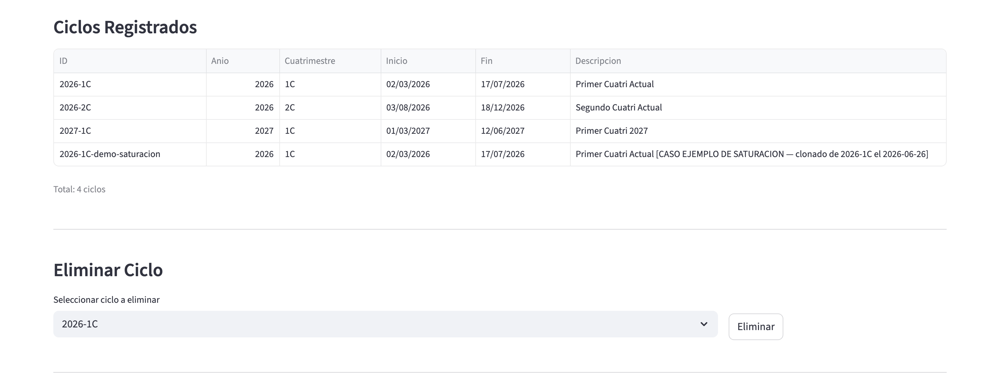

En la tabla de arriba se ve cada ciclo con sus fechas y, debajo de la línea divisoria, el selector con el botón **Eliminar**.

### Pestaña "📚 Dictados"

Es la pestaña más densa del módulo, y donde vas a pasar la mayor
parte del tiempo. Se apoya en un selector de ciclo arriba de todo.
Los bloques principales son:

1. **Métricas resumen** del ciclo elegido: cantidad de carreras,
   planes, materias, optativas y materias con el recursado
   configurado a mano. Más abajo, después del panel de
   divergencias, hay una segunda fila con los dictados existentes,
   los marcados como virtuales y las optativas.
2. **Botones de operación**: **➕ Crear Dictados** (en bloque) y
   **🔄 Sincronizar según reglas** (recalcula ante cambios), con un
   aviso al lado que resume si hay divergencias.
3. **Panel de divergencias**: muestra en un lugar centralizado
   cualquier desalineación entre lo que dicen las reglas y lo que
   está cargado como dictado. Es tu principal herramienta de
   verificación.
4. **Filtros de la lista**: por texto, estado (con/sin dictado),
   modalidad virtual, año del plan, cuatrimestre del plan y
   optativas, más los botones **📖 Abrir todas** y **📕 Cerrar
   todas** para desplegar o contraer los desplegables.
5. **Cambios pendientes**: si estás editando los selectores de
   virtual o recursado, los cambios se acumulan en un bloque que
   aparece arriba de la grilla y los aplicás en lote con un solo
   botón.
6. **Grilla de dictados por carrera**: desplegable por carrera con
   su configuración (recursado y versión de plan) y las materias
   exclusivas de esa carrera, separadas entre obligatorias y
   optativas. Cada fila tiene los selectores de recursado y
   modalidad, más el botón de crear o borrar dictado.
7. **Desplegable "🔗 Comunes"**: al final, una única entrada por
   cada materia que se comparte entre dos o más carreras (por
   ejemplo, Análisis I), con un filtro propio por carrera.

También hay un desplegable **ℹ️ Cómo funciona esta página** con un
resumen de estas mismas reglas.

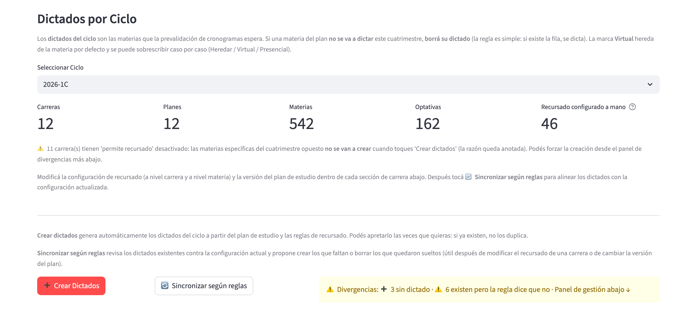

Arriba de todo se elige el ciclo; debajo están las métricas, los botones **Crear Dictados** y **Sincronizar según reglas**, y el aviso amarillo con el resumen de divergencias.

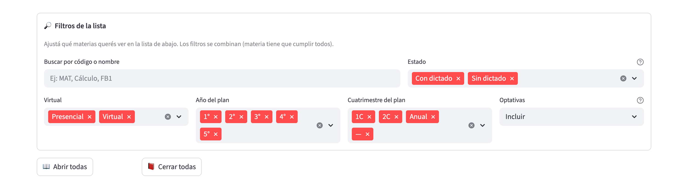

Los filtros se combinan: una materia tiene que cumplirlos todos para aparecer en la lista.

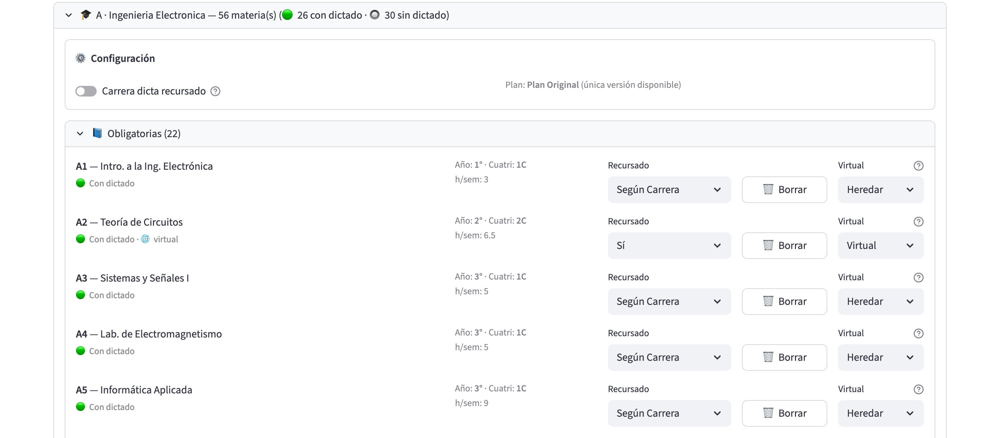

Cada carrera tiene su desplegable con el bloque **Configuración** (el interruptor **Carrera dicta recursado** y la versión de plan) y, en cada fila, los selectores **Recursado** y **Virtual** y el botón **Borrar**.

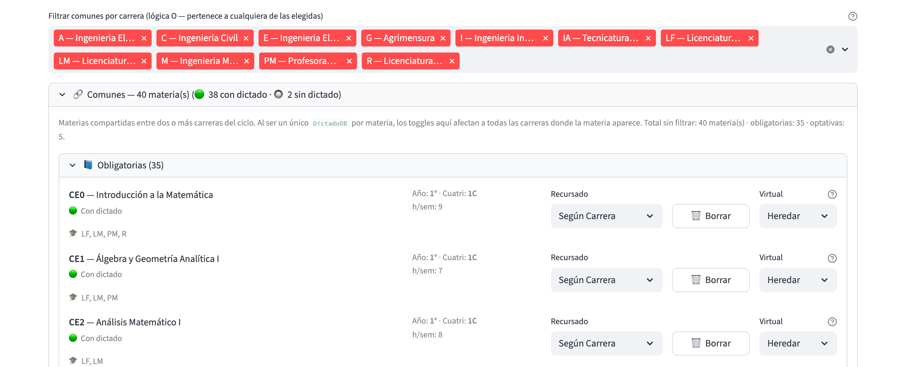

Las materias compartidas aparecen una sola vez, con las carreras que las comparten listadas debajo del nombre. Arriba hay un filtro para quedarte sólo con las comunes de ciertas carreras.

## Tareas comunes

### Crear un ciclo nuevo (1C o 2C)

**Cuándo hacerlo**: al arrancar cada cuatrimestre lectivo. Se hace
una sola vez por cuatrimestre.

**Paso a paso**:

1. Entrá a la página **📆 Ciclos** y quedate en la pestaña
   **📋 Ciclos**.
2. Bajá hasta el bloque **Nuevo Ciclo**.
3. Elegí el **Anio** (entre 2020 y 2100; por defecto, el año en
   curso) y el **Cuatrimestre** (1C o 2C). El sistema arma el ID
   solo, con formato `{año}-{cuatri}C` (por ejemplo, `2026-1C`).
4. Cargá la **Fecha de inicio** y la **Fecha de fin**. La de fin
   tiene que ser posterior a la de inicio.
5. Escribí una **Descripcion (opcional)** libre; conviene poner
   algo tipo "Primer cuatrimestre 2026".
6. En **Versiones de plan a asignar**, revisá la lista de
   selección múltiple. Por defecto el sistema preselecciona la
   versión activa de cada carrera (o la más reciente, si ninguna
   está marcada como activa). Si una carrera tiene que usar otra
   versión, cambiá la selección acá. Si todavía no hay versiones
   de plan cargadas, el formulario te avisa que primero hay que
   crear los planes de estudio.
7. Apretá **Guardar**.

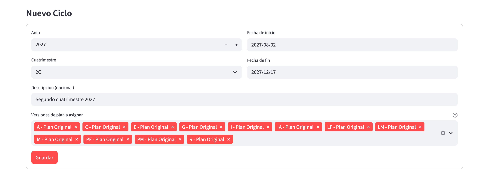

El formulario completo, con el año, el cuatrimestre, las fechas y las versiones de plan a asignar.

**Verificación**: el ciclo aparece en la tabla de "Ciclos
Registrados" con las fechas y descripción que cargaste. Deberías
ver un cartel verde con el mensaje `Ciclo '2026-1C' creado con N
version(es) de plan`.

**Notas importantes**:

- El **ID del ciclo no se puede editar después**. Si te equivocaste
  en el año o el cuatrimestre, hay que borrar y volver a crear.
- El sistema **no permite crear dos ciclos con el mismo ID**. Si
  intentás crear `2026-1C` cuando ya existe, vas a ver un error.
- Tenés que asignar **al menos una versión de plan**. Si no, el
  sistema te bloquea con `Debe seleccionar al menos una version de
  plan`.

### Asignar versiones de plan al ciclo

**Cuándo hacerlo**: en la creación del ciclo (obligatorio) o después,
si una carrera cambió de versión de plan a mitad de camino.

**Paso a paso (en la creación)**:

Ya lo cubrimos en la tarea anterior: el multiselect **Versiones de
plan a asignar** te lo pide sí o sí.

**Paso a paso (cambio posterior de versión)**:

Si una carrera empieza el cuatrimestre con una versión de plan y a
mitad del cuatri (raro, pero puede pasar) hay que cambiarla:

1. Andá a la pestaña **📚 Dictados**.
2. Elegí el ciclo en el selector de arriba.
3. Bajá hasta el desplegable de la carrera que corresponde.
4. Adentro del desplegable, en el bloque **⚙️ Configuración**,
   buscá el selector **Plan asignado al ciclo**. Sólo aparece si esa
   carrera tiene más de una versión de plan disponible; si tiene una
   sola, ves en su lugar el texto `Plan: … (única versión
   disponible)`.
5. Elegí la versión nueva. El cambio se guarda en el acto, sin
   botón de confirmación.
6. Vas a ver un aviso emergente que dice
   `Plan de {carrera} cambiado. Apretá 🔄 Recalcular arriba.`
   (el botón al que se refiere es **🔄 Sincronizar según
   reglas**).
7. Apretá **🔄 Sincronizar según reglas** para que el sistema
   alinee los dictados con la versión nueva. Después aplicá los
   cambios que te muestre.

**Notas importantes**:

- Un cambio de versión **no borra dictados automáticamente**. Los
  dictados que ya existían para materias que salieron del plan
  nuevo van a aparecer como "huérfanos" en el panel de divergencias.

### Crear los dictados del ciclo

**Cuándo hacerlo**: apenas creaste el ciclo y asignaste las
versiones de plan. Este es el paso que "prende" las materias del
cuatrimestre.

**Paso a paso**:

1. Andá a la pestaña **📚 Dictados**.
2. Elegí el ciclo recién creado en el selector de arriba.
3. Si el ciclo no tiene versiones de plan asignadas, vas a ver un
   cartel amarillo que te lo advierte y el resto de la pestaña no
   se muestra. Volvé a la pestaña 📋 Ciclos y borrá/recreá el ciclo
   con versiones.
4. Apretá el botón **➕ Crear Dictados**.
5. El sistema recorre todas las materias de los planes asignados y
   crea un dictado por cada una que la regla de recursado autorice.
6. Al final ves un cartel verde tipo:
   `Dictados: 40 creados, 3 vinculados (anuales), 0 ya existentes,
   2 omitidos por recursado`.

**Cómo interpretar el resultado**:

- **Creados**: dictados nuevos, materias cuatrimestrales típicas.
- **Vinculados (anuales)**: dictados anuales que ya existían del
  cuatrimestre anterior y se enganchan también al ciclo
  actual.
- **Ya existentes**: dictados que ya estaban (por ejemplo, si
  volvés a apretar el botón).
- **Omitidos por recursado**: materias que la regla dice que este
  ciclo no se dictan (por ejemplo, materias que sólo se dictan en
  primera cursada y este es un ciclo de recursado).

**Notas importantes**:

- La operación es **idempotente**: si apretás el botón dos veces
  seguidas, la segunda vez no crea nada nuevo.
- Si tenés **cambios pendientes** (selectores de virtual o recursado
  sin aplicar), al apretar el botón no se hace nada y aparece un
  cartel rojo. Aplicá o descartá los cambios primero.

### Resolver divergencias entre plan y dictados

**Cuándo hacerlo**: cada vez que veas el cartel amarillo
`⚠️ Divergencias: ...` arriba del listado. Es tu principal
herramienta de saneamiento del ciclo.

**Modelo mental del panel**:

El panel de divergencias compara **tres cosas**:

1. Lo que dice el plan de estudio (materias que deberían estar).
2. Lo que dicen las reglas de recursado (cuáles saltearse).
3. Lo que efectivamente está cargado como dictado en la base.

Cuando hay desalineación, el panel (encabezado `⚠️ Divergencias: N
a crear · N a borrar · N existen pero la regla dice que no`) te la
muestra en tres bloques desplegables. Si no hay ninguna, en su lugar
ves un cartel verde `✅ No hay divergencias`:

- **➕ Materias del plan sin dictado**: el plan dice que la materia
  se dicta, la regla lo permite, pero el dictado no existe.
- **🗑️ Dictados huérfanos**: existe un dictado, pero la materia ya
  no está en el plan asignado (típico después de un swap de
  versión).
- **⚠️ Existen pero la regla dice que no**: el dictado existe, pero
  la regla actual dice que no debería. **No se borra
  automáticamente**: es una decisión explícita tuya.

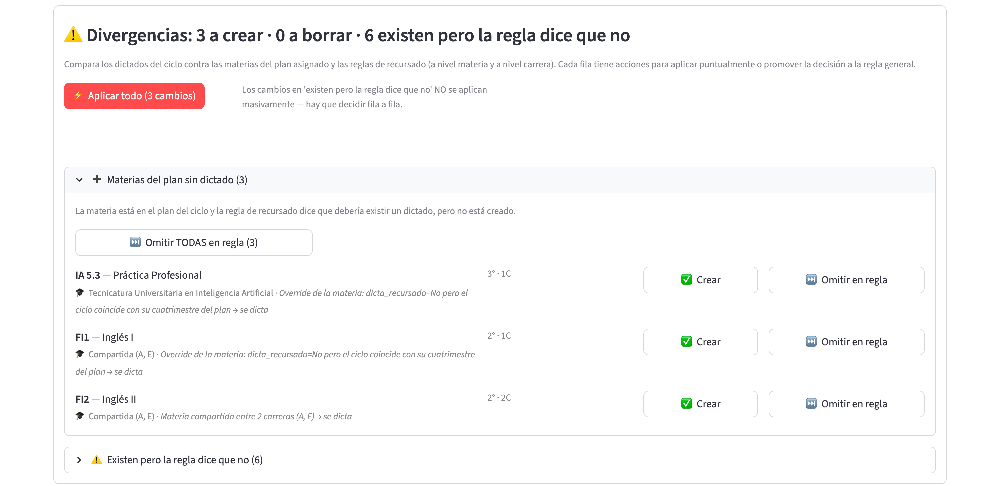

Cada fila ofrece sus propias acciones, y el botón **Aplicar todo** resuelve de una vez las que se pueden resolver en bloque.

**Paso a paso (resolver individualmente)**:

1. Abrí el desplegable de la sección que corresponda.
2. Para cada fila, tenés estas acciones:
   - **➕ Materias sin dictado**:
     - **✅ Crear**: crea el dictado ahora. Es una decisión
       excepcional (por ejemplo, la materia sí se dicta este ciclo
       aunque la regla general diga que no).
     - **⏭️ Omitir en regla**: cambia la regla de recursado de la
       materia para que en adelante se omita. **No crea nada en
       este ciclo**; sólo afecta ciclos futuros.
     - **⏭️ Omitir TODAS en regla (N)**: lo mismo, para todas las
       materias de la lista a la vez.
   - **🗑️ Dictados huérfanos**:
     - **🗑️ Borrar**: elimina el dictado.
   - **⚠️ Existen pero la regla dice que no**:
     - **🗑️ Borrar**: si fue un error, sacalo.
     - **⬆️ Promover a regla**: si en realidad la regla es la que
       está mal, cambiala para que la materia se dicte siempre. No
       cambia el dictado actual (ya existe), pero regulariza la
       situación.
     - **⬆️ Promover TODAS a regla (N)**: lo mismo, para todas las
       materias de la lista a la vez.

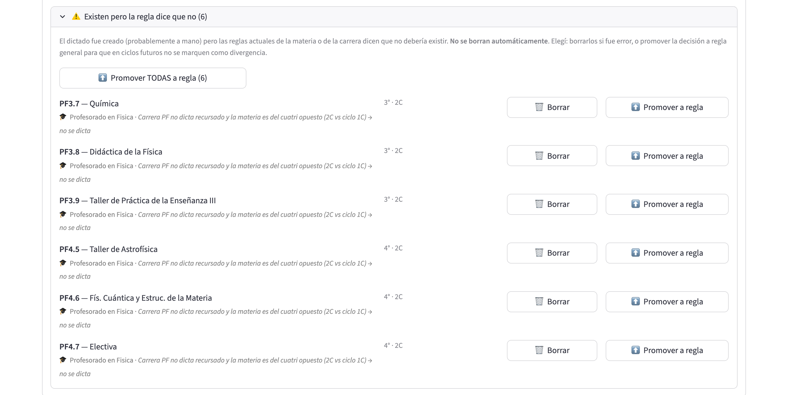

En este bloque cada fila se resuelve a mano, con **Borrar** o **Promover a regla**.

**Paso a paso (resolver todo en bloque)**:

Si las divergencias son muchas y son todas para crear o borrar:

1. En la parte de arriba del panel vas a ver el botón
   **⚡ Aplicar todo (N cambios)** (N suma las materias sin dictado
   y los huérfanos).
2. Apretándolo, el sistema crea todos los dictados faltantes y
   borra todos los huérfanos en un solo paso.
3. **No toca** la sección "Existen pero la regla dice que no":
   esa la tenés que resolver manualmente.

**Notas importantes**:

- **Promover u omitir en regla afecta a todos los ciclos futuros**,
  no sólo al actual. Las variantes en bloque (**Omitir TODAS en
  regla** y **Promover TODAS a regla**) piden confirmación: muestran
  un cartel de advertencia con los botones **✅ Confirmar (N)** y
  **🚫 Cancelar**. Las acciones fila por fila se aplican de
  inmediato.
- Estas acciones **quedan registradas en el historial** con el
  origen `ui:ciclos`, así que después podés rastrear quién cambió
  qué y cuándo.

### Marcar materias como virtuales para este ciclo

**Cuándo hacerlo**: cuando una materia que normalmente es presencial
se dicta virtual este cuatrimestre puntual (por ejemplo, la comisión
completa se pasa a Zoom por refacciones en el aula).

**Paso a paso**:

1. En la pestaña **📚 Dictados**, buscá la materia (usá los filtros
   por texto o por año del plan si son muchas).
2. En la fila de la materia (que ya tiene dictado), mirá el
   selector **Virtual** al final de la fila. Las materias sin
   dictado no lo muestran. Tiene tres opciones:
   - **Heredar**: usa lo que diga el catálogo de la materia.
   - **Virtual**: fuerza virtual este ciclo.
   - **Presencial**: fuerza presencial este ciclo.
3. Cambiá el valor al que corresponda.
4. Fijate que apareció un bloque **⏳ Cambios pendientes (N)** más
   arriba. Ahí ves una tabla (Materia, Atributo, Actual, Nuevo) con
   todo lo que estás por cambiar, y la fila queda marcada con
   `⏳ pendiente`.
5. Apretá **💾 Aplicar N cambio(s)**.

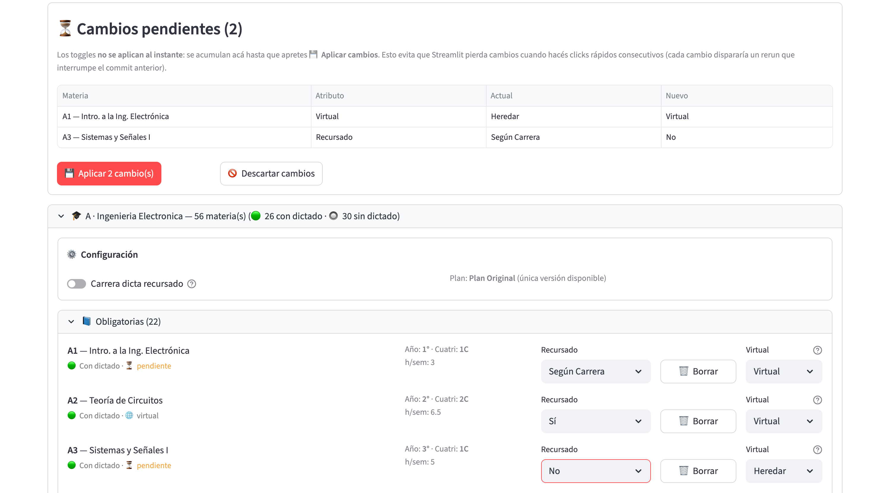

La tabla resume el valor actual y el nuevo de cada cambio; las filas afectadas quedan marcadas como pendientes hasta que se apliquen o se descarten.

**Verificación**: la fila muestra el nuevo estado y el bloque de
cambios pendientes desaparece.

**Notas importantes**:

- Los cambios **no se aplican al instante**: se acumulan en el
  bloque "Cambios pendientes" y los aplicás en lote. Esto es a
  propósito, para que no se pierdan cambios si hacés varios
  cambios rápidos seguidos.
- Si hay cambios pendientes, los botones **Crear Dictados** y
  **Sincronizar según reglas** no operan (muestran un cartel rojo)
  hasta que apliques o descartes.
- Si querés descartar los cambios pendientes, apretá
  **🚫 Descartar cambios**.
- Las filas de materias virtuales llevan la marca `🌐 virtual`.
  Los horarios individuales pueden marcarse como virtuales desde la
  grilla del plan de cursada.

### Corregir la regla de recursado

**Cuándo hacerlo**: cuando el sistema está "asumiendo mal" si una
materia se dicta como recursado o no. La regla se puede corregir a
dos niveles:

1. **A nivel materia**: el catálogo de la materia dice
   explícitamente si se dicta como recursado o "hereda" de la
   carrera.
2. **A nivel carrera**: si la carrera entera no dicta recursado, se
   define en el catálogo de la carrera.

**Paso a paso (corregir a nivel materia, por dictado)**:

1. En la pestaña **📚 Dictados**, buscá la materia.
2. En la fila, mirá el selector **Recursado**. Es un selector de
   tres estados: `Según Carrera`, `Sí`, `No`.
3. Cambiá el valor.
4. Apretá **💾 Aplicar N cambio(s)** en el bloque de "Cambios
   pendientes" cuando termines.

**Paso a paso (corregir a nivel carrera)**:

1. Abrí el desplegable de la carrera dentro de la pestaña de
   dictados.
2. En el bloque **⚙️ Configuración**, cambiá el interruptor
   **Carrera dicta recursado**. Este cambio se guarda en el acto
   (no pasa por "Cambios pendientes") y muestra un aviso emergente.
3. Apretá **🔄 Sincronizar según reglas** para alinear los dictados.

**Notas importantes**:

- La regla de recursado **afecta el próximo `Crear Dictados` o
  `Sincronizar según reglas`**. No borra ni crea nada por sí sola.
- Si querés ajustar el estado actual del ciclo, después de cambiar
  la regla apretá **🔄 Sincronizar según reglas** y aplicá el
  preview.

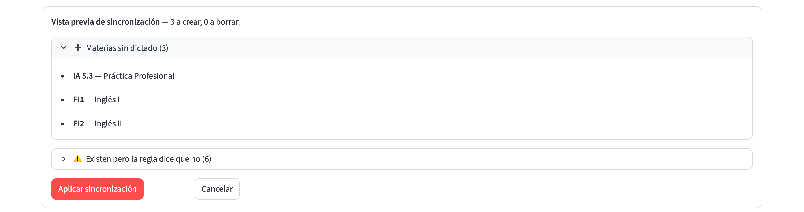

La vista previa lista lo que se va a crear o borrar (y, aparte, lo que existe aunque la regla diga que no, que se deja como está); recién al apretar **Aplicar sincronización** se modifica la base. **Cancelar** cierra la vista previa.

### Borrar un ciclo (con cascada: advertencia grande)

> ⚠️ **Atención: operación destructiva e irreversible**
>
> Borrar un ciclo elimina **absolutamente todo lo que cuelga de él**:
> los dictados, el o los cronogramas asociados, los planes de
> cursada derivados, las comisiones del plan, los horarios y las
> clases generadas. No hay confirmación ni vista previa: si
> apretás Eliminar, todo se va.
>
> **No borres un ciclo sin backup previo de la base**.

**Cuándo hacerlo**: cuando querés eliminar completamente un
cuatrimestre del sistema (por ejemplo, un ciclo de prueba, un ciclo
demo o un cuatrimestre viejo que ya no necesitás).

**Paso a paso**:

1. Andá a la pestaña **📋 Ciclos**.
2. En el bloque **Eliminar Ciclo**, elegí el ciclo del selector.
3. Apretá **Eliminar**.

El sistema **no pide confirmación**: el ciclo se elimina en el
acto.

**Verificación**: el ciclo desaparece de la tabla. Vas a ver el
cartel `Ciclo {ciclo_id} eliminado`.

**Qué se borra en cascada**:

- Planes de cursada del ciclo → sus clases, comisiones y horarios.
- Cronogramas asociados al ciclo → sus filas.
- Los cronogramas del ciclo, con sus filas y los conflictos
  ignorados, incluidos los auxiliares de importación.
- Los vínculos entre los dictados y el ciclo.

> **Para verificar:** la eliminación de ciclo sólo borra los
> vínculos dictado-ciclo; el código no borra la fila del dictado
> aunque no quede vinculada a otro ciclo (sí lo hace el botón
> **Borrar** de un dictado individual).
- La configuración de versiones de plan asignadas.
- El ciclo en sí.

**Qué NO se borra**:

- Las materias, carreras, aulas y planes de estudio del catálogo.
- Los dictados anuales que siguen vinculados al otro cuatrimestre.

## Errores frecuentes y qué hacer

### "Este ciclo no tiene versiones de plan asignadas"

**Síntoma**: en la pestaña Dictados aparece un cartel amarillo y no
te deja hacer nada.

**Causa**: creaste el ciclo sin marcar versiones de plan, o las
sacaste todas después.

**Solución**: hoy no hay un editor de versiones asignadas separado.
Tenés que borrar el ciclo y volver a crearlo con las versiones que
correspondan.

### "Tenés cambios pendientes sin aplicar"

**Síntoma**: al apretar **Crear Dictados** o **Sincronizar según
reglas** no pasa nada y aparece un cartel rojo.

**Causa**: cambiaste selectores de virtual o recursado y no
confirmaste esos cambios todavía.

**Solución**: subí al bloque **⏳ Cambios pendientes** y apretá
**💾 Aplicar N cambio(s)** o **🚫 Descartar cambios**.

### "No se pudo crear el dictado"

**Síntoma**: al apretar `✅ Crear` en una fila individual, aparece
un error.

**Causa habitual**: la materia no está en la versión de plan
asignada al ciclo. Puede pasar si cambiaste la versión de plan y
todavía hay materias huérfanas.

**Solución**: verificá desde el módulo de Planes de Estudio que la
materia esté efectivamente cargada en esa versión de plan.

### "La fecha de fin debe ser posterior a la de inicio"

**Síntoma**: al crear un ciclo, no te deja guardar.

**Solución**: revisá las fechas y corregilas.

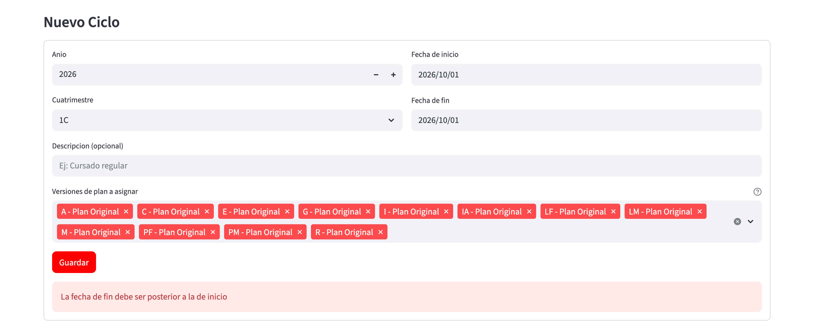

El mensaje aparece en rojo debajo del botón **Guardar**.

### El botón "Sincronizar según reglas" muestra un preview vacío

**Síntoma**: apretás sincronizar y no aparece nada para aplicar.

**Causa**: los dictados ya están perfectamente alineados con las
reglas actuales.

**Solución**: no hacés nada: la alineación es correcta. En lugar
de la vista previa ves el aviso `Los dictados del ciclo ya están
alineados.`

### Un dictado que borré vuelve a aparecer al `Crear Dictados`

**Síntoma**: borrás un dictado con `🗑️ Borrar` y al día siguiente
alguien apreta el botón de crear dictados y la materia vuelve.

**Causa**: `Crear Dictados` recorre el plan y crea los que la regla
autoriza. Si borraste el dictado pero no cambiaste la regla, el
próximo bulk create la va a recrear.

**Solución**: si querés que la materia **no se dicte definitivamente**
este ciclo, además de borrar el dictado tenés que promover a regla
`Omitir` (afecta ciclos futuros) o dejarla borrada y no volver a
apretar `Crear Dictados`.

## Preguntas frecuentes

### ¿Puedo tener más de un ciclo activo a la vez?

Sí, es normal tener el 1C y el 2C del mismo año cargados
simultáneamente. Cada ciclo maneja sus propios dictados,
cronogramas y planes de cursada.

### ¿Qué pasa con las materias anuales?

Las materias anuales generan **un solo dictado** que se vincula al
1C y al 2C del mismo año. Si borrás el dictado desde uno de los dos
cuatrimestres, sólo se rompe el vínculo con ese ciclo; el otro
sigue vivo. Sólo cuando se borran los dos vínculos, la fila del
dictado se elimina de la base.

### ¿Por qué no hay un botón de "activar/desactivar" el dictado?

Es una decisión de diseño del sistema: la existencia de la fila
*es* la activación. Si querés "desactivar" un dictado tenés que
borrarlo; para "reactivarlo" tenés que crearlo de nuevo. Suena
raro al principio, pero hace que el estado del ciclo sea siempre
inequívoco: no hay filas fantasma marcadas como inactivas.

### ¿Cuál es la diferencia entre "materia común" y "materia exclusiva"?

- **Exclusiva**: la materia se dicta en una sola carrera. Aparece
  en el desplegable de esa carrera.
- **Común**: la materia se comparte entre dos o más carreras (por
  ejemplo, Análisis I). Aparece en un solo lugar: el desplegable
  **🔗 Comunes** al final de la página.

En las materias comunes hay **un solo dictado** para todas las
carreras que la comparten. Si cambiás el selector Virtual o Recursado
en Comunes, el cambio afecta a todas las carreras donde esa
materia aparece.

### ¿Puedo clonar un ciclo entero para hacer pruebas?

Sí, pero **sólo desde línea de comandos** (no desde la interfaz).
Hay un script llamado `clonar_ciclo_para_demo.py` que se corre
desde la terminal. Este flujo lo maneja el equipo técnico:
generalmente no lo necesita un usuario final.

### ¿Qué es la "regla de recursado"?

Es una regla del catálogo que dice si una materia se dicta o no
como recursado en cada cuatrimestre. Se define a dos niveles:

- **Nivel carrera**: la carrera entera dicta o no dicta recursado.
- **Nivel materia**: la materia puntual se dicta como recursado
  aunque la carrera no lo haga (o al revés).

Cuando el sistema arma los dictados de un ciclo, respeta esta
regla y salta las materias que no corresponden.

### Si cambio la regla, ¿se aplica al ciclo actual?

**No automáticamente**. Cambiar la regla afecta a los ciclos
futuros (o al próximo `Crear Dictados` / `Sincronizar según
reglas`). Si querés aplicar el cambio al ciclo actual, apretá
**🔄 Sincronizar según reglas** y aplicá el preview.

### ¿Qué es una materia optativa?

Es una materia del plan de estudios marcada como no obligatoria en
el catálogo. En el módulo de Ciclos aparecen separadas de las
obligatorias adentro de cada carrera y podés filtrarlas con el
filtro "Optativas" (Incluir / Solo / Excluir).

## Términos importantes de este módulo

- **Ciclo**: cuatrimestre lectivo. Identificado por año +
  cuatrimestre (por ejemplo, `2026-1C`).
- **Dictado**: afirmación "esta materia se dicta en este ciclo".
  Es la unidad que activa una materia en un cuatrimestre.
- **Versión de plan de estudios**: la variante del plan curricular
  de una carrera que aplica al ciclo. Una misma carrera puede
  tener varias versiones (Plan Original, Plan 2023, etc.).
- **Regla de recursado**: regla del catálogo que dice si una
  materia se dicta como recursado o no. Se define a nivel materia
  y a nivel carrera.
- **Materia común vs exclusiva**: común si se comparte entre dos o
  más carreras; exclusiva si es de una sola.
- **Modalidad virtual jerárquica**: mecanismo por el cual la
  modalidad final de un horario resulta del "nivel más específico"
  entre materia, dictado y horario.
- **Panel de divergencias**: bloque de la pestaña Dictados que
  muestra la desalineación entre el plan, las reglas y los
  dictados cargados.
- **Sincronizar según reglas**: operación que recalcula qué
  dictados deberían existir y te muestra el diff antes de
  aplicarlo.
- **Cambios pendientes**: bloque que acumula selectores de
  Virtual/Recursado antes de aplicarlos en lote.
- **Promover a regla**: operación que cambia la regla de recursado
  a nivel materia. Afecta ciclos futuros, no el actual.
- **Omitir en regla**: operación inversa a Promover: le dice al
  sistema que a partir de ahora no dicte esa materia.
- **Dictado huérfano**: dictado que existe pero cuya materia ya no
  está en la versión de plan asignada al ciclo.
- **Cascada**: efecto por el cual borrar un ciclo elimina
  automáticamente todos los datos operativos que cuelgan de él
  (dictados, cronogramas, planes, clases).
