# Cursada: planes de cursada y asignación de aulas

> La página se llama **📊 Cursada** en el menú lateral (hasta 2026-09
> se llamaba "Planes"). El concepto sigue siendo el *plan de
> cursada*: este capítulo usa ambos términos.

## ¿Para qué sirve?

El **plan de cursada** es la "receta" concreta del cuatrimestre: qué
materias se dictan, en qué días y horarios, con qué comisiones, y en
qué aulas. Nace a partir de un cronograma ya validado y se convierte
en el documento vivo con el que se cierra la planificación del ciclo.

Este módulo también es donde se corre el **asignador de aulas**, la
herramienta que decide qué aula usa cada horario del plan. El
asignador mira todas las restricciones (tipos de aula, sedes por
carrera, choques, capacidad, inscriptos esperados) y elige la mejor
combinación posible. Si no puede resolver, te devuelve un
diagnóstico detallado explicando dónde está el problema.

Los dos temas están íntimamente ligados: el plan es la entrada del
asignador, y el resultado del asignador se guarda dentro del plan.
Por eso conviven en la misma página.

## ¿Cuándo vas a usar este módulo?

- **Después de validar un cronograma** como vigente para el ciclo:
  ese es el momento para generar el plan de cursada.
- **Al ajustar comisiones**: cambiar cupos, pesos, agregar o quitar
  horarios, asignar una carrera a una comisión específica.
- **Para correr el asignador de aulas**: siempre que quieras que el
  sistema resuelva qué aula usa cada horario.
- **Para revisar el resultado del asignador**: interpretar el mapa
  térmico por sede, la tabla por horario y, si hay problemas, el
  diagnóstico.
- **Para hacer ajustes finos post-asignación**: cambiar un aula a
  mano, marcar un horario como virtual, redistribuir pesos entre
  comisiones.
- **Para elegir el plan de trabajo** del ciclo: el plan que
  seleccionás en la barra lateral es el que muestran las demás
  pestañas.

## Cómo se relaciona con el resto

Este módulo es el **último eslabón del flujo**:

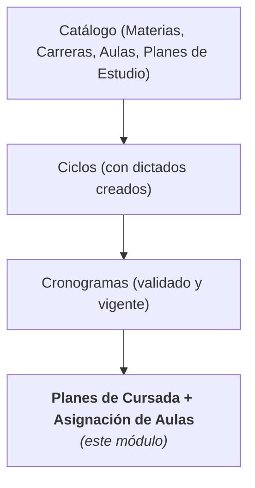
```mermaid
flowchart TD
    CAT["Catálogo (Materias, Carreras, Aulas, Planes de Estudio)"]
    CIC["Ciclos (con dictados creados)"]
    CRO["Cronogramas (validado y vigente)"]
    PLA["<b>Planes de Cursada + Asignación de Aulas</b><br/><i>(este módulo)</i>"]

    CAT --> CIC --> CRO --> PLA
```

- **Depende de**: Ciclos (con sus dictados) + Cronogramas (con al
  menos uno validado como vigente).
- **Consume**: Aulas (los recursos que asigna), Carreras y sus sedes
  habilitadas (las restricciones de sede), Inscriptos (para forecast
  de esperados).
- **Alimenta**: nada más. Es el módulo final del flujo. Todo lo que
  se produce acá (aulas asignadas, horarios ajustados) es el
  entregable operativo del cuatrimestre.

## Modelo mental (importante: leer antes de las tareas)

Este es el módulo más denso del sistema. Antes de meterte en las
pantallas, tomate unos minutos para entender estos conceptos clave.

### Cronograma vs Plan de cursada

Son dos entidades distintas aunque parezcan lo mismo.

- El **cronograma** es el modelo de base: una foto del cuatrimestre
  tal como llega desde la facultad. Es lo que subís y validás en el
  módulo de Cronogramas.
- El **plan de cursada** es una **copia viva y editable** del
  cronograma, específica de un ciclo. Cuando lo generás, el sistema
  duplica todas las comisiones y horarios del cronograma para que
  puedas trabajar sobre esa copia sin tocar el original.

En palabras concretas: **el cronograma es la receta**; **el plan de
cursada es la comida servida** que después vas ajustando y a la que
le asignás las aulas.

### Comisión modelo vs Comisión del plan

Las comisiones también existen en dos lugares:

- **Comisión modelo** (o "comisión del cronograma"): la que definiste
  al armar el cronograma. Sirve como plantilla.
- **Comisión del plan**: una copia de la comisión modelo, atada al
  plan de cursada. Es la que ves cuando editás cupos, carrera
  asignada, peso o descripción dentro del plan.

Cuando generás el plan, el sistema clona todas las comisiones modelo
del cronograma como comisiones del plan. **Modificar una comisión
del plan no afecta al cronograma origen** (y viceversa). Son ciclos
de vida independientes.

### Patrón semanal

El **patrón semanal** es lo que ves en la pestaña **📋 Horarios**:
"los lunes de 8 a 10 hay Análisis I comisión 1". Es la fuente de
verdad de la planificación y **es lo que el asignador de aulas
mira**: el aula se guarda directamente en cada horario del patrón.

Vos trabajás siempre sobre el patrón semanal: todo lo que hacés acá
(horarios, aulas, virtualidad) se edita sobre ese patrón.

### Qué es el asignador de aulas

El asignador es el motor que decide, para cada horario del plan, qué
aula del edificio le corresponde. Le pasás el plan tal como está y él
prueba todas las combinaciones posibles buscando la mejor. Por
"mejor" entiende:

- **Minimizar aulas chicas** para materias con muchos inscriptos
  (evitar sobre-ocupación).
- **Minimizar aulas gigantes** para grupos chicos (evitar
  sub-utilización, pero con más margen de tolerancia).

Además respeta reglas duras que no se pueden violar: cada horario
recibe exactamente un aula, el tipo de aula tiene que coincidir con
el tipo de clase (teórica en aula teórica, laboratorio en aula de
lab compatible), un aula no puede estar en dos lugares a la vez, y
el aula tiene que estar en una sede habilitada para la carrera.

Sin jerga: **le buscás un aula del edificio a cada horario y él te
devuelve la mejor asignación que encontró, o te avisa que no se pudo
y te muestra por qué**.

### Virtualidad jerárquica ("el nivel más específico manda")

Un horario puede ser presencial o virtual. La virtualidad se puede
declarar en tres niveles:

1. **A nivel horario individual**: "este horario específico es
   virtual" (por ejemplo, la teoría del jueves se da por Zoom, pero
   el laboratorio del viernes es presencial).
2. **A nivel dictado del ciclo**: "esta materia se dicta virtual en
   este ciclo" (por ejemplo, un recursado por Zoom).
3. **A nivel materia del catálogo**: "esta materia es siempre
   virtual".

La regla es simple: **el nivel más específico manda**. Si el
horario tiene una virtualidad seteada, se usa esa. Si no, se busca
en el dictado. Si tampoco, se cae en la materia. Un horario marcado
como virtual **no consume aula**: el asignador no le busca ninguna (igual cuenta para
las horas de teoría y laboratorio de la materia cuando «R4 estricta»
está activa).

## Recorrido rápido de la página

La barra lateral tiene, debajo del menú de páginas, el bloque
**📊 Contexto de Planes** con dos selectores:

- **Ciclo activo**: el ciclo con el que trabajás. Mientras no elijas
  uno, la página sólo te pide que lo hagas.
- **Plan activo**: el plan del ciclo sobre el que trabajan las
  pestañas de edición. Es simplemente el plan que tenés seleccionado
  en este momento; no es un estado que se guarde en el plan.

La página de Cursada se organiza en 5 pestañas:

1. **📋 Planes del ciclo**: listado de los planes del ciclo elegido,
   con acciones rápidas (seleccionar, eliminar, editar metadata). Al
   pie tiene el desplegable **➕ Generar plan nuevo desde un
   cronograma**.
2. **🔍 Detalle del Plan**: estadísticas, calidad del resultado,
   acciones del plan y panel de validaciones.
3. **📋 Horarios**: el patrón semanal del plan como calendario
   editable, con dos modos ("Por grupo" y "Por materia").
4. **🏛️ Aulas**: entrada del asignador de aulas. Acá lo configurás,
   lo corrés, y ves y ajustás el resultado.
5. **⚙️ Configuración**: parámetros globales de la grilla temporal
   (granularidad en minutos, hora de inicio operativo, días
   operativos).

Las pestañas **Detalle del Plan**, **Horarios** y **Aulas** sólo
aparecen cuando hay un plan elegido en **Plan activo**. Sin plan
seleccionado quedan únicamente **Planes del ciclo** y
**Configuración**.

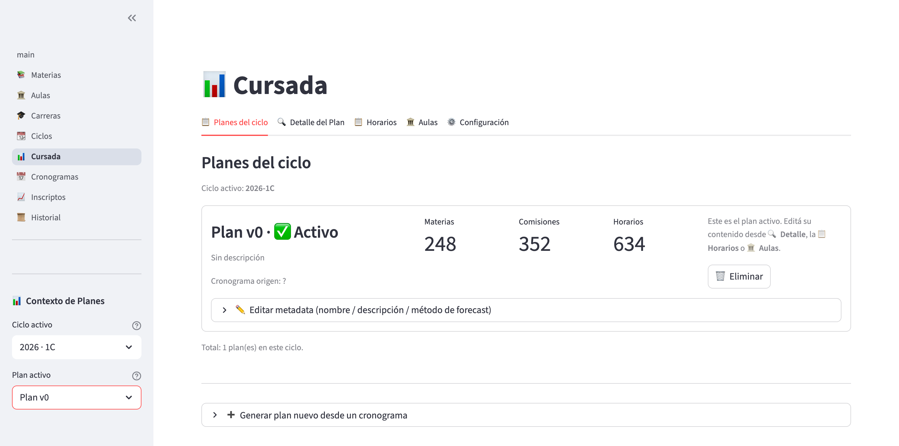

En la barra lateral se eligen el ciclo activo y el plan activo; las pestañas de la parte superior recorren las secciones de la página.

Cada pestaña se puede navegar independientemente, pero todas leen el
ciclo y el plan elegidos en la barra lateral.

## Tareas comunes

### Generar un plan nuevo a partir de un cronograma validado

El plan nace de un cronograma que ya está en estado **🟢 Validado y
vigente**. Si el cronograma no tiene ese estado, no lo vas a poder
elegir.

La generación está al pie de la pestaña **📋 Planes del ciclo**, en
el desplegable **➕ Generar plan nuevo desde un cronograma**. Si el
ciclo todavía no tiene planes, el desplegable aparece abierto. Trabaja
sobre el ciclo elegido en la barra lateral.

**Paso 1: Selección y creación del borrador**:

1. Abrí el desplegable **➕ Generar plan nuevo desde un cronograma**.
2. Elegí el cronograma en el selector **"Cronograma (solo validados y
   vigentes)"**. Los cronogramas que no están validados y vigentes
   no se pueden elegir: quedan listados, con su estado, en el
   desplegable **"Cronogramas no disponibles (N)"**. Si ninguno
   cumple, en lugar del selector ves el aviso **"Ningún cronograma
   del ciclo está validado y vigente. Andá a 📅 Cronogramas → ✅
   Validar para habilitar uno."** junto con la lista de los
   cronogramas y su estado. Si el ciclo no tiene cronogramas, el aviso
   es **"No hay cronogramas cargados para este ciclo. Cargá uno desde
   📅 Cronogramas."**
3. Poné un nombre al plan (el campo **"Nombre del plan"** viene
   sugerido como "Plan 2026-1C (Nombre del cronograma)"; no puede
   quedar vacío).
4. **"Descripción (opcional)"**.
5. Elegí el **"Método de forecast por defecto"** (método de
   pronóstico): "Media móvil", "Drift (lineal)" o "SES (α auto)".
   Si no tenés preferencia, dejá "Media móvil". Después se puede
   cambiar por plan o por materia.
6. Apretá **"Crear borrador y continuar →"**.

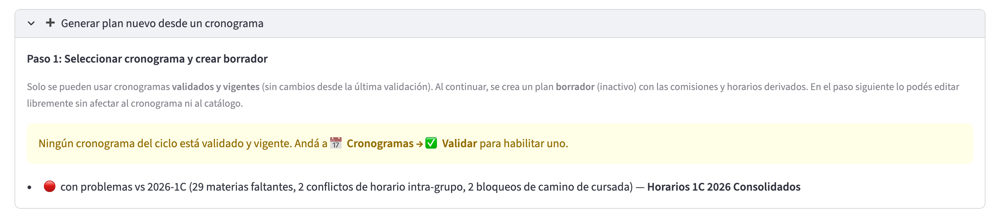

La captura muestra el caso en que ningún cronograma está validado y vigente: el formulario avisa que hay que validar uno antes de continuar.

El sistema clona en cascada todas las comisiones y horarios del
cronograma. Cuando termina, vas a ver un aviso del estilo `"Borrador
creado: 47 comision(es), 82 horario(s)."` y el desplegable pasa al
paso 2.

**Paso 2: Edición inicial**:

En este paso, el desplegable embebe el mismo editor que después vas
a usar en la pestaña **Detalle del Plan**, con el título "Editando:
*nombre del plan* (borrador inactivo)". Podés revisar validaciones,
ajustar comisiones o pesos que hayan quedado raros. Cuando estés
conforme, apretá **"✅ Confirmar y salir del wizard"** (así se llama el
botón en pantalla). Al confirmar, el plan queda
seleccionado como **Plan activo** en la barra lateral y un aviso te
invita a seguir desde **🔍 Detalle del Plan**.

> ⚠️ **Cuidado con "Cancelar"**: el botón **"🗑️ Cancelar (borra el
> plan)"** del paso 2 borra el plan borrador, con todas sus
> comisiones y horarios, **sin pedir confirmación intermedia**. Un
> click y se va. Si lo apretaste sin querer, no hay forma de
> recuperarlo: hay que volver a generar el plan desde cero.

Si cerrás la página sin apretar nada, el borrador queda persistido y
lo vas a ver aparecer en la lista de **Planes del ciclo**.

### Ver los planes existentes de un ciclo

Andá a la pestaña **📋 Planes del ciclo** (el ciclo es el elegido en
la barra lateral). Vas a ver una tarjeta por cada plan del ciclo,
con:

- **Nombre del plan**, con la marca **✅ Activo** si es el plan
  seleccionado en la barra lateral.
- **Descripción** (o "Sin descripción") y nombre del cronograma
  origen.
- **Métricas**: Materias, Comisiones, Horarios.
- **Acciones**: **Seleccionar** (sólo en los planes que no están
  seleccionados; lo deja como Plan activo) y **🗑️ Eliminar**. En el
  plan ya seleccionado, en lugar del botón "Seleccionar" ves un texto
  que te remite a Detalle, Horarios y Aulas.
- Un desplegable **✏️ Editar metadata (nombre / descripción / método
  de forecast)**.

Al pie de la lista figura el total: "Total: N plan(es) en este
ciclo."

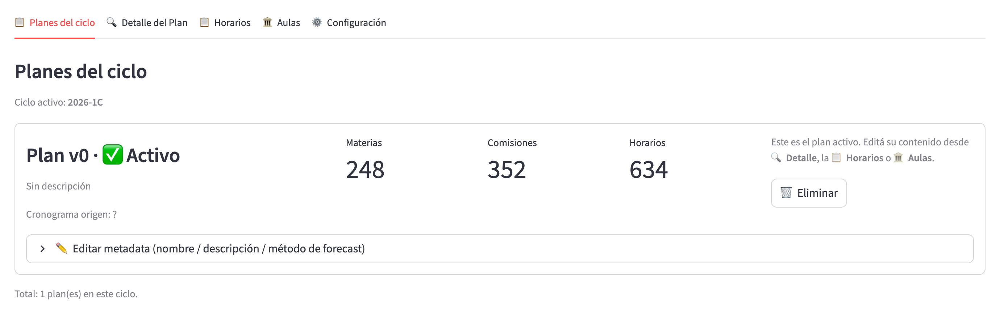

La tarjeta resume la cantidad de materias, comisiones y horarios del plan e indica si es el plan activo.

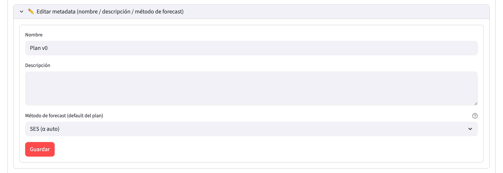

El formulario de edición tiene los campos **Nombre**, **Descripción** y
**"Método de forecast (default del plan)"**, y se confirma con
**Guardar**.

Podés tener varios planes por ciclo (útiles para comparar
escenarios). "Activo" significa sólo "el plan que estás mirando":
cambiarlo con **Seleccionar** no modifica los planes ni genera nada.

> ⚠️ **Eliminar borra sin confirmación**: el botón **"🗑️ Eliminar"**
> de cada tarjeta borra el plan y todo lo asociado (comisiones,
> horarios) sin pedir confirmación intermedia. Es destructivo. Antes
> de apretarlo, verificá dos veces cuál es el plan que estás por
> borrar.

### Editar los detalles de un plan

Elegí el plan en **Plan activo** (barra lateral) y andá a la pestaña
**🔍 Detalle del Plan**. Vas a ver, de arriba hacia abajo:

- **Cabecera**: nombre y descripción del plan, con una nota que indica
  que para renombrar o cambiar el método de pronóstico hay que ir a
  **📋 Planes del ciclo → ✏️ Editar metadata**; la metadata no se
  edita en esta pestaña.
- **Estadísticas**: 4 métricas rápidas (Materias, Comisiones,
  Horarios, Horarios con aula).
- **📊 Calidad del resultado**: un panel para evaluar de un vistazo
  qué tan bien resuelto está el plan, en cuatro bloques: **🎯
  Cobertura** (Asignados, Sin aula, En sede preferida, En sede
  alternativa), **⚖️ Ajuste al forecast de inscriptos**
  (Sobreocupados, Sobrecupo total, Subutilizados, Subutilización
  total, Ratio promedio, Mediana (P50), P90), **🏛️ Uso del catálogo
  de aulas** (Aulas usadas, Aulas ociosas, Con carga alta) y **🧮
  Estado del asignador y traslados intersede** (Última corrida, Valor
  del objetivo, Tiempo del solve, Traslados intersede).
- **🔧 Acciones del plan**: desplegable con acciones puntuales
  (auto-completar tipo de horarios, ver más abajo).
- **Validaciones**: panel con el interruptor **"Excluir optativas del
  cómputo"**, el interruptor **"Auto-revalidar al cambiar"** y el
  botón **"Validar plan"**. Debajo muestra el **Resumen de
  cobertura** (Materias, Clases, Horas plan, Esperadas, Cubiertas,
  Faltantes), la verificación de particiones teoría/laboratorio, el
  detalle por carrera y por materia, los conflictos de horarios y el
  camino de cursada. Cuando un conflicto es un falso positivo (por
  ejemplo, dos códigos de la misma materia según el año del plan),
  cada conflicto ofrece el botón **"🙈 Ignorar par … en este plan"**,
  con una razón opcional.

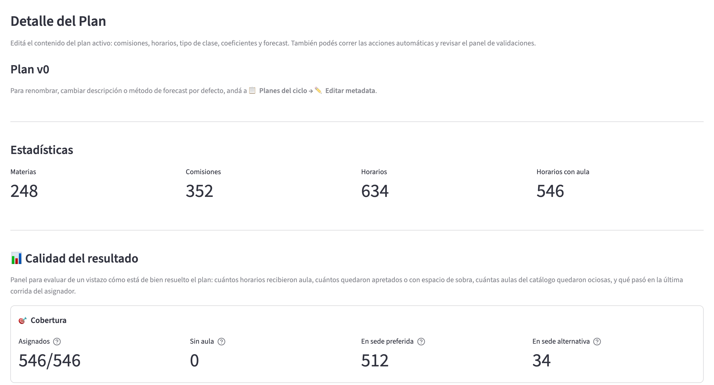

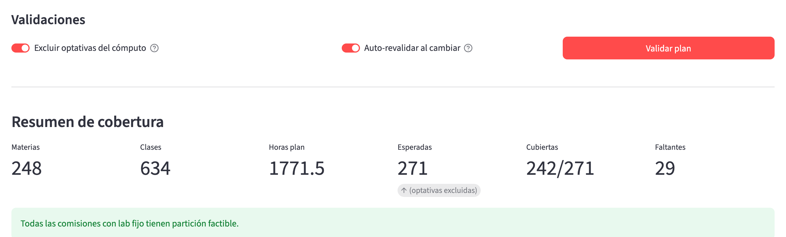

El panel de validaciones es donde vas a pasar la mayor parte del
tiempo cuando estés cerrando un plan.

### Ver y editar los horarios del plan (pestaña Horarios)

Andá a la pestaña **📋 Horarios**. En el bloque **🎛️ Modo de edición**
elegís entre dos modos de trabajo:

- **Por grupo**: filtrás por **Carrera**, **Año de cursada** y
  **Cuatrimestre** (los tres actúan como una combinación exacta del
  plan de estudio). Ves un calendario semanal editable con las
  comisiones del grupo, coloreadas por comisión. Podés arrastrar,
  redimensionar, hacer click sobre un bloque para editarlo, o
  seleccionar un rango vacío para crear un horario nuevo (antes hay
  que elegir la materia en **➕ Agregar horario a la grilla**). Los
  cambios se guardan al momento. Un multiselector **📋 Materias
  visibles en la grilla** permite sacar materias para reducir el
  ruido.
- **Por materia**: buscás una materia por código o nombre y la ves
  aislada, con:
  - Un calendario semanal con sus horarios.
  - La tabla editable **Entradas y comisiones** (horarios): columnas
    Día, Inicio, Fin, Comisión, Tipo y Virtual.
  - La tabla editable **Comisiones del plan para esta materia**:
    columnas N°, Nombre, Cupo, Coef, Carrera asignada y Descripción.

Además, un desplegable **📥 Exportar a Excel** genera un archivo con
lo que se ve en la grilla (hojas Metadata, Cronograma y Detalle).

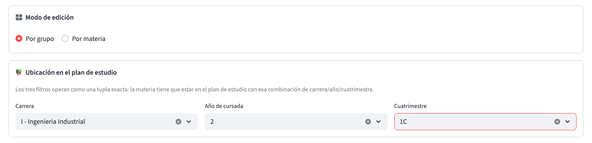

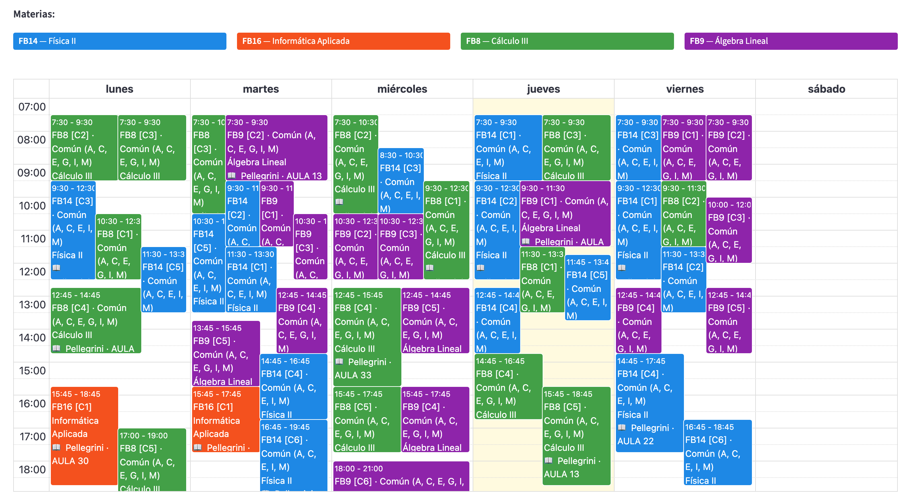

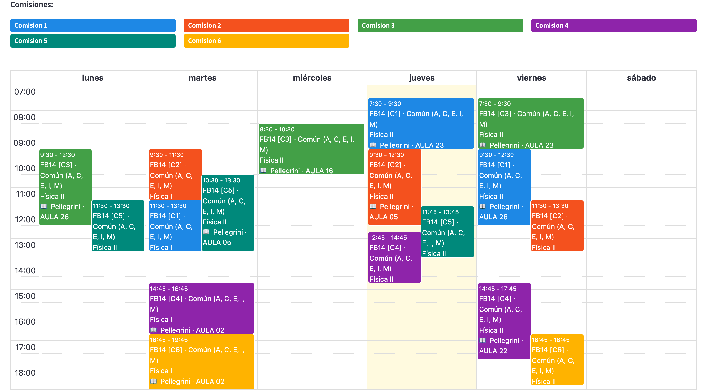

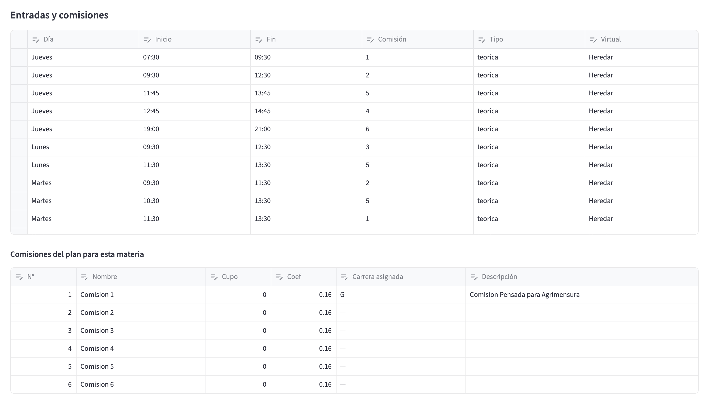

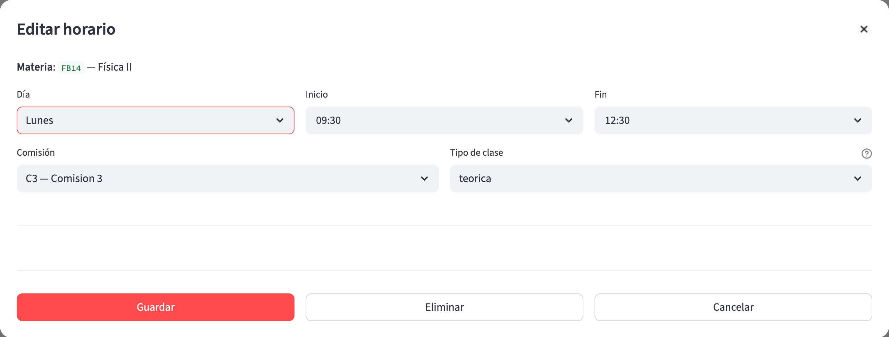

Al hacer clic en un bloque se abre este diálogo, donde se cambian el día, el horario de inicio y de fin, la comisión y el tipo de clase. Los botones son **Guardar**, **Eliminar** (borra el horario, sin pedir confirmación) y **Cancelar**.

Los dos modos comparten el mismo motor. En "Por grupo" trabajás
transversalmente; en "Por materia" te enfocás en una sola.

### Ajustar comisiones (cupo, carrera asignada, peso)

Las comisiones se editan desde la pestaña **📋 Horarios → modo Por
materia**, en la tabla **Comisiones del plan para esta materia**, con
estas columnas:

- **N°** y **Nombre**: identificadores administrativos.
- **Cupo**: el cupo declarado de la comisión. Es un número
  administrativo que **no** entra al asignador (el asignador usa
  capacidades de aulas e inscriptos esperados).
- **Coef** (el peso de la comisión): cuánto de la
  demanda total de la materia le corresponde a esta comisión. Los
  pesos de todas las comisiones de una materia deberían sumar 1.0.
- **Carrera asignada**: opcional, ver más abajo.
- **Descripción**: comentarios libres.

**Qué es "Carrera asignada"**

Por default, una comisión no está atada a ninguna carrera en
particular. Las sedes admisibles se resuelven automáticamente por la
materia (si es una materia exclusiva de una carrera, se usan las
sedes de esa carrera; si es una materia común, se usa la sede
default de comunes).

A veces esto no alcanza. Ejemplo típico: la materia "Física III" es
común a varias carreras, pero **una comisión específica** está
organizada especialmente para alumnos de Ingeniería Electrónica y
se dicta en Siberia (en vez de Pellegrini, la sede default de
comunes). En ese caso, seteás **carrera asignada = "electrónica"** en
esa comisión, y el asignador va a considerar sólo las sedes
habilitadas para esa carrera al buscarle aula.

Una comisión con carrera asignada afecta a **todos sus horarios**:
no podés tener "un horario de esta comisión en Pellegrini y otro en
Siberia". La comisión es la unidad de sede.

**Qué hace el "Peso"**

El peso decide cómo se reparten los inscriptos esperados entre las
comisiones. Si la materia tiene 120 inscriptos y hay tres
comisiones con pesos 0.5, 0.25 y 0.25, entonces el asignador espera
60, 30 y 30 alumnos respectivamente. Ese número es el que compara
contra la capacidad del aula para decidir sobre-ocupación o
sub-utilización.

El peso también entra en juego cuando activás la **redistribución
de pesos** (ver más abajo).

### Marcar horarios como virtuales (sin aula)

Un horario marcado como virtual no consume aula: el asignador no le
busca ninguna y no cuenta como demanda en el mapa térmico.

Hay dos formas de marcarlo:

1. **Desde la pestaña 📋 Horarios, modo "Por materia"**: en la tabla
   editable de horarios, cambiá la columna **Virtual** del horario a
   **Sí** (fuerza virtual), **No** (fuerza presencial) o **Heredar**
   (usa lo que diga el dictado o la materia). El diálogo "Editar
   horario" que se abre al hacer click en el calendario **no** tiene
   este campo.
2. **Desde el inspector de franja del asignador** (pestaña 🏛️ Aulas):
   cuando estás inspeccionando una franja saturada, cada horario
   listado tiene un botón **"✏️ Editar día/hora"** que abre el
   diálogo "Editar horario" con el desplegable **Virtual** (opciones
   Heredar, Sí, No).

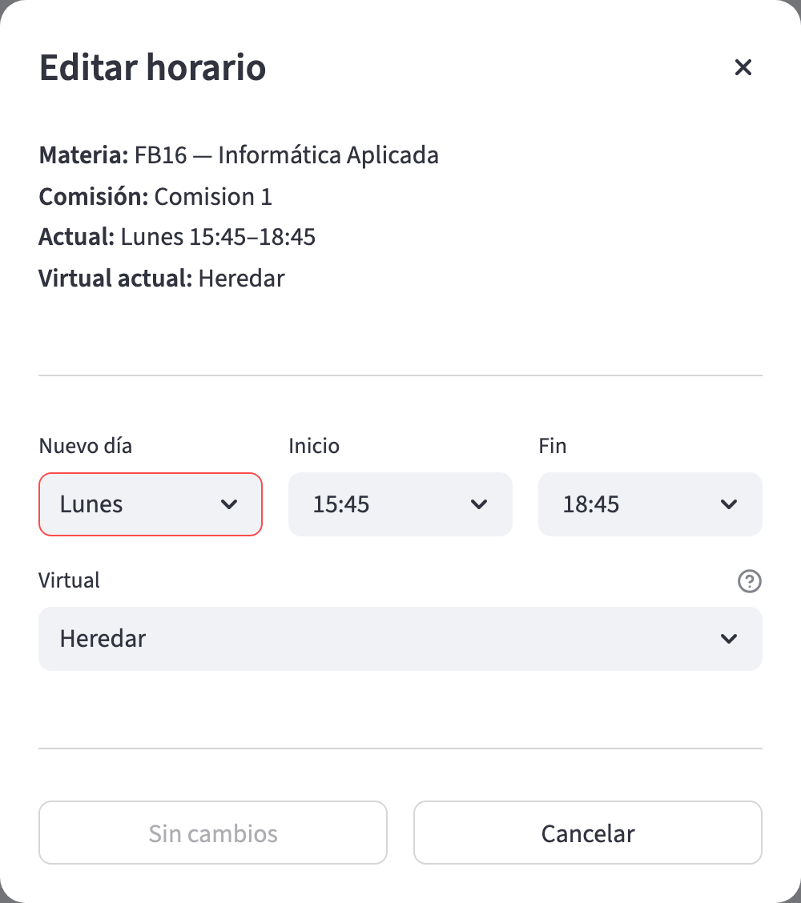

El diálogo muestra la materia, la comisión, el horario actual y el
valor de "Virtual actual", y permite cambiar **Nuevo día**, **Inicio**,
**Fin** y **Virtual**. Si cambiás el día o la hora, se muestra una vista
previa de las validaciones y de la saturación de la franja destino.
Los botones son **Sin cambios** (deshabilitado hasta que modifiques
algo), **Confirmar y aplicar** y **Cancelar**.

La segunda vía es especialmente útil cuando el asignador te dice
"no se pudo resolver" por saturación: marcás como virtual un
recursado por Zoom que estaba compitiendo por aula, y el problema
desaparece sin mover a nadie de horario.

Recordá que la virtualidad respeta la jerarquía: si marcás el
horario individual como virtual, gana ese nivel sobre el dictado y
la materia.

### Correr el asignador de aulas

Los pasos concretos:

1. Elegí el plan en **Plan activo** y andá a la pestaña **🏛️ Aulas**
   (título "Asignación de aulas").
2. Verificá que el plan tiene al menos un horario cargado. Si no,
   vas a ver el mensaje **"El plan no tiene horarios cargados.
   Agregá horarios desde el tab 📋 Grilla Horaria."** (la pestaña se
   llama hoy **📋 Horarios**). Si hay horarios con el tipo todavía sin
   determinar, aparece además una sugerencia (no bloquea) para usar
   **🔧 Acciones del plan → Auto-completar tipo de horarios**.
3. Abrí el desplegable **🏛️ Asignador de aulas** y, dentro, el
   desplegable **🚀 Correr la asignación (config + botón)**. Arriba
   del formulario tenés dos paneles opcionales:
   - **🔒 Asignaciones manuales protegidas (N)**: lista las aulas
     fijadas a mano (ver más abajo) y permite liberarlas. Sólo
     aparece con **"Respetar ediciones manuales"** activo.
   - **🚦 Chequeo de factibilidad estructural**: botón **"▶️ Chequear
     factibilidad"**. Es una verificación previa, antes de correr el
     asignador: detecta horarios sin aula compatible, franjas
     saturadas, particiones teoría/laboratorio imposibles, pares de
     laboratorios conflictivos y otros bloqueos. Muestra un semáforo
     (✅ sin bloqueos, o ❌ con la cantidad de bloqueos y un detalle
     por regla) y advertencias que no bloquean. Si el resultado es
     rojo, corregí los datos antes de correr el asignador: ya se sabe
     que no va a resolver.
4. Ajustá los parámetros de la **⚙️ Configuración del asignador**.
   Un desplegable **"¿Qué son las restricciones duras y las
   preferencias blandas?"** explica qué regla gobierna cada
   parámetro. Los parámetros están agrupados así:
   - **📅 Alcance temporal y ediciones manuales**:
     - **Aplicar desde la fecha**: por defecto hoy (o la fecha de
       inicio del ciclo si es futura).
     - **Respetar ediciones manuales** (por defecto activado): el
       asignador no pisa las aulas fijadas a mano.
   - **⚖️ Ajuste de capacidad al forecast**:
     - **Peso de sobre-ocupación (λ over)**: cuánto castiga poner una
       materia grande en un aula chica.
     - **Peso de sub-utilización (λ under)**: cuánto castiga poner un
       grupo chico en un aula gigante.
     - **Tolerancia de sobre-ocupación** y **Tolerancia de
       sub-utilización** (deslizadores): margen relativo antes de
       empezar a castigar.
   - **🏛️ Preferencias y restricciones de sede**:
     - **🧭 Modo por grupo**: para cada grupo de materias, elegís
       **DURO** (el asignador sólo admite las sedes del conjunto duro
       del grupo) o **BLANDO** (no filtra; prefiere la primera sede de
       la lista blanda del grupo). Los conjuntos se definen en
       **Materias → 📦 Grupos**.
     - **Peso de preferencia de sede blanda (λ sede)**: cuánto se
       respeta la sede preferida en los grupos en modo BLANDO.
     - **Margen mínimo entre sedes (minutos)**: si dos horarios
       contiguos de una comisión tienen un intervalo menor, quedan en
       la misma sede (0 desactiva la restricción).
     - **Forzar misma sede por comisión**: todos los horarios de una
       comisión caen en la misma sede.
   - **🛠 Configuración avanzada**:
     - **Tiempo máximo de resolución (segundos)**.
     - **R4 estricta (valida horas de teoría y de laboratorio)**:
       exige que las sumas de horarios de teoría y de laboratorio
       igualen las horas declaradas de la materia; los horarios
       virtuales cuentan para esas sumas aunque no ocupen aula.
       Apagada, sólo se valida el laboratorio (modo heredado).
     - **Peso de intersede blando (λ intersede)**: penalización extra
       por cada par de horarios contiguos de una comisión en sedes
       distintas; complementa al margen (que es una regla dura).
     - **Redistribuir pesos entre comisiones (experimental)**: ver
       más abajo.
5. Apretá **"🚀 Asignar aulas"**.
6. Aparece un indicador de progreso ("Asignando aulas…") mientras el
   asignador corre. Al terminar, la página se recarga con el
   resultado.

**Valores por defecto.** Un formulario sin corridas previas arranca con:
λ over 10, λ under 1, tolerancia de sobre-ocupación 0,00, tolerancia
de sub-utilización 0,20, λ sede 5, margen entre sedes 30 minutos,
"Forzar misma sede por comisión" apagado, tiempo máximo 300 segundos,
"R4 estricta" encendida, λ intersede 0 y "Redistribuir pesos" apagado.
**Cuando el plan ya tiene una corrida, el formulario se precarga con
los valores de la última corrida**, así que lo que ves puede ser
distinto (en las capturas, λ over 25, tolerancia de sobre-ocupación
0,10, de sub-utilización 0,35 y λ intersede 7).

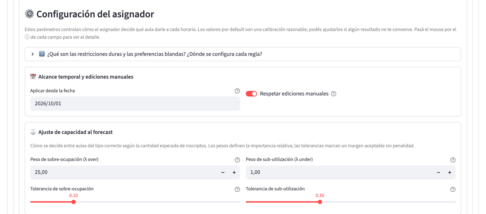

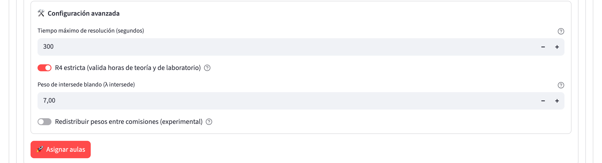

> ℹ️ **Sobre «Respetar ediciones manuales»**: cuando cambiás el aula
> de un horario a mano (ver "Cambiar manualmente el aula de un
> horario"), el diálogo de confirmación tiene una casilla **🔒
> Marcar como manual** (tildada por defecto). Las aulas marcadas así
> quedan protegidas: con este interruptor activado, el asignador no
> las modifica en las corridas siguientes. Se listan en **🔒
> Asignaciones manuales protegidas** y en la métrica **Manuales
> respetadas** del resultado. Si lo desactivás, el asignador vuelve a
> decidir todas las aulas desde cero.

> **Para verificar:** el efecto exacto de **Aplicar desde la fecha**
> (la ayuda del campo dice que lo anterior a esa fecha queda
> intacto, pero el plan se trabaja sobre el patrón semanal).

Cada corrida se guarda en el historial de corridas del plan (ver la
página **Historial**). La última corrida es la que se muestra por
defecto en la pestaña Aulas, y los parámetros de la última corrida
precargan el formulario.

### Interpretar un resultado "resuelto"

Cuando el asignador termina exitosamente vas a ver:

- Un aviso: **"Asignación resuelta en X.XXs. N horario(s)
  reasignado(s)."**
- Arriba, dentro del desplegable **🏛️ Asignador de aulas**, el estado
  **✅ resuelta** con la fecha de la corrida y un bloque **📋
  Veredicto de la corrida** (por ejemplo: "Plan resuelto. Se asignó
  aula a los 546 horarios presenciales (de 634 horarios totales, 88
  son virtuales y no toman aula)"), con el desplegable **⚙️
  Parámetros usados en esta corrida**.
- Un bloque de **métricas**:
  - **Horarios totales / Asignados**: los asignados corresponden a los
    horarios presenciales; los virtuales no toman aula.
  - **Horarios reasignados**: cuántos horarios cambiaron de aula en
    esta corrida.
  - **Sobre-ocupados**: horarios que quedaron con aula más chica que
    los esperados.
  - **Sub-utilizados**: horarios con aula demasiado grande.
  - **Costo total**: la suma ponderada que el asignador minimizó.
  - **Tiempo de resolución (s)**.
  - **Manuales respetadas**: aulas fijadas a mano que la corrida no
    modificó.
- Un desplegable **⚙️ Configuración aplicada** con los parámetros
  usados.

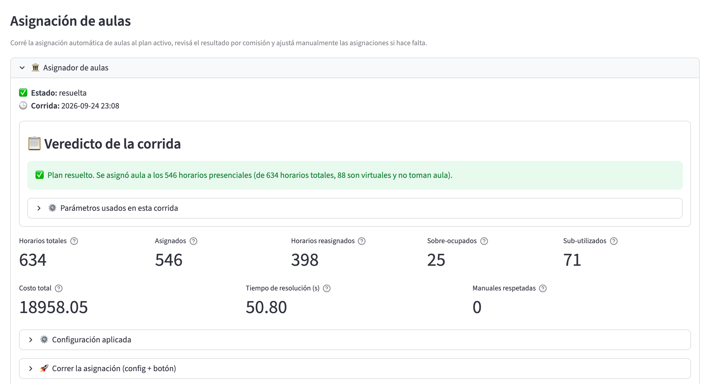

Más abajo, el desplegable **📊 Estado de asignaciones y mapa de
saturación** reúne las herramientas de análisis. Funciona en dos
momentos: antes de correr el asignador sirve para analizar si el plan
es factible, y después de correrlo suma el detalle del resultado.
Arriba tiene cinco métricas en vivo: **Asignados**, **Sobre-ocupados**,
**Colisiones** (aulas pisadas), **Manuales protegidos** y
**Desactualizados** (horarios cuya aula ya no es admisible según las
reglas vigentes; si hay, un aviso lo detalla). Después:

- **🔥 Mapa térmico por sede**: para cada sede, una grilla día × franja
  de 15 minutos que muestra qué tan cargada está. Los controles son:
  - **Modo**: **🎯 Saturación (demanda proyectada por reglas)**, para
    planificar la corrida, u **📊 Ocupación (estado actual del
    plan)**, que muestra cómo está ocupado el plan hoy.
  - **Vista** (sólo en modo Saturación): **🔒 Dura** (horarios cuya
    única sede admisible es esa; si supera la oferta, la sede es
    infactible), **🎯 Preferida** (horarios cuya sede preferida es
    esa; el "plan feliz"), **📈 Máxima** (todo horario que podría caer
    en esa sede) y **🌐 Total sin sede** (simultáneos ignorando la
    sede: una cota global).
  - **Categoría**: **Peor caso (T o L)**, **Teóricas / anfiteatros** o
    **Laboratorios**.
  - **Oferta de labs a considerar** (al mirar laboratorios): **🌐
    Todo el catálogo** o **🧪 Sólo compatibles (labs)**, que detecta
    faltantes estructurales de laboratorios compatibles.
  - Cada sede se despliega con un resumen (por ejemplo, "Pellegrini ·
    25 teórica(s) · 5 laboratorio(s) · peor 22/25 (0.88)") y un
    semáforo:
    - 🟢 verde: ≤80% de ocupación
    - 🟡 amarillo: 80–100%
    - 🔴 rojo: >100% (saturación segura, hay más horarios que aulas)
  El mapa se recalcula en vivo, así que si marcás un horario como
  virtual, se actualiza sin correr el asignador de nuevo.
- **🔍 Ver detalle de una franja** (inspector de franja, en modo
  Saturación): elegís **Sede**, **Tipo de aula**, **Día** y el rango
  de franjas (**Desde** / **Hasta**, de 15 minutos), y ves en un
  calendario los horarios que compiten por esa franja, coloreados por
  carrera. Un interruptor **📋 Detalle de horarios (N)** lista cada
  horario, paginado, con el botón **"✏️ Editar día/hora"**. En modo
  Ocupación, el interruptor equivalente es **🏛 Ver aulas libres en
  una franja**.

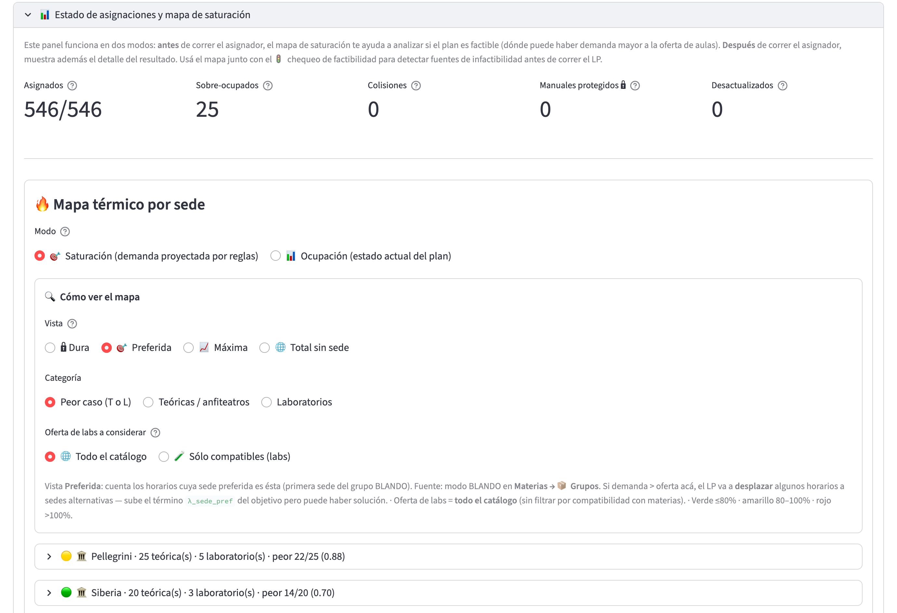

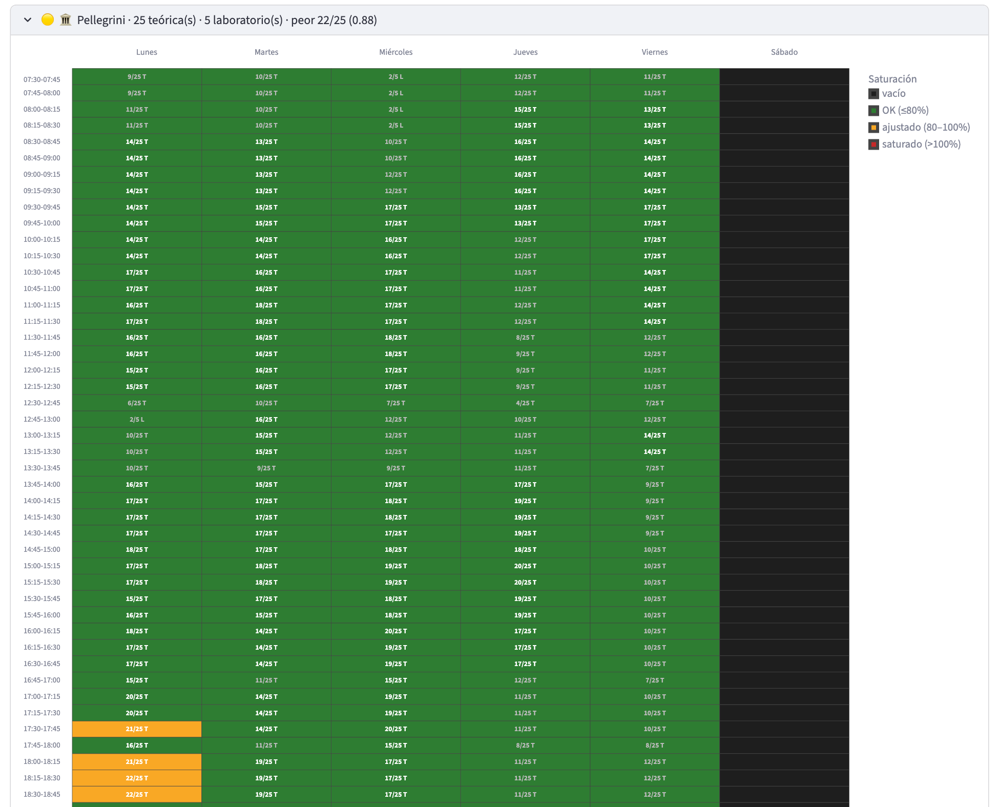

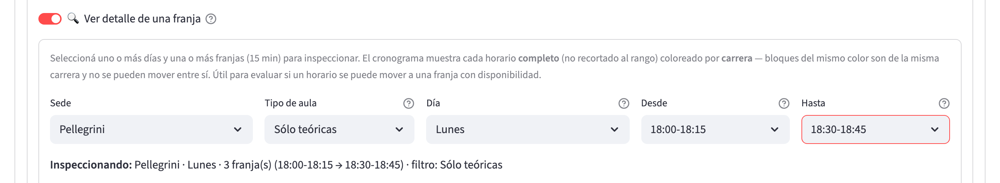

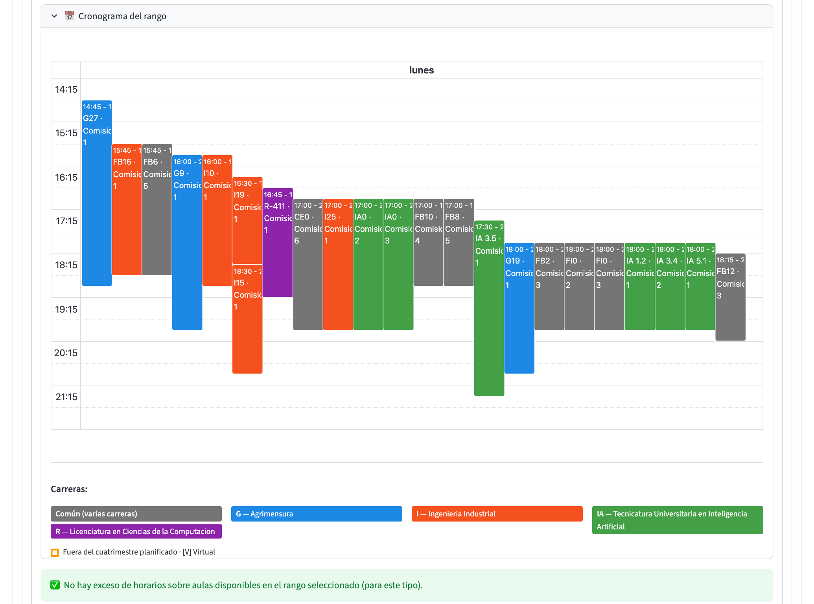

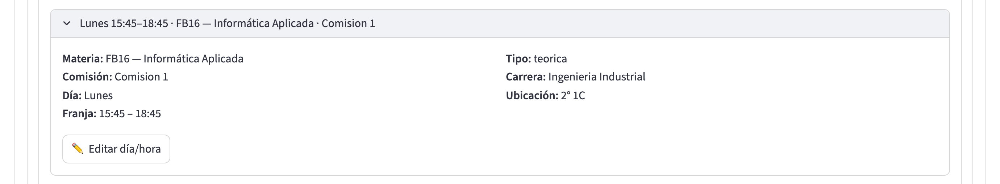

Con el interruptor **📋 Ver detalle por horario** aparece una **tabla
por horario** con las columnas Materia, Comisión, Día, Inicio, Fin,
Aula, Sede, Manual (🔒 si el aula está protegida), Cap, Esperados, Δ y
Estado. Refleja la asignación vigente, incluidos los cambios manuales
posteriores a la corrida. La columna Estado usa colores:

- 🟢 **ok**: el aula alcanza cómodamente.
- 🟡 **sub** (sub-utilizado): aula demasiado grande respecto a los
  esperados, fuera de la tolerancia.
- 🔴 **sobre** (sobre-ocupado): aula chica, los esperados exceden
  la capacidad.

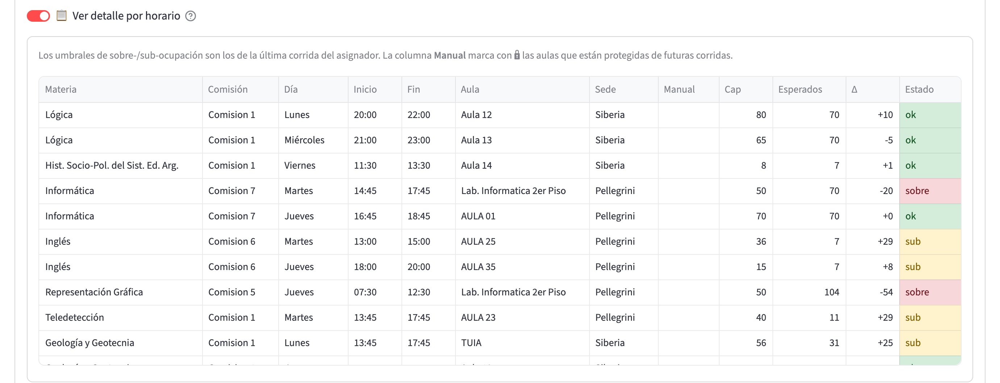

Y el interruptor **🪓 Ver candidatas a partir comisión** muestra una
tabla (columnas Materia, Comisiones_sobreocupadas, Total_exceso) con
las materias que podrían beneficiarse de tener más comisiones (cuando
el exceso se concentra en pocas comisiones grandes).

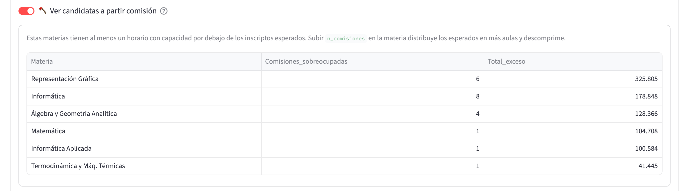

### Interpretar un resultado "no se pudo resolver"

Este es el caso más difícil de interpretar y donde más ayuda
necesita el usuario. Vas a ver:

- El status humano: **❌ no se pudo resolver** (o **⏱️ se agotó el
  tiempo**, semánticamente similar).
- Un mensaje concreto en la parte superior.
- **Nada se persiste**: las aulas del patrón quedan como estaban.

Debajo aparece el **diagnóstico**, que puede tener hasta cinco
secciones, presentadas en orden de utilidad para el usuario. Leelas
en orden: la primera que muestre contenido suele ser suficiente
para entender el problema.

#### 1. Horarios sin aula compatible

La causa más simple: existe un horario que **ninguna aula del
sistema** puede cubrir. Se muestra la materia, día, franja, tipo y
la razón concreta (por ejemplo: "no hay laboratorios compatibles
cargados para esta materia" o "no hay aulas de tipo laboratorio en
las sedes admisibles").

**Qué hacer**:

- Si es un lab: cargá los laboratorios compatibles desde el módulo
  de Materias.
- Si es un tipo mal seteado: marcá el horario como teoría (o al
  revés) desde la grilla.
- Si faltan aulas: dá de alta el aula desde el módulo de Aulas y
  Sedes.

#### 2. Franjas con faltante de aulas de un tipo específico

En una franja concreta hay más horarios de un tipo (por ejemplo,
laboratorios) que aulas de ese tipo disponibles en las sedes
admisibles. Se muestra el día, franja, tipo problemático, cuántas
necesitás vs cuántas hay disponibles, y las materias involucradas.

**Qué hacer**:

- Marcar como virtual algún dictado que sea recursado por Zoom.
- Agregar aulas del tipo faltante.
- Ampliar la lista de laboratorios compatibles de alguna materia
  para que pueda usar aulas alternativas.
- Mover algún horario a otra franja donde haya menos competencia.

#### 3. Cuellos de botella (grupos de simultaneidad)

Aparece un grupo chico de clases simultáneas que comparten una
lista **también chica** de aulas compatibles. Aunque en el edificio
haya muchas aulas en total, este subgrupo específico no logra
distribuirse sin choques. Se muestran las aulas exactas del cuello
de botella.

**Qué hacer**: mirar las aulas listadas y pensar qué falta:
laboratorios compatibles nuevos, alguna materia que se pueda mover
a otro momento, o compartir aulas de otra sede.

#### 4. Franjas saturadas globalmente

Una cota más gruesa que las dos anteriores: en tal franja horaria,
la cantidad total de horarios simultáneos supera la cantidad total
de aulas disponibles, sumando todos los tipos. Se muestra el
desglose (cuántas teóricas, cuántas de lab, cuántas sin tipo
definido).

**Qué hacer**: descomprimir la franja. Marcar virtualidades,
reprogramar algún horario, o ampliar el pool de aulas.

#### 5. Diagnóstico cruzado

Sólo aparece cuando las cuatro secciones anteriores están vacías
pero el asignador **igual** dijo que no se pudo resolver. En ese
caso, el sistema hace un análisis extra: prueba relajar cada
restricción una a una y ve cuál, al ignorarse, permite resolver.
Esa es la causa probable, y se muestra en rojo (por ejemplo,
"Causa probable: choques temporales entre horarios").

**Qué hacer**: leer con atención qué tipo de restricción es la
sospechosa y actuar sobre ella. Si la causa es "combinada" (nada
individual resuelve), significa que hay que descomprimir por más de
un lado.

**Consejo general**: aún con un resultado infactible, el **mapa de
saturación por sede** y el **inspector de franja** siguen
funcionando. Son las mejores herramientas para navegar y encontrar
la franja concreta que hay que descomprimir. Marcar como virtual un
horario desde el inspector suele ser el arreglo más rápido cuando
el problema es un recursado por Zoom compitiendo por aula.

### Cambiar manualmente el aula de un horario

> Guía paso a paso, con capturas y el detalle de la cascada: [Flujo 5: Reasignar un aula manualmente](../flujos/05_Reasignar_un_aula_manualmente.md).

Las aulas se cambian a mano desde el desplegable **🛠️ Gestión de
asignaciones** de la pestaña **🏛️ Aulas**, sección **📅 Aulas
asignadas por horario**:

1. Si hay aulas pisadas, arriba aparece el aviso **"🚨 N colisión(es)
   de aula"**, con un botón **"🧹 Liberar aula de …"** por cada
   horario involucrado. Liberar deja el horario sin aula para que la
   próxima corrida lo reasigne.
2. Un desplegable **🎛️ Filtros** permite acotar la lista por sede y
   aula, carrera / año del plan / cuatrimestre del plan, tipo de clase,
   día, materias compartidas entre carreras y búsqueda por código o
   nombre; además las casillas **Sólo sin asignar**, **Excluir
   virtuales** y **Mostrar cronograma** (calendario de los horarios
   filtrados). Los filtros se aplican con **✅ Aplicar filtros** y se
   restablecen con **🔄 Limpiar**.
3. La lista de horarios está paginada (**Por página**, **Página**).
   Cada horario es un desplegable; adentro ves sus datos y los
   controles de edición: **Tipo de clase**, **Aulas a mostrar** y
   **Aula asignada**. El selector de aula lista las aulas compatibles.
4. Cuando cambiás algo aparece el botón **"Ver cambio propuesto"**, que
   abre el diálogo **Confirmar cambio de aula** con el **Resumen del
   cambio** y la **Vista antes / después por aula**. El sistema
   verifica compatibilidad de tipo, sede admisible y choques con otros
   horarios del plan antes de dejarte confirmar.

Otra vía para mover un horario de día u hora es la pestaña
**📋 Horarios** o el botón **"✏️ Editar día/hora"** del inspector de
franja.

#### Elegir el aula: "Aulas a mostrar"

El selector **"Aulas a mostrar"** tiene dos opciones:

- **Sólo aulas libres en esta franja** (por defecto): el desplegable
  **Aula asignada** muestra únicamente las aulas compatibles que no
  están usadas por otro horario del plan en la misma franja. También
  podés elegir **Sin asignar**.
- **Todas las aulas (incluidas las ocupadas)**: además de las
  libres, incluye las que están ocupadas por otro horario del plan,
  con una etiqueta según cuántos horarios están afectados.

Si elegís un aula libre, el flujo es directo: **Ver cambio propuesto**
y después **Confirmar**.

**Si elegís un aula ocupada** (sin importar si hay 1 ó N horarios
afectados y sin importar si sus franjas coinciden exactamente o
sólo se solapan parcialmente), se despliega un **flujo de cascada**:

- Debajo del selector principal aparece un **bloque por cada
  horario afectado**, indicando materia, comisión, día/hora y el
  rango en común con el horario editado.
- Cada bloque tiene su **propio selector de aula**. Podés elegir:
  - Una aula libre para ese horario desplazado.
  - Otra aula ocupada (la cascada se profundiza: aparecen los
    bloques de los nuevos afectados).
  - Dejar sin aula.
- Si querés simplemente **intercambiar aulas**, elegí para el
  horario desplazado el aula que tenía originalmente el editado.
  El sistema lo trata como una reasignación más, sin una
  opción "swap" separada.

**Ejemplo de cascada de 2 niveles**: editás MAT que estaba en A-101 y
elegís A-102. En A-102 hay FIS. Para FIS elegís A-103, pero en A-103
hay QUI. Aparece un nuevo bloque para QUI, donde podés dejarlo sin
aula o buscarle otra. Cuando todos los bloques tienen decisión
tomada y las validaciones dan verde, abrís el diálogo de confirmación
y se aplica todo en una única operación atómica.

#### Solapamientos parciales

Si un horario afectado tiene una franja que se solapa **parcialmente**
con el horario editado (no la misma franja completa), aparece un
**aviso** en el resumen indicando que sólo parte del horario queda
cubierta. El sistema no bloquea el cambio pero te avisa para que
verifiques manualmente si es aceptable.

#### Resumen del cambio y casilla "Marcar como manual"

El diálogo **Confirmar cambio de aula** muestra la lista completa de
horarios afectados en orden: el editado primero, después sus
desplazados directos, después los desplazados de los desplazados, y
así. Cada tarjeta muestra:

- ✅ si todo cierra.
- ⚠️ si hay avisos (típicamente solapamientos parciales).
- ❌ si hay incompatibilidades duras (aula de tipo distinto, sede no
  admisible, laboratorio no compatible).
- "Antes" y "Después" del aula, y la casilla **🔒 Marcar como
  manual**, tildada por defecto: si queda tildada, el asignador
  respeta esa aula en corridas futuras mientras **"Respetar ediciones
  manuales"** esté activo. Destildala si querés que el asignador
  pueda volver a decidirla.

El botón **Confirmar** queda deshabilitado si algún horario tiene ❌.
Corregí las elecciones antes de continuar. Si sólo hay ⚠️, podés
confirmar igual: el sistema respeta tu criterio. **Cancelar** descarta
el cambio.

#### Detección de ciclos

Si accidentalmente armás una cadena que vuelve a un horario ya
decidido (por ejemplo, MAT desplaza a FIS, y FIS termina asignándose
a la aula original de MAT en un sub-paso), el sistema detecta el
ciclo y muestra un error indicando cuál es la cadena problemática.
Cambiá alguna decisión para romper el ciclo.

#### Aplicación atómica

Cuando apretás Confirmar, todos los cambios se aplican en una **única
transacción**. Si alguno falla en el proceso, se revierte todo lo
aplicado hasta ese punto: el plan queda exactamente como estaba
antes de abrir el diálogo. Nunca vas a quedar en un estado a mitad
de camino.

En el mismo panel, un desplegable lista los horarios asignados **fuera
de la sede preferida** de su grupo (sólo para grupos que se corrieron
en modo BLANDO).

> ⚠️ **Después de mover horarios en la pestaña Horarios**: el aula que
> el asignador había puesto queda pegada al horario, y si el nuevo
> día/hora ya tenía otra clase con esa misma aula, quedan dos
> horarios pisándose (el panel de aulas lo marca como colisión). La
> política correcta es **liberar el aula o volver a correr el
> asignador** después de mover horarios. El asignador re-arma todo y
> detecta cualquier inconsistencia. Si hay choques residuales, te lo
> va a decir con un diagnóstico claro.

### Redistribuir los pesos entre comisiones (redistribución de
pesos)

Los pesos de las comisiones se cargan al armar el cronograma y se
copian al plan (columna **Coef**). A veces es difícil elegir bien esos
pesos a mano, por ejemplo cuando querés que el asignador reparta
los inscriptos de forma que las aulas queden más balanceadas.

Para eso existe el interruptor **"Redistribuir pesos entre comisiones
(experimental)"** en la **🛠 Configuración avanzada** del asignador.
Cuando lo activás, el asignador propone **nuevos pesos** para cada
comisión además de asignar aulas.

Cómo funciona en la práctica:

1. Activás el interruptor antes de correr el asignador.
2. Corrés el asignador normalmente.
3. Si resuelve, el resultado incluye, dentro del análisis del
   resultado, la tabla **🔄 Pesos propuestos para redistribuir
   capacidad** (columnas Materia, Comisión, Peso actual, Peso
   propuesto y Δ) además de la asignación de aulas.
4. Tenés dos botones: **"Aplicar nuevos pesos"** o **"Descartar
   propuesta"**.
   - Si aplicás: los pesos nuevos se guardan en las comisiones y la
     asignación de aulas queda como está.
   - Si descartás: se conservan los pesos viejos, pero las aulas que
     estás viendo se calcularon con los pesos nuevos, así que pueden
     no ser óptimas para los pesos que quedaron. Si querés coherencia,
     volvé a correr el asignador con la redistribución desactivada.

Es una función experimental. Recomendable sólo si tenés experiencia
con la asignación y querés probar distintas redistribuciones.

### Seleccionar el plan de trabajo

Lo que la interfaz llama **Plan activo** es simplemente el plan que
elegiste para trabajar:

- Desde la barra lateral, con el selector **Plan activo**.
- Desde la pestaña **📋 Planes del ciclo**, con el botón
  **Seleccionar** de la tarjeta.
- Automáticamente, al confirmar la generación de un plan nuevo.

Seleccionar un plan no cambia nada en los datos: sólo determina sobre
cuál plan trabajan **Detalle del Plan**, **Horarios** y **Aulas**.
El entregable del cuatrimestre es el patrón semanal del plan con sus
aulas asignadas.

### Borrar un plan

Desde la pestaña **📋 Planes del ciclo**, cada tarjeta de plan tiene un
botón **"🗑️ Eliminar"**. El borrado es en cascada: se borran los
horarios del plan, las comisiones del plan y
el plan en sí. Si borrás el plan seleccionado, el selector **Plan
activo** queda sin plan.

El cronograma origen **no se toca**. Podés generar un plan nuevo a
partir del mismo cronograma cuando quieras.

> ⚠️ **Advertencia**: el borrado es **inmediato y sin confirmación
> intermedia**. Un solo click y el plan desaparece. Antes de
> apretar el botón, verificá dos veces que estás sobre el plan
> correcto.

### Auto-completar tipos de horarios (teoría/laboratorio)

Cuando el cronograma se subió, algunos horarios pueden haber
quedado sin tipo definido (ni teoría ni laboratorio). El sistema
tiene una acción rápida para inferir el tipo automáticamente cuando
la materia lo permite:

- Si la materia declara sólo horas de teoría (`hteo > 0`,
  `hlab = 0`) → todos sus horarios se marcan como **teoría**.
- Si la materia declara sólo horas de laboratorio → todos como
  **laboratorio**.
- Si tiene ambas, no se puede auto-completar (se necesita decisión
  humana).

Andá a la pestaña **🔍 Detalle del Plan → 🔧 Acciones del plan → ✏️
Auto-completar tipo de horarios por materia**. Vas a ver una vista
previa que te dice cuántos horarios cambiarían y a qué tipo (con el
detalle desplegable). Si te convence, apretá **"✅ Aplicar
auto-completado (N cambios)"**.

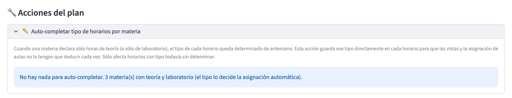

No es una acción crítica: el asignador aplica esta misma inferencia
en memoria de todas formas antes de correr. Aplicarla en firme
sirve para que **otras vistas** (mapa térmico filtrado, editor por
materia, validaciones) muestren el tipo correcto en vez de "sin
determinar".

## Errores frecuentes y qué hacer

**"Seleccioná un ciclo activo en el panel lateral para empezar."**

No elegiste ciclo en la barra lateral. Si no hay ciclos, creá uno
desde **📆 Ciclos** (en la barra lateral: "No hay ciclos registrados.
Creá uno desde la página de Ciclos.").

**"No hay cronogramas cargados para este ciclo. Cargá uno desde 📅
Cronogramas."**

El ciclo existe pero no hay cronogramas subidos. Andá a **📅
Cronogramas → 📤 Cargar**.

**"Ningún cronograma del ciclo está validado y vigente. Andá a 📅
Cronogramas → ✅ Validar para habilitar uno."**

Hay cronogramas pero ninguno está en estado 🟢. Andá a validarlo
desde el módulo de Cronogramas.

**"No hay planes cargados en este ciclo. Generá uno desde ➕ Generar
plan nuevo al final de la página."**

El ciclo no tiene planes todavía. Usá el desplegable de generación al
pie de **Planes del ciclo**.

**"El plan no tiene horarios cargados. Agregá horarios desde el tab
📋 Grilla Horaria."**

Generaste el plan pero está vacío (raro, salvo que hayas borrado
todos los horarios manualmente). Agregá horarios desde la pestaña
**📋 Horarios** o volvé a generar el plan desde el cronograma.

**"El plan borrador ya no existe. Empezá de nuevo."**

Estabas en el paso 2 de la generación y en el medio se borró el plan
(por ejemplo, alguien lo eliminó desde la lista). Volvé al paso 1 y
regenerálo.

**"El aula 'X' no es laboratorio compatible con la materia MAT."**

Al cambiar un aula a mano, elegiste un aula que no está en la lista
de laboratorios compatibles de esa materia. Andá al módulo de
Materias, expandí la materia, y agregá el aula a los laboratorios
compatibles.

**"El aula 'X' es de tipo 'lab' y no admite clase teórica."**

Estás tratando de asignar un aula de laboratorio a un horario que
está marcado como teórico. Cambiá el aula o cambiá el tipo del
horario.

**"El aula 'X' ya está asignada a otro horario del plan (Lu 14:00-
16:00)."**

El aula que elegiste choca con otro horario en el mismo día/franja.
El sistema te lo indica con el horario concreto. Elegí otra aula o
resolvé el otro horario primero.

**"No se puede borrar: la comisión tiene entries asociadas en el
cronograma."**

Intentaste borrar una comisión modelo que sigue siendo referenciada
por filas del cronograma. Reasignálos o borralos primero desde el
cronograma.

**"No se puede borrar: la comisión tiene horarios asociados en el
plan. Reasignalos o borrá los horarios primero."**

Análogo pero a nivel plan: la comisión tiene horarios vivos. Borralos
o reasignalos primero.

**Asignador devuelve "no se pudo resolver" sin datos claros en las
primeras 4 secciones del diagnóstico**

Esperá a que corra el diagnóstico cruzado (sección 5). Si tampoco
te aporta, el problema puede ser una combinación de restricciones.
Revisá el mapa térmico por sede: las celdas rojas te dicen dónde
mirar primero.

## Preguntas frecuentes

**¿Por qué no aparece mi cronograma al generar un plan?**

Porque para generar un plan, el cronograma tiene que estar en estado
**🟢 Validado y vigente** para el ciclo elegido. Andá a **📅
Cronogramas → ✅ Validar**, corré la validación y marcá el
cronograma como vigente. Después va a aparecer en el selector
**"Cronograma (solo validados y vigentes)"**.

**¿Cuál es la diferencia entre "Cupo" y "Esperados" de una
comisión?**

- **Cupo** es un número **administrativo** que declarás vos.
  Representa "hasta cuántos alumnos permitimos anotarse en esta
  comisión". El asignador **no lo usa**.
- **Esperados** es un número **calculado**: total esperado de
  inscriptos de la materia (según el pronóstico) multiplicado por el
  peso de la comisión. Este número es el que el asignador compara
  contra la capacidad del aula al decidir sobre-ocupación o
  sub-utilización.

En resumen: cupo es contrato administrativo, esperados es la
demanda real estimada.

**¿El asignador respeta las aulas que edité a mano después de una
corrida previa?**

Sí, siempre que el aula haya quedado marcada como manual (la casilla
**🔒 Marcar como manual** del diálogo de confirmación viene tildada
por defecto) y el interruptor **"Respetar ediciones manuales"** esté
activo. Esas aulas aparecen en **🔒 Asignaciones manuales protegidas**,
donde podés liberarlas, y se cuentan en la métrica **Manuales
respetadas**. Si desactivás el interruptor, el asignador re-asigna
todo desde cero.

**¿Puedo tener varios planes en un ciclo?**

Sí. No hay un límite ni un estado "activo" exclusivo: tenés todos los
planes que quieras, útiles para comparar escenarios, y elegís con
qué plan trabajar en el selector **Plan activo**.

**¿Qué pasa si edito un horario después de correr el asignador?**

El aula que el asignador había asignado queda **pegada al horario**
aunque el día/hora hayan cambiado. Puede quedar inconsistente: por
ejemplo, un aula que ahora choca con otro horario en la misma
franja (el panel de aulas lo marca como colisión). La forma limpia
de resolverlo es liberar el aula de uno de los horarios y **volver a
correr el asignador**.

**¿Puedo borrar el plan que estoy usando?**

Sí, el botón "🗑️ Eliminar" te lo deja hacer; el selector **Plan
activo** queda sin plan y las pestañas de edición se ocultan.

**¿Qué es la "redistribución de pesos" y cuándo tiene sentido
activarla?**

Es una función experimental del asignador que, además de asignar
aulas, propone nuevos pesos para las comisiones (cómo se reparten
los inscriptos entre ellas). Tiene sentido activarla cuando sospechás
que los pesos actuales no son los más balanceados y querés que el
sistema te sugiera una redistribución. Después ves la propuesta y
decidís si aplicarla o descartarla.

**¿Puedo correr el asignador de aulas antes de validar el plan?**

Sí. De hecho, es el flujo típico: generás el plan borrador, corrés
la verificación de factibilidad y el asignador, revisás el
resultado, hacés ajustes y validás. La asignación de aulas se guarda
en el patrón semanal.

**¿Por qué el mapa térmico se actualiza en vivo pero las métricas
de la corrida no?**

Porque el mapa térmico y la tabla por horario se calculan sobre el
estado actual de la base de datos, mientras que las métricas del
veredicto (costo, sobre-ocupados de la corrida, etc.) son una foto
del momento en que corriste el asignador. Si hacés un cambio (por
ejemplo, marcar un horario como virtual) entre corridas, el mapa
refleja el cambio inmediatamente pero el veredicto no; para eso hay
que volver a correr el asignador.

**¿Qué significan los pesos del asignador (λ over, λ under)?**

Son los coeficientes que el asignador usa para decidir qué es peor:
poner una materia grande en un aula chica (sobre-ocupación, λ over)
o poner un grupo chico en un aula gigante (sub-utilización, λ under).
Con los valores por defecto (10 y 1) el asignador prefiere aulas
grandes con vacío antes que aulas chicas con alumnos parados. Si
querés balancear más, podés subir λ under o bajar λ over, pero los
valores por defecto suelen funcionar bien. Recordá que el formulario
se precarga con los valores de la última corrida del plan.

**¿Cómo se eligen las sedes?**

Cada grupo de materias (Materias → 📦 Grupos) declara un conjunto de
sedes duras y una lista ordenada de sedes blandas. En la
configuración del asignador elegís, por grupo, si se usa el modo
**DURO** (sólo esas sedes) o **BLANDO** (cualquier sede, pagando λ
sede por cada horario fuera de la sede preferida).

**¿Por qué a veces el asignador tarda mucho?**

Depende del tamaño del problema (cantidad de horarios, aulas,
restricciones) y del **tiempo máximo** que le pusiste. Por defecto
son 300 segundos (5 minutos). Si el asignador no encuentra la
solución óptima en ese tiempo, corta y te dice **"se agotó el
tiempo"**. En problemas grandes podés subir el tiempo, pero
generalmente si tarda mucho es porque el problema es difícil y
conviene revisar si hay cuellos de botella evitables.

## Cuando algo no funciona: guía rápida de troubleshooting

**El asignador dice "no se pudo resolver"**

1. Leé la primera sección del diagnóstico que tenga contenido.
   Suele ser suficiente.
2. Corré la **🚦 verificación de factibilidad estructural**
   (botón "▶️ Chequear factibilidad"): te dice qué reglas bloquean.
3. Mirá el **mapa térmico por sede**: las celdas rojas apuntan a las
   franjas y sedes conflictivas.
4. Usá **🔍 Ver detalle de una franja** sobre una celda roja: ves los
   horarios exactos que compiten.
5. Decidí: ¿faltan aulas, hay horarios mal tipeados, algún
   recursado debería ser virtual?

**La tabla por horario no muestra un aula que esperaba**

- Verificá **sedes admisibles**: la carrera de la materia (o la
  "carrera asignada" de la comisión si está seteada) puede no tener
  esa sede habilitada, o el grupo de la materia está en modo DURO con
  otro conjunto de sedes. Andá a **🎓 Carreras** y revisá las sedes
  habilitadas, y a **Materias → 📦 Grupos**.
- Verificá **tipo de aula**: un horario teórico no puede usar un
  aula de laboratorio, y viceversa.
- Verificá **compatibilidad de lab**: si es un horario de
  laboratorio, el aula tiene que estar en los laboratorios
  compatibles de la materia (módulo de Materias).

**Moví un horario en la pestaña Horarios y el panel de aulas marca colisiones**

Esperable. Al mover el horario, el aula previa quedó pegada y ahora
choca. Liberá el aula de uno de los dos horarios (botón "🧹 Liberar
aula de …") y volvé a correr el asignador.

**El mapa térmico está vacío o incompleto**

Suele significar que el plan no tiene horarios cargados, o que
elegiste una categoría (Teóricas / Laboratorios) sin horarios. Probá
con la categoría **Peor caso (T o L)**. Si estás en modo Saturación
con la vista **Dura** y ningún horario tiene una única sede
admisible, también sale vacío: cambiá a **Preferida** o **Máxima**.

**Cambié la carrera asignada de una comisión pero el asignador no
cambia de sede**

Los cambios de carrera asignada afectan corridas **futuras** del
asignador. Volvé a correrlo para que aplique la nueva restricción
de sedes.

## Términos importantes de este módulo

- **Plan de cursada**: la copia editable de un cronograma para un
  ciclo específico, con sus comisiones, horarios y aulas.
- **Comisión modelo**: la comisión definida en el cronograma. Es la
  plantilla.
- **Comisión del plan**: la copia viva de la comisión modelo, atada
  al plan. Es la que el asignador mira.
- **Patrón semanal**: el conjunto de horarios recurrentes del plan
  ("los lunes de 8 a 10 hay tal materia"). Es la fuente de verdad
  de la planificación.
- **Plan activo**: el plan que tenés seleccionado en la barra lateral
  (y marcado con ✅ Activo en la lista). No es un estado guardado.
- **Borrador**: un plan recién generado desde un cronograma, en
  edición.
- **Asignador de aulas**: el motor que decide qué aula usa cada
  horario del plan.
- **Corrida del asignador**: cada ejecución del asignador. Se guarda
  en el historial de corridas del plan.
- **Verificación de factibilidad estructural**: análisis previo a la
  corrida ("🚦 Chequeo de factibilidad estructural") que detecta
  bloqueos conocidos antes de resolver.
- **Peso de una comisión** (columna Coef): cuánto de la demanda total
  de la materia le corresponde a esa comisión. Los pesos de una
  materia deberían sumar 1.
- **Redistribución de pesos**: función experimental del asignador que
  propone nuevos pesos para balancear mejor las comisiones.
- **Carrera asignada** (de una comisión): opcional; fuerza a la
  comisión a resolver sus sedes admisibles según esa carrera en
  lugar de la materia.
- **Modo DURO / BLANDO** (por grupo de materias): DURO restringe a las
  sedes del conjunto duro del grupo; BLANDO no filtra y prefiere la
  primera sede de la lista blanda.
- **Sobre-ocupación**: cuando el aula asignada es más chica que los
  inscriptos esperados.
- **Sub-utilización**: cuando el aula asignada es demasiado grande
  respecto a los inscriptos esperados.
- **Tolerancia**: margen porcentual antes de castigar sobre o sub.
- **Mapa térmico por sede**: para cada sede, grilla día × franja que
  muestra cuán cargada está en relación a las aulas disponibles
  (modos Saturación y Ocupación).
- **Inspector de franja**: herramienta para ver, en detalle, todos
  los horarios que compiten por una franja concreta ("🔍 Ver detalle
  de una franja").
- **Aula manual (protegida)**: aula fijada a mano con la casilla "🔒
  Marcar como manual"; el asignador la respeta mientras "Respetar
  ediciones manuales" esté activo.
- **Diagnóstico** (de infactibilidad): el análisis que el sistema
  produce cuando el asignador no puede resolver. Incluye horarios
  sin aula compatible, franjas con faltantes, cuellos de botella,
  franjas saturadas y diagnóstico cruzado.
- **Cuello de botella**: un grupo chico de clases simultáneas que
  comparte una lista chica de aulas compatibles y que no se puede
  distribuir sin choques.
- **Franja saturada**: franja horaria donde hay más horarios
  simultáneos que aulas totales disponibles.
- **Restricción de sedes por carrera**: regla que fuerza a una
  materia (o comisión con carrera asignada) a resolverse sólo en
  las sedes habilitadas para su carrera.
- **Virtualidad jerárquica**: la modalidad virtual se puede declarar
  en tres niveles (horario, dictado, materia) y el nivel más
  específico manda.
- **Aplicar desde la fecha**: campo de la configuración del
  asignador que delimita desde cuándo se aplican sus cambios.
