# Cronogramas

## ¿Para qué sirve?

El módulo de **Cronogramas** es donde cargás y editás la grilla
horaria del cuatrimestre: qué día y a qué hora se dicta cada
materia, y con qué comisión. Es la representación digital de la
planilla de horarios que llega desde la facultad al inicio de cada
cuatrimestre.

Un cronograma no es un plan de cursada todavía: es la materia
prima. A partir de un cronograma se genera después el plan concreto
que se termina asignando a aulas.

## ¿Cuándo vas a usar este módulo?

- **Al inicio de cada cuatrimestre**, después de crear el ciclo y
  los dictados: subís el Excel de horarios que llega desde la
  facultad.
- **Cuando hay que arrancar sin un archivo**: creás un cronograma
  vacío y lo vas cargando a mano, o copiás el estado de un plan de
  cursada ya armado.
- **Cuando hay cambios de última hora**: se movió un horario,
  cambió una comisión, agregaron una materia que no estaba.
- **Antes de generar el plan de cursada**: para validar que el
  cronograma cubre todos los dictados esperados del ciclo.

## Cómo se relaciona con el resto

El orden lógico de trabajo es:

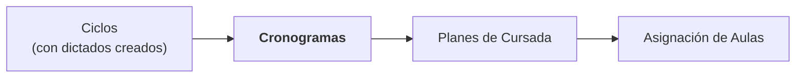

- **Antes de Cronogramas**: el ciclo tiene que existir y tener sus
  dictados creados. Si no, la validación del cronograma no puede
  correr (no tiene contra qué comparar).
- **Después de Cronogramas viene Planes de Cursada**: un plan se
  genera a partir de un cronograma. Las comisiones y los horarios
  que declaraste acá se clonan al plan.

Un ciclo puede tener **varios cronogramas** (por ejemplo, un
borrador inicial, una versión revisada y una final). El sistema no
te obliga a tener uno solo, pero cuando generás el plan de cursada
elegís cuál usar.

## Modelo mental

Antes de meterte a cargar horarios conviene tener claros estos tres
conceptos.

### Un cronograma es un conjunto de filas

Cada **fila del cronograma** representa un horario concreto: día
de la semana, hora de inicio, hora de fin, materia, y opcionalmente
la comisión y el tipo de clase (teoría o laboratorio). Es lo más
parecido a una fila del Excel original.

Un cronograma completo agrupa todas las filas del cuatrimestre.

### La comisión es una entidad separada

En este sistema, **la comisión es una entidad de primera clase**.
No es sólo un número al lado de la materia: es un objeto con
nombre, cupo, carrera asignada (opcional) y descripción.

Adentro de un cronograma podés tener varias comisiones para la
misma materia (por ejemplo, Análisis I comisión 1, 2 y 3), y cada
fila del cronograma se asocia a **una** comisión.

Cuando el cronograma después se transforma en plan de cursada, las
comisiones se **clonan**: la comisión del cronograma queda como
"modelo" y la del plan es la que efectivamente se asigna a aulas y
alumnos.

### La modalidad virtual es para excepciones

Cada fila del cronograma tiene un campo **Virtual** con tres
valores posibles: **Heredar** (usa lo configurado en la materia o
en el dictado del ciclo), **Sí (virtual)** y **No (presencial)**.
Se fuerza sólo para excepciones: por ejemplo, la teoría virtual y
la práctica presencial dentro de un dictado presencial. Si la
materia entera se dicta virtual, no se marca fila por fila: eso se
configura una sola vez en el dictado, desde el módulo de Ciclos.
(En la tabla de la vista "Por materia" el mismo dato es una casilla:
tildada es virtual, destildada es presencial.)

Dos reglas que el sistema garantiza solo: una clase virtual es
siempre **teórica** (si la marcás virtual sin tipo, el tipo se
completa solo), y un **laboratorio nunca puede ser virtual**
(necesita aula física; la aplicación rechaza la combinación en
todos lados, incluso dentro del Excel de la plantilla).

## Recorrido rápido de la página

La página se llama **📅 Cronogramas** y tiene cuatro pestañas:

### Pestaña "📋 Lista"

Vista general de todos los cronogramas cargados. Cada cronograma se
muestra como un expander con:

- Su nombre, cantidad de filas, ciclo asociado (o "sin ciclo") y
  fecha de subida.
- Un **badge de estado de validación**:
  - **⚪ sin validar**: nunca se validó.
  - **🟡 validado pero modificado**: se validó, pero después
    cambió algo del cronograma o de los dictados del ciclo.
  - **🔴 con issues**: la última validación encontró problemas
    (materias faltantes, particiones infactibles).
  - **🟢 validado**: la última validación pasó limpia.
- Adentro del expander podés **renombrar** el cronograma (campo
  "Nombre del cronograma"; se guarda al presionar Enter), ver el
  resumen de la última validación y usar los bloques **📤 Exportar
  horarios a Excel** (una hoja por grupo de materias, ver más
  abajo), **📄 Duplicar cronograma** y **🗑️ Eliminar cronograma**.

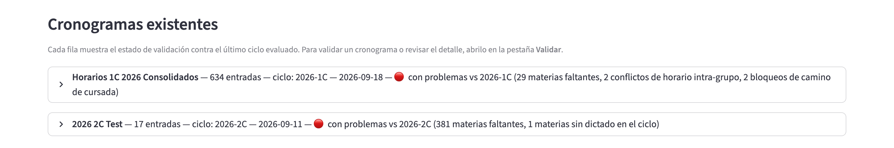

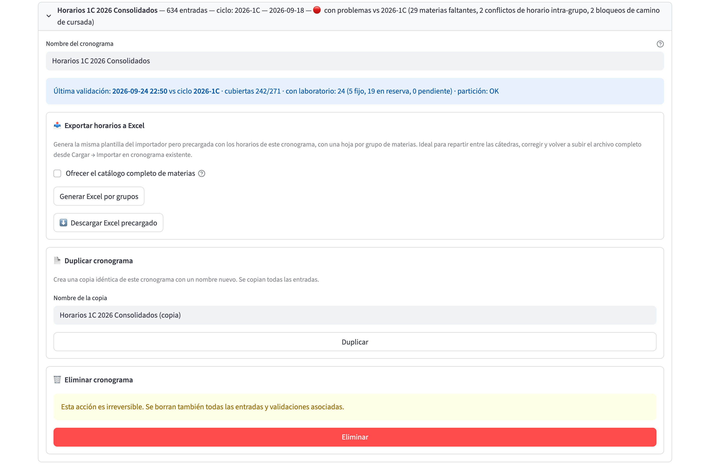

Al desplegar un cronograma aparecen el nombre editable, el resumen de la última validación y los tres bloques de acciones.

### Pestaña "📤 Cargar"

Se usa para **crear un cronograma nuevo** y para **actualizar uno
existente**. Arriba, el radio "¿Qué querés hacer?" ofrece cuatro
opciones:

- **Crear vacío**: un cronograma sin filas, para cargar a mano.
- **Crear desde archivo**: un cronograma nuevo a partir de la
  plantilla Excel completa del ciclo, revisada hoja por hoja antes
  de crearlo.
- **Importar en cronograma existente**: actualiza un cronograma de
  la lista con la plantilla completa, también con revisión hoja por
  hoja y decisión materia por materia.
- **Copiar desde plan**: crea un cronograma nuevo con el estado
  consolidado de un plan de cursada.

Las dos opciones que trabajan con archivo incluyen además el bloque
**📤 Plantilla de horarios**, desde donde se descarga la plantilla
Excel con listas desplegables.

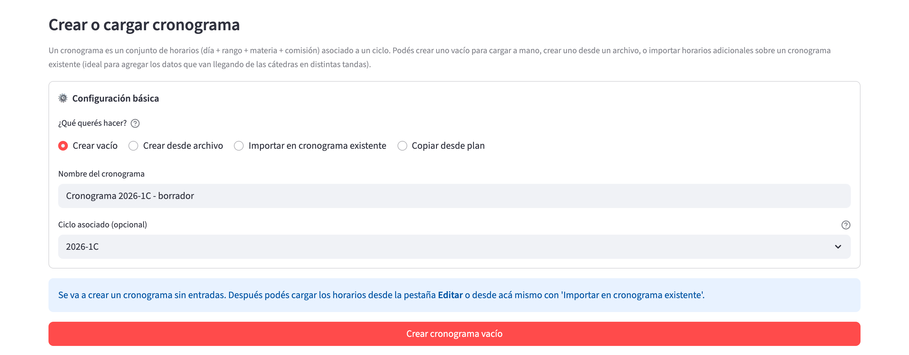

Arriba se elige qué hacer con el radio; el resto del formulario cambia según la opción. Todas piden el "Ciclo asociado (opcional)".

### Pestaña "✏️ Ver / Editar"

El calendario del cronograma, con un interruptor **"🔒 Solo lectura"**
(apagado por defecto) que alterna entre mirar y editar. En modo edición podés mover filas
arrastrando, cambiar horarios, agregar nuevas y borrar; en modo
lectura la grilla y las tablas no se pueden modificar. Se apoya en
dos modos:

- **Por grupo**: filtrás por carrera + año + cuatrimestre (más el
  "Alcance de las materias" y la opción "Ocultar materias
  compartidas con otras carreras"), elegís qué "Materias a mostrar"
  y editás las de ese grupo curricular en pantalla.
- **Por materia**: elegís una materia puntual y ves todas sus
  filas y comisiones abajo del calendario, en tablas editables.

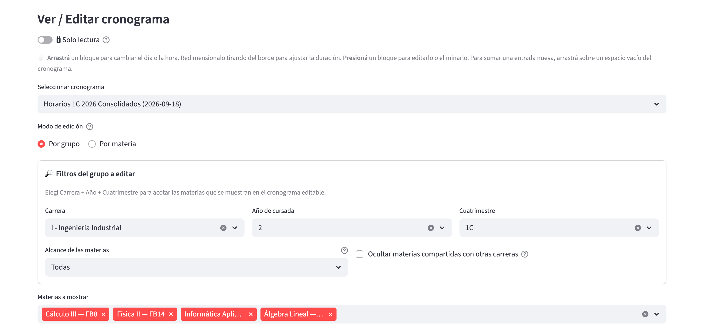

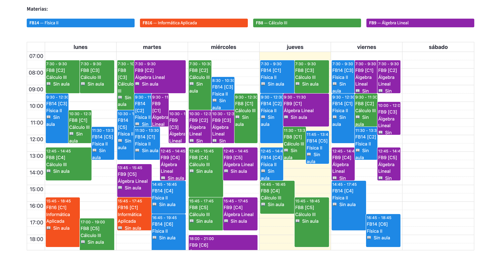

Cada bloque muestra el horario, la materia, la comisión y el aula (o "Sin aula" si todavía no se asignó).

### Pestaña "✅ Validar"

Corre la validación del cronograma contra los dictados del ciclo:
verifica cobertura (que todas las materias esperadas estén),
detecta materias no esperadas (que están en el cronograma pero no
tienen dictado), resume los laboratorios, calcula la partición
teoría/laboratorio y detecta conflictos horarios (que acá también
se pueden ignorar a nivel cronograma). Un desplegable **ℹ️ ¿Qué
significa validar?** explica qué se controla.

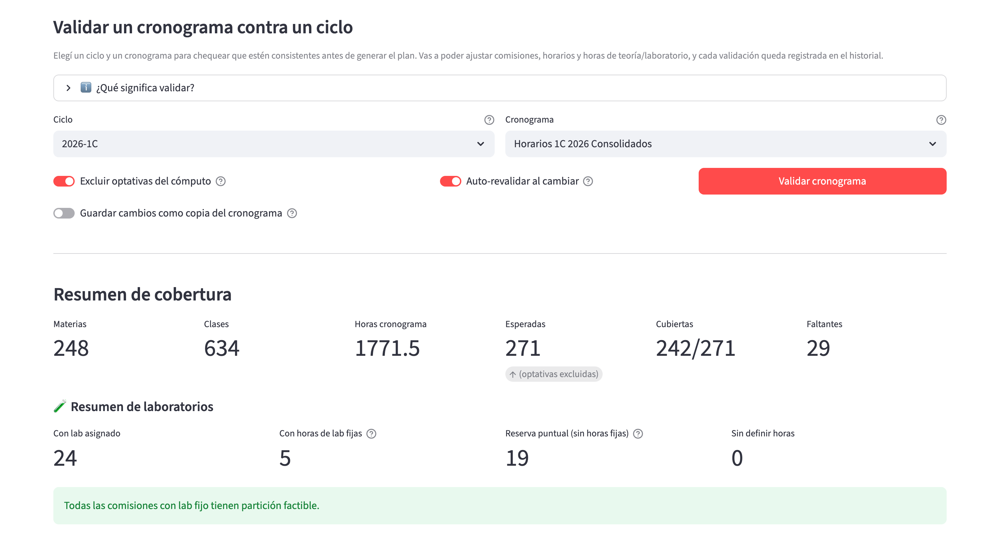

Debajo de los controles se ve el resumen de cobertura y, más abajo, el de laboratorios con el aviso de partición factible.

## Tareas comunes

### Crear un cronograma nuevo desde archivo

**Cuándo hacerlo**: cuando ya tenés el Excel de horarios del
cuatrimestre y querés subirlo al sistema.

**Prerequisito**: el ciclo tiene que existir y tener los dictados
creados. En esta opción el ciclo es **obligatorio**, porque la
plantilla se arma con los dictados de un ciclo.

**La plantilla (única forma de cargar)**:

La aplicación sólo acepta la **plantilla Excel (`.xlsx`) que ella
misma genera**, completa y tal como sale. No se aceptan archivos
`.csv` ni `.xls`, ni planillas armadas a mano con otras columnas. El
flujo es descargar la plantilla, repartir cada hoja a su cátedra
(por ejemplo compartiéndola en Google Sheets) y, cuando esté
completa, descargarla como `.xlsx` y subirla. Si hay que corregir
algo, se corrige en la planilla y se vuelve a subir. La plantilla
trae todo resuelto para que las cátedras no puedan equivocarse:

- Una **hoja de horarios por cada grupo de materias** del ciclo.
- La materia se ingresa **por código** con una lista desplegable; el
  nombre aparece solo, como verificación de sólo lectura.
- Una hoja **Materias** de consulta con el contexto completo de cada
  materia: código, nombre, código Guaraní, horas, en qué planes de
  carrera aparece y cómo está configurado el dictado del ciclo.
- Listas desplegables de días, horas (según la granularidad
  configurada), tipo de clase y virtual (VERDADERO/FALSO; vacío =
  presencial). Las listas de tipo y virtual son dependientes: con
  tipo laboratorio, virtual sólo ofrece FALSO, y viceversa.
- Las hojas son tablas de Excel protegidas (sin contraseña): las
  fórmulas y la columna del nombre no se pueden pisar por accidente.
- Las comisiones de la plantilla **se crean y asocian
  automáticamente**: el código numérico (entero desde 1) identifica
  a la comisión dentro de la materia y el nombre es opcional; si se
  pone nombre, la correspondencia código-nombre tiene que ser uno a
  uno dentro de la materia.

Para descargar una plantilla vacía, elegí el ciclo arriba, abrí el
desplegable **📥 Descargar plantilla vacía del ciclo**, apretá
**🧮 Generar plantilla** y luego **⬇️ Descargar plantilla_horarios.xlsx**.
Para partir de un cronograma que ya existe, usá el bloque
**Exportar horarios a Excel** de la pestaña Lista, que genera la
misma plantilla con los horarios precargados.

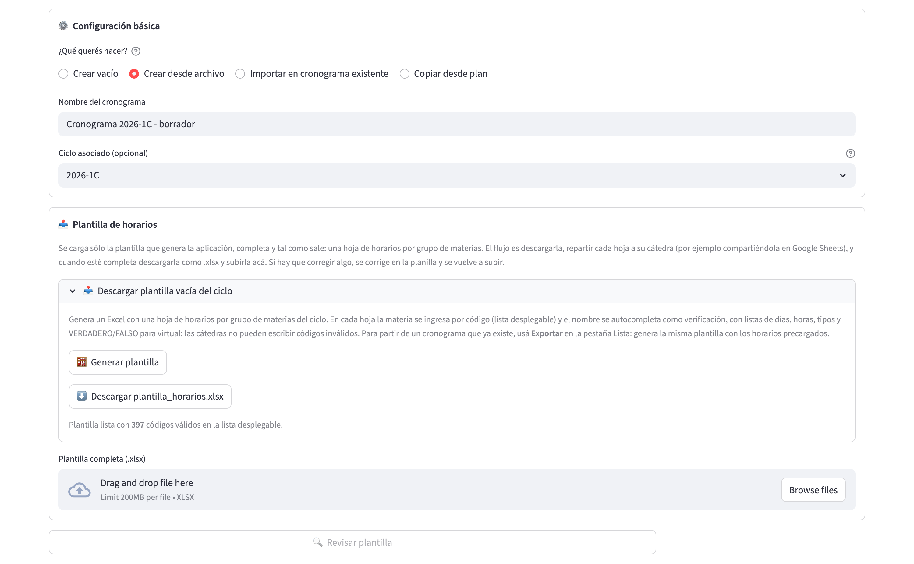

El bloque **Plantilla de horarios** permite generar y descargar la plantilla; abajo se sube el archivo completo y se aprieta **Revisar plantilla**.

**Paso a paso**:

1. Andá a la pestaña **📤 Cargar**.
2. Elegí la opción **Crear desde archivo**.
3. Escribí un **nombre** para el cronograma. Conviene que sea
   descriptivo (por ejemplo, `2026-1C - v1`).
4. Elegí el **ciclo** al que corresponde. Mientras falten el nombre
   o el ciclo, la pantalla te lo avisa y no deja revisar.
5. Subí la plantilla completa con el cargador "Plantilla completa
   (.xlsx)".
6. Apretá **🔍 Revisar plantilla**. Si la plantilla tiene errores, se
   listan agrupados por hoja (ver "Errores frecuentes") y no se
   arma la vista previa hasta que el archivo venga limpio.
7. Si está limpia, aparece la **vista previa**: todavía **no existe
   el cronograma**; se crea recién al confirmar. Recorré la **🗂
   Revisión hoja por hoja** (ver más abajo).
8. En el último paso, **🏁 Resumen y confirmación**, apretá **✅ Crear
   cronograma** (o **🗑 Descartar vista previa** para tirar todo).
   El sistema avisa `Cronograma '…' creado con N entrada(s).`

**Verificación**: andá a la pestaña **📋 Lista**. El cronograma
recién creado aparece con el badge **⚪ sin validar**.

**Notas importantes**:

- Si quedó una vista previa sin confirmar ni descartar (por
  ejemplo, cerraste el navegador), la pestaña muestra un aviso con
  las vistas previas sin finalizar y un botón **Descartar** para
  cada una.
- Podés subir **varios cronogramas al mismo ciclo** (por ejemplo,
  un borrador y una versión final). Después elegís cuál usar para
  generar el plan.

### Importar un archivo dentro de un cronograma existente

**Cuándo hacerlo**: cuando el cronograma ya existe y llega una
versión nueva o parcial de la plantilla (por ejemplo, la que
exportaste desde la Lista y corrigieron las cátedras).

**Paso a paso**:

1. Andá a la pestaña **📤 Cargar**, opción **Importar en cronograma
   existente**. Esta opción no pide nombre: el destino es un
   cronograma de la lista.
2. Elegí el **Cronograma destino** y subí la plantilla completa
   (`.xlsx`) generada por la aplicación. La plantilla tiene que ser
   del mismo ciclo que el cronograma destino.
3. Apretá **🔍 Revisar plantilla**. El sistema valida la estructura
   del archivo y arma una vista previa; los errores, si los hay, se
   muestran por hoja.
4. Recorré la **🗂 Revisión hoja por hoja**: una barra de progreso
   indica cuántas hojas quedaron revisadas, y los botones
   **◀ Anterior** / **Siguiente ▶** (o el desplegable de pasos)
   permiten moverse entre las hojas. En cada hoja hay una tarjeta
   por materia con:
   - Los calendarios **Antes** (estado actual) y **Después**
     (cómo quedaría), de sólo lectura.
   - La decisión **al confirmar el import**: **Reemplazar** (las
     filas del archivo pisan las existentes), **Agregar** (se suman
     las comisiones nuevas y se dejan las previas) o **Ignorar** (la
     materia queda como está). Las materias con datos previos
     arrancan en "Reemplazar"; las nuevas, en "Agregar", y también se
     pueden ignorar si el archivo vino mal.
   - Una sección **✏️ Ajustes manuales** para corregir horarios de
     la vista previa antes de confirmar (si cambiás la decisión, esos
     ajustes se pierden).
   - Los chequeos estructurales de la materia.
5. Las materias que tienen horarios en el cronograma pero ya no
   vienen en la plantilla aparecen en **🗑 Ya no están en el
   archivo**: por defecto se **eliminan** (la plantilla es la foto
   completa del cronograma); elegí **conservar** si fue un olvido.
6. Al terminar cada hoja apretá **✅ Marcar hoja como revisada y
   seguir**. Las hojas vacías arrancan ya revisadas.
7. El último paso, **🏁 Resumen y confirmación**, muestra la tabla
   de hojas (materias, horarios, conflictos, a eliminar, revisada o
   pendiente) y el estado global del cronograma hipotético
   (faltantes, conflictos horarios, bloqueos de camino, partición y
   horarios fuera de configuración). **✅ Confirmar importación** se
   habilita cuando todas las hojas están revisadas. Nada se guarda
   en el destino hasta ese momento; **🗑 Descartar vista previa** (o
   **🗑 Descartar**, arriba) tira todo.

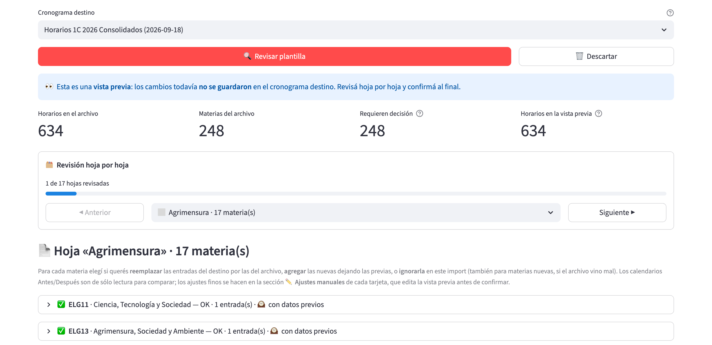

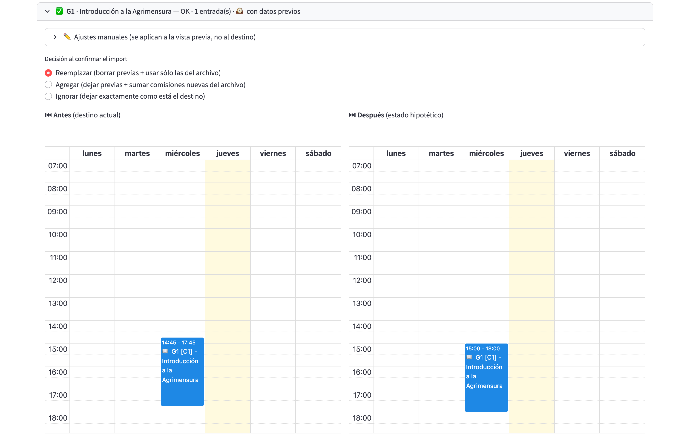

Cada tarjeta ofrece la decisión (**Reemplazar**, **Agregar** o **Ignorar**) y los calendarios para comparar el estado actual con el resultado hipotético.

Al confirmar, el aviso resume el resultado: cuántas entradas se
agregaron, eliminaron o quedaron sin cambio, y el total final.

### Exportar los horarios a Excel (una hoja por grupo)

**Cuándo hacerlo**: cuando querés repartir los horarios ya cargados
a las cátedras o departamentos para que los revisen y corrijan.

**Paso a paso**:

1. Andá a **📋 Lista** y abrí el expander del cronograma (tiene que
   tener ciclo asociado).
2. En el bloque **📤 Exportar horarios a Excel**, apretá **Generar
   Excel por grupos** y descargá el archivo.
3. Descargá el archivo con **⬇️ Descargar Excel precargado**. Es la
   misma plantilla del importador pero **precargada**: una hoja por
   cada grupo de materias, con los horarios de ese grupo, las mismas
   listas desplegables, validaciones y protección.
4. Le mandás a cada cátedra la hoja de su grupo (el archivo se
   vuelve a subir completo); corrigen en Excel
   (o en Google Sheets) y vos reimportás la plantilla completa con
   el flujo de "Importar en cronograma existente".

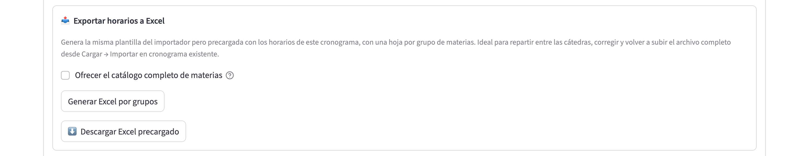

**Notas**:

- Los nombres de hoja siguen los nombres de los grupos de materias
  (con el límite de 31 caracteres de Excel). Si quedan truncados,
  acortá los nombres de los grupos desde Materias → Grupos.
- El casillero **"Ofrecer el catálogo completo de materias"** hace
  que las listas incluyan todo el catálogo activo, no sólo los
  dictados del ciclo. Útil si las cátedras van a sumar materias que
  todavía no tienen dictado creado.

### Crear un cronograma vacío

**Cuándo hacerlo**: cuando no tenés archivo y vas a cargar los
horarios uno por uno desde el editor.

**Paso a paso**:

1. Andá a la pestaña **📤 Cargar**.
2. Elegí la opción **Crear vacío** (es la que viene seleccionada).
3. Escribí el **nombre** del cronograma y, si querés, elegí el
   **ciclo asociado (opcional)**. Si no corresponde ninguno, dejá
   `(ninguno)`; después no vas a poder validar hasta que tenga
   ciclo.
4. Apretá **Crear cronograma vacío** (deshabilitado hasta que haya
   nombre).
5. El sistema crea un cronograma con cero filas.

> **Para verificar:** la captura muestra el ciclo 2026-1C ya elegido
> en el desplegable; en el código de la página la opción por defecto
> es `(ninguno)`, así que no se pudo confirmar que el ciclo vigente
> venga preseleccionado.

**Verificación**: aparece en **📋 Lista** con 0 entradas y
**⚪ sin validar**.

**Siguiente paso**: andá a **✏️ Ver / Editar** y empezá a agregar
filas, o cargá horarios con "Importar en cronograma existente".

### Copiar el estado de un plan como cronograma nuevo

**Cuándo hacerlo**: para archivar como cronograma la versión que
quedó firme en un plan de cursada después de las validaciones y
ediciones.

**Paso a paso**:

1. En **📤 Cargar**, elegí **Copiar desde plan**.
2. Escribí el nombre (si lo dejás vacío, se sugiere `Copia de
   {nombre del plan}`) y, si querés, el ciclo.
3. En **🧬 Plan de origen**, elegí el plan. Si todavía no hay
   planes, la pantalla te manda a **📊 Planes**.
4. Apretá **🧬 Copiar como cronograma nuevo**.

Se copian las comisiones del plan y sus horarios (día, rango, tipo
de clase, virtual); **no se copia el aula asignada**. El cronograma
nuevo queda ligado al mismo ciclo que el plan, salvo que elijas
otro ciclo arriba (en ese caso la pantalla lo avisa). Al terminar
muestra `Cronograma '…' creado con N comisiones y M horarios.`

### Editar horarios (mover, agregar, borrar)

**Cuándo hacerlo**: en cualquier momento después de crear el
cronograma. Es la pestaña donde más tiempo vas a pasar.

**Paso a paso (vista general)**:

1. Andá a la pestaña **✏️ Ver / Editar**. Para consultar sin
   riesgo de tocar nada, prendé **🔒 Solo lectura**: la vista es la
   misma pero no permite editar.
2. Elegí el cronograma en "Seleccionar cronograma".
3. Elegí el "Modo de edición":
   - **Por grupo**: filtrás por **Carrera**, **Año de cursada** y
     **Cuatrimestre** (1C, 2C o Anual). Opcionalmente ajustás el
     **Alcance de las materias** (Todas, sólo del ciclo básico F/FB
     o sólo específicas de la carrera), tildás **Ocultar materias
     compartidas con otras carreras** y elegís cuáles **Materias a
     mostrar**. Hasta que no elijas carrera, año y cuatrimestre no
     se muestra el calendario. Debajo del calendario aparecen los
     **Chequeos por materia** (los mismos que el detalle por materia
     de Validar).
   - **Por materia**: buscás y elegís una materia y ves todos sus
     horarios en un calendario acotado a esa materia.

**Paso a paso (mover una fila con drag & drop)**:

1. Con el modo elegido, en el calendario, hacé click y arrastrá el
   bloque de una materia hacia otro día u horario.
2. El sistema guarda el cambio en el momento y muestra un toast:
   `{materia} movida a {dia} HH:MM-HH:MM`.

**Paso a paso (agregar una fila nueva)**:

1. En el calendario, arrastrá con el mouse sobre un espacio vacío
   marcando el día y el rango horario.
2. Se abre el diálogo **Agregar entrada** con la materia, día y
   horas prefijados.
3. Cargá la **Comisión** (opcional; 0 = sin asignar por ahora).
4. Apretá **Confirmar** (o **Cancelar**).
5. Si el número de comisión no existe todavía para esa materia en
   este cronograma, el sistema la crea automáticamente con valores
   por defecto (cupo 30, nombre autogenerado).

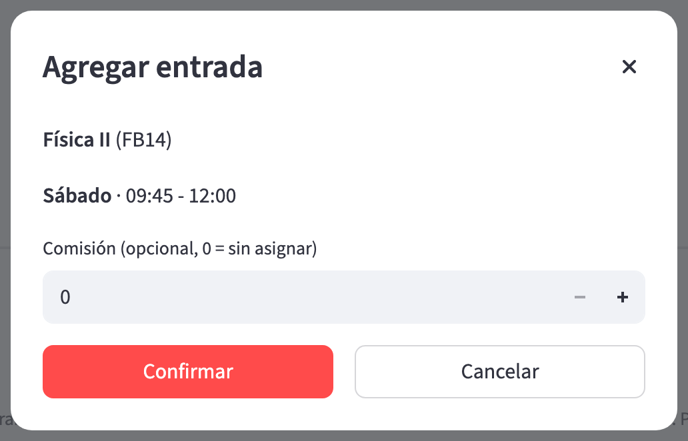

**Paso a paso (editar una fila existente)**:

1. Hacé click sobre el bloque de la fila en el calendario.
2. Se abre el diálogo **Editar entrada**, más grande, con todos los
   datos de la fila:
   - **Materia** (con el buscador "🔍 Buscar materia").
   - **Día** de la semana.
   - **Inicio** y **Fin**.
   - **Comisión** (con opción **➕ Crear nueva comisión…**).
   - **Tipo de clase**: automático (`sin determinar`), teórica o
     laboratorio. Dejalo en automático salvo que haga falta fijarlo
     ya: lo resuelve la asignación automática según las horas de la
     materia.
   - **Virtual**: un desplegable con **Heredar** (usa la
     configuración de la materia o del dictado), **Sí (virtual)**
     (no se le asigna aula) y **No (presencial)** (fuerza presencial
     aunque la materia esté marcada virtual). Usalo sólo para
     excepciones.
3. Modificá lo que necesites.
4. Apretá **Guardar**, **Eliminar** o **Cancelar**.

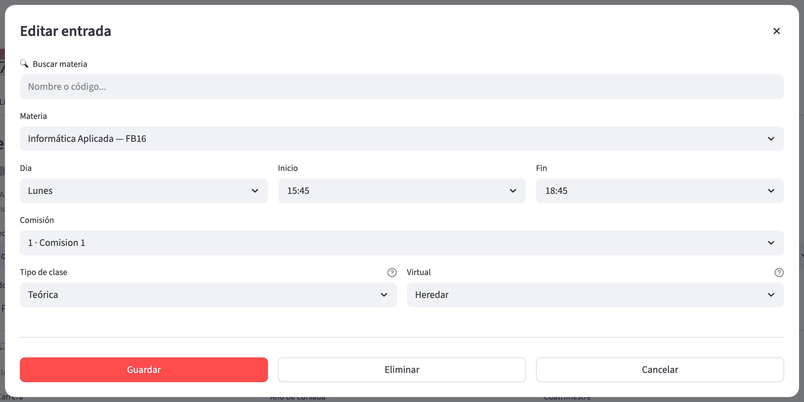

**Paso a paso (modo "Por materia")**:

En el modo Por materia, además del calendario (una comisión por
color) tenés tres tablas abajo, bajo el título "Entradas y
comisiones":

- **Tabla de horarios de la materia**: filas editables directas
  (día, inicio, fin, comisión, tipo y una casilla Virtual). Podés
  agregar y borrar filas. Cambiar cualquier celda autoguarda al
  confirmar el cambio.
- **Tabla de comisiones**: podés editar nombre, cupo, carrera
  asignada, descripción. Borrar una comisión desde acá **está
  bloqueado** si tiene filas u horarios asociados; hay que
  reasignar o borrar primero.
- **Tabla resumen** de cuántas clases y horarios tiene cada
  comisión.

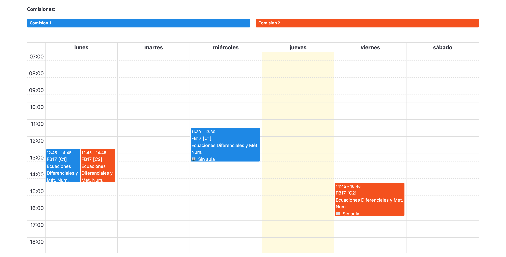

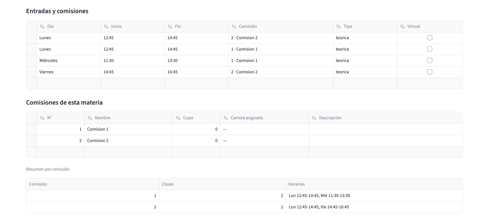

Las tres tablas quedan debajo del calendario, en el orden que describe la lista anterior.

**Verificación**: los cambios aparecen reflejados en el calendario
y en las tablas. Además, en la pestaña **📋 Lista** el badge de
validación pasa a **🟡 validado pero modificado** (si estaba
validado) porque los cambios invalidan la última validación.

**Notas importantes**:

- El editor **autoguarda** cada cambio individual. No hay un botón
  de "guardar todo": cada acción se persiste al momento.
- Si dos usuarios editan el mismo cronograma en paralelo, los
  cambios se van pisando. Coordinen entre ustedes cuál está
  editando qué en cada momento.

### Asociar horarios a comisiones

**Cuándo hacerlo**: cuando el archivo importado venía sin columna
de comisión (las filas quedan sin asignar), o cuando agregaste una
comisión nueva y hay que reasignarle filas. Si usaste la plantilla
con `codigo_comision`, las comisiones ya quedaron creadas y
asociadas solas.

**Modelo mental**:

Una **comisión** en un cronograma es un objeto con nombre, cupo y
opcionalmente carrera asignada. Cada fila del cronograma se
asocia a una comisión (o queda sin asignar).

Podés tener varias comisiones para la misma materia (por ejemplo,
Análisis I comisión 1 y Análisis I comisión 2), y podés reasignar
filas entre comisiones.

**Paso a paso**:

1. Andá a **✏️ Ver / Editar → modo "Por materia"**.
2. Elegí la materia.
3. En la tabla de comisiones (abajo del calendario), verificá que
   estén todas las comisiones que necesitás. Si falta alguna,
   agregala con un nombre y cupo.
4. Volvé a la tabla de horarios de la materia.
5. Para cada fila que no tiene comisión asignada (o tiene la
   equivocada), cambiá el valor de la columna **Comisión**.
6. Los cambios se autoguardan.

**Alternativa (al hacer click en una fila del calendario)**:

1. Click en la fila.
2. En el diálogo, cambiá el selector de Comisión.
3. Si querés crear una comisión nueva sobre la marcha, elegí
   **➕ Crear nueva comisión…** y completá el mini-formulario que
   aparece inline.
4. Guardá.

**Notas importantes**:

- Si borrás la última fila que apuntaba a una comisión, la
  comisión queda vacía pero **sigue existiendo** en la base como
  "modelo". Podés borrarla explícitamente desde la tabla de
  comisiones si no la vas a usar más.
- La **carrera asignada** de una comisión es un campo importante:
  le dice al asignador de aulas a qué sedes puede ir esa comisión
  (las de esa carrera, en lugar de las del grupo de materias).

### Validar el cronograma contra los dictados del ciclo

**Cuándo hacerlo**: después de terminar de cargar el cronograma y
antes de generar el plan de cursada. Es tu verificación de calidad.

**Prerequisito**: el ciclo tiene que tener dictados creados (si no,
la validación te avisa que no puede correr).

**Qué hace la validación**:

Compara las filas del cronograma con los dictados del ciclo y
calcula:

- **Cobertura**: cuántos dictados están cubiertos por al menos una
  fila del cronograma, cuántos faltan (dictado existe pero no hay
  filas), cuántos "extras" hay (filas en el cronograma que no
  corresponden a ningún dictado).
- **Partición teoría/laboratorio**: verifica que las horas
  cargadas coincidan con las horas esperadas para cada tipo de
  clase de la materia.
- **Conflictos horarios**: detecta si dos filas del mismo grupo
  curricular se pisan.
- **Resumen de laboratorios**: cuántas materias tienen laboratorio
  asignado, cuántas con horas de laboratorio fijas, cuántas en
  reserva puntual (horas en 0, el docente reserva caso por caso) y
  cuántas sin definir horas (bloqueante).

**Paso a paso**:

1. Andá a la pestaña **✅ Validar**.
2. Si querés, abrí **ℹ️ ¿Qué significa validar?**, que explica qué
   se compara y qué se controla.
3. Elegí el **Ciclo** y el **Cronograma** en los selectores.
4. Revisá los interruptores de arriba:
   - **Excluir optativas del cómputo**: las materias optativas no se
     cuentan entre las esperadas (las virtuales sí cuentan).
   - **Auto-revalidar al cambiar**: si está prendido, cualquier
     acción del panel vuelve a correr la validación.
   - **Guardar cambios como copia del cronograma**: si vas a hacer
     ajustes desde el panel de validación, los aplica a una copia
     (con el nombre que indiques en "Nombre de la copia") en lugar
     del cronograma original.
5. Apretá **Validar cronograma**.
6. El sistema muestra:
   - El **Resumen de cobertura**: materias, clases, horas del
     cronograma, esperadas, cubiertas y faltantes.
   - El **🧪 Resumen de laboratorios** y un cartel verde o rojo con
     la partición teoría/lab.
   - Expanders con **📋 Detalle por carrera** (incluye los
     conflictos horarios) y **🔎 Detalle por materia** con los
     problemas encontrados.

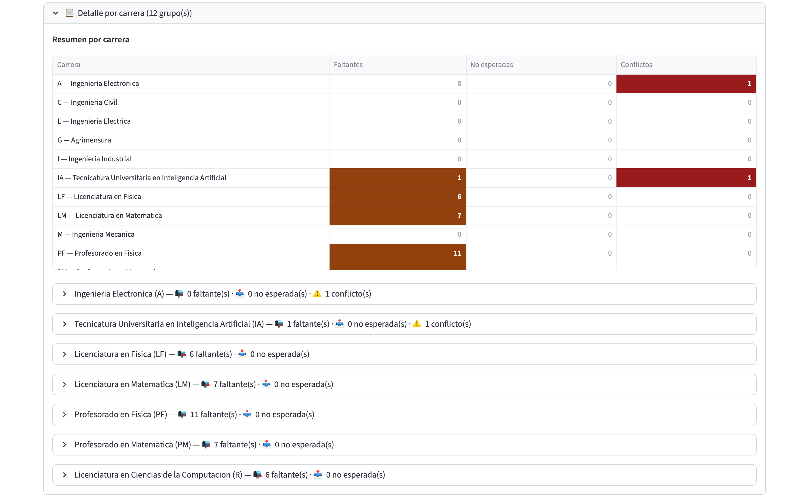

El resumen por carrera marca con color las carreras con faltantes o conflictos, y debajo hay un desplegable para cada una.

**Cómo actuar sobre los resultados**:

- **Materias faltantes**: agregá las filas que faltan desde la
  pestaña Ver / Editar, o borrá el dictado desde Ciclos si en realidad
  la materia no se dicta.
- **Materias extras** (en el cronograma pero sin dictado): tenés
  dos opciones dentro del panel de validación:
  - **🟢 Activar**: crea el dictado en el ciclo. Es equivalente al
    "excepcional Crear" desde Ciclos.
  - **🌐 Activar y marcar virtual**: crea el dictado y encima lo
    marca como virtual.
- **Partición infactible**: revisá las horas de teoría y
  laboratorio de la materia en el catálogo, o ajustá el tipo de
  clase de cada fila del cronograma.
- **Conflictos horarios**: revisá las filas involucradas y movelas
  o ajustalas. Dentro de cada carrera, **🛠️ Resolver conflicto**
  permite elegir un par y abrir el editor de una de las dos
  materias. Si sabés que un par no es un conflicto real (por
  ejemplo, materias que cursan alumnos distintos), podés usar
  **Marcar como ignorado**.
- **Conflictos ignorados**: se listan en **🙈 Conflictos ignorados**
  dentro de la carrera, con su detalle. No bloquean la generación
  del plan (y se heredan al plan que generes). Para que vuelvan a
  contarse, elegí el par en "Quitar de ignorados" y apretá **Dejar
  de ignorar**.

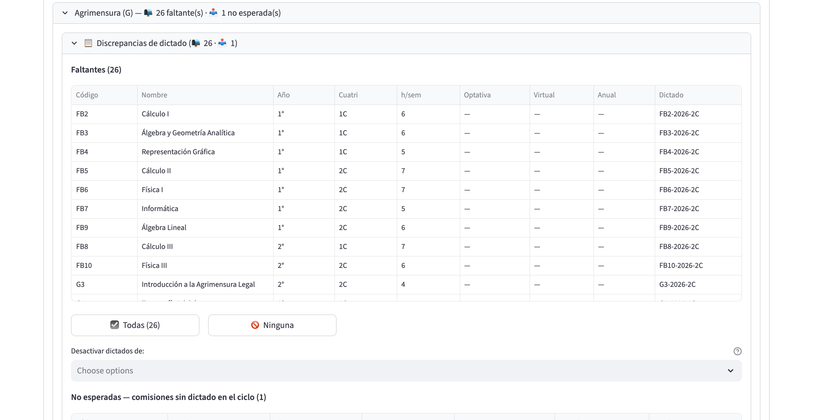

Dentro de cada carrera se listan las materias faltantes y las no esperadas, con las acciones para resolverlas.

**Verificación**: repetí la validación hasta que el badge del
cronograma pase a **🟢 validado**.

**Notas importantes**:

- Las validaciones son **inmutables**: cada corrida queda como
  registro histórico.
- El badge **🟡 validado pero modificado** aparece cuando el
  registro de validación está desactualizado (cambió el cronograma o los
  dictados desde la última validación).
- Los conflictos horarios detectados se pueden **ignorar a nivel
  cronograma** (y se gestionan desde esta misma pestaña, ver
  arriba); los ignorados se heredan al plan que generes.

### Duplicar un cronograma

**Cuándo hacerlo**: cuando querés probar cambios sobre una copia
sin tocar el original. Muy útil antes de reestructurar un
cronograma existente.

**Paso a paso**:

1. Andá a **📋 Lista**.
2. Abrí el expander del cronograma que querés duplicar.
3. En el bloque de duplicar, escribí un nombre para la copia (por
   default sugiere `{nombre} (copia)`).
4. Apretá **Duplicar**.
5. El sistema clona el cronograma con todas sus filas y sus
   comisiones, y avisa `Cronograma duplicado como '…'`.

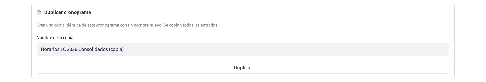

**Verificación**: aparece el nuevo cronograma en la lista con las
mismas filas y comisiones que el original.

**Notas importantes**:

- Se clonan filas y comisiones. **No se clonan** los registros de
  validación: la copia arranca con **⚪ sin validar**.
- Los planes de cursada derivados **no** se duplican: apuntan
  siempre al cronograma original.

### Borrar un cronograma (advertencia sobre planes derivados)

> ⚠️ **Atención: puede dejar planes en estado inconsistente**
>
> Si un cronograma ya tiene un **plan de cursada derivado** (es
> decir, ya generaste un plan a partir de este cronograma), al
> borrar el cronograma:
>
> - **El plan de cursada NO se borra**: sigue existiendo.
> - **Pero el plan queda apuntando a un cronograma que ya no
>   existe**: pierde su ancla histórica.
> - Las comisiones "modelo" del cronograma quedan huérfanas en la
>   base (sin aparecer en ningún listado).
>
> **Antes de borrar un cronograma que tiene plan derivado**,
> considerá:
> - ¿Realmente querés borrar el histórico?
> - ¿Podés en su lugar renombrarlo (por ejemplo, agregarle
>   `[obsoleto]` al nombre) y dejarlo?
> - Si sí querés borrarlo, primero borrá el plan derivado. Va a
>   quedar todo más limpio.

**Cuándo hacerlo**: cuando el cronograma es un borrador que ya no
sirve y **no tiene plan de cursada derivado**.

**Paso a paso**:

1. Andá a **📋 Lista**.
2. Abrí el expander del cronograma.
3. En el bloque **🗑️ Eliminar cronograma**, leé el mensaje `Esta
   acción es irreversible. Se borran también todas las entradas y
   validaciones asociadas.`
4. Apretá **Eliminar**.

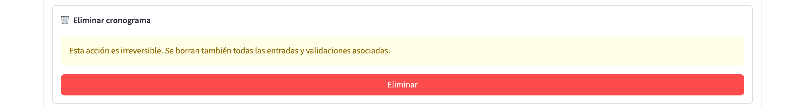

**Verificación**: el cronograma desaparece de la lista.

**Qué se borra**:

- El cronograma en sí.
- Todas sus filas.

**Qué NO se borra automáticamente**:

- Las comisiones "modelo" del cronograma (quedan huérfanas).
- Los planes de cursada derivados (quedan apuntando a un
  cronograma inexistente).

## Errores frecuentes y qué hacer

### "El archivo no es una plantilla de cronograma generada por la aplicación…"

**Síntoma**: al apretar **Revisar plantilla**, aparece un error
rojo en el cuadro "🚫 La plantilla no se puede importar todavía".

**Causa**: el archivo subido no es la plantilla `.xlsx` que genera
la aplicación (por ejemplo, un Excel armado a mano, un `.csv` o una
planilla a la que se le cambió la estructura).

**Solución**: descargá la plantilla desde Cronogramas → Cargar (o
exportá el cronograma desde la Lista), cargá los horarios en esa
planilla sin cambiarle la estructura y volvé a subirla.

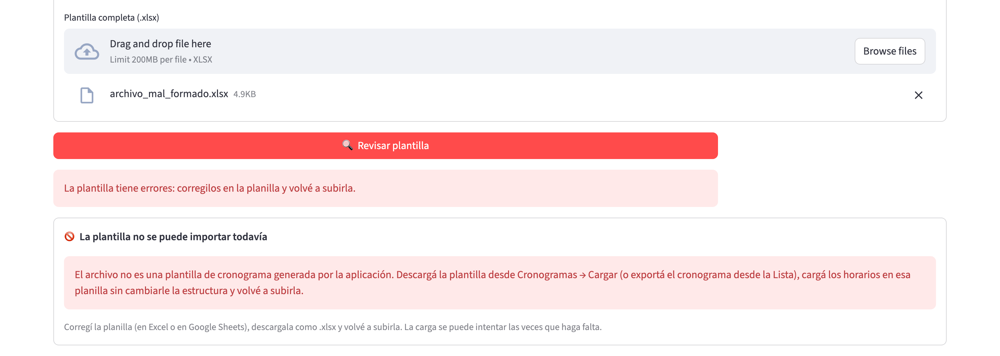

Este es el aviso que aparece cuando el archivo subido no es la plantilla generada por la aplicación: hay que volver a cargar los horarios en la plantilla descargada.

### "La plantilla es de una versión anterior…", "La plantilla es del ciclo …" o "Falta la hoja …"

**Causa**: la plantilla se generó con una versión anterior de la
aplicación, pertenece a otro ciclo distinto del cronograma destino,
o se borró, ocultó o renombró una de sus hojas.

**Solución**: descargá una plantilla nueva del ciclo correcto, pasá
los horarios y no toques las hojas.

### "🚫 Códigos no reconocidos"

**Síntoma**: en la vista previa aparece el desplegable **Códigos no
reconocidos**, con avisos del estilo `` `XXX` no está en el catálogo
(se ignoró)``.

**Causa**: el código de la materia en la plantilla no coincide con
ninguna materia del catálogo del sistema; esas filas no se importan.

**Solución**: verificá el código en el módulo de Materias. Si falta
la materia en el catálogo, cargala primero. Si el código está mal
escrito en la planilla, corregilo y volvé a subirla.

### Avisos en la vista previa

**Síntoma**: el desplegable **⚠️ Avisos** lista observaciones del
análisis de la plantilla (por ejemplo, un código resuelto por un
código alternativo, típicamente el externo de la facultad).

**Solución**: no son errores. Si preferís el código interno,
actualizá la planilla; si no, dejalo pasar.

### "Este ciclo no tiene dictados creados"

**Síntoma**: al intentar validar, aparece un cartel rojo.

**Causa**: el ciclo del cronograma existe pero todavía no tiene
dictados creados.

**Solución**: andá a **📆 Ciclos → 📚 Dictados**, elegí el ciclo y
apretá **➕ Crear Dictados**.

### El cronograma tiene "extras" que no logro resolver

**Síntoma**: la validación muestra materias en el cronograma que
no están declaradas como dictados del ciclo.

**Causas posibles**:

1. La materia se dicta este ciclo pero olvidaste crear el dictado.
2. La materia se cargó por error en el cronograma.
3. La materia era un recursado excepcional que no está en la regla
   general.

**Solución**:

- **Caso 1 y 3**: apretá `🟢 Activar` en el panel de validación
  para crear el dictado. Si además es virtual, usá
  `🌐 Activar y marcar virtual`.
- **Caso 2**: andá a Ver / Editar y borrá las filas equivocadas.

### "No se puede borrar: la comisión tiene entries asociadas"

**Síntoma**: intentás borrar una comisión desde la tabla y no te
deja.

**Causa**: hay filas del cronograma (o horarios de un plan de
cursada) que apuntan a esa comisión.

**Solución**: primero reasigná las filas a otra comisión (o
borralas), y después intentá borrar la comisión otra vez.

### El badge pasó a "🟡 validado pero modificado" y no sé qué cambió

**Síntoma**: hiciste un cambio chico y el badge se puso amarillo.

**Causa**: cualquier modificación al cronograma o a los dictados
del ciclo invalida la última validación.

**Solución**: volvé a la pestaña Validar y apretá **Validar
cronograma** para refrescar la validación.

### El importador rechazó una fila por la comisión

**Síntoma**: al revisar la plantilla, el cuadro de errores por hoja
muestra mensajes del estilo "el código
de comisión 1 aparece con nombres distintos" o "el código de
comisión debe ser un entero mayor o igual a 1".

**Causa**: dentro de una materia, la correspondencia entre código y
nombre de comisión tiene que ser uno a uno (un código, un nombre),
y el código tiene que ser un número entero desde 1.

**Solución**: revisá las filas de esa materia en el Excel. Si
`mañana`, `tarde` y `noche` son tres comisiones distintas, dales
códigos distintos (1, 2, 3); si es una sola comisión con varios
horarios, usá el mismo nombre en todas las filas (o dejalo vacío).

## Preguntas frecuentes

### ¿Puedo tener varios cronogramas en el mismo ciclo?

Sí. El ciclo puede tener varios cronogramas (un borrador, una
versión con cambios, una final). Cuando generás el plan de
cursada elegís cuál usar.

### ¿Qué formato de archivo acepta el importador?

Sólo la **plantilla Excel (`.xlsx`) generada por la aplicación**,
completa y sin cambios de estructura: una hoja de horarios por
grupo de materias. No se aceptan `.csv`, `.xls` ni planillas
armadas a mano. Las comisiones se crean y asocian solas a partir del
código de comisión de cada fila. La plantilla se descarga desde
Cargar o se exporta precargada desde la Lista.

### ¿Puedo importar horarios sin especificar un ciclo?

Sí, podés crear un cronograma vacío sin ciclo asociado. (Crear
desde archivo, en cambio, exige ciclo, porque la plantilla se arma
con los dictados de un ciclo.) Pero **no
vas a poder validarlo** hasta asociarlo a un ciclo, y el proceso
de asociación posterior no está expuesto en la interfaz; es más
práctico cargar el cronograma directamente con el ciclo elegido.

### ¿Qué pasa si dos filas se pisan en horario?

La validación las detecta como **conflicto horario**. Vas a verlo
en el detalle de la validación. Podés corregirlo (mover una de las
dos filas o cambiar la comisión) o, si sabés que no es un conflicto
real, marcarlo como ignorado a nivel cronograma desde Validar.

### ¿Puedo tener una comisión que se dicte en varias sedes?

**No con la misma comisión**. Todas las filas de una comisión se
dictan en la misma sede (definida por la `carrera_asignada` de la
comisión). Si necesitás dos sedes para la misma materia, tenés
que crear dos comisiones distintas.

### ¿La modalidad virtual del horario pisa la del dictado?

Sí. La regla general es que **el nivel más específico manda**:
horario > dictado > materia. Si el horario dice "Presencial", eso
gana aunque el dictado esté marcado como virtual. Dos derivaciones
automáticas: una clase marcada virtual queda siempre como teórica,
y un laboratorio queda siempre presencial explícito (la herencia
del dictado no puede volverlo virtual).

### ¿Cómo elimino una comisión que ya no uso?

Andá a **✏️ Ver / Editar → modo "Por materia"**, buscá la comisión en la
tabla de comisiones y borrala. Si tiene filas u horarios asociados
el sistema no te deja: primero reasignalos o borralos.

### ¿Qué es la diferencia entre "comisión del cronograma" y
"comisión del plan"?

En este sistema hay dos comisiones para la misma cosa lógica:

- La **comisión del cronograma** es la que definís acá. Funciona
  como **modelo**.
- La **comisión del plan de cursada** es un clon de la anterior,
  creada cuando se genera el plan. Es la que se asigna a alumnos
  y a aulas.

Esto permite que después puedas editar comisiones en el plan sin
alterar el cronograma histórico.

### ¿Se puede exportar el cronograma a Excel?

Sí. En **📋 Lista**, el expander de cada cronograma con ciclo
asociado tiene el bloque **📤 Exportar horarios a Excel**: genera la
plantilla del importador precargada con los horarios, con una hoja
por grupo de materias, lista para repartir, corregir y reimportar
(ver la tarea "Exportar los horarios a Excel").

### ¿Cómo veo el cronograma agrupado por comisión?

En la pestaña **👁 Ver / Editar → modo "Por materia"**, cada
comisión aparece con un color distinto en el calendario, y el
código de la comisión (`[C2]`) se ve en cada bloque.

## Términos importantes de este módulo

- **Cronograma**: conjunto de filas horarias del cuatrimestre.
  Corresponde a la representación digital del Excel de horarios.
- **Fila del cronograma**: unidad mínima. Tiene día, hora de
  inicio, hora de fin, materia, comisión (opcional) y tipo de
  clase (opcional).
- **Comisión modelo (o comisión del cronograma)**: comisión
  declarada dentro del cronograma. Sirve como plantilla que se
  clona cuando se genera el plan de cursada.
- **Comisión del plan**: clon vivo de la comisión modelo, creada
  cuando se genera el plan. Es la que se asigna a alumnos y aulas.
- **Modo Por grupo**: vista del cronograma filtrada por carrera +
  año + cuatri. Sirve para pensar en cómo cursa un año concreto
  de una carrera.
- **Modo Por materia**: vista del cronograma filtrada a una
  materia. Sirve para editar sus comisiones y horarios.
- **Cobertura**: métrica de la validación. Mide qué porcentaje de
  los dictados del ciclo están cubiertos por al menos una fila
  del cronograma.
- **Materia faltante**: dictado del ciclo que no tiene ninguna
  fila en el cronograma.
- **Materia extra (no esperada)**: fila del cronograma cuya
  materia no tiene dictado en el ciclo.
- **Partición teoría/laboratorio**: verificación de que las horas
  cargadas de cada tipo de clase coincidan con las esperadas para
  la materia.
- **Conflicto horario**: dos filas del mismo grupo curricular que
  se pisan en día y hora.
- **Registro de validación**: registro inmutable de una corrida
  de validación. Cada validación guarda una copia con las
  métricas del momento.
- **Badge de validación**: ícono que resume el estado del
  cronograma respecto de la última validación (⚪ 🟡 🔴 🟢).
- **Standalone**: cronograma sin ciclo asociado. Se puede crear
  pero no se puede validar hasta enlazarlo a un ciclo.
- **Duplicar**: clonar un cronograma con todas sus filas y
  comisiones. Útil para probar cambios sin tocar el original.
- **Autoguardado**: mecanismo por el cual cada cambio en el
  editor se persiste al momento, sin necesidad de un botón
  "guardar todo".
