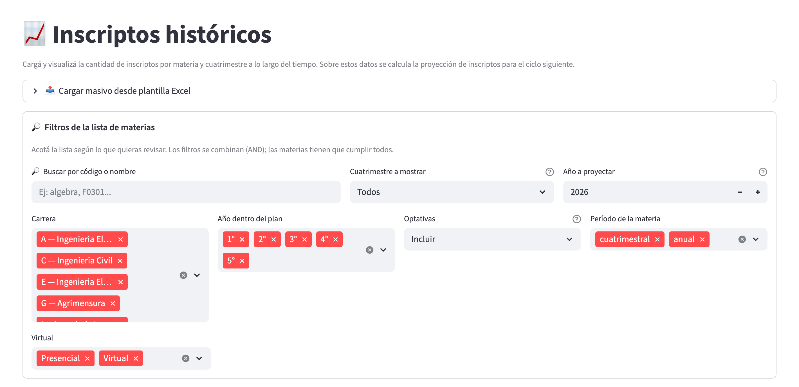
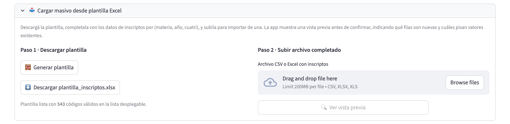
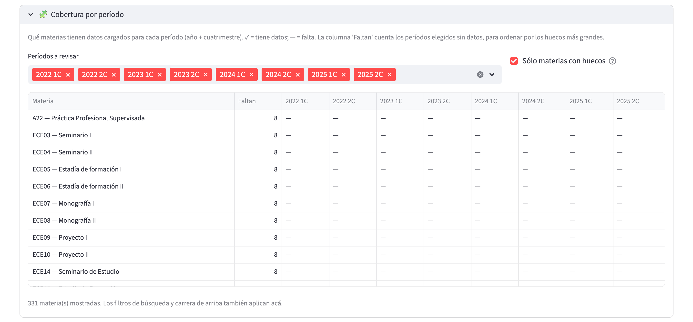
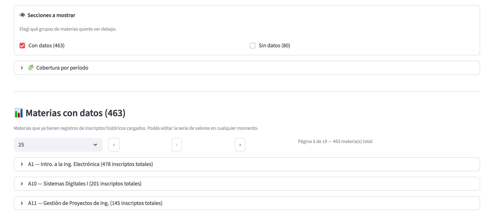
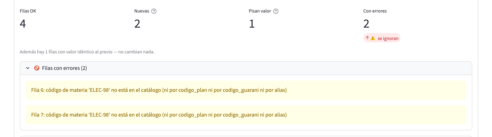
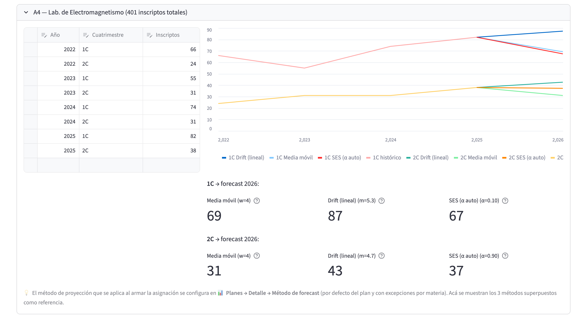
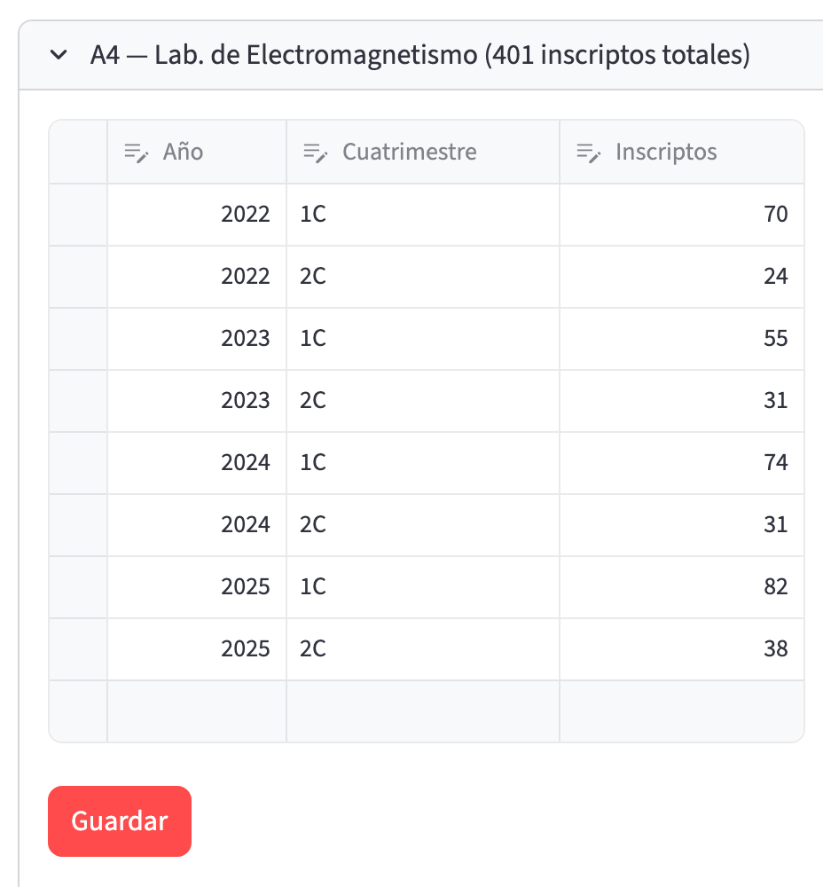
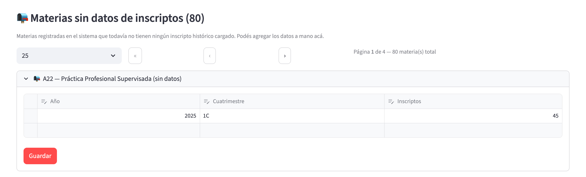
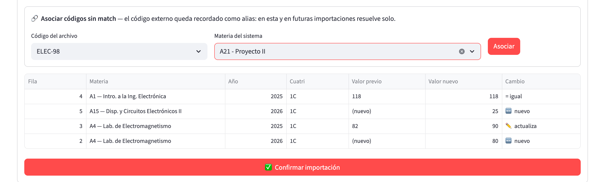
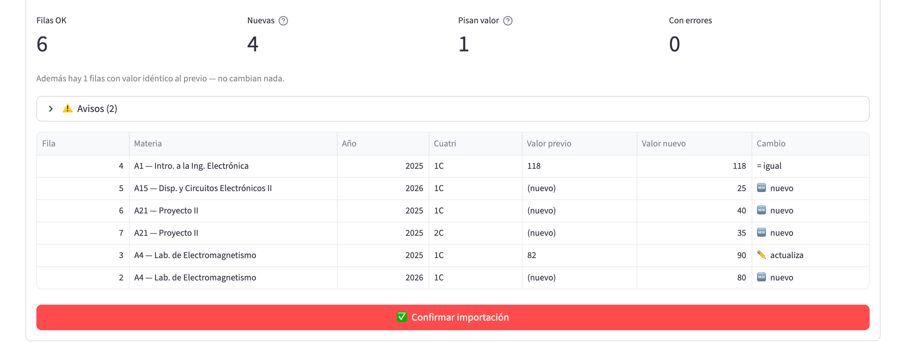

# Inscriptos

## ¿Para qué sirve?

La página **📈 Inscriptos históricos** te permite ver y mantener la serie
histórica de inscriptos por materia. Cada fila representa un dato del
tipo *"en la materia X, en el año Y, cuatrimestre Z, hubo N inscriptos"*.

A partir de esos datos, el sistema calcula una **estimación** de cuántos
alumnos se van a inscribir en cada materia del próximo cuatrimestre. Ese
número alimenta después al asignador de aulas para elegir salones con
capacidad adecuada.

En resumen, este módulo te sirve para:

- Consultar cuántos alumnos tuvo históricamente cada materia.
- Corregir o completar datos que faltan o son incorrectos.
- Comparar tres métodos distintos de estimación para el próximo
  cuatrimestre.
- Importar datos masivamente desde una plantilla Excel, con vista
  previa antes de confirmar.
- Asociar códigos externos que el sistema no reconoce a materias
  del catálogo, directamente desde la vista previa de importación.

> Importante: esta página no ejecuta la estimación por sí sola ni la
> aplica al asignador. Sólo administra los datos históricos y muestra las
> proyecciones a modo informativo. La estimación efectiva que usa el
> asignador se elige desde **📊 Cursada → 🔍 Detalle del Plan** de cada plan.

---

## ¿Cuándo vas a usar este módulo?

Vas a entrar a **Inscriptos** en estos momentos típicos:

- **Después de reinstalar el sistema o resetear la base**: para volver a
  cargar la serie histórica, ya sea importando la plantilla desde la
  propia página o corriendo el script de carga inicial.
- **Al iniciar un nuevo cuatrimestre**, para verificar que la serie
  histórica esté al día antes de generar el plan de cursada.
- **Cuando el asignador reporta capacidades raras**: si una materia
  aparece con esperados extraños, capaz que hay un dato viejo mal
  cargado o falta un año.
- **Cuando hay materias nuevas** que no tienen serie histórica y querés
  cargarles datos manualmente para que la estimación tenga base.
- **Cuando un Excel trae códigos que el sistema no reconoce**: la
  vista previa de importación los rechaza y te deja asociarlos a una
  materia existente ahí mismo (el sistema recuerda la asociación
  para siempre).

No es una página que uses todos los días. Es más bien un módulo de
mantenimiento: se toca al principio de cada cuatrimestre y después queda
tranquilo, salvo correcciones puntuales.

---

## Cómo se relaciona con el resto

Los datos de esta página alimentan la estimación de inscriptos que usa
el asignador de aulas. La cadena de dependencias es la siguiente:

1. **Vos cargás** la serie histórica acá (por script o a mano).
2. El sistema calcula, para cada materia del plan, un **valor esperado
   de inscriptos** basado en esa historia.
3. Ese valor se **reparte entre las comisiones** de la materia según el
   peso de cada una.
4. El asignador usa esos esperados por comisión para elegir aulas con
   capacidad adecuada.

> **Atajo importante**: si en la página **📊 Cursada → 🔍 Detalle del Plan** de una
> materia setés un "Total esperado (manual)", ese valor **le gana a la
> estimación calculada desde acá**. Es decir: si viste que el forecast
> automático da un número raro, podés pisarlo desde el plan, y los
> cambios que hagas después en Inscriptos no se van a propagar hasta
> que saques ese override manual desde el plan.

---

## Modelo mental

### La serie histórica

Pensá a la **serie histórica** como una tabla de tres columnas:
`materia → año → cuatrimestre → cantidad de inscriptos`. Cada combinación
(materia, año, cuatri) es única: no puede haber dos filas para la misma
materia en el mismo cuatri del mismo año. El sistema tiene tres
cuatrimestres válidos: `1C`, `2C` y `Anual` (para las materias que se
dictan durante todo el año).

### La estimación (forecast)

A partir de la serie, el sistema calcula una **estimación** para años
futuros. Se ofrecen **tres métodos** distintos, cada uno con su propia
lógica:

- **Media móvil**: promedia los valores de la serie (por defecto, todos
  los años disponibles) para estimar el próximo. Es el método más
  conservador. Sirve bien cuando la matrícula es estable año contra año.
- **Drift (lineal)**: extrapola una tendencia lineal entre el primer y el
  último dato. Si la materia viene creciendo o cayendo, este método
  captura esa pendiente.
- **SES (α auto)** (suavizado exponencial simple): le da más peso a los
  años recientes que a los viejos; el peso de suavizado (α) se calibra
  solo contra los datos históricos. Sirve cuando la matrícula está
  cambiando y querés seguir la tendencia reciente sin ser demasiado
  volátil.

La estimación se calcula por separado para cada cuatrimestre (`1C`, `2C`,
`Anual`). En el gráfico de cada materia vas a ver, para cada
cuatrimestre, la línea histórica y las tres proyecciones superpuestas.
Debajo del gráfico aparecen, por cuatrimestre, las **métricas** de cada
método: el valor proyectado y, entre paréntesis, el parámetro relevante
(`w` para la ventana de la media móvil, `m` para la pendiente del drift,
`α` para el peso de suavizado de SES). Al pasar el cursor por el signo de
pregunta se ve el error cuadrático sobre los datos históricos.

> Si un cuatrimestre tiene menos de dos puntos en la historia, sólo se
> muestra la media móvil. Los otros métodos necesitan al menos dos años
> para tener sentido.

### Override manual del esperado

Hay una tercera forma de decidir el esperado de una materia: **pisar la
estimación con un valor fijo**. Eso se hace desde **📊 Cursada → 🔍 Detalle del Plan**
(no desde acá) y **le gana a los tres métodos**. Cuando hay override
manual, el sistema muestra "Total esperado (manual)" en el detalle del
plan, y los cambios que hagas en la serie histórica quedan sin efecto
hasta que saques el override.

---

## Recorrido rápido de la página

La página no tiene barra lateral: todo está en el cuerpo, en este orden:
el importador masivo, el recuadro de filtros, el recuadro de secciones a
mostrar, la cobertura por período y las listas de materias.

**Recuadro «🔎 Filtros de la lista de materias»** (los filtros se
combinan: la materia tiene que cumplirlos todos):

- **Buscar por código o nombre**.
- **Cuatrimestre a mostrar**: `Todos`, `1C`, `2C` o `Anual`. Con `Todos`
  se ven todos los registros, incluidos los anuales; con `Anual` se
  muestran sólo los registros anuales.
- **Año a proyectar**: hasta qué año se extienden las líneas de
  estimación en el gráfico (por defecto 2026; va de 2020 a 2040).
- **Carrera**: selección múltiple para filtrar materias por carrera.
- **Año dentro del plan**: filtro por el año (1°, 2°, …) en el plan de
  estudios.
- **Optativas**: `Incluir`, `Solo` o `Excluir`.
- **Período de la materia**: `cuatrimestral` y/o `anual`.
- **Virtual**: `Presencial` y/o `Virtual` (según el catálogo de
  materia).



En la captura, los filtros aparecen en el recuadro «Filtros de la lista de materias», debajo del bloque plegado del importador; por defecto todas las carreras, años, períodos y modalidades vienen seleccionados.

**Importador masivo** (arriba de todo): el bloque plegado "📥 Cargar
masivo desde plantilla Excel", con la descarga de la plantilla (paso 1)
y la subida del archivo completado (paso 2), con vista previa antes de
confirmar.



A la izquierda está el paso 1, con el botón «Generar plantilla» y, una vez generada, el de descarga («Descargar plantilla_inscriptos.xlsx»); a la derecha, el paso 2, con la zona para subir el archivo (CSV o Excel) y el botón «Ver vista previa».

**Cobertura por período**: un desplegable con una tabla de materias
por período (año + cuatrimestre) que marca con ✓ o con un guion qué materias
tienen datos para qué períodos, con una columna "Faltan" que cuenta
los huecos. Sirve para ver de un vistazo qué falta cargar.



Arriba se eligen los períodos a revisar y, a la derecha, la casilla «Sólo materias con huecos»; cada guion de la tabla marca un período sin datos.

**Recuadro «👁 Secciones a mostrar»**: dos casillas que te permiten
mostrar u ocultar las dos secciones de materias. «Con datos» viene
tildada y «Sin datos» destildada.

**Sección 1 (📊 Materias con datos)**: lista las materias que ya tienen
serie histórica cargada. Cada materia aparece como un desplegable
(expander) titulado con el código, el nombre y el total de inscriptos
(por ejemplo, «A4 - Lab. de Electromagnetismo (401 inscriptos
totales)»), con la tabla editable de años/cuatris/inscriptos y el
gráfico con las tres estimaciones. La lista está paginada: un selector
permite mostrar 10, 25 (por defecto), 50 o 100 materias por página, con
botones para ir a la primera página, a la anterior y a la siguiente.



Las casillas «Con datos» y «Sin datos» muestran entre paréntesis cuántas materias hay en cada grupo; debajo, la lista paginada de materias, cada una como un desplegable.

**Sección 2 (📭 Materias sin datos de inscriptos)**: lista las materias
del catálogo que todavía no tienen ninguna fila cargada, con el mismo
paginador. Podés agregar filas a mano acá.

---

## Tareas comunes

### Importar datos masivamente desde la plantilla Excel

**Cuándo hacerlo**: cuando tenés que cargar o actualizar muchos datos
de una (por ejemplo, la serie del último año que llegó de la
facultad).

**Paso a paso**:

1. En el bloque **📥 Cargar masivo desde plantilla Excel**, generá y
   descargá la **plantilla**. La materia se ingresa por código (lista
   desplegable); el nombre aparece solo, como verificación. La hoja
   **Materias** trae el contexto del catálogo, incluido el **código
   Guaraní**, útil para cruzar con las planillas de la facultad.
2. Completá una fila por combinación (materia, año, cuatrimestre) y
   subí el archivo.
3. Apretá **🔍 Ver vista previa**. El sistema muestra cuántas filas
   son nuevas, cuántas pisan valores existentes y cuáles tienen
   errores (que no se importan). Si el Excel tiene varias hojas,
   antes aparece un selector «Hoja del Excel a importar» (arranca en
   la hoja «Inscriptos», si existe). El botón 🗑 cancela la vista
   previa.

   

   Las cuatro cifras de arriba («Filas OK», «Nuevas», «Pisan valor» y «Con errores») resumen el archivo; debajo, una nota indica cuántas filas traen un valor idéntico al previo (no cambian nada) y el desplegable «Filas con errores» detalla cada fila que no se va a importar y por qué. Si hay avisos, aparecen en otro desplegable, «Avisos». Más abajo se ve la tabla de filas correctas, con el valor previo, el valor nuevo y el tipo de cambio (nuevo, actualiza o igual).
4. Si el archivo trae **códigos que el sistema no reconoce**, la
   vista previa te ofrece asociarlos: elegís la materia destino,
   apretás **Asociar**, y la vista previa se regenera con esas filas
   ya resueltas. La asociación queda recordada para futuras
   importaciones.
5. Apretá **✅ Confirmar importación**. Un aviso emergente informa
   cuántos registros se insertaron, cuántos se actualizaron y cuántos
   quedaron sin cambio. La semántica es de sobreescritura: si la combinación
   (materia, año, cuatri) ya existía, el valor del archivo la pisa.

### Cargar la serie histórica desde el Excel maestro (script)

Para la carga inicial del sistema también existe un script de línea
de comandos. Los pasos son:

1. Asegurate de que el Excel maestro esté en su ruta esperada:
   `data/input/inscriptos/final_df.xlsx`. El archivo debe tener las
   columnas `codigo`, `actividad`, `year`, `period` y `cant._inscriptos`.
2. Desde una terminal, en la raíz del proyecto, correr:

   ```bash
   python -m scripts.load_inscriptos
   ```

3. Si querés vaciar la serie previa antes de cargar, usá:

   ```bash
   python -m scripts.load_inscriptos --reset
   ```

   > Ojo: `--reset` borra **toda** la tabla de inscriptos históricos.
   > Sin `--reset` el script hace *upsert*: si ya existía la
   > combinación (materia, año, cuatri), pisa el valor; si no, la crea.

4. Cuando termine, entrá a la página de Inscriptos y verificá que las
   materias muestren datos.

El script tiene un mecanismo de matcheo por capas para relacionar los
códigos del Excel con las materias del sistema:

- Match directo por código idéntico.
- Normalización por formato según reglas hardcodeadas por carrera (por
  ejemplo, `IA11 → IA 1.1` para TUIA, `PF14 → PF1.4` para Profesorado
  de Física, etc.).
- Match por nombre dentro de la misma carrera.
- Tabla de correcciones manuales para tipos de nombre (por ejemplo,
  "Algebra" ↔ "Álgebra", "del Software" ↔ "de Software").

Los códigos que no matchean por ninguna de esas capas se pueden
asociar a mano desde la vista previa del importador de la página
(subiendo el mismo archivo por la UI).

### Ver la proyección de inscriptos para una materia

1. Entrá a la página **📈 Inscriptos históricos**.
2. Buscá la materia por código o nombre en el recuadro de filtros.
3. Expandí el desplegable de la materia.
4. Vas a ver:
   - La **tabla histórica** con año, cuatri e inscriptos.
   - El **gráfico** con la serie histórica de cada cuatrimestre y las
     tres estimaciones superpuestas hasta el año elegido en «Año a
     proyectar».
   - Las **métricas** debajo del gráfico, una por método y por
     cuatrimestre, con el valor proyectado y el parámetro relevante.



A la izquierda está la tabla editable de la serie; a la derecha, el gráfico con una línea histórica por cuatrimestre y las tres proyecciones, y debajo las métricas de cada método para el año a proyectar. Al pie del desplegable, una nota recuerda que el método que se aplica en la asignación se configura en la página de Cursada.

### Ver los tres métodos de forecast comparados

Cada expander de materia con datos muestra en su gráfico tres líneas de
proyección superpuestas por cuatrimestre (una por método): media móvil,
drift lineal y SES. Debajo del gráfico, tres cajitas por cuatrimestre
con el valor proyectado de cada método, para que puedas compararlos
rápidamente.

Los tres métodos se calculan siempre. La elección de **cuál se usa en
la asignación** se hace más adelante, desde **📊 Cursada**: el método por
defecto del plan está en «✏️ Editar metadata» y la excepción por materia
en **🔍 Detalle del Plan** («Método de forecast (override)»).

### Editar o corregir un dato histórico

1. En **"📊 Materias con datos"**, expandí la materia.
2. Editá el valor de inscriptos directamente en la tabla del editor.
3. Podés cambiar el año (entre 2020 y 2035), el cuatri (`1C`, `2C` o
   `Anual`) o la cantidad, y también agregar o borrar filas.
4. Apretá **Guardar**. Los cuatrimestres que el filtro esconde quedan
   intactos: el guardado sólo toca lo visible en el editor.



El botón «Guardar» aparece debajo de la tabla recién cuando se modificó algún valor.

### Agregar datos manualmente a una materia sin serie histórica

1. Tildá la casilla «Sin datos» en «Secciones a mostrar» y, en la
   sección **"📭 Materias sin datos de inscriptos"**, buscá la materia y
   expandila.
2. En el editor vacío, agregá una o más filas con año, cuatri e
   inscriptos.
3. Apretá **Guardar**. La materia va a pasar automáticamente a la
   sección "Materias con datos" en el próximo refresco.



Para que esta sección aparezca hay que tildar la casilla «Sin datos» en «Secciones a mostrar»; el botón «Guardar» aparece al cargar la primera fila.

### Asociar un código externo que el sistema no reconoce

Cuando un archivo trae códigos que no matchean con ninguna materia
(ni por código, ni por código Guaraní, ni por una asociación
previa), la **vista previa de importación** rechaza esas filas y
muestra el bloque **🔗 Asociar códigos sin match**:

1. Elegí el **Código del archivo** y la **Materia del sistema** (destino).

   

   A la izquierda se elige el código del archivo y en el centro la materia destino; el botón «Asociar» queda habilitado recién cuando hay una materia elegida.
2. Apretá **Asociar**. La asociación queda guardada como alias: en
   esta y en todas las importaciones futuras, ese código resuelve
   solo.
3. La vista previa se regenera al instante con esas filas ya
   resueltas; confirmá cuando te cierre.



Después de asociar, las filas del código pasan a la tabla con la materia elegida y el contador «Con errores» baja a cero.

Si la materia destino ya tenía datos para un (año, cuatri), el valor
del archivo **pisa** al existente (la vista previa te muestra qué
filas pisan valores antes de confirmar).

### Ver qué materias no tienen datos para qué períodos

1. Abrí el desplegable **🧩 Cobertura por período**.
2. En «Períodos a revisar» elegí los períodos que te interesan (por
   defecto están todos) y dejá tildado "Sólo materias con huecos" (viene
   tildado por defecto).
3. La tabla muestra una fila por materia, con ✓ o un guion por período y la
   columna **Faltan** con la cantidad de huecos, ordenada por los
   huecos más grandes. Respeta los filtros de la lista de materias
   (búsqueda, carrera, año del plan, etc.).

### Filtrar por carrera / año / cuatri / modalidad

Todos los filtros están en el recuadro «Filtros de la lista de
materias»:

- **Buscar por código o nombre**: por código o parte del nombre.
- **Cuatrimestre a mostrar**: `Todos`, `1C`, `2C` o `Anual`.
- **Carrera**: multiselect. Materias que no pertenecen a ningún plan
  ("huérfanas") sólo aparecen si el filtro incluye todas las carreras.
- **Año dentro del plan**: filtra materias por año en el plan de
  estudios.
- **Optativas**: `Incluir`, `Solo` o `Excluir`.
- **Período de la materia**: `cuatrimestral` o `anual` (del catálogo de
  la materia).
- **Virtual**: `Presencial` o `Virtual` (del catálogo, no del dictado
  del ciclo).

Los filtros se combinan: primero se filtran las materias visibles,
después la cobertura y las secciones se recalculan sobre ese
subconjunto.

---

## Errores frecuentes y qué hacer

### La vista previa rechaza filas por el código de materia

**Síntoma**: la vista previa lista filas con errores del estilo
"código X no está en el catálogo".

**Causa**: el código del archivo no matchea ni por código interno,
ni por código Guaraní, ni por una asociación previa.

**Solución**: usá el bloque **🔗 Asociar códigos sin match** de la
misma vista previa para vincular el código a la materia correcta. La
asociación queda recordada y la vista previa se regenera sola.

### El gráfico dice "Sin datos para graficar"

Significa que la materia no tiene serie histórica (aunque el catálogo
la reconozca). Verificá:

- Que hayas corrido `python -m scripts.load_inscriptos` alguna vez.
- Que el filtro «Cuatrimestre a mostrar» no esté escondiendo las filas
  (por ejemplo, si la materia sólo tiene datos "Anuales" y filtraste por
  `1C`, no vas a ver nada).

### El asignador dice esperados raros aunque cambié los datos acá

Muy probablemente hay un **override manual** activo en el plan.
Verificá en **📊 Cursada → 🔍 Detalle del Plan → [materia] → Total esperado
(manual)**. Si hay un número puesto ahí, el asignador lo usa y los
cambios en la serie histórica no le llegan. Sacá el override o
actualizá el valor manual.

---

## Preguntas frecuentes

### ¿Por qué la materia X no tiene datos históricos?

Puede ser por varias razones:

- La materia es **nueva** en el plan de estudios y no tenía dictados en
  años previos.
- La materia **cambió de código** entre años y el matcheo automático no
  detectó la equivalencia. Importá el archivo por la UI y asociá el
  código desde la vista previa.
- El script de carga inicial nunca se corrió: hacelo con
  `python -m scripts.load_inscriptos`.
- El Excel maestro `final_df.xlsx` no incluye esa materia.

### ¿Qué método de forecast conviene?

Depende del comportamiento de la matrícula de la materia:

- **Media móvil**: para materias con matrícula estable año contra año.
  Es el método más conservador.
- **Drift (lineal)**: para materias con tendencia clara (crecimiento o
  caída sostenido). Requiere al menos dos años de historia.
- **SES**: para materias con cambios recientes que querés capturar
  rápido. Requiere al menos dos años.

La elección efectiva del método que usa el asignador se hace desde
**📊 Cursada → 🔍 Detalle del Plan** del plan del ciclo, no desde acá. Podés dejar
un default por plan y sobreescribirlo por materia si hay excepciones.

### ¿Cómo hago para pisar la estimación con un valor manual?

No se hace desde esta página. El override manual (**"Total esperado
(manual)"**) se setea desde **📊 Cursada → 🔍 Detalle del Plan** → seleccionar la
materia → cargar el valor. Ese número le gana a los tres métodos de
estimación y le gana a lo que haya en la serie histórica.

### Cambio los datos acá y el asignador no lo refleja, ¿por qué?

Casi seguro hay un **override manual** puesto en el plan. Cuando el
plan tiene un "Total esperado (manual)" para una materia, la estimación
calculada desde esta página se ignora completamente. Sacá el override
desde **📊 Cursada → 🔍 Detalle del Plan** para que vuelva a mandar la serie
histórica.

### Los datos de esta página, ¿quedan en el historial?

**No**. Todas las ediciones que hagas en Inscriptos (guardar, asociar,
cargar por script) son silenciosas: no dejan rastro en la página
**📜 Historial**. Si querés tener trazabilidad de los cambios, hacé
backup periódico de `data/database.db` antes de tocar la serie
histórica.

### ¿Puedo ver sólo las materias "anuales"?

Sí. Hay dos formas: poner «Cuatrimestre a mostrar» en `Anual` (muestra
sólo los registros cargados como anuales) o dejar «Período de la
materia» sólo en `anual` (filtra por lo que dice el catálogo de la
materia).

### ¿Puedo cargar un Excel nuevo desde la UI?

Sí. El bloque **📥 Cargar masivo desde plantilla Excel** de la misma
página descarga la plantilla y sube el archivo completado, con vista
previa antes de confirmar. El script `load_inscriptos` de línea de
comandos queda para la carga inicial del sistema.

---

## Términos importantes de este módulo

- **Serie histórica**: la tabla de datos históricos por (materia, año,
  cuatri). Es la base de la estimación.
- **Estimación (o forecast)**: valor proyectado de inscriptos para un
  año futuro, calculado a partir de la serie histórica.
- **Método de estimación**: la fórmula usada para proyectar. Hay tres:
  media móvil, drift lineal y SES.
- **Override manual de esperados**: un valor fijo que se setea desde
  el detalle del plan y le gana a los tres métodos. Cuando está puesto,
  la serie histórica no se usa para esa materia.
- **Código sin match**: código de un archivo que el sistema no pudo
  asociar automáticamente a ninguna materia. La vista previa de
  importación lo rechaza y ofrece la asociación manual.
- **Asociar**: acción de vincular un código externo a una materia del
  sistema. La asociación queda recordada (alias) para futuras
  importaciones; los valores del archivo pisan a los existentes para
  el mismo (año, cuatri).
- **Cuatrimestre "Anual"**: valor válido en la serie histórica para
  materias que se dictan durante todo el año. Se puede filtrar con
  «Cuatrimestre a mostrar» en `Anual`; con `Todos` también aparecen.
