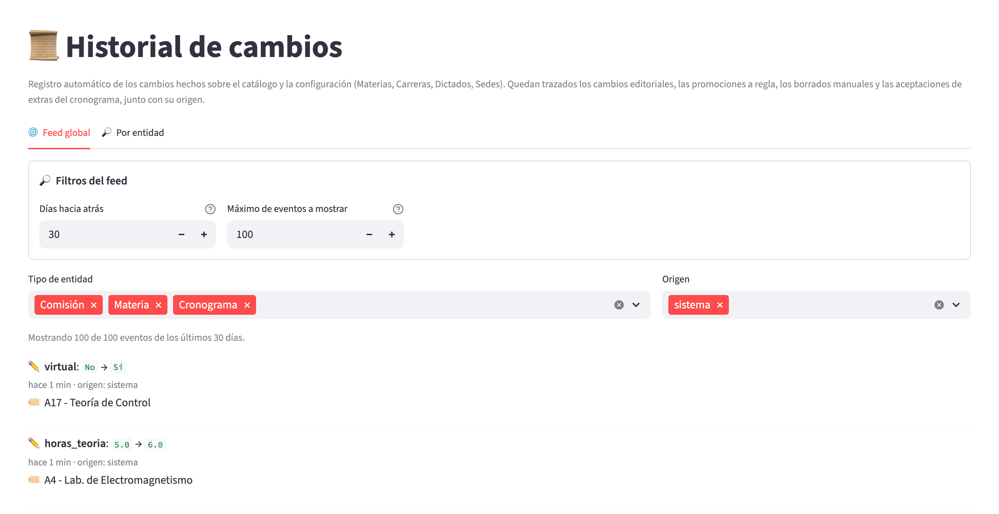
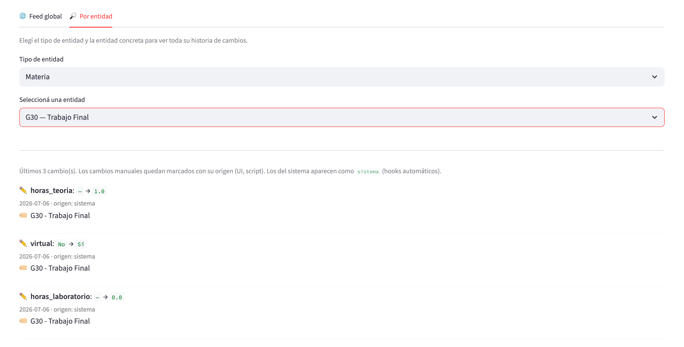
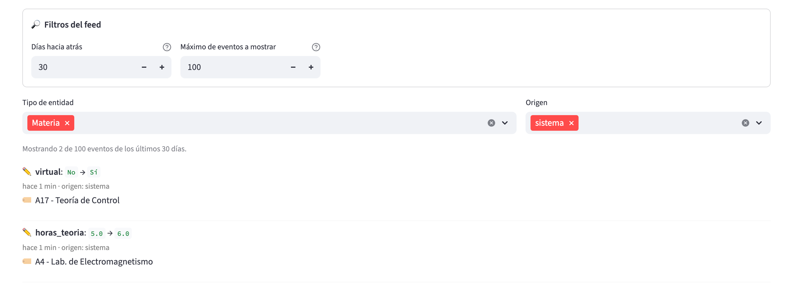

# Historial

## ¿Para qué sirve?

La página **📜 Historial** te muestra un registro de cambios de las
decisiones importantes que se tomaron en el sistema. Cada vez que
alguien modifica una materia, un dictado, una carrera, una sede, un plan
de cursada, una comisión, un horario o un cronograma (entre otras cosas),
queda una fila con el "antes" y el "después", cuándo se hizo y desde qué
página.

Es una vista de solo lectura: sirve para consultar, no para modificar.
No permite deshacer cambios, ni editarlos, ni exportarlos a un archivo.

En resumen, sirve para responder preguntas como:

- ¿Cuándo se marcó como virtual este dictado?
- ¿Alguien tocó las horas de teoría de esta materia en los últimos días?
- ¿Cuándo se activó el recursado para esta carrera?
- ¿De qué página vino este cambio (Ciclos, Planes, Validación)?

---

## ¿Cuándo vas a usar este módulo?

Vas a entrar a **Historial** en estos escenarios típicos:

- **Investigar un cambio inesperado**: alguien pregunta "¿por qué esta
  materia figura como virtual?" o "¿desde cuándo esta carrera dicta
  recursado?".
- **Auditar la etapa previa al cierre del cuatrimestre**: antes de
  dar por definitivo el plan de trabajo, revisar el feed reciente para detectar
  ediciones sospechosas hechas por otras sesiones.
- **Verificar que un cambio masivo se aplicó**: por ejemplo, después de
  usar "Aplicar todo" en el panel de divergencias, revisar que las
  materias hayan quedado con los flags correctos.
- **Reconstruir el contexto** de una decisión pasada: por qué se creó
  este dictado, por qué se aceptó como virtual, etc.

No es una página que uses todos los días. Es más bien una herramienta
de diagnóstico y auditoría puntual.

---

## Cómo se relaciona con el resto

El historial se **alimenta automáticamente**: cada vez que se cambia un
campo trackeado en cualquier otra página del sistema, se genera una
fila acá. No hay que hacer nada manualmente para que se registre.

La página **no afecta** al resto del sistema. Es puramente lectura.

Pensalo así:

- **📚 Materias / 🎓 Carreras / 📆 Ciclos / 📊 Cursada / ✅ Validación**:
  producen eventos.
- **📜 Historial**: los consume y los muestra.

---

## Modelo mental

### Qué eventos se registran

El sistema registra automáticamente los cambios sobre estas entidades:

**Catálogo maestro**

- **Materias**: modificación de los flags `virtual` (modalidad de
  catálogo), `dicta_recursado`, `optativa`, activación, y de las horas
  de teoría / laboratorio. También alta y baja.
- **Carreras**: modificación del flag `dicta_recursado`. También alta y
  baja.
- **Dictados**: modificación del flag `virtual` (modalidad del ciclo).
  También alta y baja.
- **Dictados por ciclo (bridge)**: alta y baja del vínculo entre un
  dictado y un ciclo.
- **Sedes**: modificación del flag "es sede por defecto para materias
  comunes". También alta y baja.

**Cronogramas (pre-plan)**

- **Cronogramas**: modificación del nombre y del ciclo. También alta
  y baja.
- **Entradas del cronograma**: modificación del día, hora inicio,
  hora fin, comisión asignada, tipo de clase, override de
  virtualidad. También alta y baja.

**Plan de cursada**

- **Planes de cursada**: modificación del nombre, descripción, ciclo,
  y método de forecast por defecto. También alta y baja.
- **Comisiones**: modificación del nombre, número, cupo, coeficiente
  de asignación, dictado y carrera asignada. También alta y baja.
- **Horarios del plan**: modificación del aula asignada, tipo de
  clase, día, hora inicio, hora fin, override de virtualidad y del
  flag "aula asignada manualmente". También alta y baja.

### Qué NO se registra

Esto es tan importante como lo anterior. Los siguientes cambios **no
dejan rastro individual** en el historial:

- **Corridas del asignador**: no emiten un evento por cada horario
  reasignado. En su lugar, cada corrida óptima que efectivamente
  cambia alguna asignación genera **una sola fila agregada** en el
  historial (tipo «Corrida del asignador», acción creación, origen técnico
  `lp:run`) con el detalle de reasignaciones (`horario_id`, `aula_previa`,
  `aula_nueva`) en el valor nuevo. Las corridas idempotentes (mismos
  parámetros, sin cambios en el patrón) NO emiten evento. La fila de
  `LPRunDB` sigue guardando la solución completa, tolerancias y
  métricas por su lado.
- Ediciones sobre la serie histórica de inscriptos (ni guardados, ni
  importaciones, ni asociaciones de códigos).
- Alta, baja y edición de ciclos.
- Ediciones sobre los overrides manuales del forecast (el "Total
  esperado (manual)" del plan).
- Ediciones sobre aulas del catálogo y sedes (excepto el flag "es
  sede por defecto" de sedes).
- Cambios directos hechos por scripts o comandos de línea (por
  ejemplo, reinicializar la base entera con `load_initial_data
  --reset` no queda registrado).
- Cambios en el nombre, el código o el período de una materia (esos
  campos no están trackeados aunque otros de la misma materia sí lo
  estén).

> **Regla mental**: el historial audita **cambios individuales del
> catálogo, del plan y del cronograma**. Las corridas del asignador
> (operaciones masivas) se auditan con una sola fila agregada por
> corrida para mantener el historial legible.

### Estructura de un evento

Cada fila del historial tiene los siguientes datos:

- **Acción**: si fue una creación (➕), una edición (✏️) o un borrado
  (🗑️).
- **Tipo de entidad**: se muestra en el filtro del feed con estos
  nombres: Materia, Carrera, Dictado, Dictado en ciclo, Sede, Horario,
  Comisión, Plan de cursada, Cronograma, Entrada de cronograma y
  Corrida del asignador.
- **Etiqueta de la entidad**: identificación humana (nombre + código o
  similar), preservada aunque después la entidad se borre.
- **Campo**: qué campo cambió (sólo para ediciones).
- **Valor viejo → valor nuevo**: sólo para ediciones. Los valores
  lógicos se muestran como `Sí` / `No`; un valor vacío, como un guion largo.
- **Cuándo**: fecha y hora del cambio, en formato relativo ("hace unos
  segundos", "hace 5 min", "hace 3 h", "hace 4 días") o fecha absoluta
  para eventos viejos.
- **Origen**: desde qué página o proceso se hizo (por ejemplo, "UI
  Ciclos", "UI Validación", "UI Planes", "sistema" para los cambios
  automáticos).
- **Razón**: descripción en texto libre del contexto. Aparece
  cuando la operación fue masiva (aplicar todo, promover a regla,
  etc.) o una acción explícita del usuario. Puede estar vacía para
  cambios sin contexto declarado.

> **Nota sobre las fechas absolutas**: cuando un evento es más viejo que
> 30 días, la UI muestra la fecha en formato absoluto (`AAAA-MM-DD`).
> Esa fecha está en **hora UTC**, no en la hora local de Rosario. Si
> mirás un evento que dice "2026-07-15" y son las 22:00 en Argentina
> del 14 de julio, el evento efectivamente puede haber ocurrido en
> horario local del 14. La diferencia es de 3 horas.

### Origen del cambio

Cada evento incluye un **origen** que indica de dónde vino el cambio.
Los orígenes que vas a ver (con la etiqueta que muestra la pantalla) son:

- **sistema**: cambio automático (hecho desde una página que no declara
  contexto explícito, como Materias o Carreras).
- **UI Ciclos**: desde la página de Ciclos, en general desde el panel
  de divergencias o desde acciones masivas.
- **UI Validación**: desde la validación (aceptar materias del
  cronograma, desactivar en bloque).
- **UI Planes**: desde la edición de un plan (por ejemplo, el flag
  virtual de un horario o el cambio de carrera asignada de una
  comisión).
- **script**: cambio hecho desde línea de comandos.

> **Aclaración**: el filtro puede incluir también las etiquetas "UI
> Materias" y "UI Carreras", pero en la práctica esas páginas no marcan
> contexto explícito, por lo que sus cambios quedan con origen
> «sistema». Es una limitación conocida.

---

## Recorrido rápido de la página

Debajo del título «Historial de cambios» y de una breve descripción, la
página se divide en dos pestañas:

### Pestaña 1: 🌐 Feed global

Muestra los cambios más recientes de todo el sistema, en orden
cronológico descendente.

Controles superiores:

Dentro del recuadro «🔎 Filtros del feed»:

- **Días hacia atrás**: ventana temporal (por defecto 30, mínimo 1,
  máximo 365). Sólo se muestran eventos ocurridos en esa ventana.
- **Máximo de eventos a mostrar**: tope de resultados (por defecto 100,
  mínimo 10, máximo 500, de a 10). Si hay más eventos en la ventana, se
  muestran los más recientes.

Debajo del recuadro aparecen dos filtros más:

- **Tipo de entidad**: selección múltiple. Sólo aparecen los tipos que
  efectivamente hay en la ventana.
- **Origen**: selección múltiple. Sólo aparecen los orígenes presentes
  en la ventana.

Un contador indica «Mostrando X de Y eventos de los últimos N días». Si
no hay ningún evento en la ventana, en cambio, la pestaña muestra sólo el
aviso «Sin cambios en los últimos N días» y no ofrece estos filtros.

> **Cuidado con la interacción entre "Días hacia atrás" y "Máximo de eventos a mostrar"**:
> el sistema primero trae hasta N eventos y después filtra por
> antigüedad. Si en las últimas horas hubo muchísimos cambios y el tope
> de eventos es bajo, es posible que el filtro por antigüedad no traiga
> eventos "viejos" de días anteriores porque quedaron cortados antes.
> Si sospechás que estás perdiendo eventos viejos, subí "Máximo de
> eventos a mostrar" a 500.

Cada evento se muestra como una fila de una línea de tiempo con la
información descripta arriba.



En la captura, los dos controles numéricos («Días hacia atrás» y «Máximo de eventos a mostrar») están en el recuadro «Filtros del feed»; debajo aparecen los selectores «Tipo de entidad» y «Origen», el contador de eventos mostrados y la lista, con el evento más reciente arriba.

### Pestaña 2: 🔎 Por entidad

Te permite consultar el historial completo de una entidad puntual.

- **Tipo de entidad**: `Materia`, `Carrera`, `Dictado`, `Sede`.
- **Seleccioná una entidad**: se filtra por tipo. Ejemplo: si elegís
  "Materia", te aparecen todas las materias del sistema (código y
  nombre); los dictados se listan con su código y la materia entre
  paréntesis.

Al seleccionar una entidad, un texto indica «Últimos N cambio(s)» y se
muestran hasta **50 eventos** de esa entidad, del más reciente al más
viejo. Si la entidad no tiene cambios, aparece «Sin cambios registrados
para esta entidad.».



Arriba se elige el tipo y después la entidad concreta; los eventos de más de 30 días, como los de la captura, se muestran con su fecha en lugar del tiempo relativo. Un valor previo vacío se ve como un guion largo.

> **Limitación**: si la entidad tiene más de 50 eventos, los más viejos
> quedan truncados sin indicador visual de "hay más". El límite no es
> configurable desde la UI. Para ver eventos más viejos de una entidad,
> hay que consultar directamente la base de datos.

---

## Tareas comunes

### Ver los cambios recientes en el sistema (feed global)

1. Entrá a **📜 Historial**.
2. Quedate en la pestaña **🌐 Feed global** (viene seleccionada por
   defecto).
3. Ajustá "Días hacia atrás" al rango que te interese (por defecto 30).
4. Si querés más resolución, subí "Máximo de eventos a mostrar" a 500.
5. Recorré el feed para ver los eventos.

### Ver el historial completo de una materia / carrera / dictado / sede

1. Entrá a **📜 Historial**.
2. Andá a la pestaña **🔎 Por entidad**.
3. En «Tipo de entidad», elegí `Materia`, `Carrera`, `Dictado` o
   `Sede`.
4. En «Seleccioná una entidad», elegí la entidad específica.
5. Vas a ver hasta 50 eventos.

### Filtrar por tipo de entidad o por origen

En la pestaña **🌐 Feed global**:

1. Ajustá "Días hacia atrás" y "Máximo de eventos a mostrar" para
   definir la ventana.
2. En los selectores de "Tipo de entidad" y "Origen" que aparecen bajo
   el recuadro de filtros, dejá los que te interesan (por defecto están
   todos tildados).
3. El feed se actualiza automáticamente con la selección.



En la captura se dejó sólo «Materia» en «Tipo de entidad»: el contador pasa a indicar cuántos de los eventos de la ventana cumplen el filtro, y cada edición muestra el campo, el valor anterior y el nuevo. El contador indica «Mostrando 2 de 100 eventos…».

> Ojo: los filtros muestran solo los tipos y orígenes presentes en la
> ventana actual. Si un tipo no aparece en la lista, es porque en los
> últimos N días no hubo eventos de ese tipo (o quedaron cortados por
> el tope de eventos).

### Interpretar un evento

Cada fila del feed tiene, de arriba hacia abajo:

- **Icono de acción y detalle**:
  - ➕ **creada**: creación de una entidad.
  - ✏️ **campo**: `viejo` → `nuevo`: edición de un campo. Ejemplo:
    **virtual**: `No` → `Sí`.
  - 🗑️ **borrada**: borrado de una entidad.
- **Cuándo y origen**, en una línea gris: "hace 5 min · origen:
  sistema". El tiempo es relativo ("hace unos segundos", "hace 5 min",
  "hace 3 h", "hace 4 días") o fecha absoluta si el evento es más viejo
  que 30 días.
- **Etiqueta de la entidad** (🏷️): nombre y código de la entidad
  afectada.
- **Razón** (💬), en cursiva: texto libre que explica el contexto (por
  ejemplo, "Bulk promover: crear-en-regla en 4 materia(s) desde el
  panel de divergencias del ciclo 2026-1C"). Puede estar vacía.

**Ejemplo real** (como se ve en la captura del feed):

```
✏️ virtual: No → Sí
   hace 1 min · origen: sistema
   🏷️ A17 - Teoría de Control
```

Este evento significa que hace un minuto se marcó como virtual la
materia «A17 - Teoría de Control», con origen «sistema» (cambio hecho
desde una página que no declara contexto).

**Ejemplo con razón explícita**:

```
✏️ dicta_recursado: No → Sí
   hace 15 min · origen: UI Ciclos
   🏷️ IA 2.3 - Bases de Datos
   💬 Bulk promover: crear-en-regla en 4 materia(s) desde el panel de
   divergencias del ciclo 2026-1C
```

Este evento significa que hace 15 minutos, desde el panel de
divergencias del ciclo 2026-1C, se activó el flag `dicta_recursado` de
IA 2.3 como parte de una acción masiva sobre 4 materias.

---

## Errores frecuentes y qué hacer

### Miré el historial y no encuentro el cambio que esperaba

Posibles causas:

- **El cambio no se audita**: revisá la sección "Qué NO se registra"
  arriba. Si es una edición sobre ciclos, aulas, inscriptos, overrides
  manuales del forecast o una reasignación individual del asignador,
  el historial no guarda ese cambio.
- **El campo no está trackeado**: aunque la entidad esté auditada, sólo
  algunos campos específicos generan eventos. Por ejemplo, el nombre y
  el código de una materia no están trackeados.
- **La ventana temporal no lo incluye**: subí "Días hacia atrás" hasta
  365 si buscás algo viejo.
- **El tope de eventos lo cortó**: subí "Máximo de eventos a mostrar" a
  500 y ajustá los filtros para reducir el ruido.

### El evento dice "hace 3 h" pero yo lo hice hace unos minutos

Verificá el reloj del servidor. Todos los timestamps se guardan en
**hora UTC**, mientras que Argentina está en UTC-3. Cuando el evento
es reciente, la UI convierte a formato relativo comparando con la hora
UTC actual, por lo que la diferencia horaria no debería afectar. Si
ves un desfasaje mayor a segundos/minutos, capaz que el reloj del
sistema anda mal.

### La página muestra "Sin cambios en los últimos N días"

- Verificá que la ventana temporal cubra el período que buscás
  ("Días hacia atrás").
- Verificá que los filtros por tipo y origen no estén excluyendo todo.
- Si acabás de iniciar el sistema por primera vez, es normal: el
  historial arranca vacío y se llena a medida que se hacen cambios.

### Necesito el historial en un archivo, pero no hay exportar

No hay funcionalidad de exportación desde la UI. Si necesitás llevarte
los datos a Excel u otra herramienta, tenés que consultar directamente
la base de datos (`data/database.db`), tabla `change_log`. Se puede
usar cualquier cliente SQLite (por ejemplo, DB Browser for SQLite).

---

## Preguntas frecuentes

### ¿Se guarda absolutamente todo?

**No**. El historial guarda cambios del **catálogo, del plan y del
cronograma**, pero sólo de ciertos campos. En concreto:

- **Sí se guarda**: cambios sobre materias, carreras, dictados y sedes
  (algunos campos), vínculos dictado-ciclo, planes de cursada (nombre,
  descripción, ciclo, método de forecast por defecto), comisiones,
  horarios del plan, cronogramas y sus entradas (los campos listados
  arriba), y una fila agregada por cada corrida del asignador que
  cambia alguna asignación.
- **No se guarda**: ciclos (creación y edición), inscriptos, overrides
  manuales del forecast, aulas (excepto el flag de sede por defecto),
  cambios por script de línea de comandos, campos no listados (por
  ejemplo, el nombre y el código de una materia) y las reasignaciones
  individuales de horarios hechas por el asignador.

Si necesitás trazabilidad de operaciones que no están cubiertas, hacé
backup periódico de `data/database.db`.

### ¿Puedo deshacer un cambio desde acá?

**No**. El historial es puramente informativo: no ofrece "revertir".
Si querés volver atrás un cambio, tenés que editarlo manualmente en la
página correspondiente, poniendo el valor viejo a mano.

### ¿Puedo exportar el historial?

**No desde la UI**. La única forma de sacar los datos afuera es
consultando directamente la base de datos (`data/database.db`, tabla
`change_log`) con un cliente SQLite.

### ¿Se puede saber quién hizo el cambio?

**No**. El sistema no tiene login de usuarios; es una app local. Lo
que sí queda registrado es el **origen del cambio**: desde qué página
se hizo (Ciclos, Validación, Planes, etc.) o si fue un cambio
automático de un hook interno. Si querés atribuir cambios a personas
distintas, hoy hay que coordinarlo con un mecanismo externo (por
ejemplo, ponerse de acuerdo en usar el sistema por turnos).

### ¿Por qué hay eventos con origen "sistema" y sin razón?

Los eventos con origen «sistema» son los que se generan por el mecanismo
automático interno cuando se toca un campo trackeado sin declarar
contexto explícito. Típicamente vienen de las páginas de Materias y
Carreras, que no envuelven sus operaciones en un contexto de auditoría.
No es un problema: significa que el cambio ocurrió, pero no hay
descripción libre de por qué.

### El historial de una entidad se corta en 50 eventos, ¿cómo veo más?

La pestaña "Por entidad" tiene un límite fijo de 50 eventos por entidad.
No es configurable desde la UI. Alternativas:

- Usar la pestaña **Feed global** con "Máximo de eventos a mostrar" en 500 y filtrar por
  tipo de entidad + búsqueda visual.
- Consultar la base de datos directamente.

### ¿El historial crece indefinidamente?

Sí. No hay política automática de retención ni de limpieza. La tabla
crece linealmente con el uso del sistema. Como la base es local
(SQLite), en la práctica no es un problema hasta que la tabla se pone
muy grande (decenas de miles de eventos). Si en algún momento hace
falta, hay que hacer un mantenimiento manual desde la base de datos.

### Cambio el nombre de una materia y no queda en el historial, ¿está bien?

Sí, es el comportamiento actual: los campos `nombre`, `codigo` y
`periodo` de las materias no están dentro de la lista de campos
trackeados. Sólo se auditan los flags que impactan a políticas de
asignación (`virtual`, `active`, `dicta_recursado`, `optativa`,
`horas_teoria`, `horas_laboratorio`).

### ¿Aparece "Comisión" o "Horario" en los tipos de entidad?

En la pestaña **Por entidad** el selector sólo ofrece `Materia`,
`Carrera`, `Dictado` y `Sede`. No aparecen `Comisión`, `Horario`,
`Plan de cursada` ni `Cronograma`, aunque haya eventos de esos tipos.
Para verlos, andá a la pestaña **Feed global** y filtrá por tipo de
entidad.

---

## Términos importantes de este módulo

- **Registro de cambios**: la tabla completa de eventos que mantiene el
  sistema. Es lo que se muestra en esta página.
- **Evento**: una fila del registro. Corresponde a un cambio puntual
  (creación, edición o borrado) sobre una entidad.
- **Feed global**: vista de la pestaña 1, con los cambios más recientes de
  todo el sistema.
- **Historial por entidad**: vista de la pestaña 2, con los cambios de una
  entidad puntual (materia, carrera, dictado o sede).
- **Origen del cambio**: indica de dónde vino la edición (UI Ciclos,
  UI Validación, UI Planes, o "sistema" para los cambios automáticos).
- **Razón**: descripción en texto libre del contexto. Se
  completa en operaciones masivas y en acciones explícitas del usuario;
  puede estar vacía.
- **Etiqueta de la entidad**: nombre humano de la cosa afectada,
  preservado aunque la entidad se borre después.
- **Ventana temporal (días hacia atrás)**: filtro para acotar la cantidad
  de eventos visibles en el feed global.
- **Tope de eventos (máximo de eventos a mostrar)**: límite superior de
  resultados en el feed global. Por defecto 100; se puede subir hasta 500.
