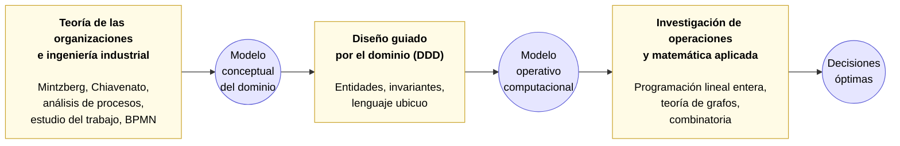

# Capítulo 2. Marco teórico

En la introducción se anticiparon, sin desarrollarlos, tres cuerpos
de ideas sobre los que se apoya todo el trabajo: un marco para
comprender a la organización estudiada, un marco para modelar el
dominio de negocio en software y un marco matemático para plantear
la asignación de aulas como un problema de optimización. Este
capítulo los desarrolla en el orden en que serán utilizados más
adelante. Cada sección introduce definiciones y resultados que se
usarán como piezas listas para ensamblar cuando llegue el momento
de aplicarlos.

Los tres cuerpos son de disciplinas distintas (teoría de la
organización y sus herramientas afines, ingeniería de software y
matemática aplicada), pero se articulan entre sí porque cada uno
resuelve un problema que los otros no atacan directamente y produce
un artefacto que los otros necesitan como insumo. La secuencia se
puede resumir en la siguiente cadena:



Leído de izquierda a derecha: la teoría de las organizaciones y las
herramientas de la ingeniería industrial proveen métodos para
**entender el dominio** y producir un *modelo conceptual* fiel del
sistema, sus componentes y sus procesos. El diseño guiado por el
dominio toma ese modelo conceptual como insumo y le da forma de
*modelo operativo computacional*: estructuras de datos, entidades
del dominio de la solución, invariantes y reglas codificadas. Sobre
ese modelo operativo, finalmente, la investigación de operaciones y
la matemática aplicada instancian técnicas de optimización para
**tomar decisiones óptimas** dentro del sistema. Cada cuerpo aporta
lo que el anterior no puede aportar y depende de lo que el anterior
produce.

La estructura del capítulo sigue exactamente ese orden.

## 2.1 Marco organizacional y de análisis de sistemas

La introducción presentó, casi al pasar, dos autores canónicos de la
teoría de la administración: Henry Mintzberg y Idalberto Chiavenato.
Se los invocó para caracterizar a la FCEIA como una *burocracia
profesional compleja*. Esta sección profundiza esa caracterización,
pero antes conviene ubicarla dentro de un instrumental más amplio:
el que la ingeniería industrial pone a disposición de quien tiene
que entender y modelizar un sistema antes de intervenir sobre él.

### 2.1.1 El instrumental de la ingeniería industrial

La ingeniería industrial se distingue de otras ingenierías por su
objeto de estudio: no un dispositivo físico, sino un **sistema
sociotécnico**: es decir, una combinación de personas, procesos,
recursos e información que persigue un objetivo. Para intervenir
sobre un sistema de este tipo, primero hay que entenderlo. La
disciplina acumuló, a lo largo del siglo XX, un instrumental
específico para hacerlo. Conviene enumerar sus grandes familias, no
por completitud enciclopédica sino porque varias de ellas aparecen
(explícita o implícitamente) en este trabajo:

- **Teoría de las organizaciones**: aporta un vocabulario para
  describir cómo una organización se estructura y cómo se coordina
  su operación. Autores canónicos: Mintzberg (partes y mecanismos de
  coordinación) y Chiavenato (dimensiones de complejidad), a los que
  se dedican las próximas subsecciones.
- **Análisis y modelado de procesos**: técnicas para representar el
  flujo de tareas que compone la operación de un sistema. Diagramas
  de flujo, notación BPMN (*Business Process Model and Notation*),
  cursogramas y diagramas SIPOC (*Supplier - Input - Process -
  Output - Customer*) se emplean para hacer visibles pasos,
  responsables, entradas y salidas de cada actividad. En el
  capítulo 3 se aplican para representar el proceso actual de
  asignación de aulas.
- **Estudio del trabajo y medición**: descomposición de tareas en
  operaciones elementales, medición de tiempos, identificación de
  cuellos de botella. Ofrece la base cuantitativa para caracterizar
  la operatoria en términos de volumen, ritmo y capacidad.
- **Ingeniería de métodos y mejora continua**: enfoques para
  identificar desperdicios, redundancias y oportunidades de
  simplificación (herramientas típicas: análisis de valor, cinco
  porqués, PDCA). En este trabajo motivan el diagnóstico del
  proceso manual actual y la enumeración de los problemas
  operativos.
- **Análisis de sistemas**: enfoque que trata al conjunto como una
  entidad con entradas, salidas, componentes internos e
  interacciones. Es el marco que permite pasar del "conjunto de
  actividades sueltas" a la comprensión del sistema como un todo
  coherente, requisito previo a cualquier modelo formal.

Esta enumeración no es exhaustiva pero sí representa el tipo de
herramientas que la ingeniería industrial ofrece para la etapa de
**entender el dominio**. La sección continúa con las dos que se
usan más intensamente en este informe (Mintzberg y Chiavenato); las
demás se aplican de manera puntual en los capítulos siguientes
(especialmente en el capítulo 3).

### 2.1.2 Chiavenato: tipología por complejidad

Chiavenato (2006) clasifica a las organizaciones a partir de tres
dimensiones concurrentes:

- **Diferenciación horizontal**: cantidad de unidades funcionales
  distintas al mismo nivel jerárquico (departamentos, cátedras,
  áreas administrativas). Cuanto mayor la diferenciación horizontal,
  mayor la especialización interna.
- **Diferenciación vertical**: cantidad de niveles jerárquicos entre
  la cima y el operario. Cuanto mayor la diferenciación vertical, más
  larga la cadena de mando y más lenta la circulación de decisiones.
- **Dispersión espacial**: cantidad de ubicaciones físicas distintas
  donde se ejecuta la operación.

A partir de estas dimensiones, Chiavenato distingue *organizaciones
simples* (baja diferenciación en todas las dimensiones),
*organizaciones complejas* (alta diferenciación horizontal moderada
en vertical, con dispersión espacial acotada) y *organizaciones
altamente complejas* (alta diferenciación en las tres dimensiones,
típicamente corporaciones transnacionales).

La FCEIA presenta diferenciación horizontal alta (decenas de
carreras, cátedras y áreas administrativas), diferenciación vertical
moderada (la jerarquía formal existe, pero la autoridad real está
distribuida entre las cátedras) y dispersión espacial acotada a dos
sedes (Pellegrini y Siberia). Encuadra, por lo tanto, en la categoría
de **organización compleja**.

La consecuencia práctica de esta clasificación es concreta: en una
organización compleja, la fuente principal de dificultad operativa no
es la longitud de la cadena de mando sino la **multiplicidad de
actores, actividades y recursos que deben articularse en tiempo y
espacio**. Es exactamente el tipo de dificultad que la coordinadora
estudiantil enfrenta cada cuatrimestre.

### 2.1.3 Mintzberg: partes y mecanismos de coordinación

Donde Chiavenato mira dimensiones, Mintzberg (1979) mira **partes** y
**mecanismos**. Toda organización, sostiene el autor, se descompone
en cinco partes fundamentales:

1. La **cumbre estratégica**: dirección superior de la organización.
2. La **línea media**: mandos intermedios que enlazan la cumbre con
   la operación.
3. El **núcleo operativo**: quienes ejecutan el trabajo primario que
   justifica la existencia de la organización.
4. La **tecnoestructura**: analistas y planificadores que
   estandarizan el trabajo pero no lo ejecutan.
5. El **staff de apoyo**: unidades que sostienen indirectamente al
   núcleo operativo (recursos humanos, servicios generales, etc.).

Sobre estas partes actúan cinco mecanismos básicos de coordinación:

- **Ajuste mutuo**: los operarios se coordinan hablando entre sí.
- **Supervisión directa**: un jefe indica a los subordinados qué hacer.
- **Normalización de procesos**: se predefine cómo se hace el trabajo.
- **Normalización de resultados**: se predefine qué debe salir del
  trabajo, sin especificar cómo.
- **Normalización de habilidades**: se predefine qué formación deben
  tener quienes hacen el trabajo, confiando en que esa formación
  garantice la coordinación.

Combinando parte dominante y mecanismo dominante, Mintzberg obtiene
cinco configuraciones estructurales típicas: estructura simple,
burocracia mecánica, burocracia profesional, forma divisional y
adhocracia. En la **burocracia profesional**, la parte clave es el
núcleo operativo y el mecanismo de coordinación principal es la
normalización de habilidades. "La burocracia profesional cuenta para
su coordinación con la normalización de las destrezas y con el
parámetro de diseño correspondiente, la preparación y el
adoctrinamiento" (Mintzberg, 1979).

Una universidad encuadra sin ambigüedad en esa configuración. Los
docentes constituyen el núcleo operativo; la coordinación de su
trabajo se apoya principalmente en la formación disciplinar previa de
cada uno (un profesor de Análisis Matemático sabe cómo enseñar
Análisis Matemático porque tiene formación como matemático, no porque
un manual le indique paso a paso qué hacer); y por eso mismo, los
docentes gozan de un grado de autonomía marcadamente superior al de
un operario industrial típico.

### 2.1.4 Implicancias para el diseño de una solución

Combinar los diagnósticos de Chiavenato y Mintzberg da un cuadro
operativo con tres implicancias directas para lo que sigue en el
informe:

1. **Las decisiones operativas están distribuidas.** Cada cátedra
   define sus horarios, sus comisiones, sus criterios de dictado. No
   existe una autoridad central que uniforme esas decisiones. Por lo
   tanto, cualquier sistema de asistencia a la coordinación debe
   *acomodar heterogeneidad*, no imponer uniformidad.
2. **Los requerimientos son cambiantes.** Como el núcleo operativo
   opera con autonomía, cambios en cátedras, comisiones o modalidades
   pueden aparecer en cualquier momento del cuatrimestre. El sistema
   debe permitir **re-optimización dinámica**, no solamente una
   planificación estática inicial.
3. **La coordinación por normalización de habilidades no basta para
   la asignación de recursos físicos.** La formación de un docente
   asegura que sepa dictar su materia, pero no coordina por sí sola
   qué aula ocupa. Ese tipo de coordinación exige un mecanismo
   adicional: información compartida, reglas explícitas y un proceso
   de decisión. Es exactamente el hueco que este proyecto viene a
   llenar.

El producto de esta primera sección es entonces un **modelo
conceptual** del dominio: sabemos qué tipo de organización es la
FCEIA, cómo se coordina su núcleo operativo, qué actores intervienen
y cuáles son las implicancias de su estructura para el problema que
queremos resolver. Pero ese modelo, en el estado en que quedó, es
todavía descriptivo: vive en prosa, tablas y diagramas. Para que un
sistema de software pueda operar sobre él hay que darle una forma
más rígida, con reglas explícitas y entidades claramente definidas.
Ese es el trabajo del cuerpo siguiente.

## 2.2 Marco metodológico: diseño guiado por el dominio

La sección anterior estableció qué es la organización y qué
particularidades tiene su operación. El paso siguiente es preguntar
**cómo se traduce esa comprensión a un sistema de software fiel al
dominio real**. Para eso tomamos como marco al *diseño guiado por el
dominio* (en inglés, *Domain-Driven Design* o DDD), formulado por
Eric Evans (2003).

### 2.2.1 La premisa fundamental

Evans sostiene que la principal fuente de fracaso en proyectos de
software complejos no es la carencia de herramientas técnicas sino la
**distancia entre el modelo mental del experto del dominio y el
modelo implementado en el código**. Un sistema puede ser
técnicamente correcto (compilar, pasar tests, escalar) y sin embargo
ser operativamente inservible porque su vocabulario, sus categorías
y sus reglas no coinciden con las de la organización a la que sirve.

La respuesta que propone es doble. Por un lado, el desarrollo de
software debe estar guiado por una comprensión profunda del dominio
de negocio. Por otro, esa comprensión debe **encarnarse en el código
mismo**: nombres de clases, atributos, métodos y módulos deben
reflejar entidades y operaciones del dominio, no artefactos técnicos.

### 2.2.2 Conceptos operativos

De la propuesta de Evans se toman, para este informe, cuatro
conceptos operativos que se aplicarán explícitamente en los capítulos
5 y 6:

- **Dominio**: el sector de la realidad que el software modela. En
  nuestro caso, la operatoria académica de FCEIA en lo referente al
  dictado de clases y la ocupación de aulas.
- **Lenguaje ubicuo** (del inglés *ubiquitous language*): un
  vocabulario compartido entre experto del dominio y diseñador del
  sistema, que aparece consistentemente en las conversaciones, la
  documentación y el código. Cuando la coordinadora dice "materia" y
  el sistema tiene una tabla `MateriaDB`, y ambos significan lo mismo
  y con los mismos atributos, hay lenguaje ubicuo.
- **Entidad**: objeto del dominio con identidad propia que persiste
  a lo largo del tiempo aunque sus atributos cambien. Una comisión
  específica sigue siendo la misma aunque le cambien el aula o el
  cupo.
- **Invariante**: propiedad que debe cumplirse *en todo momento* por
  toda instancia de una entidad. Por ejemplo, "una comisión pertenece
  siempre a exactamente una materia" es una invariante del dominio
  académico. Toda invariante que no se garantice explícitamente en
  el sistema tarde o temprano será violada y podra dar lugar a estados
  inconsistentes del sistema y la base de datos.

Estos cuatro conceptos alcanzan para el trabajo que sigue. El
desarrollo completo del método (con sus agregados, repositorios,
servicios de dominio y contextos delimitados) excede el alcance
del informe; sólo se lo señala cuando alguna decisión de diseño se
apoya explícitamente en él.

### 2.2.3 De modelo conceptual a modelo operativo computacional

DDD no es solamente una teoría del modelado: es sobre todo un método
para **congelar** el modelo del dominio en artefactos ejecutables. El
modelo conceptual que produjo la ingeniería industrial (organización,
procesos, actores, reglas de negocio) es todavía discursivo. Aun
cuando esté acompañado por diagramas, sigue viviendo en el terreno
de las descripciones. DDD lo pasa a un plano donde el modelo es al
mismo tiempo documentación y motor de la solución.

Concretamente, el paso produce:

- **Entidades del dominio de la solución**: cada concepto identificado
  en el modelo conceptual (materia, comisión, horario, aula, sede) se
  materializa en una estructura de datos con nombre propio, atributos
  tipados y relaciones explícitas con otras entidades.
- **Invariantes codificadas**: las reglas de negocio identificadas en
  la etapa anterior dejan de ser recordatorios en un documento y se
  convierten en validaciones y restricciones que el sistema impone en
  cada operación.
- **Un vocabulario ejecutable**: los nombres de tablas, clases y
  funciones repiten los términos del lenguaje ubicuo. Cuando la
  coordinadora dice "plan de cursada" y el código tiene un
  `PlanificacionCursadaDB` con las mismas propiedades que ella espera,
  la comunicación entre el experto del dominio y el sistema deja de
  ser una traducción y pasa a ser una referencia directa.

A este resultado combinado (entidades, invariantes y vocabulario que
viven en el software) lo llamaremos en lo que sigue el **modelo
operativo computacional**. La expresión no es de Evans; es una
nomenclatura interna del informe para nombrar el artefacto que
produce DDD como insumo para la etapa siguiente. Su rol es doble:

1. Ser una traducción fiel del modelo conceptual, de modo que
   cualquier decisión que se tome sobre el sistema sea al mismo
   tiempo una decisión sobre el dominio real.
2. Ser una estructura formal y explorable, de modo que técnicas de
   optimización puedan actuar sobre él sin necesidad de reinterpretar
   el dominio en cada ejecución.

Sin este paso intermedio, la investigación de operaciones no tendría
sobre qué operar más que sobre datos crudos: tablas de horarios,
listas de aulas, planillas de inscripciones. Con este paso, en
cambio, opera sobre un modelo de dominio ya integrado, consistente y
con sus reglas de negocio garantizadas.

### 2.2.4 Por qué combinar Mintzberg-Chiavenato con Evans

Vale la pena hacer explícito por qué se combinan marcos tan distintos.
Mintzberg y Chiavenato ofrecen un vocabulario para describir la
organización *como es*; Evans ofrece un vocabulario para diseñar un
sistema *que sea fiel a esa descripción*. Sin el primero, el modelo
de software puede ser técnicamente elegante pero desconectado del
funcionamiento real de la facultad. Sin el segundo, la comprensión
organizacional se agota en un diagnóstico descriptivo que no produce
una herramienta concreta. La articulación de ambos es, en cierto
modo, la traducción metodológica de la tesis controladora enunciada
en la introducción.

Con el modelo conceptual del dominio ya construido y el modelo
operativo computacional codificado sobre él, aparece una nueva
pregunta que ninguno de los dos marcos anteriores contesta: **qué
hacer con ese modelo**. Elegir horarios y aulas es una decisión que
admite múltiples respuestas factibles y una noción explícita de
"mejor entre las factibles". Para tratar esa noción con rigor, hace
falta el instrumental del tercer cuerpo.

## 2.3 Marco técnico: investigación de operaciones

Los dos marcos anteriores dicen *qué* modelar y *cómo* modelarlo. El
siguiente paso, una vez modelado el dominio y codificado el modelo
operativo computacional, es **tomar decisiones óptimas dentro de
él**. En el caso de la asignación de aulas, la decisión es qué aula
asignar a cada clase, sujeta a un conjunto de restricciones. Para
eso, se recurre a la investigación de operaciones, la rama de la
matemática aplicada que estudia el uso de modelos matemáticos para
la toma de decisiones en sistemas complejos.

### 2.3.1 Programación lineal

Un **problema de programación lineal** consiste en optimizar
(maximizar o minimizar) una función lineal de un conjunto de
variables, sujetas a un conjunto de igualdades y desigualdades
lineales. Formalmente, la formulación estándar es:

```text
minimizar    c₁·x₁ + c₂·x₂ + ... + cₙ·xₙ
sujeta a     aᵢ₁·x₁ + aᵢ₂·x₂ + ... + aᵢₙ·xₙ ≤ bᵢ   para i = 1, ..., m
             x₁, x₂, ..., xₙ ≥ 0
```

Donde `x₁, ..., xₙ` son las **variables de decisión** (las incógnitas
del modelo, cuyos valores se busca determinar) y `cⱼ`, `aᵢⱼ` y `bᵢ`
son constantes conocidas que caracterizan al problema. La expresión
que se optimiza se llama **función objetivo**; las inecuaciones y
ecuaciones lineales que las variables deben satisfacer se llaman
**restricciones**. Una asignación de valores a las variables que
cumple todas las restricciones se llama **solución factible**; entre
todas las soluciones factibles, la que mejor valor da a la función
objetivo se llama **solución óptima**.

La programación lineal admite algoritmos de resolución muy eficientes
(típicamente el método *simplex* o los métodos de punto interior)
que en la práctica resuelven problemas con miles de variables y
restricciones en tiempos razonables.

### 2.3.2 Programación lineal entera

Muchos problemas prácticos exigen que algunas o todas las variables
sólo tomen valores enteros. El caso más frecuente es el de las
variables **binarias** (restringidas a `{0, 1}`), que representan
decisiones dicotómicas: encender o apagar, asignar o no asignar, usar
o no usar. Cuando el problema conserva la estructura lineal (objetivo
lineal y restricciones lineales) pero se agregan restricciones de
integralidad sobre las variables, se lo llama **problema de
programación lineal entera** (PLE, en inglés *Integer Linear
Programming* o ILP). Cuando parte de las variables son enteras y
parte continuas, se habla de **programación lineal entera mixta**.

Agregar la restricción de integralidad cambia radicalmente la
naturaleza computacional del problema. Mientras que la programación
lineal continua se resuelve en tiempo polinomial, la programación
lineal entera pertenece a la clase de problemas **NP-duros**: en el
peor caso, el tiempo de resolución crece exponencialmente con la
cantidad de variables. Sin embargo, en la práctica, con formulaciones
cuidadas y resolutores modernos, problemas de tamaño mediano
(cientos a miles de variables binarias) se resuelven en segundos o
minutos.

### 2.3.3 Ramificación y acotación

El algoritmo estándar para resolver problemas de programación lineal
entera es la **ramificación y acotación** (en inglés,
*branch-and-bound*). La idea intuitiva es la siguiente:

1. Se resuelve primero la **relajación lineal** del problema, es
   decir, la versión sin restricciones de integralidad, donde las
   binarias pueden tomar cualquier valor real en `[0, 1]`. Su solución óptima
   da una **cota** al óptimo del problema entero: como la relajación
   admite más soluciones, su óptimo no puede ser peor que el óptimo
   del problema entero.
2. Si la solución de la relajación es casualmente entera, se terminó.
   Si no, se elige una variable con valor fraccionario y se **parte**
   el problema en dos subproblemas: uno donde esa variable se fuerza
   a `0` y otro donde se fuerza a `1`. Cada subproblema se resuelve
   recursivamente.
3. En cada nodo del árbol de búsqueda se **poda**: si la cota de un
   subproblema es peor que la mejor solución entera encontrada hasta
   el momento, todo ese subárbol se descarta sin explorarlo.

La eficiencia práctica del método depende crucialmente de la calidad
de las cotas y del orden en que se recorre el árbol. En una
formulación bien planteada, la mayoría del árbol se poda temprano y
se llega al óptimo en tiempos razonables.

### 2.3.4 Resolutores

Un **resolutor** (en inglés, *solver*) es un programa que recibe la
descripción de un problema de programación lineal entera (variables,
función objetivo, restricciones) y devuelve una solución óptima o un
certificado de infactibilidad cuando ninguna asignación satisface
todas las restricciones simultáneamente. Los resolutores comerciales
más difundidos son Gurobi y CPLEX. En el mundo del software libre, el
resolutor más utilizado es **CBC** (*COIN-OR Branch and Cut*), que
implementa ramificación y acotación con planos de corte.

Para acceder a un resolutor desde código Python se utilizan
bibliotecas de modelado: **PuLP** es una de ellas, que permite
escribir la formulación en un lenguaje declarativo y traducirla
automáticamente al formato que el resolutor espera. Esta combinación
(PuLP como capa de modelado, CBC como resolutor) es la que emplea el
sistema desarrollado en este proyecto.

### 2.3.5 Restricciones duras y blandas

Una distinción práctica que aparece con frecuencia en la modelización
de problemas reales es la de **restricciones duras** y **restricciones
blandas**. Una restricción es **dura** cuando su incumplimiento hace
que la solución no sea aceptable: o se cumple o el modelo es
infactible. Una restricción es **blanda** cuando su incumplimiento es
tolerable pero indeseable: no se descarta la solución que la viola,
pero se la **penaliza** con un término en la función objetivo. El
resolutor entonces la respeta cuando puede y la cede cuando no queda
alternativa. Esta técnica, codificar preferencias como términos
penalizados del objetivo, es central en el modelo de asignación de
aulas.

### 2.3.6 Bibliografía

Los textos canónicos para investigación de operaciones son Winston
(*Operations Research: Applications and Algorithms*) e Hillier &
Lieberman (*Introduction to Operations Research*). La bibliografía
concreta de esta sección queda pendiente de confirmación y se
completa en la próxima iteración del informe.

## 2.4 Herramientas combinatorias y de teoría de grafos

Las herramientas de la sección anterior alcanzan para **plantear y
resolver** el problema de asignación. Pero antes de invocar al
resolutor conviene tener un mecanismo más liviano para **detectar de
antemano casos que no tienen solución posible**: si por razones
puramente estructurales no puede existir una asignación válida, hay
que decirlo antes de gastar tiempo en el resolutor y, sobre todo, hay
que indicarle al usuario **por qué**. Para esto se recurre a dos
resultados clásicos de la combinatoria y la teoría de grafos, el
principio del palomar y el teorema de Hall, apoyados sobre un
vocabulario mínimo de grafos que conviene fijar de antemano.

### 2.4.1 Grafos, grafos bipartitos y apareamientos

#### Para qué usamos grafos

Antes de dar la definición formal conviene explicar por qué los
grafos aparecen en este informe. La **teoría de grafos** es un marco
matemático y analítico usado para modelizar, estudiar y resolver
problemas que involucran **relaciones discretas entre objetos**. Es
uno más entre los formalismos que un ingeniero tiene a disposición
para representar y estudiar sistemas: hojas de cálculo para
relaciones tabulares, ecuaciones diferenciales para relaciones
funcionales continuas, cadenas de Markov para procesos estocásticos,
diagramas de flujo para relaciones de secuencia y control. Cada
formalismo captura bien cierto tipo de estructura y calla sobre el
resto. El de grafos captura una estructura muy específica: **quién
está conectado con quién**, sin importar el tamaño, la forma o los
atributos internos de los objetos conectados. Cada vez que un
problema puede formularse como "tengo un conjunto de entidades y
algunos pares están vinculados de cierta manera", un grafo es un
buen candidato para modelizarlo.

Que las relaciones sean **discretas** es central: los grafos no
representan intensidades continuas ni gradientes, sino conexiones
que están o no están. Dos ciudades están unidas por una ruta o no
lo están; una persona es compatible con un puesto o no; un aula
puede recibir una clase o no. La discretización, lejos de ser una
limitación, es lo que habilita el uso de resultados y algoritmos
combinatorios sobre la estructura.

Los grafos se usan en toda la ingeniería y las ciencias aplicadas
justamente porque muchos problemas encajan en ese molde: redes de
transporte y logística (nodos = ciudades, aristas = rutas), redes
eléctricas y de comunicaciones (nodos = dispositivos, aristas =
enlaces), planificación de proyectos (nodos = tareas, aristas =
precedencias entre tareas), asignación de personal a puestos (nodos
= personas y puestos, aristas = compatibilidades), diseño de layout
de fábrica (nodos = estaciones de trabajo, aristas = flujo de
material), incluso análisis de organizaciones (nodos = personas,
aristas = relaciones de comunicación o autoridad). En cada caso el
grafo aísla lo que importa (la estructura de las conexiones) y
descarta lo que no (los atributos internos de los objetos que se
conectan).

La razón por la que este formalismo es tan útil es doble. Por un
lado, hace **visible** una estructura que en una descripción prosa o
tabular quedaría oculta: mirar un grafo permite detectar caminos,
ciclos, agrupamientos, aislamientos. Por otro, sobre esa estructura
la matemática discreta acumuló resultados y algoritmos poderosos
(teorema de Hall, algoritmos de flujo, coloreo, apareamientos, rutas
mínimas) que se pueden aplicar directamente sin volver a
descomponer el problema en primitivas.

Hay un último aspecto que conviene explicitar y que es propio de
este marco matemático en particular: los grafos son al mismo tiempo
un objeto **conceptual** y un objeto **computacional**. Cuando un
ingeniero industrial modeliza un problema como un grafo obtiene una
representación abstracta útil para el análisis; cuando un ingeniero
en software lo implementa, ese mismo grafo se materializa
directamente en una **estructura de datos** (típicamente una lista
de adyacencia o una matriz de adyacencia) sobre la cual corren
algoritmos concretos. Este doble carácter, marco matemático y
estructura de datos a la vez, es lo que hace que los resultados
teóricos de la teoría de grafos sean inmediatamente aprovechables en
el software del proyecto: no hay una brecha entre el objeto que
razonamos y el objeto sobre el que iteramos. Otras piezas de este
informe comparten esta virtud (las entidades del dominio de la
solución, por ejemplo) y por eso vale la pena señalarla.

En este informe recurrimos a grafos por esa razón: el problema de
decidir qué clase se dicta en qué aula, en cada instante, es
naturalmente un problema de compatibilidades entre dos poblaciones
de entidades (clases y aulas). Modelizar esa compatibilidad como un
grafo nos habilita a usar los resultados y algoritmos existentes en
lugar de reinventarlos.

#### Definiciones

Un **grafo** es un par `G = (V, E)` donde `V` es un conjunto de
elementos llamados **vértices** (o *nodos*) y `E` es un conjunto de
pares no ordenados de vértices, llamados **aristas**. La
interpretación estándar es "un vértice representa una entidad, una
arista representa una relación entre dos entidades". Un grafo se
representa gráficamente dibujando los vértices como puntos y las
aristas como líneas que los conectan.

Cuando el problema que se modeliza tiene la forma "hay dos
poblaciones distintas de entidades, y las relaciones sólo se dan
entre elementos de una y otra población" (por ejemplo, personas y
puestos, alumnos y proyectos, o, para nuestro caso, clases y aulas),
la estructura del grafo se especializa. Un **grafo bipartito** es un
grafo cuyos vértices se pueden particionar en dos conjuntos
disjuntos `X` e `Y` de modo que toda arista conecta un vértice de
`X` con uno de `Y` (nunca dos vértices del mismo conjunto). Los
grafos bipartitos son el modelo natural para **problemas de
asignación**: si `X` representa un conjunto de tareas y `Y` un
conjunto de recursos, una arista entre `x ∈ X` e `y ∈ Y` significa
que la tarea `x` es compatible con el recurso `y`.

Sobre un grafo bipartito, la pregunta "¿puedo asignar cada tarea a
un recurso distinto respetando las compatibilidades?" se formaliza a
través del concepto de apareamiento. Un **apareamiento** (en inglés,
*matching*) en un grafo bipartito `G` es un subconjunto de aristas
tal que ningún vértice aparece en más de una arista del subconjunto.
Un apareamiento **satura** al conjunto `X` si todo vértice de `X`
está cubierto por alguna arista del apareamiento; a un apareamiento
que satura a todo `X` con `X` del mismo tamaño que `Y` se lo llama
**apareamiento perfecto**.

Para razonar sobre bloqueos (por qué a veces no hay apareamiento que
sature a `X`) se necesita una última definición. Para cada
subconjunto `S ⊆ X`, se denota `N(S)` a la **vecindad** de `S`: el
conjunto de vértices de `Y` conectados por al menos una arista con
algún vértice de `S`.

#### Encaje con el problema de asignación de aulas

Este vocabulario es toda la maquinaria de teoría de grafos que se
necesita en el informe. La aplicación al problema de asignación de
aulas es directa: `X` es un conjunto de clases que se dictan en un
mismo instante, `Y` es el conjunto de aulas disponibles en ese
instante, y una arista `(clase, aula)` existe cuando el aula es
compatible con la clase (tipo correcto, sede admisible, capacidad
razonable). Preguntar si existe una asignación válida es preguntar
si existe un apareamiento que sature a `X`.

Para cerrar el vocabulario cabe mencionar dos resultados que se
usarán implícitamente al construir el chequeo estructural del
capítulo 8. Primero, decidir si existe un apareamiento perfecto en
un grafo bipartito y encontrarlo es un problema resoluble en tiempo
polinomial (típicamente vía el algoritmo de Hopcroft-Karp). Segundo,
existen algoritmos eficientes para hallar **testigos de
infactibilidad**: cuando no hay apareamiento perfecto, se puede
identificar un subconjunto pequeño de `X` que evidencie el bloqueo.
Ambos resultados se emplean sin desarrollarlos en detalle; alcanzan
como caja de herramientas.

### 2.4.2 Principio del palomar

El **principio del palomar** (en inglés, *pigeonhole principle*) es
uno de los resultados más elementales de la matemática discreta. En
su forma más simple:

> *Si se distribuyen `n` objetos en `k` casilleros y `n > k`,
> entonces al menos un casillero contiene más de un objeto.*

La aplicación al problema de asignación de aulas es directa. Si en
una franja horaria hay `n` clases que deben dictarse simultáneamente
y sólo hay `k` aulas compatibles disponibles con `k < n`, entonces al
menos dos de esas clases deberían compartir aula, lo cual está
prohibido por la restricción de no doble asignación. El principio del
palomar es entonces una **condición necesaria** de factibilidad: si
falla, el problema es infactible; si se cumple, no hay garantía todavía
de que exista una solución.

### 2.4.3 Teorema de Hall

Cuando el principio del palomar se satisface pero uno sigue con la
sospecha de que la asignación puede ser inviable, se necesita un
criterio más fino. Ese criterio lo proporciona el **teorema de Hall**
(1935), un resultado central de la teoría de grafos que caracteriza
exactamente cuándo existe un apareamiento que sature al conjunto de
tareas en un grafo bipartito.

Con el vocabulario ya fijado en § 2.4.1, el teorema enuncia:

> **Teorema de Hall.** *En un grafo bipartito con particiones `X` e
> `Y`, existe un apareamiento que satura a `X` si y sólo si para todo
> subconjunto `S ⊆ X` se cumple `|N(S)| ≥ |S|`.*

La condición `|N(S)| ≥ |S|` se conoce como **condición de Hall**. En
palabras: para todo grupo de elementos de `X`, la cantidad total de
elementos de `Y` disponibles para ese grupo tiene que ser al menos
tan grande como el grupo mismo. Si esto falla para algún subconjunto
`S`, no hay manera de aparearlos a todos con destinos distintos: `S`
se llama entonces un **conjunto violador de Hall**. El propio
subconjunto violador es, además, un testigo interpretable del
bloqueo: se puede reportar al usuario como "este grupo específico de
clases no tiene aulas suficientes entre las que son compatibles con
todas ellas".

### 2.4.4 Ejemplo comparativo palomar vs Hall

Es instructivo ver un caso donde el principio del palomar no alcanza
y sí lo hace la condición de Hall. Supongamos tres clases `h₁, h₂,
h₃` que deben dictarse a la misma hora en un mismo día, y tres aulas
disponibles `a, b, c`, con las siguientes compatibilidades:

| clase | aulas compatibles |
| --- | --- |
| `h₁` | `{a}` |
| `h₂` | `{a}` |
| `h₃` | `{a, b, c}` |

Contando por palomar: hay 3 clases y 3 aulas, el conteo global cierra.
Sin embargo, si miramos el subconjunto `S = {h₁, h₂}`, su vecindad
es `N(S) = {a}`, de tamaño `1 < 2 = |S|`. La condición de Hall falla
para `S`, y en efecto no hay apareamiento posible: `h₁` y `h₂`
compiten por el único aula que ambas admiten. La factibilidad
estructural se cae aunque el conteo total sea correcto.

Este ejemplo muestra por qué las dos herramientas son complementarias:
el principio del palomar detecta casos triviales de infactibilidad
mirando totales; la condición de Hall detecta casos más sutiles
mirando subconjuntos.

### 2.4.5 Aplicación en el sistema

Ambos criterios se emplean en el sistema como parte del **chequeo
estructural pre-solve**, un semáforo que se corre antes de invocar al
resolutor y que reporta al usuario, en lenguaje operativo, la causa
concreta por la cual una asignación no puede existir, cuando ese es
el caso. Bajo el capot, el chequeo construye para cada franja
horaria un grafo bipartito de compatibilidad clase-aula y aplica
sobre él los dos tests: primero el conteo global (palomar) como
filtro rápido, y luego, si el conteo cierra, la búsqueda de un
apareamiento perfecto y, en caso de fallar, la identificación de un
conjunto violador de Hall como testigo del bloqueo. El desarrollo
detallado del chequeo, con su cómputo efectivo por franja horaria y
por tipo de aula, se retoma en el capítulo 8. Aquí basta con haber
dejado disponibles las definiciones y su relación mutua.

Los resultados clásicos sobre grafos bipartitos, apareamientos y
teorema de Hall se toman de la bibliografía estándar de teoría de
grafos; la referencia concreta queda pendiente de confirmación (ver
§ 2.3.6).

## 2.5 Recapitulación y sinergias

Este capítulo dejó fijadas las herramientas conceptuales que se
usarán durante el resto del informe:

- Del instrumental de la ingeniería industrial (análisis de sistemas,
  modelado de procesos, teoría de las organizaciones, ingeniería de
  métodos) tomamos las técnicas para desglosar y comprender el
  dominio. En particular, de Mintzberg y Chiavenato tomamos la
  caracterización de la FCEIA como *burocracia profesional compleja*
  y las tres implicancias operativas que se derivan de ella:
  decisiones distribuidas, requerimientos cambiantes y necesidad de
  un mecanismo de coordinación adicional al de la normalización de
  habilidades. Producto: **modelo conceptual del dominio**.
- De Evans tomamos la idea de que el software debe estar guiado por
  el dominio, y los cuatro conceptos operativos (dominio, lenguaje
  ubicuo, entidad, invariante) que aplicaremos en la modelización.
  Producto: **modelo operativo computacional**, esto es, la
  traducción del modelo conceptual a estructuras de datos, entidades
  del dominio de la solución e invariantes codificadas sobre las que
  puede operar el sistema.
- De la investigación de operaciones tomamos el vocabulario de la
  programación lineal entera, la mecánica del algoritmo de
  ramificación y acotación y la distinción entre restricciones duras
  y blandas. Producto: la capacidad de plantear la decisión de
  asignación como un problema de optimización explícito.
- De la teoría de grafos y la combinatoria tomamos el vocabulario de
  grafos bipartitos y apareamientos, el principio del palomar y el
  teorema de Hall como herramientas de diagnóstico estructural de
  factibilidad. Producto: los mecanismos de chequeo pre-solve que
  reportan al usuario, en lenguaje interpretable, la causa concreta
  de una eventual infactibilidad.

### 2.5.1 Cómo sinergizan las piezas

Los tres cuerpos de disciplinas se usan como una cadena, alineados
con los tres eslabones que fijamos en la introducción del capítulo
(modelo conceptual del dominio, modelo operativo computacional,
decisiones óptimas) donde cada eslabón habilita al siguiente:

1. Sin **modelo conceptual del dominio** no hay lenguaje ubicuo. Sin
   lenguaje ubicuo, cualquier estructura de datos que armemos será
   una interpretación arbitraria y las reglas de negocio quedarán
   dispersas o mal formuladas. La ingeniería industrial y la teoría
   de las organizaciones aportan las herramientas para producir ese
   primer eslabón.
2. Sin **modelo operativo computacional** no hay superficie sobre la
   cual actuar. Las reglas del dominio pueden estar claras en un
   documento y bien discutidas con los expertos, pero mientras no se
   materialicen en el software como entidades tipadas, invariantes y
   validaciones ejecutables, el sistema no puede razonar por sí
   mismo sobre ellas: cada operación tendría que consultar el
   documento, reinterpretarlo y decidir a mano si respeta o no las
   reglas. El diseño guiado por el dominio aporta las prácticas para
   producir este segundo eslabón como una traducción fiel del
   primero.
3. Sin la **matemática aplicada** no hay manera de decidir de forma
   fundada sobre el modelo operativo. La matemática aplicada
   (principalmente investigación de operaciones y teoría de grafos,
   en el alcance de este trabajo) aporta dos cosas complementarias a
   este último eslabón:
   - **Un lenguaje formal para describir relaciones entre entidades
     y sus restricciones.** El grafo bipartito de compatibilidad
     entre clases y aulas o la formulación algebraica de las horas
     de teoría y laboratorio son ejemplos de esta capa: dan una
     representación matemática precisa de reglas que en el modelo
     conceptual estaban expresadas en prosa, y por eso mismo
     permiten razonar automáticamente sobre ellas (incluso antes de
     buscar una solución) para diagnosticar factibilidad y explicar
     bloqueos en términos del dominio.
   - **Técnicas de optimización para elegir entre alternativas
     válidas.** Muchas asignaciones respetan las reglas; algunas son
     mejores que otras. La matemática aplicada ofrece los criterios
     y los métodos (programación lineal entera, restricciones duras
     y blandas, ramificación y acotación) para establecer **qué es
     una buena solución**, comparar candidatas entre sí y
     seleccionar la mejor de acuerdo con los criterios explicitados
     por el negocio.
   Con este tercer eslabón el sistema deja de ser un simple registro
   informatizado del dominio y pasa a ser una herramienta capaz de
   proponer soluciones y de reportarlas (incluidas sus
   infactibilidades) en términos que el usuario reconoce.

Además, las herramientas se realimentan hacia atrás: cuando el
diagnóstico matemático detecta un bloqueo, la información se
presenta en términos del vocabulario ubicuo definido por el modelo
del dominio, y la corrección típicamente pasa por ajustar el proceso
de negocio subyacente (mover un horario, sumar una comisión,
habilitar un aula), es decir, por volver al primer eslabón de la
cadena. La bidireccionalidad de esta relación no es un adorno: es lo
que hace que el sistema resulte una herramienta de mejora
organizacional y no un mero motor de optimización desconectado.

### 2.5.2 Dónde se usa cada pieza más adelante

Ninguna de estas piezas se usa aisladamente. En el capítulo 3 se
aplica el instrumental de análisis de procesos para modelizar la
operatoria actual de la coordinadora. En el capítulo 4 se combina el
diagnóstico organizacional con el vocabulario de programación lineal
para dar la definición formal del problema. En los capítulos 5 y 6
se aplica el marco de Evans para construir el modelo del dominio y
traducirlo al modelo de datos que constituye el modelo operativo
computacional. En el capítulo 8 se instancia el problema en un
programa lineal entero concreto, se lo resuelve con ramificación y
acotación vía CBC, y se aplican palomar y Hall al diagnóstico
estructural sobre el grafo bipartito de compatibilidad. Cada una de
esas aplicaciones tiene su propia sección posterior; a partir de
ahora, el marco teórico no vuelve a discutirse: se lo usa.
