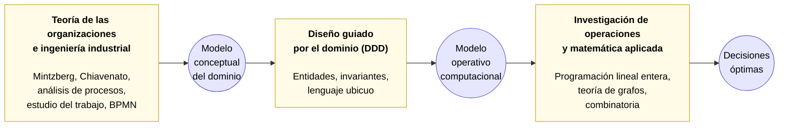
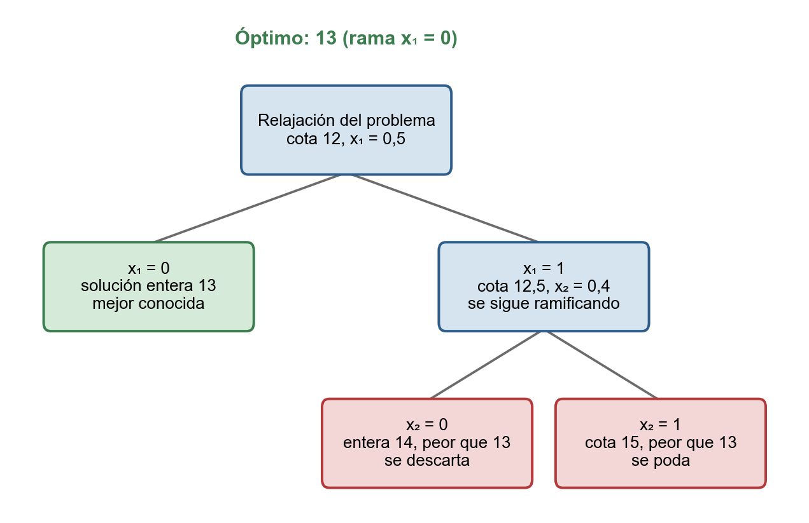
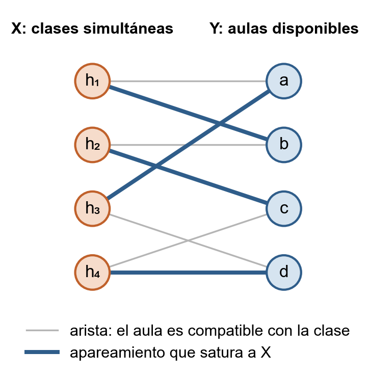
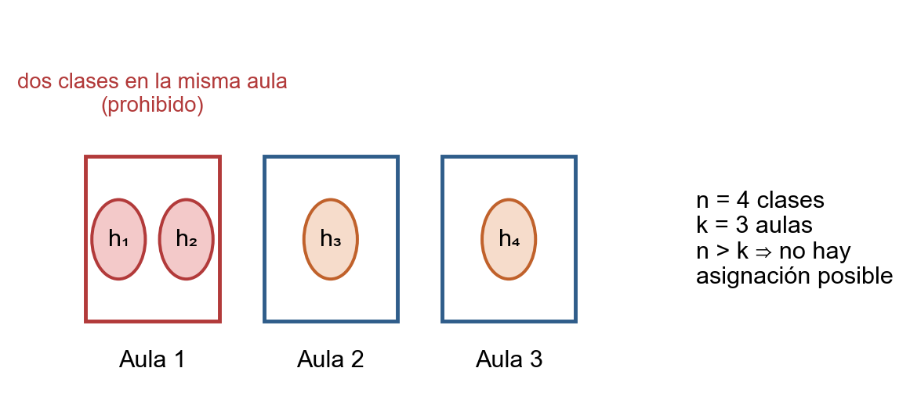

## 3.2 Marco teórico

En la introducción se anticiparon tres cuerpos de ideas sobre los que
se apoya todo el trabajo: un marco para comprender a la organización
estudiada, un marco para modelar el dominio en software y un marco
matemático para plantear la asignación de aulas como un problema de
optimización. Esta sección los desarrolla en el orden en que se usan
más adelante, de modo que cada definición quede disponible cuando
llegue el momento de aplicarla.

Los tres cuerpos provienen de disciplinas distintas (teoría de la
organización, ingeniería de software y matemática aplicada), pero se
articulan porque cada uno produce el insumo que necesita el siguiente,
como muestra la Figura @fig:cadena.

<!-- figura: Cadena de disciplinas que articula el proyecto {#fig:cadena} -->

```mermaid
flowchart LR
    C1["<b>Teoría de las organizaciones<br/>e ingeniería industrial</b><br/><br/>Mintzberg, Chiavenato,<br/>análisis de procesos,<br/>estudio del trabajo, BPMN"]
    C2["<b>Diseño guiado<br/>por el dominio (DDD)</b><br/><br/>Entidades, invariantes,<br/>lenguaje ubicuo"]
    C3["<b>Investigación de operaciones<br/>y matemática aplicada</b><br/><br/>Programación lineal entera,<br/>teoría de grafos,<br/>combinatoria"]

    P1(("Modelo<br/>conceptual<br/>del dominio"))
    P2(("Modelo<br/>operativo<br/>computacional"))
    P3(("Decisiones<br/>óptimas"))

    C1 --> P1 --> C2 --> P2 --> C3 --> P3

    classDef body fill:#fffbe6,stroke:#c9a227,color:#000
    classDef prod fill:#e6e6ff,stroke:#5b5bd6,color:#000
    class C1,C2,C3 body
    class P1,P2,P3 prod
```

Leída de izquierda a derecha, la cadena dice lo siguiente: la teoría
de las organizaciones y las herramientas de la ingeniería industrial
permiten **entender el dominio** y producir un *modelo conceptual*
fiel de la organización, sus actores y sus procesos. El diseño guiado
por el dominio toma ese modelo y le da forma de *modelo operativo
computacional*: entidades, reglas e invariantes que viven en el
software. Sobre ese modelo, finalmente, la investigación de
operaciones y la matemática aplicada permiten **tomar decisiones
óptimas**. La sección sigue ese mismo orden.

### 3.2.1 Marco organizacional y de análisis de sistemas

#### 3.2.1.1 El instrumental de la ingeniería industrial

La ingeniería industrial se distingue de otras ingenierías por su
objeto de estudio: no un dispositivo físico, sino un *sistema
sociotécnico*, es decir, una combinación de personas, procesos,
recursos e información que persigue un objetivo. Para intervenir sobre
un sistema así primero hay que entenderlo, y la disciplina acumuló
para eso un instrumental propio. Varias de sus familias aparecen en
este trabajo:

- **Teoría de las organizaciones**: un vocabulario para describir cómo
  se estructura una organización y cómo se coordina su operación
  (Mintzberg y Chiavenato, presentados en la introducción).
- **Análisis y modelado de procesos**: diagramas de flujo, cursogramas,
  la notación BPMN (Modelo y Notación de Procesos de Negocio, del
  inglés *Business Process Model and Notation*) y los diagramas SIPOC
  (proveedor, entrada, proceso, salida, cliente) hacen visibles los
  pasos, responsables, entradas y salidas de cada actividad. En la
  sección 3.3 se aplican al proceso actual de asignación de aulas.
- **Estudio del trabajo y medición**: descomposición de tareas en
  operaciones elementales, medición de tiempos e identificación de
  cuellos de botella; la base cuantitativa para caracterizar volumen,
  ritmo y capacidad.
- **Ingeniería de métodos y mejora continua**: análisis de valor,
  cinco porqués o el ciclo planificar-hacer-verificar-actuar, para
  identificar desperdicios y oportunidades de simplificación. Aquí
  motivan el diagnóstico del proceso manual actual.
- **Análisis de sistemas**: tratar al conjunto como una entidad con
  entradas, salidas, componentes e interacciones, requisito previo a
  cualquier modelo formal.

#### 3.2.1.2 Chiavenato y Mintzberg aplicados a la FCEIA

La introducción ya caracterizó a la FCEIA según Chiavenato [1] como
*organización compleja* y según Mintzberg [7] como *burocracia
profesional*. De estas caracterizaciones se desprende que la dificultad
operativa principal es la **multiplicidad de actores, actividades y
recursos que deben articularse en tiempo y espacio**, y que los
docentes coordinan su trabajo a partir de su formación previa, gozando
de una autonomía muy superior a la de un operario industrial típico.

#### 3.2.1.3 Implicancias para el diseño de una solución

Combinadas, ambas caracterizaciones dejan tres implicancias directas
para el resto del informe:

1. **Las decisiones operativas están distribuidas.** Cada cátedra
   define sus horarios, sus comisiones y sus criterios de dictado, sin
   una autoridad central que los uniforme. Un sistema de asistencia a
   la coordinación debe *acomodar heterogeneidad*, no imponer
   uniformidad.
2. **Los requerimientos son cambiantes.** Como el núcleo operativo
   actúa con autonomía, los cambios en cátedras, comisiones o
   modalidades aparecen en cualquier momento del cuatrimestre. El
   sistema debe permitir **volver a optimizar** sobre la marcha, no
   sólo producir una planificación inicial.
3. **La normalización de habilidades no coordina los recursos
   físicos.** La formación de un docente asegura que sepa dictar su
   materia, pero no decide qué aula ocupa. Esa coordinación exige un
   mecanismo adicional: información compartida, reglas explícitas y un
   proceso de decisión. Ese es el hueco que viene a llenar este
   proyecto.

El producto de esta sección es un **modelo conceptual** del dominio:
qué tipo de organización es la FCEIA, cómo se coordina, qué actores
intervienen y qué implica su estructura para el problema. Ese modelo,
sin embargo, todavía es descriptivo: vive en prosa, tablas y
diagramas. Para que un sistema de software opere sobre él hay que
darle una forma más rígida, con entidades y reglas explícitas.

### 3.2.2 Marco metodológico: diseño guiado por el dominio

Para traducir la comprensión de la organización a un sistema de
software fiel al dominio real tomamos como marco el *diseño guiado
por el dominio* (DDD, del inglés *Domain-Driven Design*), formulado
por Evans [3]. Su premisa central es que la distancia entre el modelo
mental del experto del dominio y el modelo implementado en el código
es la principal causa de fracaso de los proyectos de software
complejos.

De su propuesta tomamos cuatro conceptos operativos:

- **Dominio**: el sector de la realidad que el software modela; en
  nuestro caso, la operatoria académica de la FCEIA en lo referente al
  dictado de clases y la ocupación de aulas.
- **Lenguaje ubicuo** (*ubiquitous language*): un vocabulario
  compartido entre el experto y el diseñador, que aparece de forma
  consistente en las conversaciones, la documentación y el software.
- **Entidad**: objeto del dominio con identidad propia, que sigue
  siendo el mismo aunque cambien sus atributos.
- **Invariante**: propiedad que debe cumplir toda instancia de una
  entidad en todo momento; por ejemplo, "una comisión pertenece
  siempre a exactamente una materia".

DDD es, sobre todo, un método para fijar el modelo del dominio en
artefactos ejecutables. El modelo conceptual que produjo la ingeniería
industrial es todavía discursivo; DDD lo lleva a un plano en el que el
modelo es al mismo tiempo documentación y motor de la solución. Cada
concepto identificado (materia, comisión, horario, aula, sede) pasa a
ser una entidad con nombre propio y relaciones explícitas; las reglas
de negocio pasan a ser validaciones que el sistema impone en cada
operación. A ese resultado lo llamamos **modelo operativo
computacional**: entidades, invariantes y vocabulario que viven en el
software y permiten que las técnicas de optimización actúen sobre un
modelo integrado, consistente y con sus reglas garantizadas.

### 3.2.3 Marco técnico: investigación de operaciones

En la asignación de aulas, la decisión es qué aula asignar a cada
clase, sujeta a un conjunto de restricciones. Para tomarla de forma
fundada recurrimos a la *investigación de operaciones*, la rama de la
matemática aplicada que estudia el uso de modelos matemáticos para la
toma de decisiones en sistemas complejos.

#### 3.2.3.1 Programación lineal

Un *problema de programación lineal* consiste en optimizar (maximizar
o minimizar) una función lineal de un conjunto de variables, sujeta a
igualdades y desigualdades lineales. Su formulación estándar es:

```text
minimizar    c₁·x₁ + c₂·x₂ + ... + cₙ·xₙ
sujeta a     aᵢ₁·x₁ + aᵢ₂·x₂ + ... + aᵢₙ·xₙ ≤ bᵢ   para i = 1, ..., m
             x₁, x₂, ..., xₙ ≥ 0
```

Las `x₁, ..., xₙ` son las **variables de decisión** (las incógnitas
cuyo valor se busca) y `cⱼ`, `aᵢⱼ` y `bᵢ` son constantes conocidas.
La expresión que se optimiza es la **función objetivo**; las
condiciones lineales que deben satisfacer las variables son las
**restricciones**. Una asignación de valores que cumple todas las
restricciones es una **solución factible**, y la factible con mejor
valor del objetivo es la **solución óptima**. La programación lineal
cuenta con algoritmos muy eficientes (el método símplex o los métodos
de punto interior) que resuelven en la práctica problemas con miles de
variables y restricciones.

#### 3.2.3.2 Programación lineal entera

Muchos problemas exigen que las variables tomen sólo valores enteros.
El caso más frecuente es el de las variables **binarias** (que valen
`0` o `1`), que representan decisiones del tipo "asignar o no
asignar". Cuando se conserva la estructura lineal pero se agrega esa
exigencia de integralidad, se habla de *programación lineal entera*
(PLE); si sólo una parte de las variables es entera, de programación
lineal entera mixta.

La integralidad cambia radicalmente la dificultad computacional.
Para medirla, la teoría de la computación clasifica los problemas
según cómo crece el tiempo de resolución cuando el problema se
agranda. La programación lineal continua se resuelve en *tiempo
polinomial*: si el problema duplica su tamaño, el tiempo crece en una
proporción acotada. La entera, en cambio, es un problema
*NP-difícil*: no se conoce ningún método que la resuelva siempre en
tiempo polinomial, y en el peor caso hay que explorar una cantidad de
combinaciones que crece exponencialmente con la cantidad de
variables. Con 30 variables binarias ya hay más de mil millones de
combinaciones posibles. En la práctica, sin embargo, con
formulaciones cuidadas y resolutores modernos, problemas de cientos a
miles de variables binarias se resuelven en segundos o minutos,
porque el algoritmo de la sección siguiente evita recorrer casi todas
esas combinaciones.

#### 3.2.3.3 Ramificación y acotación

El algoritmo estándar para la programación lineal entera es la
*ramificación y acotación* (*branch-and-bound*). Primero se resuelve
la **relajación lineal**, es decir, el mismo problema permitiendo que
las binarias tomen cualquier valor entre `0` y `1`; como admite más
soluciones, su óptimo es una **cota** del óptimo entero. Si esa
solución resulta entera, se terminó. Si no, se elige una variable
fraccionaria y se parte el problema en dos subproblemas (uno con la
variable fijada en `0` y otro en `1`), que se tratan de la misma
manera. En cada nodo del árbol resultante se **poda**: si la cota de
un subproblema es peor que la mejor solución entera ya encontrada,
todo ese subárbol se descarta sin explorarlo. Con una formulación bien
planteada, la mayor parte del árbol se poda temprano.

La Figura @fig:ramificacion muestra el recorrido en un problema de
minimización pequeño. La relajación del problema completo da una cota
de 12, pero con `x₁ = 0,5`. Se ramifica sobre `x₁`: con `x₁ = 0` la
relajación da 13 y una solución entera, que pasa a ser la mejor
conocida; con `x₁ = 1` la cota es 12,5, pero `x₂` sale fraccionaria y
hay que volver a ramificar. Con `x₂ = 0` aparece una solución entera
de 14, peor que la que ya se tenía; con `x₂ = 1` la cota es 15. Como
ninguna de las dos ramas puede mejorar el 13, se descartan sin seguir
explorando, y el óptimo queda probado: es 13.

{#fig:ramificacion width=13cm}

#### 3.2.3.4 Resolutores

Un *resolutor* (*solver*) es un programa que recibe la descripción de
un problema de programación lineal entera y devuelve una solución
óptima o un certificado de infactibilidad cuando ninguna asignación
satisface todas las restricciones. Los resolutores comerciales más
difundidos son Gurobi y CPLEX; entre los libres, el más usado es CBC
(*COIN-OR Branch and Cut*), que implementa ramificación y acotación
con planos de corte. Para usarlo desde Python se recurre a una
biblioteca de modelado como PuLP, que permite escribir la formulación
de forma declarativa y la traduce al formato que el resolutor espera.
Esa es la combinación que emplea el sistema desarrollado.

#### 3.2.3.5 Restricciones duras y blandas

Al modelizar problemas reales conviene distinguir dos clases de
restricciones. Una restricción es *dura* cuando su incumplimiento hace
inaceptable la solución: o se cumple o el modelo es infactible. Es
*blanda* cuando su incumplimiento es tolerable pero indeseable: la
solución que la viola no se descarta, pero se la **penaliza** con un
término en la función objetivo, de modo que el resolutor la respeta
cuando puede y la cede cuando no queda alternativa. Codificar
preferencias como penalizaciones del objetivo es central en el modelo
de asignación de aulas.

#### 3.2.3.6 Bibliografía

Como referencia de investigación de operaciones tomamos el material
de las cátedras de Operativa 1 y Operativa 2 de la Escuela de
Ingeniería Industrial (FCEIA-UNR), en particular el libro de Morán
para la programación lineal, la programación entera y la ramificación
y acotación, complementado por el material *Introducción a la
Investigación Operativa* del mismo curso.

### 3.2.4 Herramientas combinatorias y de teoría de grafos

Las herramientas anteriores alcanzan para plantear y resolver el
problema. Pero antes de invocar al resolutor conviene contar con un
mecanismo más liviano que **detecte de antemano los casos sin solución
posible** y, sobre todo, que le indique al usuario **por qué**. Para
eso recurrimos a dos resultados clásicos, el principio del palomar y
el teorema de Hall, que se apoyan en un vocabulario mínimo de grafos.

#### 3.2.4.1 Grafos, grafos bipartitos y apareamientos

La *teoría de grafos* modela **relaciones discretas entre objetos**:
quién está conectado con quién, sin importar atributos internos. Se la
usa en redes de transporte, planificación de proyectos, asignación de
personal a puestos y distribución en planta, entre otros campos. Un
grafo es a la vez un objeto conceptual y una estructura de datos.

Un *grafo* es un par `G = (V, E)`, donde `V` es un conjunto de
**vértices** y `E` un conjunto de pares no ordenados de vértices,
llamados **aristas**. Un *grafo bipartito* divide sus vértices en dos
conjuntos disjuntos `X` e `Y`, y toda arista une un vértice de `X` con
uno de `Y`. Es el modelo natural de los problemas de asignación.

La Figura @fig:bipartito muestra cuatro clases simultáneas y cuatro
aulas: cada línea une una clase con un aula compatible, y las líneas
resaltadas forman un apareamiento que le da un aula distinta a cada
clase.

{#fig:bipartito width=9cm}

Un *apareamiento* (*matching*) es un subconjunto de aristas en el que
ningún vértice aparece más de una vez. Un apareamiento **satura** a
`X` si cubre a todos sus vértices. Para un subconjunto `S ⊆ X`,
`N(S)` es el conjunto de vértices de `Y` unidos por alguna arista con
algún vértice de `S` (en teoría de grafos se lo llama *vecindad* de
`S`). En nuestro caso, `N(S)` son las **aulas compatibles** con al
menos una de las clases de `S`.

En nuestro problema, `X` es el conjunto de clases que se dictan en un
mismo instante, `Y` el de aulas disponibles en ese instante, y existe
una arista `(clase, aula)` cuando el aula es compatible con la clase.
Preguntar si existe una asignación válida equivale a preguntar si
existe un apareamiento que sature a `X`.

#### 3.2.4.2 Principio del palomar

El *principio del palomar* (*pigeonhole principle*) es uno de los
resultados más elementales de la matemática discreta:

> *Si se distribuyen `n` objetos en `k` casilleros y `n > k`,
> entonces al menos un casillero contiene más de un objeto.*

Aplicado a nuestro problema: si en una franja horaria hay `n` clases
simultáneas y sólo `k < n` aulas compatibles disponibles, al menos dos
clases tendrían que compartir aula, lo que está prohibido. El palomar
es entonces una **condición necesaria** de factibilidad: si falla, el
problema es infactible; si se cumple, todavía no hay garantía de que
exista solución.

La Figura @fig:palomar lo muestra con cuatro clases
simultáneas y tres aulas: por más que se las reparta, dos clases
terminan en la misma aula.

{#fig:palomar width=11cm}

#### 3.2.4.3 Teorema de Hall

El criterio más fino lo da el *teorema de Hall* (1935), que
caracteriza exactamente cuándo existe un apareamiento que sature a
`X` en un grafo bipartito:

> **Teorema de Hall.** *En un grafo bipartito con particiones `X` e
> `Y`, existe un apareamiento que satura a `X` si y sólo si para todo
> subconjunto `S ⊆ X` se cumple `|N(S)| ≥ |S|`.*

La desigualdad `|N(S)| ≥ |S|` es la **condición de Hall**: todo grupo
de clases tiene que disponer, entre todas, de al menos tantas aulas
compatibles como clases tiene el grupo. Si falla para algún `S`, ese
subconjunto es un **conjunto violador de Hall** y constituye, además,
un testigo interpretable del bloqueo: se lo puede informar al usuario
como "este grupo de clases no tiene aulas suficientes entre las que le
son compatibles".

#### 3.2.4.4 Ejemplo comparativo palomar vs Hall

La Tabla @tab:hall muestra un caso en el que el palomar no alcanza y la
condición de Hall sí. Tres clases `h₁, h₂, h₃` se dictan a la misma
hora y hay tres aulas disponibles `a, b, c`:

<!-- tabla: Ejemplo de compatibilidades entre clases y aulas {#tab:hall} -->
| clase | aulas compatibles |
| --- | --- |
| `h₁` | `{a}` |
| `h₂` | `{a}` |
| `h₃` | `{a, b, c}` |

El conteo global cierra (3 clases, 3 aulas). Sin embargo, para
`S = {h₁, h₂}` las aulas compatibles son `N(S) = {a}`, una sola para
dos clases: la condición de Hall falla y no hay asignación posible, porque `h₁` y
`h₂` compiten por la única aula que ambas admiten. Las dos
herramientas son complementarias: el palomar detecta los casos
evidentes mirando totales; Hall, los más sutiles mirando subconjuntos.

#### 3.2.4.5 Aplicación en el sistema

Ambos criterios forman parte de la **verificación estructural
previa** a la resolución: un semáforo que se ejecuta antes de invocar
al resolutor y que, cuando una asignación no puede existir, informa
al usuario la causa concreta en términos del dominio. Para cada franja
horaria se arma el grafo bipartito de compatibilidad clase-aula; se
aplica primero el conteo global (palomar) como filtro rápido y, si
cierra, se busca un apareamiento que sature a las clases y, de no
encontrarlo, un conjunto violador de Hall como testigo. El detalle de
esta verificación se retoma en la sección 3.8. Los resultados sobre
grafos bipartitos, apareamientos y el teorema de Hall se toman de la
bibliografía estándar de teoría de grafos, detallada al final del
informe.

### 3.2.5 Recapitulación

Esta sección dejó disponibles tres cuerpos de herramientas: del
instrumental de la ingeniería industrial (Mintzberg y Chiavenato), la
caracterización de la FCEIA como burocracia profesional compleja y el
modelo conceptual del dominio; de Evans, el diseño guiado por el
dominio y el modelo operativo computacional que traduce conceptos en
entidades y reglas en invariantes; de la investigación de operaciones
y la teoría de grafos, la programación lineal entera, la ramificación
y acotación, y los criterios combinatorios de factibilidad (palomar y
Hall). Cada eslabón habilita al siguiente: sin modelo conceptual no
hay lenguaje ubicuo, sin modelo operativo no hay sobre qué actuar, y
sin matemática aplicada no hay forma de decidir con fundamento. La
sección 3.3 aplica el análisis de procesos a la operatoria actual; la
3.4 define formalmente el problema; las secciones 3.5 y 3.6 construyen
el modelo del dominio y su modelo de datos, y la 3.8 formula el
programa lineal entero y la verificación estructural.
