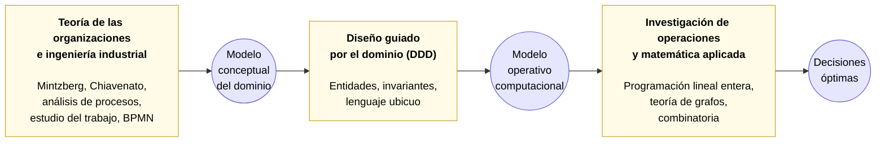

# Capítulo 2. Marco teórico

En la introducción se anticiparon tres cuerpos de ideas sobre los que
se apoya todo el trabajo: un marco para comprender a la organización
estudiada, un marco para modelar el dominio en software y un marco
matemático para plantear la asignación de aulas como un problema de
optimización. Este capítulo los desarrolla en el orden en que se usan
más adelante, de modo que cada definición quede disponible cuando
llegue el momento de aplicarla.

Los tres cuerpos provienen de disciplinas distintas (teoría de la
organización, ingeniería de software y matemática aplicada), pero se
articulan porque cada uno produce el insumo que necesita el siguiente,
como muestra la Figura @fig:cadena.

<!-- figura: Cadena de disciplinas que articula el proyecto {#fig:cadena} -->

```mermaid
flowchart LR
    C1["<b>Teoría de las organizaciones<br/>e ingeniería industrial</b><br/><br/>Mintzberg, Chiavenato,<br/>análisis de procesos,<br/>estudio del trabajo, BPMN"]
    C2["<b>Diseño guiado<br/>por el dominio (DDD)</b><br/><br/>Entidades, invariantes,<br/>lenguaje ubicuo"]
    C3["<b>Investigación de operaciones<br/>y matemática aplicada</b><br/><br/>Programación lineal entera,<br/>teoría de grafos,<br/>combinatoria"]

    P1(("Modelo<br/>conceptual<br/>del dominio"))
    P2(("Modelo<br/>operativo<br/>computacional"))
    P3(("Decisiones<br/>óptimas"))

    C1 --> P1 --> C2 --> P2 --> C3 --> P3

    classDef body fill:#fffbe6,stroke:#c9a227,color:#000
    classDef prod fill:#e6e6ff,stroke:#5b5bd6,color:#000
    class C1,C2,C3 body
    class P1,P2,P3 prod
```

Leída de izquierda a derecha, la cadena dice lo siguiente: la teoría
de las organizaciones y las herramientas de la ingeniería industrial
permiten **entender el dominio** y producir un *modelo conceptual*
fiel de la organización, sus actores y sus procesos. El diseño guiado
por el dominio toma ese modelo y le da forma de *modelo operativo
computacional*: entidades, reglas e invariantes que viven en el
software. Sobre ese modelo, finalmente, la investigación de
operaciones y la matemática aplicada permiten **tomar decisiones
óptimas**. El capítulo sigue ese mismo orden.

## 2.1 Marco organizacional y de análisis de sistemas

### 2.1.1 El instrumental de la ingeniería industrial

La ingeniería industrial se distingue de otras ingenierías por su
objeto de estudio: no un dispositivo físico, sino un *sistema
sociotécnico*, es decir, una combinación de personas, procesos,
recursos e información que persigue un objetivo. Para intervenir sobre
un sistema así primero hay que entenderlo, y la disciplina acumuló
para eso un instrumental propio. Varias de sus familias aparecen en
este trabajo:

- **Teoría de las organizaciones**: un vocabulario para describir cómo
  se estructura una organización y cómo se coordina su operación
  (Mintzberg y Chiavenato, presentados en la introducción).
- **Análisis y modelado de procesos**: diagramas de flujo, cursogramas,
  la notación BPMN (Modelo y Notación de Procesos de Negocio, del
  inglés *Business Process Model and Notation*) y los diagramas SIPOC
  (proveedor, entrada, proceso, salida, cliente) hacen visibles los
  pasos, responsables, entradas y salidas de cada actividad. En el
  capítulo 3 se aplican al proceso actual de asignación de aulas.
- **Estudio del trabajo y medición**: descomposición de tareas en
  operaciones elementales, medición de tiempos e identificación de
  cuellos de botella; la base cuantitativa para caracterizar volumen,
  ritmo y capacidad.
- **Ingeniería de métodos y mejora continua**: análisis de valor,
  cinco porqués o el ciclo planificar-hacer-verificar-actuar, para
  identificar desperdicios y oportunidades de simplificación. Aquí
  motivan el diagnóstico del proceso manual actual.
- **Análisis de sistemas**: tratar al conjunto como una entidad con
  entradas, salidas, componentes e interacciones, requisito previo a
  cualquier modelo formal.

### 2.1.2 Chiavenato y Mintzberg aplicados a la FCEIA

La introducción ya caracterizó a la FCEIA con las dos tipologías:
según Chiavenato [1], es una *organización compleja* (diferenciación
horizontal alta, vertical moderada y dispersión espacial en dos
sedes); según Mintzberg [7], es una *burocracia profesional*, cuya
parte clave es el núcleo operativo (los docentes) y cuyo mecanismo de
coordinación principal es la normalización de habilidades. No
repetimos aquí esas definiciones; sólo conviene remarcar dos
consecuencias de cada una.

De Chiavenato se desprende que, en una organización compleja, la
dificultad operativa principal no es la longitud de la cadena de mando
sino la **multiplicidad de actores, actividades y recursos que deben
articularse en tiempo y espacio**, que es justamente lo que enfrenta
la coordinación académica cada cuatrimestre. De Mintzberg se
desprende que los docentes coordinan su trabajo a partir de su
formación previa (un profesor de Análisis Matemático sabe cómo
enseñar la materia porque es matemático, no porque un manual se lo
indique) y que, por eso mismo, gozan de una autonomía muy superior a
la de un operario industrial típico.

### 2.1.3 Implicancias para el diseño de una solución

Combinadas, ambas caracterizaciones dejan tres implicancias directas
para el resto del informe:

1. **Las decisiones operativas están distribuidas.** Cada cátedra
   define sus horarios, sus comisiones y sus criterios de dictado, sin
   una autoridad central que los uniforme. Un sistema de asistencia a
   la coordinación debe *acomodar heterogeneidad*, no imponer
   uniformidad.
2. **Los requerimientos son cambiantes.** Como el núcleo operativo
   actúa con autonomía, los cambios en cátedras, comisiones o
   modalidades aparecen en cualquier momento del cuatrimestre. El
   sistema debe permitir **volver a optimizar** sobre la marcha, no
   sólo producir una planificación inicial.
3. **La normalización de habilidades no coordina los recursos
   físicos.** La formación de un docente asegura que sepa dictar su
   materia, pero no decide qué aula ocupa. Esa coordinación exige un
   mecanismo adicional: información compartida, reglas explícitas y un
   proceso de decisión. Ése es el hueco que viene a llenar este
   proyecto.

El producto de esta sección es un **modelo conceptual** del dominio:
qué tipo de organización es la FCEIA, cómo se coordina, qué actores
intervienen y qué implica su estructura para el problema. Ese modelo,
sin embargo, todavía es descriptivo: vive en prosa, tablas y
diagramas. Para que un sistema de software opere sobre él hay que
darle una forma más rígida, con entidades y reglas explícitas.

## 2.2 Marco metodológico: diseño guiado por el dominio

Para traducir la comprensión de la organización a un sistema de
software fiel al dominio real tomamos como marco el *diseño guiado
por el dominio* (DDD, del inglés *Domain-Driven Design*), formulado
por Evans [3] y ya presentado en la introducción.

### 2.2.1 Premisa y conceptos operativos

Evans sostiene que la principal causa de fracaso de los proyectos de
software complejos no es la falta de herramientas técnicas sino la
**distancia entre el modelo mental del experto del dominio y el modelo
implementado en el código**. Un sistema puede ser técnicamente
correcto y, aun así, operativamente inservible si su vocabulario, sus
categorías y sus reglas no coinciden con las de la organización a la
que sirve. Por eso propone que la comprensión del dominio se encarne
en el software mismo.

De su propuesta tomamos cuatro conceptos, que se aplican en los
capítulos 5 y 6:

- **Dominio**: el sector de la realidad que el software modela; en
  nuestro caso, la operatoria académica de la FCEIA en lo referente al
  dictado de clases y la ocupación de aulas.
- **Lenguaje ubicuo** (*ubiquitous language*): un vocabulario
  compartido entre el experto del dominio y el diseñador, que aparece
  de forma consistente en las conversaciones, la documentación y el
  software. Cuando alguien de la Secretaría Académica dice "materia" y
  el sistema entiende exactamente lo mismo, con los mismos atributos,
  hay lenguaje ubicuo.
- **Entidad**: objeto del dominio con identidad propia, que sigue
  siendo el mismo aunque cambien sus atributos. Una comisión es la
  misma comisión aunque le cambien el aula o el cupo.
- **Invariante**: propiedad que debe cumplir toda instancia de una
  entidad *en todo momento*; por ejemplo, "una comisión pertenece
  siempre a exactamente una materia". Toda invariante que el sistema
  no garantice explícitamente termina violándose y deja datos
  inconsistentes.

El método completo (agregados, repositorios, servicios de dominio,
contextos delimitados) excede el alcance del informe; sólo se lo
menciona cuando una decisión de diseño se apoya en él.

### 2.2.2 Del modelo conceptual al modelo operativo computacional

DDD es, sobre todo, un método para fijar el modelo del dominio en
artefactos ejecutables. El modelo conceptual que produjo la ingeniería
industrial es todavía discursivo; DDD lo lleva a un plano en el que el
modelo es al mismo tiempo documentación y motor de la solución. En
concreto, cada concepto identificado (materia, comisión, horario,
aula, sede) pasa a ser una entidad con nombre propio y relaciones
explícitas; las reglas de negocio dejan de ser recordatorios en un
documento y pasan a ser validaciones que el sistema impone en cada
operación; y los términos del lenguaje ubicuo se repiten tal cual en
el software, de modo que la comunicación con el experto deja de ser
una traducción.

A ese resultado combinado (entidades, invariantes y vocabulario que
viven en el software) lo llamamos **modelo operativo computacional**.
La expresión no es de Evans: es una denominación propia del informe.
Su rol es doble: ser una traducción fiel del modelo conceptual, para
que toda decisión sobre el sistema sea también una decisión sobre el
dominio real, y ser una estructura formal sobre la que las técnicas de
optimización puedan actuar sin reinterpretar el dominio en cada
ejecución. Sin este paso, la investigación de operaciones sólo tendría
datos crudos (planillas de horarios, listas de aulas); con él, opera
sobre un modelo integrado, consistente y con sus reglas garantizadas.

La combinación de marcos tan distintos responde a la idea central del
informe: Mintzberg y Chiavenato describen la organización *como es*;
Evans permite diseñar un sistema *fiel a esa descripción*. Sin lo
primero, el software queda desconectado de la facultad real; sin lo
segundo, el diagnóstico no produce una herramienta concreta. Queda
abierta, sin embargo, una pregunta que ninguno de los dos contesta:
**qué hacer con el modelo**. Elegir horarios y aulas admite muchas
respuestas factibles y una noción explícita de "mejor entre las
factibles"; para tratarla con rigor hace falta el tercer cuerpo.

## 2.3 Marco técnico: investigación de operaciones

En la asignación de aulas, la decisión es qué aula asignar a cada
clase, sujeta a un conjunto de restricciones. Para tomarla de forma
fundada recurrimos a la *investigación de operaciones*, la rama de la
matemática aplicada que estudia el uso de modelos matemáticos para la
toma de decisiones en sistemas complejos.

### 2.3.1 Programación lineal

Un *problema de programación lineal* consiste en optimizar (maximizar
o minimizar) una función lineal de un conjunto de variables, sujeta a
igualdades y desigualdades lineales. Su formulación estándar es:

```text
minimizar    c₁·x₁ + c₂·x₂ + ... + cₙ·xₙ
sujeta a     aᵢ₁·x₁ + aᵢ₂·x₂ + ... + aᵢₙ·xₙ ≤ bᵢ   para i = 1, ..., m
             x₁, x₂, ..., xₙ ≥ 0
```

Las `x₁, ..., xₙ` son las **variables de decisión** (las incógnitas
cuyo valor se busca) y `cⱼ`, `aᵢⱼ` y `bᵢ` son constantes conocidas.
La expresión que se optimiza es la **función objetivo**; las
condiciones lineales que deben satisfacer las variables son las
**restricciones**. Una asignación de valores que cumple todas las
restricciones es una **solución factible**, y la factible con mejor
valor del objetivo es la **solución óptima**. La programación lineal
cuenta con algoritmos muy eficientes (el método símplex o los métodos
de punto interior) que resuelven en la práctica problemas con miles de
variables y restricciones.

### 2.3.2 Programación lineal entera

Muchos problemas exigen que las variables tomen sólo valores enteros.
El caso más frecuente es el de las variables **binarias** (que valen
`0` o `1`), que representan decisiones del tipo "asignar o no
asignar". Cuando se conserva la estructura lineal pero se agrega esa
exigencia de integralidad, se habla de *programación lineal entera*
(PLE); si sólo una parte de las variables es entera, de programación
lineal entera mixta.

La integralidad cambia radicalmente la dificultad computacional:
mientras la programación lineal continua se resuelve en tiempo
polinomial, la entera pertenece a la clase de problemas *NP-difíciles*,
para los que, en el peor caso, el tiempo de resolución crece
exponencialmente con la cantidad de variables. En la práctica, sin
embargo, con formulaciones cuidadas y resolutores modernos, problemas
de cientos a miles de variables binarias se resuelven en segundos o
minutos.

### 2.3.3 Ramificación y acotación

El algoritmo estándar para la programación lineal entera es la
*ramificación y acotación* (*branch-and-bound*). Primero se resuelve
la **relajación lineal**, es decir, el mismo problema permitiendo que
las binarias tomen cualquier valor entre `0` y `1`; como admite más
soluciones, su óptimo es una **cota** del óptimo entero. Si esa
solución resulta entera, se terminó. Si no, se elige una variable
fraccionaria y se parte el problema en dos subproblemas (uno con la
variable fijada en `0` y otro en `1`), que se tratan de la misma
manera. En cada nodo del árbol resultante se **poda**: si la cota de
un subproblema es peor que la mejor solución entera ya encontrada,
todo ese subárbol se descarta sin explorarlo. Con una formulación bien
planteada, la mayor parte del árbol se poda temprano.

### 2.3.4 Resolutores

Un *resolutor* (*solver*) es un programa que recibe la descripción de
un problema de programación lineal entera y devuelve una solución
óptima o un certificado de infactibilidad cuando ninguna asignación
satisface todas las restricciones. Los resolutores comerciales más
difundidos son Gurobi y CPLEX; entre los libres, el más usado es CBC
(*COIN-OR Branch and Cut*), que implementa ramificación y acotación
con planos de corte. Para usarlo desde Python se recurre a una
biblioteca de modelado como PuLP, que permite escribir la formulación
de forma declarativa y la traduce al formato que el resolutor espera.
Ésa es la combinación que emplea el sistema desarrollado.

### 2.3.5 Restricciones duras y blandas

Al modelizar problemas reales conviene distinguir dos clases de
restricciones. Una restricción es *dura* cuando su incumplimiento hace
inaceptable la solución: o se cumple o el modelo es infactible. Es
*blanda* cuando su incumplimiento es tolerable pero indeseable: la
solución que la viola no se descarta, pero se la **penaliza** con un
término en la función objetivo, de modo que el resolutor la respeta
cuando puede y la cede cuando no queda alternativa. Codificar
preferencias como penalizaciones del objetivo es central en el modelo
de asignación de aulas.

### 2.3.6 Bibliografía

Como referencia de investigación de operaciones tomamos el material
de las cátedras de Operativa 1 y Operativa 2 de la Escuela de
Ingeniería Industrial (FCEIA-UNR), en particular el libro de Morán
para la programación lineal, la programación entera y la ramificación
y acotación, complementado por el material *Introducción a la
Investigación Operativa* del mismo curso.

## 2.4 Herramientas combinatorias y de teoría de grafos

Las herramientas anteriores alcanzan para plantear y resolver el
problema. Pero antes de invocar al resolutor conviene contar con un
mecanismo más liviano que **detecte de antemano los casos sin solución
posible** y, sobre todo, que le indique al usuario **por qué**. Para
eso recurrimos a dos resultados clásicos, el principio del palomar y
el teorema de Hall, que se apoyan en un vocabulario mínimo de grafos.

### 2.4.1 Grafos, grafos bipartitos y apareamientos

La *teoría de grafos* es uno de los formalismos que un ingeniero tiene
a mano para modelizar **relaciones discretas entre objetos**: captura
quién está conectado con quién, sin importar los atributos internos de
los objetos, y con conexiones que están o no están (una ruta une o no
dos ciudades; un aula puede o no recibir una clase). Se la usa en
redes de transporte y de comunicaciones, planificación de proyectos,
asignación de personal a puestos o distribución en planta, entre
otros campos. Su utilidad es doble: hace visible una estructura que en
prosa o en una tabla quedaría oculta, y habilita a aplicar resultados
y algoritmos ya conocidos (apareamientos, flujos, caminos mínimos) sin
reinventarlos. Además, un grafo es a la vez un objeto conceptual y una
estructura de datos, por lo que lo que se razona sobre él se traslada
directamente al software.

Formalmente, un *grafo* es un par `G = (V, E)`, donde `V` es un
conjunto de **vértices** (entidades) y `E` un conjunto de pares no
ordenados de vértices, llamados **aristas** (relaciones). Cuando hay
dos poblaciones distintas y las relaciones sólo se dan entre elementos
de una y otra (personas y puestos, o clases y aulas), se habla de un
*grafo bipartito*: sus vértices se dividen en dos conjuntos disjuntos
`X` e `Y`, y toda arista une un vértice de `X` con uno de `Y`. Es el
modelo natural de los problemas de asignación: si `X` son tareas e `Y`
recursos, una arista entre `x` e `y` indica que la tarea `x` es
compatible con el recurso `y`.

La Figura @fig:bipartito ilustra estas ideas con cuatro clases
simultáneas y cuatro aulas: cada línea une una clase con un aula
compatible, y las líneas resaltadas forman un apareamiento que le da
un aula distinta a cada clase.

{#fig:bipartito width=9cm}

Un *apareamiento* (*matching*) es un subconjunto de aristas en el que
ningún vértice aparece más de una vez. Un apareamiento **satura** a
`X` si cubre a todos sus vértices; si además `X` e `Y` tienen el mismo
tamaño, se lo llama **apareamiento perfecto**. Para razonar sobre los
bloqueos se usa la *vecindad* `N(S)` de un subconjunto `S ⊆ X`: el
conjunto de vértices de `Y` unidos por alguna arista con algún
vértice de `S`.

En nuestro problema, `X` es el conjunto de clases que se dictan en un
mismo instante, `Y` el de aulas disponibles en ese instante, y existe
una arista `(clase, aula)` cuando el aula es compatible con la clase
(tipo, sede y capacidad adecuados). Preguntar si existe una asignación
válida equivale a preguntar si existe un apareamiento que sature a
`X`. Decidirlo, y encontrar ese apareamiento, se puede hacer en tiempo
polinomial (por ejemplo, con el algoritmo de Hopcroft-Karp), y cuando
no existe se puede identificar un subconjunto de `X` que evidencie el
bloqueo.

### 2.4.2 Principio del palomar

El *principio del palomar* (*pigeonhole principle*) es uno de los
resultados más elementales de la matemática discreta:

> *Si se distribuyen `n` objetos en `k` casilleros y `n > k`,
> entonces al menos un casillero contiene más de un objeto.*

Aplicado a nuestro problema: si en una franja horaria hay `n` clases
simultáneas y sólo `k < n` aulas compatibles disponibles, al menos dos
clases tendrían que compartir aula, lo que está prohibido. El palomar
es entonces una **condición necesaria** de factibilidad: si falla, el
problema es infactible; si se cumple, todavía no hay garantía de que
exista solución.

La Figura @fig:palomar lo muestra con cuatro clases
simultáneas y tres aulas: por más que se las reparta, dos clases
terminan en la misma aula.

{#fig:palomar width=11cm}

### 2.4.3 Teorema de Hall

El criterio más fino lo da el *teorema de Hall* (1935), que
caracteriza exactamente cuándo existe un apareamiento que sature a
`X` en un grafo bipartito:

> **Teorema de Hall.** *En un grafo bipartito con particiones `X` e
> `Y`, existe un apareamiento que satura a `X` si y sólo si para todo
> subconjunto `S ⊆ X` se cumple `|N(S)| ≥ |S|`.*

La desigualdad `|N(S)| ≥ |S|` es la **condición de Hall**: todo grupo
de clases tiene que disponer, entre todas, de al menos tantas aulas
compatibles como clases tiene el grupo. Si falla para algún `S`, ese
subconjunto es un **conjunto violador de Hall** y constituye, además,
un testigo interpretable del bloqueo: se lo puede informar al usuario
como "este grupo de clases no tiene aulas suficientes entre las que le
son compatibles".

### 2.4.4 Ejemplo comparativo palomar vs Hall

La Tabla @tab:hall muestra un caso en el que el palomar no alcanza y la
condición de Hall sí. Tres clases `h₁, h₂, h₃` se dictan a la misma
hora y hay tres aulas disponibles `a, b, c`:

<!-- tabla: Ejemplo de compatibilidades entre clases y aulas {#tab:hall} -->
| clase | aulas compatibles |
| --- | --- |
| `h₁` | `{a}` |
| `h₂` | `{a}` |
| `h₃` | `{a, b, c}` |

El conteo global cierra (3 clases, 3 aulas). Sin embargo, para
`S = {h₁, h₂}` la vecindad es `N(S) = {a}`, de tamaño `1 < 2`: la
condición de Hall falla y no hay asignación posible, porque `h₁` y
`h₂` compiten por la única aula que ambas admiten. Las dos
herramientas son complementarias: el palomar detecta los casos
evidentes mirando totales; Hall, los más sutiles mirando subconjuntos.

### 2.4.5 Aplicación en el sistema

Ambos criterios forman parte de la **verificación estructural
previa** a la resolución: un semáforo que se ejecuta antes de invocar
al resolutor y que, cuando una asignación no puede existir, informa
al usuario la causa concreta en términos del dominio. Para cada franja
horaria se arma el grafo bipartito de compatibilidad clase-aula; se
aplica primero el conteo global (palomar) como filtro rápido y, si
cierra, se busca un apareamiento que sature a las clases y, de no
encontrarlo, un conjunto violador de Hall como testigo. El detalle de
esta verificación se retoma en el capítulo 8. Los resultados sobre
grafos bipartitos, apareamientos y el teorema de Hall se toman de la
bibliografía estándar de teoría de grafos, detallada al final del
informe.

## 2.5 Recapitulación y sinergias

Este capítulo dejó disponibles las herramientas que se usan en el
resto del informe:

- Del instrumental de la ingeniería industrial y, en particular, de
  Mintzberg y Chiavenato, la caracterización de la FCEIA como
  *burocracia profesional compleja* y sus tres implicancias:
  decisiones distribuidas, requerimientos cambiantes y necesidad de un
  mecanismo de coordinación adicional para los recursos físicos.
  Producto: el **modelo conceptual del dominio**.
- De Evans, la idea de un software guiado por el dominio y los
  conceptos de dominio, lenguaje ubicuo, entidad e invariante.
  Producto: el **modelo operativo computacional**.
- De la investigación de operaciones, la programación lineal entera,
  la ramificación y acotación y la distinción entre restricciones
  duras y blandas. Producto: la decisión de asignación planteada como
  un problema de optimización explícito.
- De la teoría de grafos y la combinatoria, los grafos bipartitos, los
  apareamientos, el principio del palomar y el teorema de Hall.
  Producto: la verificación estructural previa, que explica al usuario
  la causa de una eventual infactibilidad.

### 2.5.1 Cómo se articulan las piezas

Cada eslabón de la cadena de la Figura @fig:cadena habilita al siguiente. Sin
modelo conceptual no hay lenguaje ubicuo, y cualquier estructura de
datos sería una interpretación arbitraria. Sin modelo operativo
computacional no hay sobre qué actuar: las reglas pueden estar claras
en un documento, pero mientras no se materialicen como entidades,
invariantes y validaciones, el sistema no puede razonar sobre ellas.
Y sin la matemática aplicada no hay forma de decidir con fundamento
sobre ese modelo. Esta última aporta dos cosas: un lenguaje formal
para expresar relaciones y restricciones (el grafo de compatibilidad,
la formulación algebraica de las horas de teoría y laboratorio), que
permite diagnosticar la factibilidad incluso antes de buscar una
solución; y técnicas de optimización para establecer **qué es una
buena solución** y elegir la mejor entre las válidas según los
criterios del negocio. Con este tercer eslabón el sistema deja de ser
un registro informatizado y pasa a ser una herramienta que propone
soluciones y explica sus bloqueos en términos que el usuario reconoce.

La relación también funciona hacia atrás: cuando el diagnóstico
matemático detecta un bloqueo, lo presenta con el vocabulario del
dominio, y la corrección suele pasar por ajustar el proceso de negocio
(mover un horario, sumar una comisión, habilitar un aula), es decir,
por volver al primer eslabón. Es esa bidireccionalidad la que hace del
sistema una herramienta de mejora organizacional y no un motor de
optimización desconectado.

### 2.5.2 Dónde se usa cada pieza más adelante

En el capítulo 3 se aplica el análisis de procesos a la operatoria
actual de la coordinación académica. En el capítulo 4 se combina el
diagnóstico organizacional con el vocabulario de la programación
lineal para definir formalmente el problema. En los capítulos 5 y 6
se aplica el marco de Evans para construir el modelo del dominio y su
modelo de datos. En el capítulo 8 se formula el programa lineal entero
concreto, se lo resuelve con ramificación y acotación mediante CBC y
se aplican el palomar y Hall a la verificación estructural sobre el
grafo de compatibilidad.
