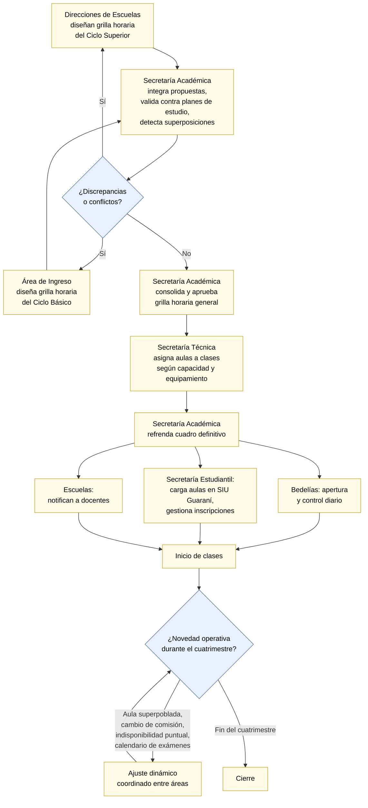

# Capítulo 3. La organización y su operatoria

El capítulo anterior fijó las herramientas conceptuales del trabajo.
Este capítulo las aplica por primera vez, sobre un objeto concreto:
la Facultad de Ciencias Exactas, Ingeniería y Agrimensura de la
Universidad Nacional de Rosario, y en particular el proceso por el
cual cada cuatrimestre se decide qué clase se dicta en qué aula.

El propósito del capítulo es doble. Por un lado, dejar caracterizada
a la organización con el nivel de detalle necesario para que las
decisiones de modelización de los capítulos siguientes tengan una
base concreta. Por otro, describir el proceso actual de asignación
(cómo se hace hoy, con qué información y con qué resultados) para
que el diagnóstico de sus problemas quede fundado y no dependa de
la intuición del lector. El instrumental que se usa acá viene del
análisis de sistemas y del modelado de procesos, presentados en
§2.1.1; los diagnósticos organizacionales se apoyan en las
tipologías de §2.1.2 y §2.1.3 sin repetirlas.

## 3.1 FCEIA en detalle

### 3.1.1 Misión, escala y contexto institucional

La Facultad de Ciencias Exactas, Ingeniería y Agrimensura (en
adelante, FCEIA) es una de las facultades de la Universidad
Nacional de Rosario (UNR). Actualmente dicta once carreras de
grado (seis de ingeniería, tres licenciaturas y dos profesorados
en ciencias exactas), cuenta con una variada oferta de carreras y
cursos de posgrado y también brinda educación a distancia. La
escala de la facultad (varias carreras activas, cientos de materias,
miles de alumnos regulares por cuatrimestre) hace que la coordinación
de su operatoria académica no sea reducible a la de una unidad
pequeña: cualquier proceso que la involucre se enfrenta con la
combinatoria propia de una organización mediana.

La actividad académica se ordena en **ciclos lectivos**, cada uno
compuesto por dos **cuatrimestres**. Cada cuatrimestre inaugura un
nuevo escenario de planificación: qué materias se dictan, con qué
comisiones, en qué horarios y en qué aulas. Este documento se ocupa
específicamente de la última pregunta, aunque en varios momentos
tendrá que apoyarse en las tres anteriores para dar contexto.

### 3.1.2 Sedes: Pellegrini y Centro Universitario Rosario

La FCEIA desarrolla sus actividades académicas en dos sedes
físicas:

- **Sede Pellegrini** (Avenida Pellegrini 250, Rosario). Es el
  edificio histórico de la facultad, inaugurado en 1929. Allí
  tienen su asiento el Decanato, el Consejo Directivo, las
  dependencias administrativas, varios institutos y laboratorios y
  las Escuelas de Formación Básica, Agrimensura, Ingeniería
  Industrial, Ciencias Exactas y Naturales, y la Escuela de
  Posgrado y Educación Continua. La sede concentra la mayor parte
  del dictado y sus aulas son compartidas por materias de distintas
  carreras.
- **Centro Universitario Rosario (CUR)** (Riobamba 250 bis). El CUR
  es un predio de la UNR en el que funcionan varias facultades. La
  FCEIA cuenta allí con edificios propios en los que se ubican las
  Escuelas de Ingeniería Mecánica, Ingeniería Civil, Ingeniería
  Eléctrica e Ingeniería Electrónica, junto con diversos
  laboratorios, centros e institutos y el Reactor nuclear RA-4.
  Las materias de las ingenierías del ciclo superior de esas cuatro
  Escuelas se dictan típicamente en esta sede.

Ambas sedes están bajo gestión académica centralizada de FCEIA y sus
aulas son de uso exclusivo de la facultad. La distinción entre sedes
es relevante para el problema de asignación por dos motivos:
primero, porque un alumno que cursa dos materias correlativas el
mismo día no puede trasladarse instantáneamente de una sede a la
otra, y por lo tanto ciertos pares de horarios que en un edificio
único serían válidos en dos sedes distintas no lo son; segundo,
porque hay laboratorios especializados que existen solamente en una
de las dos sedes, con lo cual el tipo de aula requerida por una
materia puede restringir la sede donde se dicta.

### 3.1.3 Tipología de aulas

Las aulas de la FCEIA se clasifican, para los efectos de la
asignación, en tres grandes tipos:

- **Aulas teóricas**: destinadas al dictado expositivo, con bancos
  fijos o móviles. Capacidades típicas que van desde una veintena
  hasta un centenar y medio de alumnos. Dentro de esta familia se
  distinguen aulas comunes y **anfiteatros**, que son aulas
  teóricas con capacidad especialmente alta.
- **Laboratorios**: aulas con equipamiento específico según la
  disciplina (química, electrónica, informática, ensayo de
  materiales, entre otros). No son intercambiables: un laboratorio
  de química no sirve para una clase de electrónica y viceversa.
  Formalmente, cada materia con contenido de laboratorio declara
  cuáles laboratorios son compatibles con ella.
- **Espacios específicos**: aulas con requerimientos particulares
  (proyectores fijos, mesas de gran tamaño para dibujo o diseño,
  talleres pesados) que no encuadran en las categorías anteriores.
  Se los menciona para completitud pero, dentro del alcance de
  este trabajo, se los trata como una variante de aula teórica o
  de laboratorio según corresponda.

Las aulas tienen, además, dos atributos operativamente relevantes:
**capacidad** (cantidad máxima de alumnos que pueden cursar en ella
en condiciones adecuadas) y **disponibilidad horaria** (franjas de
la semana en las que el aula está habilitada para dictado). Sobre
capacidades, la facultad opera con un rango amplio (aulas chicas
para comisiones reducidas, aulas grandes para materias masivas,
anfiteatros para clases plenarias); sobre disponibilidades, la
convención asumida es que las aulas están disponibles durante toda
la ventana operativa de la facultad, salvo excepciones puntuales
que quedan fuera del alcance de este trabajo.

### 3.1.4 Grilla horaria oficial

La facultad organiza institucionalmente el día operativo en tres
**turnos** (Mañana, Tarde y Noche), estructurados en **bloques
prefijados de 45 minutos** que constituyen la unidad mínima del
cronograma oficial. Esta grilla es el marco temporal común dentro
del cual las cátedras deberían encajar sus horarios de dictado; es
también la unidad natural de referencia para la coordinación entre
carreras y para el uso compartido de aulas.

En la práctica, sin embargo, cuando las Escuelas confeccionan sus
propuestas de agenda académica cuatrimestral no siempre respetan
los bloques prefijados. Se observan cursadas de duraciones
distintas a los múltiplos de 45 minutos, cortes desfasados respecto
de la grilla y superposiciones que la grilla teórica no
anticiparía. Esta divergencia entre grilla oficial y práctica
efectiva es una de las fuentes de fricción del proceso actual
(§3.3.2) y motiva parte de las decisiones de modelización del
capítulo 4.

## 3.2 El proceso actual de asignación de aulas

Con la organización ya caracterizada, corresponde describir el
proceso concreto por el cual hoy se decide qué clase se dicta en qué
aula. Antes de la descripción propiamente dicha conviene una nota
sobre el instrumento de modelado.

### 3.2.1 Análisis y modelado de procesos como instrumento

Cuando un ingeniero necesita entender un proceso operativo, uno de
los recursos de su caja de herramientas es el **modelado de
procesos**: representar el flujo de actividades (quién hace qué,
cuándo, con qué insumos y con qué salidas) en una notación
suficientemente formal como para que la representación pueda
discutirse, revisarse y mejorarse. Este recurso ya fue introducido
en §2.1.1 como parte del instrumental de análisis de sistemas de la
ingeniería industrial.

Existen varias notaciones estandarizadas para modelar procesos: los
diagramas de flujo elementales, los cursogramas, la notación
**BPMN** (*Business Process Model and Notation*, un estándar de la
Object Management Group) y los diagramas SIPOC. Cada notación
enfatiza aspectos distintos: BPMN es fuerte para explicitar roles y
puntos de decisión; los cursogramas son fuertes para documentar
formularios y responsables administrativos; SIPOC es útil para
enfocar entradas y salidas. En este capítulo se opta por una
notación de flujo simplificada, suficiente para comunicar la
estructura del proceso actual sin recargar al lector con
convenciones específicas.

### 3.2.2 Actores intervinientes

El proceso actual de asignación no está centralizado en una única
figura sino distribuido entre varias áreas de la facultad. Cada una
opera sobre un tramo del flujo, con sus propias responsabilidades y
sus propios documentos de trabajo. Los actores que intervienen son:

- **Direcciones de Escuelas académicas.** Cada Escuela (Formación
  Básica, Ingeniería Industrial, Ingeniería Mecánica, Ingeniería
  Civil, Ingeniería Eléctrica, Ingeniería Electrónica, Agrimensura,
  Ciencias Exactas y Naturales, entre otras) es responsable de
  diseñar de manera autónoma la grilla horaria de las materias
  específicas del **Ciclo Superior** de sus carreras. Para eso
  analiza la disponibilidad horaria de su cuerpo docente, distribuye
  las comisiones teóricas y prácticas y establece la secuencia de
  dictado.
- **Área de Ingreso.** Planifica en forma paralela las asignaturas
  del **Ciclo Básico** (el tronco común de primer y segundo año de
  las ingenierías: Cálculo, Álgebra, Física y otras materias de
  alta concurrencia). Proyecta la cantidad de comisiones necesarias
  y las distribuye en los tres turnos de la grilla oficial.
- **Secretaría Académica.** Recibe las propuestas de las Direcciones
  de Escuelas y del Área de Ingreso, y lleva a cabo la
  **integración, fiscalización y validación institucional**.
  Consolida la información en una grilla horaria única, verifica el
  cumplimiento de los planes de estudio aprobados, controla que no
  haya solapamientos horarios para un alumno tipo, y que un mismo
  docente no aparezca en dictados simultáneos. Una vez subsanadas
  las discrepancias, aprueba la grilla horaria general.
- **Secretaría Técnica.** Toma como insumo la grilla horaria
  consolidada y el inventario físico de la planta (aulas teóricas,
  laboratorios de informática, talleres pesados, laboratorios de
  ensayo, anfiteatros) y realiza la **asignación de espacios
  físicos a las clases**. Evalúa capacidad nominal y equipamiento,
  buscando que cada aula asignada cubra la cantidad esperada de
  inscriptos y cuente con los recursos técnicos requeridos.
  Confecciona el cuadro definitivo de ocupación y lo remite a la
  Secretaría Académica para su refrendo final.
- **Secretaría Estudiantil.** Gestiona la fase de captura y
  consolidación de la demanda a través del sistema SIU Guaraní.
  Administra los períodos de inscripción a asignaturas y comisiones
  y realiza la carga y actualización final de las aulas asignadas
  en la plataforma.
- **Bedelías.** Reciben la matriz definitiva de horarios y aulas
  para la apertura y control diario de los recintos.
- **Cátedras y docentes.** Definen la modalidad concreta de
  dictado de cada materia (cantidad de comisiones, horarios,
  necesidad de laboratorio) dentro del marco fijado por la Escuela
  y validado por la Secretaría Académica.
- **Alumnos.** Consumen el resultado del proceso: se inscriben a
  comisiones y asisten a las clases en las aulas asignadas.
- **Sistema SIU Guaraní.** Sistema de gestión académica que
  administra la información de alumnos, inscripciones y
  comisiones. Detallado en §3.4.

Vale la pena destacar dos rasgos de esta distribución de actores.
Primero, **la asignación de aulas propiamente dicha es
responsabilidad de la Secretaría Técnica**, pero opera sobre una
grilla horaria consolidada por la Secretaría Académica, que a su
vez es la agregación de propuestas elaboradas de manera autónoma
por las Direcciones de Escuelas y el Área de Ingreso. Segundo, esta
distribución es coherente con el diagnóstico organizacional de
§2.1: las decisiones operativas están **efectivamente
descentralizadas** en el núcleo profesional (Escuelas y cátedras) y
la coordinación central se aplica sobre propuestas ya elaboradas,
no las produce desde cero.

### 3.2.3 Momentos y modalidad del proceso

El proceso tiene dos momentos operativos distintos:

- **Planificación inicial.** Al comienzo de cada cuatrimestre, antes
  del inicio de clases y, típicamente, antes de conocer la cantidad
  final de inscriptos, se define el esquema completo de asignación.
  Se toma como punto de partida el esquema del cuatrimestre
  anterior y se lo ajusta según los cambios reportados por las
  Escuelas, las cátedras y las autoridades académicas.
- **Ajustes dinámicos.** Iniciadas las clases, el esquema inicial
  suele requerir ajustes: por incorporación tardía de inscriptos,
  por materias que resultaron más numerosas de lo esperado, por
  cambios de última hora en la disponibilidad de docentes o aulas,
  por conflictos que se descubren en la práctica, o por
  requerimientos particulares del calendario de exámenes. Los
  ajustes se resuelven caso por caso y se propagan hacia las áreas
  correspondientes (Bedelías, SIU, cátedras).

La modalidad, en ambos momentos, es fundamentalmente **manual**.
Las Escuelas trabajan sus propuestas en planillas (Excel y
documentos derivados) y las remiten formalmente a Secretaría
Académica; ésta las integra en una grilla única también en
planillas; Secretaría Técnica trabaja la asignación de aulas del
mismo modo. Las comunicaciones entre áreas son formales pero el
soporte técnico común es la planilla y el correo. No existe un
sistema de información integrado que centralice restricciones,
disponibilidades y decisiones; la información se organiza en
documentos separados que cada área integra mentalmente al momento
de decidir.

### 3.2.4 Diagrama del proceso actual

El diagrama siguiente resume el flujo operativo con sus principales
actores y responsabilidades. Es una representación simplificada,
elaborada para servir de referencia en las secciones que siguen; su
fidelidad al detalle administrativo concreto no es total pero sí
suficiente para el análisis.

## 3.3 Problemas operativos observados

La descripción del proceso permite ahora enumerar los problemas
operativos que motivan este trabajo. La lista se construye a partir
de la observación del funcionamiento actual y de las comunicaciones
recogidas con las áreas de coordinación académica.

### 3.3.1 Problemas visibles al alumnado

Estos son los problemas cuya manifestación es directamente
perceptible en el aula:

- **Alumnos que pierden clases por falta de capacidad.** En materias
  masivas o en fechas de examen, la asistencia excede la capacidad
  del aula asignada; parte del alumnado queda sin lugar y no puede
  cursar esa clase concreta.
- **Alta densidad de alumnos.** Aun sin superar formalmente la
  capacidad del aula, la densidad efectiva (alumnos por metro
  cuadrado, disponibilidad de bancos) puede degradar sensiblemente
  la calidad del dictado.
- **Movimiento de bancos entre aulas.** Como corolario de lo
  anterior, alumnos y bedelería trasladan bancos entre aulas para
  compensar diferencias, entorpeciendo el paso en los pasillos y
  generando condiciones ergonómicas pobres.
- **Demoras en el inicio de las clases.** Cuando el aula asignada
  resulta inadecuada o no está disponible, la reasignación
  improvisada retrasa el inicio, con impacto acumulado sobre el
  dictado.

### 3.3.2 Problemas del proceso administrativo

Estos son los problemas ligados a cómo se lleva adelante la
asignación:

- **Alto costo de tiempo humano.** Las áreas responsables (Escuelas,
  Secretaría Académica, Secretaría Técnica) dedican una proporción
  significativa de su tiempo a la asignación inicial y, sobre todo,
  a los ajustes dinámicos, en detrimento de otras tareas de
  coordinación académica.
- **Sensibilidad a la información no consolidada.** Como los datos
  viven en documentos separados, cualquier cambio en un documento
  fuente puede pasar inadvertido y contaminar decisiones
  subsiguientes; la ausencia de una vista unificada favorece los
  errores de omisión.
- **Efecto cascada al re-planificar.** Una modificación local
  (cambio de horario de una materia, apertura de una comisión
  nueva) puede invalidar varias asignaciones aparentemente
  independientes. Sin una herramienta que evalúe el impacto de un
  cambio, cada re-planificación es exploratoria y consume tiempo
  desproporcionado al tamaño del cambio.
- **Falta de trazabilidad de las decisiones.** No queda registro
  sistemático de por qué se asignó cada aula a cada clase, con lo
  cual es difícil auditar decisiones pasadas o replicar buenas
  soluciones en cuatrimestres siguientes.

### 3.3.3 Problemas estructurales

Finalmente, hay problemas que no son fallas del proceso sino
características estructurales que el proceso no puede abordar:

- **Naturaleza combinatoria del problema.** Cientos de horarios
  semanales, decenas de aulas de tipos distintos, restricciones de
  tipo, sede, capacidad y no simultaneidad; el espacio de
  asignaciones posibles crece de manera explosiva y es
  prácticamente inabarcable para una decisión manual óptima.
- **Falta de un modelo formal de las restricciones.** Las reglas de
  la asignación (qué aula puede recibir qué clase, qué
  compatibilidades existen entre materias y laboratorios, cuáles
  son las sedes admisibles por carrera) son de conocimiento común
  pero no están explicitadas en ningún documento único. Cada
  decisión se toma con base en el criterio personal de las áreas
  intervinientes, alimentado por experiencia acumulada.
- **Ausencia de indicadores cuantitativos.** No hay métricas
  sostenidas de ocupación, capacidad excedida, aulas subutilizadas,
  tiempo insumido por reasignaciones. Sin ellas, cualquier
  discusión sobre "cómo funciona la asignación" queda anclada en
  impresiones antes que en datos.

Es importante señalar, para no exagerar el diagnóstico, que el
proceso actual **funciona**: cada cuatrimestre se logra publicar un
esquema de asignación y las clases se dictan. La motivación del
trabajo no es que el proceso esté fallando sino que **funciona a un
costo alto y con resultados subóptimos**, y que ambas cosas son
susceptibles de mejora con las herramientas adecuadas.

## 3.4 Datos y silos: cómo viven hoy los datos

Los problemas del proceso descriptos arriba no son ajenos a cómo
viven los datos que el proceso consume. Esta sección describe el
estado actual del ecosistema de datos de FCEIA en relación con la
asignación de aulas, y hace explícita la dispersión que motiva
varias de las decisiones de modelización del capítulo siguiente.

Como marco general vale una analogía tomada de la ingeniería de la
producción: en cualquier planta industrial, la programación de
recursos depende de dos artefactos de información básicos, la
**Lista de Materiales** (en inglés, *Bill of Materials* o BOM), que
define qué componentes hacen falta para fabricar cada producto, y
la **Hoja de Ruta** (*Routing Sheet*), que define en qué secuencia y
en qué máquinas se producen. En el paralelo académico, los **planes
de estudio** son la lista de materiales de la "producción académica"
(qué materias componen cada carrera, en qué secuencia, con qué
correlativas) y las **grillas horarias** son la hoja de ruta (qué
materia va en qué aula y en qué momento). Si estos dos artefactos
no están correctamente estructurados y consolidados, cualquier
proceso posterior de asignación queda comprometido de raíz. Es lo
que en ingeniería informática se sintetiza como principio *garbage
in, garbage out* (si entran datos basura, salen resultados basura):
una premisa que va a atravesar todo el diagnóstico de esta sección.

### 3.4.1 Las tres fuentes principales

En la práctica, las áreas involucradas trabajan con información que
proviene de tres fuentes distintas:

- **Planes de estudio de las carreras.** Cada carrera publica su
  plan de estudios: la lista de materias que la componen, su
  ubicación curricular (año, cuatrimestre), su carga horaria y sus
  correlativas. Estos planes viven en documentos institucionales
  (resoluciones del Consejo Directivo, publicaciones en la web de
  la facultad) y usualmente emplean **códigos internos propios de
  cada carrera** para identificar sus materias.
- **SIU Guaraní.** Sistema informático de gestión académica común a
  las universidades nacionales argentinas. Administra la
  información de alumnos, inscripciones a materias y comisiones,
  actas de examen y trámites conexos. Sus **códigos son propios del
  sistema** y no coinciden con los códigos internos de los planes
  de estudio.
- **Horarios y cronogramas publicados.** Cada cuatrimestre las
  cátedras y las Escuelas publican los horarios de cursada en
  planillas y en la web de la facultad. En estas publicaciones,
  una misma materia puede aparecer con **nombres distintos** según
  la carrera desde la cual se la mira (la misma materia de
  matemática puede llamarse *Análisis Matemático* en una carrera y
  *Cálculo* en otra, sin que ambos nombres se declaren como
  equivalentes en ningún documento común).

### 3.4.2 Codificación no estandarizada de materias

Las tres fuentes anteriores no comparten un identificador estable
para las entidades comunes. Una misma materia puede tener tres o
más nombres distintos (el del plan de la carrera A, el del plan de
la carrera B, el de SIU Guaraní, el del cronograma publicado) sin
que exista un mapeo formal entre ellos. Este fenómeno es
especialmente frecuente en las **materias comunes**: asignaturas
que forman parte de varias carreras a la vez (típicamente las de
los primeros años, como matemáticas o físicas).

Existen además casos de fragmentación más severos: **una misma
asignatura representada por más de un código** dentro de SIU
Guaraní, generando dos o más conjuntos de inscriptos para la
misma materia. Esto imposibilita conocer la cantidad real de
alumnos que van a cursar y, en consecuencia, sesga la estimación
de demanda que alimenta la asignación de aulas. Casos como
"Métodos Numéricos" e "Introducción a la Optimización" (que en la
práctica pueden compartir el mismo dictado unificado pero aparecen
como asignaturas independientes en los registros) ilustran el
tipo de problema.

La consecuencia práctica es doble. Por un lado, **integrar
información de las tres fuentes es una tarea de reconciliación
manual**: saber cuántos alumnos de una carrera van a cursar una
materia común implica identificar la equivalencia entre el código
de plan y el código de SIU, y saber en qué aula se dictaba el año
pasado implica identificar la equivalencia entre el nombre del
cronograma y el código de plan. Por otro lado, un sistema
automatizado que consuma estos datos sin sanearlos previamente
corre riesgos concretos: puede asignar dos aulas pequeñas donde
correspondía una consolidada mediana, o partir la programación de
una misma clase en dos horarios contrapuestos por leer sus dos
códigos como asignaturas distintas.

### 3.4.3 Codificación no estandarizada de comisiones

El problema análogo se replica a nivel comisiones. **No existe una
regla unificada** para la asignación del identificador de comisión
dentro de una materia. Las convenciones varían por cuatrimestre y
por materia: en algunas se usan números de una cifra (1, 2, 3),
en otras de tres cifras con patrones específicos (por ejemplo, en
"Cálculo" se usan 110, 120, 130 en el primer cuatrimestre y 510,
520, 530 en el segundo, lógica que no se replica en materias con
comportamiento similar), y en otras se emplea texto libre.

En SIU Guaraní, además, el campo "comisión" es de tipo texto y en
la mayoría de los casos se completa con una abreviación del
nombre de la asignatura (por ejemplo, `Calc1_Mañ`) en lugar de un
identificador estable. Esto transforma al campo en un dato de
utilidad marginal para el cruce automatizado entre la información
académica y la administrativa.

La consecuencia sobre el proceso de asignación es directa: al no
poder asociar con certeza el número real de inscriptos con la
comisión correcta, cualquier estimación de la demanda por comisión
queda comprometida, y el motor de asignación (manual o
automatizado) puede terminar tomando decisiones sobre datos
implícitamente inconsistentes.

### 3.4.4 Digitalización parcial de planes y horarios

Un tercer eje de fricción es la **forma en que la información
estructural está publicada**. Los planes de estudio, que definen la
composición de cada carrera, las correlatividades, la duración y
las reglas académicas, se encuentran cargados en la web de la
facultad como **archivos PDF escaneados**. Los horarios de cursada,
por su parte, se publican como páginas web estáticas cuyo formato
es difícil de procesar programáticamente.

El impacto para cualquier proceso de gestión asistida por
computadora es sustancial. Los PDF escaneados son en la práctica
imágenes: invisibles para las bases de datos relacionales,
inaccesibles para consultas estructuradas. Cualquier intento de
extraer la información depende del reconocimiento óptico de
caracteres, con tasas de error variables sobre códigos, nombres y
correlatividades. Alternativamente, la transcripción manual traslada
a personas una tarea repetitiva y propensa a errores tipográficos,
generando un cuello de botella administrativo recurrente.

A esto se suma el riesgo de **divergencia entre versiones**: al no
existir una base de datos centralizada que unifique las mallas
curriculares, coexisten múltiples versiones de la misma
información en distintos soportes (PDF en la web, planilla en la
Escuela, memoria institucional) sin garantías de consistencia. Un
sistema que consuma una versión desactualizada puede producir
grillas horarias que violen la reglamentación académica vigente
sin detectarlo.

### 3.4.5 Inventario incompleto de aulas

Del lado del recurso, el problema es análogo: el inventario de
aulas disponible presenta información **incompleta o
desactualizada** sobre capacidades reales, aforo y equipamiento
específico. Aulas cuyo dato de capacidad falta, equipamientos
declarados que ya no existen, aulas nuevas no relevadas: cualquiera
de estos huecos compromete la validez de una asignación producida
sobre esos datos.

Desde la perspectiva de la investigación operativa, el inventario
de aulas es la **matriz de capacidad instalada** contra la que se
contrasta la demanda de estudiantes. Sin capacidad instalada
correctamente relevada, incluso el mejor algoritmo de asignación
produce soluciones matemáticamente óptimas pero operativamente
inviables: aulas asignadas que no existen o no están habilitadas,
capacidades subestimadas que fuerzan reasignaciones de último
momento, equipamiento supuesto que no está disponible el primer
día de clases.

### 3.4.6 Conceptos coloquialmente definidos

Un fenómeno estrechamente relacionado, y que ya se mencionó en la
introducción como una de las motivaciones del diseño guiado por el
dominio, es que muchos de los conceptos que estructuran el proceso
tienen definiciones coloquiales pero no formales. Todos los actores
saben, en términos generales, qué es una **clase**, una **comisión**,
un **dictado**, un **plan de cursada**; pero al examinar el detalle
aparecen discrepancias sutiles. Un docente puede considerar que dos
clases de la misma materia en el mismo día constituyen "una clase" o
"dos clases" según qué esté enfatizando; una comisión puede
entenderse como una lista de alumnos, como un grupo de horarios, o
como ambas cosas al mismo tiempo. Mientras estas discrepancias no
se hacen visibles el trabajo puede continuar, pero cualquier intento
de sistematizar información las expone: dos personas discutiendo
sobre "cuántas clases se dictan por semana" pueden estar contando
cosas distintas sin saberlo.

Esta dispersión conceptual es la contracara de la dispersión de los
datos y motiva el trabajo de modelización del dominio que se aborda
en el capítulo 5. Fijar un **lenguaje ubicuo** (en el sentido de
Evans, ver §2.2) sobre estas entidades no es meramente un ejercicio
de higiene técnica: es una condición necesaria para que la
asignación deje de depender de reconciliaciones informales.

## 3.5 Recapitulación

Este capítulo dejó caracterizada a la FCEIA como organización y a su
proceso actual de asignación de aulas. Los puntos que se retoman en
los capítulos siguientes son cuatro:

1. **La FCEIA es una organización compleja** con dos sedes,
   múltiples carreras y una tipología heterogénea de aulas. Cualquier
   modelo del problema tiene que representar sedes, tipos de aula y
   compatibilidades específicas.
2. **El proceso de asignación es hoy manual y no soportado por
   herramientas de decisión.** Su output se logra a costa de un
   costo humano elevado, con dificultad para replanificar y sin
   trazabilidad sistemática de las decisiones.
3. **Los problemas observados son de tres tipos**: los que percibe
   el alumnado en el aula, los que sufren los actores del proceso
   administrativo, y los que son estructurales al problema
   subyacente. Los dos primeros pueden mitigarse con un sistema
   adecuado; el tercero exige un modelo formal explícito.
4. **Los datos viven en silos con codificaciones no estandarizadas**,
   y varios conceptos operativos carecen de definiciones formales
   compartidas. Este diagnóstico motiva el trabajo de modelización
   del dominio que aparece en los próximos capítulos: definir con
   precisión las entidades del problema es una condición previa a
   cualquier automatización, no un lujo académico.

Con este cuadro, el capítulo siguiente formaliza el problema:
recoge la operatoria descripta acá y la traduce al vocabulario de
la investigación de operaciones fijado en §2.3, para que la
solución pueda diseñarse con las herramientas apropiadas.
