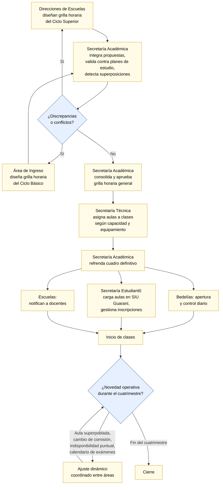

# Capítulo 3. La organización y su operatoria

Este capítulo describe a la facultad y al proceso por el cual, cada
cuatrimestre, se decide qué clase se dicta en qué aula, de modo que
el diagnóstico quede fundado en la operatoria concreta.

## 3.1 FCEIA en detalle

### 3.1.1 Misión, escala y contexto institucional

La Facultad de Ciencias Exactas, Ingeniería y Agrimensura (FCEIA)
es una de las facultades de la Universidad Nacional de Rosario
(UNR). Dicta once carreras de grado (seis ingenierías, tres
licenciaturas y dos profesorados), además de posgrados. Con cientos
de materias y miles de alumnos por cuatrimestre, coordinar su
operatoria académica implica la combinatoria propia de una
organización mediana.

La actividad se ordena en **ciclos lectivos** de dos
**cuatrimestres**. Cada cuatrimestre abre un nuevo escenario de
planificación: qué materias se dictan, con qué comisiones, en qué
horarios y en qué aulas. Este trabajo se ocupa de la última.

### 3.1.2 Sedes: Pellegrini y Centro Universitario Rosario

La FCEIA funciona en dos sedes:

- **Sede Pellegrini** (Avenida Pellegrini 250, Rosario). Es el
  edificio histórico de la facultad, inaugurado en 1929. Aloja el
  Decanato, la administración y las Escuelas de Formación Básica,
  Agrimensura, Ingeniería Industrial, Ciencias Exactas y Naturales,
  y de Posgrado. Concentra la mayor parte del dictado, en
  aulas compartidas por materias de distintas carreras.
- **Centro Universitario Rosario (CUR)** (Riobamba 250 bis). Es un
  predio de la UNR donde la FCEIA tiene edificios propios para las
  Escuelas de Ingeniería Mecánica, Civil, Eléctrica y Electrónica
  y varios laboratorios. Allí se dictan típicamente las materias
  del ciclo superior de esas Escuelas.

La sede importa para la asignación
por dos motivos: un alumno no puede trasladarse instantáneamente de
una sede a otra entre dos clases del mismo día, y algunos
laboratorios existen en una sola sede, de modo que el tipo de aula
que requiere una materia puede determinar dónde se dicta.

### 3.1.3 Tipología de aulas

A los efectos de la asignación, las aulas se agrupan en tres tipos:

- **Aulas teóricas**, para el dictado expositivo, con capacidades
  que van de una veintena a un centenar y medio de alumnos. Entre
  ellas se distinguen los **anfiteatros**, de capacidad
  especialmente alta.
- **Laboratorios**, con equipamiento propio de cada disciplina
  (química, electrónica, informática, ensayo de materiales, entre
  otras). No son intercambiables: cada materia con práctica de
  laboratorio declara cuáles le sirven.
- **Espacios específicos** (talleres, mesas de dibujo), que
  tratamos como variante de alguno de los anteriores.

Cada aula tiene además una **capacidad** (la cantidad máxima de
alumnos que pueden cursar en ella en condiciones adecuadas) y una
**disponibilidad horaria**. Asumimos que las aulas están disponibles
durante toda la jornada de la facultad; las excepciones puntuales
quedan fuera del alcance de este trabajo.

### 3.1.4 Grilla horaria oficial

La facultad divide el día en tres **turnos** (mañana, tarde y noche)
formados por **bloques de 45 minutos**, que son la unidad mínima del
cronograma oficial y el marco común para coordinar carreras y
compartir aulas.

En la práctica, las propuestas de horarios que arman las Escuelas no
siempre respetan esos bloques: aparecen cursadas que no duran
múltiplos de 45 minutos, cortes desfasados y superposiciones que la
grilla no anticiparía. Esta brecha entre la grilla oficial y la real
es una de las fricciones del proceso actual y condiciona parte de la
modelización del capítulo 4.

## 3.2 El proceso actual de asignación de aulas

Con la organización caracterizada, describimos ahora el proceso por
el cual hoy se decide qué clase se dicta en qué aula.

### 3.2.1 Análisis y modelado de procesos como instrumento

Para describir el proceso usamos el **modelado de procesos**
presentado en §2.1.1: representar quién hace qué, cuándo, con qué
insumos y con qué resultados. Entre las notaciones disponibles
(diagramas de flujo, cursogramas, notaciones estandarizadas de procesos) elegimos un diagrama de
flujo simplificado, suficiente para mostrar la estructura del
proceso sin recargar al lector con convenciones.

### 3.2.2 Actores intervinientes

::: revisar
<!-- Sección a cargo de Pablo Galliano (comentario @maguitopg en la revisión del 2026-09-30): se deja tal cual, resaltada para revisar. -->

El proceso actual de asignación no está centralizado en una única
figura sino distribuido entre varias áreas de la facultad. Cada una
opera sobre un tramo del flujo, con sus propias responsabilidades y
sus propios documentos de trabajo. Los actores que intervienen son:

- **Direcciones de Escuelas académicas.** Cada Escuela (Formación
  Básica, Ingeniería Industrial, Ingeniería Mecánica, Ingeniería
  Civil, Ingeniería Eléctrica, Ingeniería Electrónica, Agrimensura,
  Ciencias Exactas y Naturales, entre otras) es responsable de
  diseñar de manera autónoma la grilla horaria de las materias
  específicas del **Ciclo Superior** de sus carreras. Para eso
  analiza la disponibilidad horaria de su cuerpo docente, distribuye
  las comisiones teóricas y prácticas y establece la secuencia de
  dictado.
- **Área de Ingreso.** Planifica en forma paralela las asignaturas
  del **Ciclo Básico** (el tronco común de primer y segundo año de
  las ingenierías: Cálculo, Álgebra, Física y otras materias de
  alta concurrencia). Proyecta la cantidad de comisiones necesarias
  y las distribuye en los tres turnos de la grilla oficial.
- **Secretaría Académica.** Recibe las propuestas de las Direcciones
  de Escuelas y del Área de Ingreso, y lleva a cabo la
  **integración, fiscalización y validación institucional**.
  Consolida la información en una grilla horaria única, verifica el
  cumplimiento de los planes de estudio aprobados, controla que no
  haya solapamientos horarios para un alumno tipo, y que un mismo
  docente no aparezca en dictados simultáneos. Una vez subsanadas
  las discrepancias, aprueba la grilla horaria general.
- **Secretaría Técnica.** Toma como insumo la grilla horaria
  consolidada y el inventario físico de la planta (aulas teóricas,
  laboratorios de informática, talleres pesados, laboratorios de
  ensayo, anfiteatros) y realiza la **asignación de espacios
  físicos a las clases**. Evalúa capacidad nominal y equipamiento,
  buscando que cada aula asignada cubra la cantidad esperada de
  inscriptos y cuente con los recursos técnicos requeridos.
  Confecciona el cuadro definitivo de ocupación y lo remite a la
  Secretaría Académica para su refrendo final.
- **Secretaría Estudiantil.** Gestiona la fase de captura y
  consolidación de la demanda a través del sistema SIU Guaraní.
  Administra los períodos de inscripción a asignaturas y comisiones
  y realiza la carga y actualización final de las aulas asignadas
  en la plataforma.
- **Bedelías.** Reciben la matriz definitiva de horarios y aulas
  para la apertura y control diario de los recintos.
- **Cátedras y docentes.** Definen la modalidad concreta de
  dictado de cada materia (cantidad de comisiones, horarios,
  necesidad de laboratorio) dentro del marco fijado por la Escuela
  y validado por la Secretaría Académica.
- **Alumnos.** Consumen el resultado del proceso: se inscriben a
  comisiones y asisten a las clases en las aulas asignadas.
- **Sistema SIU Guaraní.** Sistema de gestión académica que
  administra la información de alumnos, inscripciones y
  comisiones. Detallado en §3.4.

Vale la pena destacar dos rasgos de esta distribución de actores.
Primero, **la asignación de aulas propiamente dicha es
responsabilidad de la Secretaría Técnica**, pero opera sobre una
grilla horaria consolidada por la Secretaría Académica, que a su
vez es la agregación de propuestas elaboradas de manera autónoma
por las Direcciones de Escuelas y el Área de Ingreso. Segundo, esta
distribución es coherente con el diagnóstico organizacional de
§2.1: las decisiones operativas están **efectivamente
descentralizadas** en el núcleo profesional (Escuelas y cátedras) y
la coordinación central se aplica sobre propuestas ya elaboradas,
no las produce desde cero.
:::

### 3.2.3 Momentos y modalidad del proceso

El proceso tiene dos momentos:

- **Planificación inicial.** Antes del inicio de clases, y en
  general antes de conocer la cantidad final de inscriptos, se arma
  el esquema completo de asignación. Se parte del esquema del
  cuatrimestre anterior y se lo ajusta según los cambios que
  informan las Escuelas, las cátedras y las autoridades académicas.
- **Ajustes dinámicos.** Ya iniciadas las clases, el esquema se
  corrige por inscripciones tardías, materias más numerosas de lo
  previsto, electivas que comunican tarde sus horarios, cambios de
  último momento o necesidades del calendario de exámenes. Cada ajuste se resuelve caso por caso y se
  comunica a Bedelías, al SIU Guaraní y a las cátedras.

En ambos momentos el trabajo es esencialmente **manual**. Las
Escuelas, la Secretaría Académica y la Secretaría Técnica trabajan
sobre planillas de cálculo y se comunican por correo y notas
formales. No hay un sistema de información que reúna restricciones,
disponibilidades y decisiones: la información está repartida en
documentos separados que cada área integra mentalmente al decidir.

### 3.2.4 Diagrama del proceso actual

::: revisar
<!-- Sección a cargo de Pablo Galliano (comentario @maguitopg en la revisión del 2026-09-30): se deja tal cual, resaltada para revisar. -->

El diagrama siguiente resume el flujo operativo con sus principales
actores y responsabilidades. Es una representación simplificada,
elaborada para servir de referencia en las secciones que siguen; su
fidelidad al detalle administrativo concreto no es total pero sí
suficiente para el análisis.

<!-- figura: Proceso actual de planificación de horarios y asignación de aulas -->

```mermaid
flowchart TB
    A0[Direcciones de Escuelas<br/>diseñan grilla horaria<br/>del Ciclo Superior] --> B
    A1[Área de Ingreso<br/>diseña grilla horaria<br/>del Ciclo Básico] --> B
    B[Secretaría Académica<br/>integra propuestas,<br/>valida contra planes de estudio,<br/>detecta superposiciones] --> C{¿Discrepancias<br/>o conflictos?}
    C -->|Sí| A0
    C -->|Sí| A1
    C -->|No| D[Secretaría Académica<br/>consolida y aprueba<br/>grilla horaria general]
    D --> E[Secretaría Técnica<br/>asigna aulas a clases<br/>según capacidad y equipamiento]
    E --> F[Secretaría Académica<br/>refrenda cuadro definitivo]
    F --> G1[Bedelías: apertura<br/>y control diario]
    F --> G2[Secretaría Estudiantil:<br/>carga aulas en SIU Guaraní,<br/>gestiona inscripciones]
    F --> G3[Escuelas:<br/>notifican a docentes]
    G1 --> H[Inicio de clases]
    G2 --> H
    G3 --> H
    H --> I{¿Novedad operativa<br/>durante el cuatrimestre?}
    I -->|Aula superpoblada,<br/>cambio de comisión,<br/>indisponibilidad puntual,<br/>calendario de exámenes| J[Ajuste dinámico<br/>coordinado entre áreas]
    J --> I
    I -->|Fin del cuatrimestre| K[Cierre]

    classDef proc fill:#fffbe6,stroke:#c9a227,color:#000
    classDef dec fill:#e6f0ff,stroke:#4a6fa5,color:#000
    class A0,A1,B,D,E,F,G1,G2,G3,H,J,K proc
    class C,I dec
```
:::

## 3.3 Problemas operativos observados

A partir de la observación del proceso y de las conversaciones con
las áreas de coordinación académica, identificamos tres clases de
problemas.

### 3.3.1 Problemas visibles al alumnado

Son los que se perciben directamente en el aula:

- **Alumnos sin lugar.** En materias masivas o en fechas de examen,
  la asistencia supera la capacidad del aula y parte del alumnado no
  puede cursar.
- **Aulas abarrotadas.** Aun sin superar la capacidad nominal, la
  densidad de alumnos puede degradar la calidad del dictado.
- **Traslado de bancos.** Alumnos y bedeles mueven bancos entre aulas
  para compensar, lo que entorpece los pasillos.
- **Demoras en el inicio de las clases.** Cuando el aula asignada
  resulta inadecuada o no está disponible, la reasignación
  improvisada retrasa el comienzo.

### 3.3.2 Problemas del proceso administrativo

Son los ligados a cómo se lleva adelante la asignación:

- **Alto costo de tiempo.** Las áreas responsables dedican buena
  parte de su tiempo a la asignación inicial y, sobre todo, a los
  ajustes, en desmedro de otras tareas de coordinación.
- **Información no consolidada.** Como los datos están en documentos
  separados, un cambio en una fuente puede pasar inadvertido y
  arrastrar errores a las decisiones posteriores.
- **Efecto cascada.** Un cambio local (mover el horario de una
  materia, abrir una comisión) puede invalidar asignaciones
  aparentemente independientes. Sin una herramienta que evalúe el
  impacto, cada replanificación lleva un tiempo desproporcionado.
- **Falta de trazabilidad.** No queda registro de por qué se asignó
  cada aula a cada clase, lo que dificulta revisar decisiones
  pasadas o repetir buenas soluciones.

### 3.3.3 Problemas estructurales

Por último, hay rasgos propios del problema que el proceso manual no
puede abordar:

- **Naturaleza combinatoria.** Cientos de horarios semanales, decenas
  de aulas de distintos tipos y restricciones de tipo, sede,
  capacidad y no superposición hacen que la cantidad de asignaciones
  posibles crezca de manera explosiva; encontrar a mano la mejor es
  prácticamente imposible.
- **Reglas no formalizadas.** Qué aula puede recibir qué clase o qué
  laboratorios sirven a qué materia son conocimientos compartidos
  que no están escritos en ningún documento; cada decisión descansa
  en la experiencia de quien la toma.
- **Ausencia de indicadores.** No se miden la ocupación, los excesos
  de capacidad, las aulas subutilizadas ni el tiempo insumido en
  reasignaciones, de modo que la discusión sobre el desempeño del
  proceso se apoya en impresiones antes que en datos.

Conviene no exagerar el diagnóstico: el proceso actual **funciona**,
ya que cada cuatrimestre se publica un esquema de asignación y las
clases se dictan. El problema es que funciona **a un costo alto y con
resultados mejorables**, y ambas cosas admiten mejora con las
herramientas adecuadas.

## 3.4 Datos dispersos: cómo viven hoy los datos

Muchos de los problemas anteriores se explican por el estado de los
datos que el proceso consume. En una planta industrial, la
programación de recursos depende de dos documentos básicos: la **lista de
materiales**, que indica qué componentes lleva cada producto, y la
**hoja de ruta**, que indica en qué secuencia y en qué máquinas se
fabrica. En la facultad, los **planes de estudio** cumplen el papel
de la lista de materiales (qué materias componen cada carrera, en
qué orden y con qué correlativas) y las **grillas horarias** el de
la hoja de ruta (qué materia va en qué aula y en qué momento). Si
esos dos documentos no están bien estructurados y consolidados,
cualquier asignación posterior queda comprometida de raíz: con datos
de entrada defectuosos, los resultados también lo son.

### 3.4.1 Las tres fuentes principales

Las áreas involucradas trabajan con información de tres fuentes:

- **Planes de estudio.** Cada carrera publica el suyo, con sus
  materias, su ubicación (año y cuatrimestre), su carga horaria y
  sus correlativas, en resoluciones del Consejo Directivo y en la
  web de la facultad. Cada carrera suele usar **códigos internos
  propios** para identificar sus materias.
- **SIU Guaraní.** Es el sistema de gestión académica común a las
  universidades nacionales argentinas: administra alumnos,
  inscripciones a materias y comisiones, actas de examen y trámites
  conexos. Sus **códigos son propios** y no coinciden con los de los
  planes de estudio.
- **Horarios publicados.** Cada cuatrimestre las cátedras y las
  Escuelas publican los horarios de cursada en planillas y en la
  web. Allí una misma materia puede figurar con **nombres distintos**
  según la carrera (*Análisis Matemático* en una, *Cálculo* en otra)
  sin que ningún documento común declare la equivalencia.

### 3.4.2 Codificación no estandarizada de materias

Las tres fuentes no comparten un identificador estable. Una misma
materia puede tener tres o más nombres (el de cada plan, el del SIU
Guaraní, el del horario publicado) sin una correspondencia formal
entre ellos. Ocurre sobre todo con las **materias comunes**, que
forman parte de varias carreras a la vez; típicamente, las
matemáticas y las físicas de los primeros años.

Hay además casos más graves: **una misma asignatura con más de un
código** en el SIU Guaraní, lo que divide a sus inscriptos en dos o
más grupos e impide conocer la cantidad real de alumnos que van a
cursar. "Métodos Numéricos" e "Introducción a la Optimización", que
pueden compartir un mismo dictado pero figuran como asignaturas
independientes, ilustran el caso.

En consecuencia, cruzar las tres fuentes exige reconstruir a mano
las equivalencias, y un sistema que consuma estos datos sin
depurarlos puede equivocarse de forma concreta: asignar dos aulas chicas donde correspondía una mediana, o
programar una misma clase en dos horarios incompatibles por tomar
sus dos códigos como materias distintas.

### 3.4.3 Codificación no estandarizada de comisiones

::: revisar
<!-- Sección a cargo de Pablo Galliano (comentario @maguitopg en la revisión del 2026-09-30): se deja tal cual, resaltada para revisar. -->

El problema análogo se replica a nivel comisiones. **No existe una
regla unificada** para la asignación del identificador de comisión
dentro de una materia. Las convenciones varían por cuatrimestre y
por materia: en algunas se usan números de una cifra (1, 2, 3),
en otras de tres cifras con patrones específicos (por ejemplo, en
"Cálculo" se usan 110, 120, 130 en el primer cuatrimestre y 510,
520, 530 en el segundo, lógica que no se replica en materias con
comportamiento similar), y en otras se emplea texto libre.

En SIU Guaraní, además, el campo "comisión" es de tipo texto y en
la mayoría de los casos se completa con una abreviación del
nombre de la asignatura (por ejemplo, `Calc1_Mañ`) en lugar de un
identificador estable. Esto transforma al campo en un dato de
utilidad marginal para el cruce automatizado entre la información
académica y la administrativa.

La consecuencia sobre el proceso de asignación es directa: al no
poder asociar con certeza el número real de inscriptos con la
comisión correcta, cualquier estimación de la demanda por comisión
queda comprometida, y el motor de asignación (manual o
automatizado) puede terminar tomando decisiones sobre datos
implícitamente inconsistentes.
:::

### 3.4.4 Digitalización parcial de planes y horarios

Otro foco de fricción es **cómo está publicada la información**. Los
planes de estudio están en la web de la
facultad como **documentos PDF escaneados**, y los horarios de
cursada, como páginas web cuyo formato es difícil de procesar en
forma automática.

Un PDF escaneado es, en la práctica, una imagen: para aprovechar
su contenido hay que transcribirlo a mano o mediante reconocimiento
óptico de caracteres, y en ambos casos se cuelan errores en códigos,
nombres y correlatividades.

A esto se suma la **coexistencia de versiones**: sin una base
centralizada de planes de estudio, la misma información vive en
distintos soportes (el PDF en la web, la planilla de la Escuela, la
memoria institucional) sin garantía de que coincidan. Una grilla
armada sobre una versión desactualizada puede violar la
reglamentación académica vigente sin que nadie lo advierta.

### 3.4.5 Inventario incompleto de aulas

Del lado del recurso pasa algo análogo: el inventario de aulas tiene
información **incompleta o desactualizada** sobre capacidades reales
y equipamiento. Aulas sin dato de capacidad, equipamiento declarado
que ya no existe o aulas nuevas sin relevar comprometen cualquier
asignación hecha sobre esos datos.

Si el inventario no está bien relevado, incluso el mejor método de
asignación produce soluciones correctas en los papeles pero
inviables en la práctica.

### 3.4.6 Conceptos coloquialmente definidos

Por último, muchos de los conceptos que estructuran el proceso
tienen definiciones coloquiales pero no formales. Todos saben, en
general, qué es una **clase**, una **comisión**, un **dictado** o un
**plan de cursada**, pero en el detalle aparecen diferencias: dos
clases de la misma materia el mismo día pueden contarse como una o
como dos, y una comisión puede entenderse como una lista de alumnos,
como un conjunto de horarios o como ambas cosas. Dos personas que discuten
cuántas clases se dictan por semana pueden estar contando cosas
distintas sin saberlo.

Esta dispersión conceptual es la contracara de la dispersión de los
datos. Fijar un **lenguaje ubicuo** sobre estas entidades (en el
sentido de Evans, §2.2) es condición necesaria para que la
asignación deje de depender de conciliaciones informales, y es el
trabajo que encara el capítulo 5.

## 3.5 Recapitulación

De este capítulo retomamos cuatro puntos:

1. **La FCEIA es una organización compleja**, con dos sedes, muchas
   carreras y aulas heterogéneas; el modelo tiene que representar
   sedes, tipos de aula y compatibilidades.
2. **La asignación es hoy manual**: se logra con un alto costo de
   tiempo, con dificultad para replanificar y sin trazabilidad.
3. **Los problemas son de tres tipos** (del alumnado, del proceso
   administrativo y estructurales); los dos primeros pueden
   mitigarse con un sistema adecuado, el tercero exige además un
   modelo formal.
4. **Los datos están dispersos y codificados sin criterio común**, y
   varios conceptos carecen de definiciones compartidas: definirlos
   con precisión es condición previa a cualquier automatización.

El capítulo siguiente toma esta operatoria y la formaliza como
problema, con el vocabulario de la investigación de operaciones
presentado en §2.3.
