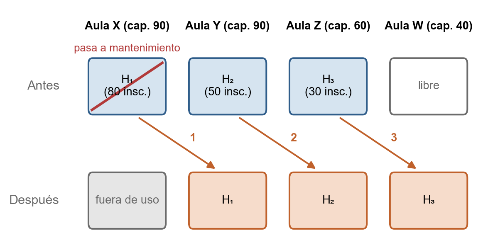

## 3.4 Definición del problema

La sección 3.3 describió cómo se asignan hoy las aulas en la FCEIA:
quién decide, cuándo, con qué información y con qué resultado. Esta
sección traduce esa descripción a un enunciado preciso, en el marco
de la investigación de operaciones presentado en §3.2.3, de modo que
más adelante pueda modelarse como un programa lineal entero sin
sorpresas. Para eso fijamos qué datos tenemos, qué decidimos, qué
reglas debe respetar la decisión y con qué criterio se compara una
asignación con otra.

### 3.4.1 Formulación coloquial

::: revisar
<!-- Sección a cargo de Pablo Galliano (comentario @maguitopg en la revisión del 2026-09-30): se deja tal cual, resaltada para revisar. -->

Antes de pasar a la formulación formal, conviene contar el problema
tal como se lo plantean cada cuatrimestre las Escuelas, la Secretaría
Académica y la Secretaría Técnica. Nos va a servir de referencia:
cuando más adelante el problema esté escrito con símbolos, vamos a
poder volver acá y comprobar que no se perdió nada en el camino.

Al empezar el cuatrimestre, la Secretaría Técnica tiene dos listas en
la mano. Por un lado, las **clases** que hay que dictar cada semana,
con su día y su horario: la grilla que la Secretaría Académica armó a
partir de lo que propusieron las Escuelas. Por otro, las **aulas**
disponibles, cada una con su tipo y su capacidad. El trabajo es
decidir en qué aula va cada clase sin romper ninguna regla:

- dos clases que se dictan a la misma hora no pueden compartir aula;
- el aula tiene que servir para ese tipo de clase (un laboratorio,
  por ejemplo, necesita un laboratorio compatible);
- el aula tiene que tener un tamaño razonable para la cantidad de
  alumnos;
- cada materia tiene que completar las horas de teoría y de
  laboratorio que declara;
- cada clase tiene que dictarse en una sede admitida para su materia.

Y entre todas las formas de repartir las aulas que cumplen esas
reglas, se busca la que mejor las aprovecha: que nadie se quede sin
lugar y que no se gaste un aula grande en una clase chica.

Así contado parece poco, pero ya están todas las piezas del problema:
hay cosas que se asignan (las clases) y lugares donde asignarlas (las
aulas), una decisión que tomar, reglas que esa decisión tiene que
respetar y un criterio para elegir entre dos soluciones que las
respetan. Las secciones que siguen le ponen nombre y límites precisos
a cada una.
:::

### 3.4.2 Encuadre: el problema como asignación de recursos bajo restricciones

#### 3.4.2.1 Qué es un problema de asignación de recursos

La investigación de operaciones estudia una familia de problemas,
los **problemas de asignación de recursos bajo restricciones**, que
sirve de marco general para situaciones como la descripta. Es una
herramienta habitual del ingeniero porque permite formalizar con un
mismo esquema problemas en apariencia muy distintos: turnos
hospitalarios, mantenimiento de flotas, programación de la
producción. Todos se caracterizan por:

- Un conjunto de **entidades demandantes** que necesitan consumir
  recursos (tareas, personas, mercadería, clases).
- Un conjunto de **recursos disponibles**, típicamente escasos
  (máquinas, salas, camiones, aulas).
- **Reglas de compatibilidad y restricción** que determinan qué
  asignaciones son admisibles (esta persona no puede estar en dos
  salas a la vez, esta aula no es apta para química).
- Uno o más **criterios de calidad** que permiten decidir cuál de
  dos asignaciones admisibles es mejor (menor costo, mejor
  aprovechamiento, mayor cobertura).

Lo que cambia de un caso a otro son las entidades concretas y las
reglas específicas; la estructura lógica es la misma. Esta familia
admite formulaciones matemáticas estándar, en particular como
programas lineales enteros (§3.2.3), de modo que encuadrar en ella la
asignación de aulas nos permite aprovechar métodos ya desarrollados
en lugar de inventarlos desde cero.

#### 3.4.2.2 Ubicación del problema de asignación de aulas dentro de la familia

La Tabla @tab:familia muestra cómo se instancia cada elemento del marco en
nuestro problema.

<!-- tabla: Ubicación del problema dentro de la familia de problemas de asignación {#tab:familia} -->
| Elemento del marco | Instancia en nuestro problema |
| --- | --- |
| Entidades demandantes | **Horarios semanales de clase**: cada franja recurrente de dictado de una comisión, en un día y un rango horario, necesita un aula. |
| Recursos disponibles | **Aulas** de la FCEIA, en sus distintas tipologías, con sus capacidades y sedes. |
| Restricciones | Compatibilidad entre tipo de aula y tipo de clase; no simultaneidad en la misma aula; sedes admisibles; carga horaria de teoría y de laboratorio de cada materia; horario de funcionamiento de la facultad. |
| Criterio de calidad | Equilibrio entre **no dejar alumnos afuera** y **no desperdiciar capacidad**. |

La formulación matemática concreta (variables, restricciones y
función objetivo) queda para la sección 3.8.

### 3.4.3 Elementos del problema

#### 3.4.3.1 La entidad demandante: el horario semanal

La unidad sobre la que se decide no es cada clase con su fecha, sino
el **horario semanal**: la franja que se repite todas las semanas
del cuatrimestre en el mismo día y rango horario. Un horario semanal
corresponde a una comisión de una materia, tiene un día, una hora de
inicio y una de fin, y es de teoría o de laboratorio (tipo que puede
venir fijado por el cronograma o quedar por decidir). La sección 3.5
formaliza esta noción. De acá en adelante usamos indistintamente *clase* y *horario*: en este sistema, que no trabaja con fechas, son lo mismo.

La elección es una cuestión de economía: un cuatrimestre tiene
cientos de horarios semanales pero miles de clases con fecha. Como
el patrón se repite, resolver una vez por horario equivale a
resolver una vez por clase, con un modelo mucho más chico.

Como la facultad no tiene una grilla común (§3.3.1.4), el sistema la
impone: los horarios deben empezar y terminar en múltiplos de una
granularidad configurable (por defecto, 15 minutos) y caer dentro de
la franja operativa de la semana (de 7 a 23, de lunes a sábado).
Encuadrar los horarios en una grilla evita choques por unos pocos
minutos entre clases que, de otro modo, podrían compartir aula, y
reduce el riesgo de que el problema resulte infactible por esa sola
razón. Los horarios que no respetan la grilla se señalan al validar
el cronograma y se pueden ajustar automáticamente.

#### 3.4.3.2 El recurso: el aula

El **aula** es el recurso que se asigna. Cada aula pertenece a una
**sede** (Pellegrini o la Siberia), tiene un
**tipo** dentro de la tipología de §3.3.1.3 (aula teórica,
laboratorio, anfiteatro) y una **capacidad**, es decir, la cantidad
máxima de alumnos que alberga en condiciones adecuadas.

Asumimos que las aulas están disponibles durante todo el horario de
funcionamiento de la facultad, típicamente de 8 a 23 h. Las
indisponibilidades por exámenes, actos, refacciones o reservas
externas quedan fuera del alcance (§3.4.6).

#### 3.4.3.3 La decisión: la asignación

La decisión es una **asignación** que empareja cada horario semanal
del cuatrimestre con exactamente un aula. Tiene dos rasgos que
conviene destacar. Es **acoplada**: como un aula recibe varios
horarios que no se superponen, decidir sobre un horario condiciona
a los demás, y no se puede resolver horario por horario en forma
independiente. Y es **discreta**: cada horario está o no está en
cada aula, sin gradaciones. Ambos rasgos la ubican en el terreno de
la programación lineal entera (§3.2.3).

### 3.4.4 Restricciones

Las restricciones son las reglas que toda asignación debe respetar.
En §3.2.3.5 distinguimos las restricciones **duras**, cuyo
incumplimiento descarta la solución, de las **blandas**, que se
pueden violar a cambio de una penalización. Acá las enunciamos en
términos del dominio; su expresión matemática se desarrolla en la
sección 3.8.

#### 3.4.4.1 Restricciones estructurales

Reflejan la naturaleza física del problema y no admiten
negociación:

- **Un aula por horario.** Cada horario semanal recibe exactamente
  un aula: ni queda sin aula ni ocupa dos.
- **Sin superposición en un aula.** Dos horarios que coinciden en
  algún momento de la semana no pueden compartir aula. Es la regla
  que acopla el problema.
- **Compatibilidad de tipo.** Una clase teórica va a un aula teórica
  o a un anfiteatro; una clase de laboratorio, a un laboratorio
  apto para esa materia, según el equipamiento que la cátedra
  declara necesario.
- **Horario de funcionamiento.** Ningún horario puede quedar fuera
  de la franja en que opera la facultad; si alguno se carga por
  error, el sistema lo rechaza antes de asignar.

#### 3.4.4.2 Restricciones de política institucional

No responden a límites físicos sino a decisiones de la facultad:

- **Sedes admisibles.** Las materias se agrupan según un criterio
  común (ciclo básico de las ingenierías, bloque troncal de
  ingeniería, materias comunes de licenciaturas y profesorados,
  materias específicas de cada carrera) y cada grupo tiene sus
  sedes admisibles. Las excepciones, típicamente laboratorios que
  sólo existen en una sede, se tratan con reglas puntuales
  (sección 3.5).
- **Carga horaria.** Las horas semanales de teoría y de laboratorio
  de cada comisión deben coincidir con las que fija el plan de
  estudios para la materia.
- **Trayectorias académicas.** Las materias del mismo año y
  carrera, que un alumno cursaría en paralelo, no deben
  superponerse. Como cada alumno cursa una sola comisión por
  materia, alcanza con que exista al menos una combinación de
  comisiones compatible.
- **Traslados entre sedes.** Dos clases consecutivas del mismo día,
  de materias que cursa un mismo alumno (las del mismo año de una
  carrera), no pueden dictarse en sedes distintas si el intervalo
  entre ellas es menor a un margen (por defecto, 30 minutos), porque
  el traslado entre Pellegrini y la Siberia deja de ser viable.
- **Una sede por comisión.** Opcionalmente, todos los horarios de
  una comisión se dictan en la misma sede, para que el docente no
  tenga que trasladarse durante la semana.
- **Cursada posible.** Para cada carrera, año y cuatrimestre debe
  existir al menos una combinación de comisiones, una por materia
  obligatoria, que un alumno pueda cursar sin superposiciones ni
  traslados imposibles. El sistema la verifica antes de asignar.

La facultad enuncia además dos políticas que este trabajo no
incorpora como restricciones del modelo y que se retoman en §3.4.6:
que los ingresantes no cambien de sede dentro de un mismo día de
cursada, para facilitar su adaptación, y que durante los períodos
de exámenes se puedan generar variantes transitorias de la
asignación sin perder la de base.

#### 3.4.4.3 Restricciones que expresan preferencias operativas

Son las reglas que la facultad prefiere ver cumplidas pero que
puede tolerar violar cuando no queda alternativa, es decir,
restricciones blandas:

- **Capacidad suficiente.** El aula debería alojar a todos los
  inscriptos esperados. Como la inscripción sigue abierta después
  del inicio de clases, ese número es una estimación, y el sistema
  debe poder asignar aun cuando algún horario quede sobreocupado.
- **Aulas no desaprovechadas.** Poner 30 alumnos en un anfiteatro
  para 200 es admisible pero indeseable: se penaliza, con menos
  peso que la sobreocupación, para reservar las aulas grandes a
  quienes las puedan necesitar a futuro y no asignarlas innecesariamente a clases que no las aprovechen.

### 3.4.5 Criterio de calidad

Entre las asignaciones **admisibles**, las que respetan todas las
restricciones duras, hay que elegir la **mejor**. El criterio se
arma con dos magnitudes calculadas para cada horario:

- **Sobreocupación**: inscriptos esperados que exceden la capacidad
  del aula.
- **Subocupación**: lugares vacíos por debajo de un umbral mínimo
  de aprovechamiento.

Se busca minimizar la suma ponderada de ambas a lo largo de todos
los horarios, con una ponderación **asimétrica**: dejar alumnos
afuera es peor que dejar bancos vacíos. Los pesos son parámetros
configurables y se presentan en la sección 3.8.

Tratar la capacidad como restricción blanda es una decisión
deliberada. Si fuera dura, bastaría con una comisión mal
pronosticada para que el problema no tuviera solución; como blanda,
el sistema siempre propone una asignación, señalando la
sobreocupación, que las áreas responsables pueden ajustar luego con
información más precisa.

### 3.4.6 Alcance y no-alcance

#### 3.4.6.1 Dentro del alcance

- La asignación de aulas al **patrón semanal** de cada cuatrimestre
  de la FCEIA, respetando las restricciones de §3.4.4 y optimizando
  el criterio de §3.4.5.
- El **diagnóstico previo**: detectar y comunicar cuándo el problema
  no tiene solución por razones estructurales, antes de resolverlo
  (§3.2.4 y sección 3.8).
- La **reasignación durante el cuatrimestre** cuando cambian las
  comisiones o los horarios, conservando las decisiones que las
  áreas responsables quieran mantener.
- El **registro de cada asignación** realizada, con sus parámetros
  y su resultado, para poder rastrearla.

#### 3.4.6.2 Fuera del alcance

- **Cambios para una fecha puntual**, como una clase que un martes
  determinado se muda de aula sin alterar el patrón semanal.
- **Indisponibilidades temporales de aulas** por exámenes, actos,
  refacciones o uso de otras dependencias.
- **Mesas de examen**, que son un proceso distinto, con sus propias
  reglas y actores.
- **Estabilidad de sede para ingresantes**, que requiere modelar la
  cursada típica de primer año y queda como línea de continuación.
- **Otros recursos** que la facultad coordina, como proyectores,
  personal auxiliar o salas de reunión.
- **Pronóstico de inscripción** a partir del historial: el sistema
  recibe los inscriptos esperados como dato.
- **Coordinación entre cuatrimestres**: cada uno se resuelve por
  separado y las materias anuales se manejan operativamente.

### 3.4.7 Naturaleza combinatoria y efecto cascada

#### 3.4.7.1 Naturaleza combinatoria

Un cuatrimestre de la FCEIA involucra varios cientos de horarios
semanales y varias decenas de aulas. En el primer cuatrimestre de
2026, por ejemplo, hay aproximadamente 546 horarios presenciales semanales y 53 aulas. Si
cualquier combinación fuera admisible, cada horario podría ir a
cualquiera de las 53 aulas, y la cantidad de asignaciones posibles
sería `53^546`: un número
de más de 900 cifras. Para dar una idea, la cantidad de átomos del
universo observable se estima en un número de unas 80 cifras.
Ninguna enumeración exhaustiva puede recorrer algo así.

El programa lineal de ese mismo cuatrimestre (sección 3.8) tiene
13.697 variables, de las cuales 12.429 son binarias (casi todas
indican si un horario va a un aula compatible), y 6.952
restricciones. Es un modelo imposible de resolver a mano, pero de un
tamaño que un resolutor moderno maneja sin problemas: la corrida de
ese cuatrimestre tardó menos de un minuto.

Las restricciones de §3.4.4 descartan la mayoría de esas
combinaciones, pero lo que queda sigue siendo demasiado para
explorarlo a mano. Es el argumento cuantitativo detrás de lo
afirmado en §3.3.3.3: la asignación óptima manual está fuera del
alcance humano. La programación lineal entera (§3.2.3.2) está pensada
justamente para estos casos: la técnica de ramificación y acotación
descarta subconjuntos enteros de soluciones sin recorrerlas una por
una.

#### 3.4.7.2 Efecto cascada

El segundo aspecto, ligado a lo observado en la sección 3.3, es el
**efecto cascada**: un cambio local puede obligar a reajustar
muchas asignaciones en apariencia independientes. Supongamos que un
aula deja de estar disponible, por ejemplo porque entra en
mantenimiento, y que el horario que tenía asignado sólo entra en
aulas que ya están ocupadas en esa franja. Para ubicarlo hay que
desplazar a otro horario, que a su vez necesita un aula libre, y así
sucesivamente, como muestra la Figura @fig:cascada. Cuanto
menos holgura de aulas libres haya en cada franja, más larga puede
ser la cadena.

{#fig:cascada width=13cm}

Por eso replanificar no es sólo atender el cambio puntual: hay que
verificar que todo el resto siga siendo consistente. Un sistema con
un modelo formal recalcula la cascada completa en segundos, mientras
que una persona la resuelve por aproximaciones sucesivas y con
riesgo de inconsistencias.

### 3.4.8 Recapitulación

El problema queda definido como una asignación de horarios semanales
a aulas bajo restricciones duras y blandas, combinatoriamente grande y
con efecto cascada. La sección siguiente construye sobre esta
definición el modelo del dominio.
