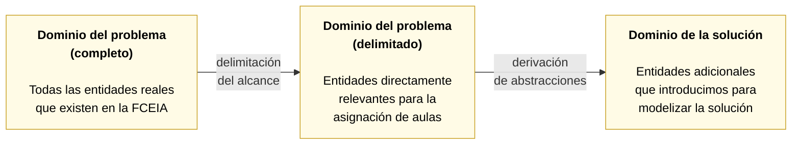
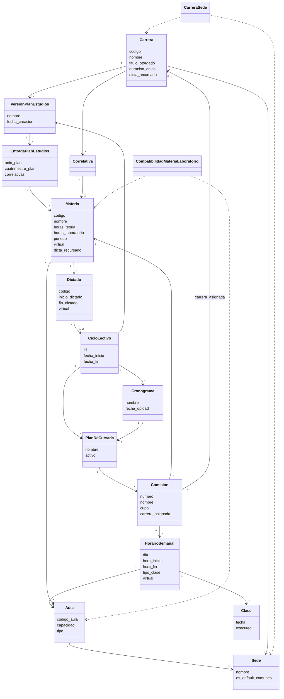

# Capítulo 5. El modelo conceptual

En los capítulos 3 y 4 la operatoria y el problema quedaron descritos
al nivel de "qué se hace y qué hay que decidir". Este capítulo da el
próximo paso: identificar y definir de manera explícita las entidades
del dominio, sus relaciones y las reglas de negocio que las
gobiernan. Se trabaja acá sobre el primer eslabón de la cadena
introducida en §2.5.1: el **modelo conceptual del dominio**. La
traducción a un esquema de datos concreto queda para el capítulo 6, y
el uso de estas entidades como piezas del programa lineal, para el
capítulo 8.

El objetivo es doble. Por un lado, fijar de una vez un **lenguaje
ubicuo** (en el sentido de Evans, §2.2) que se sostenga después a lo
largo del informe y del código: los términos que aparezcan en este
capítulo son los mismos que van a aparecer en la interfaz del sistema,
en el código y en las próximas secciones. Por otro, hacer explícitas
las **reglas de negocio** que la operatoria de FCEIA aplica en la
práctica y que hoy viven mayormente en el criterio de las personas.

## 5.1 Enfoque metodológico: modelado en capas

Antes de enumerar entidades conviene explicar cómo las vamos a
seleccionar. La motivación viene de una observación práctica: una
facultad como la FCEIA tiene muchas entidades (alumnos, profesores,
inscripciones, exámenes, actas, calendarios, autoridades, aulas,
materias, comisiones) pero no todas son igualmente relevantes para
el problema que este trabajo aborda. Modelizar sin filtrar produce
diagramas grandes y de baja densidad informativa; filtrar sin
justificar deja al lector sin poder reconstruir por qué ciertas
entidades quedaron dentro y otras afuera.

Aplicamos el enfoque de modelado en **tres capas**, tomado del propio
proceso de diseño de este proyecto:

**Capa 1: dominio del problema completo.** Todas las entidades que
existen realmente en la vida de la facultad. Se listan brevemente
para reconocerlas y para justificar después su inclusión o exclusión.

**Capa 2: dominio del problema delimitado.** Subconjunto de la capa
anterior que resulta directamente relevante para el problema de
asignación de aulas, con las razones de la delimitación explícitas.
Es el vocabulario mínimo con el que se puede describir el problema
sin recortarlo.

**Capa 3: dominio de la solución.** Entidades que no existen en la
realidad de FCEIA como objetos independientes pero que introducimos
en el modelo para poder resolver el problema de manera limpia. Son
abstracciones útiles al software, no descripciones adicionales del
mundo. Su rol es hacer más manejable la complejidad, típicamente
transformando relaciones muchos-a-muchos entre entidades del dominio
en dos relaciones uno-a-muchos a través de una entidad intermedia.

Cada sección siguiente identifica claramente en qué capa vive cada
entidad.

## 5.2 Entidades del dominio del problema

### 5.2.1 Dominio completo

Un inventario abreviado de la capa 1 alcanza para el contexto de
este trabajo:

- **Alumno**: estudiante inscripto en la facultad, con legajo y datos
  personales.
- **Profesor**: docente de la facultad, responsable de dictar clases.
- **Carrera**: programa académico de grado que se cursa en la
  facultad.
- **Materia**: asignatura académica que forma parte de una o más
  carreras.
- **Comisión**: agrupamiento de alumnos que cursan una materia
  juntos, típicamente en un horario común y con un docente asignado.
- **Clase**: instancia concreta de dictado, en un día y horario
  específicos.
- **Aula**: espacio físico donde se dictan las clases.
- **Sede**: edificio de la facultad que agrupa aulas.
- **Inscripción**: vínculo entre un alumno y una comisión que
  formaliza su intención de cursar.
- **Asistencia**: registro de la presencia efectiva de un alumno en
  una clase.
- **Plan de estudios**: documento que ordena las materias de una
  carrera con su año y cuatrimestre sugeridos y sus correlativas.
- **Ciclo lectivo**: cuatrimestre de operación académica.
- **Cronograma**: publicación cuatrimestral con los horarios de las
  materias.

### 5.2.2 Delimitación al problema

El problema de asignación de aulas, tal como quedó definido en el
capítulo 4, se puede formular usando únicamente un subconjunto de
las entidades anteriores. Recorremos la lista y justificamos qué
queda dentro y qué queda fuera.

**Entidades que quedan fuera del alcance**:

- **Alumno** e **inscripción**: la asignación decide sobre horarios
  y aulas, no sobre alumnos individuales. Lo que importa del alumnado
  es su cantidad esperada por comisión, no cada alumno como entidad.
- **Profesor**: no afecta capacidad ni disponibilidad de aulas. La
  asignación de docentes a comisiones es un problema paralelo, con
  sus propias reglas, y no se aborda en este trabajo.
- **Asistencia**: es una consecuencia observable del sistema, no una
  entrada del proceso de asignación.

**Entidades que quedan dentro del alcance**:

- **Materia**, **carrera** y **plan de estudios**: definen qué se
  dicta y con qué requerimientos. La carrera y el plan importan para
  las restricciones de sede admisible, la carga horaria y la
  identificación de materias comunes.
- **Comisión**: define grupos de dictado. La asignación se aplica a
  los horarios de comisiones, no a materias sueltas.
- **Aula** y **sede**: los recursos que se asignan.
- **Ciclo lectivo**: contextualiza temporalmente el escenario de
  asignación.
- **Cronograma**: entrada del proceso; contiene los horarios que hay
  que asignar.
- **Clase**: presente en la capa conceptual, aunque en la
  implementación tiene un rol acotado (ver §5.4).

## 5.3 Definiciones formales de las entidades

Presentamos ahora una a una las entidades del dominio delimitado y
del dominio de la solución. Para cada una fijamos: nombre, capa,
definición formal, atributos principales y relaciones con otras
entidades. La notación es puramente prosa y tablas; el diagrama UML
que resume el conjunto viene en §5.6.

### 5.3.1 Sede

**Capa**: dominio del problema (completo y delimitado).

**Definición**: espacio edilicio de la facultad en el que se ubican
aulas. Cada sede está identificada por su nombre.

**Atributos principales**: nombre; marca opcional que la señala como
*sede predeterminada para materias comunes* (ver §5.5.3).

**Relaciones**: una sede contiene muchas aulas; una sede puede estar
habilitada por muchas carreras.

### 5.3.2 Aula

**Capa**: dominio del problema (completo y delimitado).

**Definición**: espacio físico habilitado para el dictado de clases,
perteneciente a una única sede.

**Atributos principales**: identificador, nombre o código
identificable por el usuario, capacidad, tipo (teórica, laboratorio,
anfiteatro, práctica), descripción.

**Relaciones**: cada aula pertenece a exactamente una sede.

### 5.3.3 Carrera

**Capa**: dominio del problema (completo y delimitado).

**Definición**: programa académico de grado o tecnicatura que la
facultad ofrece. Cada carrera está identificada por un código
institucional.

**Atributos principales**: código, nombre, título otorgado, duración
en años, cantidad de materias del plan, flag que indica si la carrera
dicta recursado (ver §5.5.4).

**Relaciones**: cada carrera tiene una o más versiones de plan de
estudios; cada carrera puede tener habilitadas varias sedes para el
dictado de sus materias.

### 5.3.4 Materia

**Capa**: dominio del problema (completo y delimitado).

**Definición**: asignatura académica del catálogo de la facultad,
independiente de la carrera. Una misma materia puede formar parte de
los planes de varias carreras.

**Atributos principales**: código, nombre, código en SIU Guaraní
(cuando difiere del código del plan), cupo, horas semanales totales,
horas de teoría, horas de laboratorio, periodo (cuatrimestral o
anual), marca de virtualidad, marca de optatividad, override de
recursado (ver §5.5.4).

**Relaciones**: una materia aparece en uno o más planes de estudios
mediante la entidad *plan de estudios* (§5.3.6); una materia puede
declarar compatibilidad con uno o más laboratorios específicos.

### 5.3.5 Plan de estudios (versión)

**Capa**: dominio del problema (delimitado).

**Definición**: versión formal del plan de estudios de una carrera.
Se modela como entidad separada de la carrera para permitir el
versionado: una misma carrera puede tener conviviendo varias
versiones activas del plan (por ejemplo, un "Plan Original" para
alumnos avanzados y un "Plan 2025" para los ingresantes recientes).

**Atributos principales**: identificador, carrera a la que
pertenece, nombre de la versión, descripción, fecha de creación.

**Relaciones**: cada versión de plan pertenece a exactamente una
carrera; una versión contiene muchas entradas de plan de estudios
(§5.3.6); una versión puede estar asociada a uno o más ciclos
lectivos.

### 5.3.6 Entrada de plan de estudios

**Capa**: dominio de la solución.

**Definición**: relación entre una versión de plan y una materia,
que registra la ubicación curricular de esa materia en esa versión.
Esta entidad resuelve la relación muchos-a-muchos entre carreras (a
través de versiones) y materias, aportando al vínculo los atributos
que dependen del plan puntual: año, cuatrimestre y correlativas.

**Atributos principales**: identificador, versión de plan, materia,
carrera (denormalizada desde la versión), año del plan, cuatrimestre
del plan, texto de correlativas.

**Relaciones**: cada entrada vincula exactamente una versión de plan
con exactamente una materia.

### 5.3.7 Correlativa

**Capa**: dominio de la solución.

**Definición**: relación de precedencia entre dos materias dentro de
una carrera. Si la materia B tiene como correlativa a la materia A,
entonces A debe haberse cursado (según reglas del plan) antes que B.

**Atributos principales**: carrera, materia, materia correlativa.

**Relaciones**: cada correlativa referencia a una carrera y a dos
materias.

Cabe notar que las correlativas son parte del modelo pero no
intervienen directamente en la asignación de aulas; su utilidad
principal en el sistema es la validación de factibilidad para el
alumno tipo de una carrera y año.

### 5.3.8 Ciclo lectivo

**Capa**: dominio del problema (delimitado).

**Definición**: período académico operativo. En FCEIA cada año
lectivo se divide en dos cuatrimestres; cada uno de esos
cuatrimestres es un ciclo.

**Atributos principales**: identificador (por ejemplo "2025-2C"),
nombre, fecha de inicio, fecha de fin, descripción.

**Relaciones**: un ciclo se vincula con una o más versiones de plan
de estudios (indicando qué planes están activos ese cuatrimestre);
un ciclo alberga uno o más cronogramas cargados y uno o más planes
de cursada (§5.3.13).

### 5.3.9 Dictado

**Capa**: dominio de la solución.

**Definición**: oferta efectiva de una materia en el marco de un
ciclo determinado. Vincula una materia con uno o dos ciclos
(cuatrimestral o anual) y captura la modalidad concreta de dictado
para ese período: si se ofrece o no, si es virtual sólo para ese
ciclo, cuándo empieza y cuándo termina.

**Atributos principales**: identificador, materia, código legible
del dictado (por ejemplo "MAT101-2025-2C"), fecha de inicio, fecha
de fin, marca de virtualidad puntual (§5.5.2).

**Relaciones**: cada dictado pertenece a una única materia y se
vincula con uno o más ciclos.

La existencia de la entidad *dictado* obedece a que la relación
"materia dictándose en un ciclo" no es una simple pertenencia sino
un objeto con atributos propios (fechas concretas, modalidad,
virtualidad puntual) que la materia y el ciclo no aportan por
separado.

### 5.3.10 Comisión

**Capa**: dominio del problema (delimitado).

**Definición**: grupo de estudiantes que cursan una materia con un
mismo esquema horario semanal. Una materia dictada en un ciclo
puede tener una o varias comisiones; cada comisión se identifica
por un número secuencial dentro de la materia.

**Atributos principales**: identificador, número, nombre legible,
cupo, materia a la que pertenece, plan de cursada al que pertenece,
carrera asignada (opcional, para override de sede por comisión).

**Relaciones**: cada comisión pertenece a exactamente una materia y
a un plan de cursada; una comisión agrupa uno o más horarios
semanales.

### 5.3.11 Horario semanal

**Capa**: dominio de la solución.

**Definición**: franja horaria recurrente en la que se dicta una
comisión durante un cuatrimestre. Un horario semanal identifica
día de la semana, hora de inicio y hora de fin, y forma parte de
una única comisión. Es la unidad sobre la que se decide la
asignación de aulas (según se justificó en §4.3.1).

**Atributos principales**: identificador, comisión, código de
materia (denormalizado), día, hora de inicio, hora de fin, tipo de
clase (teórica o laboratorio), marca de virtualidad puntual
opcional, aula asignada (nullable).

**Relaciones**: cada horario pertenece a exactamente una comisión.
Cuando resulta de la asignación, tiene además un aula.

### 5.3.12 Cronograma

**Capa**: dominio del problema (delimitado).

**Definición**: conjunto de horarios de dictado cargado como entrada
del proceso, típicamente proveniente de un archivo Excel entregado
por la coordinación cuatrimestre a cuatrimestre. Es el material
crudo del que se derivan las comisiones y horarios del plan de
cursada.

**Atributos principales**: identificador, nombre, ciclo, fecha de
carga, nombre del archivo fuente.

**Relaciones**: un cronograma pertenece a un ciclo y contiene una o
más entradas de cronograma; cada entrada es una fila normalizada del
archivo.

### 5.3.13 Plan de cursada

**Capa**: dominio de la solución.

**Definición**: escenario concreto de planificación para un ciclo.
Incluye la lista completa de comisiones que se van a abrir, sus
horarios semanales y (una vez corrido el asignador) las aulas
asignadas. Un ciclo puede tener varios planes de cursada
(típicamente para comparar escenarios alternativos), pero sólo uno
activo por vez.

**Atributos principales**: identificador, nombre, descripción,
ciclo, cronograma del que fue generado, marca de plan activo.

**Relaciones**: un plan de cursada pertenece a un ciclo; contiene
todas las comisiones y horarios del cuatrimestre planificado; nace
a partir de un cronograma.

### 5.3.14 Clase

**Capa**: dominio del problema (completo) y dominio de la solución.

**Definición**: instancia concreta de dictado en una fecha
específica del calendario. Nace por expansión de un horario semanal
sobre el rango de fechas del ciclo.

**Atributos principales**: identificador, horario del que deriva,
fecha, hora de inicio, hora de fin, aula (heredada del horario),
marca de ejecución.

**Relaciones**: cada clase deriva de un horario semanal y pertenece
por herencia a la misma comisión y al mismo plan.

En la versión actual del sistema, la entidad *clase* tiene un rol
principalmente informativo: el asignador de aulas decide a nivel
del horario semanal, no de la clase puntual, y las clases heredan
la asignación del horario. La entidad se mantiene para preservar la
posibilidad futura de excepciones por fecha y para reflejar el
calendario efectivo.

### 5.3.15 Compatibilidad materia-laboratorio

**Capa**: dominio de la solución.

**Definición**: relación que declara cuáles laboratorios (aulas de
tipo laboratorio) son técnicamente aptos para dictar la parte de
laboratorio de una materia. Por ejemplo, una materia con contenido
de electrónica declara compatibles a los laboratorios que cuentan
con instrumental de electrónica.

**Atributos principales**: materia, aula (con restricción a tipo
laboratorio).

**Relaciones**: cada entrada vincula una materia con un laboratorio
compatible. Una materia puede declarar cero, uno o varios
laboratorios compatibles; a la inversa, un laboratorio puede ser
compatible con varias materias.

### 5.3.16 Carrera-sede

**Capa**: dominio de la solución.

**Definición**: relación que declara qué sedes están habilitadas
para el dictado de las materias de una carrera. Interviene en la
restricción R10 del programa lineal, que se define formalmente en
el capítulo 8.

**Atributos principales**: carrera, sede.

**Relaciones**: cada entrada vincula una carrera con una sede
habilitada. Una carrera puede tener una o varias sedes habilitadas.

## 5.4 Relaciones y multiplicidades

La modelización del capítulo se apoya en unas pocas categorías de
relaciones que conviene explicitar antes de mirar el diagrama
completo. En §2.4.4 dijimos que los grafos bipartitos son la
herramienta natural para las relaciones muchos-a-muchos; el
diagnóstico del modelo ER de partida (§3.4) muestra que en el
dominio de la asignación de aulas estas relaciones son la norma más
que la excepción.

### 5.4.1 Relaciones simples

Son relaciones uno-a-uno o uno-a-muchos que no requieren tratamiento
especial en el modelo:

- Sede tiene muchas aulas; cada aula pertenece a exactamente una
  sede.
- Ciclo lectivo tiene uno o más cronogramas cargados; cada cronograma
  pertenece a un único ciclo.
- Ciclo lectivo tiene uno o más planes de cursada; cada plan de
  cursada pertenece a un único ciclo.
- Comisión tiene uno o más horarios semanales; cada horario semanal
  pertenece a una única comisión.
- Horario semanal genera muchas clases (una por semana del ciclo);
  cada clase deriva de un único horario semanal.

### 5.4.2 Relaciones muchos-a-muchos

En el dominio de la asignación aparecen varias relaciones
muchos-a-muchos que exigen introducir entidades intermedias del
dominio de la solución para su representación:

| Relación conceptual | Entidad intermedia | Atributos que aporta la intermedia |
| --- | --- | --- |
| Materia con Carrera | Entrada de plan de estudios | Año, cuatrimestre, correlativas, versión de plan |
| Materia con Aula (tipo laboratorio) | Compatibilidad materia-laboratorio | Ninguno adicional; sólo la afirmación de compatibilidad |
| Carrera con Sede | Carrera-sede | Ninguno adicional; sólo la afirmación de habilitación |
| Materia con Ciclo lectivo | Dictado | Modalidad puntual, fechas efectivas, virtualidad del ciclo |

La razón por la que en cada caso hay una entidad intermedia y no
una tabla plana de dos claves es la señalada en §5.1: cuando la
relación tiene *atributos propios* (año del plan, virtualidad del
ciclo), la entidad intermedia es imprescindible. Cuando no los
tiene (compatibilidad materia-laboratorio, carrera-sede) la entidad
existe igualmente por consistencia de representación y por
facilitar validaciones.

### 5.4.3 El caso especial de las jerarquías

Tres pares de entidades del modelo participan en relaciones
jerárquicas que se resuelven por herencia con posibilidad de
override. Son casos particulares y de la lógica de negocio de
FCEIA. Las tres se detallan en §5.5.

## 5.5 Reglas de negocio e invariantes

Con las entidades y las relaciones fijadas, corresponde recorrer las
**reglas de negocio** del dominio: aquellas afirmaciones sobre
cómo se comportan las entidades que no se derivan de sus definiciones
sueltas y que el sistema debe garantizar. En el vocabulario de
Evans, muchas de estas reglas son **invariantes** (§2.2.2): deben
cumplirse en todo momento sobre toda instancia.

Presentamos las reglas agrupadas por familia. La numeración interna
que aparece a continuación es sólo para poder referenciarlas después
en el informe; el sistema mantiene su propio esquema de identificación
que documentamos en §6 y en el anexo A.

### 5.5.1 Reglas estructurales sobre entidades

- **Todo horario semanal pertenece a exactamente una comisión.** No
  hay horarios sueltos ni compartidos entre comisiones.
- **Toda comisión pertenece a exactamente una materia y a exactamente
  un plan de cursada.** No hay comisiones "genéricas" ni asignadas a
  varias materias.
- **Todo dictado pertenece a exactamente una materia.** La relación
  con el ciclo lectivo puede ser con uno o dos ciclos (según sea
  cuatrimestral o anual, ver §5.5.5).
- **Sólo puede haber un plan de cursada activo por ciclo.** Los
  demás quedan como escenarios comparativos, no ejecutables.
- **Toda aula pertenece a exactamente una sede.** No hay aulas
  compartidas entre sedes.

### 5.5.2 Regla de virtualidad jerárquica

La modalidad *virtual* (una clase que se dicta a distancia y no
consume aula) admite ser declarada en tres niveles del modelo:

- A nivel **materia**, indicando que la materia se dicta virtual por
  diseño (por ejemplo, materias asincrónicas del último tramo de
  ciertas carreras).
- A nivel **dictado**, indicando que la materia es virtual sólo en
  ese ciclo (por ejemplo, un recursado que se ofrece por
  videoconferencia excepcionalmente).
- A nivel **horario semanal**, indicando que un horario puntual de
  una comisión no consume aula (por ejemplo, una comisión híbrida
  donde algunos encuentros son presenciales y otros virtuales).

La resolución es **jerárquica con override**: la marca más específica
que tenga un valor definido prevalece. En cada horario se resuelve
en cascada: si el horario tiene virtualidad definida, gana esa; si
no, gana la del dictado; si el dictado tampoco tiene, gana la de la
materia. El sistema expone esta resolución mediante una función
`resolve_virtual(horario, dictado, materia)` que devuelve el valor
efectivo.

La invariante asociada es que **los horarios efectivamente virtuales
no participan del proceso de asignación de aulas**: se filtran antes
de armar el programa lineal.

### 5.5.3 Regla de sedes admisibles por materia

Cada materia tiene un conjunto `Sed(m)` de **sedes admisibles**,
computado con la siguiente lógica:

- Si la materia está declarada en una única carrera (es
  *exclusiva*), su conjunto de sedes admisibles coincide con las
  sedes habilitadas para esa carrera.
- Si la materia está declarada en dos o más carreras (es *común*),
  su conjunto de sedes admisibles se restringe a una única sede
  configurada institucionalmente como **sede predeterminada para
  materias comunes**.
- Como excepción a lo anterior, si existe algún laboratorio
  compatible con la materia (§5.3.15) que vive físicamente en una
  sede distinta, esa sede también entra en el conjunto admisible
  (para permitir usar ese laboratorio).

Adicionalmente, cada **comisión** puede llevar un override de
*carrera asignada*: si tiene este atributo definido, sus horarios
usan las sedes admisibles de esa carrera en lugar de la regla por
defecto de la materia. Esto permite dar granularidad al caso en
que una materia común se abre en dos comisiones y una se dedica a
una carrera concreta.

La invariante asociada es que **toda asignación de aula respeta el
conjunto de sedes admisibles del horario que se está asignando**.
Formalmente: para un horario `h` con materia `m`, si `a` es el aula
asignada y la sede de `a` no está en `Sed(m)`, entonces `a` debe ser
un laboratorio compatible con `m` (o de lo contrario la asignación
es inválida).

### 5.5.4 Regla de recursado

En FCEIA, algunas carreras ofrecen materias del cuatrimestre opuesto
al ciclo en curso, para facilitar el recursado (por ejemplo, una
materia del segundo cuatrimestre puede dictarse también en el
primero para alumnos que la deban recuperar). Esta política se
codifica con una regla jerárquica análoga a la de virtualidad:

- A nivel **carrera**, la carrera declara si ofrece recursado.
- A nivel **materia**, la materia puede *overridear* el flag de la
  carrera: forzar que se ofrezca recursado aunque la carrera no lo
  haga en general, o inversamente.

La resolución vuelve a ser jerárquica: el nivel más específico gana
cuando tiene un valor definido; en caso contrario se hereda del
nivel superior.

La invariante asociada es que **al generarse los dictados de un
ciclo, sólo se instancian aquellos que la regla de recursado permite
para ese ciclo**. El sistema expone esta lógica en una función
`resolve_dicta_recursado(materia, carrera)` que devuelve el valor
efectivo.

### 5.5.5 Regla de materias anuales

Las materias declaradas como anuales se dictan a lo largo de los dos
cuatrimestres del año lectivo. La regla asociada:

- Un dictado de materia anual se vincula con **dos ciclos** (el 1C
  y el 2C del mismo año), no con uno solo.
- Los horarios del dictado anual son los mismos en ambos ciclos.
- El asignador de aulas se corre por ciclo: cada cuatrimestre
  resuelve independientemente, pero la coordinación entre
  cuatrimestres es responsabilidad del proceso operativo, no del
  modelo.

La invariante asociada es que **todo dictado tiene una cantidad de
vínculos con ciclos consistente con la periodicidad de su materia**:
cuatrimestral vincula con exactamente un ciclo, anual con
exactamente dos ciclos del mismo año lectivo.

### 5.5.6 Regla de coherencia teoría-laboratorio

Cada materia declara en su plan de estudios cuántas horas semanales
son de teoría y cuántas de laboratorio. Al armarse las comisiones y
sus horarios, se aplica la regla:

- La suma de duraciones de los horarios marcados como *teoría* de
  una comisión debe coincidir con las horas de teoría declaradas
  por la materia.
- La suma de duraciones de los horarios marcados como *laboratorio*
  de una comisión debe coincidir con las horas de laboratorio
  declaradas por la materia.

Esta regla es determinante en la definición del programa lineal
(restricción R5 del capítulo 8): si el cronograma no permite una
partición teoría-laboratorio que satisfaga la carga declarada, el
problema resulta infactible.

## 5.6 Diagrama UML del dominio

Con las entidades definidas y las reglas explicitadas, se puede
presentar ahora el diagrama de clases del dominio. El diagrama
muestra las clases con sus atributos principales, las relaciones
entre ellas y las multiplicidades. Se han omitido intencionalmente
los atributos auxiliares (identificadores técnicos, fechas de
auditoría, marcas de estado) para no recargar la vista; el
tratamiento completo aparece en el capítulo 6 y en el anexo A.

Las clases sin lista de atributos (`Correlativa`,
`CompatibilidadMateriaLaboratorio`, `CarreraSede`) son las entidades
intermedias del dominio de la solución cuya única función es
materializar una relación muchos-a-muchos.

## 5.7 Recapitulación

Este capítulo dejó formalizado el modelo conceptual del dominio de
asignación de aulas para FCEIA. Los puntos que se retoman en los
capítulos siguientes:

1. **El modelado se organizó en tres capas**: dominio del problema
   completo, dominio del problema delimitado y dominio de la
   solución. Cada entidad tiene explícita la capa a la que pertenece
   y por qué está en el modelo. Esto sostiene la trazabilidad entre
   la operatoria del capítulo 3 y el diseño técnico de los capítulos
   siguientes.
2. **Las entidades del dominio quedaron definidas una a una**, con
   sus atributos principales y sus relaciones con las demás. Todas
   las entidades que van a aparecer en el modelo de datos del
   capítulo 6, en el programa lineal del capítulo 8 y en la interfaz
   de usuario del capítulo 10 son las mismas de este capítulo.
3. **Se identificaron y trataron las relaciones muchos-a-muchos**
   del dominio con entidades intermedias explícitas, coherentes con
   la observación de §3.4 sobre la prevalencia de estas relaciones
   en el problema.
4. **Se enunciaron las reglas de negocio como invariantes**: reglas
   estructurales, virtualidad jerárquica, sedes admisibles por
   materia, política de recursado, materias anuales y coherencia
   teoría-laboratorio. Cada regla queda explícita y con nombre para
   ser referenciada después, y varias de ellas van a aparecer como
   restricciones formales del programa lineal en el capítulo 8.

Con el modelo conceptual fijado, el capítulo siguiente lo traduce a
un modelo de datos concreto: cómo se materializa cada entidad como
tabla, cómo se codifican las relaciones y qué decisiones de diseño
introduce el mapeo al motor relacional.
