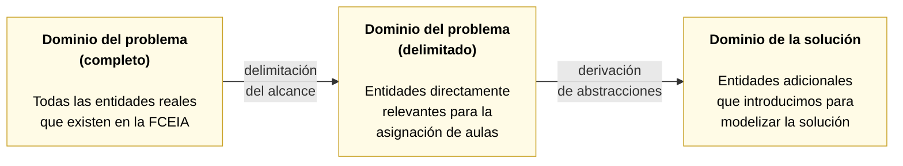
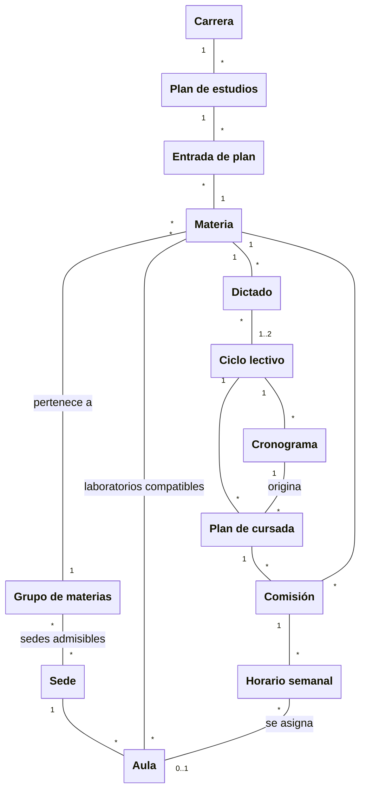

## 3.5 El modelo conceptual

En las secciones 3.3 y 3.4 la operatoria y el problema quedaron descritos
al nivel de "qué se hace y qué hay que decidir". Esta sección da el
paso siguiente: identificar las entidades del dominio, sus relaciones
y las reglas de negocio que las gobiernan. Es el primer eslabón de la
cadena introducida en §3.2.5, el **modelo conceptual del dominio**; su
traducción a un esquema de datos queda para la sección 3.6, y su uso
como piezas del programa lineal, para la sección 3.8.

El objetivo es doble. Por un lado, fijar un **lenguaje ubicuo** en el
sentido de Evans [3] (§3.2.2): los términos de esta sección son los
mismos que aparecen en la interfaz del sistema y en el resto del
informe. Por otro, hacer explícitas las **reglas de negocio** que la
FCEIA aplica en la práctica y que hoy viven mayormente en el criterio
de las personas.

### 3.5.1 Enfoque metodológico: modelado en capas

No todas las entidades de la facultad son relevantes para asignar
aulas. Por eso organizamos el modelo en **tres capas** (Figura @fig:capas):
el dominio completo, el delimitado con las entidades directamente
relevantes para la asignación, y el dominio de la solución que agrega
entidades intermedias para resolver relaciones muchos-a-muchos.

<!-- figura: Enfoque de modelado en tres capas {#fig:capas} -->

```mermaid
flowchart LR
    C1["<b>Dominio del problema<br/>(completo)</b><br/><br/>Todas las entidades reales<br/>que existen en la FCEIA"]
    C2["<b>Dominio del problema<br/>(delimitado)</b><br/><br/>Entidades directamente<br/>relevantes para la<br/>asignación de aulas"]
    C3["<b>Dominio de la solución</b><br/><br/>Entidades adicionales<br/>que introducimos para<br/>modelizar la solución"]

    C1 -->|"delimitación<br/>del alcance"| C2
    C2 -->|"derivación<br/>de abstracciones"| C3

    classDef body fill:#fffbe6,stroke:#c9a227,color:#000
    class C1,C2,C3 body
```

### 3.5.2 Entidades del dominio del problema

Del inventario completo de la facultad, el problema de asignación
definido en la sección 3.4 sólo necesita una parte. Quedan **fuera del
alcance**:

- **Alumno** e **inscripción**: la asignación decide sobre horarios y
  aulas, no sobre personas; del alumnado sólo importa la cantidad
  esperada por comisión.
- **Profesor**: no afecta la capacidad ni la disponibilidad de las
  aulas, y la asignación de docentes es un problema distinto que no
  abordamos.
- **Asistencia**: es una consecuencia observable del dictado, no una
  entrada del proceso.

Quedan **dentro del alcance** la carrera, el plan de estudios y la
materia (qué se dicta y con qué requerimientos); la comisión (los
grupos de dictado); el aula y la sede (los recursos que se asignan);
el ciclo lectivo (el marco temporal); el cronograma (la entrada del
proceso) y la clase (cada encuentro concreto en el calendario).

### 3.5.3 Las entidades del modelo

Presentamos las entidades agrupadas según el papel que cumplen. Para
cada una indicamos qué representa y para qué sirve; los atributos y
su codificación se tratan en la sección 3.6 y en el anexo A.

#### 3.5.3.1 La oferta académica

La **carrera** es un programa de grado o tecnicatura que ofrece la
facultad. Su contenido se describe en un **plan de estudios**, que
modelamos como entidad propia porque una misma carrera puede tener
varias versiones vigentes a la vez (por ejemplo, un plan anterior
para alumnos avanzados y uno nuevo para los ingresantes).

La **materia** es una asignatura del catálogo de la facultad,
independiente de la carrera: una misma materia puede figurar en los
planes de varias carreras. Lo que la caracteriza para la asignación
es su carga horaria semanal, dividida en horas de teoría y de
laboratorio, y si se dicta en forma cuatrimestral o anual.

Entre plan y materia hay una relación muchos-a-muchos que resolvemos
con una entidad del dominio de la solución, la **entrada de plan de
estudios**: indica en qué año y cuatrimestre del plan se ubica cada
materia. Las **correlativas**, a su vez, expresan qué materias deben
haberse cursado antes que otras dentro de una carrera; no intervienen
en la asignación de aulas, pero sirven para verificar que el
cronograma sea cursable por un alumno tipo.

#### 3.5.3.2 Los recursos físicos

La **sede** es un edificio de la facultad que agrupa aulas. El
**aula** es el espacio físico donde se dicta, pertenece a una única
sede y se caracteriza por su capacidad y su tipo (teórica,
laboratorio, anfiteatro, práctica).

No todo laboratorio sirve para cualquier materia: una materia de
electrónica necesita un laboratorio con instrumental de electrónica.
La **compatibilidad materia-laboratorio** registra qué laboratorios
son técnicamente aptos para la parte práctica de cada materia; una
materia puede tener varios laboratorios compatibles y un laboratorio
puede servir a varias materias.

#### 3.5.3.3 La planificación del cuatrimestre

El **ciclo lectivo** es cada cuatrimestre de operación académica y
contextualiza todo lo demás: en él están vigentes ciertas versiones
de los planes de estudio, se carga el cronograma y se arma la
planificación.

El **dictado** representa la oferta efectiva de una materia en un
ciclo. Existe como entidad porque "la materia dictándose en un ciclo"
tiene características propias que ni la materia ni el ciclo aportan
por separado: si se ofrece o no, sus fechas de inicio y fin, y si ese
cuatrimestre se dicta en forma virtual.

El **cronograma** es el conjunto de horarios que entrega la
coordinación cada cuatrimestre, normalmente como planilla de cálculo.
Es el material de partida del que se derivan las comisiones y sus
horarios.

El **plan de cursada** es un escenario concreto de planificación para
un ciclo: reúne todas las comisiones que se van a abrir, sus horarios
y, una vez resuelto el problema, las aulas asignadas. Un ciclo puede
tener varios planes de cursada para comparar alternativas, pero sólo
uno activo.

La **comisión** es un grupo de estudiantes que cursa una materia con
un mismo esquema semanal; una materia puede abrir varias comisiones.
Cada comisión se compone de **horarios semanales**: franjas
recurrentes con día, hora de inicio, hora de fin y tipo de clase
(teoría o laboratorio). El horario semanal es la unidad sobre la que
se decide el aula, según se justificó en §3.4.3.1. Finalmente, la
**clase** es cada encuentro concreto en una fecha del calendario; se
obtiene repitiendo el horario semanal a lo largo del ciclo y hereda
su aula.

#### 3.5.3.4 El grupo de materias

La pregunta "¿en qué sedes puede dictarse esta materia?" no se
responde materia por materia, sino por bloques: las materias del
ciclo básico de las ingenierías comparten un criterio, las del bloque
troncal de ingeniería otro, las comunes a licenciaturas y
profesorados otro, y las específicas de cada carrera el suyo. El
**grupo de materias** captura ese criterio. Cada materia pertenece a
exactamente un grupo, y cada grupo declara dos configuraciones de
sedes:

- un **conjunto duro**: las únicas sedes admisibles cuando el grupo
  se resuelve con criterio estricto;
- una **lista blanda ordenada**: las sedes preferidas cuando el
  grupo se resuelve con criterio flexible; la primera no tiene costo
  y las demás se aceptan con una penalización.

El criterio con que se resuelve cada grupo se elige en cada corrida
del asignador. Esto permite, por ejemplo, resolver un mismo plan una
vez con criterio estricto, para verificar su factibilidad, y otra con
criterio flexible, para reducir traslados. Las materias que todavía
no se clasificaron caen en un grupo *sin clasificar*, cuya presencia
el sistema señala como advertencia. El grupo de materias interviene
en las restricciones R8 y R10 del programa lineal (sección 3.8).

### 3.5.4 Relaciones y multiplicidades

La mayoría de las relaciones del modelo son simples, de uno a muchos:
una sede tiene muchas aulas, un ciclo tiene varios cronogramas y
planes de cursada, una comisión tiene varios horarios semanales y
cada horario genera muchas clases. Pero, como anticipamos en §3.2.4.1 y
en el diagnóstico de §3.3.4, en la asignación de aulas las relaciones
muchos-a-muchos son la norma más que la excepción. Cada una se
resuelve con una entidad intermedia del dominio de la solución
(Tabla @tab:relaciones).

<!-- tabla: Relaciones muchos a muchos y sus entidades intermedias {#tab:relaciones} -->
| Relación conceptual | Entidad intermedia | Qué aporta la intermedia |
| --- | --- | --- |
| Materia con carrera | Entrada de plan de estudios | Año y cuatrimestre dentro de una versión del plan |
| Materia con laboratorio | Compatibilidad materia-laboratorio | Sólo la afirmación de compatibilidad |
| Grupo de materias con sede | Sede del grupo | Tipo de configuración (dura o blanda) y orden de preferencia |
| Materia con ciclo lectivo | Dictado | Fechas efectivas y virtualidad del ciclo |

Cuando la relación tiene características propias (el año del plan, la
virtualidad del ciclo, el orden de preferencia), la entidad intermedia
es imprescindible. Cuando no las tiene, como en la compatibilidad
materia-laboratorio, la mantenemos igual por uniformidad y porque
facilita las verificaciones.

### 3.5.5 Reglas de negocio e invariantes

Las **reglas de negocio** son afirmaciones sobre el comportamiento de
las entidades que no se deducen de sus definiciones y que el sistema
debe garantizar. Muchas son **invariantes** en el sentido de Evans
[3] (§3.2.2.2): deben cumplirse en todo momento. Las agrupamos por
familia.

#### 3.5.5.1 Reglas estructurales

- Todo horario semanal pertenece a exactamente una comisión.
- Toda comisión pertenece a exactamente una materia y a un plan de
  cursada.
- Todo dictado pertenece a una materia y se vincula con uno o dos
  ciclos (§3.5.5.5).
- Cada ciclo tiene a lo sumo un plan de cursada activo; los demás son
  escenarios de comparación.
- Toda aula pertenece a exactamente una sede.

#### 3.5.5.2 Regla de virtualidad jerárquica

Un horario *virtual* se dicta a distancia y no consume aula. La
virtualidad puede declararse en tres niveles: en la **materia** (se
dicta virtual por diseño), en el **dictado** (es virtual sólo ese
cuatrimestre) o en el **horario semanal** (un encuentro puntual de
una comisión híbrida). Se resuelve en cascada: prevalece el nivel más
específico que tenga un valor definido; si el horario no lo define,
se toma el del dictado, y si tampoco, el de la materia. La invariante
asociada es que **los horarios efectivamente virtuales no participan
de la asignación**: se excluyen antes de armar el programa lineal.

#### 3.5.5.3 Regla de sedes admisibles por grupo de materias

Cada materia tiene un conjunto de **sedes admisibles** que surge de su
grupo (§3.5.3.4) y del criterio con que ese grupo se resuelve:

- con criterio **estricto**, las sedes admisibles son las del
  conjunto duro del grupo; si ese conjunto está vacío (caso reservado
  al grupo sin clasificar), se admiten todas;
- con criterio **flexible**, se admiten todas las sedes, pero elegir
  otra que no sea la primera de la lista tiene un costo;
- como **excepción**, si la materia tiene un laboratorio compatible
  en una sede fuera de su grupo, esa sede también se admite: la
  aptitud física del laboratorio prevalece sobre la preferencia
  curricular.

La invariante asociada es que **toda aula asignada está en una sede
admisible para la materia del horario, o bien es un laboratorio
compatible con ella**. Este esquema reúne en un solo mecanismo dos
preocupaciones de la operatoria: las sedes propias de cada carrera
(a través del grupo de sus materias específicas) y las sedes
habituales de las materias comunes (a través de los grupos
transversales).

Un caso real lo muestra. El tercer año de Ingeniería Mecánica cursa,
en el primer cuatrimestre, materias específicas de la carrera
(Termodinámica, Mecánica Racional, entre otras), cuyo grupo tiene a
la Siberia como sede, y además Métodos Numéricos, una materia común
de Formación Básica que se dicta para varias carreras en Pellegrini.
Un mismo alumno tiene entonces clases en las dos sedes durante la
semana, y esa interacción es la que obliga a cuidar los traslados
(§3.5.5.7) y a decidir qué tan firme es la sede de cada grupo.

#### 3.5.5.4 Regla de recursado

Algunas carreras ofrecen materias también en el cuatrimestre opuesto
al que les corresponde, para facilitar el recursado. La política se
declara en dos niveles con la misma lógica de cascada que la
virtualidad: la **carrera** indica si ofrece recursado y la
**materia** puede sobrescribir esa indicación en un sentido u otro.
La invariante asociada es que **al generar los dictados de un ciclo
sólo se crean los que la regla de recursado permite**.

#### 3.5.5.5 Regla de materias anuales

Una materia anual se dicta a lo largo de los dos cuatrimestres del
año. En la práctica, su dictado se crea con el primer cuatrimestre y,
al generar los dictados del segundo, el sistema reutiliza ese mismo
dictado en lugar de crear otro: la materia queda activa en los dos
cuatrimestres, con los mismos horarios, sin que haya que cargarla
dos veces. El asignador, en cambio, resuelve cada cuatrimestre por
separado. La invariante es que **todo dictado se vincula con tantos
ciclos como indica la periodicidad de su materia**: uno si es
cuatrimestral, los dos del mismo año si es anual.

#### 3.5.5.6 Regla de coherencia teoría-laboratorio

En cada comisión, la suma de las duraciones de los horarios de teoría
debe coincidir con las horas de teoría declaradas por la materia, y
lo mismo para las de laboratorio. La regla se refleja en la
restricción R4 del programa lineal (sección 3.8): si el cronograma no
permite un reparto que respete la carga declarada, el problema
resulta infactible.

#### 3.5.5.7 Reglas de política institucional

La operatoria de la FCEIA impone además políticas ligadas al
traslado de los alumnos entre sedes y, en un caso, al de los
docentes. Las enunciamos acá como reglas del
dominio e indicamos dónde se las trata:

- **Cursada sin superposiciones.** Para cada carrera, año y
  cuatrimestre debe existir al menos una combinación de comisiones,
  una por materia obligatoria, que un alumno pueda cursar sin
  conflictos horarios ni traslados imposibles entre sedes. Se
  verifica antes de resolver el programa lineal (secciones 3.8 y 3.9).
- **Continuidad de sede para el alumno.** Dos horarios consecutivos
  de materias distintas de una misma carrera, año y cuatrimestre,
  separados por menos de un margen configurable (30 minutos por
  defecto), deben dictarse en la misma sede, para que el alumno
  pueda pasar de una clase a la siguiente (restricción R11 de la
  sección 3.8).
- **Misma sede por comisión.** Es la única regla pensada desde el
  punto de vista del docente: opcionalmente, todos los horarios de
  una comisión deben caer en la misma sede, para que quien la dicta
  no tenga que trasladarse entre sedes durante la semana
  (restricción R12).
- **Flexibilidad por calendario de exámenes.** En los períodos de
  exámenes debe poder generarse una variante transitoria de la
  asignación sin perder la de base. Queda fuera del programa lineal y
  se maneja en la operatoria (§3.4.6.2).

### 3.5.6 Diagrama UML del dominio

La Figura @fig:clases-plan resume las entidades y sus relaciones en un
diagrama de clases UML sin atributos. Cada línea es una asociación y
los números indican cuántas instancias participan de cada lado (`*`
significa "muchas"). Las relaciones rotuladas *sedes admisibles* y
*laboratorios compatibles* se materializan con las entidades
intermedias de la Tabla @tab:relaciones.

<!-- figura: Diagrama de clases del dominio {#fig:clases-plan} -->

```mermaid
---
config:
  class:
    hideEmptyMembersBox: true
---
classDiagram
    direction TB
    class Carrera
    class PlanDeEstudios["Plan de estudios"]
    class EntradaDePlan["Entrada de plan"]
    class Materia
    class GrupoDeMaterias["Grupo de materias"]
    class Sede
    class Aula
    class Dictado
    class CicloLectivo["Ciclo lectivo"]
    class Cronograma
    class PlanDeCursada["Plan de cursada"]
    class Comision["Comisión"]
    class HorarioSemanal["Horario semanal"]

    Carrera "1" -- "*" PlanDeEstudios
    PlanDeEstudios "1" -- "*" EntradaDePlan
    EntradaDePlan "*" -- "1" Materia
    Materia "*" -- "1" GrupoDeMaterias : pertenece a
    GrupoDeMaterias "*" -- "*" Sede : sedes admisibles
    Sede "1" -- "*" Aula
    Materia "*" -- "*" Aula : laboratorios compatibles
    Materia "1" -- "*" Dictado
    Dictado "*" -- "1..2" CicloLectivo
    CicloLectivo "1" -- "*" Cronograma
    CicloLectivo "1" -- "*" PlanDeCursada
    Cronograma "1" -- "*" PlanDeCursada : origina
    PlanDeCursada "1" -- "*" Comision
    Materia "1" -- "*" Comision
    Comision "1" -- "*" HorarioSemanal
    HorarioSemanal "*" -- "0..1" Aula : se asigna
```

### 3.5.7 Recapitulación

Quedan fijadas las entidades, sus relaciones y las reglas de negocio
como invariantes. La sección siguiente traduce este modelo a un
esquema de datos.
