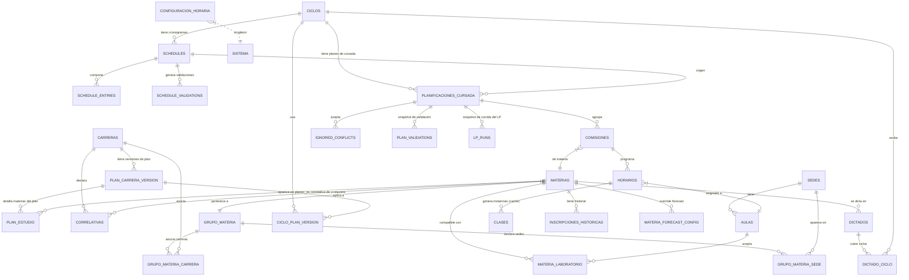

# Capítulo 6. Del dominio al modelo de datos

En el capítulo 5 dejamos fijado el modelo conceptual del dominio:
qué entidades intervienen, cómo se relacionan y qué reglas de
negocio las gobiernan. Ese modelo vive en el vocabulario del
dominio y es agnóstico a la tecnología: se puede realizar en una
base relacional, en documentos, en grafos o incluso en papel. Este
capítulo da el paso siguiente y describe **cómo se materializa el
modelo conceptual en un esquema de datos concreto**, apoyado sobre
un motor de base de datos relacional accedido a través de un ORM.

El objetivo es que el lector pueda seguir con claridad la
correspondencia entre las entidades y reglas del capítulo 5 y las
tablas del sistema. Vamos a ver por qué preferimos un esquema
relacional para este problema, cómo se traduce cada entidad
conceptual a una tabla, qué decisiones de diseño se tomaron cuando
el modelo relacional no admitía la formulación directa y cómo se
representan las reglas de negocio en el esquema. El detalle
ficha-por-ficha de cada tabla queda para el anexo A.

La justificación técnica del stack tecnológico (motor de base,
biblioteca ORM, resolutor de programación lineal) se presenta en
el capítulo 7. Este capítulo asume, sin fundamentarlo todavía, que
la base es relacional; el capítulo 7 explica por qué esa elección.

## 6.1 De entidad de dominio a tabla del ORM

Un modelo conceptual como el del capítulo 5 nombra entidades del
mundo real. Un modelo de datos describe cómo se guardan y se
consultan esas entidades en un motor concreto. La traducción no es
mecánica: hay que decidir cómo representar cada entidad, cómo se
codifican las relaciones, cómo se protege la consistencia y qué
información secundaria se agrega para soportar las operaciones del
sistema (identificadores técnicos, marcas de auditoría, cachés).

### 6.1.1 Correspondencia general

Con las entidades del capítulo 5 en un lado y las tablas del
sistema en el otro, la correspondencia es directa. Cada **entidad
del dominio** se traduce a una **clase del ORM** que Python
representa como un `dataclass` con anotaciones de tipo, y esa
clase se materializa como una **tabla física** en el motor
relacional. Vamos a usar el sufijo `DB` para el nombre de la
clase (por ejemplo `MateriaDB`) y a minúsculas con guiones para
la tabla (por ejemplo `materias`).

| Entidad conceptual (cap. 5) | Clase del ORM | Tabla física |
| --- | --- | --- |
| Carrera | `CarreraDB` | `carreras` |
| Materia | `MateriaDB` | `materias` |
| Sede | `SedeDB` | `sedes` |
| Aula | `AulaDB` | `aulas` |
| Plan de estudios (versión) | `PlanCarreraVersionDB` | `plan_carrera_version` |
| Entrada de plan de estudios | `PlanEstudioDB` | `plan_estudio` |
| Correlativa | `CorrelativaDB` | `correlativas` |
| Ciclo lectivo | `CicloDB` | `ciclos` |
| Dictado | `DictadoDB` | `dictados` |
| Cronograma | `ScheduleDB` | `schedules` |
| Plan de cursada | `PlanificacionCursadaDB` | `planificaciones_cursada` |
| Comisión | `ComisionDB` | `comisiones` |
| Horario semanal | `HorarioDB` | `horarios` |
| Compatibilidad materia-laboratorio | `MateriaLaboratorioDB` | `materia_laboratorio` |
| Grupo de materias | `GrupoMateriaDB` | `grupo_materia` |
| Sede-de-grupo | `GrupoMateriaSedeDB` | `grupo_materia_sede` |

Además de estas tablas que se corresponden con entidades del
capítulo 5, el modelo de datos incluye tablas técnicas que soportan
la operatoria del sistema: instantáneas de validación
(`ScheduleValidationDB`, `PlanValidationDB`), instantáneas de
corridas del asignador (`LPRunDB`), registro de conflictos
horarios que el usuario decidió ignorar (`IgnoredConflictDB`),
configuraciones de forecast (`MateriaForecastConfigDB`), historial
de inscripciones (`InscripcionHistoricaDB`), un log de mutaciones
para auditoría (`ChangeLogDB`) y una tabla `ConfiguracionHoraria`
con parámetros globales. Todas se documentan en el anexo A.

### 6.1.2 Diferencia entre entidad del dominio y tabla del ORM

La correspondencia uno-a-uno vale para la mayoría de las entidades,
pero conviene explicitar que **entidad del dominio y tabla del ORM
no son lo mismo**. Una entidad del dominio existe por su
significado; una tabla existe porque el motor relacional necesita
almacenar filas. En algunos casos una entidad conceptual se
representa con varias tablas: por ejemplo, la entidad *grupo de
materias* del capítulo 5 se materializa como `GrupoMateriaDB`
(cabecera del grupo) más `GrupoMateriaSedeDB` (lista ordenada de
sedes por grupo, con tipo de configuración) más
`GrupoMateriaCarreraDB` (asociaciones opcionales con carreras).
En otros casos, una tabla existe puramente por razones técnicas:
`ClaseDB` almacena las instancias puntuales que el sistema
mantiene como *caché* del patrón semanal aunque el modelo de
dominio activo trabaje sobre el patrón (ver §6.4.2).

### 6.1.3 Convenciones del ORM

El ORM que usamos (SQLModel, ver capítulo 7) permite declarar la
clase Python y la tabla física de una sola vez. Las convenciones
que adopta el sistema:

- Identificadores primarios opacos generados como UUID cuando la
  entidad no tiene una clave natural evidente (por ejemplo, aulas
  o ciclos). Cuando sí la tiene (por ejemplo, materia con su
  código), la clave natural es la clave primaria.
- Los tipos de atributo se declaran con las anotaciones de tipo de
  Python (`str`, `int`, `Optional[bool]`, `date`, `time`,
  `datetime`) y el ORM se encarga de traducirlos al motor.
- Las restricciones simples (`positivo`, `no vacío`, `único`) se
  declaran en la anotación del campo y el ORM las verifica al
  momento de escribir.
- Las relaciones muchos-a-muchos se declaran como tablas
  intermedias explícitas, siguiendo la convención del capítulo 5:
  cuando la relación tiene atributos propios, la tabla intermedia
  es imprescindible; cuando no, se declara igualmente por
  consistencia de representación.

## 6.2 Diagrama entidad-relación implementado

Con las convenciones fijadas, presentamos el diagrama de la base
de datos tal como está implementada. Es una vista técnica que
espeja el diagrama UML del capítulo 5, agregando las tablas
técnicas de soporte y las decisiones que no viven en el dominio
puro.

El diagrama muestra las relaciones entre tablas usando la notación
crow's foot estándar: el símbolo del lado *muchos* de cada
relación aparece como una pata de cuervo. Las multiplicidades se
condensan en las etiquetas de las patas de cuervo (`||` para uno y
`o{` para muchos con opcionalidad). Cuando el detalle de la
multiplicidad importa, el capítulo 5 lo desarrolla en su §5.4.

## 6.3 Codificación de las relaciones

Cada relación conceptual del capítulo 5 se codifica en una tabla
según su multiplicidad y sus atributos.

### 6.3.1 Relaciones uno-a-muchos

Se codifican como una clave foránea del lado *muchos*. Por
ejemplo, `AulaDB.sede_id` referencia a `SedeDB.id`, y la
multiplicidad "cada aula pertenece a exactamente una sede" queda
capturada por la no-nulabilidad de la clave foránea.

### 6.3.2 Relaciones muchos-a-muchos sin atributos propios

Se codifican como tabla intermedia con clave primaria compuesta
por ambas claves foráneas. Por ejemplo, `MateriaLaboratorioDB`
tiene clave primaria `(materia_codigo, aula_id)`, ambos foráneos.
No aparecen atributos propios: la fila afirma la relación.

### 6.3.3 Relaciones muchos-a-muchos con atributos propios

Se codifican como tabla intermedia con clave primaria compuesta y
atributos propios. Los casos relevantes:

- **Entrada de plan de estudios** (`PlanEstudioDB`) tiene la
  relación materia-carrera-versión con atributos `anio_plan`,
  `cuatrimestre_plan` y `optativa`.
- **Dictado en ciclo** (`DictadoCicloDB`) vincula un dictado con
  uno o dos ciclos según sea cuatrimestral o anual, con la
  clave primaria compuesta `(dictado_id, ciclo_id)`.
- **Sede-de-grupo** (`GrupoMateriaSedeDB`) tiene la relación
  grupo-sede con dos atributos propios: `tipo` (que discrimina
  entre configuración dura y blanda) y `orden` (posición dentro
  de la lista blanda ordenada). La clave primaria es
  `(grupo_id, sede_id, tipo)`, lo que permite que la misma sede
  aparezca dos veces en el mismo grupo (una vez con tipo duro y
  otra con tipo blando).

### 6.3.4 Jerarquías del dominio

Las tres reglas jerárquicas del §5.5.2 y §5.5.4 (virtualidad y
recursado) se codifican como campos nulables `Optional[bool]` en
las tablas de los niveles apropiados. La resolución del valor
efectivo la hace en tiempo de consulta una función helper del
sistema (`resolve_virtual`, `resolve_dicta_recursado`) que camina
la jerarquía y devuelve el primer valor no nulo. El motor
relacional no participa de esa resolución: es responsabilidad de
la capa de servicios.

## 6.4 Decisiones de diseño del modelo de datos

Traducir el modelo conceptual al esquema relacional no fue una
traducción mecánica. Hubo decisiones de diseño que introducen
matices sobre el modelo puro; conviene documentarlas en un solo
lugar para que el lector pueda seguirlas después en el código y en
las validaciones.

### 6.4.1 Versionado de planes de estudio

En el modelo del capítulo 5, un *plan de estudios* fue definido
como el mapeo materia → año/cuatrimestre para una carrera. En la
práctica, los planes cambian con el tiempo: se agrega una materia,
se corre una del cuatrimestre 1 al 2, se cambia el año en que se
dicta. Modelar el plan como una única tabla plana obligaba a
elegir entre pisar el pasado o dejar de reflejar el presente.

El sistema resuelve esa tensión con una entidad intermedia,
`PlanCarreraVersionDB`, que representa **cada versión** de un plan
de una carrera. La tabla `PlanEstudioDB` ya no vincula
`(materia, carrera)` sino `(materia, plan_version)`, y una nueva
tabla `CicloPlanVersionDB` decide qué versiones aplican a cada
ciclo lectivo. El resultado: se puede tener varias versiones vivas
en simultáneo (una por cada cohorte de estudiantes) y cada ciclo
sabe qué versión usar de cada carrera.

Esta decisión no aparece en el modelo conceptual del capítulo 5 en
forma explícita porque es un detalle de representación. Sin
embargo, es la que sostiene la trazabilidad histórica que
mencionamos en §3.5: se puede reconstruir el plan que se le prometió
a una cohorte aunque después el plan haya cambiado.

### 6.4.2 `ClaseDB` como caché técnico deprecado

En una versión temprana del sistema, la asignación de aula se
guardaba en la instancia puntual de cada clase (`ClaseDB.aula_id`).
La motivación era permitir excepciones por fecha: un feriado
puntual, un cambio para el 3 de octubre. Con el tiempo se llegó a
que las excepciones por fecha eran raras, complicaban la interfaz
y no aportaban valor operativo real.

El sistema actual trabaja a nivel del **patrón semanal**: el aula
se guarda en `HorarioDB.aula_id`, y las instancias puntuales
(`ClaseDB`) heredan el aula del patrón al generarse. La tabla
`ClaseDB` sobrevive como caché técnico para no romper el motor de
validación por fecha, pero ninguna vista de la interfaz la
renderiza y ninguna operación la edita.

Documentamos esta decisión con nombre propio (`ClaseDB` deprecada)
porque el lector del código se va a cruzar con la sigla y
necesita saber por qué está ahí. El retiro completo se planea
para una iteración futura.

### 6.4.3 Comisión como entidad de primera clase con doble anclaje

En el diseño original, la comisión era un identificador de facto
que aparecía como campo entero en las filas del cronograma
(`ScheduleEntry.comision: int`). Ese esquema no permitía editar
atributos de la comisión (nombre, cupo, coeficiente de asignación,
etiqueta de carrera): la comisión sólo existía al momento de
generar el plan.

El sistema actual eleva a la comisión a entidad de primera clase
con tabla propia (`ComisionDB`) y le da un anclaje dual: cada
comisión pertenece **o bien** a un cronograma (`schedule_id`
seteado) **o bien** a un plan de cursada (`plan_cursada_id`
seteado), pero no a ambos. La invariante *o bien uno o bien el
otro* se llama en la jerga de bases de datos una restricción
*XOR* y no se puede expresar directamente con constraints
declarativas en SQL estándar; el sistema la garantiza con la
lógica del servicio que crea y actualiza comisiones.

Cuando un usuario genera un plan de cursada desde un cronograma,
las comisiones template del cronograma se **clonan** al plan (con
nuevos identificadores) preservando sus atributos. Editar la
comisión del plan no afecta a la del cronograma, y viceversa. La
decisión de clonar y no compartir refleja que el ciclo de vida de
la comisión difiere entre las dos etapas: en el cronograma es un
esqueleto en construcción, en el plan es una entidad
operativamente comprometida.

### 6.4.4 Grupo de materias como partición estricta

La regla de sedes admisibles del §5.5.3 se apoya en la entidad
grupo de materias. En el modelo de datos, cada `MateriaDB`
referencia un `grupo_id` obligatorio (no nulo): toda materia
pertenece a exactamente un grupo. Esa **partición estricta** es
una invariante del sistema que se verifica al insertar y al
migrar el esquema.

La partición se apoya en un grupo *sin clasificar* especial que
recibe las materias sin asignación explícita. La única fila
`GrupoMateriaDB` con `es_sin_clasificar=True` es el destino de
*fallback*; la interfaz reporta con una advertencia visual las
materias que quedan en ese grupo, para que el operador las
migre al grupo curricular correcto.

La lista de sedes de cada grupo se guarda en
`GrupoMateriaSedeDB` con la columna `tipo` que discrimina entre
las dos configuraciones simultáneas (dura y blanda). Esto refleja
la decisión del capítulo 5: cada grupo declara ambas
configuraciones al mismo tiempo, y el resolutor elige cuál usar
por corrida.

### 6.4.5 Instantáneas de validación y de corridas

Cada vez que el usuario corre una validación de cronograma o de
plan, el sistema persiste una fila `ScheduleValidationDB` o
`PlanValidationDB` con el resumen completo de esa corrida. Lo
mismo con las corridas del asignador de aulas: cada corrida deja
una fila `LPRunDB` con status, configuración aplicada, tiempo del
resolutor, contadores agregados y un campo JSON con el detalle
completo (asignación por horario, resultado del diagnóstico,
veredicto humano-legible).

Estas instantáneas no representan entidades del dominio: son
registros técnicos que permiten reconstruir la vista de una
validación o corrida vieja sin recomputarla, comparar dos
corridas con configuraciones distintas y auditar la evolución del
plan a lo largo del cuatrimestre. Al respetar la separación
conceptual, el diseño previene que el usuario confunda el estado
actual del plan con el estado en que estuvo en algún momento del
pasado.

### 6.4.6 Registro de cambios (change log)

Complementando las instantáneas puntuales, el sistema mantiene un
registro global de mutaciones sobre las entidades del catálogo
(materias, carreras, dictados, grupos de materias). Cada evento
guarda quién, cuándo, qué cambió y opcionalmente por qué (razón
textual + origen del evento). El log es fuente de la vista
"Historial" y sirve para auditar cambios que no encajan en el
esquema clásico de instantáneas por operación.

Modelamos el log como una única tabla `ChangeLogDB` con columnas
polimórficas (`entity_type`, `entity_id`) para admitir múltiples
tipos de entidad sin proliferar tablas. Los eventos los emiten
automáticamente hooks del ORM para las mutaciones más importantes,
y los servicios pueden emitir eventos explícitos con más contexto
cuando corresponde.

### 6.4.7 Excepciones a la validación de conflictos

El sistema permite al operador marcar pares de materias como
*ignorados* para el chequeo de solapamiento horario. La tabla
`IgnoredConflictDB` guarda estos pares por plan de cursada,
ordenados lexicográficamente para deduplicar. Cuando cambia el
plan y las materias del par dejan de coexistir en el mismo grupo
curricular, la excepción queda huérfana y una rutina de limpieza
automática la elimina en la próxima validación, reportando la
limpieza al operador.

Esta excepción sólo aplica al chequeo de solapamiento horario. La
regla de continuidad de sede (traslado intersede) ignora
deliberadamente las excepciones: el traslado físico entre dos
sedes es una restricción operativa independiente de qué alumnos
cursen qué. Documentamos esa asimetría porque no se deriva de la
lectura casual del modelo: podría parecer que "ignorar el conflicto
entre A y B" alcanza a todos los chequeos, pero no.

## 6.5 Cómo se protege la consistencia

Un modelo de datos no es solamente su esquema: incluye también
las reglas que garantizan que las filas guardadas son
consistentes con las invariantes del dominio. Distinguimos tres
capas de protección:

1. **Constraints declarativas del motor**: claves primarias,
   claves foráneas, `unique`, `not null` y chequeos de tipo. El
   ORM las materializa a partir de las anotaciones de la clase.
2. **Invariantes de nivel aplicación**: reglas que el motor
   relacional no puede expresar directamente (por ejemplo, la
   restricción *XOR* de comisión, la unicidad del grupo sin
   clasificar, la partición estricta materia-grupo). Se garantizan
   con lógica en la capa de servicios y se documentan
   explícitamente en el anexo A como "INV-nnn".
3. **Chequeos estructurales del programa lineal**: reglas que
   involucran combinaciones de horarios, capacidades y sedes, y
   se verifican con lógica específica antes de correr el
   resolutor. El capítulo 8 las cubre; el capítulo 9 documenta
   cómo se integran al flujo operativo.

Un principio de diseño que atraviesa el sistema: siempre que sea
posible, la invariante se declara al nivel del motor (nivel 1)
para que ninguna capa superior pueda saltearla por descuido.
Cuando no alcanza, se documenta la razón por la que la invariante
vive en la capa de servicios (nivel 2) y en qué punto del código
se verifica.

## 6.6 Migraciones idempotentes

El esquema de datos no se congeló al inicio del proyecto: fue
evolucionando a medida que crecía la comprensión del dominio. El
sistema aplica cambios de esquema a través de **migraciones
idempotentes** que se ejecutan al arrancar la aplicación: cada
migración detecta si ya se corrió y no aplica cambios si el
estado del schema ya es el esperado. El anexo A lista el catálogo
completo de migraciones aplicadas hasta la fecha.

Este esquema no depende de una herramienta externa de gestión de
migraciones (como Alembic o Flyway) porque el proyecto es de un
único tenant y la base es local: siempre existe la opción de
reinicializar desde los archivos de entrada. Documentamos la
decisión aquí porque tiene implicancias importantes para operar
el sistema: **no se pueden hacer rollbacks automáticos de una
migración una vez aplicada**. La estrategia de reversión, cuando
es necesaria, es escribir una migración inversa.

## 6.7 Recapitulación

En este capítulo el modelo conceptual del capítulo 5 quedó
materializado como un esquema de datos concreto. Los puntos que
se retoman en los capítulos siguientes:

1. **Cada entidad del dominio tiene su tabla en el ORM**, con
   nombre reconocible y correspondencia directa. Cuando la
   entidad exige varias tablas (grupos de materias con sus
   sedes ordenadas) o cuando aparecen tablas técnicas de soporte
   (instantáneas, log de cambios), el capítulo justifica por qué.
2. **Las relaciones muchos-a-muchos se codifican con tablas
   intermedias explícitas** con atributos propios cuando la
   relación los tiene. Este patrón se sostiene sin excepciones y
   permite explicar cada tabla como *entidad* o como *materialización
   de una relación*.
3. **Las decisiones de diseño no obvias quedan documentadas con
   nombre propio**: versionado de planes, `ClaseDB` como caché
   deprecado, comisión con anclaje dual XOR, partición estricta
   materia-grupo, instantáneas de validación y de corridas del
   asignador, registro de cambios, excepciones asimétricas para
   validación de conflictos.
4. **La consistencia se protege en tres capas**: constraints del
   motor, invariantes de aplicación y chequeos estructurales.
   Cada regla del capítulo 5 se sostiene en al menos una de las
   tres.

Con el modelo de datos fijado, el capítulo 7 presenta la
arquitectura de software que consume este esquema y describe el
stack tecnológico que sostiene la implementación. El capítulo 8
retoma las restricciones del dominio y las formaliza como el
programa lineal entero que resuelve el asignador. El anexo A
ofrece la referencia exhaustiva tabla por tabla, columna por
columna, invariante por invariante.
