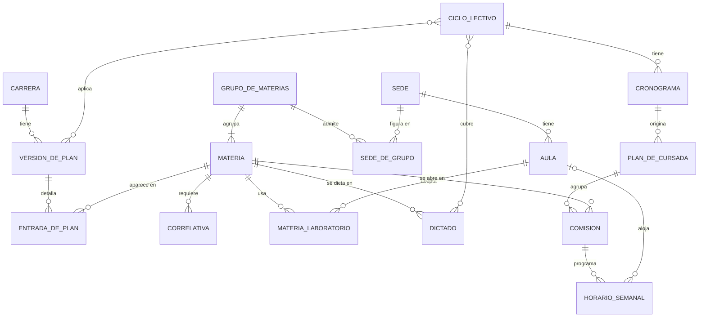

## 3.6 Del dominio al modelo de datos

En la sección 3.5 dejamos fijado el modelo conceptual del dominio:
qué entidades intervienen, cómo se relacionan y qué reglas las
gobiernan. Ese modelo habla en el vocabulario del dominio y no
depende de ninguna tecnología. Esta sección da el paso siguiente:
muestra **cómo se traduce ese modelo a una base de datos** y qué
decisiones de diseño de esa traducción importan para la solución.
El detalle tabla por tabla queda para el anexo A, y la
justificación de las tecnologías elegidas, para la sección 3.7.

### 3.6.1 Del modelo conceptual al modelo relacional

Una *base de datos relacional* es la herramienta más difundida para
guardar información estructurada: organiza los datos en tablas,
cada fila representa un objeto y cada columna, uno de sus
atributos. Las filas de tablas distintas se vinculan entre sí
mediante *claves*: cada fila tiene un identificador propio (su
*clave primaria*) y, cuando necesita referirse a una fila de otra
tabla, guarda el identificador de esa fila (una *clave foránea*).
Elegimos este enfoque porque el dominio de la sección 3.5 ya está
expresado en esos términos: entidades, relaciones con
multiplicidades precisas y reglas de consistencia.

Para no escribir a mano el código que lee y guarda cada tabla,
usamos un *mapeo objeto-relacional* (en inglés, *object-relational
mapping* u ORM): una biblioteca que permite declarar cada entidad
una sola vez, como una clase del lenguaje de programación, y que se
encarga de crear la tabla correspondiente y de traducir las
operaciones del programa en consultas a la base.

En la mayoría de los casos la correspondencia es directa: cada entidad de la sección 3.5 tiene su propia tabla. Las excepciones son las que vale la pena explicar, y se tratan
en la sección 3.6.4.

Además de estas tablas, la base guarda información que el sistema
necesita para operar pero que no es una entidad del dominio, como
el historial de inscripciones que alimenta la estimación de
demanda o los parámetros globales de la grilla horaria. Se
describen en el anexo A.

### 3.6.2 Diagrama entidad-relación

Un *diagrama entidad-relación* es la notación habitual para
mostrar la estructura de una base de datos: cada caja es una tabla
y cada línea, una relación entre dos tablas. Usamos la notación de
*pata de gallo* (*crow's foot*): el extremo que se abre en tres
trazos indica el lado *muchos* de la relación; la doble barra
indica *exactamente uno*, y el círculo, que la relación es
opcional. La Figura @fig:er presenta el modelo implementado, sin los
atributos de cada tabla, que se detallan en el anexo A.

<!-- figura: Diagrama entidad-relación del modelo implementado {#fig:er} -->

```mermaid
erDiagram
    CARRERA ||--o{ VERSION_DE_PLAN : "tiene"
    VERSION_DE_PLAN ||--o{ ENTRADA_DE_PLAN : "detalla"
    MATERIA ||--o{ ENTRADA_DE_PLAN : "aparece en"
    MATERIA ||--o{ CORRELATIVA : "requiere"
    GRUPO_DE_MATERIAS ||--|{ MATERIA : "agrupa"
    GRUPO_DE_MATERIAS ||--o{ SEDE_DE_GRUPO : "admite"
    SEDE ||--o{ SEDE_DE_GRUPO : "figura en"
    SEDE ||--o{ AULA : "tiene"
    MATERIA ||--o{ MATERIA_LABORATORIO : "usa"
    AULA ||--o{ MATERIA_LABORATORIO : "acepta"
    CICLO_LECTIVO }o--o{ VERSION_DE_PLAN : "aplica"
    MATERIA ||--o{ DICTADO : "se dicta en"
    CICLO_LECTIVO }o--o{ DICTADO : "cubre"
    CICLO_LECTIVO ||--o{ CRONOGRAMA : "tiene"
    CRONOGRAMA ||--o{ PLAN_DE_CURSADA : "origina"
    PLAN_DE_CURSADA ||--o{ COMISION : "agrupa"
    MATERIA ||--o{ COMISION : "se abre en"
    COMISION ||--o{ HORARIO_SEMANAL : "programa"
    AULA |o--o{ HORARIO_SEMANAL : "aloja"
```

### 3.6.3 Codificación de las relaciones

Cada relación de la sección 3.5 se codifica según su multiplicidad.

- **Uno a muchos.** Se representa con una clave foránea en la
  tabla del lado *muchos*. Por ejemplo, cada aula guarda la sede a
  la que pertenece; que esa referencia no pueda quedar vacía es lo
  que expresa la regla "toda aula pertenece a exactamente una
  sede".
- **Muchos a muchos.** Se representa con una *tabla intermedia*
  cuyas filas afirman que dos objetos están vinculados. Si la
  relación no tiene atributos propios, la fila sólo contiene las
  dos claves; es el caso de la compatibilidad entre materias y
  laboratorios. Si los tiene, la tabla intermedia los guarda: la
  entrada de plan de estudios vincula una materia con una versión
  de plan e indica el año, el cuatrimestre y si es optativa; la
  vinculación de un dictado con sus ciclos permite que un dictado
  anual cubra dos cuatrimestres.
- **Jerarquías.** Las reglas jerárquicas de virtualidad y de
  recursado (secciones 3.5.5.2 y 3.5.5.4) se guardan como atributos que
  pueden quedar sin valor en cada nivel de la jerarquía. El valor
  efectivo no lo resuelve la base: lo calcula el sistema al
  consultarlo, recorriendo la jerarquía desde el nivel más
  específico hasta encontrar el primero que tenga un valor
  definido.

### 3.6.4 Decisiones de diseño del modelo de datos

Las decisiones que siguen son las que agregan algo al modelo
conceptual o lo matizan.

#### 3.6.4.1 Versionado de planes de estudio

Los planes de estudio cambian con el tiempo: se incorpora una
materia, otra pasa de cuatrimestre, una tercera cambia de año.
Guardar el plan como una lista única obligaría a elegir entre
borrar el pasado o dejar de reflejar el presente. Por eso cada
plan se guarda como una sucesión de *versiones*, y cada ciclo
lectivo indica qué versión de cada carrera se aplica en él. Así
pueden convivir varias versiones vigentes, una por cada cohorte de
estudiantes, y siempre se puede reconstruir el plan que se le
prometió a una cohorte aunque luego haya cambiado.

#### 3.6.4.2 Comisión con dos posibles pertenencias

La comisión es una entidad con tabla propia, porque el usuario
necesita editar sus atributos (nombre, cupo, carrera a la que se
destina). Cada comisión pertenece **o bien** a un cronograma **o
bien** a un plan de cursada, pero nunca a ambos, y la separación
responde a que cumplen papeles distintos.

El cronograma es la propuesta horaria del cuatrimestre: un borrador
que se carga, se corrige y se valida contra la oferta del ciclo
(que estén todas las materias, que la partición entre teoría y
laboratorio cierre, que no haya superposiciones dentro de cada grupo
curricular y que exista un camino de cursada viable entre sedes).
Sobre esa base se pueden generar uno o varios planes
de cursada. El plan, en cambio, es el escenario con el que se
trabaja la asignación, y suma lo que el cronograma no tiene:

- **los inscriptos esperados** de cada comisión, a partir del
  pronóstico de matrícula o de un valor que fija el usuario;
- **su propia validación**, sobre las comisiones ya ajustadas y con
  las excepciones que el usuario acepta para ese escenario;
- **la corrida del asignador de aulas** y, con ella, las aulas
  asignadas y las que el usuario fija a mano;
- **las clases por fecha**, que repiten el patrón semanal a lo largo
  del ciclo.

Al generar un plan a partir de un cronograma, sus comisiones se
copian, de modo que se puede ajustar o descartar un escenario sin
alterar el cronograma ni los otros planes que salieron de él. La
regla "o bien una cosa o bien la otra" no se puede declarar en el
motor, por lo que la garantiza el propio sistema al crear y
modificar comisiones.

#### 3.6.4.3 Grupo de materias como partición

La regla de sedes admisibles (sección 3.5.5.3) se apoya en los
grupos de materias. En la base, toda materia debe pertenecer a
exactamente un grupo: los grupos forman una *partición* del
conjunto de materias, es decir, lo cubren por completo y sin
superposiciones. Para que esa regla se cumpla incluso con materias
recién cargadas, existe un grupo especial *sin clasificar* que las
recibe por defecto; la interfaz lo señala con una advertencia para
que el usuario las ubique en su grupo curricular.

Cada grupo guarda su lista de sedes junto con un indicador que
distingue las dos configuraciones definidas en la sección 3.5: la
*dura*, que restringe las sedes posibles, y la *blanda*, que las
ordena por preferencia. Ambas se guardan a la vez, y en cada
corrida del asignador se elige cuál aplicar.

#### 3.6.4.4 Excepciones a la verificación de conflictos

El usuario puede marcar pares de materias cuyo solapamiento
horario se acepta deliberadamente, por ejemplo porque en la
práctica no comparten alumnos. Cada excepción se guarda asociada a
un cronograma o a un plan de cursada. Cuando las materias del par
dejan de coincidir, la excepción pierde sentido y el sistema la
descarta en la siguiente validación, informándolo al usuario.

Conviene notar que la excepción sólo alcanza a la verificación de
solapamiento. La verificación de traslado entre sedes la ignora a
propósito: que dos materias no compartan alumnos no cambia el
tiempo que le lleva a un estudiante moverse de una sede a otra.

### 3.6.5 Cómo se protege la consistencia

Un modelo de datos no es sólo su estructura: incluye también los
mecanismos que garantizan que lo guardado respeta las reglas del
dominio. Distinguimos tres niveles:

1. **Restricciones del motor.** Claves primarias y foráneas,
   unicidad, obligatoriedad y tipos de dato. Las hace cumplir la
   propia base, de modo que ningún componente puede saltearlas.
2. **Reglas del sistema.** Reglas que el motor no puede expresar,
   como la doble pertenencia excluyente de la comisión o la
   existencia de un único grupo sin clasificar. Las verifica el
   sistema cada vez que crea o modifica los datos involucrados, y
   se documentan en el anexo A.
3. **Verificaciones previas al asignador.** Reglas que combinan
   horarios, capacidades y sedes, y que se verifican antes de
   resolver el programa lineal. Se desarrollan en las secciones 3.8
   y 3.9.

El criterio general es declarar cada regla en el nivel más bajo
posible, para que ninguna capa superior pueda omitirla.

### 3.6.6 Recapitulación

El modelo conceptual queda traducido a una base relacional cuya
consistencia se protege en el motor, en el sistema y antes de cada
corrida del asignador. La sección 3.7 presenta la arquitectura que la
usa.
