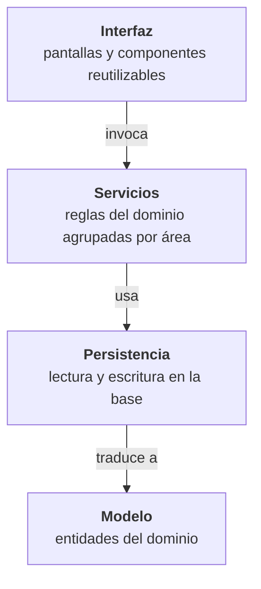
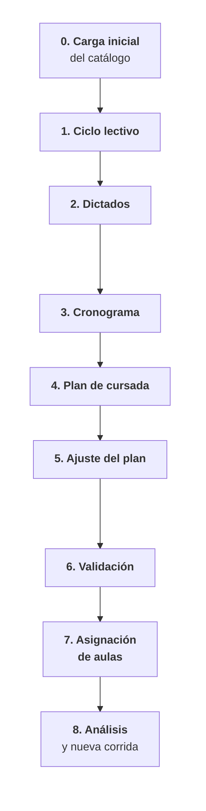
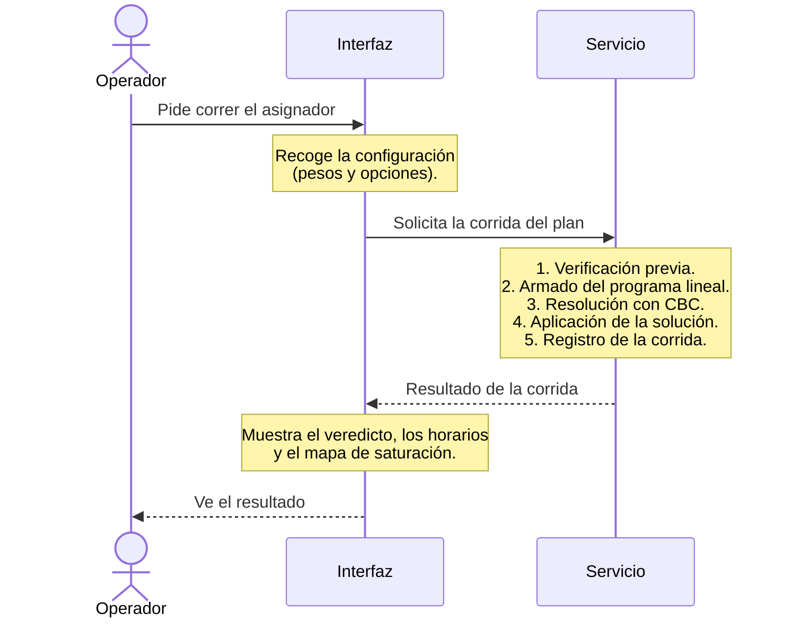

# Capítulo 7. Arquitectura de la solución

Los capítulos 5 y 6 fijaron qué se modela y cómo se guarda. Este
capítulo explica sobre qué se construye la solución: qué
tecnologías la sostienen y por qué se eligieron, cómo se reparten
las responsabilidades dentro del sistema y cómo fluye una operación
de punta a punta, desde la acción del operador en la pantalla hasta
el resultado que vuelve a ella.

## 7.1 Pila tecnológica

El sistema es una *aplicación web* que se usa desde el navegador,
escrita íntegramente en Python y con una base de datos local. La
tabla de la pila tecnológica resume las tecnologías que la componen y el papel de cada
una.

<!-- tabla: Pila tecnológica de la solución -->
| Capa | Tecnología | Rol |
| --- | --- | --- |
| Interfaz de usuario | Streamlit | Presenta la aplicación en el navegador: formularios, tablas y gráficos. |
| Lenguaje base | Python | Corre todo el sistema: interfaz, reglas del dominio y optimización. |
| Validación de datos | Pydantic | Verifica que los datos que circulan por el sistema tengan la forma esperada. |
| Mapeo objeto-relacional | SQLModel | Traduce las entidades del modelo a tablas de la base y viceversa. |
| Motor de base de datos | SQLite | Guarda todo el estado del sistema en un único archivo local. |
| Optimización | PuLP | Permite escribir el programa lineal con una notación cercana a la matemática. |
| Resolutor | CBC | Resuelve el programa lineal entero; es libre y de código abierto. |
| Visualización | Altair y componentes de Streamlit | Gráficos de saturación, tablas de resultados y calendarios semanales. |

### 7.1.1 Python y Streamlit

Python es la decisión que condiciona al resto de la pila. Lo
elegimos por dos razones. La primera es que cuenta con un
ecosistema maduro de optimización y análisis de datos, de modo que
el programa lineal, los pronósticos de inscriptos y los reportes se
apoyan en herramientas disponibles en el mismo lenguaje. La segunda
es que permite construir también la interfaz sin cambiar de
lenguaje, lo que mantiene una única base de código y simplifica su
mantenimiento. Lenguajes como Java o JavaScript se descartaron: el
primero tiene un ecosistema de optimización libre más limitado y el
segundo es fuerte en interfaces pero débil en optimización
combinatoria.

Streamlit es una biblioteca de Python para construir aplicaciones
web interactivas sin escribir directamente el código propio de los
navegadores. Cada pantalla se describe como un programa corto que
se vuelve a ejecutar ante cada interacción, y la biblioteca se
encarga de dibujar formularios, tablas y gráficos, lo que da una
velocidad de desarrollo alta. Las alternativas que separan la
interfaz del procesamiento exigían mantener dos piezas comunicadas
entre sí, un costo que el proyecto no necesitaba pagar.

### 7.1.2 SQLite y SQLModel para la persistencia

SQLite es un motor de base de datos relacional que no necesita un
servidor aparte: toda la base vive en un archivo que se puede
copiar, respaldar y compartir. No requiere instalación ni
configuración y alcanza con holgura para el volumen del problema,
que en el peor caso llega a algunos miles de registros por tabla.
Se descartó un motor con servidor, como PostgreSQL, por el costo de
instalación innecesario para un uso local, y una base documental,
como MongoDB, porque los datos del dominio son fuertemente
relacionales.

Sobre SQLite trabaja SQLModel, una biblioteca de *mapeo
objeto-relacional*: permite definir cada entidad del modelo una
sola vez y usar esa misma definición para validar los datos, para
guardarlos en la base y para pasarlos entre las distintas partes
del sistema. Además abstrae el motor, de modo que si el sistema
pasara a un uso multiusuario, cambiar SQLite por PostgreSQL
requeriría modificaciones acotadas.

### 7.1.3 PuLP y CBC para el programa lineal

PuLP es una biblioteca para escribir problemas de programación
lineal entera como una sucesión de variables, restricciones y una
función objetivo, con una notación muy cercana a la formulación
matemática. La resolución la delega en un *resolutor* externo; el
sistema usa CBC (*Coin-or Branch and Cut*), libre y ampliamente
probado. PuLP separa la formulación del resolutor: si en el futuro
se quisiera usar otro, el modelo no cambia. Se descartaron
alternativas con una abstracción propia más alejada del vocabulario
matemático, porque en un proyecto académico la cercanía con la
formulación formal facilita la comprensión del modelo que desarrolla
el capítulo 8.

Los gráficos se generan con Altair, que se integra de manera
directa con Streamlit.

## 7.2 Separación en capas

Una práctica habitual de la ingeniería de software para organizar
un sistema es la *arquitectura en capas*: se agrupan las
responsabilidades en niveles y cada nivel sólo se apoya en los que
están debajo, nunca al revés. Así, un cambio en la presentación no
obliga a tocar las reglas del negocio, y las reglas se pueden
verificar sin pasar por la pantalla. El sistema se organiza en
cuatro capas, como muestra la figura de la arquitectura en capas.

<!-- figura: Arquitectura en capas del sistema -->

- **Modelo.** Representa las entidades de los capítulos 5 y 6 tal
  como se guardan en la base. Es la única capa que conoce el motor
  relacional.
- **Persistencia.** Resuelve las operaciones básicas sobre la
  base: crear, consultar, modificar y borrar registros, respetando
  los borrados en cascada que define el modelo de datos. No decide
  qué combinaciones de valores son válidas.
- **Servicios.** Concentra las reglas del dominio: qué significa
  crear una comisión, generar un plan de cursada a partir de un
  cronograma, validar un plan, resolver la virtualidad y el
  recursado en cascada, pronosticar inscriptos o correr el
  asignador de aulas.
- **Interfaz.** Reúne las pantallas de cada área funcional
  (materias, aulas, carreras, ciclos, cronogramas, planes,
  inscriptos e historial).

La regla central es que **sólo la capa de servicios expresa reglas
del dominio**. La interfaz recolecta lo que ingresa el operador, se
lo pasa a un servicio y muestra la respuesta; cuando una pantalla
advierte, por ejemplo, que las horas de teoría más las de
laboratorio no suman las horas semanales de la materia, esa
verificación la hace un servicio. Esta disciplina es la que permite
probar la lógica del sistema de manera automática, sin depender de
la interfaz.

## 7.3 Flujo de punta a punta

El uso del sistema sigue un recorrido lineal que se repite cada
cuatrimestre, desde la carga de los datos iniciales hasta la
asignación final de aulas, con las etapas que resume la figura del flujo canónico de uso.

<!-- figura: Flujo canónico de uso del sistema -->

**Etapa 0. Carga inicial.** Se inicializa la base a partir de tres
planillas de entrada: materias, planes de estudio por carrera y
aulas. Se hace la primera vez o cuando se decide reiniciar el
estado; el formato de cada planilla se documenta en los anexos.

**Etapa 1. Ciclo lectivo.** El operador crea el ciclo (año,
cuatrimestre y fechas) y le asocia las versiones de plan de
estudios vigentes. Con eso el sistema conoce qué materias se dictan
en el ciclo.

**Etapa 2. Dictados.** El sistema genera los dictados del ciclo
aplicando la regla de recursado jerárquica (§5.5.4): la carrera
declara si ofrece recursado y la materia puede indicar lo
contrario. Los dictados que la regla no admite se omiten con una
advertencia.

**Etapa 3. Cronograma.** El operador carga la planilla con los
horarios del cuatrimestre, que se verifica contra los dictados
activos: materias esperadas que faltan, materias que no se
esperaban, particiones teoría-laboratorio que no cierran. El
reporte permite corregir las filas desde la misma pantalla.

**Etapa 4. Plan de cursada.** A partir del cronograma, el sistema
genera el plan con sus comisiones y horarios semanales. Puede haber
varios planes por ciclo: uno activo y otros como escenarios de
comparación.

**Etapa 5. Ajuste del plan.** El operador edita comisiones y
horarios, indica laboratorios compatibles y, si tiene información
que la serie histórica no refleja, reemplaza el pronóstico de
inscriptos.

**Etapa 6. Validación.** El sistema verifica el plan completo:
que estén todas las materias esperadas, que no haya superposiciones
horarias dentro de cada grupo curricular y que la partición
teoría-laboratorio sea válida. Las excepciones que el operador
decide aceptar (por ejemplo, materias de años distintos que nunca
comparten alumnos) se registran como pares ignorados. El resultado
queda guardado.

**Etapa 7. Asignación de aulas.** El sistema primero hace una
verificación previa para detectar causas evidentes de
infactibilidad sin invocar al resolutor; si no las hay, construye
el programa lineal, lo resuelve con CBC y aplica la solución al
patrón semanal. La corrida queda registrada con un veredicto en
lenguaje llano (capítulo 8).

**Etapa 8. Análisis y ajuste.** El operador revisa la asignación,
puede cambiar aulas puntuales (con detección automática de
colisiones) o modificar la configuración del asignador (pesos,
tolerancias, margen entre sedes) y volver a correrlo.

## 7.4 Interacción entre capas: un ejemplo

La figura de la secuencia de una corrida muestra cómo colaboran las
capas en un caso concreto:
el operador pide correr el asignador de aulas desde la pantalla del
plan.

<!-- figura: Secuencia de una corrida del asignador de aulas -->

Durante esos pasos, el servicio recurre a la capa de persistencia
para leer y escribir en la base y a otros servicios cuando necesita
reglas auxiliares. Toda la lógica vive en la capa de servicios; la
interfaz se limita a recoger los parámetros y a mostrar el
resultado. La aplicación de la solución se hace como una única
operación indivisible: o se guarda completa o no se guarda nada.

## 7.5 Recapitulación

La pila tecnológica se eligió por velocidad de desarrollo,
ecosistema disponible, cercanía al vocabulario matemático y
portabilidad. El sistema se organiza en cuatro capas con una
dirección de dependencia única, y las reglas del dominio viven
íntegramente en la de servicios. El uso sigue un flujo lineal de
nueve etapas, cada una punto de anclaje para las validaciones del
capítulo 9. La corrida del asignador tiene tres momentos
(verificación previa, resolución y registro), que el capítulo
siguiente desarrolla al formular la asignación como un programa
lineal entero.
