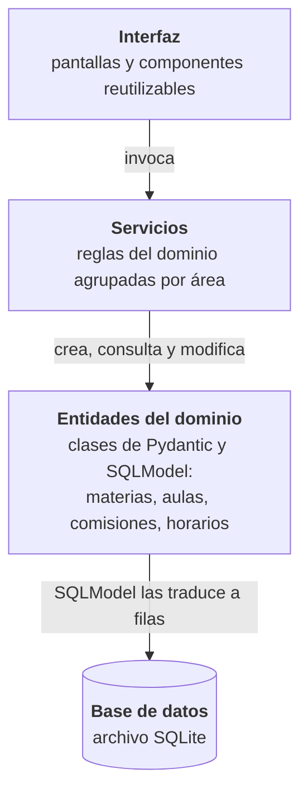

## 3.7 Arquitectura de la solución

Las secciones 3.5 y 3.6 fijaron qué se modela y cómo se guarda. Esta
sección explica sobre qué se construye la solución: qué
tecnologías la sostienen y por qué se eligieron, y cómo se reparten
las responsabilidades dentro del sistema.

### 3.7.1 Pila tecnológica

El sistema es una *aplicación web* que se usa desde el navegador,
escrita íntegramente en Python y con una base de datos local. La
Tabla @tab:pila resume las tecnologías que la componen y el papel de
cada una.

<!-- tabla: Pila tecnológica de la solución {#tab:pila} -->
| Capa | Tecnología | Rol |
| --- | --- | --- |
| Interfaz de usuario | Streamlit | Presenta la aplicación en el navegador: formularios, tablas y gráficos. |
| Lenguaje base | Python | Corre todo el sistema: interfaz, reglas del dominio y optimización. |
| Validación de datos | Pydantic | Verifica que los datos que circulan por el sistema tengan la forma esperada. |
| Mapeo objeto-relacional | SQLModel | Traduce las entidades del modelo a tablas de la base y viceversa. |
| Motor de base de datos | SQLite | Guarda todo el estado del sistema en un único archivo local. |
| Optimización | PuLP | Permite escribir el programa lineal con una notación cercana a la matemática. |
| Resolutor | CBC | Resuelve el programa lineal entero; es libre y de código abierto. |
| Visualización | Altair y componentes de Streamlit | Gráficos de saturación, tablas de resultados y calendarios semanales. |

#### 3.7.1.1 Python y Streamlit

Python es la decisión que condiciona al resto de la pila. Lo
elegimos por dos razones. La primera es que cuenta con un
ecosistema maduro de optimización y análisis de datos, de modo que
el programa lineal, los pronósticos de inscriptos y los reportes se
apoyan en herramientas disponibles en el mismo lenguaje. La segunda
es que permite construir también la interfaz sin cambiar de
lenguaje, lo que mantiene una única base de código y simplifica su
mantenimiento. Lenguajes como Java o JavaScript se descartaron: el
primero tiene un ecosistema de optimización libre más limitado y el
segundo es fuerte en interfaces pero débil en optimización
combinatoria.

Streamlit es una biblioteca de Python para construir aplicaciones
web interactivas sin escribir directamente el código propio de los
navegadores. Cada pantalla se describe como un programa corto que
se vuelve a ejecutar ante cada interacción, y la biblioteca se
encarga de dibujar formularios, tablas y gráficos, lo que da una
velocidad de desarrollo alta.

#### 3.7.1.2 SQLite y SQLModel para la persistencia

SQLite es un motor de base de datos relacional que no necesita un
servidor aparte: toda la base vive en un archivo que se puede
copiar, respaldar y compartir. No requiere instalación ni
configuración y alcanza con holgura para el volumen del problema,
que en el peor caso llega a algunos miles de registros por tabla.
Se descartó un motor con servidor, como PostgreSQL, por el costo de
instalación innecesario para un uso local, y una base documental,
como MongoDB, porque los datos del dominio son fuertemente
relacionales.

Sobre SQLite trabaja SQLModel, una biblioteca de *mapeo
objeto-relacional*: permite definir cada entidad del modelo una
sola vez y usar esa misma definición para validar los datos, para
guardarlos en la base y para pasarlos entre las distintas partes
del sistema. Además abstrae el motor, de modo que si el sistema
pasara a un uso multiusuario, cambiar SQLite por PostgreSQL
requeriría modificaciones acotadas.

#### 3.7.1.3 PuLP y CBC para el programa lineal

PuLP es una biblioteca para escribir problemas de programación
lineal entera como una sucesión de variables, restricciones y una
función objetivo, con una notación muy cercana a la formulación
matemática. La resolución la delega en un *resolutor* externo; el
sistema usa CBC (*Coin-or Branch and Cut*), libre y ampliamente
probado. PuLP separa la formulación del resolutor: si en el futuro
se quisiera usar otro, el modelo no cambia. Se descartaron
alternativas con una abstracción propia más alejada del vocabulario
matemático, porque en un proyecto académico la cercanía con la
formulación formal facilita la comprensión del modelo que desarrolla
la sección 3.8.

Los gráficos se generan con Altair, que se integra de manera
directa con Streamlit.

#### 3.7.1.4 De las reglas al código

Las secciones anteriores describieron en lenguaje llano las entidades
del dominio y sus reglas. Esta sección muestra, con fragmentos
abreviados del código del sistema (sin comentarios y con los mensajes
traducidos), cómo se plasma esa descripción y por qué la pila elegida
ahorra trabajo. Intervienen cuatro mecanismos.

**Una sola declaración por entidad.** Con SQLModel, cada entidad se
declara una vez como una clase de Python. Esa misma declaración define
la tabla de la base, las verificaciones de cada campo y las relaciones
con otras entidades:

```{.python fuente="src/database/models.py"}
class MateriaDB(SQLModel, table=True):
    __tablename__ = "materias"

    codigo: str = Field(primary_key=True, min_length=1)
    nombre: str = Field(min_length=1)
    horas_semanales: Optional[float] = Field(default=None, gt=0)
    horas_teoria: Optional[float] = Field(default=None, ge=0)
    horas_laboratorio: Optional[float] = Field(default=None, ge=0)
    periodo: str = Field(default="cuatrimestral")  # o "anual"
    virtual: bool = Field(default=False)
    grupo_id: Optional[str] = Field(
        default=None, foreign_key="grupo_materia.id")

    comisiones: list["ComisionDB"] = Relationship(back_populates="materia")
```

Cada línea traduce una afirmación del modelo conceptual: el código
identifica a la materia y no puede estar vacío, las horas semanales
son positivas, la materia pertenece a un grupo de materias y tiene
comisiones. No hace falta escribir a mano la sentencia que crea la
tabla ni las consultas para recorrer la relación: `materia.comisiones`
devuelve las comisiones de la materia.

**Invariantes que combinan varios campos.** Las reglas que no se
pueden expresar campo por campo se escriben como validadores de
Pydantic, que se ejecutan cada vez que se construye la entidad. Así,
un horario con un día inexistente o que termina antes de empezar no
llega a existir en el sistema:

```{.python fuente="src/domain/problem/horario.py"}
class Horario(Entity):
    comision_id: str
    dia: DiaSemana
    hora_inicio: time
    hora_fin: time

    @field_validator("dia")
    @classmethod
    def validar_dia(cls, v):
        if v not in DIAS_SEMANA:
            raise ValueError(f"el día debe ser uno de {DIAS_SEMANA}")
        return v

    @model_validator(mode="after")
    def validar_rango(self):
        if self.hora_fin <= self.hora_inicio:
            raise ValueError("la hora de fin debe ser posterior a la de inicio")
        return self
```

Algunas invariantes se refuerzan además en la propia base, como
restricciones del motor. Por ejemplo, la regla "un horario virtual es
siempre de teoría", porque un laboratorio exige presencialidad, se
declara junto a la tabla de horarios:

```{.python fuente="src/database/models.py"}
CheckConstraint(
    "NOT (virtual = 1 AND (tipo_clase IS NULL OR tipo_clase <> 'teorica'))",
    name="ck_horarios_virtual_teorica",
)
```

**Altas, bajas y modificaciones genéricas.** Como todas las entidades
se declaran de la misma manera, las operaciones básicas sobre la base
se escriben una sola vez, en una clase genérica, y se reutilizan para
cada entidad con una línea:

```{.python fuente="src/database/crud.py"}
class CRUDBase(Generic[T]):
    def __init__(self, model: type[T]):
        self.model = model

    def get(self, session, id):
        return session.get(self.model, id)

    def create(self, session, obj):
        session.add(obj)
        session.commit()
        session.refresh(obj)
        return obj

materia_crud = CRUDBase(MateriaDB)
aula_crud = CRUDBase(AulaDB)
horario_crud = CRUDBase(HorarioDB)
```

Sobre esta base, los servicios agregan lo propio de cada entidad: que
una comisión pertenezca a un cronograma o a un plan pero no a ambos
(§3.6.4.2), o que al borrar un plan se borren sus comisiones y horarios.

**El programa lineal, casi igual que en el papel.** PuLP permite
escribir las restricciones de la sección 3.8 con una notación muy
cercana a la matemática. La restricción R1, "cada horario presencial
va a exactamente un aula", queda así:

```{.python fuente="src/services/asignacion_aulas_service.py"}
for h in horarios_presenciales:
    prob += pulp.lpSum(x[h.id, a] for a in compatibles[h.id]) == 1
```

y la función objetivo, como la suma ponderada de sus tres términos
(en el código, `over` y `under` son la sobreocupación y la
subocupación que la sección 3.8 llama `sobre` y `sub`):

```{.python fuente="src/services/asignacion_aulas_service.py"}
prob += (
    config.lambda_over * pulp.lpSum(over.values())
    + config.lambda_under * pulp.lpSum(under.values())
    + config.lambda_sede_pref * pulp.lpSum(fuera_de_sede_preferida)
)
```

Esta cercanía entre la formulación y el código es la que permite
verificar, restricción por restricción, que el sistema resuelve el
problema que se planteó.

### 3.7.2 Separación en capas

Una práctica habitual de la ingeniería de software para organizar
un sistema es la *arquitectura en capas*: se agrupan las
responsabilidades en niveles y cada nivel sólo se apoya en los que
están debajo, nunca al revés. Así, un cambio en la presentación no
obliga a tocar las reglas del negocio, y las reglas se pueden
verificar sin pasar por la pantalla. El sistema se organiza en tres
capas de software apoyadas sobre la base de datos, como muestra la
Figura @fig:arquitectura.

<!-- figura: Arquitectura en capas del sistema {#fig:arquitectura} -->


- **Interfaz.** Reúne las pantallas de cada área funcional
  (materias, aulas, carreras, ciclos, cronogramas, planes,
  inscriptos e historial). Recoge lo que ingresa el usuario y
  muestra los resultados.
- **Servicios.** Concentra las reglas del dominio: qué significa
  crear una comisión, generar un plan de cursada a partir de un
  cronograma, validar un plan, resolver la virtualidad y el
  recursado en cascada, pronosticar inscriptos o correr el
  asignador de aulas.
- **Entidades del dominio.** Son las clases que representan los
  conceptos de las secciones 3.5 y 3.6, con sus verificaciones de
  campo e invariantes (§3.7.1.4). Los servicios trabajan sólo con
  ellas: crean, consultan, modifican y borran entidades, nunca
  escriben consultas ni tocan tablas. Como cada entidad está
  declarada con SQLModel, sabe guardarse y leerse: SQLModel la
  traduce a filas de la base y viceversa, y las operaciones que se
  repiten para todas (altas, bajas y modificaciones) se reúnen en un
  servicio genérico (§3.7.1.4). Por eso las entidades son la única
  pieza que conoce el motor relacional.

La regla central es que **sólo la capa de servicios expresa reglas
del dominio**. La interfaz recolecta lo que ingresa el usuario, se
lo pasa a un servicio y muestra la respuesta; cuando una pantalla
advierte, por ejemplo, que las horas de teoría más las de
laboratorio no suman las horas semanales de la materia, esa
verificación la hace un servicio. Esta disciplina es la que permite
probar la lógica del sistema de manera automática, sin depender de
la interfaz.
