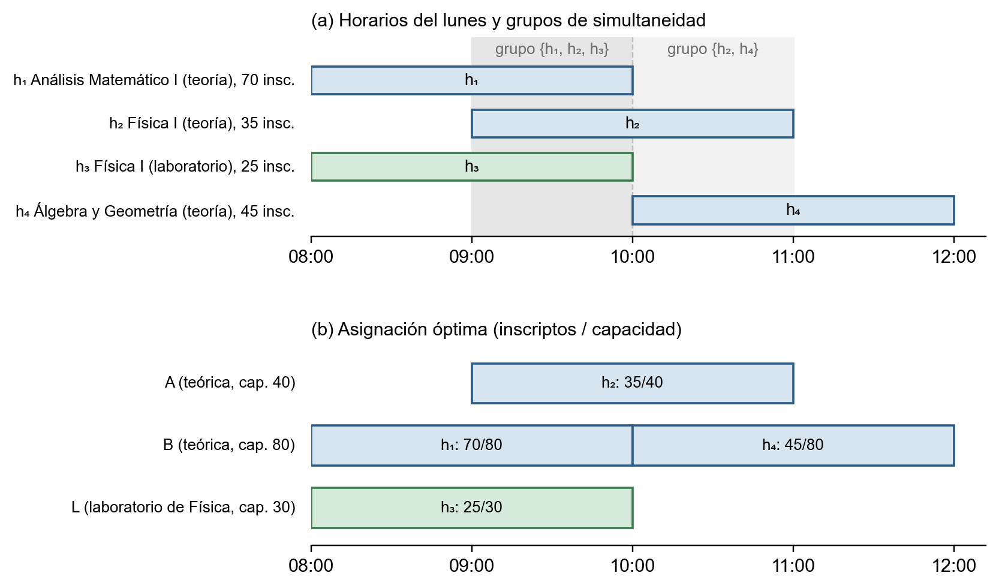

## 3.8 El problema de asignación como programa lineal entero

En las secciones anteriores definimos el problema como una
asignación de recursos bajo restricciones (sección 3.4), fijamos
las entidades y reglas del dominio (sección 3.5) y mostramos cómo
se organizan los datos y el sistema (secciones 3.6 y 3.7). En esta
sección presentamos cómo se resuelve efectivamente el problema:
lo modelamos como un programa lineal entero, explicamos cómo se
diagnostica cuando no tiene solución y cómo se le comunica el
resultado al usuario. En el cuerpo damos el modelo con la
profundidad necesaria para seguir el argumento; las derivaciones
completas, las formulaciones alternativas descartadas y los
análisis de complejidad están en el **Anexo B, Desarrollo formal
del programa lineal**.

### 3.8.1 De la operatoria al modelo

En la sección 3.4 el problema quedó planteado de dos maneras
complementarias: en forma coloquial (la Secretaría Técnica tiene
que decidir, para cada clase, en qué aula se dicta) y en forma
formal (una asignación de recursos bajo restricciones, con costo
ajustable). El paso siguiente es expresarlo como un **programa
lineal entero** que un *resolutor* pueda tratar de manera
sistemática.

#### 3.8.1.1 Por qué programación lineal entera

En §3.2.3 presentamos la programación lineal entera como la
herramienta clásica de la investigación operativa para problemas
de asignación combinatoria con restricciones estructuradas. Encaja
con nuestro problema por tres razones:

- **Las decisiones son binarias.** Un horario semanal se asigna a
  un aula (variable 1) o no (variable 0); no hay fracciones.
- **Las restricciones son lineales.** Todas las reglas de la
  sección 3.5 se expresan como sumas y desigualdades entre
  variables binarias.
- **El objetivo es lineal.** El costo de una asignación
  (sobreocupación, subocupación, alejamiento de la sede preferida)
  se mide horario por horario y se suma.

Con estas tres condiciones, el resolutor devuelve o bien la
solución óptima o bien la constancia de que no existe ninguna
solución factible.

#### 3.8.1.2 Qué decide el programa lineal y qué queda fuera

El programa lineal decide, simultáneamente:

1. **El aula de cada horario semanal presencial.** Es la decisión
   central.
2. **El tipo de los horarios que el cronograma dejó abierto.**
   Cuando el usuario no definió si un horario es de teoría o de
   laboratorio, lo resuelve el modelo.
3. **Una redistribución de la matrícula esperada entre las
   comisiones de un mismo dictado**, si el usuario la habilita y
   si mejora el aprovechamiento de las aulas.

Todo lo demás queda **fuera**: el modelo no decide qué comisiones
se abren ni en qué horarios se dictan (eso lo trae el
cronograma), no trata excepciones puntuales por fecha ni
indisponibilidades transitorias de aulas y no incorpora
preferencias personales de los docentes. Estos límites son
deliberados: un modelo acotado se resuelve con garantías y en
tiempos razonables.

#### 3.8.1.3 De vuelta al planteo de la sección 3.4

En §3.4.2 identificamos los cuatro componentes de un problema de
asignación de recursos bajo restricciones. En el programa lineal
se traducen así:

- **Recursos**: las aulas, con sus tipos y capacidades.
- **Demanda**: los horarios presenciales del plan, con su
  materia, comisión, inscriptos esperados y tipo declarado.
- **Restricciones**: las reglas de la sección 3.5, escritas como
  desigualdades lineales.
- **Criterio**: una función objetivo que combina sobreocupación,
  subocupación y alejamiento de la sede preferida, con pesos
  ajustables.

### 3.8.2 Formulación matemática resumida

Presentamos el programa lineal en su forma habitual: conjuntos,
parámetros, variables, función objetivo y restricciones. La
notación sigue los nombres del dominio de la sección 3.5 y la
convención usual de la investigación operativa.

#### 3.8.2.1 Conjuntos

- `H`: horarios del plan que participan del modelo. Se distinguen
  los presenciales y el subconjunto `H_∅` de horarios virtuales,
  que cuentan para el balance entre teoría y laboratorio pero no
  ocupan aula.
- `A`: aulas, con los subconjuntos `A_teo` (aulas teóricas y
  anfiteatros) y `A_lab(m)` (laboratorios compatibles con la
  materia `m`).
- `C`: comisiones activas del plan; `H(c)` son los horarios de la
  comisión `c`.
- `M`: materias del plan.
- `S`: sedes; `sede(a)` es la sede del aula `a`.
- `G`: grupos de materias; cada materia `m` pertenece a un único
  grupo `grupo(m)`.
- `Sim`: *grupos maximales de simultaneidad*, es decir, conjuntos
  de horarios que se dictan al mismo tiempo el mismo día (§3.8.3.3).
- `P_R11`: pares de horarios consecutivos de materias distintas
  de un mismo año y cuatrimestre de una carrera, separados por
  menos tiempo que el margen fijado.

#### 3.8.2.2 Parámetros

- `dur(h)`: duración en horas del horario `h`.
- `cap(a)`: capacidad del aula `a`.
- `tipo(h)`: tipo declarado del horario, o `⊥` si el cronograma
  dejó la decisión al modelo.
- `tipo(a)`: tipo del aula.
- `insc(h)`: inscriptos esperados en el horario, según el
  pronóstico de matrícula.
- `hteo(m)`, `hlab(m)`: horas de teoría y de laboratorio de la
  materia.
- `S_D(g)`, `S_B(g)`: conjunto obligatorio de sedes y lista
  ordenada de sedes preferidas del grupo `g`.
- `modo(g) ∈ {DURO, BLANDO}`: modo en que se aplica la regla de
  sedes al grupo `g`, elegido por el usuario.
- `sede_pref(h)`: sede preferida del horario `h`, definida sólo
  si su grupo está en modo BLANDO.
- `pin(h)`: aula fijada manualmente por el usuario para `h`, si
  la hay.
- Pesos y tolerancias del objetivo: `λ_sobre`, `λ_sub`,
  `λ_sede_pref`, `tol_sobre`, `tol_sub`, ajustables por el
  usuario.

#### 3.8.2.3 Variables de decisión

- `x[h, a] ∈ {0, 1}`: vale 1 si el horario `h` se asigna al aula
  `a`. Sólo existen para pares compatibles; los horarios de `H_∅`
  no tienen variables `x`.
- `t[h] ∈ {0, 1}`: para los horarios con `tipo(h) = ⊥`, vale 1 si
  se resuelven como laboratorio y 0 si se resuelven como teoría.
- `y[c, s] ∈ {0, 1}`: vale 1 si la comisión `c` se dicta en la
  sede `s`. Sólo se usa cuando se exige una única sede por
  comisión (R12).
- `sobre[h], sub[h] ≥ 0`: sobreocupación y subocupación del
  horario `h`.
- `α[k] ∈ [0, 1]`: proporción de la matrícula del dictado que
  corresponde a la comisión `k`. Sólo se usa cuando el usuario
  habilita la redistribución (R7).

#### 3.8.2.4 Función objetivo

Minimizar

$$
\lambda_{\text{sobre}} \sum_{h} \text{sobre}[h]
\;+\;
\lambda_{\text{sub}} \sum_{h} \text{sub}[h]
\;+\;
\lambda_{\text{sede\_pref}} \sum_{h \in H_{\text{BLANDO}}}
\sum_{\substack{a \in A \\ \text{sede}(a) \neq \text{sede\_pref}(h)}}
x[h, a]
$$

donde `H_BLANDO` son los horarios cuyo grupo está en modo BLANDO
y tienen sede preferida.

Los pesos por defecto son `λ_sobre = 10`, `λ_sub = 1` y
`λ_sede_pref = 5`. La asimetría entre los dos primeros expresa
que la sobreocupación (los alumnos no entran en el aula) es un
problema físico más grave que la subocupación (un aula grande
desaprovechada), que es un problema económico.

#### 3.8.2.5 Restricciones

Cada restricción traduce una regla de la sección 3.5. Las numeramos
R*n* y las presentamos en el orden en que se incorporan al
modelo.

**R1. Asignación única.** Cada horario presencial se asigna a
exactamente un aula.

$$\sum_{a \in A} x[h, a] = 1 \qquad \forall h \in H \setminus H_\emptyset$$

**R2. Compatibilidad entre tipo de aula y tipo de clase.** Las
clases teóricas van a aulas teóricas o anfiteatros; los
laboratorios, a laboratorios compatibles con la materia. Se
cumple por construcción: las variables `x[h, a]` de pares
incompatibles directamente no existen.

**R3. Sin superposición en un aula.** Dos horarios que se
superponen en el tiempo no comparten aula. En lugar de escribirla
par por par, se formula por grupos maximales de simultaneidad:
para cada grupo `S ∈ Sim` y cada aula `a`,

$$\sum_{h \in S} x[h, a] \le 1$$

Las ventajas de esta formulación se explican en §3.8.3.3.

**R4. Reparto entre teoría y laboratorio.** En cada comisión con
horas de teoría y de laboratorio, la suma de las duraciones de
sus horarios de cada tipo debe coincidir con las horas de la
materia. Los horarios virtuales cuentan para este balance aunque
no ocupen aula.

**R5. Coherencia de tipo en horarios abiertos.** Si `t[h]` decide
que un horario sin tipo es de teoría, el aula asignada debe ser
teórica; si decide laboratorio, debe ser un laboratorio
compatible con la materia. El vínculo se expresa con
desigualdades lineales entre `t[h]` y las variables `x`.

**R6. Sobreocupación y subocupación.** Las variables `sobre[h]` y
`sub[h]` miden el exceso o el faltante de capacidad del aula
asignada frente a los inscriptos esperados, con tolerancias:

$$
\text{sobre}[h] \ge \text{insc}(h) - (1 + \text{tol\_sobre}) \sum_{a} \text{cap}(a) \cdot x[h, a]
$$

y análogamente para `sub[h]`. Como el objetivo las minimiza, en
el óptimo toman exactamente el valor del exceso o del faltante.

**R7. Redistribución de la matrícula.** Cuando está habilitada,
los inscriptos esperados de cada comisión dejan de ser un dato y
pasan a ser el total del dictado multiplicado por `α[k]`; las
proporciones de cada dictado deben sumar 1.

**R8. Sedes admitidas por grupo de materias (modo duro).** Si el
grupo de la materia está en modo DURO, sólo se admiten aulas de
las sedes de su conjunto obligatorio:

$$x[h, a] = 0 \quad \text{si} \quad \text{sede}(a) \notin S_D(\text{grupo}(m(h)))$$

siempre que el conjunto no esté vacío. La excepción son los
laboratorios declarados compatibles con la materia, que se
admiten aunque estén en otra sede.

*Ejemplo.* Retomemos el tercer año de Ingeniería Mecánica (§3.5.5.3).
Si el grupo de Formación Básica está en modo duro con Pellegrini como
sede, los horarios de Métodos Numéricos sólo tienen variables para
aulas de Pellegrini; si el grupo de Mecánica está en modo duro con la
Siberia, los de Termodinámica sólo tienen variables para aulas de la
Siberia.

**R9. Aulas fijadas manualmente.** Si el usuario fijó el aula
de un horario y pidió respetar esas decisiones, se impone
`x[h, pin(h)] = 1`.

**R10. Preferencia de sede (modo blando).** Si el grupo está en
modo BLANDO, todas las sedes son admisibles (R8 no se aplica),
pero cada horario asignado fuera de la sede preferida suma
`λ_sede_pref` al objetivo (§3.8.2.4).

*Ejemplo.* Si el grupo de Mecánica pasa a modo blando con la Siberia
como preferida, un horario de Termodinámica puede ir a Pellegrini
cuando la Siberia está saturada en esa franja, pero cada vez que eso
ocurre el objetivo suma 5 (el peso por defecto). El asignador lo hace
sólo si así evita un costo mayor, por ejemplo dejar alumnos sin
lugar.

**R11. Continuidad de sede entre horarios consecutivos.** Para
cada par `(h₁, h₂) ∈ P_R11` y cada par de sedes distintas
`(s₁, s₂)`,

$$
\sum_{a \in A: \text{sede}(a) = s_1} x[h_1, a] +
\sum_{a \in A: \text{sede}(a) = s_2} x[h_2, a] \le 1
$$

Junto con R1, equivale a "si `h₁` se dicta en `s₁`, `h₂` no
puede dictarse en `s₂`": el alumno que sale de una clase llega a
tiempo a la siguiente.

*Ejemplo.* Con sólo dos sedes, la restricción dice simplemente que
dos clases consecutivas del mismo alumno no pueden quedar una en
Pellegrini y la otra en la Siberia. Es justamente el caso de tercer
año de Mecánica: si Métodos Numéricos termina a las 10:00 en
Pellegrini y Termodinámica empieza a las 10:15, con el margen por
defecto de 30 minutos las dos tienen que dictarse en la misma sede,
y como Métodos Numéricos está atada a Pellegrini, Termodinámica
también. Si el grupo de Mecánica estuviera en modo duro en la
Siberia, el problema no tendría solución: la verificación previa lo
detecta (§3.8.4) y el usuario puede mover uno de los horarios,
achicar el margen o pasar el grupo a modo blando, aceptando la
penalización de R10.

Aparte de este caso, el mismo margen se aplica a un caso puntual:
dos horarios consecutivos de una misma comisión en el mismo día,
algo que rara vez ocurre. Si se exige R12, ese caso ya queda
cubierto.

**R12. Misma sede por comisión.** Es la regla que mira al
docente. Cuando el usuario la exige, las variables `y[c, s]`
obligan a que todos los horarios de una comisión se dicten en la
misma sede. *Ejemplo:* si una comisión de Termodinámica tiene clases
el lunes y el jueves, las dos van a la Siberia o las dos a
Pellegrini, para que quien la dicta no cambie de sede durante la
semana.

#### 3.8.2.6 Un ejemplo pequeño

Para ver cómo queda escrito el programa, tomamos un caso mínimo:
cuatro horarios del lunes por la mañana y tres aulas de una misma
sede. Los horarios se numeran (`h₁` a `h₄`) y las aulas se nombran
con letras: dos teóricas, **A** y **B**, y un laboratorio, **L**. Las
Tablas @tab:ej-horarios y @tab:ej-aulas resumen los datos, y la
Figura @fig:ej-lp los muestra sobre la línea de tiempo.

<!-- tabla: Horarios del ejemplo {#tab:ej-horarios} -->
| Horario | Materia | Tipo | Lunes | Inscriptos esperados |
| :---: | --- | --- | :---: | :---: |
| `h₁` | Análisis Matemático I | teoría | 08:00 a 10:00 | 70 |
| `h₂` | Física I | teoría | 09:00 a 11:00 | 35 |
| `h₃` | Física I | laboratorio | 08:00 a 10:00 | 25 |
| `h₄` | Álgebra y Geometría | teoría | 10:00 a 12:00 | 45 |

<!-- tabla: Aulas del ejemplo {#tab:ej-aulas} -->
| Aula | Tipo | Capacidad |
| :---: | --- | :---: |
| A | teórica | 40 |
| B | teórica | 80 |
| L | laboratorio de Física | 30 |

{#fig:ej-lp width=15cm}

**Las variables.** Cada variable responde una pregunta de sí o no:
$x_{1A}$ vale 1 si el horario `h₁` va al aula A, y 0 si no. Como las
clases de teoría sólo pueden ir a aulas teóricas y el laboratorio
sólo a L (R2), hacen falta siete variables: $x_{1A}$, $x_{1B}$,
$x_{2A}$, $x_{2B}$, $x_{3L}$, $x_{4A}$ y $x_{4B}$. Además, para cada
horario hay dos medidas de qué tan mal le queda el aula: $\text{sobre}_i$,
cuántos alumnos quedan sin lugar, y $\text{sub}_i$, cuántos asientos
sobran más allá de lo aceptable.

**Cuánto vacío se tolera.** Se usan los valores por defecto: no se
tolera ningún alumno sin lugar, pero sí que quede vacío hasta un 20 %
del aula. En un aula de 80 lugares se aceptan 16 asientos vacíos sin
penalización; recién lo que sobra por encima de eso cuenta como
subocupación.

**Función objetivo.** *Sumar, con peso 10, los alumnos que quedan sin
lugar y, con peso 1, los asientos vacíos de más, y hacer esa suma lo
más chica posible.* El peso 10 dice que un alumno sin lugar es diez
veces peor que un asiento vacío.

$$\min \; 10 \,(\text{sobre}_1 + \text{sobre}_2 + \text{sobre}_3 + \text{sobre}_4) \;+\; (\text{sub}_1 + \text{sub}_2 + \text{sub}_3 + \text{sub}_4)$$

**R1. Cada horario en exactamente un aula.** *De las aulas posibles
para cada horario, se elige una y sólo una.* Por ejemplo, para `h₁`
la suma $x_{1A} + x_{1B}$ tiene que dar 1: va a A o va a B, nunca a
las dos ni a ninguna.

$$x_{1A} + x_{1B} = 1, \qquad x_{2A} + x_{2B} = 1, \qquad x_{3L} = 1, \qquad x_{4A} + x_{4B} = 1$$

**R3. Sin superposición.** *Dos horarios que se dictan a la vez no
pueden estar en la misma aula.* Entre las 9 y las 10 se dictan a la
vez `h₁`, `h₂` y `h₃`; entre las 10 y las 11, `h₂` y `h₄` (`h₁`
termina justo cuando empieza `h₄`, así que esos dos sí pueden
compartir aula). Por ejemplo, $x_{1A} + x_{2A} \le 1$ dice que, de
`h₁` y `h₂`, a lo sumo uno ocupa el aula A:

$$x_{1A} + x_{2A} \le 1, \qquad x_{1B} + x_{2B} \le 1, \qquad x_{2A} + x_{4A} \le 1, \qquad x_{2B} + x_{4B} \le 1$$

En L sólo puede ir `h₃`, así que no hace falta escribir nada para esa
aula.

**R6. Alumnos sin lugar y asientos vacíos de más.** *Para cada
horario, los alumnos sin lugar son los inscriptos menos la capacidad
del aula que le toca; los asientos vacíos de más son la capacidad
menos los inscriptos, descontando el 20 % tolerado.* Como no se sabe
de antemano qué aula le toca, la capacidad se escribe con las
variables: para `h₁`, $40\,x_{1A} + 80\,x_{1B}$ vale 40 si va a A y
80 si va a B. Para los asientos vacíos se usa la capacidad que
cuenta, el 80 % del aula (32 en A, 64 en B y 24 en L). Si la cuenta da
negativa, la medida queda en cero.

$$\text{sobre}_1 \ge 70 - (40\,x_{1A} + 80\,x_{1B}), \qquad \text{sub}_1 \ge (32\,x_{1A} + 64\,x_{1B}) - 70$$

$$\text{sobre}_2 \ge 35 - (40\,x_{2A} + 80\,x_{2B}), \qquad \text{sub}_2 \ge (32\,x_{2A} + 64\,x_{2B}) - 35$$

$$\text{sobre}_3 \ge 25 - 30\,x_{3L}, \qquad \text{sub}_3 \ge 24\,x_{3L} - 25$$

$$\text{sobre}_4 \ge 45 - (40\,x_{4A} + 80\,x_{4B}), \qquad \text{sub}_4 \ge (32\,x_{4A} + 64\,x_{4B}) - 45$$

El resto de las restricciones no interviene: los tipos de clase están
declarados (R4 y R5 se cumplen con los datos), hay una sola sede (R8,
R10, R11 y R12) y no hay aulas fijadas ni redistribución de matrícula
(R7 y R9).

**La solución.** `h₃` va a L, que es su única opción, y cabe sin
problemas. Para las teorías, como `h₂` se dicta a la vez que `h₁` y
que `h₄`, tiene que ir a un aula distinta de la de ambos, mientras
que `h₁` y `h₄`, que no se superponen, pueden compartir la otra. Quedan
entonces dos alternativas, que las Tablas @tab:ej-alt1 y @tab:ej-alt2
detallan. En cada una, los asientos vacíos de más son los que sobran
menos los tolerados (el 20 % del aula: 8 en A y 16 en B).

<!-- tabla: Alternativa 1: h₂ en A, y h₁ y h₄ en B {#tab:ej-alt1} -->
| Horario | Aula | Inscriptos | Alumnos sin lugar | Asientos vacíos de más | Suma al costo |
| :---------: | :--------: | :-----------: | :-------------: | :-------------: | :-----------: |
| `h₁` | B (80) | 70 | 0 | 10 − 16 → 0 | 0 |
| `h₂` | A (40) | 35 | 0 | 5 − 8 → 0 | 0 |
| `h₄` | B (80) | 45 | 0 | 35 − 16 = 19 | 19 |
| **Total** | | | | | **19** |

<!-- tabla: Alternativa 2: h₂ en B, y h₁ y h₄ en A {#tab:ej-alt2} -->
| Horario | Aula | Inscriptos | Alumnos sin lugar | Asientos vacíos de más | Suma al costo |
| :---------: | :--------: | :-----------: | :-------------: | :-------------: | :-----------: |
| `h₁` | A (40) | 70 | 70 − 40 = 30 | 0 | 10 · 30 = 300 |
| `h₂` | B (80) | 35 | 0 | 45 − 16 = 29 | 29 |
| `h₄` | A (40) | 45 | 45 − 40 = 5 | 0 | 10 · 5 = 50 |
| **Total** | | | | | **379** |

En la primera alternativa nadie queda sin lugar y el único costo son
los 19 asientos vacíos de más de `h₄`. En la segunda, `h₁` y `h₄` no
entran en el aula chica: 35 alumnos sin lugar, que con peso 10 suman
350, más los 29 asientos vacíos de más de `h₂`. El resolutor elige la
primera, con costo 19 contra 379. El ejemplo muestra en pequeño el
criterio del objetivo: se acepta un aula grande a medio llenar antes
que dejar alumnos sin lugar. En un cuatrimestre real el razonamiento
es el mismo, pero con cientos de horarios y miles de variables.

### 3.8.3 Herramientas conceptuales para el diagnóstico

Los resultados matemáticos presentados en la sección 3.2 se usan
para diagnosticar el modelo: antes de resolverlo, durante la
resolución y después de ella.

#### 3.8.3.1 Principio del palomar

El *principio del palomar* (§3.2.4.2) dice que si se reparten
`n + 1` objetos en `n` cajas, alguna recibe al menos dos. En el
asignador funciona como prueba rápida de infactibilidad: si en un
mismo momento de la semana hay `k` horarios simultáneos y sólo
`k − 1` aulas compatibles, el problema no tiene solución, y no
hace falta resolverlo para saberlo. La prueba se hace primero con
todas las aulas y luego por tipo (teóricas por un lado,
laboratorios compatibles por otro), como parte de la verificación
previa (§3.8.4).

#### 3.8.3.2 Teorema de Hall y apareamiento bipartito

Cuando el palomar no detecta nada pero el problema igualmente es
infactible, recurrimos al *teorema de Hall* (§3.2.4.3). Se arma un
grafo bipartito con los horarios de un lado, las aulas del otro y
una arista por cada par compatible. Existe una asignación que le
da un aula distinta a cada horario si y sólo si todo subconjunto
de horarios tiene, entre todos, al menos tantas aulas compatibles
como horarios.

Cuando la condición falla, el sistema informa el subconjunto de
horarios que la viola junto con las aulas compatibles con ellos. La lectura es
directa: "estas materias compiten por estas aulas y no alcanzan".
La verificación se hace por momento de simultaneidad y por sede.

#### 3.8.3.3 Grupos de simultaneidad

R3 impide que dos horarios superpuestos compartan aula. Escribirla
par por par funciona, pero si veinte horarios coinciden a la misma
hora hay 190 pares, y cada uno suma una restricción por aula.

Hay una forma más simple: si en un instante hay varios horarios en
curso, alcanza con decir "de todos ellos, a lo sumo uno ocupa esta
aula". A ese conjunto de horarios en curso a la vez lo llamamos
*grupo de simultaneidad*, y es *maximal* cuando no está contenido en
otro más grande. En el ejemplo de §3.8.2.6, de 9 a 10 están en curso
`h₁`, `h₂` y `h₃`: para cada aula alcanza con una sola desigualdad
que sume las variables de los tres, en lugar de una por cada par.

Las dos formas admiten las mismas asignaciones, pero la agrupada
genera muchas menos restricciones (cuando los horarios son intervalos
de tiempo, los grupos maximales son a lo sumo tantos como horarios,
según Golumbic [5]) y le da al resolutor una relajación más ajustada
(§3.2.3.3), así que tiene que ramificar menos. En programación lineal
entera se las conoce como *desigualdades de clique*, y Wolsey [12]
muestra que superan a las formuladas por pares. El Anexo B compara
ambas sobre casos de prueba.

### 3.8.4 Verificación estructural previa

Antes de llamar al resolutor, el sistema hace una **verificación
estructural previa** que detecta situaciones que hacen imposible
cualquier asignación. Si encuentra al menos un bloqueo, la
corrida se detiene y se informa el detalle, sin gastar tiempo en
resolver un problema que ya sabemos que no tiene solución. Las
situaciones que verifica son:

1. **R1. Horarios sin aula posible**, por tipo, por compatibilidad
   de laboratorio o por sede admitida.
2. **R2+R3. Falta de aulas de un tipo en una franja.** Versión del
   principio del palomar por tipo de aula: no basta con que
   alcancen las aulas en total; tienen que alcanzar las del tipo
   requerido.
3. **R4. Reparto imposible entre teoría y laboratorio**, cuando
   las duraciones de los horarios de una comisión no pueden
   cerrar con las horas de la materia.
4. **R9. Aula fijada que ya no es válida**, porque cambió de
   tipo o su sede quedó fuera de las admitidas para el grupo.
5. **R11. Horarios consecutivos sin sede común posible.**
6. **R11 a nivel de recorrido.** Ninguna combinación de comisiones
   le permite a un alumno de un año y cuatrimestre dados cursar
   sin traslados imposibles.
7. **Palomar por sede**, aplicado a cada franja y sede.
8. **Hall por sede**, sobre la oferta de laboratorios
   compatibles.

Cada bloqueo se informa con la regla involucrada, su gravedad,
una descripción y las materias, comisiones o aulas afectadas,
junto con una acción sugerida para resolverlo. Sin esta
verificación, un plan con problemas estructurales podía ocupar al
resolutor varios minutos y terminar en un "infactible" sin
ninguna pista sobre la causa.

### 3.8.5 Construcción, resolución y aplicación

El programa lineal no es fijo: en cada corrida se arma desde cero
con los datos vigentes y las opciones que eligió el usuario. Los
horarios virtuales se separan (cuentan para R4 pero no ocupan aula),
sólo se crean variables para los pares horario-aula compatibles (con
lo que R2 y R8 se cumplen de antemano), se calculan los grupos de
simultaneidad y los pares de horarios consecutivos en riesgo de
traslado, y se plantean las restricciones que correspondan. El
resolutor devuelve la solución óptima, la constancia de
infactibilidad o el aviso de que se agotó el tiempo máximo.

La solución óptima se aplica de una sola vez al patrón semanal: cada
horario presencial queda con su aula y, si su tipo estaba abierto,
con el tipo que resolvió el modelo; las aulas fijadas que el usuario
pidió respetar no se tocan. La corrida queda registrada con su
configuración y sus indicadores, de modo que puede reproducirse y
compararse con otras.

### 3.8.6 Diagnóstico de la infactibilidad y veredicto

Cuando el resolutor declara el problema infactible y la verificación
previa no había encontrado bloqueos, el sistema busca la causa
relajando las restricciones candidatas (R3, R4, R5, R8, R11 y R12) de
a una por vez: si al quitar una el problema pasa a tener solución,
esa restricción es sospechosa. Entre varias causas posibles se
informa primero la que admite la acción más directa del usuario, como
flexibilizar la sede de un grupo de materias concreto; si ninguna
alcanza sola, se prueban combinaciones. La técnica aproxima el
*subsistema irreducible de infactibilidad*, el menor conjunto de
restricciones cuya combinación impide toda solución (Anexo B).

Toda corrida termina con un **veredicto** en lenguaje llano: el
estado final, la causa probable si la hay, los horarios que quedaron
sin aula y la configuración usada. Así, en lugar de un "infactible"
opaco, el usuario recibe una recomendación concreta con la que puede
iterar.

### 3.8.7 Cierre de la sección

La asignación queda formulada como un programa lineal entero cuyas
restricciones R1 a R12 traducen las reglas de la sección 3.5. La
verificación previa evita resolver problemas sin solución, y el
diagnóstico y el veredicto convierten cada corrida en información
útil para el usuario. La sección siguiente trata las validaciones
que garantizan que los datos que llegan al modelo cumplen lo que las
restricciones dan por supuesto.
