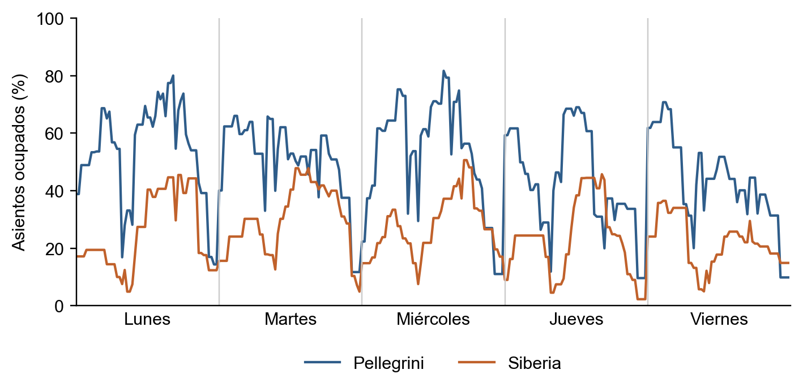
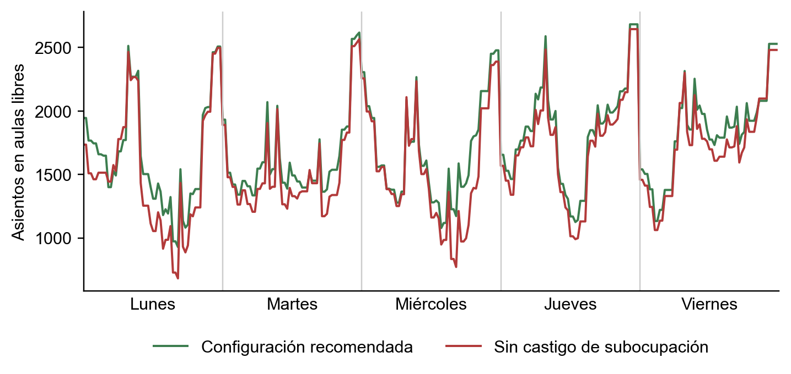

## 3.10 Caso ensayado: primer cuatrimestre de 2026

Para comprobar que la solución funciona con datos reales, la ensayamos
sobre el primer cuatrimestre de 2026, con el cronograma consolidado
que entregó la facultad. Esta sección muestra cómo quedó el plan, cómo
se configuró el asignador, cómo quedaron asignadas las aulas en dos
años de cursada y cómo cambia el resultado si se cambian los pesos.
El uso de la interfaz se describe en el manual de usuario (Anexo C).

### 3.10.1 El caso y la configuración del asignador

El plan de cursada del cuatrimestre reúne 248 materias, 352 comisiones
y 634 horarios semanales, de los cuales 88 son virtuales y no ocupan
aula. Los 546 horarios presenciales se reparten entre las 53 aulas de
las dos sedes: 25 teóricas y 5 laboratorios en Pellegrini, y 20
teóricas y 3 laboratorios en la Siberia. Los inscriptos esperados de
cada comisión se pronosticaron con suavizado exponencial simple
sobre la serie histórica.

La Tabla @tab:caso-config resume la configuración con la que se corrió
el asignador. Los modos de los grupos de materias responden a lo
discutido en §3.8.2.5: las materias comunes de Formación Básica, que
se dictan sí o sí en Pellegrini, quedan en modo duro, y los grupos de
las carreras de la Siberia (Civil, Eléctrica, Electrónica y Mecánica)
quedan en modo blando, porque sus alumnos también cursan esas comunes
y un modo duro haría infactible el problema. Esa configuración de
grupos es parte de la definición del caso y no se toca en los
escenarios de §3.10.4.

<!-- tabla: Configuración del asignador en el caso ensayado {#tab:caso-config} -->
| Parámetro | Valor |
| :-------------------------------------------- | :--------------------: |
| Peso de la sobreocupación (`λ_sobre`) | 25 |
| Peso de la subocupación (`λ_sub`) | 1 |
| Tolerancia de sobreocupación (`tol_sobre`) | 10 % |
| Tolerancia de subocupación (`tol_sub`) | 35 % |
| Peso por salir de la sede preferida (`λ_sede_pref`) | 15 |
| Margen mínimo entre sedes | 30 minutos |
| Misma sede para toda la comisión (R12) | sí |
| Grupos en modo duro | Formación Básica, Industrial, Agrimensura y otros 6 |
| Grupos en modo blando | Civil, Eléctrica, Electrónica, Mecánica y otros 4 |

El asignador encontró la solución óptima en menos de un minuto (Figura
@fig:cap-veredicto): los 546 horarios presenciales quedaron con aula,
ninguno sin asignar.

{#fig:cap-veredicto width=15cm}

### 3.10.2 Dos años de cursada

Para ver el resultado en detalle tomamos dos años de cursada del
primer cuatrimestre: cuarto año de Ingeniería Industrial, que se
dicta íntegramente en Pellegrini, y tercer año de Ingeniería
Eléctrica, una carrera de la Siberia cuyos alumnos cursan materias
comunes en Pellegrini. Las Tablas @tab:caso-industrial y
@tab:caso-electrica muestran sus horarios con el aula asignada; los
cronogramas completos, exportados desde la herramienta, están en el
Anexo D.

<!-- tabla: Aulas asignadas a cuarto año de Ingeniería Industrial {#tab:caso-industrial} -->
| Día | Horario | Materia | Aula (capacidad) | Inscriptos |
| ----------- | :---------------: | ------------------------------ | :--------------: | :----------: |
| Lunes | 16:30 a 18:30 | Legislación | AULA-11 (71) | 64 |
| Lunes | 18:30 a 21:00 | Decisiones Estadísticas y Control | AULA-14 (112) | 75 |
| Martes | 18:00 a 20:00 | Ambiente Sustentable, Higiene y Seguridad | AULA-11 (71) | 68 |
| Martes | 20:00 a 23:00 | Procesos de Producción II | AULA-11 (71) | 70 |
| Miércoles | 11:30 a 13:30 | Costos y Control de Gestión | AULA-30 (181) | 157 |
| Miércoles | 13:45 a 16:45 | Procesos de Producción II | AULA-31 (108) | 70 |
| Miércoles | 17:00 a 20:00 | Decisiones Estadísticas y Control | AULA-14 (112) | 75 |
| Viernes | 13:00 a 16:00 | Costos y Control de Gestión | AULA-30 (181) | 157 |
| Viernes | 16:00 a 18:00 | Comercialización | AULA-14 (112) | 121 |
| Viernes | 18:00 a 20:00 | Ambiente Sustentable, Higiene y Seguridad | AULA-27 (70) | 68 |

En cuarto año de Industrial casi todas las clases quedan en un aula
ajustada a su matrícula: Costos y Control de Gestión, con 157
inscriptos, va al aula de 181 lugares, y Legislación, con 64, a una
de 71. La única excepción es Comercialización, con 121 inscriptos en
un aula de 112: el exceso está dentro de la tolerancia del 10 % de la
configuración, por eso el asignador la acepta.

<!-- tabla: Aulas asignadas a tercer año de Ingeniería Eléctrica {#tab:caso-electrica} -->
| Día | Horario | Materia | Sede | Aula (capacidad) | Inscriptos |
| ----------- | :---------------: | ------------------------ | :-----------: | :-----------------: | :----------: |
| Lunes | 10:30 a 13:00 | Matemática Aplicada | Pellegrini | AULA-23 (40) | 27 |
| Lunes | 17:00 a 20:00 | Materiales Eléctricos | Siberia | REACTOR-Aula-01 (25) | 10 |
| Martes | 13:45 a 17:45 | Electromagnetismo Aplicado | Siberia | ETA-Aula-12 (28) | 8 |
| Miércoles | 09:30 a 12:00 | Matemática Aplicada | Pellegrini | AULA-23 (40) | 27 |
| Miércoles | 17:00 a 20:00 | Materiales Eléctricos | Siberia | REACTOR-Aula-01 (25) | 10 |
| Jueves | 13:00 a 16:00 | Economía y Costos (comisión 1) | Siberia | MEC-Aula-01 (54) | 33 |
| Jueves | 13:45 a 17:45 | Electromagnetismo Aplicado | Siberia | ETA-Aula-11 (22) | 8 |
| Jueves | 18:00 a 21:00 | Economía y Costos (comisión 2) | Siberia | ETA-Aula-08 (47) | 33 |

*Nota.* Se omiten los horarios de Probabilidad y Estadística, materia
común con tres comisiones en Pellegrini entre las que cada alumno
elige una; están en el cronograma completo del Anexo D.

Tercer año de Eléctrica muestra el caso del traslado. El lunes y el
miércoles los alumnos cursan a la mañana Matemática Aplicada en
Pellegrini y a la tarde Materiales Eléctricos en la Siberia: entre una
y otra hay varias horas, mucho más que el margen de 30 minutos, así
que el traslado es posible y el asignador lo admite. Si esas dos
clases estuvieran a menos de media hora, la restricción R11 las
obligaría a compartir sede, y como Matemática Aplicada es una común de
Formación Básica, atada a Pellegrini, la de la carrera tendría que
dictarse también ahí; es posible porque el grupo de Eléctrica está en
modo blando. El jueves, en cambio, las dos comisiones de Economía y
Costos permiten que el alumno elija la que no se superpone con
Electromagnetismo Aplicado.

La tabla muestra además cómo el asignador ajusta el aula a la
matrícula: Materiales Eléctricos, con 10 inscriptos, va a un aula de
25 lugares, y Electromagnetismo Aplicado, con 8, a aulas de 22 y 28,
lo que deja libres las aulas más grandes de la Siberia.

### 3.10.3 Cómo quedó ocupada la facultad

La Tabla @tab:caso-metricas resume las métricas principales del
resultado, calculadas con el criterio estricto (sin tolerancias):
un horario está sobreocupado si tiene más inscriptos que lugares, y
subocupado si queda vacío más del 20 % del aula (los asientos vacíos
se cuentan sólo en esos horarios).

<!-- tabla: Métricas del caso ensayado {#tab:caso-metricas} -->
| Métrica | Valor |
| ---------------------------------------- | :------------------------------: |
| Horarios presenciales con aula | 546 de 546 |
| Horarios con más inscriptos que lugares | 103 (1.126 alumnos sin lugar en total) |
| Horarios con lugares de sobra | 292 (5.422 asientos vacíos en total) |
| Ocupación mediana de las aulas | 77 % |
| Horarios fuera de su sede preferida | 34 |

| Aulas usadas | 49 de 53 |
| Asientos en aulas libres en la franja más ocupada | 963 de 2.871 |

La Figura @fig:caso-ocupacion muestra cómo se llenan las aulas teóricas
de cada sede a lo largo de la semana. Pellegrini concentra la mayor
parte del dictado y llega a picos de alrededor del 80 % de sus
asientos ocupados los lunes y miércoles entre las 16 y las 18; la
Siberia apenas supera el 50 % en su momento de más carga, el miércoles
a las 18. Incluso en la franja más cargada de
la semana quedan casi mil asientos en aulas libres, la holgura
disponible para cambios durante el cuatrimestre.

{#fig:caso-ocupacion width=15cm}

### 3.10.4 El mismo caso con otros parámetros

Para ver qué tan sensible es el resultado a los pesos, corrimos el
asignador sobre el mismo plan con distintas configuraciones, sin tocar
los grupos de materias ni sus modos. La Tabla @tab:caso-escenarios
compara los resultados.

<!-- tabla: El caso ensayado con distintas configuraciones del asignador {#tab:caso-escenarios} -->
| Configuración | Alumnos sin lugar | Asientos vacíos | Asientos libres en la franja más ocupada | Fuera de sede preferida |
| ------------------------------------ | :----------: | :----------: | :-------------: | :-----------: |
| La del caso (Tabla @tab:caso-config) | 1.116 | 5.333 | 967 | 34 |
| Sin castigo de subocupación (`λ_sub = 0`) | 1.115 | 8.831 | 681 | 34 |
| Subocupación cinco veces más pesada (`λ_sub = 5`) | 1.122 | 5.340 | 892 | 40 |
| Sede preferida muy pesada (`λ_sede_pref = 150`) | 1.120 | 5.171 | 977 | 16 |
| Recomendada (`tol_sobre = 0 %`, `tol_sub = 20 %`) | 872 | 4.783 | 928 | 35 |

*Nota.* Todas las corridas son óptimas y asignan los 546 horarios.
Alumnos sin lugar y asientos vacíos con el criterio estricto de la
Tabla @tab:caso-metricas.

**Sin castigo de subocupación.** Si un aula a medio llenar no cuesta
nada, al asignador le da lo mismo usar un aula grande que una chica, y
termina ocupando aulas grandes con grupos chicos: Análisis de
Mecanismos, con 28 inscriptos, va a un aula de 143 lugares, y
Decisiones Estadísticas, con 75, a la de 181. Los asientos vacíos
suben de 5.333 a 8.831 sin que baje la cantidad de alumnos sin lugar,
y en la franja más ocupada quedan 681 asientos libres en lugar de
967: un 30 % menos de capacidad disponible para otras actividades o
para absorber cambios. La Figura @fig:caso-libres lo muestra franja a
franja: la diferencia se concentra justamente en los momentos de más
demanda.

{#fig:caso-libres width=15cm}

**Pesos de subocupación y de sede más altos.** Multiplicar por cinco el
peso de la subocupación casi no cambia el resultado: con la tolerancia
del 35 % la mayoría de los vacíos ya no se penaliza. Subir mucho el
peso de la sede preferida baja de 34 a 16 los horarios que salen de su
sede, con un costo mínimo en el resto de las métricas.

**La configuración recomendada.** El cambio que más mejora el
resultado no es un peso sino las tolerancias. La configuración del
caso tolera un 10 % de sobreocupación, y el asignador aprovecha ese
margen: deja pasar muchos excesos chicos que, sumados, son más de mil
alumnos sin lugar. Sin tolerancia de sobreocupación y con una de
subocupación del 20 %, manteniendo los demás pesos, los alumnos sin
lugar bajan un 22 % (de 1.116 a 872), los horarios sobreocupados pasan
de 104 a 26, los asientos vacíos bajan un 10 % y la holgura en la
franja más ocupada se mantiene. La corrida, además, tarda la mitad.
