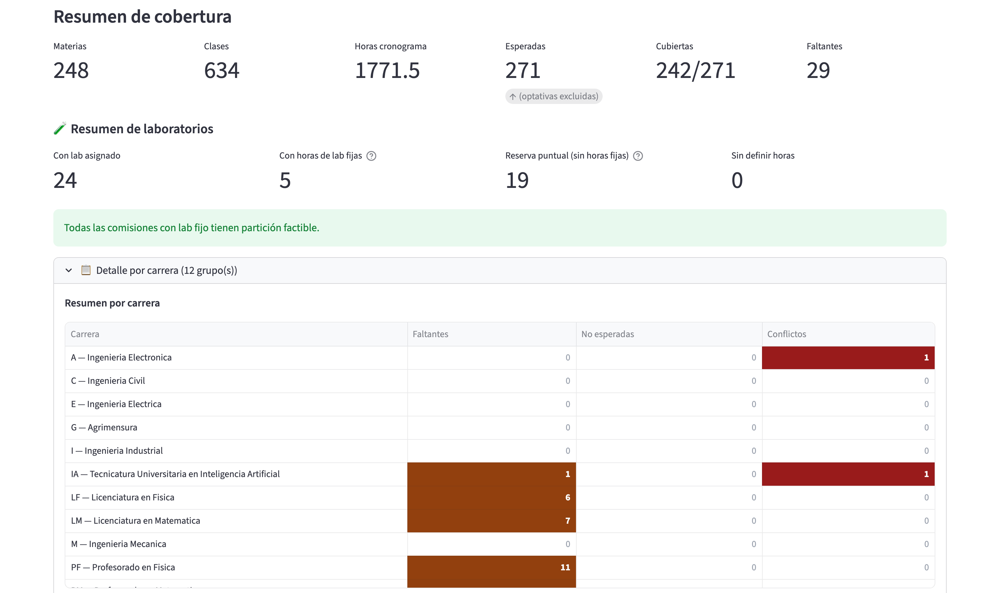
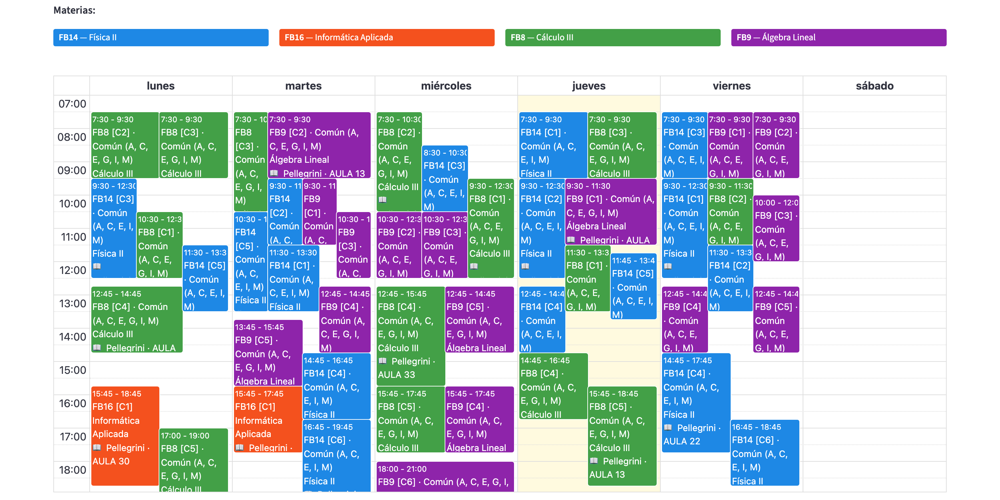
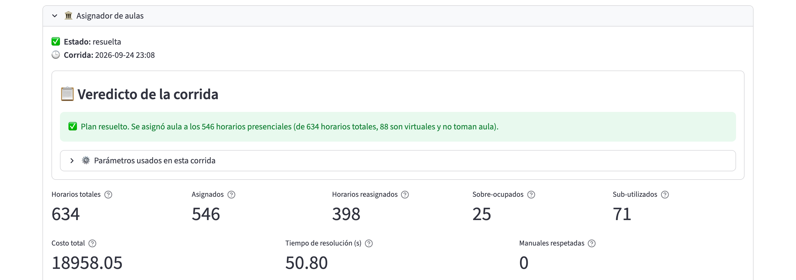

## 3.10 La herramienta en acción

> **Estado: estructura con marcadores.** El contenido depende de los
> casos de prueba que elijamos presentar. Cada sección indica qué
> poner y de dónde sacarlo. Extensión orientativa: 6 a 8 páginas,
> con el detalle paso a paso derivado al Anexo C (manual de usuario).

### 3.10.1 Recorrido guiado por la interfaz

Recorremos las pantallas principales en el orden en que se usan
cada cuatrimestre (cronograma, plan de cursada y asignación de
aulas), sobre los datos del primer cuatrimestre de 2026. El
detalle paso a paso de cada pantalla está en el manual de usuario
(Anexo C).

**Validación del cronograma.** Una vez cargada la planilla de
horarios, el sistema la contrasta con la oferta del ciclo. La Figura
@fig:cap-validar muestra el resumen: cuántas materias esperadas están
cubiertas y cuántas faltan, el estado de los laboratorios y, por
carrera, las materias faltantes, las no esperadas y los conflictos
horarios. Las celdas resaltadas señalan dónde conviene mirar primero.

{#fig:cap-validar width=15cm}

**El plan de cursada.** Generado el plan, sus horarios se ven en una
grilla semanal que se puede filtrar por carrera, año y cuatrimestre.
En la Figura @fig:cap-plan, cada bloque indica la materia, la
comisión, las carreras que la comparten y, después de correr el
asignador, la sede y el aula asignadas.

{#fig:cap-plan width=15cm}

**La corrida del asignador.** Cada corrida termina con un veredicto
en lenguaje llano y con sus indicadores principales: horarios
asignados, horarios sobreocupados y subutilizados, costo de la
solución y tiempo de resolución (Figura @fig:cap-veredicto).

{#fig:cap-veredicto width=15cm}

> **Para completar:** si se quiere, sumar una captura del calendario
> del cronograma (está en `figuras/capturas/`).

### 3.10.2 Caso de estudio integral

> **Para completar:** el caso principal del informe, con datos reales
> de un cuatrimestre de la FCEIA (por ejemplo, el 1C 2026 con el
> cronograma consolidado). Describir:
>
> - el punto de partida: cantidad de materias, comisiones, horarios
>   semanales, aulas y sedes involucradas;
> - la carga del cronograma con la plantilla multihoja y los
>   hallazgos de la revisión hoja por hoja (conflictos, faltantes,
>   ajustes);
> - la generación del plan de cursada y los datos de inscriptos o
>   pronósticos usados;
> - la corrida del asignador: configuración (pesos, tolerancias,
>   modo de sedes) y resultado (factible o no, tiempo de resolución).
>
> Presentar el resultado con una tabla resumen y la vista semanal.

### 3.10.3 Escenarios de análisis ("qué pasa si")

> **Para completar:** dos o tres escenarios que muestren el valor de
> la herramienta para la toma de decisiones, sobre el mismo caso de
> 10.2. Candidatos:
>
> - sumar una comisión a una materia de alta demanda;
> - cambiar el peso de la sobreocupación frente a la subocupación;
> - restringir un grupo de materias a una sede (modo duro de sedes);
> - quitar un aula del inventario (por ejemplo, por obras).
>
> Para cada uno: qué se cambió, qué hizo el asignador y qué se
> concluye. Conviene elegirlos en función de lo que se quiera
> discutir en la sección 3.11.
