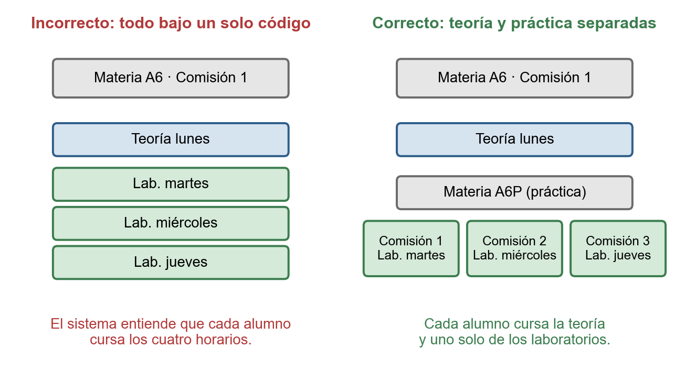

## 3.11 Análisis y discusión

> **Estado: estructura con marcadores.** Se completa con los
> resultados de la sección 3.10. Extensión orientativa: 5 a 7 páginas.

### 3.11.1 Métricas de la solución sobre datos reales

> **Para completar:** métricas de la corrida del caso de estudio
> (10.2), en una tabla numerada:
>
> - tiempo de resolución y tamaño del modelo (variables y
>   restricciones);
> - sobreocupación y subocupación agregadas, y su distribución por
>   aula o por franja;
> - cobertura: horarios asignados sobre el total, horarios virtuales
>   y sin aula;
> - ocupación por sede y por tipo de aula;
> - cumplimiento de las restricciones de política (sedes admisibles,
>   laboratorios, camino de cursada).
>
> Fuente: métricas de calidad del asignador y detalle de la corrida
> (`LPRunDB`).

### 3.11.2 Comparación con el proceso actual

> **Para completar:** comparación con el proceso manual descrito en
> la sección 3.3. Si se cuenta con la asignación real de un
> cuatrimestre, comparar cuantitativamente (ocupación, conflictos
> detectados); si no, comparar de forma cualitativa: tiempos,
> trazabilidad, detección temprana de conflictos y capacidad de
> simular escenarios.

### 3.11.3 Limitaciones del modelo y del sistema

> **Para completar:** limitaciones conocidas, por ejemplo:
>
> - trabajo sobre el patrón semanal (sin excepciones puntuales por
>   fecha);
> - dependencia de la calidad del inventario de aulas y del catálogo;
> - pronóstico de inscriptos con métodos simples;
> - uso local, sin gestión de usuarios concurrentes.

### 3.11.4 Criterios de uso y buenas prácticas

El sistema descansa sobre algunos supuestos acerca de cómo se cargan
los datos. Cuando se respetan, las validaciones y el asignador
razonan sobre la cursada real; cuando no, el modelo resuelve con
corrección un problema distinto del que se tiene. Resumimos los
principales en forma de directivas de uso.

1. **Cada comisión es un único esquema semanal que el alumno cursa
   completo.** El sistema entiende que quien está en una comisión
   asiste a todos sus horarios, y que de cada materia el alumno cursa
   una sola comisión. Por eso las materias deben definirse según cómo
   se organiza efectivamente su cursada. Un caso frecuente es el de
   una materia, digamos A6, con una teoría común y el laboratorio
   dividido en tres grupos: si los cuatro horarios se cargan bajo el
   código A6, en una sola comisión, el sistema concluye que cada
   alumno debe asistir a los tres laboratorios. La forma correcta es
   separar la práctica en una materia propia, A6P, con tres
   comisiones de un laboratorio cada una, como muestra la Figura
   @fig:a6. Así cada alumno cursa la teoría y uno solo de los grupos,
   y tanto la verificación de superposiciones como el reparto entre
   teoría y laboratorio (R4) se calculan sobre la carga real.

   {#fig:a6 width=14cm}

2. **Representación Gráfica.**

   ::: revisar
   **Para completar a mano:** describir el caso de Representación
   Gráfica, que presenta una situación análoga a la anterior, y cómo
   conviene cargarla.
   :::

3. **Las horas de la materia deben coincidir con las del
   cronograma.** Las horas de teoría y de laboratorio declaradas en
   la materia son la referencia contra la que se verifica cada
   comisión. Si el catálogo está desactualizado, el sistema marca
   como error un cronograma correcto, o deja pasar uno incorrecto.

4. **El inventario de aulas es la oferta del problema.** El asignador
   sólo usa las aulas cargadas, con la capacidad, el tipo y la sede
   que figuran en el sistema. Un laboratorio que no se declaró
   compatible con una materia no se le asigna nunca, aunque en la
   práctica sirva.

5. **Cada materia, en el grupo de materias que le corresponde.** El
   grupo determina en qué sedes puede dictarse. Conviene reservar el
   modo duro para las reglas institucionales firmes y usar el modo
   blando cuando la sede es sólo una preferencia: un modo duro
   innecesario reduce las alternativas y puede volver infactible el
   problema.

6. **Los inscriptos esperados son un pronóstico.** Se estiman a partir
   de la serie histórica, que sólo es útil si las inscripciones de
   años anteriores quedaron vinculadas a la materia correcta (con su
   código actual o mediante un código equivalente registrado).
   Cuando se sabe algo que la serie no refleja (un cambio de plan,
   una cohorte excepcional), conviene reemplazar el valor estimado.

7. **Las excepciones, justificadas y revisadas.** Ignorar un conflicto
   horario es legítimo cuando se sabe que las materias involucradas
   no comparten alumnos, pero cada excepción debería tener un motivo
   y revisarse en cada cuatrimestre.

8. **Fijar aulas a mano, con moderación.** Cada aula fijada le quita
   libertad al asignador; muchas fijaciones, o fijaciones
   incompatibles entre sí, pueden impedir que exista una solución.

9. **Un plan activo por ciclo y los demás como escenarios.** Los
   planes adicionales sirven para comparar alternativas sin tocar el
   plan con el que se trabaja; el que se comunica es siempre el
   activo.

### 3.11.5 Cumplimiento de los objetivos del anteproyecto

> **Para completar:** recorrer uno por uno los objetivos específicos
> del anteproyecto y señalar, para cada uno, en qué sección o
> resultado se verifica su cumplimiento (o por qué se cumplió
> parcialmente). Una tabla objetivo / evidencia / grado de
> cumplimiento funciona bien.
